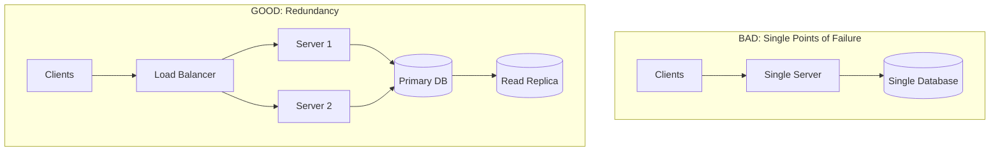

# Common Interview Mistakes

System design interviews have a 40-60% pass rate at top companies. Most failures are not from lack of knowledge but from avoidable mistakes — failing to clarify requirements, diving into implementation before architecture, or ignoring non-functional requirements entirely. This page covers 25 common mistakes organized by interview phase, with concrete fixes for each.

## Phase 1 Mistakes: Requirements

### Mistake 1: No Clarification Questions

**What happens:** You hear "Design Twitter" and immediately start drawing boxes. You design for the wrong scale, include wrong features, or miss critical requirements.

**The fix:** Always spend 3-5 minutes asking questions. Even if you think you know what Twitter does, the interviewer may want you to focus on a specific aspect.

```
BAD: "Okay, so Twitter has tweets, users, timelines... let me draw the architecture."

GOOD: "Before I start designing, let me clarify the scope. Which features
should I focus on — is it the posting and timeline, or search, or the
notification system? What scale are we targeting — 10 million DAU or
200 million? Is this read-heavy or write-heavy? Should I consider
real-time features like live tweets?"
```

### Mistake 2: Boiling the Ocean

**What happens:** You try to design every feature of the system in 45 minutes. You end up with a shallow design that covers everything but goes deep on nothing.

**The fix:** Agree on 3-4 core features with the interviewer. Explicitly state what you are NOT designing.

```
"I will focus on: posting tweets, the home timeline, and follow/unfollow.
I will NOT design: search, trending topics, ads, or direct messages unless
you want me to. This lets me go deep on the core read/write paths."
```

### Mistake 3: Not Writing Requirements Down

**What happens:** You discuss requirements verbally, then forget half of them during the design phase. You end up designing something that does not match what you agreed on.

**The fix:** Write down functional and non-functional requirements in a visible list. Refer back to it during your design.

## Phase 2 Mistakes: Estimation

### Mistake 4: Skipping Estimation Entirely

**What happens:** Without estimation, your architecture choices are unjustified. "I will use Redis" means nothing if you cannot say how much data fits in memory or how many QPS you expect.

**The fix:** Spend 2-3 minutes on back-of-envelope math. Even rough numbers are better than none.

```
"With 200M DAU, assuming 10 timeline reads per day, that is 2 billion
reads per day, or about 23,000 reads per second. At peak (3x), that
is ~70K RPS. This tells me we definitely need caching — a database
alone cannot handle 70K RPS for complex timeline queries."
```

### Mistake 5: Getting Lost in Math

**What happens:** You spend 10 minutes calculating exact storage requirements to 3 decimal places. The interviewer gets bored and you lose design time.

**The fix:** Round aggressively. Use powers of 10. The goal is to know whether you need 1 server or 1,000, not the exact number.

```
BAD: "Let me calculate... 200M users * 0.47 tweets per day * 287 bytes
average * 365 days / 1,073,741,824 bytes per GB..."

GOOD: "Roughly 200M users, maybe half tweet daily, so 100M tweets/day.
At ~300 bytes each, that is about 30 GB/day for text. About 10 TB/year.
That fits on one database — storage is not the bottleneck, QPS is."
```

### Mistake 6: Not Connecting Estimates to Architecture

**What happens:** You calculate numbers but do not use them to justify design decisions.

**The fix:** Every estimate should lead to an architectural insight.

```
"We estimated 70K peak RPS for timeline reads. A single PostgreSQL
instance maxes out around 10-20K simple reads per second. So we need
either heavy caching (Redis handles 100K+ ops/sec on a single node)
or read replicas. I will go with caching because our read pattern —
get timeline for user X — is a perfect cache-aside use case."
```

## Phase 3 Mistakes: High-Level Design

### Mistake 7: Jumping to Database Schema

**What happens:** You start with "Let me design the database tables" before drawing the architecture. You end up with tables that do not match the system's data flow.

**The fix:** Draw the high-level architecture FIRST. Show how data flows through the system. Database schema comes during the deep dive.

### Mistake 8: Single Point of Failure

**What happens:** Your architecture has one database, one server, or one anything. The interviewer asks "what if this goes down?" and your design falls apart.

**The fix:** For every component, consider redundancy.



### Mistake 9: Not Drawing Diagrams

**What happens:** You describe the architecture verbally. The interviewer struggles to follow, asks you to repeat, and you waste time.

**The fix:** Always draw. Use boxes for services, cylinders for databases, arrows for data flow. Label everything.

### Mistake 10: Overcomplicating the Initial Design

**What happens:** You start with microservices, Kafka, Kubernetes, a service mesh, and three different databases on your first diagram. The interviewer sees complexity without understanding the core design.

**The fix:** Start simple. A client, a server, a database. Then add complexity as you identify needs.

```
"Let me start with the simplest architecture that works, then we can
identify bottlenecks and add complexity where needed."
```

### Mistake 11: Not Separating Read and Write Paths

**What happens:** You have one service that handles both reads and writes. You cannot scale them independently or optimize for their different access patterns.

**The fix:** Think about reads and writes separately. Most systems are read-heavy, which suggests caching and read replicas.

### Mistake 12: Ignoring the API Layer

**What happens:** You draw backend services and databases but never define the API. The interviewer does not know how clients interact with your system.

**The fix:** Define key endpoints. You do not need to list every API, but the main ones should be clear.

```
POST /api/v1/tweets          — create a tweet
GET  /api/v1/timeline        — get home timeline
POST /api/v1/users/{id}/follow — follow a user
GET  /api/v1/search?q=...    — search tweets
```

## Phase 4 Mistakes: Deep Dive

### Mistake 13: Not Discussing Alternatives

**What happens:** You pick a technology and present it as the only option. The interviewer thinks you only know one solution.

**The fix:** Always mention at least one alternative and explain why you did not choose it.

```
"I chose PostgreSQL over Cassandra here because we need ACID transactions
for the payment flow. If this were a write-heavy analytics system with
no join requirements, Cassandra would be a better fit."
```

### Mistake 14: Ignoring Non-Functional Requirements

**What happens:** Your design handles the happy path but ignores availability, latency, consistency, monitoring, and security.

**The fix:** Address NFRs explicitly. Mention at least: availability strategy, consistency model, monitoring approach.

| NFR | Question to Ask Yourself |
|-----|------------------------|
| Availability | What happens when a component fails? |
| Latency | Can we meet the SLA? Where are the slow parts? |
| Consistency | What is the consistency model? Is stale data acceptable? |
| Scalability | What breaks at 10x the current scale? |
| Security | Authentication? Authorization? Data encryption? |
| Monitoring | How do we know something is wrong? |

### Mistake 15: Not Addressing Failure Scenarios

**What happens:** Everything in your design works perfectly. Real systems fail constantly.

**The fix:** For each component, state what happens when it fails.

```
"If Redis goes down, timelines fall back to database reads. Latency
increases from 5ms to 50ms, but the system remains functional.
If the database primary goes down, the read replica gets promoted
in about 30 seconds. During promotion, writes fail — clients get
a 503 and retry."
```

### Mistake 16: Premature Optimization

**What happens:** You spend 10 minutes designing a complex caching strategy for a system that handles 100 QPS. Or you shard a database that holds 10 GB of data.

**The fix:** Design for the scale in the requirements, not for 100x the requirements. Mention future optimizations but do not implement them.

```
"At our current 5,000 QPS, a single database with read replicas handles
this fine. If we grow to 50,000 QPS, we would add a caching layer. At
500,000 QPS, we would shard the database. But I will design for the
current requirements and note these as future scaling strategies."
```

### Mistake 17: Ignoring Data Consistency

**What happens:** You use caching, replicas, and async processing but never address what happens when data is stale or inconsistent.

**The fix:** Explicitly state your consistency model and its implications.

### Mistake 18: Not Knowing Your Database Choice

**What happens:** You say "I will use MongoDB" but cannot explain why, or how it handles your access patterns, or its consistency model.

**The fix:** Know 2-3 databases well enough to justify your choice. Understand their strengths, weaknesses, and consistency models.

### Mistake 19: Ignoring Monitoring and Observability

**What happens:** You design the system but never mention how you would know if something is wrong.

**The fix:** Mention key metrics, logging, and alerting.

```
"I would monitor: timeline API latency (p50, p95, p99), cache hit rate
(target >95%), fanout queue depth, database replication lag. Alert if
p99 latency exceeds 500ms or cache hit rate drops below 90%."
```

### Mistake 20: Not Explaining Data Flow

**What happens:** You draw boxes and arrows but never walk through how data moves through the system for a specific user action.

**The fix:** Walk through at least one end-to-end flow: "When a user posts a tweet, here is what happens step by step."

## Phase 5 Mistakes: Communication

### Mistake 21: Monologuing

**What happens:** You talk for 15 minutes straight without checking if the interviewer is following or wants to redirect.

**The fix:** Check in every 3-5 minutes. "Does this approach make sense? Should I go deeper on the caching layer, or would you prefer I discuss the database schema?"

### Mistake 22: Not Driving the Conversation

**What happens:** You wait for the interviewer to ask every question. You seem passive rather than leading the design.

**The fix:** Take ownership. "Now that we have the high-level design, I think the most interesting deep dive is the fanout strategy. Let me walk through that, but feel free to redirect me if you want to explore something else."

### Mistake 23: Getting Defensive

**What happens:** The interviewer challenges your design and you argue instead of adapting. "No, my approach is correct."

**The fix:** Treat challenges as collaboration. "That is a great point. You are right that this would not work for celebrities with millions of followers. Let me adjust the design to handle that case."

### Mistake 24: Using Buzzwords Without Understanding

**What happens:** You throw out terms like "event sourcing," "CQRS," "saga pattern" without being able to explain them if asked.

**The fix:** Only mention technologies and patterns you can explain in detail. It is better to say "a message queue" than "Kafka with exactly-once semantics using the transactional outbox pattern" if you cannot explain what those words mean.

### Mistake 25: Rushing to Finish

**What happens:** You try to cover every aspect of the design in the last 5 minutes, resulting in a rushed, unclear conclusion.

**The fix:** It is okay to not cover everything. A deep, well-reasoned partial design is better than a shallow complete one. Use the last 5 minutes for wrap-up and future improvements.

## Mistake Severity Guide

| Severity | Mistakes | Impact |
|----------|----------|--------|
| Interview-ending | 1 (no clarification), 7 (no architecture), 21 (monologue) | Strong reject |
| Major red flag | 4 (no estimation), 8 (SPOF), 14 (ignore NFRs) | Likely reject |
| Yellow flag | 10 (overcomplicate), 13 (no alternatives), 16 (premature optimization) | Mixed signal |
| Minor issue | 5 (math too detailed), 12 (no API), 19 (no monitoring) | Usually forgiven |

## Cross-References

- [System Design Interview Framework](/system-design/interview/framework) — the correct approach
- [Discussing Tradeoffs](/system-design/interview/discussing-tradeoffs) — how to articulate choices
- [Estimation Cheat Sheet](/system-design/interview/estimation-cheat-sheet) — numbers for estimation
- [Deep Dive Topics](/system-design/interview/deep-dive-topics) — what to go deep on
- [Mock Walkthrough](/system-design/interview/mock-walkthrough) — see the right approach in action

---

*The best way to avoid these mistakes is practice. Do at least 10 mock system design interviews before the real one. Record yourself, review the recording, and identify which mistakes you are making. Most people consistently make the same 3-4 mistakes — once you know yours, you can fix them.*
