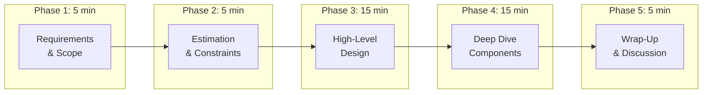
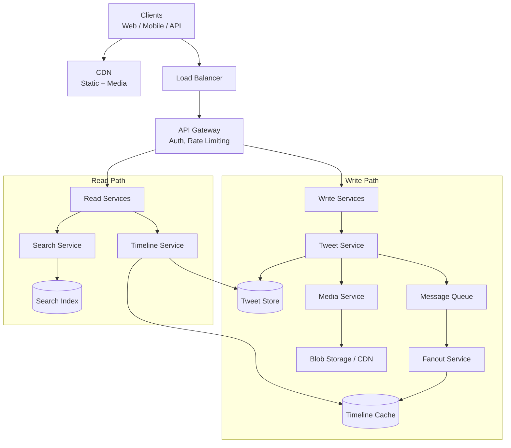

# System Design Interview Framework

System design interviews are not about finding the "right" answer — there is no single right answer. They test your ability to navigate ambiguity, make trade-offs, communicate clearly, and demonstrate architectural thinking. This framework gives you a repeatable structure for any 45-minute system design interview.

## The 45-Minute Breakdown



| Phase | Time | Goal | What Interviewer Evaluates |
|-------|------|------|--------------------------|
| Requirements | 5 min | Define what to build | Can you clarify ambiguity? |
| Estimation | 5 min | Quantify the problem | Can you do math under pressure? |
| High-Level Design | 15 min | Architecture skeleton | Can you think in systems? |
| Deep Dive | 15 min | Solve hard sub-problems | Can you go deep on trade-offs? |
| Wrap-Up | 5 min | Discuss improvements | Are you self-aware of limitations? |

## Phase 1: Requirements (5 Minutes)

Never start designing. Start by asking questions. The interviewer deliberately leaves the problem vague to see if you clarify or assume.

### Functional Requirements

What does the system do? Ask about:
- Core features (must-have for MVP)
- User actions (what can users do?)
- Data flow (what goes in, what comes out?)

### Non-Functional Requirements

How does the system behave? Ask about:
- Scale (how many users? daily active users?)
- Performance (latency requirements? throughput?)
- Availability (what are the SLA targets?)
- Consistency (is eventual consistency acceptable?)
- Geography (global users or single region?)

### Template Questions

```markdown
**Scope Questions:**
1. "What are the core features we must support?"
2. "Who are the users? How many DAU should we design for?"
3. "Is this read-heavy or write-heavy?"
4. "Do we need real-time updates or is eventual consistency okay?"
5. "What is the expected growth rate?"
6. "Are there any specific latency requirements?"
7. "Should we design for a single region or global?"
8. "What about mobile vs web clients?"
```

### Example: Design Twitter — Requirements Phase

**You say:** "Before I start designing, let me clarify the requirements. For core features, I am thinking: post tweets (280 chars + media), follow/unfollow users, view home timeline (tweets from people I follow), search tweets. Are there other features you want me to include?"

**Interviewer:** "Let's focus on those. Maybe add like and retweet."

**You say:** "For scale, what are we targeting? I will assume 300 million monthly active users, 200 million DAU. Is that reasonable?"

**Interviewer:** "That works."

**You say:** "I will also assume this is read-heavy — most users consume content rather than create it. Maybe 1,000:1 read-to-write ratio. The timeline should load in under 200ms. Eventual consistency is fine for the timeline, but the tweet itself should be durable once posted. Let me write these down."

```
Functional Requirements:
- Post tweets (text + media)
- Follow/unfollow users
- Home timeline (tweets from followed users)
- Like and retweet
- Search tweets

Non-Functional Requirements:
- 200M DAU
- Read-heavy: ~1,000:1 read-to-write ratio
- Timeline latency: <200ms
- Tweet durability: once posted, never lost
- Eventual consistency for timeline (seconds, not minutes)
- Global availability
```

## Phase 2: Estimation (5 Minutes)

Back-of-envelope calculations ground your design in reality. They help you choose the right storage, caching, and scaling strategies.

### The Formula Framework

```python
# Start with DAU and derive everything else
DAU = 200_000_000  # 200M daily active users

# Read/Write volume
avg_tweets_per_user_per_day = 0.5  # Most users do not tweet daily
tweets_per_day = DAU * avg_tweets_per_user_per_day  # 100M tweets/day
tweets_per_second = tweets_per_day / 86400  # ~1,150 TPS (writes)

avg_timeline_views_per_user = 10  # 10 timeline refreshes per day
timeline_reads_per_day = DAU * avg_timeline_views_per_user  # 2B reads/day
timeline_reads_per_second = timeline_reads_per_day / 86400  # ~23,000 RPS (reads)

# Storage
avg_tweet_size_bytes = 300  # text + metadata (no media)
daily_tweet_storage = tweets_per_day * avg_tweet_size_bytes  # ~30 GB/day
yearly_tweet_storage_tb = daily_tweet_storage * 365 / (1024**4)  # ~10 TB/year

# Media storage (images/videos)
tweets_with_media_pct = 0.2  # 20% have media
avg_media_size_mb = 2
daily_media_storage_tb = (
    tweets_per_day * tweets_with_media_pct * avg_media_size_mb
) / (1024**2)  # ~38 TB/day

# Bandwidth
peak_multiplier = 3  # Peak is ~3x average
peak_timeline_rps = timeline_reads_per_second * peak_multiplier  # ~69,000 RPS
avg_timeline_response_kb = 50  # 50 tweets * 1KB each
peak_bandwidth_gbps = (
    peak_timeline_rps * avg_timeline_response_kb * 8
) / (1024**2)  # ~26 Gbps

print(f"""
Estimation Summary:
- Write TPS: ~{tweets_per_second:,.0f}
- Read RPS: ~{timeline_reads_per_second:,.0f} (peak: ~{peak_timeline_rps:,.0f})
- Daily tweet storage: ~{daily_tweet_storage / 1e9:.0f} GB
- Daily media storage: ~{daily_media_storage_tb:.0f} TB
- Peak bandwidth: ~{peak_bandwidth_gbps:.0f} Gbps
- Yearly text storage: ~{yearly_tweet_storage_tb:.0f} TB
""")
```

**You say to the interviewer:** "Let me do some quick estimates. With 200M DAU and maybe half a tweet per user per day, that is about 100 million tweets per day, or roughly 1,200 writes per second. For reads, if users check their timeline 10 times a day, that is 2 billion timeline reads per day, about 23,000 reads per second — with peaks 3x higher. Storage-wise, text tweets are small, maybe 30 GB per day, but media is significant — about 40 TB per day for images and videos. This tells me we need a read-heavy architecture with strong caching and a separate media storage layer."

## Phase 3: High-Level Design (15 Minutes)

Draw the architecture. Start with the user, work inward through each component.

### Design Template



### Example: Design Twitter — High-Level Design

**You say:** "Let me walk through the high-level architecture. I will separate the write path from the read path since this is a read-heavy system."

**Write path:** "When a user posts a tweet, it goes through the API Gateway to the Tweet Service, which stores it in the Tweet Store — I am thinking a sharded database, maybe PostgreSQL or a wide-column store like Cassandra, sharded by tweet ID for writes and user ID for user-timeline reads. Media uploads go directly to blob storage via presigned URLs, so our servers never handle large files."

**Read path:** "For the home timeline, I will use fanout-on-write: when a tweet is posted, a Fanout Service pushes it into the timeline cache (Redis) of each follower. When a user opens the app, the Timeline Service reads their pre-computed timeline from Redis. For celebrities with millions of followers, I will use fanout-on-read instead — their tweets are fetched and merged at read time to avoid millions of cache writes."

**Search:** "Tweets are also sent to a search indexer — likely Elasticsearch — for full-text search. This can be async via the message queue."

## Phase 4: Deep Dive (15 Minutes)

The interviewer will pick 1-2 components and ask you to go deeper. Be ready to discuss:

### Common Deep Dive Areas

| Area | What They Ask | What to Cover |
|------|-------------|---------------|
| Database schema | "How would you store tweets?" | Table design, indexes, sharding key |
| API design | "What are the API endpoints?" | REST endpoints, request/response, pagination |
| Caching strategy | "How does the cache work?" | Cache-aside vs write-through, invalidation, eviction |
| Data partitioning | "How do you shard the database?" | Partition key, consistent hashing, rebalancing |
| Consistency model | "What happens if the timeline is stale?" | Eventual consistency trade-offs, read-your-writes |
| Scaling bottleneck | "What breaks at 10x the scale?" | Identify the bottleneck, propose a fix |

### Example: Design Twitter — Deep Dive on Fanout

**Interviewer:** "Tell me more about the fanout service. How does it handle celebrities?"

**You say:**
```
For normal users (say, <10K followers):
- Fan-out-on-write: push tweet into each follower's timeline cache
- Async via message queue: Tweet Service emits "TweetCreated" event
- Fanout workers consume events, look up follower list, write to Redis
- Each user's timeline is a sorted set in Redis (score = timestamp)
- ZADD timeline:{user_id} {timestamp} {tweet_id}
- Timeline Service does ZREVRANGE to get latest 50 tweets

For celebrities (>10K followers):
- Fan-out-on-read: do NOT push to followers' caches
- When a user loads their timeline:
  1. Get pre-computed timeline from Redis (non-celebrity tweets)
  2. Get list of celebrities the user follows
  3. Fetch latest tweets from each celebrity (small number of reads)
  4. Merge and sort in-memory
  5. Return merged timeline

The threshold (10K) is tunable. Twitter uses ~5K.

Why hybrid? Justin Bieber has 100M followers. Pushing one tweet
to 100M Redis keys would take minutes and cause massive write
amplification. Fetching from 10 celebrity accounts and merging
is much cheaper.
```

### Data Model Deep Dive

```sql
-- Core tables (simplified)
CREATE TABLE tweets (
    tweet_id    BIGINT PRIMARY KEY,  -- Snowflake ID (time-ordered)
    user_id     BIGINT NOT NULL,
    content     TEXT NOT NULL,
    media_urls  TEXT[],
    created_at  TIMESTAMP NOT NULL DEFAULT NOW(),
    like_count  INT DEFAULT 0,
    retweet_count INT DEFAULT 0,
    INDEX idx_user_tweets (user_id, created_at DESC)
);
-- Sharded by tweet_id for write distribution
-- Secondary index on user_id for "show user's tweets"

CREATE TABLE follows (
    follower_id  BIGINT NOT NULL,
    followee_id  BIGINT NOT NULL,
    created_at   TIMESTAMP NOT NULL DEFAULT NOW(),
    PRIMARY KEY (follower_id, followee_id),
    INDEX idx_followers (followee_id, follower_id)
);
-- Sharded by follower_id (efficient: "who do I follow?")
-- Secondary index for "who follows me?" (fanout lookup)

CREATE TABLE likes (
    user_id     BIGINT NOT NULL,
    tweet_id    BIGINT NOT NULL,
    created_at  TIMESTAMP NOT NULL DEFAULT NOW(),
    PRIMARY KEY (user_id, tweet_id)
);
```

### API Design Deep Dive

```
POST /api/v1/tweets
  Body: { "content": "Hello world", "media_ids": ["abc123"] }
  Response: 201 { "tweet_id": "1234567890", "created_at": "..." }

GET /api/v1/timeline?cursor={tweet_id}&limit=50
  Response: 200 {
    "tweets": [...],
    "next_cursor": "1234567840",
    "has_more": true
  }
  Note: Cursor-based pagination (not offset-based) for real-time feeds

POST /api/v1/tweets/{tweet_id}/like
  Response: 200 { "like_count": 42 }
  Idempotent: liking twice is a no-op

GET /api/v1/search?q=system+design&cursor=...&limit=20
  Response: 200 { "tweets": [...], "next_cursor": "..." }
```

## Phase 5: Wrap-Up (5 Minutes)

Proactively discuss what you would improve. This shows self-awareness and depth.

**You say:** "If I had more time, here is what I would address:"

1. **Monitoring and observability:** Distributed tracing for tweet creation flow, dashboard for fanout latency, alerting on timeline cache hit rates
2. **Abuse prevention:** Rate limiting on tweet creation, spam detection ML pipeline, content moderation queue
3. **Analytics:** Engagement metrics pipeline (impressions, clicks, dwell time) — probably Kafka to ClickHouse
4. **Multi-region:** Active-active deployment in 3+ regions, CRDTs for like counts, conflict resolution for follows
5. **Cost optimization:** Timeline cache TTL (evict inactive users), cold storage for old tweets, tiered storage for media

## Framework Checklist

Use this mental checklist during any system design interview:

```markdown
□ Requirements clarified (functional + non-functional)
□ Scale estimated (DAU, QPS, storage, bandwidth)
□ High-level architecture drawn
□ Write path explained
□ Read path explained
□ Database choice justified
□ Caching strategy explained
□ Key trade-offs discussed
□ At least one deep dive completed
□ Failure scenarios addressed
□ Future improvements mentioned
```

## Common Mistakes to Avoid

| Mistake | Why It Is Bad | What to Do Instead |
|---------|-------------|-------------------|
| Jumping to solution | Missed requirements, wrong design | Always clarify requirements first |
| Not estimating | Cannot justify architecture choices | Do estimation, even rough ones |
| Monologuing | Interviewer loses engagement | Check in: "Does this make sense? Should I go deeper?" |
| Not drawing | Hard to follow verbal architecture | Always draw diagrams |
| Over-engineering | Shows poor judgment | Design for current scale, mention future scaling |
| Only happy path | Ignoring failures is a red flag | Discuss what happens when X fails |

## Cross-References

- [Estimation Cheat Sheet](/system-design/interview/estimation-cheat-sheet) — numbers you need for estimation
- [Discussing Tradeoffs](/system-design/interview/discussing-tradeoffs) — how to articulate trade-offs
- [Common Mistakes](/system-design/interview/common-mistakes) — 25 mistakes with fixes
- [Deep Dive Topics](/system-design/interview/deep-dive-topics) — what interviewers probe
- [Reusable Templates](/system-design/interview/templates) — architecture skeletons for common systems
- [Mock Walkthrough](/system-design/interview/mock-walkthrough) — full 45-minute transcript

---

*The framework is your scaffolding, not your script. Internalize the structure so you can adapt to any question. The best candidates make the interview feel like a collaborative design session, not a memorized presentation.*
