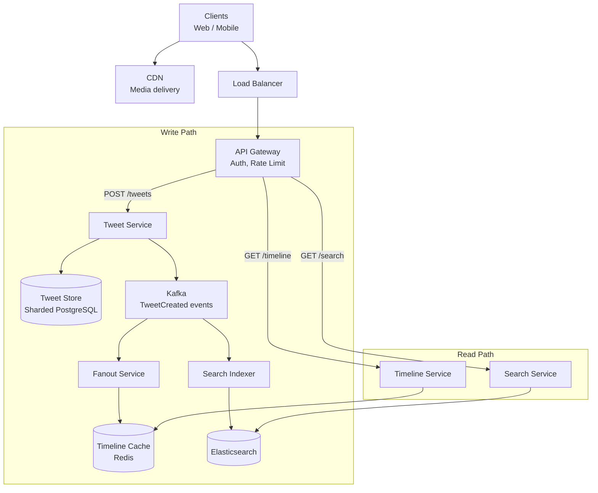

# Mock Interview Walkthrough

This is a realistic 45-minute system design interview transcript for "Design Twitter." It shows what a strong candidate says at each stage, how they handle interviewer pushback, and where they draw diagrams. Read this as if you are watching over the candidate's shoulder.

**Format:** The candidate's words are in regular text. Interviewer questions are in **bold**. Internal notes (what the candidate is thinking but not saying) are in *italics*.

---

## Minute 0-5: Requirements Clarification

**Interviewer: "Let's design Twitter. Where would you like to start?"**

"Great question. Before I jump into the architecture, I want to make sure I am designing the right thing. Let me clarify the scope and requirements."

"For core features, I am thinking we should focus on: posting tweets — text up to 280 characters with optional media, the follow/unfollow relationship between users, and the home timeline — the feed of tweets from people you follow. Are there other features you would like me to include?"

**"Those are good. Let's also include search — being able to search for tweets by keyword."**

"Perfect. So four features: post tweets, follow/unfollow, home timeline, and search. I will explicitly NOT design: direct messages, trending topics, ads, or notifications, unless you want me to go there later."

*Thinking: I am establishing scope to avoid boiling the ocean.*

"For non-functional requirements, let me state some assumptions and you can correct me:"

"Scale: I will assume 200 million daily active users. About 500 million tweets per day — though most users consume content rather than create it. This tells me the system is massively read-heavy."

**"Those numbers work. What about latency?"**

"Timeline should load in under 200 milliseconds — users expect instant feed loading. Search can be slightly slower, maybe under 500 milliseconds. Tweets must be durable — once a user posts and gets confirmation, that tweet cannot be lost."

"For availability, I will target 99.99% — about 52 minutes of downtime per year. And I think eventual consistency is acceptable for the timeline — if a tweet appears in a follower's feed 2-3 seconds after posting, that is fine."

*Writing on whiteboard:*

```
REQUIREMENTS:
Functional: Post tweet, Follow/Unfollow, Home timeline, Search
Non-functional:
  - 200M DAU, 500M tweets/day
  - Read-heavy (~1000:1 read-to-write)
  - Timeline latency: <200ms
  - Search latency: <500ms
  - Availability: 99.99%
  - Eventual consistency OK for timeline
```

**"That looks good. Let's proceed."**

## Minute 5-10: Estimation

"Let me do some quick math to understand the scale."

"Tweets per second: 500 million per day divided by about 100,000 seconds in a day gives us roughly 5,000 tweets per second for writes."

"For reads — timeline views — if each of the 200 million DAU checks their timeline 10 times per day, that is 2 billion timeline reads per day, which is about 23,000 reads per second. At peak — let's say 3x average — that is about 70,000 reads per second."

*Thinking: 70K RPS is significant. A single database cannot handle this. We need caching.*

"Storage: each tweet is maybe 300 bytes for text plus metadata. 500 million tweets times 300 bytes is about 150 GB per day for text. Over 5 years, that is roughly 275 TB — large but manageable with sharding."

"Media is the real storage challenge. If 20% of tweets have an image averaging 2 MB, that is 100 million images times 2 MB = 200 TB per day. This must go to object storage like S3 with a CDN in front."

"Bandwidth: at peak, 70,000 timeline reads per second, each returning maybe 50 KB of data, that is about 3.5 GB per second or about 28 Gbps outbound."

```
ESTIMATION:
Write: ~5,000 tweets/sec
Read: ~23K timeline reads/sec (peak: ~70K)
Storage: 150 GB/day text, 200 TB/day media
Bandwidth: ~28 Gbps peak outbound

Key insight: Read-heavy → Need aggressive caching
Key insight: Media-heavy → CDN + Object Storage
```

**"Good estimates. What does this tell you about the architecture?"**

"This tells me three things. First, we need a caching layer — no database handles 70K reads per second for complex timeline queries. Second, media must bypass our servers entirely — presigned URLs to S3 with CDN delivery. Third, the database will need sharding eventually, but we can start with read replicas for the read volume."

## Minute 10-25: High-Level Design

"Let me draw the high-level architecture. I will separate the write path from the read path since they have very different characteristics."

*Drawing on whiteboard:*



"Let me walk through each path."

### Write Path

"When a user posts a tweet, the request goes through the load balancer and API gateway — which handles authentication and rate limiting — to the Tweet Service. The Tweet Service does two things:"

"First, it persists the tweet in our Tweet Store. I am using PostgreSQL here, sharded by tweet ID using Snowflake IDs so tweets are time-ordered. The tweet is now durable."

"Second, it publishes a TweetCreated event to Kafka. I chose Kafka because multiple consumers need this event independently — the Fanout Service for timelines, the Search Indexer for full-text search, and potentially future consumers like analytics or notification services."

"The Fanout Service is the most interesting component. It takes the TweetCreated event, looks up the poster's followers, and writes the tweet ID into each follower's timeline in Redis. Each timeline is a Redis sorted set with the tweet timestamp as the score."

**"What happens when a user with 50 million followers tweets?"**

"Great question — this is the celebrity problem. For a user with 50 million followers, fanning out to 50 million Redis keys would be incredibly slow and expensive. So I use a hybrid approach."

"I set a threshold — let's say 10,000 followers. Users below this threshold use fanout-on-write: their tweets are pushed to followers' timelines. Users above this threshold use fanout-on-read: their tweets are NOT pushed."

"When the Timeline Service builds a user's feed, it does two things: first, it reads the pre-computed timeline from Redis (tweets from non-celebrity accounts). Second, it checks which celebrities the user follows, fetches their latest tweets directly from the Tweet Store, and merges them with the pre-computed timeline."

*Thinking: This is a key trade-off moment. The interviewer wants to see me reason about it.*

"The trade-off is that timeline reads are slightly more complex and a bit slower — maybe an extra 20 milliseconds for the celebrity tweet merge. But this is much better than the alternative: a celebrity tweet causing millions of cache writes that could take minutes to complete."

### Read Path

"For the timeline read path: the Timeline Service first checks Redis for the pre-computed timeline. For most users, this is a single ZREVRANGE command — O(log N) — returning the top 50 tweet IDs. Then it batch-fetches the tweet details, which can be cached separately."

"For search: the Search Indexer consumes TweetCreated events from Kafka and indexes them in Elasticsearch. This is async — there is a 1-2 second delay between posting and searchability, which is acceptable."

**"How do you handle media uploads?"**

"Media never touches our application servers. When a user wants to upload an image, the client requests a presigned URL from our API. The API generates an S3 presigned PUT URL and returns it. The client uploads directly to S3. After upload, the client sends the S3 key back to our API, which stores it with the tweet metadata."

"For serving media, we put CloudFront CDN in front of S3. The CDN caches popular images at edge locations worldwide, so most requests never hit S3."

## Minute 25-40: Deep Dive

**"Let's go deeper on the timeline. Walk me through the data flow when a user opens the app."**

"Sure. Let me trace through the exact flow."

"Step 1: The mobile app sends GET /api/v1/timeline?cursor=1679750400&limit=50 with the user's auth token."

"Step 2: The API Gateway validates the token and extracts user_id."

"Step 3: The Timeline Service receives the request. It calls Redis: ZREVRANGEBYSCORE timeline:user_123 +inf 1679750400 LIMIT 0 50. This returns the 50 most recent tweet IDs from the pre-computed timeline."

"Step 4: If the user follows any celebrities (stored in a separate Redis set), the service fetches their latest tweets directly. Let's say the user follows 3 celebrities — that is 3 simple queries to the Tweet Store or a tweet cache."

"Step 5: Merge the pre-computed timeline with celebrity tweets, sort by timestamp, take the top 50."

"Step 6: For each tweet ID, fetch the full tweet data. This is a batch operation — MGET from a tweet cache in Redis. Cache miss falls through to the Tweet Store database."

"Step 7: Enrich tweets with author information (profile picture, display name) — another batch fetch from a user cache."

"Step 8: Return the response with the next cursor for pagination."

"Total time budget: Redis ZREVRANGEBYSCORE is sub-millisecond. Celebrity fetch is maybe 5 ms. Tweet detail batch fetch is 5-10 ms. User enrichment is 5 ms. Total: well under our 200 ms target."

**"How do you handle the case where a user tweets and then immediately refreshes their own timeline?"**

"This is the read-your-writes consistency problem. After a user posts a tweet, there is a small window — maybe 500 milliseconds to 2 seconds — where the fanout has not yet reached their own timeline cache."

"I handle this by having the Tweet Service write the tweet ID directly to the poster's own timeline in Redis as part of the write path — before the Kafka event. So the poster always sees their own tweet immediately. The Fanout Service skips the poster when it processes the event later."

*Thinking: This shows I understand consistency trade-offs without over-engineering.*

**"What happens if Redis goes down?"**

"If the Redis cluster fails, timelines degrade but do not break entirely. The Timeline Service falls back to computing the timeline from the database: query the follow graph to get followed user IDs, then query the Tweet Store for recent tweets from those users. This is much slower — maybe 500 ms instead of 50 ms — but functional."

"I would also design the Redis cluster for high availability: Redis Sentinel for automatic failover, with at least 3 replicas per shard. We can tolerate losing one replica without any impact."

"For the timeline cache specifically, the data is rebuildable — it is derived from the Tweet Store and follow graph. So even a total Redis loss means slow timelines for a few minutes while we repopulate, not data loss."

### Database Schema Deep Dive

**"Walk me through the database schema."**

```sql
-- Tweets: sharded by tweet_id (Snowflake ID, time-ordered)
CREATE TABLE tweets (
    tweet_id    BIGINT PRIMARY KEY,
    user_id     BIGINT NOT NULL,
    content     VARCHAR(280) NOT NULL,
    media_urls  TEXT[],
    reply_to    BIGINT,                 -- NULL for original tweets
    created_at  TIMESTAMP NOT NULL,

    INDEX idx_user_tweets (user_id, created_at DESC)
);

-- Follows: sharded by follower_id
CREATE TABLE follows (
    follower_id  BIGINT NOT NULL,
    followee_id  BIGINT NOT NULL,
    created_at   TIMESTAMP NOT NULL,
    PRIMARY KEY (follower_id, followee_id),
    INDEX idx_followees (followee_id)
);

-- Likes: sharded by tweet_id
CREATE TABLE likes (
    tweet_id    BIGINT NOT NULL,
    user_id     BIGINT NOT NULL,
    created_at  TIMESTAMP NOT NULL,
    PRIMARY KEY (tweet_id, user_id)
);
```

"I shard tweets by tweet_id because that gives even write distribution — Snowflake IDs spread across the hash space evenly. The index on (user_id, created_at DESC) supports the 'show me all tweets by user X' query efficiently, even though it is a secondary index on a different shard key."

"Follows are sharded by follower_id because the most common query is 'who does user X follow?' — used by the fanout service and timeline assembly."

**"Why not shard tweets by user_id?"**

"If I shard by user_id, all of a user's tweets are on one shard. That is great for 'show user's tweets' but terrible for write distribution — a viral user's shard becomes a hot spot. With tweet_id sharding using Snowflake IDs, writes are distributed evenly. The trade-off is that 'all tweets by user X' requires a scatter-gather across shards, but that query is less frequent and can be served from a secondary index or a denormalized user-tweets table."

## Minute 40-45: Wrap-Up

**"What would you improve if you had more time?"**

"A few things I would address:"

"First, monitoring and alerting. I would track: timeline API p99 latency, fanout queue depth and lag, cache hit rates (target above 95%), and tweet store replication lag. Alert if p99 exceeds 500 ms or cache hit rate drops below 90%."

"Second, abuse prevention. Rate limiting on the API gateway — maybe 300 tweets per hour per user. A spam detection ML model running on the tweet creation pipeline. Content moderation queue for flagged tweets."

"Third, I glossed over the search service. Elasticsearch is the right choice, but I would want to discuss the analysis pipeline — tokenization, stop words, language detection — and the ranking model. BM25 as a baseline, potentially boosted by engagement signals like likes and retweets."

"Fourth, multi-region deployment. For a global service, I would want active-active deployment in at least 3 regions. Tweets are replicated across regions asynchronously. Timelines are computed locally per region. The challenge is the follow graph — a user in Europe following a user in Asia needs cross-region replication."

"Finally, I did not discuss analytics. Every tweet impression, click, and engagement action would flow through Kafka to a data warehouse — probably ClickHouse or BigQuery — for analytics and ML feature generation."

**"Good design. Thanks for walking me through it."**

---

## What Made This a Strong Performance

| Signal | Where It Appeared |
|--------|------------------|
| Clarified requirements | First 5 minutes: asked about features, scale, latency |
| Estimation connected to design | "70K RPS tells me we need caching" |
| Drew clear diagrams | Labeled components, separate read/write paths |
| Addressed the hard problem | Celebrity fanout: hybrid approach with clear reasoning |
| Handled pushback gracefully | "Great question" + adapted design (Redis fallback, read-your-writes) |
| Discussed trade-offs | Tweet sharding: user_id vs tweet_id with explicit reasoning |
| Mentioned failure handling | Redis failure, cache miss fallback |
| Proactive wrap-up | Monitoring, abuse, search, multi-region, analytics |
| Time management | 5/5/15/15/5 split matched the framework |

## Anti-Patterns This Candidate Avoided

| Anti-Pattern | How They Avoided It |
|-------------|-------------------|
| No clarification | Asked about features, scale, and latency upfront |
| Jumping to schema | Drew architecture first, schema during deep dive |
| Over-engineering | Started with what works, added complexity when prompted |
| Monologuing | Checked in after each section, invited feedback |
| Ignoring failures | Proactively discussed Redis failure, cache misses |
| Buzzword-dropping | Explained WHY Kafka, WHY Redis, WHY PostgreSQL |

## Cross-References

- [System Design Interview Framework](/system-design/interview/framework) — the structure this candidate followed
- [Common Mistakes](/system-design/interview/common-mistakes) — what to avoid
- [Discussing Tradeoffs](/system-design/interview/discussing-tradeoffs) — how to articulate choices
- [Deep Dive Topics](/system-design/interview/deep-dive-topics) — going deeper on any component
- [Estimation Cheat Sheet](/system-design/interview/estimation-cheat-sheet) — numbers used in estimation
- [Scalability Patterns](/system-design/patterns/scalability-patterns) — patterns used in this design

---

*This walkthrough is a template for how to communicate in a system design interview. The specific design decisions matter less than the process: clarify, estimate, design broadly, dive deep on the hard parts, and proactively discuss what you would improve. Practice this flow 10 times with different problems and you will internalize the rhythm.*
