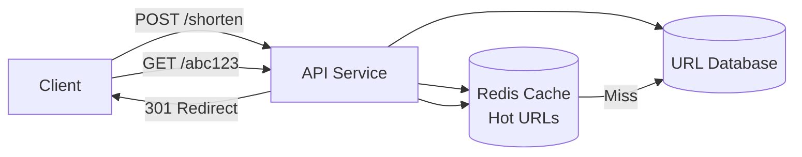
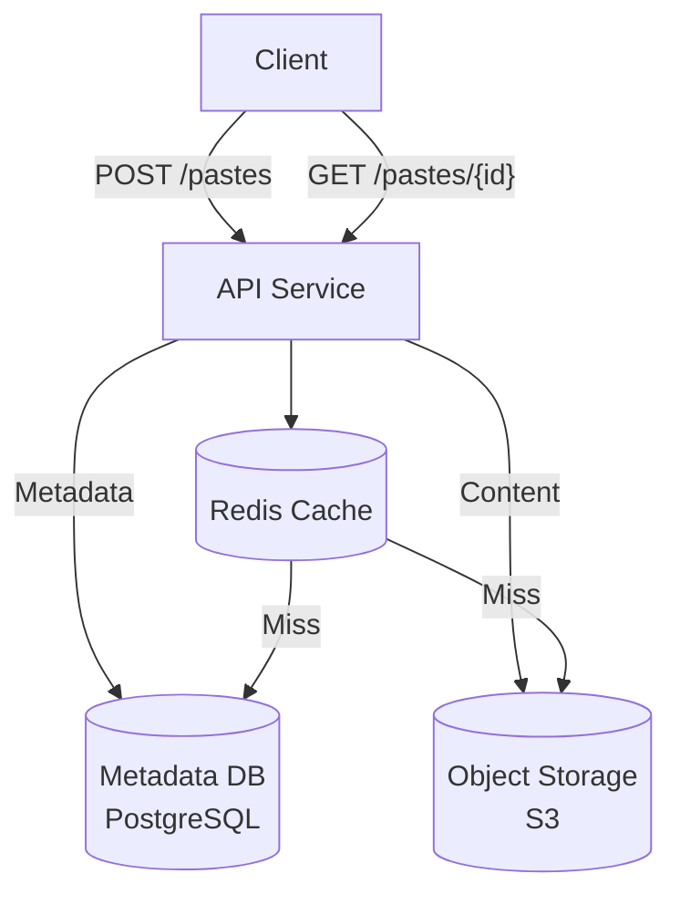
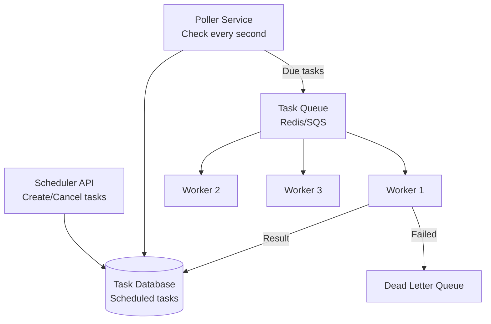
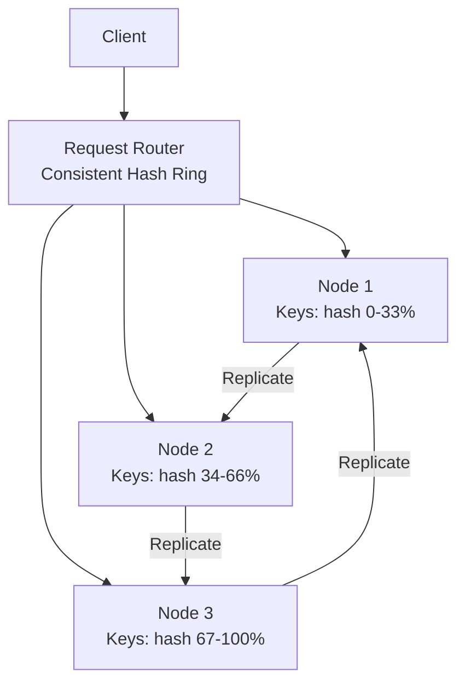
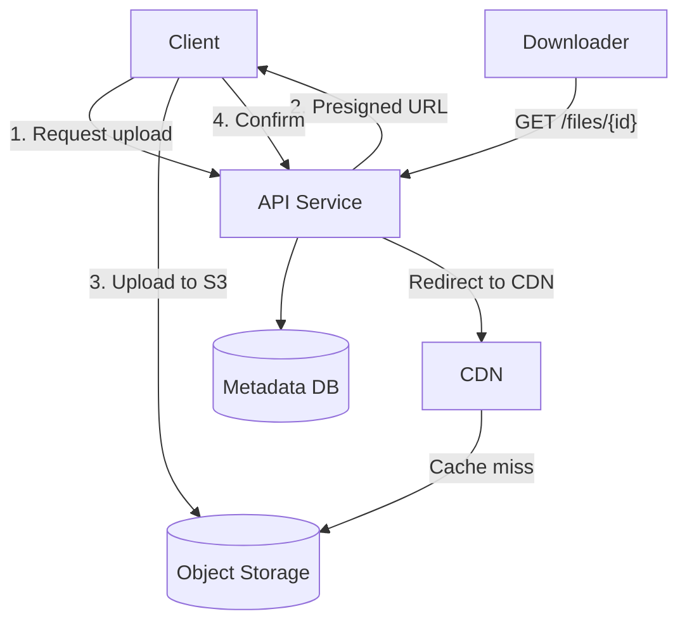

# Practice Questions: Easy

These 10 problems are the building blocks. They test one or two core concepts each, and most can be designed in 30 minutes. Master these before moving to medium and hard problems — every complex system is a combination of these simple components.

## Problem 1: URL Shortener

**Design a URL shortener like bit.ly.**

### Requirements

- Shorten a long URL to a short URL (e.g., `bit.ly/abc123`)
- Redirect short URL to original long URL
- Optional: custom aliases, expiration, analytics

### Estimation Hints

- 100M URLs created per day, 10:1 read-to-write ratio
- 7-character short URL using base62 gives 62^7 = 3.5 trillion combinations
- Each URL record: ~500 bytes. Daily storage: ~50 GB

### Solution Outline



**Key decisions:**
- **ID generation:** Base62 encode a counter or use the first 7 chars of MD5 hash
- **Database:** PostgreSQL with index on short_url. At this scale, one instance with read replicas suffices
- **Caching:** Cache-aside for popular URLs (top 20% of URLs get 80% of traffic)
- **Redirect:** Use 301 (permanent) for SEO or 302 (temporary) if you need analytics

```sql
CREATE TABLE urls (
    id          BIGSERIAL PRIMARY KEY,
    short_code  VARCHAR(7) UNIQUE NOT NULL,
    long_url    TEXT NOT NULL,
    user_id     BIGINT,
    created_at  TIMESTAMP DEFAULT NOW(),
    expires_at  TIMESTAMP,
    click_count INTEGER DEFAULT 0,
    INDEX idx_short_code (short_code)
);
```

**What the interviewer looks for:** Collision handling, base62 encoding, caching strategy, analytics consideration.

## Problem 2: Paste Bin

**Design a Pastebin for sharing text snippets.**

### Requirements

- Create a paste with text content, get a unique URL
- Read a paste by URL
- Optional: expiration, syntax highlighting, public/private

### Estimation Hints

- 5M pastes per day, average paste size 10 KB
- Daily storage: 5M x 10 KB = 50 GB
- Read-heavy: 10:1 read-to-write ratio

### Solution Outline



**Key insight:** Separate metadata (title, language, expiration) from content (the actual paste text). Metadata goes in PostgreSQL, content goes in S3. This keeps the database small and leverages cheap object storage.

## Problem 3: Rate Limiter

**Design a rate limiter for an API.**

### Requirements

- Limit requests per user/IP per time window
- Return 429 Too Many Requests when exceeded
- Support multiple rules (100/min, 1000/hour)

### Solution Outline

```python
import time


class SlidingWindowRateLimiter:
    """Sliding window rate limiter using Redis sorted sets."""

    def __init__(self, redis_client):
        self.redis = redis_client

    async def is_allowed(
        self, key: str, max_requests: int, window_seconds: int
    ) -> tuple[bool, dict]:
        now = time.time()
        window_start = now - window_seconds

        pipe = self.redis.pipeline()
        # Remove entries outside the window
        pipe.zremrangebyscore(key, 0, window_start)
        # Count entries in window
        pipe.zcard(key)
        # Add current request
        pipe.zadd(key, {f"{now}:{id(now)}": now})
        # Set expiry on the key
        pipe.expire(key, window_seconds)

        results = await pipe.execute()
        current_count = results[1]

        if current_count >= max_requests:
            return False, {"retry_after": window_seconds}
        return True, {"remaining": max_requests - current_count - 1}
```

**Algorithms to discuss:** Fixed window, sliding window log, sliding window counter, token bucket, leaky bucket. See our [Rate Limiting](/system-design/distributed-systems/rate-limiting) page.

## Problem 4: Task Scheduler

**Design a distributed task scheduler (like cron).**

### Requirements

- Schedule tasks to run at a specific time or on a recurring schedule
- At-least-once execution guarantee
- Handle worker failures (retry, dead letter)

### Solution Outline



**Key decisions:**
- **Poller:** Queries database for tasks where `scheduled_time <= NOW()` and `status = PENDING`
- **Deduplication:** Use distributed lock (Redis SETNX) to prevent multiple pollers from picking the same task
- **Idempotency:** Workers must handle receiving the same task twice
- **Recurring tasks:** After execution, schedule the next occurrence

## Problem 5: Key-Value Store

**Design a distributed key-value store like Redis.**

### Requirements

- GET(key) and SET(key, value) operations
- Sub-millisecond latency
- Data partitioned across nodes
- Replication for fault tolerance

### Solution Outline



**Key components:**
- **Consistent hashing** for partition assignment (see [Consistent Hashing](/system-design/distributed-systems/consistent-hashing))
- **In-memory storage** with optional disk persistence (AOF or RDB snapshots)
- **Replication:** Leader-follower per partition, configurable consistency (W+R>N for strong)
- **Failure detection:** Gossip protocol for node health

## Problem 6: Unique ID Generator

**Design a distributed unique ID generation service.**

### Requirements

- Generate unique IDs across multiple data centers
- IDs should be roughly time-ordered
- 64-bit IDs (fit in a database BIGINT)
- High throughput (10K+ IDs per second per node)

### Solution Outline

Use the **Snowflake** approach. See our [Distributed ID Generation](/system-design/patterns/id-generation) page for full implementation.

**Key discussion points:**
- Why not UUID? (128-bit, not time-ordered, poor B-tree performance)
- Why not auto-increment? (Single point of failure, does not work across nodes)
- Clock skew handling (what if NTP adjusts the clock backward?)
- Bit layout trade-offs (more timestamp bits = longer lifespan, fewer machine bits = fewer nodes)

## Problem 7: Notification Service

**Design a notification delivery service.**

### Requirements

- Send notifications via push, email, SMS, in-app
- User preference management
- Rate limiting per user
- At-least-once delivery with deduplication

### Solution Outline

See our [Notification Patterns](/system-design/patterns/notification-patterns) page for the full architecture.

**Quick skeleton:**
- API receives notification request with user_id, type, content, priority
- Preference service checks if user wants this notification on this channel
- Priority queue routes by urgency (security alert > marketing email)
- Per-channel workers handle delivery (APNs for iOS push, FCM for Android, SES for email)
- Idempotency key prevents duplicate delivery on retry

## Problem 8: File Sharing Service

**Design a file sharing service like Dropbox (simplified).**

### Requirements

- Upload files, get a shareable link
- Download files via link
- File size up to 5 GB

### Solution Outline



**Key decisions:**
- **Presigned URLs** for direct upload/download (keep files off your servers)
- **Multipart upload** for large files (>100 MB)
- **Chunking** for resumable uploads (each chunk is a separate upload, assemble on completion)
- **Deduplication:** Hash file content, store once, link multiple references

## Problem 9: Parking Lot API

**Design an API for a smart parking lot system.**

### Requirements

- Track available spots by type (compact, regular, large)
- Assign a spot when a vehicle enters
- Release a spot when a vehicle exits
- Calculate parking fee

### Solution Outline

```sql
CREATE TABLE parking_spots (
    spot_id     INTEGER PRIMARY KEY,
    floor       INTEGER NOT NULL,
    spot_type   VARCHAR(10) NOT NULL,  -- 'compact', 'regular', 'large'
    is_occupied BOOLEAN DEFAULT FALSE,
    vehicle_id  VARCHAR(20),
    occupied_at TIMESTAMP
);

CREATE TABLE parking_tickets (
    ticket_id   BIGSERIAL PRIMARY KEY,
    vehicle_id  VARCHAR(20) NOT NULL,
    spot_id     INTEGER NOT NULL,
    entry_time  TIMESTAMP NOT NULL DEFAULT NOW(),
    exit_time   TIMESTAMP,
    fee_cents   INTEGER
);
```

```python
class ParkingLotService:
    async def enter(self, vehicle_type: str, license_plate: str) -> dict:
        """Assign a spot and create a ticket."""
        # Find available spot (SELECT FOR UPDATE to prevent double-assignment)
        spot = await self.db.execute("""
            SELECT spot_id FROM parking_spots
            WHERE spot_type >= %s AND is_occupied = FALSE
            ORDER BY spot_id
            LIMIT 1
            FOR UPDATE
        """, vehicle_type)

        if not spot:
            raise ParkingFullError()

        # Assign spot
        await self.db.execute("""
            UPDATE parking_spots SET is_occupied = TRUE,
                vehicle_id = %s, occupied_at = NOW()
            WHERE spot_id = %s
        """, license_plate, spot.spot_id)

        # Create ticket
        ticket = await self.db.execute("""
            INSERT INTO parking_tickets (vehicle_id, spot_id)
            VALUES (%s, %s) RETURNING ticket_id
        """, license_plate, spot.spot_id)

        return {"ticket_id": ticket.ticket_id, "spot": spot.spot_id}
```

**What the interviewer looks for:** Concurrency handling (SELECT FOR UPDATE), fee calculation logic, spot type matching (a compact car can park in a large spot).

## Problem 10: Todo API

**Design a RESTful Todo API with real-time sync.**

### Requirements

- CRUD operations for todo items
- Multiple lists per user
- Real-time sync across devices

### Solution Outline

```
GET    /api/v1/lists                    — Get all lists for user
POST   /api/v1/lists                    — Create a list
GET    /api/v1/lists/{id}/items         — Get items in a list
POST   /api/v1/lists/{id}/items         — Create an item
PATCH  /api/v1/lists/{id}/items/{itemId} — Update (toggle complete, edit text)
DELETE /api/v1/lists/{id}/items/{itemId} — Delete an item

WebSocket /ws/sync                      — Real-time sync channel
```

**Real-time sync approach:**
- Client connects via WebSocket
- On any mutation, server broadcasts the change to all connected devices for that user
- Offline changes are queued on the client and synced when reconnected
- Conflict resolution: last-write-wins with vector clocks for ordering

## Practice Strategy

| Week | Problems | Focus |
|------|----------|-------|
| 1 | 1-3 (URL shortener, Pastebin, Rate limiter) | Basic CRUD, caching, algorithms |
| 2 | 4-6 (Scheduler, KV Store, ID Generator) | Distributed systems fundamentals |
| 3 | 7-10 (Notifications, File sharing, Parking, Todo) | Full-stack system thinking |
| 4 | Redo all 10, timed at 30 minutes each | Speed and confidence |

## Cross-References

- [System Design Interview Framework](/system-design/interview/framework) — how to structure your answer
- [Estimation Cheat Sheet](/system-design/interview/estimation-cheat-sheet) — numbers for estimation
- [Practice Questions: Medium](/system-design/interview/practice-medium) — next difficulty level
- [Discussing Tradeoffs](/system-design/interview/discussing-tradeoffs) — how to justify choices
- [Distributed ID Generation](/system-design/patterns/id-generation) — Problem 6 deep dive
- [Notification Patterns](/system-design/patterns/notification-patterns) — Problem 7 deep dive

---

*Do not just read the solutions — practice them. Set a 30-minute timer, draw the architecture on paper, and explain it out loud as if talking to an interviewer. The skill is not knowing the answer; it is communicating the answer clearly under time pressure.*
