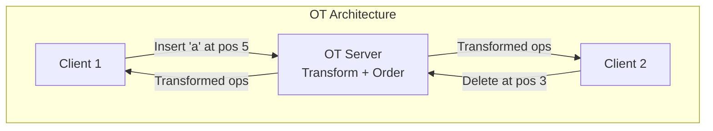
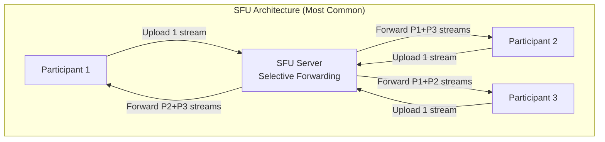
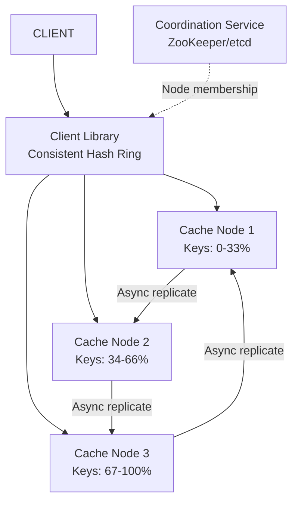
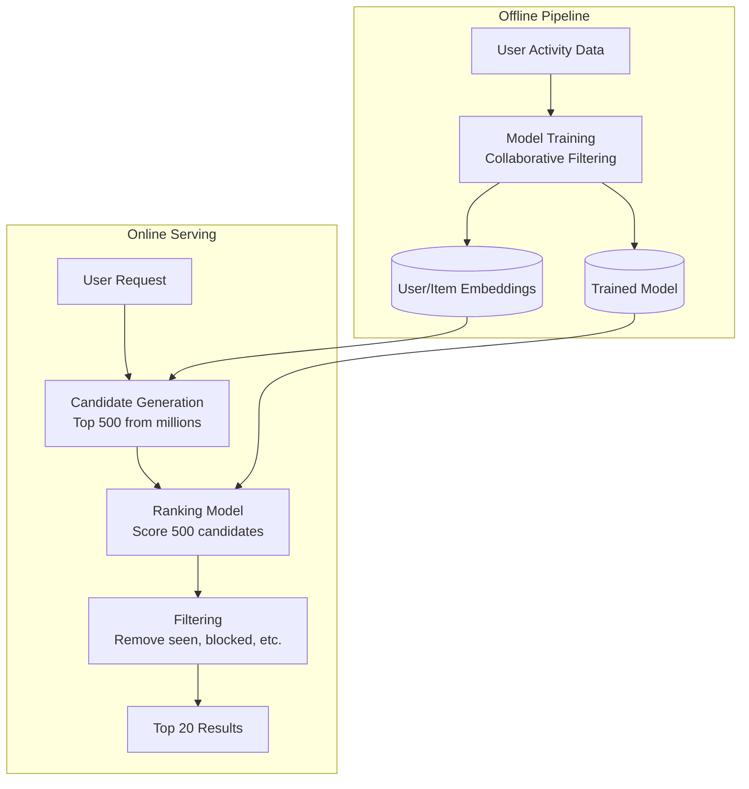

# Practice Questions: Hard

These 10 problems are interview-level hard. They require deep understanding of distributed systems, real-time processing, consistency models, and complex trade-offs. Expect these at senior/staff engineer interviews. Each problem has multiple valid approaches, and the "right" answer depends on which trade-offs you prioritize.

## Problem 1: Design Google Docs (Collaborative Editing)

**Core challenge:** Multiple users editing the same document simultaneously, seeing each other's changes in real-time, with no conflicts.

### Requirements

```
Functional:
- Real-time collaborative text editing
- Multiple cursors visible
- Undo/redo per user
- Version history
- Comments and suggestions

Non-Functional:
- <50ms propagation of edits between users
- Handle 50+ simultaneous editors per document
- No data loss (every keystroke persists)
- Offline editing with sync on reconnect
```

### Key Technical Challenge: Conflict Resolution

Two users type at position 10 simultaneously. Without conflict resolution, their edits overwrite each other.

**Two approaches:**

| Approach | How It Works | Pros | Cons |
|----------|-------------|------|------|
| OT (Operational Transformation) | Transform operations against concurrent operations | Proven (Google Docs uses this) | Complex to implement correctly, centralized server needed |
| CRDT (Conflict-Free Replicated Data Types) | Data structure guarantees conflict-free merging | Decentralized, offline-friendly | Higher memory overhead, complex data structures |



### Data Model

```
Document: { doc_id, title, owner_id, created_at, updated_at }
Operations: { op_id, doc_id, user_id, operation_type, position, content, revision, timestamp }
Snapshots: { doc_id, revision, content, timestamp }  -- Periodic full snapshots
```

### Key Trade-offs

- **OT vs CRDT:** OT is simpler to reason about but requires a central server. CRDT works offline but has higher overhead. Google uses OT; Figma uses CRDT.
- **Snapshot frequency:** Every N operations, save a full snapshot for fast document loading
- **WebSocket vs SSE:** Need bidirectional (edits both directions), so WebSocket
- **Undo/redo:** Per-user undo stack (undo MY changes, not all changes)

## Problem 2: Design Zoom (Video Conferencing)

**Core challenge:** Low-latency, real-time video/audio streaming between multiple participants.

### Requirements

```
Functional:
- 1-on-1 and group video calls (up to 1000 participants)
- Screen sharing
- Chat during calls
- Recording

Non-Functional:
- Video latency: <150ms
- Audio latency: <100ms
- Adaptive quality based on bandwidth
- Handle network jitter and packet loss
```

### Architecture Approaches

| Approach | Topology | Best For | Scaling |
|----------|---------|---------|---------|
| P2P (Peer-to-Peer) | Direct between participants | 1-on-1 calls | Cannot scale beyond 4-6 participants |
| SFU (Selective Forwarding Unit) | Server forwards streams without processing | Small-medium meetings | Each participant uploads 1 stream, downloads N-1 |
| MCU (Multipoint Control Unit) | Server mixes all streams into one | Large meetings | Each participant uploads/downloads 1 stream |



### Key Trade-offs

- **SFU vs MCU:** SFU saves server CPU but requires more client bandwidth. MCU saves bandwidth but needs massive server-side processing.
- **Protocol:** WebRTC for real-time media (UDP-based, handles NAT traversal, adaptive bitrate)
- **Simulcast:** Sender encodes at multiple resolutions; SFU sends appropriate resolution to each receiver based on their bandwidth and screen size
- **Large meetings (100+):** Switch to webinar mode — only active speakers are SFU'd, others receive a mixed stream

## Problem 3: Design a Stock Exchange

**Core challenge:** Match buy and sell orders in real-time with strict ordering, fairness, and audit requirements.

### Requirements

```
Functional:
- Place buy/sell orders (market, limit, stop)
- Match orders based on price-time priority
- Real-time order book (bid/ask depth)
- Trade confirmation and settlement

Non-Functional:
- Matching latency: <1ms (single-digit microseconds for HFT)
- Throughput: 100K+ orders/second
- Zero message loss, strict ordering
- Exactly-once execution (no double fills)
```

### Core: The Matching Engine

```python
import heapq
from dataclasses import dataclass, field
from enum import Enum
from typing import Optional


class Side(Enum):
    BUY = "BUY"
    SELL = "SELL"


@dataclass(order=True)
class Order:
    # For buy orders: negate price so highest price has priority (min-heap)
    # For both: earlier timestamp has priority
    sort_key: tuple = field(init=False, repr=False)
    order_id: str = field(compare=False)
    side: Side = field(compare=False)
    price: float = field(compare=False)
    quantity: int = field(compare=False)
    timestamp: int = field(compare=False)

    def __post_init__(self):
        if self.side == Side.BUY:
            self.sort_key = (-self.price, self.timestamp)  # Highest price first
        else:
            self.sort_key = (self.price, self.timestamp)   # Lowest price first


class OrderBook:
    """Price-time priority matching engine."""

    def __init__(self, symbol: str):
        self.symbol = symbol
        self.buy_orders: list[Order] = []   # Max-heap (negated price)
        self.sell_orders: list[Order] = []  # Min-heap

    def add_order(self, order: Order) -> list[dict]:
        """Add order and return list of trades."""
        trades = []

        if order.side == Side.BUY:
            while (order.quantity > 0 and self.sell_orders and
                   self.sell_orders[0].price <= order.price):
                trades.extend(self._match(order, self.sell_orders))

            if order.quantity > 0:
                heapq.heappush(self.buy_orders, order)
        else:
            while (order.quantity > 0 and self.buy_orders and
                   -self.buy_orders[0].sort_key[0] >= order.price):
                trades.extend(self._match(order, self.buy_orders))

            if order.quantity > 0:
                heapq.heappush(self.sell_orders, order)

        return trades

    def _match(self, incoming: Order, book: list) -> list[dict]:
        resting = book[0]
        fill_qty = min(incoming.quantity, resting.quantity)
        trade = {
            "symbol": self.symbol,
            "price": resting.price,
            "quantity": fill_qty,
            "buyer": incoming.order_id if incoming.side == Side.BUY else resting.order_id,
            "seller": resting.order_id if incoming.side == Side.BUY else incoming.order_id,
        }
        incoming.quantity -= fill_qty
        resting.quantity -= fill_qty
        if resting.quantity == 0:
            heapq.heappop(book)
        return [trade]
```

### Key Trade-offs

- **Single-threaded matching:** Most exchanges use a single thread per symbol for ordering guarantees (no locks needed). Partition by symbol for parallelism.
- **Persistence:** Write-ahead log for every order and trade. Replay log to rebuild state after crash.
- **Market data distribution:** Multicast (UDP) for low-latency distribution to market data subscribers.

## Problem 4: Design a Distributed Cache

**Core challenge:** In-memory key-value store distributed across nodes with consistent hashing, replication, and eviction.

### Key Components



### Key Trade-offs

- **Consistent hashing with virtual nodes** for even distribution (see [Consistent Hashing](/system-design/distributed-systems/consistent-hashing))
- **Eviction policy:** LRU (most common), LFU (frequency-based), ARC (adaptive)
- **Replication:** Async (fast but may lose data) vs sync (slower but durable)
- **Cache-aside vs look-aside vs cache-as-SoR:** Defines who is responsible for populating the cache

## Problem 5: Design a Search Engine

**Core challenge:** Crawl the web, build an index, and serve relevant results in milliseconds.

### Components

1. **Crawler:** Fetch web pages (see Problem 5 in Easy — Web Crawler)
2. **Indexer:** Build inverted index from crawled pages
3. **Ranking:** PageRank + text relevance (BM25) + freshness + user signals
4. **Serving:** Distribute index across shards, scatter-gather query

### Key Trade-offs

- **Index partitioning:** By document (each shard has all terms for subset of docs) vs by term (each shard has all docs for subset of terms). Document-based is more common (better load balancing).
- **Freshness vs cost:** Crawl frequently for fresh results vs crawl less to save compute
- **Ranking complexity:** More signals = better results but slower queries
- **Snippet generation:** Pre-compute at index time vs generate at query time

## Problem 6: Design an Ad Serving System

**Core challenge:** Select and serve the most valuable ad in <100ms, handling billions of requests per day.

### Key Components

- **Ad selection:** Given user context (demographics, history, page content), run an auction among eligible ads
- **Budget management:** Track advertiser spend in real-time, stop serving when budget exhausted
- **Targeting:** Match ads to user segments (behavioral, contextual, demographic)
- **Real-time bidding (RTB):** Auction completes in <100ms including external bidder calls

### Key Trade-offs

- **First-price vs second-price auction:** Second-price (winner pays second-highest bid) encourages truthful bidding
- **Budget pacing:** Spend budget evenly throughout the day vs front-load
- **Click prediction accuracy vs latency:** More complex models are more accurate but slower

## Problem 7: Design a Recommendation Engine

**Core challenge:** Suggest relevant items from millions of candidates, personalized per user.

### Architecture



### Key Trade-offs

- **Collaborative filtering vs content-based:** CF works when you have usage data; content-based works for cold start
- **Online learning vs batch retraining:** Online adapts faster but is harder to debug
- **Diversity vs relevance:** Showing only the "best" items creates filter bubbles
- **Candidate generation:** Approximate Nearest Neighbor (ANN) search in embedding space for speed

## Problem 8: Design a Payment System

**Core challenge:** Process payments reliably with exactly-once semantics, fraud detection, and regulatory compliance.

### Key Components

- **Payment API:** Accept payment requests with idempotency key
- **Payment State Machine:** INITIATED -> PROCESSING -> AUTHORIZED -> CAPTURED -> SETTLED (or FAILED/REFUNDED)
- **Payment Gateway Integration:** Stripe, Adyen, etc. — handle multiple providers for redundancy
- **Fraud Detection:** ML model scoring each transaction in real-time
- **Ledger:** Double-entry bookkeeping for accounting accuracy

### Key Trade-offs

- **Idempotency:** Every payment operation MUST be idempotent (retrying a charge should not double-charge)
- **Exactly-once processing:** Use transactional outbox pattern with idempotency keys
- **Two-phase payment:** Authorize first, capture later (reduces refund rate)
- **Multi-currency:** Store amounts in smallest currency unit (cents), convert at transaction time

## Problem 9: Design a CDN

**Core challenge:** Serve content from edge locations closest to users with minimal latency.

### Key Components

- **DNS routing:** GeoDNS or anycast to route users to nearest edge
- **Edge cache:** Cache content at each PoP (Point of Presence)
- **Origin shield:** Intermediate cache between edges and origin to reduce origin load
- **Cache invalidation:** Purge API, TTL-based expiration, versioned URLs

### Key Trade-offs

- **Push vs Pull CDN:** Push (pre-populate edges) vs pull (cache on first request). Pull is more common.
- **Cache key design:** URL, URL + headers, URL + query params — affects hit rate
- **TLS termination:** At edge (faster) vs at origin (simpler cert management)
- **Consistency:** After purge, how long until all edges are updated? (eventual, typically <60s)

## Problem 10: Design a Gaming Leaderboard

**Core challenge:** Real-time ranked leaderboard for millions of players with fast rank queries.

### Requirements

```
Functional:
- Update player score
- Get top N players
- Get a specific player's rank
- Get players around a specific rank (neighborhood)

Non-Functional:
- 1M concurrent players, 10K score updates/sec
- Rank query latency: <50ms
- Real-time (rank updates within seconds of score change)
```

### Solution Approaches

| Approach | Get Rank | Update Score | Memory | Complexity |
|----------|----------|-------------|--------|-----------|
| Redis Sorted Set (ZSET) | O(log N) ZRANK | O(log N) ZADD | O(N) | Low |
| Segment Tree | O(log M) | O(log M) | O(M) where M = score range | Medium |
| Skip List | O(log N) | O(log N) | O(N) | Medium |

```python
# Redis-based leaderboard — simplest production solution
class Leaderboard:
    def __init__(self, redis_client, name: str):
        self.redis = redis_client
        self.key = f"leaderboard:{name}"

    async def update_score(self, player_id: str, score: float):
        await self.redis.zadd(self.key, {player_id: score})

    async def get_top(self, n: int = 100) -> list:
        return await self.redis.zrevrange(self.key, 0, n - 1, withscores=True)

    async def get_rank(self, player_id: str) -> int:
        rank = await self.redis.zrevrank(self.key, player_id)
        return rank + 1 if rank is not None else None

    async def get_around(self, player_id: str, count: int = 5) -> list:
        rank = await self.redis.zrevrank(self.key, player_id)
        if rank is None:
            return []
        start = max(0, rank - count)
        end = rank + count
        return await self.redis.zrevrange(self.key, start, end, withscores=True)
```

### Key Trade-offs

- **Redis ZSET:** Simple, fast, but limited to ~100M entries per key (memory)
- **Sharded leaderboard:** Partition by score range, merge at query time
- **Real-time vs periodic:** Real-time updates are expensive at scale; consider batching updates every N seconds
- **Global vs regional:** Separate leaderboards per region, global aggregation hourly

## Practice Strategy

These problems require 60+ minutes for a thorough design. In an interview, you will only cover the highlights. Practice:

1. **Identify the hardest sub-problem** (e.g., conflict resolution for Google Docs, matching engine for stock exchange)
2. **Spend most time on that sub-problem** rather than trying to cover everything
3. **Know the trade-offs cold** — the interviewer will push you on why you chose one approach over another

## Cross-References

- [System Design Interview Framework](/system-design/interview/framework) — structure your answer
- [Practice Questions: Medium](/system-design/interview/practice-medium) — build up to these
- [Deep Dive Topics](/system-design/interview/deep-dive-topics) — what interviewers probe
- [Discussing Tradeoffs](/system-design/interview/discussing-tradeoffs) — articulate your choices
- [CRDT Fundamentals](/system-design/distributed-systems/crdt-fundamentals) — for Google Docs design
- [WebRTC](/system-design/networking/webrtc) — for Zoom design

---

*Hard problems test depth, not breadth. You will not cover the entire system in 45 minutes. The interviewer knows this. What they want to see is that you can identify the hardest part of the problem, go deep on it, and articulate the trade-offs of your approach versus alternatives.*
