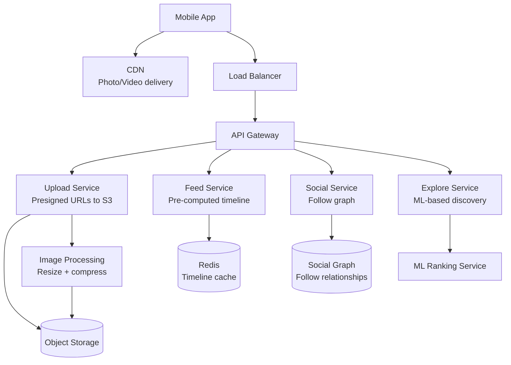
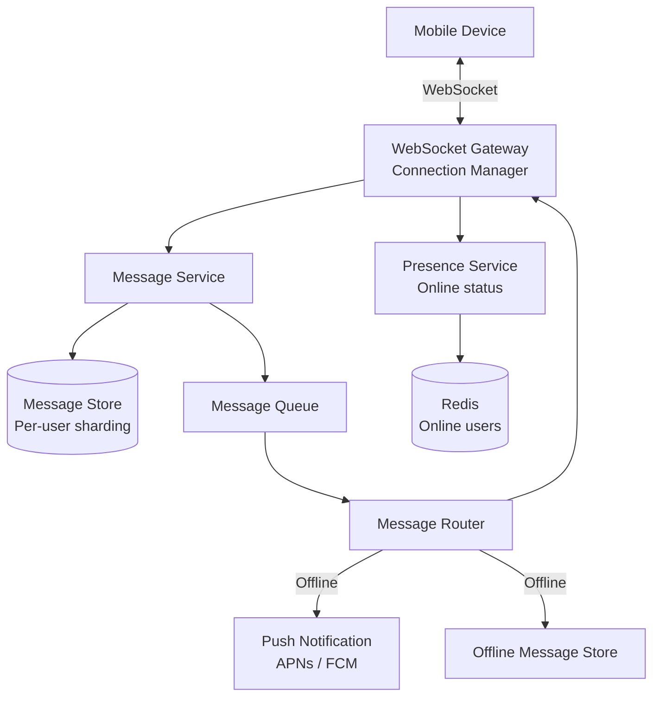
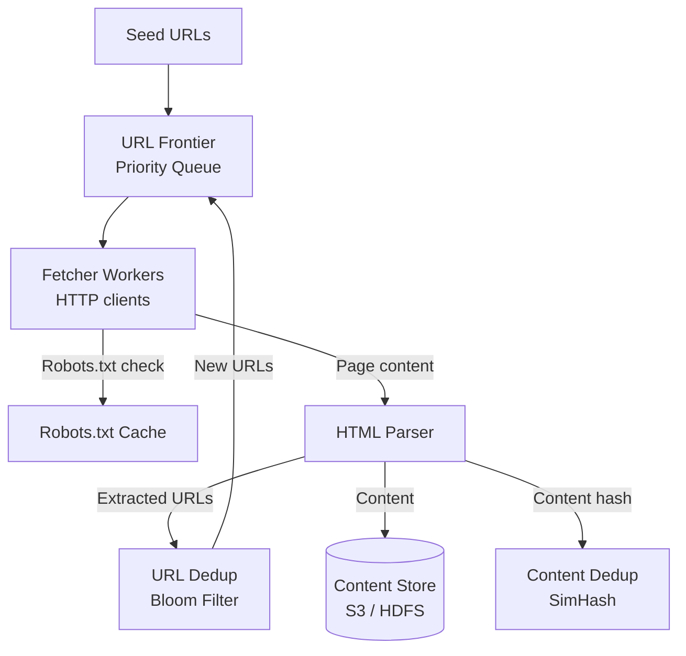
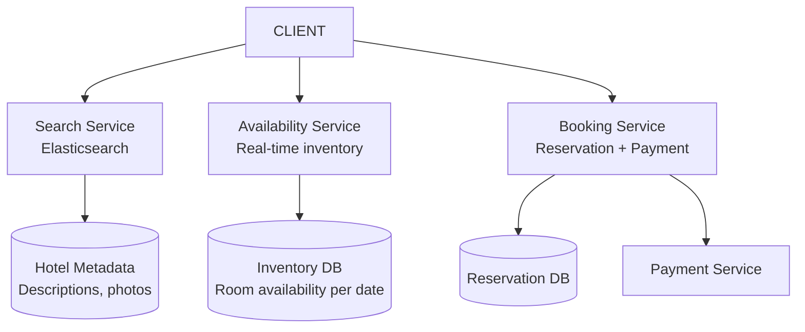

# Practice Questions: Medium

These 10 problems are interview-realistic. Each requires combining multiple building blocks from the easy problems — caching + feed generation + media storage + real-time delivery. Expect these at mid-level to senior interviews at FAANG-tier companies. Budget 45 minutes per problem.

## Problem 1: Design Instagram

**Core features:** Post photos/videos, follow users, explore feed, stories, likes/comments.

### Requirements

```
Functional:
- Upload photos/videos with captions
- Follow/unfollow users
- Home feed (posts from followed users)
- Explore/discover feed (algorithmic)
- Stories (24-hour ephemeral content)
- Like and comment on posts

Non-Functional:
- 500M DAU
- 100M photos uploaded per day
- Feed latency: <200ms
- Media upload: support up to 100 MB
- Global availability
```

### Estimation

```
Photos/day: 100M
Average photo size: 2 MB (before compression)
After compression + multiple resolutions: ~5 MB total per photo
Daily media storage: 100M × 5 MB = 500 TB/day (!!!)
Yearly: ~180 PB

Feed reads: 500M DAU × 10 views/day = 5B/day = ~58K reads/sec
Photo uploads: 100M/day = ~1,150 writes/sec

This is massively read-heavy and storage-heavy.
```

### Key Components



### Data Model Sketch

```sql
-- Posts (sharded by user_id)
posts(post_id, user_id, caption, media_urls[], location, created_at)

-- Follows (sharded by follower_id)
follows(follower_id, followee_id, created_at)

-- Feed (materialized in Redis)
-- ZSET per user: timeline:{user_id} -> {post_id: timestamp}

-- Comments (sharded by post_id)
comments(comment_id, post_id, user_id, text, created_at)
```

### Key Trade-offs to Discuss

- **Feed generation:** Fanout-on-write for most users, fanout-on-read for celebrities
- **Image processing:** Eager (generate all resolutions on upload) vs lazy (generate on first request)
- **Explore feed:** Collaborative filtering vs content-based vs hybrid recommendation
- **Stories:** Ephemeral — stored with 24-hour TTL, no permanent storage needed

## Problem 2: Design Twitter Feed

**Core features:** Tweet, retweet, home timeline, search, trending topics.

### Requirements

```
Functional:
- Post tweets (280 chars + media)
- Retweet with/without quote
- Home timeline (chronological + algorithmic)
- Search tweets (full text)
- Trending topics

Non-Functional:
- 200M DAU, 500M tweets/day
- Timeline latency: <200ms
- Search latency: <500ms
- Tweet durability: zero loss tolerance
```

### Key Components

- **Write path:** Tweet Service -> Message Queue -> Fanout Service -> Timeline Cache (Redis)
- **Read path:** Timeline Service -> Redis (pre-computed) + merge celebrity tweets on read
- **Search:** Tweet Service -> Kafka -> Elasticsearch indexer -> Elasticsearch cluster
- **Trending:** Streaming aggregation (Kafka Streams or Flink) on hashtag counts per time window

### Key Trade-offs

- Hybrid fanout (push for <10K followers, pull for celebrities)
- Search index freshness (seconds delay acceptable) vs cost of real-time indexing
- Trending calculation window (5 min vs 1 hour) affects sensitivity vs stability

## Problem 3: Design WhatsApp

**Core features:** 1-on-1 messaging, group messaging, read receipts, media sharing, end-to-end encryption.

### Requirements

```
Functional:
- Send/receive text messages (1-on-1 and groups up to 256)
- Read receipts (sent, delivered, read)
- Media sharing (images, videos, documents)
- End-to-end encryption
- Offline message delivery

Non-Functional:
- 2B users, 100B messages/day
- Message delivery: <100ms (same region)
- End-to-end encrypted (server cannot read content)
- At-least-once delivery with client-side dedup
```

### Estimation

```
100B messages/day = ~1.16M messages/sec
Average message: 100 bytes (text) or 500 KB (media)
Text storage: 100B × 100 bytes = 10 TB/day
Media storage: 20B × 500 KB = 10 PB/day (!!)
```

### Key Components



### Key Trade-offs

- **Message storage:** Store on server (for multi-device sync) vs delete after delivery (privacy)
- **E2E encryption:** Signal Protocol (double ratchet) — server never sees plaintext
- **Group messages:** Fan-out at server vs fan-out at sender
- **Delivery receipts:** Checkmark system (single = sent to server, double = delivered, blue = read)

## Problem 4: Design Uber

**Core features:** Request ride, match with driver, real-time tracking, pricing, payments.

### Requirements

```
Functional:
- Rider requests a ride (pickup, destination)
- Match with nearest available driver
- Real-time location tracking during ride
- Dynamic (surge) pricing
- Payment processing

Non-Functional:
- 20M rides/day, 5M concurrent drivers
- Matching latency: <10 seconds
- Location update frequency: every 3 seconds
- 99.99% availability for ride matching
```

### Estimation

```
Location updates: 5M drivers × (1 update / 3 sec) = 1.67M updates/sec
Ride requests: 20M/day = ~230/sec
Each location: 20 bytes (lat, lng, timestamp, driver_id) = ~33 MB/sec raw data
```

### Key Components

- **Location Service:** Receives GPS updates, stores in geospatial index (H3 hexagonal grid or Quadtree)
- **Matching Service:** Given rider location, find nearest available drivers within radius, optimize assignment
- **Pricing Service:** Supply/demand ratio per geographic zone, surge multiplier
- **Trip Service:** State machine (REQUESTED -> MATCHED -> EN_ROUTE -> IN_PROGRESS -> COMPLETED)
- **ETA Service:** Graph-based routing with real-time traffic data

### Key Trade-offs

- **Geospatial index:** H3 (Uber's choice) vs Geohash vs Quadtree
- **Matching:** Greedy nearest-first vs batch optimization (collect requests for N seconds, solve assignment)
- **Surge pricing:** Real-time supply/demand vs zone-based with time-decay

## Problem 5: Design a Web Crawler

**Core features:** Crawl the web, fetch pages, extract links, respect robots.txt, handle politeness.

### Requirements

```
Functional:
- Crawl web pages starting from seed URLs
- Extract and follow links
- Store page content for indexing
- Respect robots.txt and rate limits per domain
- Detect and handle duplicate content

Non-Functional:
- Crawl 1 billion pages per month
- Politeness: max 1 request/second per domain
- Handle redirects, timeouts, errors gracefully
```

### Key Components



### Key Trade-offs

- **URL frontier:** BFS (breadth-first) vs priority-based (PageRank score, freshness)
- **Deduplication:** Exact URL dedup (Bloom filter) + content dedup (SimHash for near-duplicates)
- **Politeness:** Per-domain rate limiter + per-domain queue
- **Storage:** Store raw HTML vs parsed text vs both

## Problem 6: Design a News Feed

**Core features:** Aggregated feed from multiple sources, personalized ranking, real-time updates.

This is similar to the social media feed but with external content sources (publishers, RSS feeds, curated content) rather than user-generated posts. The key difference is the ranking algorithm is more important — users expect relevance, not just recency.

### Key Components

- **Content Ingestion:** RSS/Atom feed crawler, publisher API integrations, webhook receivers
- **Content Processing:** NLP pipeline (entity extraction, categorization, deduplication, summarization)
- **Ranking Service:** ML model combining recency, relevance, user interests, engagement signals
- **Feed Assembly:** Merge ranked content with user preferences, apply diversity rules (no 5 articles from same source)

### Key Trade-offs

- **Ranking:** Chronological (simple, transparent) vs ML-ranked (better engagement, filter bubble risk)
- **Content freshness:** Real-time ingestion (expensive) vs batch crawl every 5 minutes
- **Personalization:** Collaborative filtering vs content-based vs hybrid

## Problem 7: Design Autocomplete / Typeahead

**Core features:** Suggest search queries as user types, ranked by popularity.

### Requirements

```
Functional:
- Return top 5-10 suggestions for a prefix
- Update suggestions based on search frequency
- Handle typos (fuzzy matching)

Non-Functional:
- Latency: <100ms (ideally <50ms)
- 10B searches/day, 5B unique queries
- Suggestions update within minutes of trending queries
```

### Key Components

- **Data collection:** Log all search queries with timestamps and counts
- **Aggregation:** Periodic MapReduce or streaming aggregation to compute query frequencies
- **Trie service:** Serve suggestions from a prefix trie with pre-computed top-K at each node
- **Ranking:** Combine query frequency, recency, personalization, and trending signals

### Key Trade-offs

- **Trie vs Elasticsearch prefix query:** Trie is faster but needs custom infrastructure
- **Update frequency:** Real-time (streaming) vs batch (hourly) updates to suggestion data
- **Personalization:** Generic suggestions vs user-specific history

## Problem 8: Design TikTok

**Core features:** Short video upload, "For You" recommendation feed, likes/comments/shares.

### Key Differences from Instagram

- **Content discovery is primary:** Users mostly watch recommended content, not followed accounts
- **Video-first:** All content is video (5-60 seconds), requiring heavy transcoding
- **Recommendation-driven:** The algorithm IS the product

### Key Components

- **Upload:** Presigned URL to S3, trigger transcoding pipeline (multiple resolutions + HLS segments)
- **Recommendation:** ML pipeline scoring videos for each user based on engagement signals
- **Feed serving:** Pre-compute recommended video queue per user, serve from cache
- **Engagement:** Like, comment, share, watch time, completion rate — all feed into recommendation model

### Key Trade-offs

- **Recommendation approach:** Collaborative filtering vs content-based vs two-tower neural model
- **Cold start:** How to recommend for new users with no history (trending, demographic defaults)
- **Video CDN:** Pre-push popular videos to edge vs on-demand caching

## Problem 9: Design Food Delivery (DoorDash/Uber Eats)

**Core features:** Browse restaurants, place orders, real-time delivery tracking, driver matching.

This combines the **e-commerce template** (browsing, ordering, payments) with the **ride-sharing template** (geospatial matching, real-time tracking).

### Key Components

- **Restaurant Service:** Menu management, hours, capacity (max concurrent orders)
- **Order Service:** Cart, checkout, payment processing (saga pattern)
- **Matching Service:** Assign driver to order based on location, current load, ETA
- **Tracking Service:** Real-time GPS tracking (driver -> restaurant -> customer)
- **ETA Service:** Prep time (restaurant) + pickup time (driver to restaurant) + delivery time (restaurant to customer)

### Key Trade-offs

- **Matching:** Assign driver at order time vs when food is almost ready
- **Batching:** Multiple orders to same restaurant assigned to same driver
- **Restaurant capacity:** Accept or reject orders based on kitchen capacity

## Problem 10: Design Hotel Booking (Booking.com)

**Core features:** Search hotels by location/dates, view availability, book rooms, manage reservations.

### Key Components



### Key Trade-offs

- **Availability check:** Pessimistic (lock room during checkout) vs optimistic (check at payment)
- **Overbooking:** Airlines overbook intentionally; hotels typically do not
- **Search ranking:** Price vs rating vs commission vs relevance
- **Inventory model:** Room-level vs room-type-level availability (10 "Standard Kings" vs specific Room 301)

## Practice Strategy

| Week | Problems | Time per Problem |
|------|----------|-----------------|
| 1 | 1-3 (Instagram, Twitter, WhatsApp) | 45 min each |
| 2 | 4-6 (Uber, Web Crawler, News Feed) | 45 min each |
| 3 | 7-10 (Autocomplete, TikTok, Food Delivery, Hotel Booking) | 45 min each |
| 4 | Mock interviews with a partner (random selection) | 45 min + 15 min feedback |

## Cross-References

- [System Design Interview Framework](/system-design/interview/framework) — structure your answer
- [Reusable Architecture Templates](/system-design/interview/templates) — starting skeletons
- [Practice Questions: Easy](/system-design/interview/practice-easy) — build up to these
- [Practice Questions: Hard](/system-design/interview/practice-hard) — next level
- [Estimation Cheat Sheet](/system-design/interview/estimation-cheat-sheet) — numbers for estimation

---

*For each problem, practice the full framework: clarify requirements (5 min), estimate (5 min), high-level design (15 min), deep dive (15 min), wrap-up (5 min). Time yourself. The biggest gap between reading solutions and succeeding in interviews is the ability to communicate the design under time pressure.*
