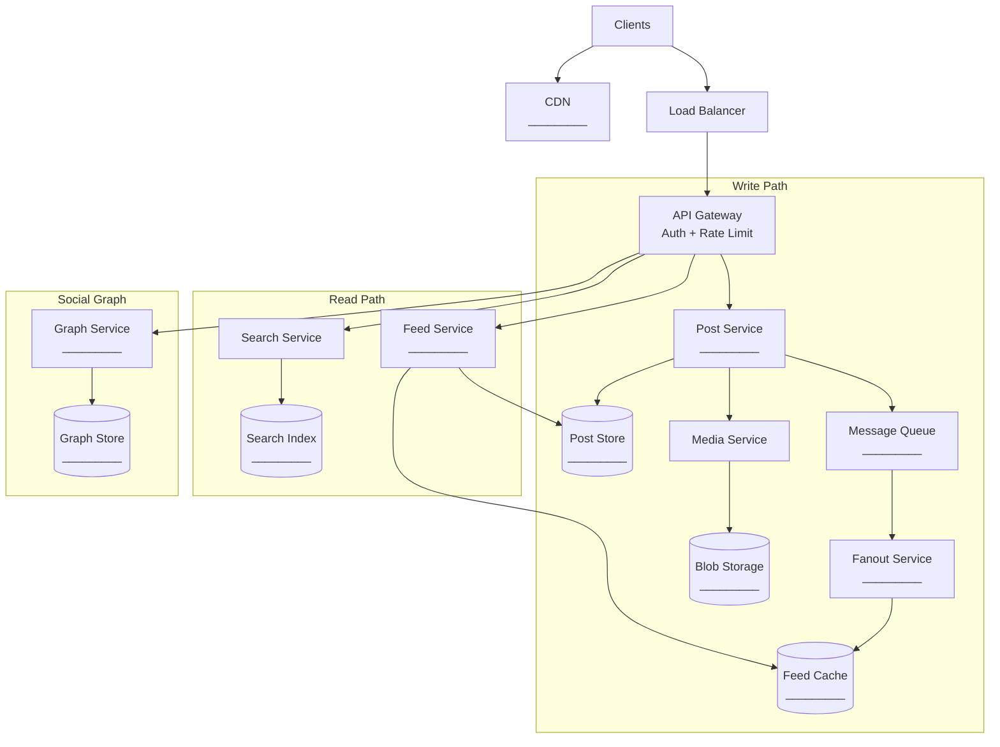
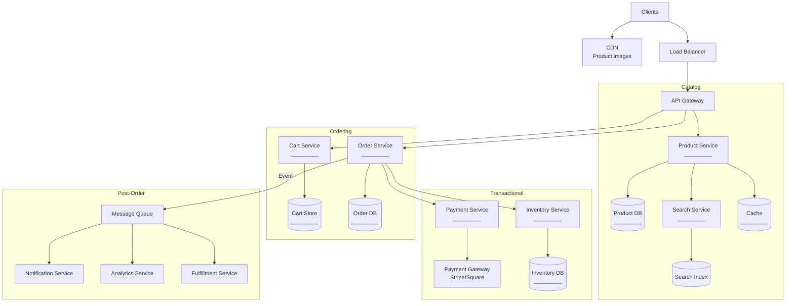
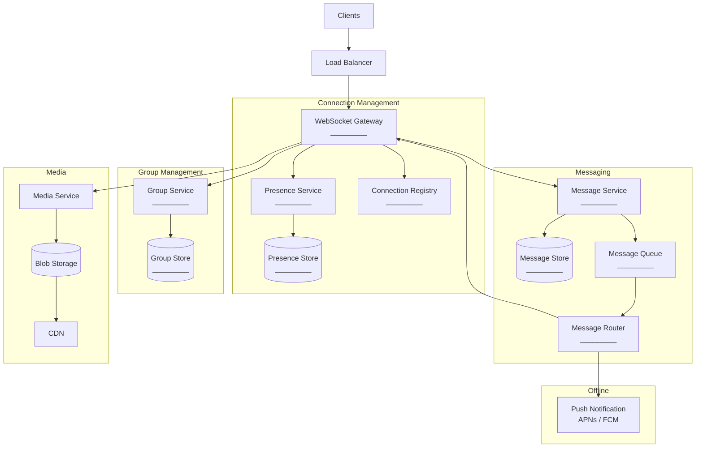
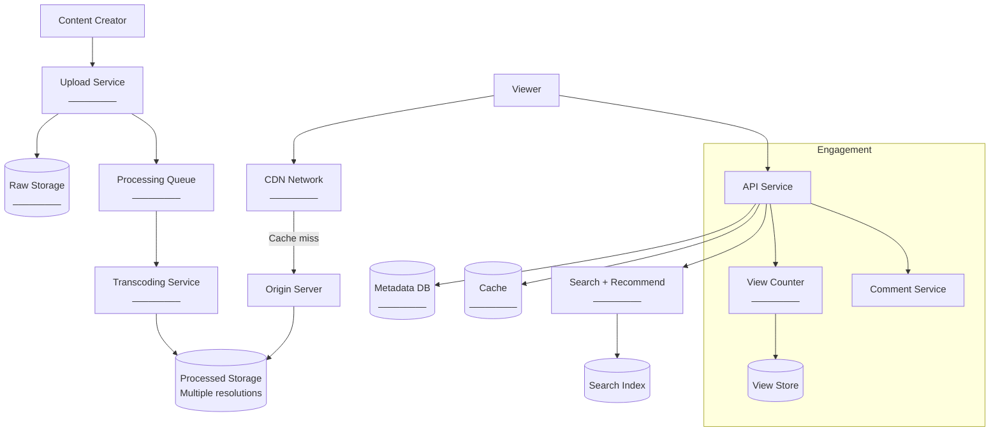
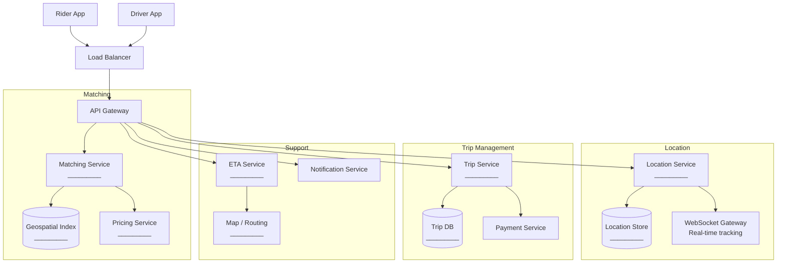

# Reusable Architecture Templates

Most system design questions map to one of a few fundamental architecture patterns. A social media feed, a news aggregator, and a notification timeline are all "feed systems." An e-commerce checkout, a booking platform, and a ticketing system are all "transactional platforms." This page gives you 5 templates that cover the vast majority of interview questions. Learn the template, then customize per question.

## How to Use Templates

1. **Identify which template fits** the question (most map to one of five)
2. **Customize** the components for the specific problem
3. **Never say you are using a template** — present it as your design
4. **Modify trade-offs** based on the specific requirements

| Template | Applies To |
|----------|-----------|
| Social Media Feed | Twitter, Instagram, Facebook, Reddit, LinkedIn, TikTok, news feed |
| E-Commerce Platform | Amazon, Shopify, booking systems, ticketing, food delivery |
| Real-Time Messaging | WhatsApp, Slack, Discord, Telegram, comments, notifications |
| Video Streaming | YouTube, Netflix, TikTok, live streaming, Twitch |
| Ride-Sharing | Uber, Lyft, food delivery matching, logistics, delivery tracking |

## Template 1: Social Media Feed

**Applies to:** Twitter, Instagram, Facebook feed, Reddit, LinkedIn, TikTok, any system where users create content and others consume a personalized feed.



### Template Placeholders to Fill

| Placeholder | Options to Consider | Decision Criteria |
|------------|-------------------|-------------------|
| Post Store | PostgreSQL, Cassandra, DynamoDB | Write volume, query patterns |
| Feed Cache | Redis sorted sets | Timeline read latency requirement |
| Message Queue | Kafka, SQS, RabbitMQ | Fanout volume, ordering needs |
| Fanout Strategy | Write (push), Read (pull), Hybrid | Follower distribution |
| Media Storage | S3, GCS, Azure Blob | Cost, CDN integration |
| Search Index | Elasticsearch | Full-text search needs |
| Social Graph | Redis, Neo4j, adjacency list in SQL | Graph query complexity |
| CDN | CloudFront, Cloudflare | Media delivery latency |

### Key Decisions to Justify

```markdown
1. Fanout strategy: Push (fanout-on-write) vs Pull (fanout-on-read)
   - Push: Fast reads, high write amplification
   - Pull: Slow reads, low write amplification
   - Hybrid: Push for normal users, pull for celebrities

2. Feed ranking: Chronological vs Algorithmic
   - Chronological: Simple, real-time, user-controlled
   - Algorithmic: Better engagement, requires ML pipeline

3. Content delivery: Presigned URLs vs CDN
   - Presigned: Access control, temporary links
   - CDN: Low latency, global distribution

4. Engagement counts: Real-time vs Approximate
   - Real-time: Redis counters, expensive at scale
   - Approximate: Periodic aggregation, good enough for most cases
```

## Template 2: E-Commerce Platform

**Applies to:** Amazon, Shopify, booking systems (hotels, flights), food ordering, ticketing platforms, any system with inventory, checkout, and payments.



### Key Decisions

```markdown
1. Inventory management: Pessimistic vs Optimistic locking
   - Pessimistic: Reserve inventory on "add to cart" (prevents oversell)
   - Optimistic: Check inventory at checkout (higher conversion)
   - Hybrid: Soft reserve for 15 min, hard lock at payment

2. Cart storage: Database vs Redis
   - Database: Persistent, survives crashes, slower
   - Redis: Fast, temporary, needs persistence strategy

3. Payment flow: Synchronous vs Two-phase
   - Sync: Charge immediately, refund on failure
   - Two-phase: Authorize first, capture after fulfillment

4. Search: Elasticsearch vs Database queries
   - ES: Fast faceted search, fuzzy matching, relevance ranking
   - DB: Simple queries, strong consistency, fewer moving parts

5. Pricing: Cache vs Real-time
   - Cached: Fast, might show stale prices (handle at checkout)
   - Real-time: Always accurate, slower
```

## Template 3: Real-Time Messaging

**Applies to:** WhatsApp, Slack, Discord, Telegram, Facebook Messenger, in-app chat, live comments, collaborative tools.



### Key Decisions

```markdown
1. Protocol: WebSocket vs Long Polling vs SSE
   - WebSocket: Full duplex, lowest latency, connection overhead
   - Long Polling: Simpler, works through any proxy
   - SSE: Server-to-client only, auto-reconnect

2. Message ordering: Total order vs Causal order
   - Total: All users see messages in exact same order (expensive)
   - Causal: Messages respect causality (reply after original)

3. Delivery guarantee: At-most-once vs At-least-once
   - At-most-once: Fast, might lose messages
   - At-least-once: Reliable, need deduplication on client

4. Group messaging: Fan-out at sender vs Fan-out at server
   - Sender: Client sends N copies (wastes bandwidth)
   - Server: Client sends once, server fans out (standard)

5. Offline messages: Store-and-forward vs Push notification
   - Store: Queue messages, deliver when user reconnects
   - Push: Send push notification, user opens app to read

6. End-to-end encryption: Client-side vs Server-side
   - E2E: Server cannot read messages, complex key management
   - Server-side: TLS in transit, server can read (moderation possible)
```

## Template 4: Video Streaming

**Applies to:** YouTube, Netflix, TikTok, Twitch, video conferencing, live streaming, any media-heavy platform.



### Key Decisions

```markdown
1. Upload: Direct to storage vs Through server
   - Direct (presigned URL): Offloads bandwidth, complex auth
   - Through server: Simple, server is bandwidth bottleneck

2. Transcoding: Eager vs Lazy
   - Eager: Transcode all resolutions on upload (storage cost)
   - Lazy: Transcode on first request (latency on first view)
   - Hybrid: Transcode popular resolutions eagerly, rest lazily

3. Streaming protocol: HLS vs DASH vs CMAF
   - HLS: Apple ecosystem, widest support
   - DASH: Open standard, more flexible
   - CMAF: Common format for both HLS and DASH

4. Adaptive bitrate: How many resolutions?
   - Typical: 240p, 360p, 480p, 720p, 1080p, 4K
   - Each resolution = separate transcoding job + storage

5. View counting: Real-time vs Batch
   - Real-time: Redis counter, accurate, expensive at scale
   - Batch: Aggregate every minute, approximate, cheap
   - YouTube approach: Real-time up to 300 views, then batch

6. Recommendations: Collaborative filtering vs Content-based
   - Collaborative: "Users who watched X also watched Y"
   - Content-based: Similar tags, categories, creators
   - Hybrid: Both, weighted by engagement signals
```

## Template 5: Ride-Sharing / Location-Based

**Applies to:** Uber, Lyft, DoorDash, food delivery, logistics, delivery tracking, any system matching supply with demand based on location.



### Key Decisions

```markdown
1. Geospatial index: Quadtree vs Geohash vs H3
   - Quadtree: Dynamic splitting, good for uneven distribution
   - Geohash: String prefix matching, easy to implement
   - H3 (Uber): Hexagonal grid, uniform area, no distortion

2. Location updates: Frequency vs Battery
   - High frequency (every 1s): Accurate tracking, drains battery
   - Low frequency (every 5s): Saves battery, less accurate
   - Adaptive: High during trip, low when idle

3. Matching algorithm: Nearest driver vs Optimal assignment
   - Nearest: Simple, fast, suboptimal globally
   - Optimal: Better globally, computationally expensive
   - Batch matching: Collect requests for 5s, solve assignment problem

4. Dynamic pricing (surge): Real-time vs Zone-based
   - Real-time: Price changes per request based on supply/demand
   - Zone-based: Divide city into zones, set multiplier per zone
   - Uber approach: Zone-based with smooth transitions

5. ETA estimation: Historical average vs ML model
   - Historical: Simple, based on past trips in same area/time
   - ML: Uses traffic, weather, events, more accurate
   - Hybrid: ML model with historical fallback
```

## Template Mapping Cheat Sheet

| Interview Question | Primary Template | Customize |
|-------------------|-----------------|-----------|
| Design Twitter | Social Media Feed | Tweets, timeline, search |
| Design Instagram | Social Media Feed | Photos, stories, explore |
| Design Reddit | Social Media Feed | Subreddits, voting, comments |
| Design TikTok | Social Media Feed + Video | Short video, recommendation-heavy |
| Design Amazon | E-Commerce | Product catalog, reviews, recommendations |
| Design a hotel booking system | E-Commerce | Inventory = rooms, dates as dimensions |
| Design a food delivery app | E-Commerce + Ride-Sharing | Menu, restaurant matching, delivery tracking |
| Design WhatsApp | Real-Time Messaging | E2E encryption, groups, voice/video |
| Design Slack | Real-Time Messaging | Channels, threads, search, integrations |
| Design YouTube | Video Streaming | Upload, transcode, recommendations |
| Design Netflix | Video Streaming | Licensing, personalization, download |
| Design Uber | Ride-Sharing | Real-time matching, surge pricing |
| Design Google Maps | Ride-Sharing (Location) | Routing, traffic, POI search |

## Cross-References

- [System Design Interview Framework](/system-design/interview/framework) — how to use these templates in an interview
- [Practice Questions: Easy](/system-design/interview/practice-easy) — apply templates to easy problems
- [Practice Questions: Medium](/system-design/interview/practice-medium) — apply templates to medium problems
- [Practice Questions: Hard](/system-design/interview/practice-hard) — apply templates to hard problems
- [Scalability Patterns](/system-design/patterns/scalability-patterns) — scaling the template
- [Communication Patterns](/system-design/patterns/communication-patterns) — choosing protocols

---

*Templates are starting points, not answers. The value is in how you customize them for the specific problem, justify your choices, and discuss trade-offs. An interviewer can tell the difference between someone who memorized an architecture and someone who understands why each component exists.*
