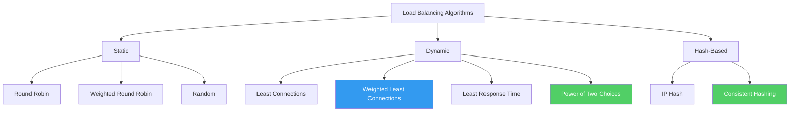

# Load Balancing Algorithms

The choice of load balancing algorithm determines how well your fleet utilizes its resources. A bad algorithm leaves some servers idle while others drown. A good algorithm distributes load proportionally to each server's capacity, adapts to changing conditions, and does so with minimal overhead. This page provides a rigorous analysis of every major algorithm — the math behind each, TypeScript implementations, and clear guidance on when to use which.

## Overview and Classification

Load balancing algorithms fall into two categories:

**Static algorithms** make decisions based only on pre-configured information (server weights, order). They do not consider current server load.

**Dynamic algorithms** make decisions based on real-time state (active connections, response times). They adapt to changing conditions but require more bookkeeping.



## 1. Round Robin

### Concept

Requests are distributed to servers sequentially. Server 1, then Server 2, then Server 3, then back to Server 1. The simplest possible algorithm.

### Mathematical Analysis

Given $n$ servers, after $k$ requests, server $i$ has received:

$$
\text{requests}_i = \left\lfloor \frac{k}{n} \right\rfloor + \begin{cases} 1 & \text{if } (k \mod n) > i \\ 0 & \text{otherwise} \end{cases}
$$

The maximum imbalance between any two servers is exactly 1 request. Over time, load converges to perfectly uniform:

$$
\lim_{k \to \infty} \frac{\text{requests}_i}{k} = \frac{1}{n} \quad \forall i
$$

### TypeScript Implementation

```typescript
class RoundRobinBalancer {
  private servers: string[];
  private currentIndex: number = 0;

  constructor(servers: string[]) {
    if (servers.length === 0) {
      throw new Error('At least one server is required');
    }
    this.servers = [...servers];
  }

  nextServer(): string {
    const server = this.servers[this.currentIndex];
    this.currentIndex = (this.currentIndex + 1) % this.servers.length;
    return server;
  }

  addServer(server: string): void {
    this.servers.push(server);
  }

  removeServer(server: string): void {
    const index = this.servers.indexOf(server);
    if (index === -1) return;

    this.servers.splice(index, 1);
    if (this.servers.length === 0) {
      throw new Error('Cannot remove last server');
    }
    // Adjust currentIndex if needed to avoid skipping a server
    if (this.currentIndex >= this.servers.length) {
      this.currentIndex = 0;
    }
  }
}
```

### When to Use

- All servers are identical in capacity
- Requests are roughly uniform in cost
- You need maximum simplicity and debuggability
- Stateless services where every request is independent

### When NOT to Use

- Servers have different capacities (use weighted round robin)
- Some requests are much more expensive than others (use least connections)
- You need session affinity (use IP hash or consistent hashing)

## 2. Weighted Round Robin

### Concept

Each server has a weight proportional to its capacity. A server with weight 3 receives 3x as many requests as a server with weight 1.

### The Smooth Weighted Round Robin Problem

A naive implementation — give server A three requests in a row, then server B one request — creates bursts. If server A takes time to process the first request, it's already receiving two more. The **smooth weighted round robin** algorithm (used by NGINX) distributes requests more evenly.

#### Smooth Algorithm (NGINX's Approach)

For each server $i$, maintain a `current_weight` initialized to 0.

On each request:
1. Add each server's configured `effective_weight` to its `current_weight`
2. Select the server with the highest `current_weight`
3. Subtract the total weight from the selected server's `current_weight`

This produces the sequence for weights {A:5, B:1, C:1}:

| Step | current_weight before | Selected | current_weight after |
|------|----------------------|----------|---------------------|
| 1 | A:5 B:1 C:1 | A (7) | A:-2 B:1 C:1 |
| 2 | A:3 B:2 C:2 | A (7) | A:-4 B:2 C:2 |
| 3 | A:1 B:3 C:3 | B or C (3) | A:1 B:-4 C:3 |
| 4 | A:6 B:-3 C:4 | A (7) | A:-1 B:-3 C:4 |
| 5 | A:4 B:-2 C:5 | C (7) | A:4 B:-2 C:-2 |
| 6 | A:9 B:-1 C:-1 | A (7) | A:2 B:-1 C:-1 |
| 7 | A:7 B:0 C:0 | A (7) | A:0 B:0 C:0 |

After 7 requests (total weight), every server received exactly its weight number of requests: A=5, B=1, C=1. But the distribution is **smooth** — A never gets more than 2 requests in a row.

### TypeScript Implementation

```typescript
interface WeightedServer {
  address: string;
  weight: number;
  currentWeight: number;
  effectiveWeight: number;
}

class SmoothWeightedRoundRobin {
  private servers: WeightedServer[];

  constructor(servers: Array<{ address: string; weight: number }>) {
    this.servers = servers.map(s => ({
      address: s.address,
      weight: s.weight,
      currentWeight: 0,
      effectiveWeight: s.weight,
    }));
  }

  nextServer(): string {
    const totalWeight = this.servers.reduce(
      (sum, s) => sum + s.effectiveWeight,
      0
    );

    // Step 1: Add effective weight to current weight
    for (const server of this.servers) {
      server.currentWeight += server.effectiveWeight;
    }

    // Step 2: Find server with highest current weight
    let best = this.servers[0];
    for (const server of this.servers) {
      if (server.currentWeight > best.currentWeight) {
        best = server;
      }
    }

    // Step 3: Subtract total weight from selected server
    best.currentWeight -= totalWeight;

    return best.address;
  }

  /**
   * Decrease effective weight on failure, increase on success.
   * This implements slow-start recovery after failures.
   */
  markFailure(address: string): void {
    const server = this.servers.find(s => s.address === address);
    if (server && server.effectiveWeight > 0) {
      server.effectiveWeight--;
    }
  }

  markSuccess(address: string): void {
    const server = this.servers.find(s => s.address === address);
    if (server && server.effectiveWeight < server.weight) {
      server.effectiveWeight++;
    }
  }
}
```

### Mathematical Property

The smooth weighted round robin algorithm guarantees that in any window of $W = \sum w_i$ consecutive requests, each server $i$ receives exactly $w_i$ requests. This is optimal — it's the smoothest possible schedule.

## 3. Least Connections

### Concept

Send each new request to the server with the fewest active (in-flight) connections. This naturally adapts to servers that process requests at different speeds — slower servers accumulate connections and stop receiving new ones.

### Mathematical Analysis

If all servers have equal capacity and request processing times are i.i.d. (independent and identically distributed) with mean $\mu$, then least connections produces near-optimal load distribution. The expected difference in active connections between any two servers converges to $O(1)$ regardless of load.

Under the M/M/1 queueing model, least connections minimizes the expected response time across all servers:

$$
\text{Minimize } \sum_{i=1}^{n} \frac{1}{\mu_i - \lambda_i}
$$

where $\lambda_i$ is the arrival rate to server $i$ and $\mu_i$ is its service rate.

### TypeScript Implementation

```typescript
class LeastConnectionsBalancer {
  private servers: Map<string, number>; // server → active connection count

  constructor(servers: string[]) {
    this.servers = new Map();
    for (const server of servers) {
      this.servers.set(server, 0);
    }
  }

  nextServer(): string {
    let minConns = Infinity;
    let bestServer = '';

    for (const [server, conns] of this.servers) {
      if (conns < minConns) {
        minConns = conns;
        bestServer = server;
      }
    }

    // Increment connection count
    this.servers.set(bestServer, minConns + 1);
    return bestServer;
  }

  releaseConnection(server: string): void {
    const current = this.servers.get(server);
    if (current !== undefined && current > 0) {
      this.servers.set(server, current - 1);
    }
  }

  addServer(server: string): void {
    this.servers.set(server, 0);
  }

  removeServer(server: string): void {
    this.servers.delete(server);
  }
}
```

### The Herd Problem

When multiple load balancer instances make independent decisions, they can all simultaneously route to the same "least loaded" server, creating a thundering herd. If servers A, B, C have 10, 12, 15 connections respectively, and three new requests arrive simultaneously at three LB instances, all three will pick server A, temporarily giving it 13 connections while B still has 12.

This is why **power of two random choices** often outperforms pure least connections in distributed settings (discussed below).

### When to Use

- Requests have varying processing times (some are fast, some are slow)
- Backend servers might have different processing speeds
- Long-lived connections (WebSocket, gRPC streaming) where connection count matters

## 4. Weighted Least Connections

### Concept

Combines weights with connection counts. Instead of picking the server with the fewest connections, pick the server with the lowest ratio of connections to weight.

$$
\text{score}_i = \frac{\text{active\_connections}_i}{\text{weight}_i}
$$

Select the server with the lowest score.

A server with weight 3 and 6 active connections (score = 2.0) is preferred over a server with weight 1 and 3 active connections (score = 3.0).

### TypeScript Implementation

```typescript
interface WLCServer {
  address: string;
  weight: number;
  activeConnections: number;
}

class WeightedLeastConnectionsBalancer {
  private servers: WLCServer[];

  constructor(servers: Array<{ address: string; weight: number }>) {
    this.servers = servers.map(s => ({
      address: s.address,
      weight: s.weight,
      activeConnections: 0,
    }));
  }

  nextServer(): string {
    let bestScore = Infinity;
    let bestServer = this.servers[0];

    for (const server of this.servers) {
      // Avoid division by zero — weight should always be > 0
      const score = server.activeConnections / server.weight;
      if (score < bestScore) {
        bestScore = score;
        bestServer = server;
      }
    }

    bestServer.activeConnections++;
    return bestServer.address;
  }

  releaseConnection(address: string): void {
    const server = this.servers.find(s => s.address === address);
    if (server && server.activeConnections > 0) {
      server.activeConnections--;
    }
  }
}
```

### When to Use

This is the default algorithm for most production deployments when servers have different capacities (e.g., a mix of 4-core and 8-core machines). HAProxy's default algorithm is `leastconn` with weights, which is effectively this.

## 5. IP Hash

### Concept

Hash the client's IP address to determine which server receives the request. The same client IP always maps to the same server (as long as the server pool doesn't change).

$$
\text{server\_index} = \text{hash}(\text{client\_ip}) \mod n
$$

### TypeScript Implementation

```typescript
class IPHashBalancer {
  private servers: string[];

  constructor(servers: string[]) {
    this.servers = [...servers];
  }

  /**
   * Simple hash function for demonstration.
   * Production systems use xxHash, MurmurHash, or SipHash.
   */
  private hash(input: string): number {
    let hash = 0;
    for (let i = 0; i < input.length; i++) {
      const char = input.charCodeAt(i);
      hash = ((hash << 5) - hash + char) | 0; // Convert to 32-bit integer
    }
    return Math.abs(hash);
  }

  nextServer(clientIP: string): string {
    const index = this.hash(clientIP) % this.servers.length;
    return this.servers[index];
  }
}
```

### The Rehashing Problem

When a server is added or removed, the modulo changes, and most clients get reassigned to different servers:

```
Before (3 servers):  hash("10.0.0.1") % 3 = 2  → Server C
After  (4 servers):  hash("10.0.0.1") % 4 = 1  → Server B  ← different!
```

With $n$ servers and one server added, approximately $\frac{n}{n+1}$ of all clients get reassigned. For 100 servers, adding one server reassigns ~99% of clients. This is catastrophic for caching or session affinity.

This problem is solved by **consistent hashing**.

## 6. Consistent Hashing

### Concept

Map both servers and requests onto a circular hash space (a "ring"). Each request is assigned to the nearest server clockwise on the ring. When a server is added or removed, only the requests that were mapped to the affected arc are reassigned.

```
Hash Ring (0 to 2^32 - 1):

              Server A
                 │
        ┌────────┼────────┐
       ╱         │         ╲
      │                     │
 Server D                 Server B
      │                     │
       ╲         │         ╱
        └────────┼────────┘
                 │
              Server C

Request "user:123" hashes to a point on the ring.
Walk clockwise to find the nearest server → that server handles the request.
```

### Virtual Nodes

With only a few servers, the distribution is uneven — some servers "own" much larger arcs than others. Virtual nodes (vnodes) solve this by placing each physical server at multiple points on the ring.

If server A has 150 virtual nodes and server B has 150 virtual nodes, the ring has 300 points, and each server's total arc length converges to ~50%. The standard deviation of load decreases as $O(1/\sqrt{V})$ where $V$ is the number of virtual nodes per server.

### Mathematical Analysis

With $n$ servers and $V$ virtual nodes each:

- **Expected load per server:** $\frac{1}{n}$ of total requests
- **Standard deviation of load:** $\frac{1}{\sqrt{nV}}$
- **Keys remapped on server addition:** $\frac{1}{n+1}$ (optimal — only the minimum necessary)
- **Keys remapped on server removal:** $\frac{1}{n-1}$ (optimal)

The optimal number of virtual nodes depends on the acceptable load variance:

$$
V \geq \frac{n}{\epsilon^2}
$$

where $\epsilon$ is the maximum acceptable deviation from perfect balance. For 1% deviation with 100 servers, you need at least 10,000 virtual nodes per server.

### TypeScript Implementation

```typescript
import { createHash } from 'crypto';

class ConsistentHashRing {
  private ring: Map<number, string> = new Map();
  private sortedKeys: number[] = [];
  private virtualNodes: number;

  constructor(servers: string[], virtualNodes: number = 150) {
    this.virtualNodes = virtualNodes;
    for (const server of servers) {
      this.addServer(server);
    }
  }

  private hash(key: string): number {
    const digest = createHash('md5').update(key).digest();
    return (
      ((digest[3] << 24) |
        (digest[2] << 16) |
        (digest[1] << 8) |
        digest[0]) >>>
      0
    );
  }

  addServer(server: string): void {
    for (let i = 0; i < this.virtualNodes; i++) {
      const key = `${server}#${i}`;
      const hash = this.hash(key);
      this.ring.set(hash, server);
      this.sortedKeys.push(hash);
    }
    this.sortedKeys.sort((a, b) => a - b);
  }

  removeServer(server: string): void {
    for (let i = 0; i < this.virtualNodes; i++) {
      const key = `${server}#${i}`;
      const hash = this.hash(key);
      this.ring.delete(hash);
    }
    this.sortedKeys = this.sortedKeys.filter(k => this.ring.has(k));
  }

  getServer(key: string): string {
    if (this.sortedKeys.length === 0) {
      throw new Error('No servers in the ring');
    }

    const hash = this.hash(key);

    // Binary search for the first key >= hash
    let low = 0;
    let high = this.sortedKeys.length;

    while (low < high) {
      const mid = (low + high) >>> 1;
      if (this.sortedKeys[mid] < hash) {
        low = mid + 1;
      } else {
        high = mid;
      }
    }

    // Wrap around if we've gone past the end
    const index = low % this.sortedKeys.length;
    const serverHash = this.sortedKeys[index];
    return this.ring.get(serverHash)!;
  }
}

// Usage
const ring = new ConsistentHashRing([
  '10.0.1.1:8080',
  '10.0.1.2:8080',
  '10.0.1.3:8080',
]);

// Same key always maps to same server (until ring changes)
console.log(ring.getServer('user:12345'));   // → "10.0.1.2:8080"
console.log(ring.getServer('user:12345'));   // → "10.0.1.2:8080" (same)
console.log(ring.getServer('session:abc'));  // → "10.0.1.1:8080"
```

### Jump Consistent Hashing

Google's Jump Consistent Hash is a simpler alternative that requires no memory (no ring, no virtual nodes). It uses a mathematical function to directly compute which bucket a key maps to:

```typescript
function jumpConsistentHash(key: bigint, numBuckets: number): number {
  let b = -1n;
  let j = 0n;

  while (j < BigInt(numBuckets)) {
    b = j;
    key = ((key * 2862933555777941757n) + 1n) & 0xFFFFFFFFFFFFFFFFn;
    j = BigInt(Math.floor(
      (Number(b) + 1) * Number(1n << 31n) / Number((key >> 33n) + 1n)
    ));
  }

  return Number(b);
}
```

Properties:
- **O(ln n) time** — much faster than ring lookup for large clusters
- **O(1) memory** — no ring data structure needed
- **Perfect balance** — exactly $1/n$ keys per bucket
- **Minimal disruption** — adding a bucket reassigns exactly $1/(n+1)$ keys

Limitation: buckets must be numbered 0 to n-1. You cannot remove an arbitrary bucket (only the last one). This makes it unsuitable for dynamic server pools where arbitrary servers can fail.

## 7. Random

### Concept

Select a server uniformly at random for each request. No state, no counter, no tracking.

### Mathematical Analysis

By the law of large numbers, random selection converges to uniform distribution as the number of requests grows. However, the variance is higher than round robin:

For $k$ requests across $n$ servers, the expected load on any server is $k/n$, with standard deviation $\sqrt{k(n-1)/n^2}$.

The maximum loaded server (by the coupon collector problem and order statistics) receives approximately:

$$
\frac{k}{n} + \sqrt{\frac{2k \ln n}{n}}
$$

requests. For 1 million requests across 10 servers, the most loaded server gets approximately 100,632 requests (0.6% above average). This imbalance is usually acceptable.

### TypeScript Implementation

```typescript
class RandomBalancer {
  private servers: string[];

  constructor(servers: string[]) {
    this.servers = [...servers];
  }

  nextServer(): string {
    const index = Math.floor(Math.random() * this.servers.length);
    return this.servers[index];
  }
}
```

### When to Use

- You need an algorithm with zero shared state (no counter, no connection tracking)
- You have many LB instances and don't want to synchronize state between them
- Load is high enough that the law of large numbers ensures good distribution
- As a building block for power of two choices (below)

## 8. Power of Two Random Choices (P2C)

### The Breakthrough

The power of two random choices is one of the most important results in load balancing theory. Published by Mitzenmacher, Richa, and Sitaraman in 2001, it shows that:

> Choosing the **better of two randomly selected servers** (instead of one random server) results in an **exponential** improvement in load balance.

With purely random selection, the maximum load on any server is $\Theta(\log n / \log \log n)$ with high probability (where the expected average load is 1 ball per bin). With two random choices and picking the less loaded one, the maximum load drops to $\Theta(\log \log n)$ — an exponential improvement.

```
Random (1 choice):     max load ≈ O(log n / log log n)
Two random choices:    max load ≈ O(log log n)          ← EXPONENTIAL improvement
Three random choices:  max load ≈ O(log log n / log 3)  ← diminishing returns
```

The stunning insight: going from 1 to 2 choices gives an exponential improvement. Going from 2 to 3 (or more) gives only a constant factor improvement. **Two is the magic number.**

### Algorithm

1. Pick two servers uniformly at random
2. Send the request to the one with fewer active connections

That's it. No ring, no sorted data structure, no global state. Just two random choices and a comparison.

### TypeScript Implementation

```typescript
class PowerOfTwoChoicesBalancer {
  private servers: Map<string, number>; // server → active connections
  private serverList: string[];

  constructor(servers: string[]) {
    this.servers = new Map();
    this.serverList = [...servers];
    for (const server of servers) {
      this.servers.set(server, 0);
    }
  }

  nextServer(): string {
    if (this.serverList.length === 1) {
      return this.serverList[0];
    }

    // Pick two distinct random servers
    const idx1 = Math.floor(Math.random() * this.serverList.length);
    let idx2 = Math.floor(Math.random() * (this.serverList.length - 1));
    if (idx2 >= idx1) idx2++; // Ensure distinct

    const server1 = this.serverList[idx1];
    const server2 = this.serverList[idx2];

    const conns1 = this.servers.get(server1)!;
    const conns2 = this.servers.get(server2)!;

    // Pick the less loaded one
    const chosen = conns1 <= conns2 ? server1 : server2;
    this.servers.set(chosen, this.servers.get(chosen)! + 1);
    return chosen;
  }

  releaseConnection(server: string): void {
    const current = this.servers.get(server);
    if (current !== undefined && current > 0) {
      this.servers.set(server, current - 1);
    }
  }
}
```

### Why P2C Is Superior in Practice

1. **No thundering herd:** Unlike least connections, multiple LB instances making independent decisions won't all pile onto the same server. Each instance picks two random servers, and the randomness ensures diversity.

2. **Low overhead:** Only need to check 2 servers, not scan all $n$ servers.

3. **No shared state:** Each LB instance only needs to know its own connection counts (or approximate counts). No coordination between LB instances.

4. **Works with stale data:** Even if the connection counts are slightly stale (which they will be in a distributed system), P2C still performs well because it's making a relative comparison between two options, not an absolute decision.

5. **Provable guarantees:** The $O(\log \log n)$ bound holds with high probability, not just in expectation.

### Where P2C Is Used

- **Envoy** uses P2C (called "LEAST_REQUEST with choice_count=2") as its recommended algorithm
- **gRPC** client-side balancing uses P2C as the default
- **Linkerd** uses P2C with additional latency-aware weighting (EWMA)
- **Many custom load balancers** at large-scale companies

## 9. Least Response Time

### Concept

Send requests to the server with the lowest average (or P99) response time. This captures not just how many connections a server has, but how fast it's actually processing them.

### Exponentially Weighted Moving Average (EWMA)

Raw response time is noisy. Use EWMA to smooth it:

$$
\text{EWMA}_t = \alpha \cdot \text{response\_time}_t + (1 - \alpha) \cdot \text{EWMA}_{t-1}
$$

where $\alpha$ is the decay factor (typically 0.1 to 0.3). Higher $\alpha$ means more weight on recent observations.

### TypeScript Implementation

```typescript
interface LRTServer {
  address: string;
  ewmaResponseTime: number;
  activeConnections: number;
  lastUpdateTime: number;
}

class LeastResponseTimeBalancer {
  private servers: LRTServer[];
  private alpha: number;

  constructor(
    servers: string[],
    alpha: number = 0.2
  ) {
    this.alpha = alpha;
    this.servers = servers.map(s => ({
      address: s,
      ewmaResponseTime: 0,
      activeConnections: 0,
      lastUpdateTime: Date.now(),
    }));
  }

  nextServer(): string {
    let bestScore = Infinity;
    let bestServer = this.servers[0];

    for (const server of this.servers) {
      // Combine response time with active connections
      // to avoid sending to a server that's fast but overwhelmed
      const score =
        server.ewmaResponseTime * (server.activeConnections + 1);

      if (score < bestScore) {
        bestScore = score;
        bestServer = server;
      }
    }

    bestServer.activeConnections++;
    return bestServer.address;
  }

  recordResponse(address: string, responseTimeMs: number): void {
    const server = this.servers.find(s => s.address === address);
    if (!server) return;

    server.activeConnections = Math.max(0, server.activeConnections - 1);

    // Apply time-based decay for servers we haven't heard from in a while
    const now = Date.now();
    const elapsed = now - server.lastUpdateTime;
    const decayFactor = Math.exp(-elapsed / 60000); // Decay over 1 minute

    server.ewmaResponseTime =
      this.alpha * responseTimeMs +
      (1 - this.alpha) * server.ewmaResponseTime * decayFactor;
    server.lastUpdateTime = now;
  }
}
```

### Challenges

1. **Cold start:** New servers have no response time data. Options: assume the average, or use a penalty function that decays.
2. **Feedback loops:** If a slow server stops receiving traffic, its EWMA response time eventually resets to zero, and it starts receiving traffic again. If the underlying problem isn't fixed, it gets slow again. This creates oscillation.
3. **Outliers:** A single slow request can skew EWMA. Use P50 or P95 instead, or use the EWMA of response time combined with the active connection count.

## Comparison Table

| Algorithm | State Required | Time Complexity | Load Balance Quality | Session Affinity | Best For |
|-----------|---------------|-----------------|---------------------|-----------------|----------|
| **Round Robin** | Counter (1 int) | O(1) | Good (uniform requests) | No | Homogeneous servers, uniform requests |
| **Weighted RR** | Counter + weights | O(n) per cycle | Good (with correct weights) | No | Heterogeneous servers, known capacities |
| **Random** | None | O(1) | Acceptable | No | Distributed LBs, no shared state |
| **IP Hash** | None | O(1) | Moderate | Yes (by IP) | Caching, simple session affinity |
| **Consistent Hash** | Ring (O(n·V)) | O(log(n·V)) | Good (with vnodes) | Yes (by key) | Caching, distributed data stores |
| **Least Connections** | Connection counts | O(n) | Excellent | No | Variable request costs |
| **Weighted LC** | Counts + weights | O(n) | Excellent | No | Variable costs + heterogeneous servers |
| **P2C** | Connection counts | O(1) | Excellent | No | Distributed LBs, large server pools |
| **Least Response Time** | EWMA per server | O(n) | Best (adapts to reality) | No | When response time varies unpredictably |

## Practical Recommendation

For most production deployments:

1. **Start with weighted round robin** if your servers have different capacities and your requests are roughly uniform in cost.

2. **Use weighted least connections** if request costs vary significantly (some API calls take 10ms, others take 2 seconds).

3. **Use P2C** if you have multiple load balancer instances or a very large server pool. It provides near-optimal load distribution with minimal coordination.

4. **Use consistent hashing** if you need session affinity or are building a distributed cache where cache hit rate depends on routing consistency.

5. **Avoid pure random** unless you have a specific reason (e.g., avoiding coordination in a distributed LB setup).

6. **Avoid least response time** unless you've measured that response time variance is your primary problem and you can handle the complexity of EWMA tuning and cold-start issues.

::: tip The Industry Trend
The industry is converging on **P2C with EWMA-weighted response times** as the best general-purpose algorithm. Envoy, Linkerd, and gRPC all use variants of this approach. It combines the distributed-friendly nature of random selection, the adaptive behavior of response time tracking, and the provable guarantees of the power of two choices.
:::
