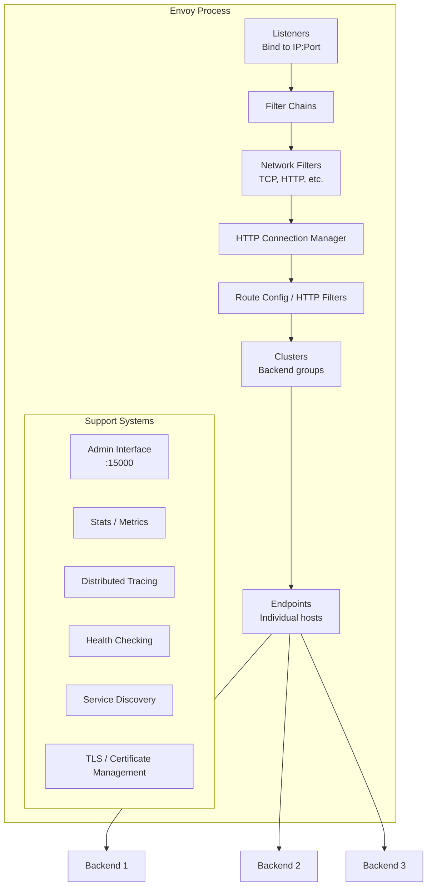
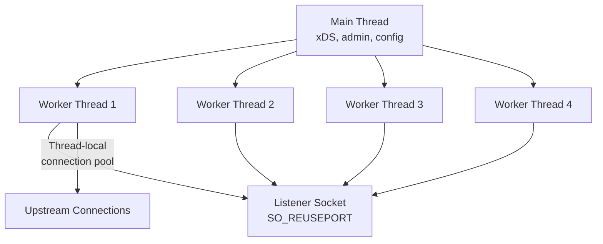
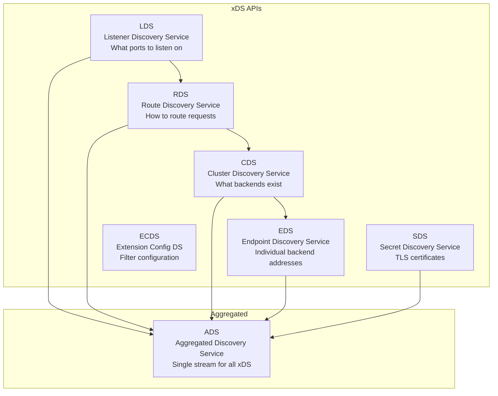
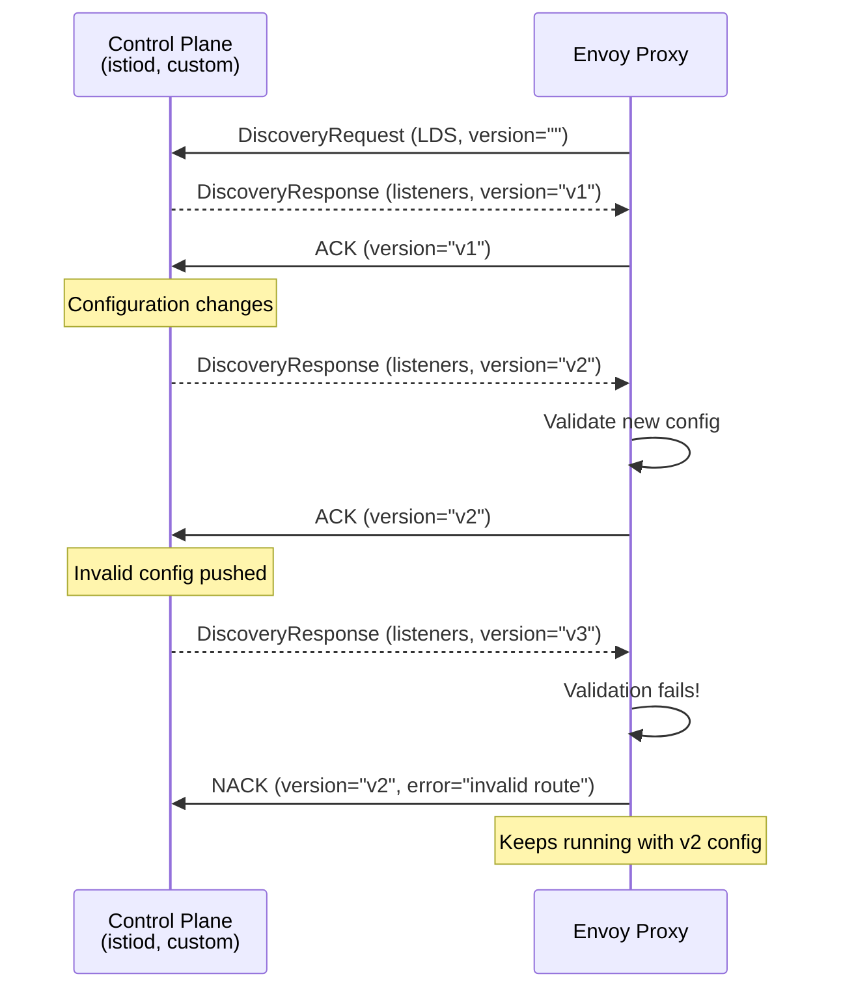
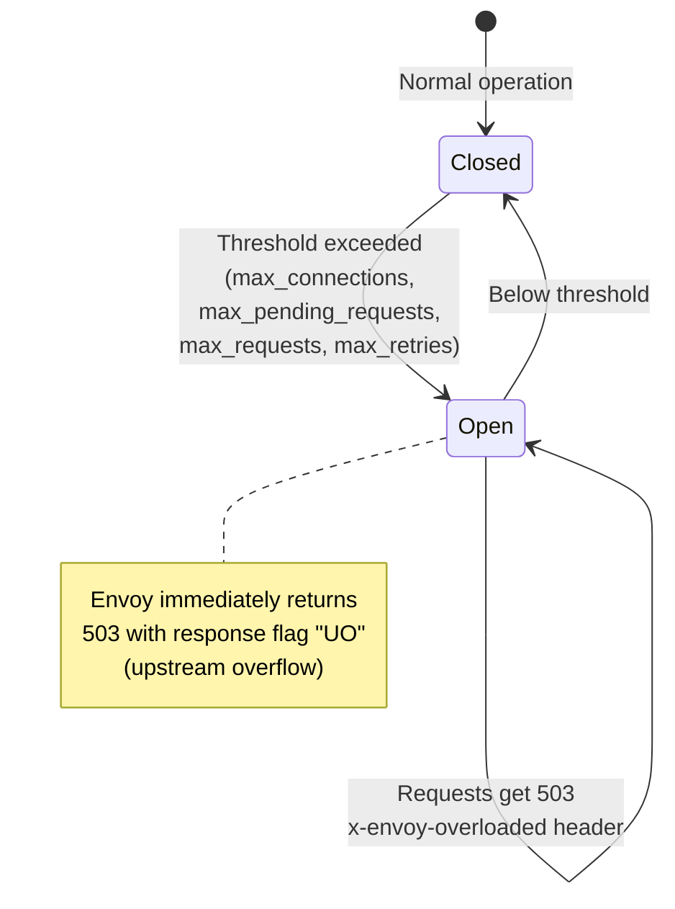
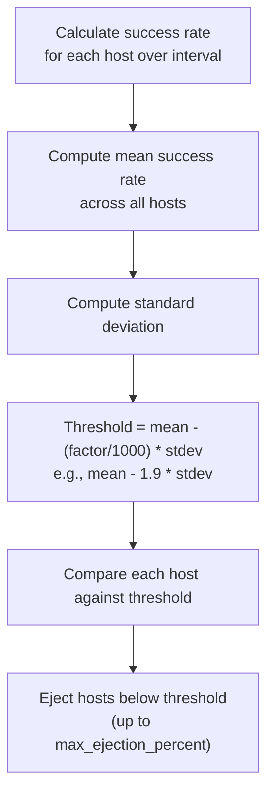
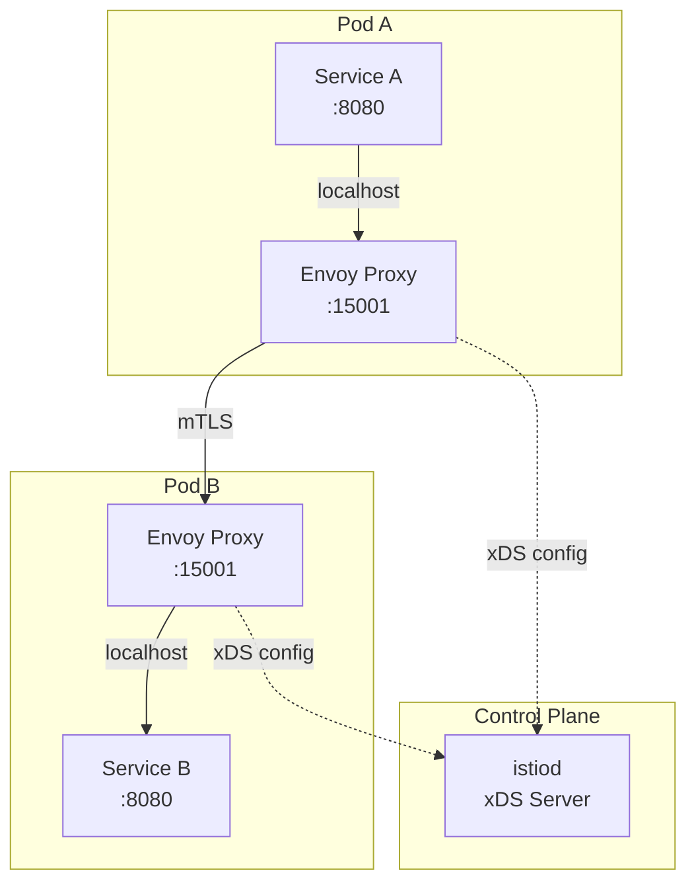
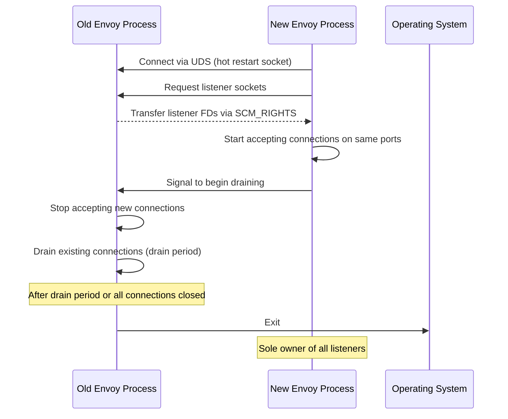

# Envoy Proxy Configuration

## Why Envoy Exists

Envoy was built at Lyft starting in 2015 and open-sourced in 2016 to solve a problem that existing proxies (HAProxy, Nginx) were not designed for: acting as a universal data plane in a microservices architecture. While HAProxy and Nginx excel as edge proxies, they were not designed for the sidecar pattern — running alongside every service instance with dynamic configuration, deep observability, and protocol-aware routing.

Envoy was designed from the ground up for:
1. **Dynamic configuration** via APIs (xDS) rather than static config files
2. **Universal observability** — L7 metrics, distributed tracing, access logs for every request
3. **Modern protocols** — HTTP/2, gRPC, WebSocket as first-class citizens
4. **Extension model** — WASM and native C++ filters
5. **Service mesh data plane** — the foundation of Istio, AWS App Mesh, and Consul Connect

### Envoy vs Traditional Proxies

| Aspect | Envoy | HAProxy | Nginx |
|--------|-------|---------|-------|
| Configuration | API-driven (xDS) | Static file + reload | Static file + reload |
| Protocol support | HTTP/1.1, HTTP/2, gRPC, TCP, UDP, Thrift | HTTP/1.1, HTTP/2, TCP | HTTP/1.1, HTTP/2, TCP |
| Observability | Built-in stats, tracing, logging | Stats page, logs | Stub status, logs |
| Hot restart | Yes (graceful) | Fork-based reload | Binary upgrade |
| WASM extensions | Yes | No | No |
| Service mesh | Primary data plane | No | Limited (Nginx SM, discontinued) |
| Memory usage | Higher (~30MB base) | Lower (~5MB base) | Lower (~5MB base) |
| Latency | ~0.2-0.5ms added | ~0.05-0.2ms added | ~0.1-0.3ms added |

## First Principles

### Envoy Architecture



### Core Concepts

- **Listener**: Network location (IP:port) where Envoy accepts connections
- **Filter Chain**: Ordered list of network-level filters applied to a connection
- **HTTP Connection Manager (HCM)**: L7 filter that decodes HTTP, applies HTTP filters, and routes
- **Route**: Maps incoming requests to clusters based on path, headers, etc.
- **Cluster**: Group of logically equivalent upstream hosts
- **Endpoint**: Individual host within a cluster
- **Filter**: Processing logic (network-level or HTTP-level)

### Threading Model

Envoy uses a multi-threaded architecture with a main thread and worker threads:



Each worker thread:
- Has its own event loop (libevent)
- Owns connections for their lifetime (no handoff between threads)
- Maintains thread-local copies of configuration and statistics
- Has separate upstream connection pools

This design eliminates lock contention — threads share nothing during request processing.

## Core Configuration

### Static Configuration

```yaml
# envoy.yaml — Complete static configuration example
admin:
  address:
    socket_address:
      address: 0.0.0.0
      port_value: 15000
  access_log:
    - name: envoy.access_loggers.file
      typed_config:
        "@type": type.googleapis.com/envoy.extensions.access_loggers.file.v3.FileAccessLog
        path: /dev/null

static_resources:
  listeners:
    - name: http_listener
      address:
        socket_address:
          address: 0.0.0.0
          port_value: 8080
      filter_chains:
        - filters:
            - name: envoy.filters.network.http_connection_manager
              typed_config:
                "@type": type.googleapis.com/envoy.extensions.filters.network.http_connection_manager.v3.HttpConnectionManager
                stat_prefix: ingress_http
                codec_type: AUTO
                generate_request_id: true
                tracing:
                  provider:
                    name: envoy.tracers.zipkin
                    typed_config:
                      "@type": type.googleapis.com/envoy.config.trace.v3.ZipkinConfig
                      collector_cluster: zipkin
                      collector_endpoint: /api/v2/spans
                      collector_endpoint_version: HTTP_JSON
                access_log:
                  - name: envoy.access_loggers.file
                    typed_config:
                      "@type": type.googleapis.com/envoy.extensions.access_loggers.file.v3.FileAccessLog
                      path: /var/log/envoy/access.log
                      log_format:
                        json_format:
                          timestamp: "%START_TIME%"
                          method: "%REQ(:METHOD)%"
                          path: "%REQ(X-ENVOY-ORIGINAL-PATH?:PATH)%"
                          protocol: "%PROTOCOL%"
                          response_code: "%RESPONSE_CODE%"
                          response_flags: "%RESPONSE_FLAGS%"
                          duration: "%DURATION%"
                          upstream_host: "%UPSTREAM_HOST%"
                          upstream_cluster: "%UPSTREAM_CLUSTER%"
                          request_id: "%REQ(X-REQUEST-ID)%"
                http_filters:
                  # Rate limiting filter
                  - name: envoy.filters.http.local_ratelimit
                    typed_config:
                      "@type": type.googleapis.com/envoy.extensions.filters.http.local_ratelimit.v3.LocalRateLimit
                      stat_prefix: http_local_rate_limiter
                      token_bucket:
                        max_tokens: 1000
                        tokens_per_fill: 1000
                        fill_interval: 60s
                      filter_enabled:
                        runtime_key: local_rate_limit_enabled
                        default_value:
                          numerator: 100
                          denominator: HUNDRED
                      filter_enforced:
                        runtime_key: local_rate_limit_enforced
                        default_value:
                          numerator: 100
                          denominator: HUNDRED
                  # Router filter (must be last)
                  - name: envoy.filters.http.router
                    typed_config:
                      "@type": type.googleapis.com/envoy.extensions.filters.http.router.v3.Router
                route_config:
                  name: local_route
                  virtual_hosts:
                    - name: api_service
                      domains: ["api.example.com"]
                      routes:
                        - match:
                            prefix: "/api/v2/"
                          route:
                            cluster: api_v2
                            timeout: 30s
                            retry_policy:
                              retry_on: "5xx,connect-failure,refused-stream"
                              num_retries: 3
                              per_try_timeout: 10s
                              retry_back_off:
                                base_interval: 0.1s
                                max_interval: 1s
                        - match:
                            prefix: "/api/"
                          route:
                            cluster: api_v1
                            timeout: 15s
                        - match:
                            prefix: "/"
                          route:
                            cluster: web_app
                            timeout: 10s
                    - name: grpc_service
                      domains: ["grpc.example.com"]
                      routes:
                        - match:
                            prefix: "/"
                            grpc: {}
                          route:
                            cluster: grpc_backend
                            timeout: 60s
                            max_stream_duration:
                              max_stream_duration: 300s

  clusters:
    - name: api_v2
      type: STRICT_DNS
      dns_lookup_family: V4_ONLY
      lb_policy: LEAST_REQUEST
      connect_timeout: 5s
      load_assignment:
        cluster_name: api_v2
        endpoints:
          - lb_endpoints:
              - endpoint:
                  address:
                    socket_address:
                      address: api-v2.internal
                      port_value: 8080
                  health_check_config:
                    port_value: 8081
      health_checks:
        - timeout: 5s
          interval: 10s
          unhealthy_threshold: 3
          healthy_threshold: 2
          http_health_check:
            path: /health
            expected_statuses:
              - start: 200
                end: 200
      circuit_breakers:
        thresholds:
          - priority: DEFAULT
            max_connections: 1000
            max_pending_requests: 500
            max_requests: 5000
            max_retries: 3
          - priority: HIGH
            max_connections: 2000
            max_pending_requests: 1000
            max_requests: 10000
            max_retries: 10
      outlier_detection:
        consecutive_5xx: 5
        interval: 10s
        base_ejection_time: 30s
        max_ejection_percent: 50
        consecutive_gateway_failure: 3
        enforcing_consecutive_5xx: 100
        enforcing_success_rate: 100
        success_rate_minimum_hosts: 3
        success_rate_request_volume: 100
        success_rate_stdev_factor: 1900

    - name: api_v1
      type: STRICT_DNS
      lb_policy: ROUND_ROBIN
      connect_timeout: 5s
      load_assignment:
        cluster_name: api_v1
        endpoints:
          - lb_endpoints:
              - endpoint:
                  address:
                    socket_address:
                      address: api-v1-1.internal
                      port_value: 8080
              - endpoint:
                  address:
                    socket_address:
                      address: api-v1-2.internal
                      port_value: 8080

    - name: web_app
      type: STRICT_DNS
      lb_policy: ROUND_ROBIN
      connect_timeout: 5s
      load_assignment:
        cluster_name: web_app
        endpoints:
          - lb_endpoints:
              - endpoint:
                  address:
                    socket_address:
                      address: web.internal
                      port_value: 3000

    - name: grpc_backend
      type: STRICT_DNS
      lb_policy: ROUND_ROBIN
      typed_extension_protocol_options:
        envoy.extensions.upstreams.http.v3.HttpProtocolOptions:
          "@type": type.googleapis.com/envoy.extensions.upstreams.http.v3.HttpProtocolOptions
          explicit_http_config:
            http2_protocol_options: {}
      connect_timeout: 5s
      load_assignment:
        cluster_name: grpc_backend
        endpoints:
          - lb_endpoints:
              - endpoint:
                  address:
                    socket_address:
                      address: grpc.internal
                      port_value: 50051
```

## xDS API — Dynamic Configuration

### The xDS Protocol Family

xDS (x Discovery Service) is a set of gRPC/REST APIs for dynamic Envoy configuration:



### xDS Update Flow



### Implementing an xDS Control Plane

```typescript
import * as grpc from '@grpc/grpc-js';

// Types for xDS configuration
interface Listener {
  name: string;
  address: string;
  port: number;
  routes: Route[];
}

interface Route {
  prefix: string;
  cluster: string;
  timeout: number;
  retries: number;
}

interface Cluster {
  name: string;
  lbPolicy: 'ROUND_ROBIN' | 'LEAST_REQUEST' | 'RING_HASH' | 'RANDOM';
  connectTimeout: number;
  endpoints: Endpoint[];
  circuitBreakers?: CircuitBreakerConfig;
  outlierDetection?: OutlierDetectionConfig;
}

interface Endpoint {
  address: string;
  port: number;
  weight: number;
  healthStatus: 'HEALTHY' | 'UNHEALTHY' | 'DEGRADED' | 'DRAINING';
  metadata: Record<string, string>;
  zone: string;
}

interface CircuitBreakerConfig {
  maxConnections: number;
  maxPendingRequests: number;
  maxRequests: number;
  maxRetries: number;
}

interface OutlierDetectionConfig {
  consecutive5xx: number;
  intervalMs: number;
  baseEjectionTimeMs: number;
  maxEjectionPercent: number;
}

// Snapshot-based xDS server
class XdsControlPlane {
  private snapshots: Map<string, ConfigSnapshot> = new Map();
  private watchers: Map<string, Set<ConfigWatcher>> = new Map();
  private version = 0;

  setConfig(nodeId: string, config: {
    listeners: Listener[];
    clusters: Cluster[];
  }): void {
    this.version++;
    const snapshot: ConfigSnapshot = {
      version: `v${this.version}`,
      listeners: config.listeners,
      clusters: config.clusters,
      timestamp: Date.now(),
    };

    this.snapshots.set(nodeId, snapshot);

    // Notify watchers
    const nodeWatchers = this.watchers.get(nodeId) ?? new Set();
    for (const watcher of nodeWatchers) {
      watcher.onConfigUpdate(snapshot);
    }
  }

  getSnapshot(nodeId: string): ConfigSnapshot | undefined {
    return this.snapshots.get(nodeId);
  }

  addWatcher(nodeId: string, watcher: ConfigWatcher): void {
    if (!this.watchers.has(nodeId)) {
      this.watchers.set(nodeId, new Set());
    }
    this.watchers.get(nodeId)!.add(watcher);
  }

  removeWatcher(nodeId: string, watcher: ConfigWatcher): void {
    this.watchers.get(nodeId)?.delete(watcher);
  }

  // Generate Envoy-compatible EDS response
  generateEdsResponse(cluster: Cluster): object {
    const localityEndpoints = this.groupByZone(cluster.endpoints);

    return {
      '@type': 'type.googleapis.com/envoy.config.endpoint.v3.ClusterLoadAssignment',
      cluster_name: cluster.name,
      endpoints: localityEndpoints.map(([zone, endpoints]) => ({
        locality: { zone },
        lb_endpoints: endpoints.map((ep) => ({
          endpoint: {
            address: {
              socket_address: {
                address: ep.address,
                port_value: ep.port,
              },
            },
            health_check_config: {
              port_value: ep.port + 1,
            },
          },
          health_status: ep.healthStatus,
          load_balancing_weight: { value: ep.weight },
          metadata: {
            filter_metadata: {
              'envoy.lb': ep.metadata,
            },
          },
        })),
      })),
    };
  }

  private groupByZone(endpoints: Endpoint[]): [string, Endpoint[]][] {
    const groups = new Map<string, Endpoint[]>();
    for (const ep of endpoints) {
      const zone = ep.zone || 'default';
      if (!groups.has(zone)) groups.set(zone, []);
      groups.get(zone)!.push(ep);
    }
    return Array.from(groups.entries());
  }
}

interface ConfigSnapshot {
  version: string;
  listeners: Listener[];
  clusters: Cluster[];
  timestamp: number;
}

interface ConfigWatcher {
  onConfigUpdate(snapshot: ConfigSnapshot): void;
}
```

## Circuit Breaking

### How Circuit Breaking Works in Envoy

Envoy implements circuit breaking at the cluster level to prevent cascading failures:



Unlike traditional circuit breakers (Hystrix-style with half-open state), Envoy's circuit breakers are **resource-based**. They limit concurrent usage rather than tracking error rates (that is outlier detection's job).

### Circuit Breaker Configuration

```yaml
clusters:
  - name: payment_service
    circuit_breakers:
      thresholds:
        # DEFAULT priority
        - priority: DEFAULT
          max_connections: 1000          # Max TCP connections
          max_pending_requests: 500      # Max requests waiting for connection
          max_requests: 5000             # Max active requests
          max_retries: 3                 # Max concurrent retries
          track_remaining: true          # Expose remaining capacity in stats

        # HIGH priority (bypass defaults during critical requests)
        - priority: HIGH
          max_connections: 2000
          max_pending_requests: 1000
          max_requests: 10000
          max_retries: 10
```

### Circuit Breaker Sizing

$$
\text{max\_connections} \geq \text{QPS} \times \text{avg\_latency} \times \text{safety\_factor}
$$

For a service handling 1,000 QPS with 50ms average latency:

$$
\text{max\_connections} \geq 1{,}000 \times 0.05 \times 2 = 100
$$

The safety factor (2x) accounts for latency spikes. For `max_pending_requests`:

$$
\text{max\_pending} = \text{max\_connections} \times \frac{T_{\text{spike}}}{T_{\text{normal}}} - \text{max\_connections}
$$

If spike latency is 5x normal:

$$
\text{max\_pending} = 100 \times 5 - 100 = 400
$$

## Outlier Detection

Outlier detection is Envoy's mechanism for ejecting unhealthy hosts from a cluster dynamically, based on observed behavior rather than active health checks.

### Outlier Detection Configuration

```yaml
clusters:
  - name: api_backend
    outlier_detection:
      # Consecutive 5xx detection
      consecutive_5xx: 5                   # Eject after 5 consecutive 5xx
      enforcing_consecutive_5xx: 100       # 100% enforcement

      # Consecutive gateway failures (502, 503, 504)
      consecutive_gateway_failure: 3
      enforcing_consecutive_gateway_failure: 100

      # Success rate detection (statistical)
      success_rate_minimum_hosts: 5        # Need at least 5 hosts
      success_rate_request_volume: 100     # Min requests per interval
      success_rate_stdev_factor: 1900      # 1.9 standard deviations

      # Common settings
      interval: 10s                        # Evaluation interval
      base_ejection_time: 30s             # Initial ejection duration
      max_ejection_percent: 50            # Never eject more than 50%
      max_ejection_time: 300s             # Maximum ejection duration
```

### How Success Rate Outlier Detection Works



If 5 hosts have success rates of [99%, 98%, 97%, 95%, 60%]:

$$
\mu = 89.8\%, \quad \sigma = 16.1\%
$$

$$
\text{Threshold} = 89.8\% - 1.9 \times 16.1\% = 59.2\%
$$

The host at 60% is just above the threshold and survives. But if it drops to 55%, it gets ejected. The `stdev_factor` of 1900 means 1.9 standard deviations — higher values are more lenient.

### Ejection Duration

Each successive ejection increases the duration:

$$
T_{\text{ejection}} = \min(\text{base\_ejection\_time} \times N_{\text{ejections}}, \text{max\_ejection\_time})
$$

First ejection: 30s, second: 60s, third: 90s, up to max 300s. This implements exponential backoff for repeatedly failing hosts.

::: info War Story
A payments team configured outlier detection with `consecutive_5xx: 3` and `max_ejection_percent: 100`. During a database failover, all backend hosts returned 5xx for approximately 10 seconds. Envoy ejected all hosts, causing a complete outage even after the database recovered — there were no hosts left to handle traffic. They changed `max_ejection_percent` to 50 (ensuring at least half the fleet stays in rotation) and increased `consecutive_5xx` to 5 to tolerate brief transient errors.
:::

## Service Mesh Data Plane

### Envoy as a Sidecar

In a service mesh, Envoy runs as a sidecar proxy next to every service instance:



### Traffic Interception

On Kubernetes, Istio uses iptables rules (injected by init container) to redirect all traffic through Envoy:

```bash
# Inbound traffic: redirect all TCP to Envoy's inbound listener
iptables -t nat -A PREROUTING -p tcp -j REDIRECT --to-port 15006

# Outbound traffic: redirect all TCP to Envoy's outbound listener
iptables -t nat -A OUTPUT -p tcp -j REDIRECT --to-port 15001

# Exceptions: don't redirect Envoy's own traffic (UID 1337)
iptables -t nat -A OUTPUT -m owner --uid-owner 1337 -j RETURN

# Don't redirect traffic to localhost
iptables -t nat -A OUTPUT -d 127.0.0.1/32 -j RETURN
```

### mTLS in the Mesh

```yaml
# Istio PeerAuthentication — require mTLS for all services in namespace
apiVersion: security.istio.io/v1
kind: PeerAuthentication
metadata:
  name: default
  namespace: production
spec:
  mtls:
    mode: STRICT
---
# Istio DestinationRule — configure TLS for specific service
apiVersion: networking.istio.io/v1
kind: DestinationRule
metadata:
  name: orders-mtls
  namespace: production
spec:
  host: orders-svc.production.svc.cluster.local
  trafficPolicy:
    tls:
      mode: ISTIO_MUTUAL
    connectionPool:
      tcp:
        maxConnections: 1000
        connectTimeout: 5s
      http:
        h2UpgradePolicy: UPGRADE
        maxRequestsPerConnection: 100
    outlierDetection:
      consecutive5xxErrors: 5
      interval: 10s
      baseEjectionTime: 30s
      maxEjectionPercent: 50
```

## Edge Cases and Failure Modes

### Envoy Response Flags

Envoy sets response flags that explain why a request failed. These appear in access logs as `%RESPONSE_FLAGS%`:

| Flag | Meaning | Common Cause |
|------|---------|--------------|
| `UH` | No healthy upstream | All hosts failing health checks |
| `UF` | Upstream connection failure | Backend not reachable |
| `UO` | Upstream overflow (circuit breaker) | Circuit breaker tripped |
| `UT` | Upstream request timeout | Backend too slow |
| `UC` | Upstream connection termination | Backend closed connection |
| `UR` | Upstream connection reset | Backend sent TCP RST |
| `LH` | Local service failed health check | Envoy's own health check endpoint |
| `LR` | Connection local reset | Envoy reset the connection |
| `DC` | Downstream connection termination | Client disconnected |
| `NR` | No route configured | Missing route for request |
| `RL` | Rate limited | Rate limit filter triggered |
| `DPE` | Downstream protocol error | Malformed request |
| `UAEX` | Unauthorized external | External authz denied |
| `IH` | Invalid response from health check | Backend health check returned invalid status |

### Hot Restart Process



Hot restart key parameters:
- `--drain-time-s`: How long the old process drains (default 600s)
- `--parent-shutdown-time-s`: How long before forcefully killing old process (default 900s)
- `--restart-epoch`: Must increment for each restart

### Memory Pressure

Envoy's per-connection memory usage:

$$
\text{Memory per connection} \approx \text{buffer\_size} \times 2 + \text{filter\_state} + \text{metadata}
$$

With default 1MB buffer limit per stream and HTTP/2 with 100 concurrent streams:

$$
\text{Worst case per connection} = 1\text{MB} \times 100 \times 2 = 200\text{MB}
$$

::: danger
A single HTTP/2 connection with many active streams can consume hundreds of megabytes. Configure `initial_stream_window_size` and `initial_connection_window_size` to limit buffering. Also set `max_concurrent_streams` to cap stream count per connection (default 2,147,483,647).
:::

```yaml
# Limit HTTP/2 resource usage
typed_extension_protocol_options:
  envoy.extensions.upstreams.http.v3.HttpProtocolOptions:
    "@type": type.googleapis.com/envoy.extensions.upstreams.http.v3.HttpProtocolOptions
    explicit_http_config:
      http2_protocol_options:
        max_concurrent_streams: 100
        initial_stream_window_size: 65536    # 64KB
        initial_connection_window_size: 1048576  # 1MB
```

## Performance Characteristics

### Latency Overhead

| Deployment Pattern | Added Latency (p50) | Added Latency (p99) |
|-------------------|---------------------|---------------------|
| Edge proxy | 0.2ms | 0.5ms |
| Sidecar (same pod) | 0.3ms | 1.0ms |
| Full mesh path (2 sidecars) | 0.6ms | 2.0ms |
| With mTLS | +0.2ms | +0.5ms |
| With WASM filter | +0.1-1.0ms | +0.5-5.0ms |

### Connection Pool Sizing

Envoy maintains per-thread connection pools to each upstream cluster:

$$
\text{Total connections} = N_{\text{threads}} \times \text{max\_connections\_per\_thread}
$$

For 4 worker threads with 250 connections each:

$$
\text{Total} = 4 \times 250 = 1{,}000 \text{ connections to each upstream cluster}
$$

### Resource Usage (Sidecar)

| Resource | Idle | 1K RPS | 10K RPS |
|----------|------|--------|---------|
| CPU | 0.01 cores | 0.1 cores | 0.5 cores |
| Memory | 30MB | 50MB | 100MB |
| File descriptors | ~50 | ~500 | ~5000 |

## Mathematical Foundations

### Retry Budget and Amplification

Retries amplify load. With retry ratio $r$ (retries per original request):

$$
\text{Effective load} = \text{Original load} \times (1 + r)^d
$$

where $d$ is the depth of the call chain. For 3 retries at each of 5 service levels:

$$
\text{Amplification} = 4^5 = 1{,}024\times
$$

Envoy limits this with:
- `max_retries` circuit breaker (concurrent retry limit)
- Retry budgets (percentage of active requests allowed as retries)
- `x-envoy-retry-on` and `x-envoy-max-retries` headers

### Load Balancing: Power of Two Choices

Envoy's `LEAST_REQUEST` (with choice_count=2) implements the "Power of Two Random Choices" algorithm:

$$
E[\text{max load}] = \frac{\ln \ln n}{\ln 2} + O(1)
$$

compared to pure random's $O(\ln n / \ln \ln n)$. For 100 servers, this reduces maximum load imbalance from ~5x to ~2x average.

### Locality-Weighted Load Balancing

Envoy supports locality-aware routing to minimize cross-zone traffic:

$$
W_{\text{effective}}(z) = W_{\text{configured}}(z) \times \frac{\text{healthy}_z}{\text{total}_z} \times P_{\text{priority}}
$$

When a zone has degraded health, traffic spills to adjacent zones proportionally.

## Decision Framework

### When to Use Envoy

| Scenario | Envoy | HAProxy | Nginx |
|----------|-------|---------|-------|
| Service mesh sidecar | Excellent | Not designed | Limited |
| Edge proxy | Good | Excellent | Excellent |
| Dynamic configuration | Excellent (xDS) | Limited (reload) | Limited (reload) |
| gRPC-heavy workloads | Excellent | Good | Good |
| Observability requirements | Built-in | External | External |
| Team expertise | Steep learning curve | Moderate | Shallow |
| Resource-constrained | Higher overhead | Lower | Lower |

### Envoy vs Istio Decision

| Need | Envoy Standalone | Istio (Envoy + Control Plane) |
|------|------------------|-------------------------------|
| Simple service mesh | Overkill | Good fit |
| Custom control plane | Yes | No (use Istio's) |
| Non-Kubernetes | Yes | Limited |
| Maximum control | Yes | Abstracted away |
| Operational simplicity | More work | More automation |

## Advanced Topics

### WASM (WebAssembly) Extensions

Envoy supports WASM filters for custom logic without recompiling:

```yaml
http_filters:
  - name: envoy.filters.http.wasm
    typed_config:
      "@type": type.googleapis.com/envoy.extensions.filters.http.wasm.v3.Wasm
      config:
        name: custom_auth
        root_id: custom_auth_root
        vm_config:
          runtime: envoy.wasm.runtime.v8
          code:
            local:
              filename: /etc/envoy/filters/auth.wasm
          configuration:
            "@type": type.googleapis.com/google.protobuf.StringValue
            value: |
              {"auth_server": "http://auth-svc:8080/validate"}
```

### External Authorization

```yaml
http_filters:
  - name: envoy.filters.http.ext_authz
    typed_config:
      "@type": type.googleapis.com/envoy.extensions.filters.http.ext_authz.v3.ExtAuthz
      grpc_service:
        envoy_grpc:
          cluster_name: ext_authz_cluster
        timeout: 0.5s
      failure_mode_allow: false
      with_request_body:
        max_request_bytes: 8192
        allow_partial_message: true
      transport_api_version: V3
```

### Envoy Access Log Analysis

```typescript
interface EnvoyAccessLog {
  timestamp: string;
  method: string;
  path: string;
  protocol: string;
  responseCode: number;
  responseFlags: string;
  duration: number;
  upstreamHost: string;
  upstreamCluster: string;
  requestId: string;
}

function parseEnvoyFlags(flags: string): string[] {
  const flagMeanings: Record<string, string> = {
    UH: 'No healthy upstream',
    UF: 'Upstream connection failure',
    UO: 'Upstream overflow (circuit breaker)',
    UT: 'Upstream timeout',
    UC: 'Upstream connection termination',
    UR: 'Upstream connection reset',
    LR: 'Local reset',
    DC: 'Downstream connection termination',
    NR: 'No route configured',
    RL: 'Rate limited',
    DPE: 'Downstream protocol error',
  };

  if (!flags || flags === '-') return ['No flags (success)'];

  return flags.split(',').map((flag) => {
    const trimmed = flag.trim();
    return flagMeanings[trimmed] ?? `Unknown flag: ${trimmed}`;
  });
}

function analyzeAccessLogs(logs: EnvoyAccessLog[]): {
  totalRequests: number;
  errorRate: number;
  p50Latency: number;
  p99Latency: number;
  topErrors: Map<string, number>;
  unhealthyUpstreams: Set<string>;
} {
  const errors = logs.filter((l) => l.responseCode >= 500);
  const durations = logs.map((l) => l.duration).sort((a, b) => a - b);

  const flagCounts = new Map<string, number>();
  for (const log of errors) {
    const flags = log.responseFlags || '-';
    flagCounts.set(flags, (flagCounts.get(flags) ?? 0) + 1);
  }

  const unhealthy = new Set<string>();
  for (const log of logs) {
    if (log.responseFlags?.includes('UH')) {
      unhealthy.add(log.upstreamCluster);
    }
  }

  return {
    totalRequests: logs.length,
    errorRate: errors.length / logs.length,
    p50Latency: durations[Math.floor(durations.length * 0.5)],
    p99Latency: durations[Math.floor(durations.length * 0.99)],
    topErrors: flagCounts,
    unhealthyUpstreams: unhealthy,
  };
}
```

### Tap Filter for Request-Level Debugging

Envoy's tap filter captures full request/response bodies for debugging:

```yaml
http_filters:
  - name: envoy.filters.http.tap
    typed_config:
      "@type": type.googleapis.com/envoy.extensions.filters.http.tap.v3.Tap
      common_config:
        admin_config:
          config_id: tap_config
```

Then via the admin API:

```bash
# Start tapping requests matching a specific header
curl -X POST http://localhost:15000/tap \
  -d '{
    "config_id": "tap_config",
    "tap_config": {
      "match_config": {
        "http_request_headers_match": {
          "headers": [
            {"name": "x-debug", "exact_match": "true"}
          ]
        }
      },
      "output_config": {
        "sinks": [
          {"streaming_admin": {}}
        ],
        "max_buffered_rx_bytes": 1024,
        "max_buffered_tx_bytes": 1024
      }
    }
  }'
```

This allows debugging specific requests in production without affecting other traffic — send a request with `x-debug: true` header and see the full request/response flow including upstream timing, headers, and body.
