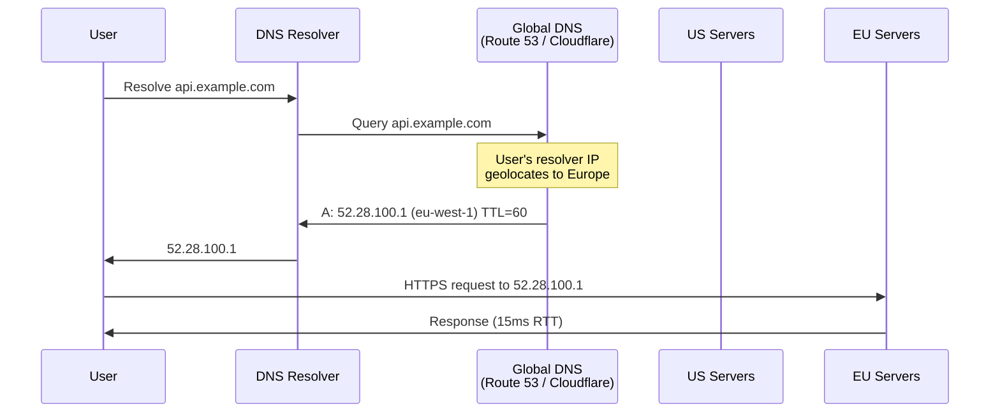
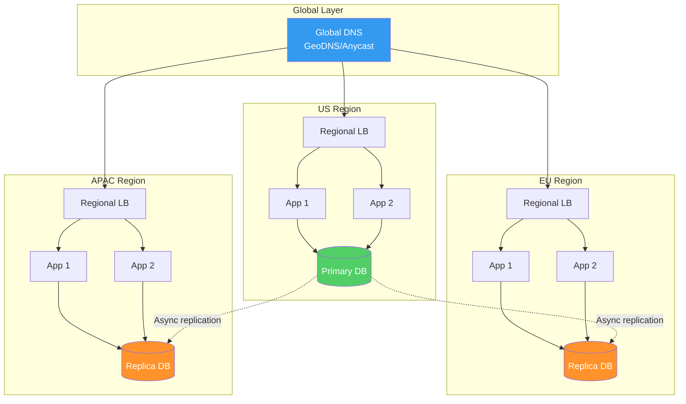
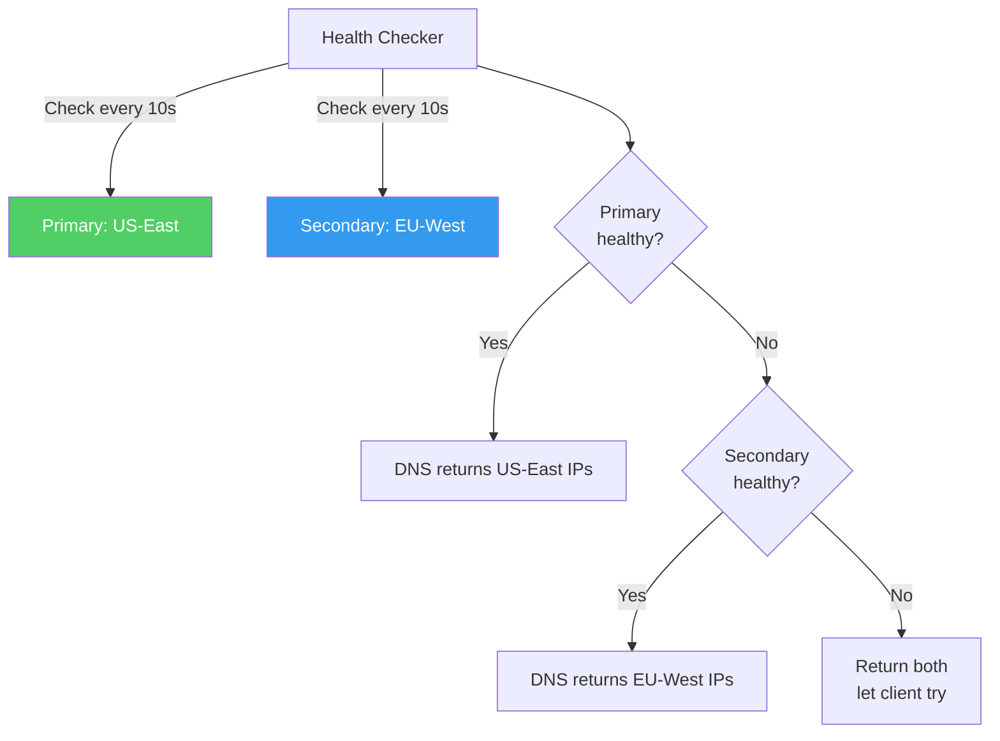
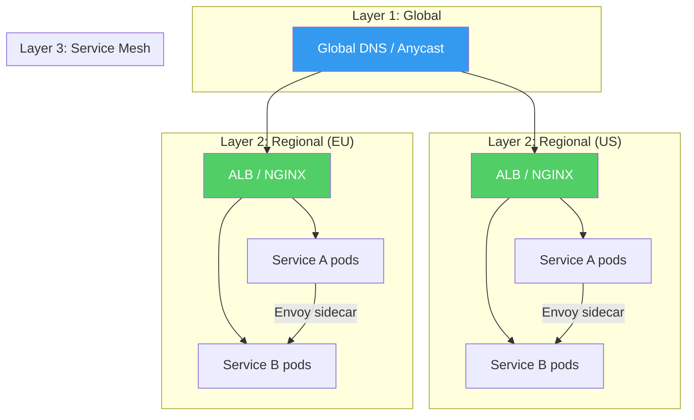

# Global Load Balancing

Local load balancing distributes traffic across servers within a single data center or region. Global load balancing distributes traffic across data centers, regions, or continents. It answers the question: "Which of our 5 data centers around the world should this user's request go to?"

The stakes are higher at this level. A local load balancer failure affects one region. A global load balancer misconfiguration can send European users to Asian data centers (adding 300ms latency), fail to route around a regional outage (complete service loss for a continent), or create split-brain scenarios where users see different data depending on which region they hit.

This page covers the three primary mechanisms for global traffic management — DNS-based routing, anycast, and application-level global load balancing — along with production implementations using AWS Route 53 and Cloudflare.

## Why Global Load Balancing Matters

### Latency Reduction

The speed of light imposes a hard physical limit on network latency. A round trip from New York to London (~5,500 km) takes a minimum of ~55ms just for the speed of light in fiber (actual RTT is typically 70-80ms due to routing). A round trip from New York to Tokyo (~10,800 km) takes ~100-120ms.

```
User in London → Server in us-east-1 (Virginia):  ~80ms RTT
User in London → Server in eu-west-1 (Ireland):   ~15ms RTT
                                                    ─────
                                                    65ms saved per round trip
```

For an API call that makes 3 sequential database queries, the difference is $3 \times 65 = 195\text{ms}$ — the difference between a snappy experience and noticeable lag.

### High Availability Across Regions

A single-region deployment is vulnerable to:
- Regional cloud outages (entire AWS region goes down — this has happened)
- Natural disasters affecting the data center location
- Network partition isolating the region from parts of the internet
- Power grid failures affecting the region

Multi-region deployment with global load balancing provides the ability to survive any of these events by routing traffic to surviving regions.

### Regulatory Compliance

Some data must stay within geographic boundaries:
- GDPR requires EU user data processed within the EU
- Data sovereignty laws in various countries
- Financial regulations requiring local data processing

Global load balancing can route users to region-appropriate data centers to comply with these requirements.

## DNS-Based Global Load Balancing

DNS is the original and most widely deployed global load balancing mechanism. The concept is simple: when a user resolves `api.example.com`, the DNS server returns different IP addresses based on where the user is located, the health of backend servers, or other criteria.

### How DNS-Based Routing Works



The key insight: the DNS server doesn't see the user's IP — it sees the **DNS resolver's IP**. Since most resolvers are geographically close to their users, this is a reasonable approximation. Google's 8.8.8.8 and Cloudflare's 1.1.1.1 use EDNS Client Subnet (ECS) to forward part of the client's IP to the authoritative DNS server, improving accuracy.

### Routing Strategies

#### 1. Geographic Routing (GeoDNS)

Return different DNS records based on the geographic location of the resolver (or client, via ECS).

```
User in North America → us-east.example.com     (Virginia)
User in Europe         → eu-west.example.com     (Ireland)
User in Asia-Pacific   → ap-south.example.com    (Mumbai)
User in South America  → sa-east.example.com     (São Paulo)
Default (unknown)      → us-east.example.com     (fallback)
```

**How geolocation works:**

DNS providers maintain databases mapping IP ranges to geographic locations. These databases are built from:
- Regional Internet Registry (RIR) allocations (ARIN, RIPE, APNIC, etc.)
- BGP route announcements
- Commercial geolocation databases (MaxMind GeoIP2)
- User-reported data and measurement networks

Accuracy is typically:
- Country-level: 99%+
- State/province: 85-95%
- City-level: 50-80%

For global load balancing, country-level accuracy is sufficient.

#### 2. Latency-Based Routing

Return the DNS record for the region with the lowest measured latency from the resolver's location. Unlike geographic routing (which uses a static geolocation database), latency-based routing uses active measurements.

AWS Route 53 implements this by:
1. Maintaining a global network of latency measurement points
2. Measuring RTT from each measurement point to each of your specified regions
3. When a DNS query arrives, matching the resolver's IP to the nearest measurement point
4. Returning the record for the lowest-latency region

```
Resolver IP: 203.0.113.50 (London ISP)

Measured latencies to your regions:
  eu-west-1 (Ireland):    12ms  ← lowest
  us-east-1 (Virginia):   78ms
  ap-southeast-1 (Singapore): 180ms

Route 53 returns: eu-west-1 IP address
```

Latency-based routing is strictly superior to geographic routing in most cases because it accounts for actual network topology rather than geographic proximity. A user in the UK might be closer to a US-East server than an EU-Central server due to how their ISP routes traffic.

#### 3. Weighted Routing

Distribute a percentage of traffic to each region based on configured weights. Useful for:
- Gradual migration between regions (send 5% to new region, increase over time)
- Cost optimization (send 80% to cheap region, 20% to expensive region)
- A/B testing at the region level

```
api.example.com:
  70% → us-east-1:    52.1.1.1
  20% → eu-west-1:    52.28.1.1
  10% → ap-south-1:   52.66.1.1
```

#### 4. Failover Routing

Configure primary and secondary records. The secondary is only returned when the primary fails health checks.

```
Primary:   us-east-1 (Virginia)     ← returned when healthy
Secondary: us-west-2 (Oregon)       ← returned when primary fails

Route 53 actively checks /healthz on the primary.
If the check fails, Route 53 returns the secondary IP.
```

This can be combined with other strategies:

```
Primary:   Latency-based routing to nearest healthy region
Secondary: Single global fallback region (if all others fail)
```

### DNS TTL and Failover Speed

The Achilles heel of DNS-based load balancing is the TTL (Time To Live). When Route 53 switches from the primary to the secondary, DNS resolvers around the world continue returning the old (primary) IP address until the cached record expires.

```
TTL = 300 seconds (5 minutes)

t=0     Primary fails
t=0     Route 53 detects failure (30-60 seconds with health checks)
t=60    Route 53 starts returning secondary IP
t=60    Clients with expired cache get new IP ✓
t=360   ALL clients finally have new IP (worst case: 300s TTL + detection time)
```

During those 5 minutes, some users still reach the failed primary endpoint.

**Mitigation strategies:**

1. **Low TTL (30-60 seconds):** Reduces failover time but increases DNS query volume and slightly increases latency for first-time visitors.

2. **Client-side retries:** Applications should retry failed requests to a different IP (DNS usually returns multiple addresses).

3. **Active-active setup:** Both regions are always serving traffic. Failover means the failed region's traffic redistributes to remaining regions — there's no switching delay, just increased load.

4. **Anycast (see below):** Removes DNS from the failover path entirely.

### DNS-Based Load Balancing Limitations

| Limitation | Description | Workaround |
|------------|-------------|------------|
| **TTL caching** | Clients and resolvers cache DNS records, delaying failover | Low TTL (30-60s), but can't go to zero |
| **Resolver granularity** | Routing based on resolver IP, not user IP | EDNS Client Subnet (ECS) |
| **No request awareness** | DNS has no knowledge of HTTP path, headers, or load | Combine with L7 LB at each region |
| **Limited health checking** | DNS health checks are basic (HTTP/TCP) | Supplement with application-level checks |
| **Sticky DNS** | Some resolvers ignore TTL (Android had this bug) | Multi-IP responses (multiple A records) |
| **No connection draining** | When DNS changes, in-flight connections to old IP continue | Application-level graceful shutdown |

## Anycast Routing

### How Anycast Works

In normal unicast routing, each IP address is assigned to one specific location. In anycast routing, the **same IP address** is announced from multiple locations worldwide. BGP (Border Gateway Protocol) routers naturally route traffic to the closest announcement point.

```
Anycast IP: 198.51.100.1

Announced from:
  ┌─────────────────────────────────────────────┐
  │              BGP Internet                    │
  │                                              │
  │    ┌─────┐   198.51.100.1   ┌─────┐         │
  │    │ DC1 │◀── announced ──▶│ DC2 │         │
  │    │ US  │   from both     │ EU  │         │
  │    └─────┘   locations     └─────┘         │
  │       ▲                       ▲             │
  │       │                       │             │
  │  US users                EU users           │
  │  route here              route here         │
  └─────────────────────────────────────────────┘
```

When a user in Paris sends a packet to 198.51.100.1, BGP routers naturally route it to the nearest announcement point (EU data center). A user in New York sending to the same IP gets routed to the US data center.

### Anycast vs DNS-Based Routing

| Property | DNS-Based | Anycast |
|----------|-----------|---------|
| **Failover speed** | TTL-limited (30s-5min) | Seconds (BGP convergence: 30-90s) |
| **Granularity** | Per-resolver | Per-BGP prefix (per-ISP routing) |
| **Caching problems** | Yes (resolver TTL) | No (IP-level routing) |
| **Protocol support** | Any (HTTP, TCP, UDP) | Best for UDP/short-lived TCP |
| **Long-lived TCP** | Works fine | Risky (BGP route change can break connection) |
| **Client changes** | Client DNS cache must expire | Transparent (same IP, different route) |
| **Implementation** | DNS provider feature | Requires BGP peering and ASN |

### Anycast and TCP: The Statefulness Problem

Anycast works perfectly for stateless protocols like DNS (UDP). But TCP connections are stateful — they require both endpoints to maintain state for the duration of the connection. If a BGP route changes mid-connection, subsequent packets may be routed to a different data center that has no knowledge of the TCP connection. The connection is broken.

```
t=0   Client in UK establishes TCP connection to 198.51.100.1
      BGP routes to EU data center
      Connection state maintained at EU-DC

t=30  BGP route change (EU-DC network issue)
      New route sends packets to US-DC
      US-DC receives packets for unknown TCP connection → RST
      Connection broken
```

**Mitigations:**

1. **ECMP-aware load balancing:** Use consistent hashing at the anycast layer so that even if a route changes, the same flow hash goes to the same server (if available).

2. **Short-lived connections:** HTTP/1.1 with `Connection: close` or HTTP/2 with short streams. If a connection breaks, the client retries and establishes a new connection (potentially to a different DC).

3. **QUIC/HTTP/3:** QUIC uses connection IDs rather than IP tuples. A connection can survive IP route changes because the connection ID is carried in every packet. This is one of the reasons Google developed QUIC.

4. **Session resumption:** TLS 1.3 0-RTT and session tickets allow quick re-establishment of connections if they break.

### Who Uses Anycast

- **Cloudflare:** Every one of Cloudflare's 300+ data centers announces the same IP ranges. Users are automatically routed to the nearest data center.
- **Google DNS (8.8.8.8):** Anycast routes DNS queries to Google's nearest resolver.
- **AWS Global Accelerator:** Uses anycast to route traffic to the nearest AWS edge location, then uses AWS's private network to reach the destination region.
- **CDNs:** Most CDN providers (Akamai, Fastly, CloudFront) use anycast for their edge nodes.

## Multi-Region Traffic Management

### Active-Active Multi-Region

All regions serve traffic simultaneously. This is the gold standard for availability and latency but the most complex to operate.



**Challenges:**

1. **Data consistency:** With async replication, reads in EU might return stale data. Writes typically go to a primary region.
2. **Write routing:** Writes must be routed to the primary database region (or use multi-master replication with conflict resolution).
3. **Cross-region latency:** If EU writes go to US primary, the write latency includes the cross-Atlantic round trip.
4. **Deployment coordination:** Schema migrations must be compatible across all regions simultaneously.

### Active-Passive Multi-Region

One region serves all traffic. Other regions are on standby and take over only during a primary region failure.

```
Normal operation:
  All traffic → US-East (primary)
  EU-West (standby, receiving replication, not serving traffic)

During US-East outage:
  All traffic → EU-West (promoted to active)
  US-East (down, not receiving traffic)
```

**Advantages:** Simpler than active-active. No data consistency concerns during normal operation.

**Disadvantages:** All users experience high latency to the single active region. The standby region may have issues that aren't discovered until failover (cold standby problem). Failover is slower because the standby needs to warm up.

### Active-Active Read / Active-Passive Write

A common hybrid: reads are served from the nearest region, but writes are routed to a single primary region.

```
Read request from Europe:
  User → EU-LB → EU-App → EU-DB-Replica → response (15ms)

Write request from Europe:
  User → EU-LB → EU-App → US-DB-Primary → response (80ms)
  (cross-region write adds latency but ensures consistency)
```

This works well when reads vastly outnumber writes (typical for most web applications, where the read/write ratio is 10:1 or higher).

## Cross-Region Failover

### Automated Failover

Route 53, Cloudflare, and other DNS providers can automatically fail over based on health checks:



**Failover timing breakdown:**

```
t=0      Primary region fails
t=10-30  Health checkers detect failure (check interval + threshold)
t=30-60  DNS records updated to secondary
t=60-120 DNS TTL expires, resolvers pick up new records
t=120+   All traffic flowing to secondary
```

Total failover time: **1-5 minutes** depending on health check interval, threshold, and DNS TTL.

### Failover Testing

Never deploy a failover strategy you haven't tested. Key tests:

1. **Chaos engineering:** Regularly fail the primary region (Netflix's Chaos Monkey approach)
2. **DNS switchover drill:** Practice switching DNS to secondary and measure actual failover time
3. **Data integrity verification:** After failover, verify that the secondary has up-to-date data
4. **Failback test:** Verify you can return to the primary after it recovers

### Split-Brain During Failover

A dangerous scenario: the primary region is actually working but the health checker can't reach it (network partition between health checker and primary). The DNS switches to secondary. Now both regions are serving traffic independently.

```
Health checker (in monitoring region):
  Can't reach primary → declares unhealthy → fails over to secondary

But primary is actually alive:
  Users routed directly (cached DNS) still reach primary
  Users with fresh DNS reach secondary

Both regions accepting writes → data divergence → conflict resolution needed
```

**Mitigations:**

1. **Distributed health checking:** Use health checkers from multiple regions. Only fail over if a majority of checkers agree the primary is down.
2. **Fencing tokens:** When the secondary takes over, issue a fencing token that the primary must present to continue serving writes. If the primary can't reach the coordination service to get the token, it stops accepting writes.
3. **Read-only primary:** On suspected failure, the primary immediately goes read-only. Only the confirmed active region accepts writes.

## AWS Route 53 Implementation

### Latency-Based Routing

```typescript
// AWS CDK example
import * as route53 from 'aws-cdk-lib/aws-route53';
import * as targets from 'aws-cdk-lib/aws-route53-targets';

// Health checks for each region
const usEastHealthCheck = new route53.CfnHealthCheck(this, 'USEastHealth', {
  healthCheckConfig: {
    type: 'HTTPS',
    fullyQualifiedDomainName: 'us-east.internal.example.com',
    resourcePath: '/healthz',
    port: 443,
    requestInterval: 10,
    failureThreshold: 3,
    regions: ['us-east-1', 'eu-west-1', 'ap-southeast-1'],
  },
});

const euWestHealthCheck = new route53.CfnHealthCheck(this, 'EUWestHealth', {
  healthCheckConfig: {
    type: 'HTTPS',
    fullyQualifiedDomainName: 'eu-west.internal.example.com',
    resourcePath: '/healthz',
    port: 443,
    requestInterval: 10,
    failureThreshold: 3,
    regions: ['us-east-1', 'eu-west-1', 'ap-southeast-1'],
  },
});

// Latency-based routing records
new route53.CfnRecordSet(this, 'USEastRecord', {
  hostedZoneId: zone.hostedZoneId,
  name: 'api.example.com',
  type: 'A',
  region: 'us-east-1',
  setIdentifier: 'us-east-1',
  aliasTarget: {
    dnsName: usEastALB.loadBalancerDnsName,
    hostedZoneId: usEastALB.loadBalancerCanonicalHostedZoneId,
    evaluateTargetHealth: true,
  },
  healthCheckId: usEastHealthCheck.ref,
});

new route53.CfnRecordSet(this, 'EUWestRecord', {
  hostedZoneId: zone.hostedZoneId,
  name: 'api.example.com',
  type: 'A',
  region: 'eu-west-1',
  setIdentifier: 'eu-west-1',
  aliasTarget: {
    dnsName: euWestALB.loadBalancerDnsName,
    hostedZoneId: euWestALB.loadBalancerCanonicalHostedZoneId,
    evaluateTargetHealth: true,
  },
  healthCheckId: euWestHealthCheck.ref,
});
```

### Complex Routing Policy (Failover + Latency)

Route 53 supports routing policy trees — combining multiple strategies:

```
api.example.com
  ├── Failover Policy (primary/secondary)
  │   ├── Primary: Latency-based routing
  │   │   ├── us-east-1: ALB (with health check)
  │   │   ├── eu-west-1: ALB (with health check)
  │   │   └── ap-south-1: ALB (with health check)
  │   └── Secondary: Static failover page in S3
  │       └── s3-website.us-east-1.amazonaws.com
```

If all latency-based endpoints fail their health checks, Route 53 falls through to the secondary record, which returns the S3 static page. This ensures users always get a response, even if it's a "we're experiencing issues" page.

### Route 53 Health Check Options

| Check Type | What It Tests | Use Case |
|------------|--------------|----------|
| **HTTP** | HTTP GET returns 2xx in timeout | Standard web health check |
| **HTTPS** | Same but validates TLS | Secure endpoints |
| **HTTP_STR_MATCH** | HTTP GET + response body contains string | Verify specific response content |
| **TCP** | TCP connection succeeds | Non-HTTP services |
| **CALCULATED** | Combines multiple health checks (AND/OR) | Complex health criteria |
| **CLOUDWATCH_METRIC** | Based on CloudWatch alarm | Custom metrics-based health |

## Cloudflare Load Balancer

Cloudflare operates differently from Route 53. It combines anycast with an intelligent traffic management layer:

```
User → Cloudflare Edge (anycast, nearest PoP)
  → Cloudflare LB logic (at the edge)
    → Origin pool selection (geographic, latency, weight)
      → Origin server
```

### Cloudflare Steering Policies

| Policy | Description |
|--------|-------------|
| **Off** | Simple failover — use first available pool |
| **Geo** | Route by user's geographic location |
| **Dynamic** | Route by measured latency to each pool |
| **Proximity** | Route by physical distance to pool |
| **Least Outstanding Requests** | Route to pool handling fewest active requests |
| **Random** | Route randomly (with pool weights) |

### Cloudflare's Advantage: Edge Intelligence

Because Cloudflare terminates the user's connection at the nearest edge PoP (via anycast), it can make routing decisions with full HTTP awareness **at the edge**, before the request reaches your origin. This means:

1. Cloudflare can route based on URL path (`/api/*` → origin pool A, `/static/*` → origin pool B)
2. Cloudflare can serve cached responses from the edge without touching origin
3. Cloudflare can apply rate limiting, WAF rules, and bot detection at the edge
4. Failover is instant — no DNS TTL to wait for — because the anycast IP doesn't change, only the origin that Cloudflare forwards to changes

```
Traditional DNS failover:
  User → DNS (cached, stale) → Failed Origin         ← broken for TTL duration

Cloudflare failover:
  User → Cloudflare Edge (anycast, instant) → Smart routing → Healthy Origin
           ↑ This never changes                ↑ This changes instantly
```

## Architecture Patterns

### The Three-Layer Model

Most production global deployments use three layers:

```
Layer 1: Global Traffic Manager (DNS / Anycast)
  Purpose: Route to nearest healthy region
  Technology: Route 53, Cloudflare, Google Cloud DNS

Layer 2: Regional Load Balancer (L4/L7)
  Purpose: Distribute across servers within a region
  Technology: ALB/NLB, NGINX, HAProxy, Envoy

Layer 3: Service Mesh / Internal LB
  Purpose: Route between microservices within a region
  Technology: Envoy (Istio), Linkerd, kube-proxy
```



### AWS Global Accelerator vs Route 53

AWS provides two global routing services:

| Feature | Route 53 | Global Accelerator |
|---------|----------|--------------------|
| **Mechanism** | DNS-based | Anycast + AWS network |
| **Failover speed** | TTL-dependent (30s+) | Seconds (no DNS) |
| **Caching issues** | Yes (DNS resolver caching) | No (anycast routing) |
| **Static IPs** | No (IPs can change) | Yes (2 static anycast IPs) |
| **Protocol** | Any (DNS routes at IP level) | TCP, UDP |
| **Cost** | Per query ($0.40/M queries) | Per accelerator ($18/mo) + data |
| **Best for** | Simple geo/latency routing | Low-latency TCP/UDP, static IPs |

Global Accelerator is particularly useful when:
- You need static IP addresses (whitelisting by IP)
- You need sub-second failover
- You want to leverage AWS's private backbone network (avoiding public internet hops)
- You're serving TCP/UDP traffic (gaming, VoIP)

## Key Insight

Global load balancing is not a single technology — it's a strategy that combines DNS, anycast, CDN, and application-level routing to achieve three goals simultaneously:

1. **Minimize latency** by routing users to the nearest healthy endpoint
2. **Maximize availability** by automatically failing over during regional outages
3. **Maintain compliance** by routing data to the correct geographic region

No single technology achieves all three perfectly. DNS is the universal fallback (everything resolves via DNS), anycast provides the fastest failover for supported use cases, and CDN/edge platforms (Cloudflare, CloudFront) combine both with application-level intelligence. The best architectures layer these technologies, each covering the other's weaknesses.
