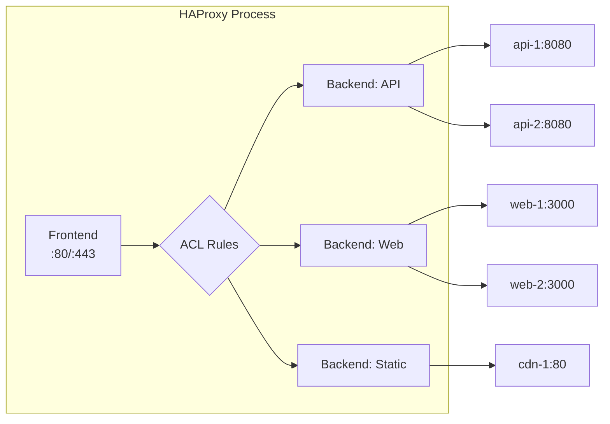
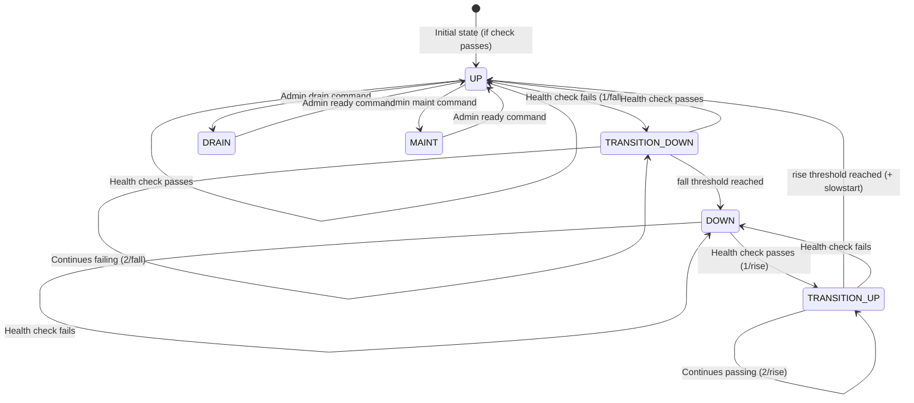

# HAProxy Configuration

## Why HAProxy Exists

HAProxy (High Availability Proxy) was created by Willy Tarreau in 2000 to solve a problem that web servers of the era could not: distributing incoming connections across multiple backend servers reliably, with health checking, persistence, and without being the bottleneck. Over two decades later, HAProxy remains one of the most performant and widely deployed load balancers in the world, handling traffic for GitHub, Reddit, Stack Overflow, Tumblr, and countless others.

HAProxy occupies a unique position: it is not a web server (it cannot serve files), not a WAF, and not a CDN. It does one thing — proxy TCP and HTTP connections — and does it extraordinarily well. A single HAProxy instance can handle millions of concurrent connections and hundreds of thousands of requests per second on commodity hardware.

### The Problem Space

Load balancers solve multiple interconnected problems:
1. **Horizontal scaling** — distribute load across multiple servers
2. **High availability** — route around failures
3. **Zero-downtime deployments** — drain connections during updates
4. **TLS termination** — offload crypto from application servers
5. **Traffic management** — route by URL, header, cookie
6. **Observability** — centralized metrics and logging

## First Principles

### HAProxy Processing Model

HAProxy uses an event-driven, single-process (multi-thread since 2.0) architecture:



Key concepts:
- **Frontend**: Binds to IP:port, accepts client connections, applies ACLs
- **Backend**: Groups of servers with load balancing and health checks
- **ACL**: Conditional rules for routing decisions
- **Server**: Individual backend target
- **Stick table**: In-memory key-value store for session persistence and rate limiting

### Configuration Structure

```
global          # Process-level settings
defaults        # Default parameters for frontends/backends
frontend NAME   # Listening sockets and request routing
backend NAME    # Server groups and load balancing
listen NAME     # Combined frontend + backend (shorthand)
```

## Core Configuration

### Global Section

```haproxy
global
    # Process management
    daemon
    maxconn 500000
    nbthread 4                    # Number of threads (HAProxy 2.0+)

    # Logging
    log /dev/log local0 info
    log /dev/log local1 notice

    # Security
    chroot /var/lib/haproxy
    user haproxy
    group haproxy

    # SSL/TLS
    ssl-default-bind-ciphers ECDHE-ECDSA-AES256-GCM-SHA384:ECDHE-RSA-AES256-GCM-SHA384:ECDHE-ECDSA-CHACHA20-POLY1305:ECDHE-RSA-CHACHA20-POLY1305
    ssl-default-bind-ciphersuites TLS_AES_256_GCM_SHA384:TLS_CHACHA20_POLY1305_SHA256:TLS_AES_128_GCM_SHA256
    ssl-default-bind-options ssl-min-ver TLSv1.2 no-tls-tickets
    ssl-default-server-ciphers ECDHE-ECDSA-AES256-GCM-SHA384:ECDHE-RSA-AES256-GCM-SHA384
    ssl-default-server-options ssl-min-ver TLSv1.2

    # Performance
    tune.ssl.default-dh-param 2048
    tune.bufsize 32768
    tune.maxrewrite 1024
    tune.ssl.cachesize 100000     # SSL session cache entries

    # Stats socket for runtime API
    stats socket /var/run/haproxy/admin.sock mode 660 level admin
    stats timeout 30s
```

### Defaults Section

```haproxy
defaults
    log     global
    mode    http
    option  httplog
    option  dontlognull
    option  forwardfor except 127.0.0.0/8
    option  redispatch             # Retry on different server after failure
    option  http-server-close      # Enable connection reuse

    # Timeouts (critical for production!)
    timeout connect    5s          # Time to establish connection to backend
    timeout client     30s         # Time to wait for client data
    timeout server     30s         # Time to wait for server response
    timeout queue      60s         # Time request can wait in queue
    timeout http-request  10s      # Time to receive complete HTTP request
    timeout http-keep-alive 10s    # Keep-alive timeout
    timeout check      5s         # Health check timeout
    timeout tunnel     3600s       # WebSocket/tunnel timeout

    # Retries
    retries 3
    retry-on conn-failure empty-response response-timeout

    # Error handling
    errorfile 400 /etc/haproxy/errors/400.http
    errorfile 403 /etc/haproxy/errors/403.http
    errorfile 408 /etc/haproxy/errors/408.http
    errorfile 500 /etc/haproxy/errors/500.http
    errorfile 502 /etc/haproxy/errors/502.http
    errorfile 503 /etc/haproxy/errors/503.http
    errorfile 504 /etc/haproxy/errors/504.http
```

::: warning
Timeout values are the single most important HAProxy configuration. Too low and you get false failures; too high and slow backends consume all connections. Start with the values above and tune based on your application's actual response times (p99).
:::

### Frontend Configuration

```haproxy
# HTTP to HTTPS redirect
frontend ft_http
    bind *:80
    mode http

    # ACME challenge support (Let's Encrypt)
    acl is_acme path_beg /.well-known/acme-challenge/
    use_backend bk_acme if is_acme

    # Redirect everything else to HTTPS
    redirect scheme https code 301 if !{ ssl_fc } !is_acme

# Main HTTPS frontend
frontend ft_https
    bind *:443 ssl crt /etc/haproxy/certs/ alpn h2,http/1.1
    mode http

    # Request ID for tracing
    unique-id-format %[uuid()]
    unique-id-header X-Request-ID

    # Logging
    log-format "%ci:%cp [%tr] %ft %b/%s %TR/%Tw/%Tc/%Tr/%Ta %ST %B %CC %CS %tsc %ac/%fc/%bc/%sc/%rc %sq/%bq %hr %hs %{+Q}r %ID"

    # Security headers
    http-response set-header Strict-Transport-Security "max-age=31536000; includeSubDomains; preload"
    http-response set-header X-Frame-Options DENY
    http-response set-header X-Content-Type-Options nosniff
    http-response set-header X-XSS-Protection "1; mode=block"
    http-response del-header Server

    # --- ACL Definitions ---
    acl is_api       path_beg /api/
    acl is_websocket hdr(Upgrade) -i websocket
    acl is_grpc      path_beg /grpc/
    acl is_static    path_beg /static/ /assets/ /images/
    acl is_health    path /health /ready /live
    acl is_admin     src 10.0.0.0/8 172.16.0.0/12

    # Host-based routing
    acl host_api     hdr(host) -i api.example.com
    acl host_app     hdr(host) -i app.example.com
    acl host_admin   hdr(host) -i admin.example.com

    # Rate limiting ACL (uses stick table)
    acl is_rate_limited sc_http_req_rate(0) gt 100

    # --- Tracking ---
    http-request track-sc0 src table st_per_ip

    # --- Request Processing ---
    # Block rate-limited clients
    http-request deny deny_status 429 if is_rate_limited

    # Route to backends
    use_backend bk_websocket  if is_websocket
    use_backend bk_grpc       if is_grpc
    use_backend bk_static     if is_static
    use_backend bk_api        if host_api or is_api
    use_backend bk_admin      if host_admin is_admin
    use_backend bk_health     if is_health

    default_backend bk_web
```

### Backend Configuration

```haproxy
# API backend with advanced configuration
backend bk_api
    mode http
    balance leastconn               # Best for APIs with varying response times

    # Health checking
    option httpchk GET /health
    http-check expect status 200

    # Connection management
    option http-server-close
    http-reuse safe                 # Connection reuse mode

    # Request/response manipulation
    http-request set-header X-Forwarded-Proto https
    http-request set-header X-Real-IP %[src]
    http-request set-header X-Forwarded-For %[src]
    http-request set-header X-Request-Start t=%[date()]

    # Circuit breaker: if backend error rate > 50%, stop sending traffic
    # (HAProxy 2.2+)
    # observe layer7
    # error-limit 50

    # Servers
    server api-1 10.0.1.10:8080 check inter 3s fall 3 rise 2 weight 100 maxconn 1000
    server api-2 10.0.1.11:8080 check inter 3s fall 3 rise 2 weight 100 maxconn 1000
    server api-3 10.0.1.12:8080 check inter 3s fall 3 rise 2 weight 100 maxconn 1000
    server api-4 10.0.1.13:8080 check inter 3s fall 3 rise 2 weight 50 maxconn 500 backup

# Web application backend
backend bk_web
    mode http
    balance roundrobin

    option httpchk GET /health
    http-check expect status 200

    # Cookie-based session persistence
    cookie SERVERID insert indirect nocache httponly secure

    server web-1 10.0.2.10:3000 check cookie web1 inter 5s fall 3 rise 2
    server web-2 10.0.2.11:3000 check cookie web2 inter 5s fall 3 rise 2
    server web-3 10.0.2.12:3000 check cookie web3 inter 5s fall 3 rise 2

# WebSocket backend
backend bk_websocket
    mode http
    balance source                  # IP hash for WebSocket affinity
    timeout tunnel 3600s            # 1 hour for long-lived connections
    timeout server 3600s

    server ws-1 10.0.3.10:8080 check inter 10s
    server ws-2 10.0.3.11:8080 check inter 10s

# gRPC backend
backend bk_grpc
    mode http
    balance roundrobin

    option httpchk
    http-check connect proto h2
    http-check send meth GET uri /grpc.health.v1.Health/Check
    http-check expect status 200

    # gRPC requires HTTP/2
    server grpc-1 10.0.4.10:50051 check proto h2 inter 5s
    server grpc-2 10.0.4.11:50051 check proto h2 inter 5s

# Static content backend
backend bk_static
    mode http
    balance roundrobin

    option httpchk HEAD /
    http-check expect status 200

    # Aggressive caching headers
    http-response set-header Cache-Control "public, max-age=31536000, immutable"

    # Compression
    compression algo gzip
    compression type text/html text/css text/javascript application/javascript application/json image/svg+xml

    server static-1 10.0.5.10:80 check inter 10s
    server static-2 10.0.5.11:80 check inter 10s

# Health check backend (always returns 200)
backend bk_health
    mode http
    http-request return status 200 content-type "application/json" lf-string '{"status":"ok","haproxy":"up"}'

# ACME challenge backend
backend bk_acme
    mode http
    server acme 127.0.0.1:8888
```

## ACL System In Depth

### ACL Matching Methods

| Method | Syntax | Example | Use Case |
|--------|--------|---------|----------|
| `str` | Exact match | `hdr(host) -i example.com` | Specific hostname |
| `beg` | Prefix match | `path_beg /api/` | URL prefix routing |
| `end` | Suffix match | `path_end .jpg .png` | File type matching |
| `sub` | Substring | `hdr(User-Agent) -i -m sub bot` | Bot detection |
| `reg` | Regex | `path_reg ^/api/v[0-9]+/` | Pattern matching |
| `len` | Length | `req.hdr_cnt(X-Forwarded-For) gt 1` | Proxy detection |
| `ip` | IP/CIDR | `src 10.0.0.0/8` | Network-based rules |
| `int` | Integer compare | `req.body_len gt 10485760` | Size limits |

### Complex ACL Combinations

```haproxy
frontend ft_complex
    bind *:443 ssl crt /etc/haproxy/certs/

    # Multi-condition ACLs
    acl is_api         path_beg /api/
    acl is_v2          path_beg /api/v2/
    acl is_post        method POST PUT PATCH DELETE
    acl is_internal    src 10.0.0.0/8 172.16.0.0/12
    acl is_peak_hours  nbsrv(bk_api) lt 3
    acl large_body     req.body_len gt 1048576
    acl has_auth       hdr(Authorization) -m found

    # Deny large POST from external without auth
    http-request deny deny_status 413 if large_body !is_internal !has_auth

    # Route v2 API separately
    use_backend bk_api_v2 if is_v2

    # Write operations to primary only
    use_backend bk_api_primary if is_api is_post

    # Read operations load balanced across replicas
    use_backend bk_api_replicas if is_api !is_post

    default_backend bk_web
```

## Stick Tables

Stick tables are HAProxy's in-memory key-value stores for tracking connection state. They enable session persistence, rate limiting, bot detection, and abuse prevention.

### Stick Table Configuration

```haproxy
# Rate limiting table
backend st_per_ip
    stick-table type ip size 1m expire 30s store http_req_rate(10s),conn_cur,conn_rate(10s),bytes_out_rate(60s)

# Session persistence table
backend st_sessions
    stick-table type string len 64 size 500k expire 30m store server_id,conn_cur

# Abuse detection table
backend st_abuse
    stick-table type ip size 500k expire 24h store gpc0,gpc1,http_err_rate(60s),http_req_rate(60s)
```

### Rate Limiting with Stick Tables

```haproxy
frontend ft_ratelimit
    bind *:443 ssl crt /etc/haproxy/certs/

    # Track source IP
    http-request track-sc0 src table st_per_ip

    # Track by API key (if present)
    http-request track-sc1 hdr(X-API-Key) table st_per_api_key if { hdr(X-API-Key) -m found }

    # Rate limit thresholds
    acl rate_abuse     sc_http_req_rate(0) gt 100      # >100 req in 10s window
    acl conn_abuse     sc_conn_rate(0)     gt 50       # >50 new connections in 10s
    acl bandwidth_abuse sc0_bytes_out_rate gt 104857600 # >100MB/min
    acl error_abuse    sc_http_err_rate(0) gt 20        # >20 errors in 60s

    # Graduated response
    http-request set-header X-Rate-Remaining %[sc_http_req_rate(0),neg,add(100)]

    # Tarpit (slow down) moderate abusers
    http-request tarpit if rate_abuse !conn_abuse

    # Hard deny severe abusers
    http-request deny deny_status 429 if conn_abuse
    http-request deny deny_status 429 if bandwidth_abuse

    # Mark for logging
    http-request set-header X-Abuse-Flag rate if rate_abuse
    http-request set-header X-Abuse-Flag conn if conn_abuse

    default_backend bk_api

backend st_per_ip
    stick-table type ip size 1m expire 30s store http_req_rate(10s),conn_rate(10s),bytes_out_rate(60s),http_err_rate(60s)

backend st_per_api_key
    stick-table type string len 64 size 100k expire 60s store http_req_rate(10s)
```

### Session Persistence with Stick Tables

```haproxy
backend bk_web_sticky
    mode http
    balance roundrobin

    # Stick on cookie value
    stick-table type string len 64 size 500k expire 30m
    stick on cookie(session_id)

    # Or stick on source IP
    # stick on src

    # Or stick on URL parameter
    # stick on url_param(tenant_id)

    server web-1 10.0.2.10:3000 check
    server web-2 10.0.2.11:3000 check
    server web-3 10.0.2.12:3000 check
```

## Health Checks

### HTTP Health Checks

```haproxy
backend bk_advanced_health
    mode http

    # Layer 7 HTTP health check
    option httpchk
    http-check connect
    http-check send meth GET uri /health hdr Host api.example.com
    http-check expect status 200

    # Check parameters
    # inter: check interval (default 2s)
    # fall: consecutive failures before marking DOWN (default 3)
    # rise: consecutive successes before marking UP (default 2)
    # slowstart: gradually increase traffic to recovered server

    server s1 10.0.1.10:8080 check inter 3s fall 3 rise 2 slowstart 30s
    server s2 10.0.1.11:8080 check inter 3s fall 3 rise 2 slowstart 30s
```

### Advanced Health Check Patterns

```haproxy
# Multi-step health check (HAProxy 2.2+)
backend bk_deep_health
    mode http
    option httpchk

    # Step 1: Check TCP connectivity
    http-check connect

    # Step 2: Check HTTP response
    http-check send meth GET uri /health
    http-check expect status 200

    # Step 3: Check response body
    http-check expect rstring "\"status\":\\s*\"healthy\""

    server s1 10.0.1.10:8080 check inter 5s

# Agent health check (external process controls weight/status)
backend bk_agent_health
    mode http

    # Agent check: external process listens on a port
    # and returns: "up", "down", "maint", "drain", or weight percentage
    server s1 10.0.1.10:8080 check agent-check agent-port 8081 agent-inter 5s
```

### Health Check State Machine



## SSL/TLS Configuration

### SSL Termination

```haproxy
frontend ft_ssl
    # Single certificate
    bind *:443 ssl crt /etc/haproxy/certs/example.com.pem

    # Multiple certificates (SNI-based selection)
    bind *:443 ssl crt /etc/haproxy/certs/ alpn h2,http/1.1

    # Certificate with separate key
    # Combine cert + key into single PEM file:
    # cat cert.pem key.pem > combined.pem

    # OCSP stapling
    bind *:443 ssl crt /etc/haproxy/certs/example.com.pem ocsp-update on

    # Client certificate verification (mTLS)
    bind *:443 ssl crt /etc/haproxy/certs/server.pem ca-file /etc/haproxy/certs/client-ca.pem verify required
```

### SSL Pass-Through

```haproxy
# Pass encrypted traffic directly to backend (no termination)
frontend ft_ssl_passthrough
    bind *:443
    mode tcp
    option tcplog

    # Route based on SNI (without decrypting)
    tcp-request inspect-delay 5s
    tcp-request content accept if { req.ssl_hello_type 1 }

    acl is_api req.ssl_sni -i api.example.com
    acl is_app req.ssl_sni -i app.example.com

    use_backend bk_api_passthrough if is_api
    use_backend bk_app_passthrough if is_app
    default_backend bk_default_passthrough

backend bk_api_passthrough
    mode tcp
    server api-1 10.0.1.10:443 check
```

### SSL Re-encryption

```haproxy
# Terminate SSL at HAProxy, re-encrypt to backend
backend bk_reencrypt
    mode http

    # Verify backend certificate
    server s1 10.0.1.10:8443 ssl verify required ca-file /etc/haproxy/certs/internal-ca.pem sni str(api.internal)
    server s2 10.0.1.11:8443 ssl verify required ca-file /etc/haproxy/certs/internal-ca.pem sni str(api.internal)
```

## Stats Page

```haproxy
# Dedicated stats frontend
listen stats
    bind *:8404
    mode http

    stats enable
    stats uri /stats
    stats refresh 10s
    stats show-legends
    stats show-node

    # Authentication
    stats auth admin:SecurePassword123!
    stats admin if TRUE              # Enable admin actions (drain, maint)

    # Restrict access
    acl is_internal src 10.0.0.0/8
    http-request deny if !is_internal

    # Prometheus metrics endpoint (HAProxy 2.0+)
    http-request use-service prometheus-exporter if { path /metrics }
```

### Prometheus Integration

```haproxy
frontend ft_prometheus
    bind *:8405
    mode http
    http-request use-service prometheus-exporter if { path /metrics }
    no log
```

Key metrics exposed:

| Metric | Description |
|--------|-------------|
| `haproxy_server_current_sessions` | Active connections per server |
| `haproxy_server_http_responses_total` | Response count by status code |
| `haproxy_server_response_time_average_seconds` | Average response time |
| `haproxy_server_check_status` | Health check result |
| `haproxy_backend_queue_current` | Requests queued |
| `haproxy_frontend_bytes_in_total` | Bytes received |
| `haproxy_process_current_connections` | Total current connections |

## Edge Cases and Failure Modes

### Connection Draining During Deployments

```bash
# Using the HAProxy runtime API via the stats socket

# Set server to DRAIN mode (finish existing connections, no new ones)
echo "set server bk_api/api-1 state drain" | socat stdio /var/run/haproxy/admin.sock

# Wait for connections to drain
echo "show stat" | socat stdio /var/run/haproxy/admin.sock | grep "api-1"

# Set to MAINT mode (immediate removal, health checks stop)
echo "set server bk_api/api-1 state maint" | socat stdio /var/run/haproxy/admin.sock

# Bring back up
echo "set server bk_api/api-1 state ready" | socat stdio /var/run/haproxy/admin.sock

# Change weight dynamically
echo "set server bk_api/api-1 weight 50%" | socat stdio /var/run/haproxy/admin.sock
```

```typescript
import { createConnection } from 'node:net';

class HaproxyRuntimeApi {
  private socketPath: string;

  constructor(socketPath: string = '/var/run/haproxy/admin.sock') {
    this.socketPath = socketPath;
  }

  private async sendCommand(command: string): Promise<string> {
    return new Promise((resolve, reject) => {
      const socket = createConnection(this.socketPath);
      let data = '';

      socket.on('connect', () => {
        socket.write(`${command}\n`);
      });

      socket.on('data', (chunk: Buffer) => {
        data += chunk.toString();
      });

      socket.on('end', () => {
        resolve(data);
      });

      socket.on('error', reject);

      // Safety timeout
      setTimeout(() => {
        socket.destroy();
        reject(new Error('Socket timeout'));
      }, 5_000);
    });
  }

  async drainServer(backend: string, server: string): Promise<void> {
    await this.sendCommand(`set server ${backend}/${server} state drain`);
  }

  async enableServer(backend: string, server: string): Promise<void> {
    await this.sendCommand(`set server ${backend}/${server} state ready`);
  }

  async setWeight(backend: string, server: string, weight: number): Promise<void> {
    await this.sendCommand(`set server ${backend}/${server} weight ${weight}`);
  }

  async getStats(): Promise<string> {
    return this.sendCommand('show stat');
  }

  async getServerState(backend: string, server: string): Promise<{
    status: string;
    currentSessions: number;
    weight: number;
  }> {
    const stats = await this.getStats();
    const lines = stats.split('\n');
    const headers = lines[0].split(',');
    const serverLine = lines.find(
      (l) => l.startsWith(`${backend},${server},`)
    );

    if (!serverLine) {
      throw new Error(`Server ${backend}/${server} not found`);
    }

    const values = serverLine.split(',');
    const statusIdx = headers.indexOf('status');
    const scurIdx = headers.indexOf('scur');
    const weightIdx = headers.indexOf('weight');

    return {
      status: values[statusIdx],
      currentSessions: parseInt(values[scurIdx], 10),
      weight: parseInt(values[weightIdx], 10),
    };
  }

  // Graceful deployment helper
  async rollingDrain(
    backend: string,
    servers: string[],
    drainTimeMs: number = 30_000
  ): Promise<void> {
    for (const server of servers) {
      console.log(`Draining ${backend}/${server}...`);
      await this.drainServer(backend, server);

      // Wait for connections to drain
      const deadline = Date.now() + drainTimeMs;
      while (Date.now() < deadline) {
        const state = await this.getServerState(backend, server);
        if (state.currentSessions === 0) {
          console.log(`${backend}/${server} fully drained`);
          break;
        }
        console.log(
          `${backend}/${server}: ${state.currentSessions} connections remaining`
        );
        await new Promise((r) => setTimeout(r, 2_000));
      }

      // Server is ready for deployment
      console.log(`Deploy to ${server} now, then press enter...`);
    }
  }
}
```

### Hot Reload Without Dropping Connections

HAProxy supports seamless configuration reload:

```bash
# Reload configuration without dropping connections
# HAProxy forks a new process, old process finishes existing connections
haproxy -f /etc/haproxy/haproxy.cfg -sf $(cat /var/run/haproxy.pid)

# With systemd (recommended)
systemctl reload haproxy
```

During reload:
1. New process starts, binds to the same ports (SO_REUSEPORT)
2. New connections go to new process
3. Old process finishes existing connections
4. Old process exits when all connections complete (or hard-stop-after timeout)

```haproxy
global
    hard-stop-after 60s    # Force kill old process after 60s during reload
```

::: info War Story
A team had HAProxy in front of a WebSocket service with connections lasting hours. During a config reload, the old process would linger for hours waiting for WebSocket connections to close. They added `hard-stop-after 60s`, which fixed the reload problem but abruptly killed long-lived WebSockets. The solution was to set WebSocket reconnection logic in the client with exponential backoff, and coordinate reloads during off-peak hours. They also switched to Envoy for the WebSocket path, which handles hot restarts more gracefully.
:::

### Maxconn Cascade

When HAProxy's `maxconn` limit is reached, new connections queue. If the queue fills (or `timeout queue` expires), clients get 503 errors. The cascade:

$$
\text{Queue depth} = \lambda \times T_{\text{response}} - \text{maxconn}_{\text{server}} \times N_{\text{servers}}
$$

where $\lambda$ is the arrival rate. When $\text{Queue depth} > 0$, latency increases by:

$$
T_{\text{queued}} = \frac{\text{Queue depth}}{\lambda}
$$

## Performance Characteristics

### Benchmark Numbers

On modern hardware (Xeon E5-2680v4, 64GB RAM):

| Metric | HTTP Mode | TCP Mode |
|--------|----------|----------|
| Requests/sec (keep-alive) | 200,000+ | N/A |
| New connections/sec | 80,000+ | 150,000+ |
| Concurrent connections | 2,000,000+ | 2,000,000+ |
| Latency added (p50) | 0.05ms | 0.02ms |
| Latency added (p99) | 0.5ms | 0.2ms |
| Memory per connection | ~17 KB | ~8 KB |

### Scaling Formula

$$
\text{Max connections} = \frac{\text{Available RAM (MB)}}{\text{Memory per connection (KB)}} \times 1024
$$

For 32 GB dedicated to HAProxy connections (HTTP mode):

$$
\text{Max connections} = \frac{32{,}768}{17} \times 1024 \approx 1{,}971{,}000
$$

### Load Balancing Algorithm Performance

| Algorithm | Time Complexity | Session Affinity | Best For |
|-----------|----------------|-----------------|----------|
| `roundrobin` | O(1) | No | Uniform requests |
| `leastconn` | O(log n) | No | Variable response times |
| `source` | O(1) | IP-based | Simple sticky sessions |
| `uri` | O(1) | URI-based | Cache servers |
| `hdr(name)` | O(1) | Header-based | Tenant routing |
| `random(n)` | O(1) | No | Power of Two Choices |
| `first` | O(1) | No | Minimize active servers |

## Mathematical Foundations

### Little's Law Applied to HAProxy

$$
L = \lambda \times W
$$

where $L$ = average number of concurrent connections, $\lambda$ = arrival rate, $W$ = average connection duration.

For 50,000 req/s with 200ms average response time:

$$
L = 50{,}000 \times 0.2 = 10{,}000 \text{ concurrent connections}
$$

### Weighted Round Robin Distribution

For servers with weights $w_1, w_2, \ldots, w_n$, the proportion of traffic to server $i$:

$$
P_i = \frac{w_i}{\sum_{j=1}^{n} w_j}
$$

HAProxy implements smooth weighted round robin (GCD-based) to avoid bursts:

If servers have weights 5, 3, 2 (total 10), the sequence is:
`A A A B B A C A B C` rather than `A A A A A B B B C C`

### Connection Queuing Model

HAProxy's queuing follows an M/M/c model (Erlang C):

$$
P_{\text{wait}} = \frac{\frac{(c\rho)^c}{c!(1-\rho)}}{\sum_{k=0}^{c-1} \frac{(c\rho)^k}{k!} + \frac{(c\rho)^c}{c!(1-\rho)}}
$$

where $c$ = number of servers, $\rho = \lambda / (c \mu)$ is utilization, and $\mu$ is the service rate per server.

## Decision Framework

### When to Choose HAProxy

| Factor | HAProxy | Nginx | Cloud LB (ALB/NLB) |
|--------|---------|-------|---------------------|
| Performance | Highest | High | Medium |
| Configuration flexibility | Excellent | Good | Limited |
| Cost | Free (CE) / Enterprise | Free / Plus | Pay per hour + LCU |
| Health checks | Advanced | Basic | Advanced |
| Auto-scaling | Manual | Manual | Automatic |
| SSL termination | Yes | Yes | Yes |
| WebSocket | Yes | Yes | Yes (ALB) |
| gRPC | Yes (2.0+) | Yes | Yes (ALB) |
| Rate limiting | Stick tables | Third-party modules | WAF |
| Service mesh | No | No | App Mesh |
| Operational overhead | Medium | Medium | Low |

## Advanced Topics

### HAProxy with Consul Template

Dynamic configuration updates from service discovery:

```hcl
# consul-template configuration
template {
  source      = "/etc/haproxy/haproxy.cfg.ctmpl"
  destination = "/etc/haproxy/haproxy.cfg"
  command     = "systemctl reload haproxy"
}
```

```haproxy
# haproxy.cfg.ctmpl (Consul Template)
backend bk_api
    mode http
    balance leastconn
    option httpchk GET /health

{{range service "api" "passing"}}
    server {{.ID}} {{.Address}}:{{.Port}} check inter 5s fall 3 rise 2
{{end}}
```

### Multi-Process vs Multi-Thread

HAProxy 2.0+ supports multi-threading (`nbthread`), which is generally preferred over multi-process (`nbproc`, deprecated):

| Feature | Multi-thread | Multi-process |
|---------|-------------|---------------|
| Stick tables | Shared | Separate per process |
| Stats | Unified | Per process |
| Memory usage | Lower | Higher (duplicate state) |
| Connection affinity | Automatic | Requires config |
| Configuration reload | Seamless | Complex |

### Map Files for Dynamic Routing

```haproxy
# /etc/haproxy/maps/host_to_backend.map
api.example.com       bk_api
app.example.com       bk_web
admin.example.com     bk_admin
staging.example.com   bk_staging

# In HAProxy config
frontend ft_https
    bind *:443 ssl crt /etc/haproxy/certs/

    # Use map file for routing
    use_backend %[req.hdr(host),lower,map(/etc/haproxy/maps/host_to_backend.map,bk_default)]
```

Map files can be updated at runtime without reloading:

```bash
# Add/update entry
echo "set map /etc/haproxy/maps/host_to_backend.map new.example.com bk_new" | \
  socat stdio /var/run/haproxy/admin.sock

# Delete entry
echo "del map /etc/haproxy/maps/host_to_backend.map old.example.com" | \
  socat stdio /var/run/haproxy/admin.sock
```

### Lua Scripting

HAProxy embeds Lua for custom logic:

```haproxy
global
    lua-load /etc/haproxy/lua/auth.lua

frontend ft_https
    bind *:443 ssl crt /etc/haproxy/certs/
    http-request lua.jwt_verify
```

```lua
-- /etc/haproxy/lua/auth.lua
-- JWT verification in HAProxy via Lua

local json = require("json")

function jwt_verify(txn)
    local auth = txn.http:req_get_headers()["authorization"]
    if not auth then
        txn:set_var("txn.auth_status", "missing")
        return
    end

    local token = string.match(auth[0], "Bearer%s+(.+)")
    if not token then
        txn:set_var("txn.auth_status", "invalid_format")
        return
    end

    -- Split JWT into header.payload.signature
    local parts = {}
    for part in string.gmatch(token, "([^%.]+)") do
        table.insert(parts, part)
    end

    if #parts ~= 3 then
        txn:set_var("txn.auth_status", "malformed")
        return
    end

    -- Decode payload (base64url)
    local payload_json = core.tokenize(parts[2], true)
    if not payload_json then
        txn:set_var("txn.auth_status", "decode_error")
        return
    end

    -- Check expiration
    local payload = json.decode(payload_json)
    if payload.exp and payload.exp < os.time() then
        txn:set_var("txn.auth_status", "expired")
        return
    end

    txn:set_var("txn.auth_status", "valid")
    txn:set_var("txn.auth_user", payload.sub or "unknown")
end

core.register_action("jwt_verify", { "http-req" }, jwt_verify)
```
