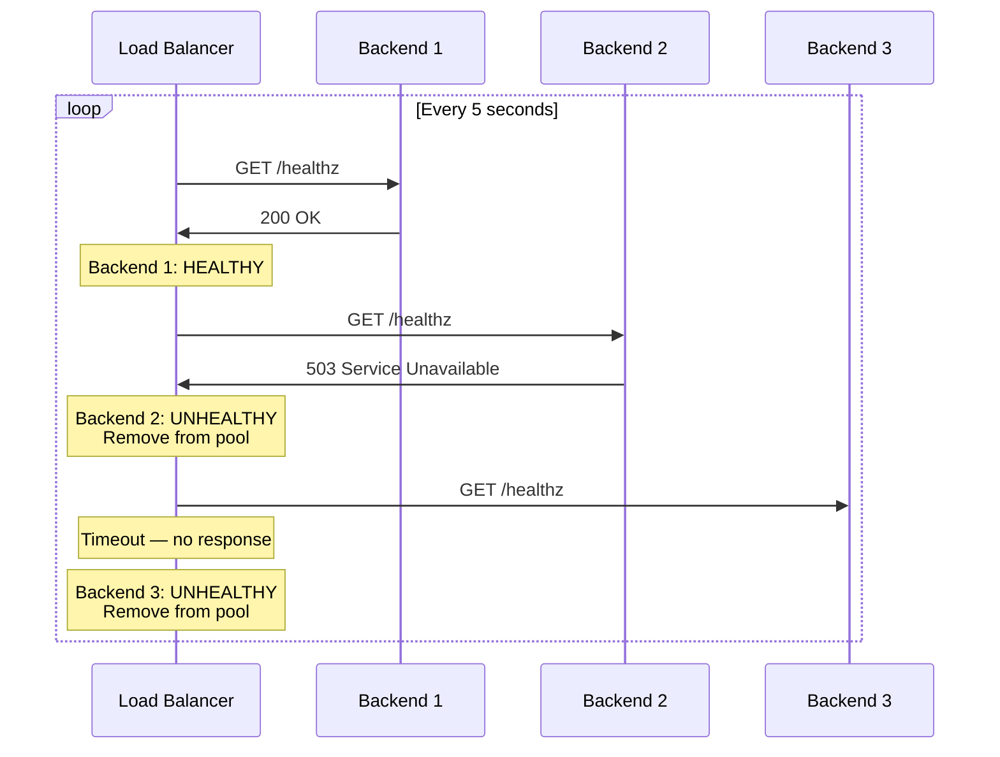
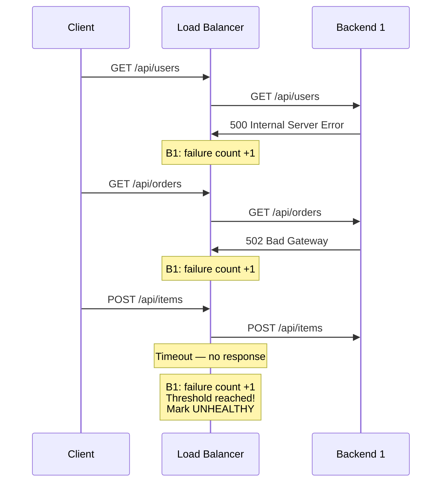
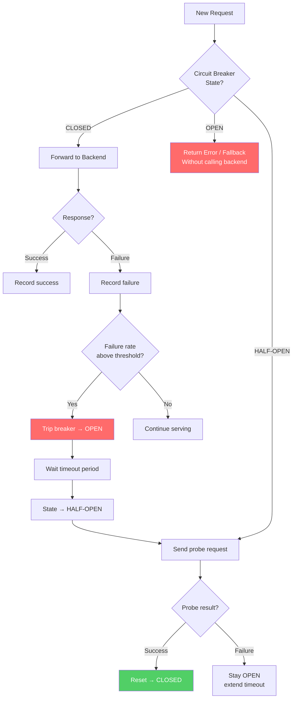

# Health Checks

A load balancer without health checks is a traffic distributor for failure. It will happily send requests to a server that is crashed, overloaded, deadlocked, out of memory, experiencing disk I/O saturation, or returning 500 errors for every request. Health checks are the mechanism by which a load balancer discovers that a backend is unhealthy and removes it from the active pool — and later discovers that it has recovered and adds it back.

The design of your health checks is as important as the design of your load balancing algorithm. A poorly designed health check creates false positives (marking healthy servers as unhealthy, reducing capacity) or false negatives (keeping unhealthy servers in rotation, sending users to broken backends). This page covers every dimension of health check design, from the protocol level through the application semantics to the operational patterns that prevent cascading failures.

## Active vs Passive Health Checks

There are two fundamentally different approaches to health checking, and most production systems use both simultaneously.

### Active Health Checks

The load balancer periodically sends probe requests to each backend and evaluates the response. The backend may or may not receive real traffic — the health check is independent.



**Configuration parameters:**

| Parameter | Description | Typical Value |
|-----------|-------------|---------------|
| `interval` | Time between consecutive checks | 5-30 seconds |
| `timeout` | Maximum time to wait for a response | 2-5 seconds |
| `unhealthy_threshold` | Consecutive failures before marking unhealthy | 2-3 |
| `healthy_threshold` | Consecutive successes before marking healthy again | 2-3 |
| `rise` | Same as healthy_threshold (HAProxy terminology) | 2-3 |
| `fall` | Same as unhealthy_threshold (HAProxy terminology) | 2-3 |

**Advantages:**
- Detects failures before any real user traffic is affected
- Can probe deep application health (database connectivity, dependency availability)
- Works even when the server receives zero real traffic
- Fully configurable frequency, timeouts, and thresholds

**Disadvantages:**
- Adds load to backends (N load balancers × M backends × checks per second)
- Health check endpoint might succeed while real traffic fails (different code path)
- Detection latency: takes `interval × unhealthy_threshold` time to detect failure (e.g., 5s × 3 = 15 seconds)
- Health check traffic consumes bandwidth (minimal but non-zero)

### Passive Health Checks

The load balancer monitors real traffic responses from backends. If a backend starts returning errors or timing out on actual user requests, the LB marks it unhealthy.



**Configuration parameters:**

| Parameter | Description | Typical Value |
|-----------|-------------|---------------|
| `max_fails` | Failures within window to trigger unhealthy | 3-5 |
| `fail_timeout` | Time window for counting failures AND how long to keep unhealthy | 30-60 seconds |
| `error_codes` | Which HTTP status codes count as failures | 500, 502, 503, 504 |
| `timeout_as_fail` | Whether connection timeouts count as failures | Yes |

**Advantages:**
- Zero additional load — uses real traffic as health signal
- Detects issues specific to real request patterns (e.g., a specific API endpoint failing)
- Faster detection under high traffic — failures are detected on the next request
- No false-positive risk from health check endpoint being different from real app behavior

**Disadvantages:**
- Requires real traffic to detect failures — useless for backends receiving zero traffic
- Real users experience the errors that trigger detection
- Can't detect failures before they affect users
- May remove backends during transient spikes (false positives from temporary load)

### Combining Both

Production systems use both active and passive checks:

```
Active checks:  Establish baseline health every 10 seconds
                Detect crashed/unreachable servers
                Re-add servers after recovery

Passive checks: Monitor real traffic continuously
                Detect partial failures (one endpoint broken)
                Fast reaction to sudden degradation
```

**Envoy's approach:**
- Active checks run on a configurable interval
- Passive checks (called "outlier detection") track error rates and latency
- A backend can be ejected by either mechanism
- Re-admission requires passing active health checks
- Ejection time increases exponentially with repeated failures (backoff)

## TCP Health Checks

The simplest form: can we establish a TCP connection to the backend?

```
Load Balancer → TCP SYN     → Backend
Load Balancer ← TCP SYN-ACK ← Backend   (healthy — TCP connection succeeded)
Load Balancer → TCP RST     → Backend   (close immediately, we just needed the handshake)
```

or:

```
Load Balancer → TCP SYN     → Backend
Load Balancer ← ...timeout...            (unhealthy — no response)
```

or:

```
Load Balancer → TCP SYN     → Backend
Load Balancer ← TCP RST     ← Backend   (unhealthy — connection refused)
```

**What TCP checks tell you:**
- The process is running and listening on the port
- The OS network stack is functional
- The port is not blocked by a firewall

**What TCP checks do NOT tell you:**
- Whether the application is ready to serve requests
- Whether the application can reach its database
- Whether the application is deadlocked
- Whether the application is returning correct responses
- Whether the application is overloaded

TCP checks are the **minimum viable health check**. They catch the most catastrophic failure (process crash, machine down) but miss every application-level issue. Use them for L4 load balancing where you have no HTTP awareness, or as a supplement to HTTP checks.

### HAProxy TCP Check Configuration

```
backend my_backend
    option tcp-check
    tcp-check connect
    tcp-check send "PING\r\n"
    tcp-check expect string "+PONG"
    server redis1 10.0.1.1:6379 check inter 5s fall 3 rise 2
```

This performs a Redis-aware TCP check: connect, send `PING`, expect `+PONG`. It catches both "process down" and "Redis not responding correctly."

## HTTP Health Checks

HTTP health checks send an actual HTTP request and evaluate the response. This is the standard for L7 load balancers.

### Basic HTTP Check

```
GET /health HTTP/1.1
Host: backend-server
User-Agent: load-balancer-health-check
Connection: close
```

Expected response:

```
HTTP/1.1 200 OK
Content-Type: application/json

{"status": "healthy"}
```

### What to Check in the Response

| Check Level | What to Verify | Detects |
|-------------|----------------|---------|
| **Status code only** | 200-399 = healthy | Process crashes, major application errors |
| **Response body** | Contains expected string/JSON | Application logic failures, dependency issues |
| **Response time** | Under threshold (e.g., <2s) | Performance degradation, resource exhaustion |
| **Response headers** | Specific headers present | Configuration errors, wrong backend version |
| **Response size** | Within expected range | Truncated responses, error pages |

### Health Check Endpoint Design

The design of the health check endpoint is as important as the load balancer's check configuration. A health check that always returns 200 is useless. A health check that queries the database on every call creates unnecessary load.

#### The `/healthz`, `/readyz`, `/livez` Pattern (Kubernetes)

Kubernetes popularized three distinct health check endpoints, each serving a different purpose:

**`/livez` — Liveness Probe**

"Is the process alive and not deadlocked?"

This check should verify:
- The process is running
- The main event loop / thread pool is responsive
- No fatal unrecoverable errors have occurred

This check should NOT verify:
- Database connectivity (the DB being down doesn't mean this process is broken)
- Downstream service availability
- Cache connectivity

If the liveness check fails, the process should be **restarted** (in Kubernetes, the container is killed).

```typescript
// Express.js liveness endpoint
app.get('/livez', (req, res) => {
  // Simple check: if this handler executes, the event loop is alive
  res.status(200).json({ status: 'alive' });
});
```

::: danger Common Mistake
Do NOT include database checks in liveness probes. If the database goes down, your liveness probe fails, Kubernetes kills your pod, the replacement pod also can't reach the database, gets killed, and you enter a crash loop. The database being down is a readiness issue, not a liveness issue.
:::

**`/readyz` — Readiness Probe**

"Is this instance ready to serve traffic?"

This check should verify:
- All required dependencies are reachable (database, cache, message queue)
- Initialization is complete (data loaded, caches warmed)
- The application is not shutting down

If the readiness check fails, the instance is **removed from load balancer rotation** but NOT restarted.

```typescript
interface DependencyStatus {
  name: string;
  healthy: boolean;
  latencyMs: number;
  message?: string;
}

async function checkReadiness(): Promise<{
  ready: boolean;
  checks: DependencyStatus[];
}> {
  const checks: DependencyStatus[] = [];

  // Check database
  const dbStart = Date.now();
  try {
    await db.query('SELECT 1');
    checks.push({
      name: 'database',
      healthy: true,
      latencyMs: Date.now() - dbStart,
    });
  } catch (err) {
    checks.push({
      name: 'database',
      healthy: false,
      latencyMs: Date.now() - dbStart,
      message: (err as Error).message,
    });
  }

  // Check Redis
  const redisStart = Date.now();
  try {
    await redis.ping();
    checks.push({
      name: 'redis',
      healthy: true,
      latencyMs: Date.now() - redisStart,
    });
  } catch (err) {
    checks.push({
      name: 'redis',
      healthy: false,
      latencyMs: Date.now() - redisStart,
      message: (err as Error).message,
    });
  }

  const ready = checks.every(c => c.healthy);
  return { ready, checks };
}

app.get('/readyz', async (req, res) => {
  const result = await checkReadiness();
  const statusCode = result.ready ? 200 : 503;

  res.status(statusCode).json({
    status: result.ready ? 'ready' : 'not_ready',
    checks: result.checks,
  });
});
```

Response when healthy:

```json
{
  "status": "ready",
  "checks": [
    { "name": "database", "healthy": true, "latencyMs": 3 },
    { "name": "redis", "healthy": true, "latencyMs": 1 }
  ]
}
```

Response when degraded:

```json
{
  "status": "not_ready",
  "checks": [
    { "name": "database", "healthy": false, "latencyMs": 5002, "message": "Connection timeout" },
    { "name": "redis", "healthy": true, "latencyMs": 1 }
  ]
}
```

**`/healthz` — General Health (Legacy)**

The original catch-all health endpoint. In modern systems, it's better to split into `/livez` and `/readyz`, but `/healthz` remains widely used as the single health check endpoint for non-Kubernetes deployments.

```typescript
app.get('/healthz', async (req, res) => {
  try {
    // Check critical dependencies
    await Promise.all([
      db.query('SELECT 1'),
      redis.ping(),
    ]);

    res.status(200).json({
      status: 'healthy',
      version: process.env.APP_VERSION || 'unknown',
      uptime: process.uptime(),
    });
  } catch (err) {
    res.status(503).json({
      status: 'unhealthy',
      error: (err as Error).message,
    });
  }
});
```

#### Caching Health Check Results

If your health check queries databases or external services, running it every 5 seconds from every load balancer creates unnecessary load. Cache the result:

```typescript
interface CachedHealth {
  result: { ready: boolean; checks: DependencyStatus[] };
  timestamp: number;
}

let cachedHealth: CachedHealth | null = null;
const CACHE_TTL_MS = 5000; // Cache for 5 seconds

app.get('/readyz', async (req, res) => {
  const now = Date.now();

  // Return cached result if fresh
  if (cachedHealth && now - cachedHealth.timestamp < CACHE_TTL_MS) {
    const statusCode = cachedHealth.result.ready ? 200 : 503;
    return res.status(statusCode).json(cachedHealth.result);
  }

  // Perform fresh check
  const result = await checkReadiness();
  cachedHealth = { result, timestamp: now };

  const statusCode = result.ready ? 200 : 503;
  res.status(statusCode).json(result);
});
```

#### Health Check Security

Health check endpoints should NOT expose sensitive information (database connection strings, internal IPs, error stack traces) to unauthenticated callers. Two approaches:

1. **Minimal public response, detailed internal response:**

```typescript
app.get('/healthz', async (req, res) => {
  const result = await checkReadiness();
  const statusCode = result.ready ? 200 : 503;

  // Only expose details to internal callers
  const isInternal = req.ip?.startsWith('10.') || req.ip?.startsWith('172.');

  if (isInternal) {
    res.status(statusCode).json(result);
  } else {
    res.status(statusCode).json({ status: result.ready ? 'ok' : 'error' });
  }
});
```

2. **Separate endpoints with different access controls:**

```
/healthz          → Public, returns only status code
/internal/health  → Internal network only, returns full details
```

## Flapping Detection

**Flapping** occurs when a backend rapidly alternates between healthy and unhealthy states. This typically happens when a server is on the edge of failure — it recovers briefly, gets added back to the pool, receives traffic, becomes overwhelmed, and fails again.

```
Timeline:
  t=0   HEALTHY   (receiving traffic)
  t=10  UNHEALTHY (failed check)
  t=20  HEALTHY   (recovered, traffic resumes)
  t=25  UNHEALTHY (overwhelmed again)
  t=35  HEALTHY   (recovered)
  t=40  UNHEALTHY (overwhelmed)
  ... repeats indefinitely ...
```

Flapping creates several problems:
1. **User impact:** Every transition from healthy → unhealthy causes in-flight requests to fail
2. **Log noise:** Thousands of state transition events flood monitoring systems
3. **Connection churn:** Each transition causes connection draining and re-establishment
4. **Cascading failures:** Other servers receive burst traffic when the flapping server is removed

### Flapping Mitigation Strategies

#### 1. Increasing Rise/Fall Thresholds

Require more consecutive successes before re-adding:

```
fall = 3   (3 failures to remove — fast detection)
rise = 5   (5 successes to re-add — slow recovery)
```

This creates an asymmetry: quick to remove, slow to re-add. The server must prove stability before receiving traffic again.

#### 2. Exponential Backoff on Re-admission

Each time a server flaps, double the time before it can be re-added:

```
First recovery:   wait 10 seconds, then health check
Second recovery:  wait 20 seconds
Third recovery:   wait 40 seconds
Fourth recovery:  wait 80 seconds
Maximum:          wait 300 seconds (5 minutes)
```

Envoy implements this with its `base_ejection_time` and `max_ejection_percent` outlier detection settings.

#### 3. Slow Start / Warm-up Period

When a server is re-added after recovery, gradually ramp up the traffic it receives instead of sending full load immediately:

```
t=0    Server re-added: weight = 10% of normal
t=30   Weight = 30%
t=60   Weight = 60%
t=90   Weight = 100% (full capacity)
```

NGINX Plus supports this with the `slow_start` parameter:

```nginx
upstream backend {
    server 10.0.1.1:8080 weight=5 slow_start=60s;
    server 10.0.1.2:8080 weight=5;
}
```

#### 4. Flap Detection with State Machine

Track the frequency of state transitions and enter a "quarantine" state if they exceed a threshold:

```typescript
enum HealthState {
  HEALTHY = 'healthy',
  UNHEALTHY = 'unhealthy',
  QUARANTINED = 'quarantined',
}

interface ServerHealth {
  state: HealthState;
  consecutiveChecks: number;
  transitionCount: number;
  transitionWindowStart: number;
  quarantineUntil: number;
}

class FlapDetector {
  private servers: Map<string, ServerHealth> = new Map();
  private readonly MAX_TRANSITIONS_PER_WINDOW = 4;
  private readonly TRANSITION_WINDOW_MS = 60000; // 1 minute
  private readonly QUARANTINE_BASE_MS = 30000;   // 30 seconds

  recordCheckResult(server: string, passed: boolean): HealthState {
    let health = this.servers.get(server);
    if (!health) {
      health = {
        state: passed ? HealthState.HEALTHY : HealthState.UNHEALTHY,
        consecutiveChecks: 1,
        transitionCount: 0,
        transitionWindowStart: Date.now(),
        quarantineUntil: 0,
      };
      this.servers.set(server, health);
      return health.state;
    }

    // Check quarantine
    if (health.state === HealthState.QUARANTINED) {
      if (Date.now() < health.quarantineUntil) {
        return HealthState.QUARANTINED;
      }
      // Quarantine expired — treat as fresh evaluation
      health.state = HealthState.UNHEALTHY;
      health.transitionCount = 0;
    }

    const wasHealthy = health.state === HealthState.HEALTHY;
    const isTransition =
      (wasHealthy && !passed) || (!wasHealthy && passed);

    if (isTransition) {
      // Reset window if expired
      if (Date.now() - health.transitionWindowStart > this.TRANSITION_WINDOW_MS) {
        health.transitionCount = 0;
        health.transitionWindowStart = Date.now();
      }

      health.transitionCount++;

      if (health.transitionCount > this.MAX_TRANSITIONS_PER_WINDOW) {
        // Flapping detected — quarantine
        const quarantineDuration =
          this.QUARANTINE_BASE_MS * Math.pow(2, health.transitionCount - this.MAX_TRANSITIONS_PER_WINDOW);
        health.state = HealthState.QUARANTINED;
        health.quarantineUntil = Date.now() + Math.min(quarantineDuration, 300000);
        return HealthState.QUARANTINED;
      }

      health.state = passed ? HealthState.HEALTHY : HealthState.UNHEALTHY;
      health.consecutiveChecks = 1;
    } else {
      health.consecutiveChecks++;
    }

    return health.state;
  }
}
```

## Grace Periods

### Startup Grace Period

When a new server starts, it needs time to initialize — load configuration, warm caches, establish database connection pools, compile JIT code. During this period, health checks should not yet begin (or should not count failures).

```
Server start ─── Initialization ─── Ready ─── Serving traffic
              │                   │
              │  Grace period     │  Health checks begin
              │  (30-120 seconds) │
              │  No health checks │
```

In Kubernetes, this is the `initialDelaySeconds` parameter:

```yaml
readinessProbe:
  httpGet:
    path: /readyz
    port: 8080
  initialDelaySeconds: 30   # Wait 30s before first probe
  periodSeconds: 10          # Then check every 10s
  failureThreshold: 3        # 3 failures = not ready
  successThreshold: 1        # 1 success = ready
```

Kubernetes 1.18+ introduced **startup probes** that are even better for slow-starting applications:

```yaml
startupProbe:
  httpGet:
    path: /healthz
    port: 8080
  failureThreshold: 30      # Allow up to 30 × 10s = 300s for startup
  periodSeconds: 10
# Liveness and readiness probes don't start until startup probe succeeds
```

### Shutdown Grace Period

When a server is shutting down (e.g., during a rolling deployment), it should:

1. Start failing health checks immediately (return 503 from `/readyz`)
2. Continue processing in-flight requests
3. Stop accepting new connections after being removed from the pool
4. Shut down after all in-flight requests complete (or after a timeout)

```typescript
let isShuttingDown = false;

process.on('SIGTERM', () => {
  isShuttingDown = true;
  console.log('SIGTERM received, starting graceful shutdown');

  // Health checks will now fail, LB will remove us from pool
  // Wait for LB to detect and drain (interval * threshold)
  setTimeout(() => {
    // Close the server — stop accepting new connections
    server.close(() => {
      console.log('All connections closed, shutting down');
      process.exit(0);
    });
  }, 15000); // Wait 15s for LB to remove us

  // Force shutdown after 30s regardless
  setTimeout(() => {
    console.error('Forced shutdown after timeout');
    process.exit(1);
  }, 30000);
});

app.get('/readyz', async (req, res) => {
  if (isShuttingDown) {
    return res.status(503).json({ status: 'shutting_down' });
  }
  // ... normal readiness check
});
```

The timing is critical: you must wait long enough for the load balancer to detect the health check failure and stop sending new requests before you close the server. This is `interval × unhealthy_threshold` time.

## Circuit Breaker Integration

Health checks and circuit breakers serve complementary purposes. Health checks answer "should we send traffic to this backend?" while circuit breakers answer "should we even attempt this call?"

### How They Work Together



### The Distinction

| Aspect | Health Check | Circuit Breaker |
|--------|-------------|-----------------|
| **Who performs it** | Load balancer (external) | Calling application (internal) |
| **What it checks** | "Is the server alive and ready?" | "Is this call likely to succeed?" |
| **Granularity** | Per server | Per dependency / endpoint |
| **Action on failure** | Remove server from pool | Stop calling, return cached/fallback |
| **Recovery** | Re-check and re-add | Half-open state with probe requests |
| **Detection speed** | Seconds (interval × threshold) | Milliseconds (per-request tracking) |

### Circuit Breaker in the Load Balancer (Envoy)

Envoy combines both. Its outlier detection is essentially a per-backend circuit breaker operated by the load balancer:

```yaml
outlier_detection:
  consecutive_5xx: 5                          # Trip after 5 consecutive 5xx errors
  interval: 10s                                # Check every 10 seconds
  base_ejection_time: 30s                      # Eject for at least 30 seconds
  max_ejection_percent: 50                     # Never eject more than 50% of hosts
  consecutive_gateway_failure: 5               # Trip on 502/503/504
  enforcing_consecutive_5xx: 100               # 100% enforcement (vs sampling)
  enforcing_success_rate: 100                  # Enable success rate based ejection
  success_rate_minimum_hosts: 5                # Need at least 5 hosts for statistics
  success_rate_request_volume: 100             # Need at least 100 requests per interval
  success_rate_stdev_factor: 1900              # Eject if success rate is >1.9 stdev below mean
```

The `success_rate_stdev_factor` is particularly clever: instead of using a fixed threshold, Envoy compares each backend's success rate to the mean success rate of all backends. A backend is ejected only if it's significantly worse than its peers. This automatically adapts to system-wide issues (if all backends have a 90% success rate, none are ejected, because the problem is upstream, not per-backend).

## Health Check Patterns for Specific Architectures

### Microservices with Dependency Chains

When service A depends on service B which depends on service C, health checks must be carefully scoped to avoid cascading failures:

```
Service A          Service B          Service C          Database
  /readyz  ←──────  /readyz  ←──────  /readyz  ←──────  SELECT 1
```

::: danger Anti-Pattern: Transitive Health Checks
If Service A's readiness check calls Service B's readiness check, which calls Service C's, which queries the database, then a database outage makes ALL services unready. This removes every instance from the pool simultaneously, causing a total outage even for endpoints in Service A that don't need the database.
:::

**Correct approach:** Each service only checks its **direct** dependencies:

```typescript
// Service A's readiness check
app.get('/readyz', async (req, res) => {
  // Check only what Service A directly depends on
  const checks = await Promise.allSettled([
    serviceBClient.ping(),   // Can I reach Service B?
    redisClient.ping(),       // Can I reach my cache?
  ]);

  // Do NOT recursively check if Service B can reach Service C
  // That's Service B's problem, not Service A's
  const allHealthy = checks.every(c => c.status === 'fulfilled');
  res.status(allHealthy ? 200 : 503).json({ ready: allHealthy });
});
```

### Database-Backed Services

```typescript
// Good: lightweight check
app.get('/readyz', async (req, res) => {
  try {
    // Use a lightweight query, not a full table scan
    await db.query('SELECT 1');
    res.status(200).json({ status: 'ready' });
  } catch {
    res.status(503).json({ status: 'database_unreachable' });
  }
});

// Better: check connection pool health too
app.get('/readyz', async (req, res) => {
  const pool = db.pool;
  const stats = {
    totalConnections: pool.totalCount,
    idleConnections: pool.idleCount,
    waitingRequests: pool.waitingCount,
  };

  // If all connections are busy and requests are waiting,
  // we're effectively unhealthy
  if (stats.waitingRequests > 10) {
    return res.status(503).json({
      status: 'connection_pool_exhausted',
      ...stats,
    });
  }

  try {
    await db.query('SELECT 1');
    res.status(200).json({ status: 'ready', pool: stats });
  } catch {
    res.status(503).json({ status: 'database_unreachable', pool: stats });
  }
});
```

### Worker Services (Non-HTTP)

For services that don't serve HTTP traffic (queue consumers, background workers), health checks require a different approach:

```typescript
// The worker writes a heartbeat file
import { writeFileSync } from 'fs';

class QueueWorker {
  private lastProcessedAt: number = Date.now();

  async processMessages(): Promise<void> {
    while (true) {
      const message = await queue.receive();
      await this.handleMessage(message);
      this.lastProcessedAt = Date.now();

      // Write heartbeat for health checker
      writeFileSync('/tmp/worker-heartbeat', String(this.lastProcessedAt));
    }
  }
}

// Separate HTTP server for health checks
const healthServer = express();
healthServer.get('/livez', (req, res) => {
  try {
    const heartbeat = parseInt(readFileSync('/tmp/worker-heartbeat', 'utf8'));
    const staleness = Date.now() - heartbeat;

    if (staleness > 60000) { // No processing in 60 seconds
      return res.status(503).json({
        status: 'stale',
        lastProcessedAgoMs: staleness,
      });
    }

    res.status(200).json({
      status: 'alive',
      lastProcessedAgoMs: staleness,
    });
  } catch {
    res.status(503).json({ status: 'no_heartbeat' });
  }
});

healthServer.listen(8081);
```

## Load Balancer-Specific Configuration

### NGINX Health Checks

NGINX open-source has only passive checks. NGINX Plus adds active checks.

```nginx
# Passive checks (NGINX open source)
upstream backend {
    server 10.0.1.1:8080 max_fails=3 fail_timeout=30s;
    server 10.0.1.2:8080 max_fails=3 fail_timeout=30s;
    server 10.0.1.3:8080 max_fails=3 fail_timeout=30s;
}

# Active checks (NGINX Plus only)
upstream backend {
    zone backend_zone 64k;

    server 10.0.1.1:8080;
    server 10.0.1.2:8080;
    server 10.0.1.3:8080;
}

server {
    location / {
        proxy_pass http://backend;

        # Active health check
        health_check interval=10 fails=3 passes=2;
        health_check uri=/readyz;
        health_check match=server_ok;
    }
}

match server_ok {
    status 200;
    body ~ "\"status\":\"ready\"";
}
```

### HAProxy Health Checks

HAProxy has excellent built-in active health checks:

```
backend web_servers
    option httpchk GET /readyz HTTP/1.1\r\nHost:\ healthcheck
    http-check expect status 200

    # Check every 5 seconds, 2 failures to mark down, 3 successes to mark up
    server web1 10.0.1.1:8080 check inter 5s fall 2 rise 3
    server web2 10.0.1.2:8080 check inter 5s fall 2 rise 3
    server web3 10.0.1.3:8080 check inter 5s fall 2 rise 3

    # Slow start: ramp traffic over 60 seconds after recovery
    server web4 10.0.1.4:8080 check inter 5s fall 2 rise 3 slowstart 60s
```

### Envoy Health Checks

Envoy supports active checks, passive checks (outlier detection), and custom health check filters:

```yaml
clusters:
  - name: my_service
    health_checks:
      - timeout: 5s
        interval: 10s
        unhealthy_threshold: 3
        healthy_threshold: 2
        http_health_check:
          path: /readyz
          expected_statuses:
            - start: 200
              end: 200
        event_log_path: /var/log/envoy/health_check.log
    outlier_detection:
      consecutive_5xx: 5
      interval: 10s
      base_ejection_time: 30s
      max_ejection_percent: 50
```

## Key Insight

Health checks are not a binary signal — they are a gradient. A server can be:

1. **Dead** — process crashed, machine down → TCP check fails
2. **Alive but broken** — process runs but returns errors → HTTP check catches this
3. **Alive but not ready** — starting up, dependencies down → readiness check catches this
4. **Alive and ready but degraded** — high latency, partial errors → outlier detection catches this
5. **Healthy** — responding correctly and within latency bounds

Each level of health checking catches a different class of failure. A production system needs multiple layers of checks, each tuned to detect the failures that matter most for your specific application.
