# Load Balancing

Load balancing is the practice of distributing incoming network traffic across multiple backend servers so that no single server bears an unsustainable share of demand. It is one of the oldest and most consequential patterns in systems engineering. Get it wrong and your horizontally-scaled fleet is nothing more than an expensive collection of idle machines while one node melts. Get it right and you unlock near-linear capacity growth, zero-downtime deployments, graceful degradation, and the ability to tolerate individual server failures without any user ever noticing.

This section does not merely list algorithms and products. It traces the full decision tree from "do I even need a load balancer?" through protocol-level trade-offs, algorithmic analysis, session management pitfalls, global traffic steering, and real production configurations for the three dominant reverse proxies (NGINX, HAProxy, Envoy). Every page assumes you will be operating these systems under pressure and need to understand _why_ things work, not just _how_ to configure them.

## When Load Balancing Is Needed

The question is not "should I use a load balancer?" but "at which points in my architecture do I need load distribution, and what kind?"

| Scenario | Why Load Balancing Helps | Typical Approach |
|----------|------------------------|------------------|
| Single app server receiving more traffic than it can handle | Spread requests across multiple instances | L7 reverse proxy (NGINX, HAProxy) |
| Microservices calling each other internally | Prevent any single service pod from being overwhelmed | Client-side LB (gRPC) or service mesh (Envoy) |
| Database read replicas | Distribute read queries without overloading a single replica | TCP-level (L4) proxy or application-level routing |
| Multi-region deployment | Route users to the nearest healthy region | DNS-based (GeoDNS) or anycast |
| WebSocket servers | Maintain sticky connections while distributing new ones | L7 LB with session affinity |
| CI/CD runners, worker pools | Spread jobs across available workers | Queue-based (different model, but same principle) |
| gRPC services | HTTP/2 multiplexing defeats connection-level balancing | Application-aware L7 LB or client-side LB |

If you only have a single backend instance and no plans to add more, you still benefit from a reverse proxy for TLS termination, rate limiting, and request buffering — but you do not need load _balancing_ per se.

## Concept Map

```mermaid
graph TB
    LB[Load Balancing] --> Layers[By OSI Layer]
    LB --> Algorithms[Algorithms]
    LB --> Health[Health Checking]
    LB --> Sessions[Session Management]
    LB --> Global[Global / Multi-Region]
    LB --> Implementations[Implementations]

    Layers --> L4[Layer 4 — TCP/UDP]
    Layers --> L7[Layer 7 — HTTP/gRPC]

    Algorithms --> Static[Static: Round Robin, Weighted RR, IP Hash]
    Algorithms --> Dynamic[Dynamic: Least Conn, Least Time, P2C]
    Algorithms --> Hash[Hash-Based: Consistent Hashing]

    Health --> Active[Active Checks — TCP, HTTP, Custom]
    Health --> Passive[Passive Checks — Error Tracking]

    Sessions --> Sticky[Sticky Sessions — Cookie, IP, Header]
    Sessions --> Stateless[Stateless — JWT, External Store]

    Global --> DNS[DNS-Based — GeoDNS, Latency]
    Global --> Anycast[Anycast Routing]
    Global --> MultiRegion[Multi-Region Failover]

    Implementations --> NGINX
    Implementations --> HAProxy
    Implementations --> Envoy

    style LB fill:#339af0,color:#fff
    style L4 fill:#51cf66,color:#fff
    style L7 fill:#51cf66,color:#fff
    style NGINX fill:#ff922b,color:#fff
    style HAProxy fill:#ff922b,color:#fff
    style Envoy fill:#ff922b,color:#fff
```



## The Fundamental Decision: Where Does the Load Balancer Live?

Load balancers can be deployed at many points in an architecture, and understanding the topology is just as important as understanding the algorithm.

### External (Edge) Load Balancer

Sits between the public internet and your application tier. This is what most people think of first.

```
                         ┌──────────────┐
       Internet ────────▶│  Edge LB     │
                         │  (L7 or L4)  │
                         └──────┬───────┘
                    ┌───────────┼───────────┐
                    ▼           ▼           ▼
               ┌────────┐ ┌────────┐ ┌────────┐
               │ App 1  │ │ App 2  │ │ App 3  │
               └────────┘ └────────┘ └────────┘
```

Responsibilities: TLS termination, DDoS mitigation, rate limiting, WAF rules, compression, caching, routing.

### Internal (Service-to-Service) Load Balancer

Sits between microservices inside your private network. Often invisible to the outside world.

```
               ┌────────┐      ┌──────────────┐      ┌────────────┐
               │ API GW │─────▶│ Internal LB  │─────▶│ Service B  │
               └────────┘      └──────────────┘      │ (3 pods)   │
                                                      └────────────┘
```

In Kubernetes, this is what a `ClusterIP` Service with `kube-proxy` does. In a service mesh, it is what the Envoy sidecar does.

### Client-Side Load Balancer

The load balancing logic runs inside the calling application. No separate proxy exists.

```
               ┌────────────────────────────────────┐
               │  Client Application                │
               │  ┌──────────────────────────────┐  │
               │  │  LB Library                  │  │
               │  │  (round robin / P2C / etc.)  │  │
               │  └──────┬───────────┬───────────┘  │
               └─────────┼───────────┼──────────────┘
                         ▼           ▼
                    ┌────────┐ ┌────────┐
                    │ Svc A  │ │ Svc B  │
                    └────────┘ └────────┘
```

gRPC uses this model heavily. The client fetches a list of backend addresses (from DNS or a service registry) and balances across them directly, avoiding the extra network hop of a proxy.

## Learning Path

Follow this order for the most coherent understanding:

| Order | Topic | Why This Order |
|-------|-------|---------------|
| 1 | [L4 vs L7 Load Balancing](./l4-vs-l7) | The foundational architectural decision — transport vs application layer |
| 2 | [Algorithms](./algorithms) | How requests get assigned to backends — from round robin to power of two choices |
| 3 | [Health Checks](./health-checks) | How the load balancer knows which backends are alive and ready |
| 4 | [Session Affinity](./session-affinity) | Sticky sessions, their problems, and stateless alternatives |
| 5 | [Global Load Balancing](./global-load-balancing) | DNS, anycast, and multi-region traffic management |
| 6 | [NGINX Configuration](./nginx-config) | Production NGINX load balancer setup from scratch |
| 7 | [HAProxy Configuration](./haproxy-config) | Production HAProxy setup — the gold standard for TCP/HTTP proxying |
| 8 | [Envoy Configuration](./envoy-config) | Envoy proxy — the modern service mesh data plane |

## Quick Reference: Choosing a Load Balancer

| Criterion | NGINX | HAProxy | Envoy | Cloud LB (ALB/NLB) |
|-----------|-------|---------|-------|---------------------|
| **Best for** | Web serving + LB combo | Pure proxying / LB | Service mesh, gRPC | Managed, zero-ops |
| **L4 support** | Yes (stream module) | Excellent | Excellent | NLB |
| **L7 support** | Excellent | Excellent | Excellent | ALB |
| **gRPC** | Limited | Limited | Excellent | ALB supports it |
| **Dynamic config** | Reload required | Reload (hitless) | xDS API (no reload) | API-driven |
| **Observability** | Basic (logs, stub_status) | Excellent (stats page) | Excellent (Prometheus, tracing) | CloudWatch |
| **Config complexity** | Low | Medium | High | Low |
| **Community** | Massive | Large | Growing fast | N/A |

## Key Insight

The entire field of load balancing can be reduced to three questions:

> 1. **Which backend should this request go to?** (Algorithms)
> 2. **Is that backend healthy enough to handle it?** (Health checks)
> 3. **How much does the load balancer need to understand about the request to make a good decision?** (L4 vs L7)

Every configuration option, every tuning knob, and every architectural pattern in this section is an answer to one of these three questions — each making different trade-offs about performance, correctness, and operational complexity.
