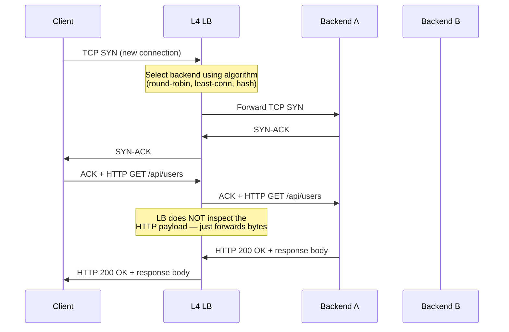
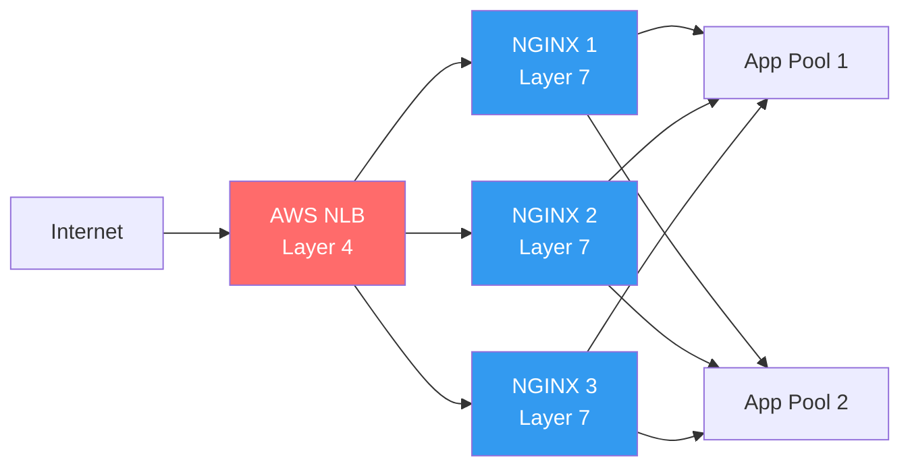
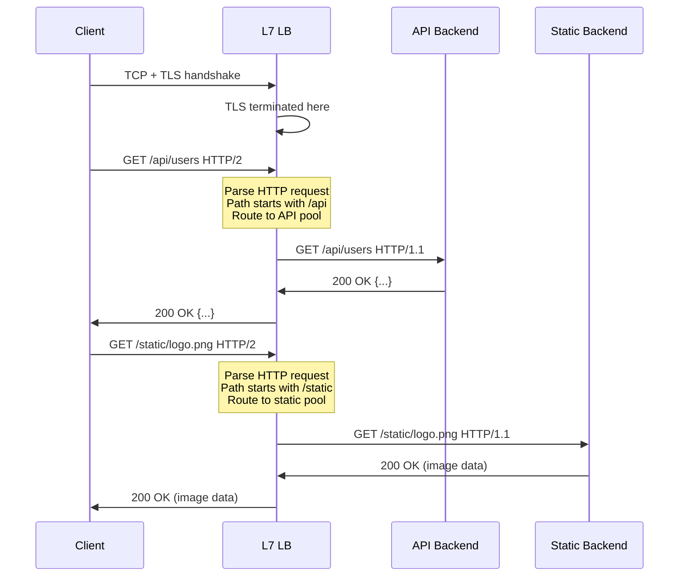
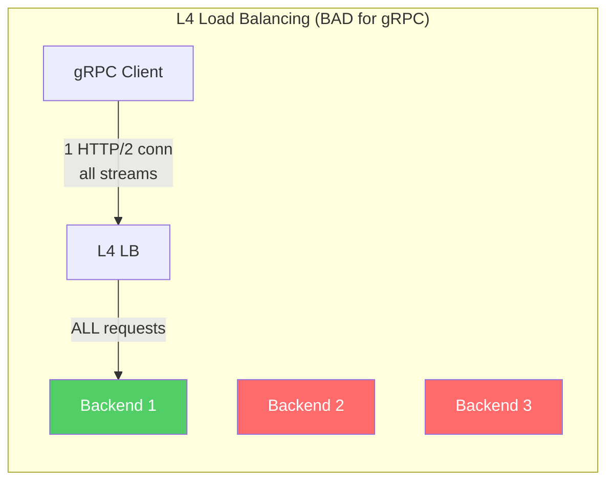
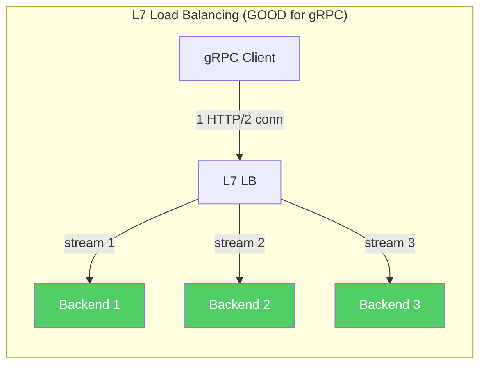
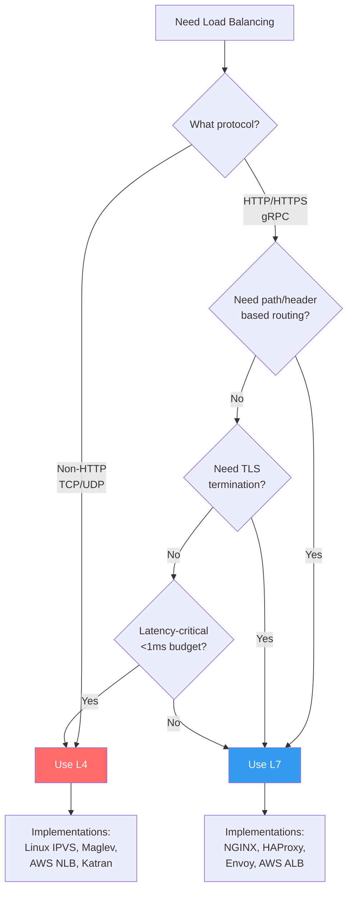

# L4 vs L7 Load Balancing

The single most important architectural decision when deploying a load balancer is the OSI layer at which it operates. A Layer 4 load balancer works at the transport layer — it sees TCP connections and UDP datagrams but has no understanding of the application protocol (HTTP, gRPC, etc.) being carried inside them. A Layer 7 load balancer operates at the application layer — it fully parses HTTP requests, inspects headers, understands URL paths, and can make routing decisions based on any aspect of the application-level message.

This is not merely an academic distinction. It determines your latency budget, your routing flexibility, your TLS strategy, your connection management, your debugging capabilities, and fundamentally what kinds of traffic policies you can express.

## The OSI Model in Practice

Before diving in, let's ground the discussion in what actually happens when a packet traverses a network:

```
Layer 7 — Application     HTTP, gRPC, WebSocket, SMTP, DNS
Layer 6 — Presentation    TLS/SSL, compression, encoding
Layer 5 — Session          Session establishment and management
Layer 4 — Transport        TCP, UDP — ports, segments, flow control
Layer 3 — Network          IP — addresses, routing, packets
Layer 2 — Data Link        Ethernet — MAC addresses, frames
Layer 1 — Physical         Copper, fiber, radio — bits on a wire
```

In practice, layers 5 and 6 are usually folded into layers 4 and 7. When we say "L4 load balancer," we mean it operates on TCP/UDP headers (source/destination IP and port). When we say "L7 load balancer," we mean it parses the full application protocol.

## Layer 4 Load Balancing

### How It Works

An L4 load balancer receives a TCP SYN packet (the first packet of a new connection), selects a backend server, and forwards the entire TCP connection to that backend. It does not inspect the payload. It does not parse HTTP. It does not know whether the connection carries a web page request, a database query, or a video stream.



The critical property: the load balancer makes **one routing decision per connection**, not per request. Every request sent over that TCP connection goes to the same backend, regardless of URL path, headers, or content.

### Connection Forwarding Modes

L4 load balancers use different mechanisms to forward traffic. The choice affects performance, scalability, and operational complexity.

#### NAT (Network Address Translation) Mode

The load balancer rewrites the destination IP address of incoming packets to the selected backend's IP. Return traffic flows back through the load balancer, which rewrites the source IP back to the load balancer's VIP (Virtual IP).

```
Incoming packet:
  src: 203.0.113.10:54321  dst: 198.51.100.1:443 (VIP)

After DNAT by LB:
  src: 203.0.113.10:54321  dst: 10.0.1.5:8080 (backend)

Return packet from backend:
  src: 10.0.1.5:8080        dst: 203.0.113.10:54321

After SNAT by LB:
  src: 198.51.100.1:443     dst: 203.0.113.10:54321
```

**Pros:** Simple to set up. Backends don't need special configuration. Works with any backend that can handle TCP.

**Cons:** The load balancer must process every packet in both directions (ingress and egress). For high-bandwidth services (video streaming, large file downloads), the load balancer becomes a bandwidth bottleneck because all return traffic flows through it.

#### DSR (Direct Server Return) Mode

The load balancer only handles incoming packets. Return traffic goes directly from the backend to the client, bypassing the load balancer entirely.

```
                    ┌──────────┐
   Request ────────▶│   L4 LB  │────────▶ Backend
                    └──────────┘              │
                                              │
   Client ◀──────────────────────────── Response
         (direct from backend, no LB in path)
```

This works by having the backend configured with the VIP on a loopback interface. The load balancer rewrites the destination MAC address (layer 2) but leaves the IP addresses unchanged. The backend sees the VIP as the destination, recognizes it as its own (loopback), processes the request, and sends the response directly to the client using the VIP as the source IP.

```
Incoming packet (after LB modifies MAC, not IP):
  src: 203.0.113.10:54321  dst: 198.51.100.1:443 (VIP — unchanged)
  dst MAC: backend's MAC (rewritten by LB)

Backend processing:
  Backend has VIP (198.51.100.1) on loopback interface
  Accepts packet, processes request

Return packet (directly to client):
  src: 198.51.100.1:443 (VIP)  dst: 203.0.113.10:54321
  Sent directly to client — LB never sees this packet
```

**Pros:** Massively reduces load balancer bandwidth. For workloads where responses are much larger than requests (web pages, API responses, file downloads — almost everything), DSR reduces LB traffic by 90% or more.

**Cons:** Requires L2 adjacency (same VLAN) or tunneling (IP-in-IP, GRE). Backends must be configured with the VIP on loopback. The load balancer cannot modify responses (no response-header injection, no compression). Connection tracking is harder (the LB only sees half the conversation). Health checks must be managed carefully because the LB can't observe return traffic failures.

#### IP Tunneling (IPIP / GRE)

A variation of DSR that works across L3 boundaries. The load balancer encapsulates the original packet inside a new IP packet addressed to the backend. The backend decapsulates, processes the request, and responds directly to the client.

```
Original packet:
  [IP: src=client dst=VIP] [TCP: ...] [payload]

After LB encapsulation:
  [IP: src=LB dst=backend] [IP: src=client dst=VIP] [TCP: ...] [payload]
       ↑ outer header            ↑ original packet preserved inside
```

This allows DSR across different subnets and even different data centers, at the cost of a small overhead for encapsulation (20 bytes for IPIP, 24 bytes for GRE).

### What L4 Cannot Do

Because the load balancer never inspects the application payload, it fundamentally cannot:

- Route `/api/users` to one backend pool and `/api/orders` to another
- Inject, remove, or modify HTTP headers (e.g., `X-Forwarded-For`, `X-Request-ID`)
- Terminate TLS and re-encrypt to backends with different certificates
- Implement HTTP-level rate limiting (e.g., 100 requests per second per API key)
- Distinguish between HTTP methods (GET vs POST)
- Cache responses
- Compress response bodies
- Rewrite URLs
- Serve custom error pages when backends are down
- Route gRPC traffic at the RPC method level
- Handle WebSocket upgrade logic with awareness

### When L4 Is the Right Choice

Despite its limitations, L4 load balancing is the right choice in several scenarios:

1. **Non-HTTP protocols:** Database connections (MySQL, PostgreSQL, Redis), message queues (Kafka, RabbitMQ), custom TCP protocols. An L7 load balancer would need protocol-specific parsing for each.

2. **Extreme performance requirements:** When you need millions of connections per second and the lowest possible latency. L4 adds microseconds; L7 adds milliseconds.

3. **Passthrough TLS:** When you want end-to-end encryption and the load balancer should not terminate TLS. The LB routes based on the TLS SNI (Server Name Indication) extension without decrypting traffic.

4. **UDP traffic:** DNS servers, game servers, VoIP, video streaming over UDP. L7 concepts (request/response) don't cleanly apply to UDP.

5. **As a front layer before L7 LBs:** Many architectures use an L4 LB (like AWS NLB) in front of L7 LBs (like NGINX) to distribute TCP connections across multiple L7 LB instances.



## Layer 7 Load Balancing

### How It Works

An L7 load balancer terminates the client's TCP connection (and usually TLS), fully parses the application protocol (HTTP/1.1, HTTP/2, gRPC), and opens a separate connection to the selected backend. It makes routing decisions on a **per-request** basis, not per-connection.



The critical difference: **two different requests on the same TCP connection can go to different backends.** This is impossible with L4 load balancing.

### Capabilities Unique to L7

#### Path-Based Routing

Route requests to different backend pools based on the URL path:

```
/api/*           → API servers (Node.js, Go)
/admin/*         → Admin panel servers
/static/*        → CDN origin / static file servers
/graphql         → GraphQL gateway
/ws              → WebSocket servers
/health          → Health check endpoint (handled locally)
```

This enables a single entry point (one domain, one IP, one TLS certificate) to serve traffic for an entire microservices architecture.

#### Header-Based Routing

Route based on any HTTP header:

```
Host: api.example.com       → API servers
Host: www.example.com       → Web servers
Host: admin.example.com     → Admin servers

X-API-Version: v2           → v2 API servers
X-API-Version: v1           → v1 API servers (legacy)

User-Agent: *Mobile*        → Mobile-optimized servers
```

#### Cookie-Based Routing

Read cookies to implement session affinity or A/B testing:

```
Cookie: session=abc123    → Route to the same backend that created this session
Cookie: experiment=new-ui → Route to servers running the new UI
```

#### TLS Termination

The L7 load balancer decrypts TLS from the client and optionally re-encrypts when talking to backends. This centralizes certificate management and allows the LB to inspect and modify HTTP traffic.

```
Client ──── HTTPS (TLS 1.3) ────▶ L7 LB ──── HTTP (plain) ────▶ Backend
                                        or
Client ──── HTTPS (TLS 1.3) ────▶ L7 LB ──── HTTPS (internal cert) ──▶ Backend
```

Benefits of terminating TLS at the load balancer:
- **Single place to manage certificates** — renew once, not on every backend
- **Hardware acceleration** — the LB can use specialized TLS hardware
- **Inspection** — the LB can see HTTP headers and make routing decisions
- **Backend simplification** — backends don't need TLS configuration
- **Protocol upgrade** — clients can use HTTP/2 or HTTP/3 while backends speak HTTP/1.1

#### Request and Response Modification

The L7 LB can modify requests before forwarding and responses before returning:

**Request modifications:**
- Add `X-Forwarded-For`, `X-Forwarded-Proto`, `X-Request-ID` headers
- Rewrite URL paths (`/v2/users` → `/users` when forwarding to backend)
- Add authentication headers after validating a JWT
- Strip sensitive headers before forwarding

**Response modifications:**
- Add security headers (`Strict-Transport-Security`, `X-Frame-Options`)
- Add CORS headers
- Compress response bodies (gzip, brotli)
- Cache responses and serve from cache on subsequent requests
- Inject monitoring scripts or tracking pixels

#### WebSocket Support

L7 load balancers handle the HTTP Upgrade handshake that initiates a WebSocket connection:

```
Client → LB: GET /ws HTTP/1.1
              Upgrade: websocket
              Connection: Upgrade

LB → Backend: GET /ws HTTP/1.1
               Upgrade: websocket
               Connection: Upgrade

Backend → LB: HTTP/1.1 101 Switching Protocols
               Upgrade: websocket

LB → Client: HTTP/1.1 101 Switching Protocols
              Upgrade: websocket

[Connection upgraded — LB now passes raw frames]
```

After the upgrade, the connection behaves like a persistent tunnel. The LB can still apply timeouts, connection limits, and per-connection rate limiting.

#### HTTP/2 and gRPC Awareness

HTTP/2 multiplexes many requests over a single TCP connection. An L4 load balancer would send all multiplexed requests to the same backend (because it's one TCP connection). An L7 load balancer can demultiplex and distribute individual HTTP/2 streams across backends.

This is critical for gRPC, which uses HTTP/2. Without L7 awareness, gRPC load balancing is essentially broken — one long-lived HTTP/2 connection from a client would pin all RPCs to a single backend.





### The Cost of L7

L7 load balancing provides powerful capabilities, but at a cost:

1. **Higher latency:** The LB must fully parse HTTP headers. This adds microseconds to low milliseconds per request. For TLS termination, the initial handshake adds 1-2 round trips.

2. **Higher resource consumption:** The LB must maintain state for every active HTTP request, buffer headers, and potentially buffer response bodies. Memory usage scales with concurrent requests, not just connections.

3. **Connection pooling complexity:** The LB maintains separate connection pools to each backend. These must be tuned (max connections, idle timeout, connection lifetime) to avoid either exhausting backend resources or creating too many connections.

4. **Failure surface area:** The LB is now actively parsing and modifying traffic. A bug in the HTTP parser, a misconfigured rewrite rule, or a memory leak in the response buffer can cause outages. L4 LBs have a much smaller failure surface.

5. **TLS overhead:** If the LB terminates and re-encrypts, every request incurs two TLS operations (client→LB and LB→backend). This doubles the CPU cost of encryption.

## Performance Comparison

| Metric | L4 | L7 |
|--------|----|----|
| **Connections per second** | Millions (kernel-bypass: 10M+) | Hundreds of thousands |
| **Added latency** | <100μs | 0.5–5ms |
| **Memory per connection** | ~128 bytes (conntrack entry) | ~16KB+ (HTTP buffers) |
| **Bandwidth bottleneck** | Only in NAT mode | Always (terminates connections) |
| **CPU usage** | Minimal (packet forwarding) | Significant (HTTP parsing, TLS) |
| **Max throughput** | Line rate (100Gbps+) | 10–40Gbps typical |

These numbers are approximate and vary dramatically by implementation. DPDK-based L4 load balancers (like Maglev, Katran) can handle 10M+ connections per second. A well-tuned NGINX can handle 100K+ HTTP requests per second on a single core.

## Decision Framework



### Use L4 When:

- The protocol is not HTTP (databases, message queues, custom TCP)
- You need to pass through TLS without terminating it (SNI-based routing)
- Maximum throughput and minimum latency are the primary goals
- You're distributing TCP connections across a fleet of L7 load balancers
- You're handling UDP traffic (DNS, gaming, VoIP)
- You need DSR for bandwidth-heavy responses

### Use L7 When:

- You need to route based on URL path, HTTP header, or cookie
- You want centralized TLS termination and certificate management
- You're serving multiple services behind a single domain
- You need HTTP-level rate limiting, caching, or compression
- You're load balancing gRPC (HTTP/2 stream-level balancing)
- You need to modify requests or responses (header injection, URL rewriting)
- You want integrated WAF, authentication, or authorization
- You need per-request observability (access logs with HTTP details)

### Use Both When:

The most common production architecture uses both layers:

```
Internet → L4 LB (NLB) → L7 LB fleet (NGINX/Envoy) → Application pods

                         ┌─────────────────────────────┐
                         │  L4 distributes connections  │
                         │  across L7 LB instances      │
                         │  (scales the L7 layer)       │
                         └─────────────────────────────┘
```

This pattern is used by virtually every cloud provider's managed load balancing service. AWS's Application Load Balancer (ALB), for example, runs a fleet of L7 proxy instances behind an L4 Network Load Balancer.

## L4 Load Balancing in the Linux Kernel: IPVS

Linux has a built-in L4 load balancer called IPVS (IP Virtual Server), part of the LVS (Linux Virtual Server) project. It operates in the kernel's netfilter framework and supports NAT, DSR, and IP tunneling modes.

```bash
# Install IPVS management tool
apt-get install ipvsadm

# Create a virtual service on VIP 10.0.0.1:80
ipvsadm -A -t 10.0.0.1:80 -s rr

# Add real servers
ipvsadm -a -t 10.0.0.1:80 -r 10.0.1.1:8080 -m   # NAT mode (-m)
ipvsadm -a -t 10.0.0.1:80 -r 10.0.1.2:8080 -m
ipvsadm -a -t 10.0.0.1:80 -r 10.0.1.3:8080 -g   # DSR mode (-g)

# View current configuration
ipvsadm -Ln

# View connection statistics
ipvsadm -Ln --stats
```

Kubernetes' `kube-proxy` can operate in IPVS mode, where it programs IPVS rules for every `ClusterIP` Service. This is significantly more efficient than the default iptables mode for clusters with thousands of Services.

## SNI-Based Routing: L4 Meets L7

There is a middle ground between pure L4 and full L7. TLS Client Hello packets include the Server Name Indication (SNI) extension, which specifies the hostname the client is trying to connect to. An L4 load balancer can inspect the SNI without decrypting the TLS connection and route based on hostname.

```
Client Hello:
  [TLS Record]
    [Handshake: Client Hello]
      [SNI Extension]
        server_name: api.example.com     ← visible in plaintext
      [Cipher Suites]
      [Supported Versions]
    [Application Data]                    ← encrypted, not visible
```

This gives you hostname-based routing without the cost of full TLS termination. HAProxy and Envoy both support this. It's commonly used to route traffic to different backends based on subdomain while preserving end-to-end encryption.

```
api.example.com   → Backend pool A (TLS passthrough)
www.example.com   → Backend pool B (TLS passthrough)
admin.example.com → Backend pool C (TLS passthrough)
```

The limitation: you can only route based on hostname, not URL path or headers, because those are encrypted inside the TLS tunnel.

## Real-World Architectures

### Google Maglev (L4)

Google's Maglev is a custom L4 load balancer that runs on commodity Linux servers. It uses kernel bypass (no packets go through the kernel networking stack) and consistent hashing to distribute packets across backend pools. Maglev can handle 10M+ packets per second per machine.

Key design decisions:
- **Consistent hashing** ensures that connection tracking is distributed — any Maglev instance can handle any packet for a given connection
- **No shared state** between Maglev instances — each operates independently
- **ECMP (Equal-Cost Multi-Path)** routing directs packets to any Maglev instance
- **Connection draining** during backend removal uses the consistent hash to minimize disruption

### Meta's Katran (L4)

Katran is Meta's (Facebook's) open-source L4 load balancer, based on XDP (eXpress Data Path) and eBPF. It processes packets before they even enter the Linux networking stack, achieving extremely low latency and high throughput.

### Envoy as L7 (Service Mesh Data Plane)

In a service mesh like Istio, every pod gets an Envoy sidecar that acts as an L7 load balancer. This means every inter-service call goes through two Envoy proxies (one on the caller, one on the callee), each capable of full HTTP/gRPC inspection, routing, retry, circuit breaking, and observability.

```
Pod A                          Pod B
┌────────────────────┐         ┌────────────────────┐
│ App ──▶ Envoy ─────┼────────▶│ Envoy ──▶ App      │
│      (client-side  │         │ (server-side       │
│       L7 proxy)    │         │  L7 proxy)         │
└────────────────────┘         └────────────────────┘
```

This architecture provides the finest-grained control at the highest operational complexity. Every hop adds latency (typically 1-3ms per Envoy hop), but provides per-request metrics, distributed tracing, mutual TLS, and policy enforcement.

## Summary Comparison Table

| Feature | Layer 4 | Layer 7 |
|---------|---------|---------|
| **OSI Layer** | Transport (TCP/UDP) | Application (HTTP, gRPC) |
| **Routing granularity** | Per connection | Per request |
| **Protocol awareness** | None (opaque bytes) | Full HTTP parsing |
| **TLS handling** | Passthrough or SNI routing | Full termination + re-encryption |
| **URL path routing** | No | Yes |
| **Header manipulation** | No | Yes |
| **Caching** | No | Yes |
| **Compression** | No | Yes |
| **WebSocket** | Passes through (unaware) | Handles upgrade consciously |
| **HTTP/2 multiplexing** | Treated as single connection | Individual stream routing |
| **gRPC support** | Poor (connection-level only) | Excellent (per-RPC balancing) |
| **Health checks** | TCP connect, basic script | HTTP status codes, response body |
| **Observability** | Connection counts, bytes | Request rate, latency, status codes |
| **Performance overhead** | Minimal | Moderate |
| **DSR capable** | Yes | No (must terminate connection) |
| **Max throughput** | Line rate (100Gbps+) | 10-40Gbps typical |
| **Use cases** | DB, MQ, UDP, passthrough, extreme perf | HTTP, API, gRPC, content routing |
