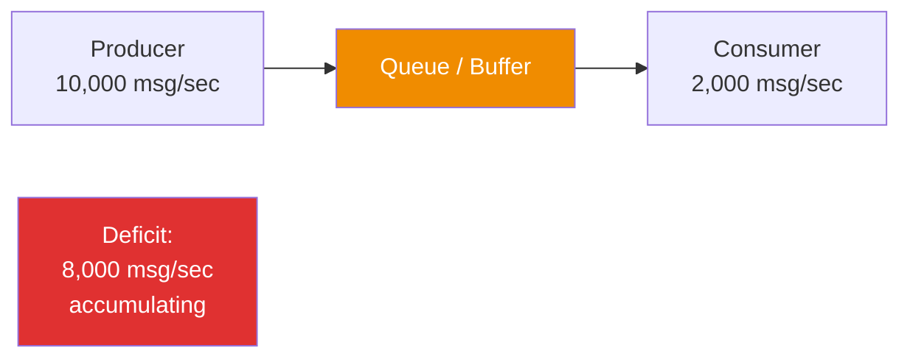
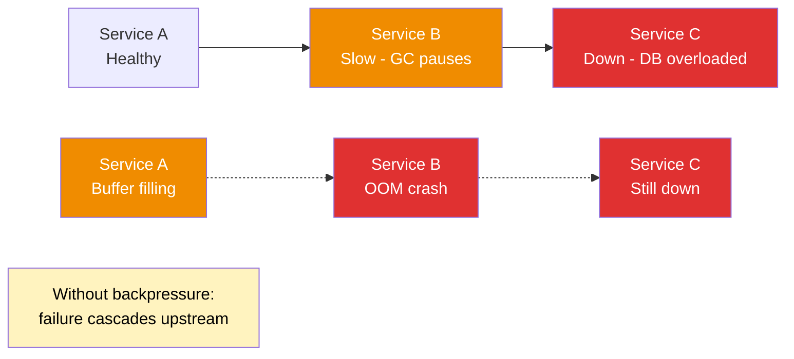
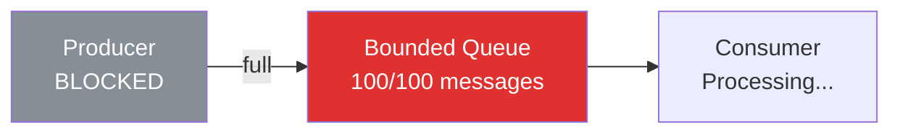
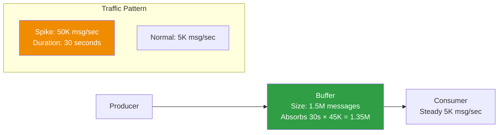
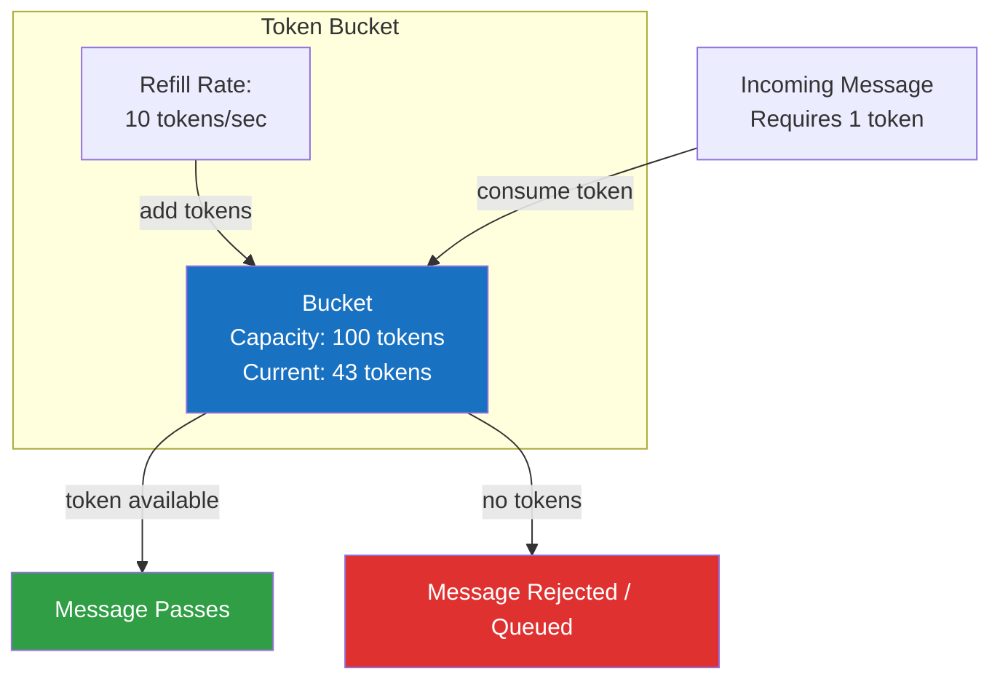
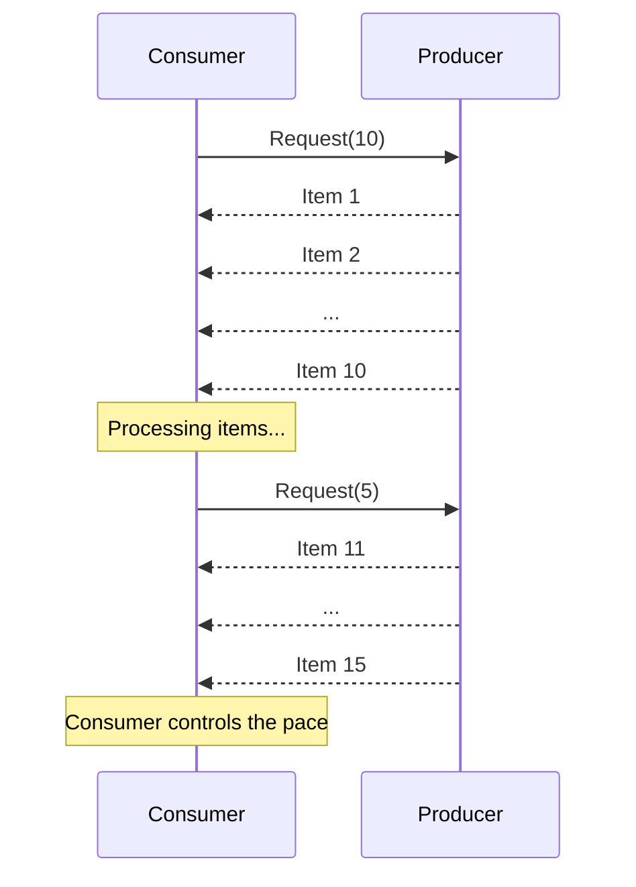
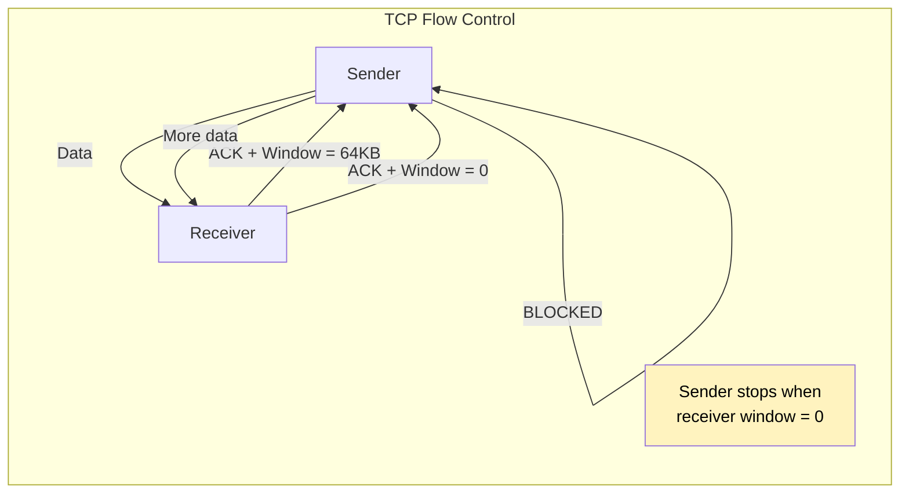
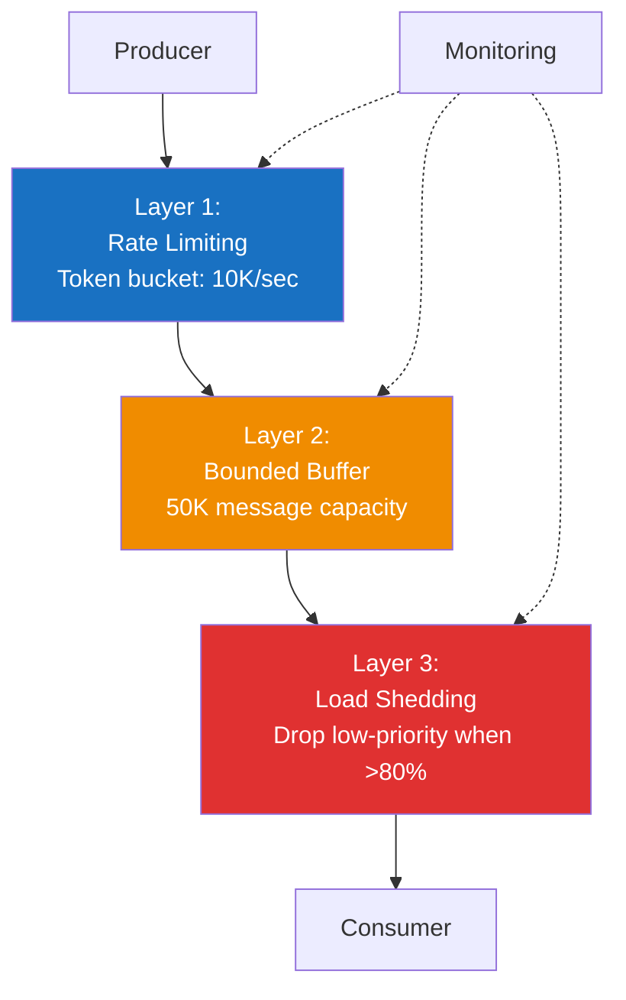

# Backpressure Patterns

Backpressure is the mechanism by which a consumer signals to a producer that it cannot keep up with the rate of incoming data. Without backpressure, a fast producer overwhelms a slow consumer, causing memory exhaustion, cascading failures, and system-wide collapse. Every message queue system must deal with backpressure, and the strategy you choose profoundly affects your system's reliability, latency, and data integrity.

## What Backpressure Is

In any pipeline where data flows from producers to consumers, there's an implicit assumption that the consumer can process data at least as fast as the producer generates it. When this assumption breaks — due to a traffic spike, a slow downstream dependency, a degraded database, or simply a consumer bug — data accumulates. The question is: where does it accumulate, and what happens when the accumulation exceeds capacity?



Without backpressure:

1. The buffer grows without limit
2. Memory usage increases
3. Garbage collection pauses get longer
4. The application becomes unresponsive
5. Out-of-memory kill
6. The consumer restarts, but the backlog is now enormous
7. Repeat

## Why Backpressure Matters

### Out-of-Memory (OOM)

The most immediate consequence. An unbounded buffer between producer and consumer will consume all available memory. In containerized environments with memory limits, this triggers an OOM kill. In non-containerized environments, it can affect other processes on the same machine.

### Cascading Failures

When one service slows down, messages queue up in the upstream service's outbound buffer. The upstream service consumes more memory, GC pauses increase, it becomes slow, its callers start queuing, and the failure cascades through the entire system.



### Latency Amplification

Even if the system doesn't crash, an unbounded buffer causes latency to grow linearly. A message produced at time T enters a buffer with 100,000 pending messages. If the consumer processes 1,000 messages per second, that message won't be processed for 100 seconds. For a real-time system, this is equivalent to failure.

### Data Integrity Risks

When a system is under memory pressure and starts dropping messages randomly (rather than through a deliberate strategy), data integrity is compromised. You don't know which messages were processed and which were lost. Deliberate backpressure gives you control over this decision.

## Backpressure Strategies

### 1. Blocking (Synchronous Backpressure)

The simplest strategy: when the consumer can't keep up, the producer blocks (stops producing). This is the natural behavior of a bounded queue — when the queue is full, `enqueue()` blocks until space is available.



**Pros:**
- Zero data loss — every message is eventually processed
- Memory usage is bounded and predictable
- Simple to implement and reason about

**Cons:**
- Producer is blocked — if the producer is handling HTTP requests, the user waits
- Backpressure propagates to the producer's callers (which may be desirable or not)
- Risk of deadlock in circular dependency graphs

```typescript
class BoundedQueue<T> {
  private queue: T[] = [];
  private waitingProducers: Array<{ item: T; resolve: () => void }> = [];
  private waitingConsumers: Array<{ resolve: (item: T) => void }> = [];

  constructor(private maxSize: number) {}

  async enqueue(item: T): Promise<void> {
    // If there's a waiting consumer, deliver directly
    if (this.waitingConsumers.length > 0) {
      const consumer = this.waitingConsumers.shift()!;
      consumer.resolve(item);
      return;
    }

    // If queue is full, block the producer
    if (this.queue.length >= this.maxSize) {
      return new Promise<void>((resolve) => {
        this.waitingProducers.push({ item, resolve });
      });
    }

    this.queue.push(item);
  }

  async dequeue(): Promise<T> {
    // If there's a waiting producer, take its item and unblock it
    if (this.waitingProducers.length > 0) {
      const producer = this.waitingProducers.shift()!;
      const item = this.queue.length > 0 ? this.queue.shift()! : producer.item;
      if (this.queue.length > 0) {
        this.queue.push(producer.item);
      }
      producer.resolve();
      return item;
    }

    // If queue has items, return one
    if (this.queue.length > 0) {
      return this.queue.shift()!;
    }

    // Queue is empty — block the consumer
    return new Promise<T>((resolve) => {
      this.waitingConsumers.push({ resolve });
    });
  }

  get size(): number {
    return this.queue.length;
  }
}

// Usage
const queue = new BoundedQueue<string>(100);

// Producer — blocks when queue is full
async function produce() {
  for (let i = 0; i < 10000; i++) {
    await queue.enqueue(`message-${i}`);
    // This call blocks if the queue has 100 items
  }
}

// Consumer — blocks when queue is empty
async function consume() {
  while (true) {
    const message = await queue.dequeue();
    await processMessage(message); // Slow processing
  }
}
```

### 2. Dropping (Load Shedding)

When the system is overloaded, intentionally drop messages. This prioritizes system stability over completeness. There are several dropping strategies:

**Drop newest (tail drop):** Reject new messages when the buffer is full. The producer receives an error. This is the most common strategy because it's the simplest and gives clear feedback to the producer.

**Drop oldest (head drop):** When the buffer is full, remove the oldest message to make room for the newest. Useful when only the most recent data matters (real-time metrics, sensor readings, live video frames).

**Random drop:** Drop messages randomly, regardless of position. Used in network congestion (RED — Random Early Detection).

**Priority drop:** Drop low-priority messages first. Keep high-priority messages as long as possible.

```typescript
class DroppingQueue<T> {
  private queue: T[] = [];

  constructor(
    private maxSize: number,
    private dropStrategy: 'newest' | 'oldest' | 'random' = 'newest',
  ) {}

  enqueue(item: T): { dropped: T | null; accepted: boolean } {
    if (this.queue.length < this.maxSize) {
      this.queue.push(item);
      return { dropped: null, accepted: true };
    }

    switch (this.dropStrategy) {
      case 'newest':
        // Reject the new item
        return { dropped: item, accepted: false };

      case 'oldest':
        // Drop the oldest item, accept the new one
        const oldest = this.queue.shift()!;
        this.queue.push(item);
        return { dropped: oldest, accepted: true };

      case 'random':
        // Drop a random item
        const idx = Math.floor(Math.random() * this.queue.length);
        const randomDrop = this.queue[idx];
        this.queue[idx] = item;
        return { dropped: randomDrop, accepted: true };
    }
  }

  dequeue(): T | undefined {
    return this.queue.shift();
  }
}

// Priority-based load shedding
interface PriorityMessage<T> {
  priority: number; // Higher = more important
  data: T;
}

class PriorityDroppingQueue<T> {
  private queue: PriorityMessage<T>[] = [];

  constructor(private maxSize: number) {}

  enqueue(item: PriorityMessage<T>): { dropped: PriorityMessage<T> | null } {
    if (this.queue.length < this.maxSize) {
      this.queue.push(item);
      this.queue.sort((a, b) => b.priority - a.priority); // Sort by priority desc
      return { dropped: null };
    }

    // Find the lowest-priority item
    const lowestPriority = this.queue[this.queue.length - 1];

    if (item.priority > lowestPriority.priority) {
      // New item has higher priority — drop the lowest priority
      const dropped = this.queue.pop()!;
      this.queue.push(item);
      this.queue.sort((a, b) => b.priority - a.priority);
      return { dropped };
    }

    // New item has lower or equal priority — drop it
    return { dropped: item };
  }

  dequeue(): PriorityMessage<T> | undefined {
    return this.queue.shift(); // Returns highest priority first
  }
}
```

### 3. Buffering (Bounded Queues)

Buffer messages in a bounded queue to absorb short-term bursts. The buffer bridges the gap between producer and consumer speeds, smoothing out transient spikes. When the buffer fills up, fall back to another strategy (blocking or dropping).



**Sizing the buffer:**

The buffer must be large enough to absorb the expected burst duration times the rate differential:

```
buffer_size = (peak_rate - consumer_rate) × burst_duration
```

For a system with 50K msg/sec peaks, 5K msg/sec consumer rate, and 30-second bursts:

```
buffer_size = (50,000 - 5,000) × 30 = 1,350,000 messages
```

After the burst, the consumer drains the buffer at its steady rate. The buffer drain time is:

```
drain_time = buffer_size / consumer_rate = 1,350,000 / 5,000 = 270 seconds = 4.5 minutes
```

```typescript
class BufferWithBackpressure<T> {
  private buffer: T[] = [];
  private metrics = {
    enqueued: 0,
    dequeued: 0,
    dropped: 0,
    blocked: 0,
  };

  constructor(
    private softLimit: number,  // Start warning / rate limiting
    private hardLimit: number,  // Start blocking / dropping
    private onOverflow: 'block' | 'drop' = 'drop',
  ) {}

  async enqueue(item: T): Promise<boolean> {
    if (this.buffer.length >= this.hardLimit) {
      if (this.onOverflow === 'drop') {
        this.metrics.dropped++;
        return false;
      }
      // Block until space is available (simplified)
      this.metrics.blocked++;
      await this.waitForSpace();
    }

    this.buffer.push(item);
    this.metrics.enqueued++;

    if (this.buffer.length >= this.softLimit) {
      this.emitBackpressureSignal();
    }

    return true;
  }

  dequeue(count: number = 1): T[] {
    const items = this.buffer.splice(0, count);
    this.metrics.dequeued += items.length;
    return items;
  }

  get utilization(): number {
    return this.buffer.length / this.hardLimit;
  }

  get isUnderPressure(): boolean {
    return this.buffer.length >= this.softLimit;
  }

  private emitBackpressureSignal(): void {
    // Signal to producers to slow down
    // Could be a callback, event emission, or HTTP 429 response
    console.warn(
      `Buffer at ${(this.utilization * 100).toFixed(1)}% capacity ` +
      `(${this.buffer.length}/${this.hardLimit})`
    );
  }

  private waitForSpace(): Promise<void> {
    return new Promise((resolve) => {
      const check = () => {
        if (this.buffer.length < this.hardLimit) {
          resolve();
        } else {
          setTimeout(check, 10);
        }
      };
      check();
    });
  }

  getMetrics() {
    return { ...this.metrics, currentSize: this.buffer.length };
  }
}
```

### 4. Rate Limiting (Token Bucket)

Rate limiting constrains the producer's output rate to match the consumer's processing capacity. The most common algorithm is the **token bucket**:

- A bucket holds tokens, up to a maximum capacity
- Tokens are added at a fixed rate (the sustained rate limit)
- Each message requires one or more tokens to be sent
- If no tokens are available, the message is either queued, rejected, or the sender waits



```typescript
class TokenBucket {
  private tokens: number;
  private lastRefill: number;

  constructor(
    private capacity: number,       // Max tokens
    private refillRate: number,     // Tokens per second
    private costPerMessage: number = 1,
  ) {
    this.tokens = capacity;
    this.lastRefill = Date.now();
  }

  private refill(): void {
    const now = Date.now();
    const elapsed = (now - this.lastRefill) / 1000; // seconds
    this.tokens = Math.min(this.capacity, this.tokens + elapsed * this.refillRate);
    this.lastRefill = now;
  }

  tryConsume(cost: number = this.costPerMessage): boolean {
    this.refill();

    if (this.tokens >= cost) {
      this.tokens -= cost;
      return true;
    }

    return false;
  }

  async waitForToken(cost: number = this.costPerMessage): Promise<void> {
    while (!this.tryConsume(cost)) {
      // Calculate wait time until enough tokens are available
      const tokensNeeded = cost - this.tokens;
      const waitMs = (tokensNeeded / this.refillRate) * 1000;
      await new Promise((resolve) => setTimeout(resolve, Math.max(waitMs, 1)));
    }
  }

  get availableTokens(): number {
    this.refill();
    return this.tokens;
  }
}

// Sliding window rate limiter (alternative to token bucket)
class SlidingWindowRateLimiter {
  private timestamps: number[] = [];

  constructor(
    private maxRequests: number,
    private windowMs: number,
  ) {}

  tryAcquire(): boolean {
    const now = Date.now();
    const windowStart = now - this.windowMs;

    // Remove timestamps outside the window
    this.timestamps = this.timestamps.filter((t) => t > windowStart);

    if (this.timestamps.length < this.maxRequests) {
      this.timestamps.push(now);
      return true;
    }

    return false;
  }

  get remainingRequests(): number {
    const now = Date.now();
    const windowStart = now - this.windowMs;
    const active = this.timestamps.filter((t) => t > windowStart).length;
    return Math.max(0, this.maxRequests - active);
  }
}

// Usage with message queue
class RateLimitedProducer {
  private rateLimiter: TokenBucket;

  constructor(
    private producer: MessageProducer,
    maxRate: number, // messages per second
    burstCapacity: number,
  ) {
    this.rateLimiter = new TokenBucket(burstCapacity, maxRate);
  }

  async send(topic: string, message: string): Promise<void> {
    await this.rateLimiter.waitForToken();
    await this.producer.send(topic, message);
  }

  trySend(topic: string, message: string): boolean {
    if (this.rateLimiter.tryConsume()) {
      this.producer.send(topic, message).catch(console.error);
      return true;
    }
    return false; // Rate limited — caller can decide what to do
  }
}
```

### 5. Reactive Streams (Pull-Based Backpressure)

In a push-based system, the producer decides when to send data. In a pull-based system, the consumer decides when to request data. This is the foundation of the Reactive Streams specification (implemented by RxJS, Project Reactor, Akka Streams, etc.).

The consumer tells the producer: "Give me N items." When the consumer has processed those N items, it asks for more. The producer never sends more than requested.



```typescript
// Simple pull-based backpressure implementation
interface PullSource<T> {
  pull(count: number): Promise<T[]>;
}

interface PullSink<T> {
  process(items: T[]): Promise<void>;
}

class PullBasedPipeline<T> {
  private isRunning = false;

  constructor(
    private source: PullSource<T>,
    private sink: PullSink<T>,
    private batchSize: number = 10,
    private concurrency: number = 1,
  ) {}

  async start(): Promise<void> {
    this.isRunning = true;

    // Start multiple workers
    const workers = Array.from({ length: this.concurrency }, (_, i) =>
      this.workerLoop(i),
    );

    await Promise.all(workers);
  }

  private async workerLoop(workerId: number): Promise<void> {
    while (this.isRunning) {
      try {
        // Pull: consumer decides when to request data
        const items = await this.source.pull(this.batchSize);

        if (items.length === 0) {
          await new Promise((resolve) => setTimeout(resolve, 100));
          continue;
        }

        // Process at the consumer's pace
        await this.sink.process(items);
      } catch (error) {
        console.error(`Worker ${workerId} error:`, error);
        await new Promise((resolve) => setTimeout(resolve, 1000));
      }
    }
  }

  stop(): void {
    this.isRunning = false;
  }
}

// Kafka consumer is naturally pull-based
// The consumer calls poll() to request messages — it controls the pace
// If it polls slowly, it naturally applies backpressure
```

### 6. TCP-Level Backpressure

TCP has built-in flow control through the **receive window**. When the receiver's buffer fills up, it advertises a smaller window, causing the sender to slow down. When the window reaches zero, the sender stops completely.

This is transparent backpressure — your application doesn't need to implement anything. But it only works for direct TCP connections and has limitations:

- It operates at the byte level, not the message level
- It can cause head-of-line blocking in multiplexed connections (HTTP/2)
- It doesn't work across intermediaries (message brokers, load balancers)



### 7. Application-Level Backpressure

For complex systems, backpressure needs to be coordinated at the application level. This involves:

- **Health checks that include queue depth:** A service reports unhealthy when its internal queue exceeds a threshold. The load balancer stops sending traffic.
- **HTTP 429 (Too Many Requests):** The service responds with 429 when overloaded, telling the client to retry with exponential backoff.
- **Kafka consumer flow control:** Pause consuming from specific partitions when a downstream dependency is slow.
- **gRPC flow control:** gRPC has built-in flow control windows similar to TCP but at the HTTP/2 stream level.

```typescript
import { Kafka, Consumer } from 'kafkajs';

class BackpressureAwareConsumer {
  private consumer: Consumer;
  private pausedPartitions: Map<string, Set<number>> = new Map();
  private pendingCount = 0;
  private maxPending: number;

  constructor(kafka: Kafka, groupId: string, maxPending: number = 100) {
    this.consumer = kafka.consumer({ groupId });
    this.maxPending = maxPending;
  }

  async start(topics: string[]): Promise<void> {
    await this.consumer.connect();
    for (const topic of topics) {
      await this.consumer.subscribe({ topic });
    }

    await this.consumer.run({
      eachMessage: async ({ topic, partition, message }) => {
        this.pendingCount++;

        // Check if we need to apply backpressure
        if (this.pendingCount >= this.maxPending) {
          // Pause the partition to stop receiving more messages
          this.consumer.pause([{ topic, partitions: [partition] }]);

          if (!this.pausedPartitions.has(topic)) {
            this.pausedPartitions.set(topic, new Set());
          }
          this.pausedPartitions.get(topic)!.add(partition);

          console.log(
            `Backpressure: paused ${topic}:${partition} ` +
            `(${this.pendingCount} pending)`
          );
        }

        try {
          await this.processMessage(topic, message);
        } finally {
          this.pendingCount--;

          // Resume if we're below the threshold
          if (this.pendingCount < this.maxPending * 0.5) {
            this.resumeAll();
          }
        }
      },
    });
  }

  private resumeAll(): void {
    for (const [topic, partitions] of this.pausedPartitions) {
      if (partitions.size > 0) {
        this.consumer.resume([
          { topic, partitions: Array.from(partitions) },
        ]);
        console.log(
          `Resumed ${topic}:[${Array.from(partitions).join(',')}] ` +
          `(${this.pendingCount} pending)`
        );
      }
    }
    this.pausedPartitions.clear();
  }

  private async processMessage(topic: string, message: any): Promise<void> {
    // Simulate slow processing
    const data = JSON.parse(message.value.toString());
    await processBusinessLogic(data);
  }

  async stop(): Promise<void> {
    await this.consumer.disconnect();
  }
}
```

## Combining Strategies

Real systems often combine multiple backpressure strategies in layers:



```typescript
class LayeredBackpressure<T> {
  private rateLimiter: TokenBucket;
  private buffer: BufferWithBackpressure<T>;
  private metrics = {
    rateLimited: 0,
    buffered: 0,
    dropped: 0,
    processed: 0,
  };

  constructor(config: {
    rateLimit: number;       // messages per second
    burstCapacity: number;
    bufferSoftLimit: number;
    bufferHardLimit: number;
  }) {
    this.rateLimiter = new TokenBucket(config.burstCapacity, config.rateLimit);
    this.buffer = new BufferWithBackpressure(
      config.bufferSoftLimit,
      config.bufferHardLimit,
      'drop',
    );
  }

  async submit(item: T, priority: number = 5): Promise<'accepted' | 'rate_limited' | 'dropped'> {
    // Layer 1: Rate limiting
    if (!this.rateLimiter.tryConsume()) {
      this.metrics.rateLimited++;

      // High-priority items bypass rate limiting
      if (priority < 8) {
        return 'rate_limited';
      }
    }

    // Layer 2: Buffer with load shedding
    if (this.buffer.isUnderPressure && priority < 3) {
      // Layer 3: Drop low-priority items when buffer is stressed
      this.metrics.dropped++;
      return 'dropped';
    }

    const accepted = await this.buffer.enqueue(item);
    if (!accepted) {
      this.metrics.dropped++;
      return 'dropped';
    }

    this.metrics.buffered++;
    return 'accepted';
  }

  getMetrics() {
    return {
      ...this.metrics,
      bufferUtilization: this.buffer.utilization,
      availableTokens: this.rateLimiter.availableTokens,
    };
  }
}
```

## Backpressure in Message Queue Systems

### Kafka

Kafka has natural backpressure through the consumer pull model. The consumer calls `poll()` to fetch messages at its own pace. If it polls slowly, messages accumulate in the topic partition — but since Kafka stores messages on disk with configurable retention, this is by design. Consumer lag is monitored, not prevented.

**Producer-side backpressure:** When the producer's `buffer.memory` is full, `send()` blocks for up to `max.block.ms`. If the broker is slow to acknowledge, this blocking propagates to the application.

### RabbitMQ

RabbitMQ uses `prefetch` (QoS) for consumer-side backpressure. The consumer tells the broker: "Don't give me more than N unacknowledged messages at a time." Additionally, RabbitMQ has built-in flow control:

- **Memory alarm:** When memory usage exceeds `vm_memory_high_watermark` (default 40% of RAM), all publishers are blocked.
- **Disk alarm:** When free disk space drops below `disk_free_limit`, all publishers are blocked.
- **Per-connection flow control:** RabbitMQ can slow down or block individual publisher connections using TCP backpressure.

### SQS

SQS doesn't have traditional backpressure because it's a managed service with virtually unlimited capacity. The queue simply grows. The consumer controls its own pace by adjusting `MaxNumberOfMessages` per receive and the polling frequency. Cost is the implicit backpressure — a growing queue means more API calls.

### Redis Streams

Redis Streams can apply backpressure through `MAXLEN` — when the stream reaches its maximum length, old entries are trimmed. The consumer uses `BLOCK` parameter in `XREADGROUP` to wait for new entries, naturally pulling at its own pace.

## Choosing a Strategy

| Strategy | Data Loss? | Latency Impact | Complexity | Best For |
|---|---|---|---|---|
| **Blocking** | No | High (producer waits) | Low | Batch processing, data pipelines |
| **Dropping (newest)** | Yes | None | Low | Real-time metrics, sensor data |
| **Dropping (oldest)** | Yes | None | Low | Live dashboards, latest-value-wins |
| **Buffering** | No (until overflow) | Bounded | Medium | Absorbing transient spikes |
| **Rate limiting** | Configurable | Bounded | Medium | API endpoints, multi-tenant systems |
| **Pull-based** | No | Consumer-controlled | Medium | Stream processing, consumer-driven |
| **TCP flow control** | No | Transparent | None | Point-to-point connections |
| **App-level** | Configurable | Configurable | High | Complex distributed systems |

The right strategy depends on your requirements:

- **Cannot lose data?** Use blocking or pull-based.
- **Latency matters more than completeness?** Use dropping.
- **Traffic is bursty but bounded?** Use buffering with overflow protection.
- **Multi-tenant with fair share?** Use rate limiting.
- **Complex distributed system?** Combine strategies in layers with monitoring.
