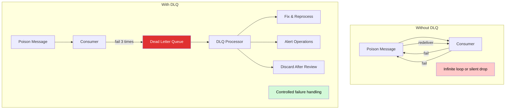
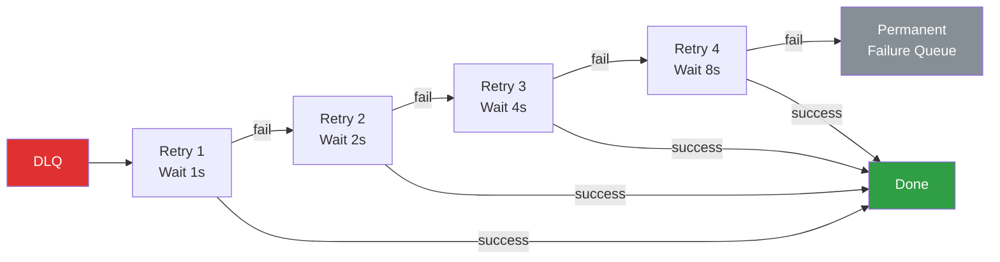

# Dead Letter Queues

A Dead Letter Queue (DLQ) is a separate queue or topic where messages that cannot be successfully processed are routed for later inspection, retry, or disposal. DLQs are a fundamental reliability pattern in messaging systems — they prevent a single bad message from blocking all subsequent processing while preserving the evidence needed to diagnose and fix the underlying problem.

## Why DLQs Exist

### The Poison Message Problem

A **poison message** is a message that a consumer cannot process, no matter how many times it tries. Examples:

- Malformed JSON that fails parsing
- A message referencing a database record that doesn't exist
- A message that triggers a bug in the consumer's business logic
- A message that violates a schema or data constraint
- A message that requires a downstream service that is permanently unavailable

Without a DLQ, a poison message causes one of two bad outcomes:

**Infinite retry loop:** The consumer fails to process the message, nacks it, the broker redelivers it, and the consumer fails again. This loop consumes CPU, generates noise in logs, and prevents the consumer from processing any other messages on the same partition or queue.

**Silent data loss:** The consumer catches the error, logs it, and acknowledges the message to move past it. The message is gone — no record of what happened, no way to reprocess it later.



### What DLQs Provide

1. **Unblocking the main queue:** Poison messages are removed from the main flow, allowing subsequent messages to be processed.
2. **Preserving evidence:** The failed message, its original metadata, and error information are retained for debugging.
3. **Enabling retry:** Messages in the DLQ can be reprocessed after a bug fix or service recovery.
4. **Alerting:** DLQ depth is a direct indicator of processing problems — easy to monitor and alert on.
5. **Audit trail:** Every failed message is accounted for. No silent data loss.

## DLQ Design Principles

### Separate Topic or Queue

A DLQ is a distinct queue or topic, separate from the main processing queue. Convention:

- Kafka: `orders.dlq` or `orders.dead-letter` (separate topic)
- RabbitMQ: Dead letter exchange routes to a dead letter queue
- SQS: Separate SQS queue configured as the redrive destination
- Redis Streams: `orders:dlq` (separate stream)

### Metadata Preservation

A DLQ message must preserve enough context to understand why it failed and where it came from. At minimum:

| Metadata Field | Purpose |
|---|---|
| Original topic/queue | Where the message was originally published |
| Original partition/offset | Exact position in the original stream |
| Original timestamp | When the message was originally published |
| Original headers | Any metadata from the original message |
| Error message | Why processing failed |
| Error stack trace | Where in the code processing failed |
| Retry count | How many times processing was attempted |
| DLQ timestamp | When the message was moved to the DLQ |
| Consumer group/ID | Which consumer failed to process it |

```typescript
interface DLQMessage<T> {
  // Original message data
  originalPayload: T;
  originalTopic: string;
  originalPartition?: number;
  originalOffset?: string;
  originalTimestamp: number;
  originalHeaders: Record<string, string>;
  originalKey?: string;

  // Error information
  errorMessage: string;
  errorStack: string;
  errorType: string;

  // Processing metadata
  retryCount: number;
  firstFailureTimestamp: number;
  lastFailureTimestamp: number;
  consumerGroup: string;
  consumerId: string;

  // DLQ metadata
  dlqTimestamp: number;
  dlqReason: 'max_retries_exceeded' | 'deserialization_error' | 'validation_error' | 'processing_error' | 'timeout';
}
```

### Retry Count Tracking

Track how many times a message has been attempted. This can be done via:

1. **Message headers:** Increment an `x-retry-count` header on each redelivery. Available in Kafka, RabbitMQ, and Redis Streams.
2. **Broker-managed delivery count:** RabbitMQ quorum queues track delivery count natively. SQS provides `ApproximateReceiveCount` as a message attribute.
3. **External state:** Store retry counts in Redis or a database, keyed by message ID. More complex but works with any broker.

## DLQ Processing Strategies

### 1. Manual Review

The simplest strategy: operations engineers review DLQ messages manually, investigate the root cause, and either fix the consumer bug and replay the messages, or discard them after investigation.

**When to use:** Low message volume, complex business logic where automated retry is risky, regulatory requirements for human review.

### 2. Automatic Retry with Exponential Backoff

Messages in the DLQ are automatically retried after a configurable delay. Each retry waits longer (exponential backoff) to give transient issues time to resolve.



**When to use:** Transient failures (network timeouts, service unavailability, rate limiting), where the problem is likely to resolve on its own.

### 3. Conditional Retry

Classify errors and only retry those that are potentially transient:

- **Retryable:** Network timeout, HTTP 503, database connection error, rate limit exceeded
- **Not retryable:** Schema validation error, null pointer exception, permission denied, HTTP 400

```typescript
function isRetryable(error: Error): boolean {
  const retryablePatterns = [
    /ECONNREFUSED/,
    /ETIMEDOUT/,
    /ECONNRESET/,
    /503/,
    /429/,
    /rate limit/i,
    /too many requests/i,
    /connection pool exhausted/i,
    /lock timeout/i,
    /deadlock/i,
  ];

  return retryablePatterns.some((pattern) => pattern.test(error.message));
}
```

### 4. Alerting

DLQ depth is a critical metric. Alert when:

- **Any message appears in the DLQ:** For high-value systems (payments, orders)
- **DLQ depth exceeds a threshold:** For high-volume systems where occasional failures are expected
- **DLQ growth rate exceeds normal:** Indicates a new class of failures

```typescript
class DLQMonitor {
  private previousDepth = 0;

  constructor(
    private alertThreshold: number,
    private growthRateThreshold: number, // messages per minute
    private onAlert: (alert: DLQAlert) => Promise<void>,
  ) {}

  async check(currentDepth: number): Promise<void> {
    const growthRate = currentDepth - this.previousDepth;
    this.previousDepth = currentDepth;

    if (currentDepth > this.alertThreshold) {
      await this.onAlert({
        type: 'threshold_exceeded',
        message: `DLQ depth (${currentDepth}) exceeds threshold (${this.alertThreshold})`,
        depth: currentDepth,
        severity: currentDepth > this.alertThreshold * 5 ? 'critical' : 'warning',
      });
    }

    if (growthRate > this.growthRateThreshold) {
      await this.onAlert({
        type: 'rapid_growth',
        message: `DLQ growing at ${growthRate} messages/check — exceeds threshold (${this.growthRateThreshold})`,
        depth: currentDepth,
        severity: 'critical',
      });
    }
  }
}

interface DLQAlert {
  type: 'threshold_exceeded' | 'rapid_growth' | 'new_error_class';
  message: string;
  depth: number;
  severity: 'warning' | 'critical';
}
```

## DLQ in Kafka

Kafka does not have built-in DLQ support. You implement it in your consumer application by catching processing errors and publishing failed messages to a separate DLQ topic.

```typescript
import { Kafka, KafkaMessage, EachBatchPayload } from 'kafkajs';

class KafkaDLQHandler {
  private kafka: Kafka;
  private dlqProducer;

  constructor(brokers: string[]) {
    this.kafka = new Kafka({ clientId: 'dlq-handler', brokers });
    this.dlqProducer = this.kafka.producer({ idempotent: true });
  }

  async start(): Promise<void> {
    await this.dlqProducer.connect();
  }

  async handleFailedMessage(
    topic: string,
    partition: number,
    message: KafkaMessage,
    error: Error,
    retryCount: number,
    consumerGroup: string,
  ): Promise<void> {
    const dlqTopic = `${topic}.dlq`;

    const dlqMessage: DLQMessage<string> = {
      originalPayload: message.value?.toString() ?? '',
      originalTopic: topic,
      originalPartition: partition,
      originalOffset: message.offset,
      originalTimestamp: Number(message.timestamp),
      originalHeaders: Object.fromEntries(
        Object.entries(message.headers ?? {}).map(([k, v]) => [
          k,
          Buffer.isBuffer(v) ? v.toString() : String(v),
        ]),
      ),
      originalKey: message.key?.toString(),
      errorMessage: error.message,
      errorStack: error.stack ?? '',
      errorType: error.constructor.name,
      retryCount,
      firstFailureTimestamp: Number(
        message.headers?.['x-first-failure-ts']?.toString() ?? Date.now(),
      ),
      lastFailureTimestamp: Date.now(),
      consumerGroup,
      consumerId: process.env.HOSTNAME ?? 'unknown',
      dlqTimestamp: Date.now(),
      dlqReason: isRetryable(error) ? 'processing_error' : 'validation_error',
    };

    await this.dlqProducer.send({
      topic: dlqTopic,
      messages: [
        {
          key: message.key,
          value: JSON.stringify(dlqMessage),
          headers: {
            'dlq-original-topic': topic,
            'dlq-original-partition': String(partition),
            'dlq-original-offset': message.offset,
            'dlq-error-type': error.constructor.name,
            'dlq-retry-count': String(retryCount),
            'dlq-timestamp': String(Date.now()),
          },
        },
      ],
    });
  }

  async stop(): Promise<void> {
    await this.dlqProducer.disconnect();
  }
}

// Using the DLQ handler in a consumer
class KafkaConsumerWithDLQ {
  private kafka: Kafka;
  private consumer;
  private dlqHandler: KafkaDLQHandler;
  private maxRetries: number;

  constructor(
    brokers: string[],
    private groupId: string,
    maxRetries: number = 3,
  ) {
    this.kafka = new Kafka({ clientId: 'consumer-with-dlq', brokers });
    this.consumer = this.kafka.consumer({ groupId });
    this.dlqHandler = new KafkaDLQHandler(brokers);
    this.maxRetries = maxRetries;
  }

  async start(topics: string[]): Promise<void> {
    await this.dlqHandler.start();
    await this.consumer.connect();

    for (const topic of topics) {
      await this.consumer.subscribe({ topic });
    }

    await this.consumer.run({
      autoCommit: false,
      eachMessage: async ({ topic, partition, message, heartbeat }) => {
        const retryCount = Number(
          message.headers?.['x-retry-count']?.toString() ?? '0',
        );

        try {
          await this.processMessage(topic, message);
        } catch (error) {
          if (retryCount < this.maxRetries && isRetryable(error as Error)) {
            // Retry: republish to the same topic with incremented retry count
            const retryProducer = this.kafka.producer();
            await retryProducer.connect();
            await retryProducer.send({
              topic,
              messages: [
                {
                  key: message.key,
                  value: message.value,
                  headers: {
                    ...message.headers,
                    'x-retry-count': String(retryCount + 1),
                    'x-first-failure-ts':
                      message.headers?.['x-first-failure-ts'] ??
                      String(Date.now()),
                  },
                },
              ],
            });
            await retryProducer.disconnect();
          } else {
            // Max retries exceeded or non-retryable error: send to DLQ
            await this.dlqHandler.handleFailedMessage(
              topic,
              partition,
              message,
              error as Error,
              retryCount,
              this.groupId,
            );
          }
        }

        // Always commit to move past the message
        await this.consumer.commitOffsets([
          {
            topic,
            partition,
            offset: (BigInt(message.offset) + 1n).toString(),
          },
        ]);

        await heartbeat();
      },
    });
  }

  private async processMessage(
    topic: string,
    message: KafkaMessage,
  ): Promise<void> {
    const value = message.value?.toString();
    if (!value) throw new Error('Empty message value');

    const data = JSON.parse(value);
    // Business logic here
  }

  async stop(): Promise<void> {
    await this.consumer.disconnect();
    await this.dlqHandler.stop();
  }
}
```

## DLQ in RabbitMQ

RabbitMQ has native DLQ support through **dead letter exchanges (DLX)**. When a message is rejected, expired, or overflows a queue, it's automatically routed to the configured dead letter exchange.

```typescript
import amqp from 'amqplib';

async function setupRabbitMQDLQ(): Promise<void> {
  const connection = await amqp.connect('amqp://localhost');
  const channel = await connection.createChannel();

  // 1. Set up the DLQ infrastructure
  const dlxExchange = 'processing.dlx';
  await channel.assertExchange(dlxExchange, 'topic', { durable: true });

  const dlqQueue = 'processing.dead-letter';
  await channel.assertQueue(dlqQueue, {
    durable: true,
    arguments: {
      'x-message-ttl': 7 * 24 * 60 * 60 * 1000, // Keep DLQ messages for 7 days
    },
  });
  await channel.bindQueue(dlqQueue, dlxExchange, '#'); // Catch all dead letters

  // 2. Set up retry exchange with delayed message support
  // Using a TTL-based retry pattern
  const retryExchange = 'processing.retry';
  await channel.assertExchange(retryExchange, 'direct', { durable: true });

  // Retry queues with different delays
  const retryDelays = [1000, 5000, 30000, 120000, 600000]; // 1s, 5s, 30s, 2m, 10m
  for (const delay of retryDelays) {
    const retryQueue = `processing.retry.${delay}ms`;
    await channel.assertQueue(retryQueue, {
      durable: true,
      arguments: {
        'x-message-ttl': delay,
        'x-dead-letter-exchange': '', // Default exchange
        'x-dead-letter-routing-key': 'processing.main', // Route back to main queue
      },
    });
    await channel.bindQueue(retryQueue, retryExchange, String(delay));
  }

  // 3. Set up the main processing queue
  const mainQueue = 'processing.main';
  await channel.assertQueue(mainQueue, {
    durable: true,
    arguments: {
      'x-dead-letter-exchange': dlxExchange,
      'x-dead-letter-routing-key': 'rejected',
    },
  });

  // 4. Consumer with retry logic
  await channel.prefetch(10);
  channel.consume(mainQueue, async (msg) => {
    if (!msg) return;

    const retryCount = (msg.properties.headers?.['x-retry-count'] ?? 0) as number;
    const maxRetries = retryDelays.length;

    try {
      const data = JSON.parse(msg.content.toString());
      await processMessage(data);
      channel.ack(msg);
    } catch (error) {
      if (retryCount < maxRetries && isRetryable(error as Error)) {
        // Publish to retry exchange with appropriate delay
        const delay = retryDelays[retryCount];
        channel.publish(retryExchange, String(delay), msg.content, {
          persistent: true,
          headers: {
            ...msg.properties.headers,
            'x-retry-count': retryCount + 1,
            'x-original-exchange': msg.fields.exchange,
            'x-original-routing-key': msg.fields.routingKey,
            'x-last-error': (error as Error).message,
          },
        });
        channel.ack(msg); // Ack the original message
      } else {
        // Max retries or non-retryable: reject to DLX
        channel.reject(msg, false);
      }
    }
  }, { noAck: false });
}
```

RabbitMQ adds `x-death` headers automatically when dead-lettering:

```json
{
  "x-death": [
    {
      "count": 3,
      "reason": "rejected",
      "queue": "processing.main",
      "exchange": "",
      "routing-keys": ["processing.main"],
      "time": "2026-03-17T10:30:00Z"
    }
  ]
}
```

## DLQ in SQS

SQS has the simplest DLQ implementation — it's a built-in feature. You create a DLQ, configure a redrive policy on the source queue, and SQS automatically moves messages after `maxReceiveCount` deliveries.

```typescript
import {
  SQSClient,
  CreateQueueCommand,
  GetQueueAttributesCommand,
  ReceiveMessageCommand,
  DeleteMessageCommand,
  SendMessageCommand,
  StartMessageMoveTaskCommand,
} from '@aws-sdk/client-sqs';

const sqs = new SQSClient({ region: 'us-east-1' });

// SQS DLQ redrive: move messages from DLQ back to source
// Available since 2023
async function redriveDLQ(
  dlqArn: string,
  sourceQueueArn: string,
  maxNumberOfMessagesPerSecond: number = 10,
): Promise<string> {
  const result = await sqs.send(new StartMessageMoveTaskCommand({
    SourceArn: dlqArn,
    DestinationArn: sourceQueueArn,
    MaxNumberOfMessagesPerSecond: maxNumberOfMessagesPerSecond,
  }));

  return result.TaskHandle!;
}

// Custom DLQ processor for SQS
class SQSDLQProcessor {
  constructor(
    private sqs: SQSClient,
    private dlqUrl: string,
    private sourceQueueUrl: string,
    private handler: (message: any) => Promise<'retry' | 'discard' | 'archive'>,
  ) {}

  async processDLQ(): Promise<DLQProcessingResult> {
    const result: DLQProcessingResult = {
      processed: 0,
      retried: 0,
      discarded: 0,
      archived: 0,
      errors: 0,
    };

    while (true) {
      const { Messages } = await this.sqs.send(new ReceiveMessageCommand({
        QueueUrl: this.dlqUrl,
        MaxNumberOfMessages: 10,
        WaitTimeSeconds: 5,
        MessageAttributeNames: ['All'],
        AttributeNames: ['All'],
      }));

      if (!Messages?.length) break;

      for (const message of Messages) {
        result.processed++;

        try {
          const body = JSON.parse(message.Body!);
          const receiveCount = parseInt(
            message.Attributes?.ApproximateReceiveCount ?? '0',
            10,
          );

          const action = await this.handler({
            body,
            messageId: message.MessageId,
            receiveCount,
            sentTimestamp: message.Attributes?.SentTimestamp,
            firstReceiveTimestamp: message.Attributes?.ApproximateFirstReceiveTimestamp,
          });

          switch (action) {
            case 'retry':
              // Send back to source queue
              await this.sqs.send(new SendMessageCommand({
                QueueUrl: this.sourceQueueUrl,
                MessageBody: message.Body!,
                MessageAttributes: message.MessageAttributes,
              }));
              result.retried++;
              break;

            case 'discard':
              result.discarded++;
              break;

            case 'archive':
              // In production: write to S3, database, or audit log
              await this.archiveMessage(message);
              result.archived++;
              break;
          }

          // Delete from DLQ
          await this.sqs.send(new DeleteMessageCommand({
            QueueUrl: this.dlqUrl,
            ReceiptHandle: message.ReceiptHandle!,
          }));
        } catch (error) {
          console.error(`Error processing DLQ message ${message.MessageId}:`, error);
          result.errors++;
        }
      }
    }

    return result;
  }

  private async archiveMessage(message: any): Promise<void> {
    // Write to S3, database, or audit system
    console.log(`Archiving message ${message.MessageId}`);
  }
}

interface DLQProcessingResult {
  processed: number;
  retried: number;
  discarded: number;
  archived: number;
  errors: number;
}
```

## Complete DLQ Handler with Exponential Backoff

A production-ready, technology-agnostic DLQ handler:

```typescript
interface RetryConfig {
  maxRetries: number;
  baseDelayMs: number;
  maxDelayMs: number;
  backoffMultiplier: number;
  jitterFactor: number; // 0-1, adds randomness to prevent thundering herd
}

interface DLQEntry<T> {
  id: string;
  payload: T;
  metadata: {
    originalTopic: string;
    originalTimestamp: number;
    errorHistory: Array<{
      error: string;
      stack: string;
      timestamp: number;
      attemptNumber: number;
    }>;
    retryCount: number;
    nextRetryAt: number | null;
    status: 'pending_retry' | 'max_retries_exceeded' | 'non_retryable' | 'resolved';
  };
}

class DLQHandler<T> {
  private entries: Map<string, DLQEntry<T>> = new Map();
  private retryTimer: ReturnType<typeof setInterval> | null = null;

  constructor(
    private config: RetryConfig,
    private processor: (payload: T) => Promise<void>,
    private onMaxRetriesExceeded: (entry: DLQEntry<T>) => Promise<void>,
    private onResolved: (entry: DLQEntry<T>) => Promise<void>,
  ) {}

  /**
   * Add a failed message to the DLQ
   */
  async addEntry(
    id: string,
    payload: T,
    error: Error,
    originalTopic: string,
    originalTimestamp: number,
    previousRetryCount: number = 0,
  ): Promise<void> {
    const existing = this.entries.get(id);

    const errorRecord = {
      error: error.message,
      stack: error.stack ?? '',
      timestamp: Date.now(),
      attemptNumber: previousRetryCount + 1,
    };

    if (existing) {
      existing.metadata.errorHistory.push(errorRecord);
      existing.metadata.retryCount = previousRetryCount + 1;
    } else {
      const entry: DLQEntry<T> = {
        id,
        payload,
        metadata: {
          originalTopic,
          originalTimestamp,
          errorHistory: [errorRecord],
          retryCount: previousRetryCount + 1,
          nextRetryAt: null,
          status: 'pending_retry',
        },
      };
      this.entries.set(id, entry);
    }

    const entry = this.entries.get(id)!;

    if (!isRetryable(error)) {
      entry.metadata.status = 'non_retryable';
      entry.metadata.nextRetryAt = null;
      await this.onMaxRetriesExceeded(entry);
      return;
    }

    if (entry.metadata.retryCount >= this.config.maxRetries) {
      entry.metadata.status = 'max_retries_exceeded';
      entry.metadata.nextRetryAt = null;
      await this.onMaxRetriesExceeded(entry);
      return;
    }

    // Schedule retry with exponential backoff + jitter
    const delay = this.calculateDelay(entry.metadata.retryCount);
    entry.metadata.nextRetryAt = Date.now() + delay;
    entry.metadata.status = 'pending_retry';
  }

  /**
   * Calculate delay with exponential backoff and jitter
   */
  private calculateDelay(retryCount: number): number {
    // Exponential backoff: baseDelay * (multiplier ^ retryCount)
    const exponentialDelay =
      this.config.baseDelayMs *
      Math.pow(this.config.backoffMultiplier, retryCount - 1);

    // Cap at max delay
    const cappedDelay = Math.min(exponentialDelay, this.config.maxDelayMs);

    // Add jitter to prevent thundering herd
    // Full jitter: delay = random(0, cappedDelay)
    // Equal jitter: delay = cappedDelay/2 + random(0, cappedDelay/2)
    const jitter = cappedDelay * this.config.jitterFactor * Math.random();
    const finalDelay = cappedDelay * (1 - this.config.jitterFactor) + jitter;

    return Math.round(finalDelay);
  }

  /**
   * Start the retry processing loop
   */
  startRetryLoop(checkIntervalMs: number = 1000): void {
    this.retryTimer = setInterval(() => this.processRetries(), checkIntervalMs);
  }

  /**
   * Process all entries that are due for retry
   */
  private async processRetries(): Promise<void> {
    const now = Date.now();

    for (const [id, entry] of this.entries) {
      if (
        entry.metadata.status !== 'pending_retry' ||
        entry.metadata.nextRetryAt === null ||
        entry.metadata.nextRetryAt > now
      ) {
        continue;
      }

      try {
        await this.processor(entry.payload);

        // Success — remove from DLQ
        entry.metadata.status = 'resolved';
        await this.onResolved(entry);
        this.entries.delete(id);
      } catch (error) {
        // Failed again — re-add with incremented retry count
        await this.addEntry(
          id,
          entry.payload,
          error as Error,
          entry.metadata.originalTopic,
          entry.metadata.originalTimestamp,
          entry.metadata.retryCount,
        );
      }
    }
  }

  /**
   * Get DLQ statistics
   */
  getStats(): DLQStats {
    let pendingRetry = 0;
    let maxRetriesExceeded = 0;
    let nonRetryable = 0;

    for (const entry of this.entries.values()) {
      switch (entry.metadata.status) {
        case 'pending_retry':
          pendingRetry++;
          break;
        case 'max_retries_exceeded':
          maxRetriesExceeded++;
          break;
        case 'non_retryable':
          nonRetryable++;
          break;
      }
    }

    return {
      total: this.entries.size,
      pendingRetry,
      maxRetriesExceeded,
      nonRetryable,
    };
  }

  /**
   * Stop the retry loop
   */
  stop(): void {
    if (this.retryTimer) {
      clearInterval(this.retryTimer);
      this.retryTimer = null;
    }
  }

  /**
   * Get all entries for inspection
   */
  getEntries(): DLQEntry<T>[] {
    return Array.from(this.entries.values());
  }

  /**
   * Manually replay a specific entry
   */
  async replay(id: string): Promise<boolean> {
    const entry = this.entries.get(id);
    if (!entry) return false;

    try {
      await this.processor(entry.payload);
      entry.metadata.status = 'resolved';
      await this.onResolved(entry);
      this.entries.delete(id);
      return true;
    } catch (error) {
      await this.addEntry(
        id,
        entry.payload,
        error as Error,
        entry.metadata.originalTopic,
        entry.metadata.originalTimestamp,
        entry.metadata.retryCount,
      );
      return false;
    }
  }
}

interface DLQStats {
  total: number;
  pendingRetry: number;
  maxRetriesExceeded: number;
  nonRetryable: number;
}

function isRetryable(error: Error): boolean {
  const nonRetryablePatterns = [
    /SyntaxError/,
    /TypeError/,
    /ValidationError/,
    /SchemaError/,
    /JSON/,
    /parse/i,
    /invalid/i,
    /malformed/i,
    /permission denied/i,
    /unauthorized/i,
    /forbidden/i,
    /404/,
    /not found/i,
  ];

  return !nonRetryablePatterns.some((pattern) => pattern.test(error.message));
}

// Usage
const dlqHandler = new DLQHandler<OrderPayload>(
  {
    maxRetries: 5,
    baseDelayMs: 1000,      // 1 second
    maxDelayMs: 300000,      // 5 minutes
    backoffMultiplier: 2,    // 1s, 2s, 4s, 8s, 16s (capped at 5m)
    jitterFactor: 0.25,      // 25% jitter
  },
  async (payload) => {
    // Retry processing
    await processOrder(payload);
  },
  async (entry) => {
    // Max retries exceeded — alert and archive
    console.error(`DLQ: Max retries exceeded for ${entry.id}`);
    await alertOpsTeam(entry);
    await archiveToS3(entry);
  },
  async (entry) => {
    // Successfully reprocessed
    console.log(`DLQ: Entry ${entry.id} resolved after ${entry.metadata.retryCount} retries`);
  },
);

dlqHandler.startRetryLoop(5000); // Check for retries every 5 seconds
```

## DLQ Best Practices

1. **Always have a DLQ.** Every queue and topic that processes messages should have a corresponding DLQ. No exceptions.

2. **Preserve all context.** Include the original message, headers, error details, retry count, and timestamps. You'll need this for debugging.

3. **Monitor DLQ depth.** Alert on non-zero depth for critical systems. Alert on growth rate for high-volume systems.

4. **Set retention on DLQs.** Don't let DLQ messages accumulate forever. Set a retention period (7-30 days) and archive older messages to cold storage if needed.

5. **Classify errors.** Not all errors are retryable. Schema validation failures, missing required fields, and permission errors will never succeed on retry. Don't waste resources retrying them.

6. **Use jitter in retry delays.** Without jitter, all failed messages from a batch retry at the same time, potentially causing the same overload that caused the original failure (thundering herd).

7. **Have a "permanent failure" destination.** After max retries, messages need to go somewhere — a permanent failure queue, S3 archive, or database table. Don't just drop them.

8. **Build DLQ replay tooling.** You need a way to replay messages from the DLQ after fixing the root cause. This should be an operational tool, not an emergency script.

9. **Test your DLQ.** Intentionally send poison messages in staging to verify that your DLQ pipeline works end-to-end.

10. **Separate DLQs by error class.** Consider using different DLQs for different types of failures (schema errors vs processing errors vs timeout errors). This makes it easier to handle each class appropriately.
