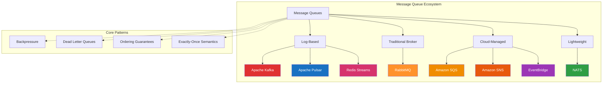
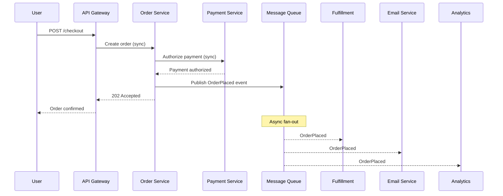
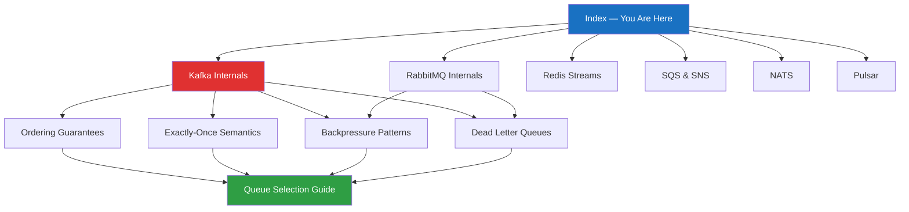

# Message Queues

Every distributed system reaches a point where synchronous request-response communication breaks down. One service calls another, which calls another, which calls a database, which is slow, which causes the second service to time out, which causes the first service to retry, which makes everything worse. The whole call chain is coupled in time — every participant has to be alive and responsive at the exact same moment. Message queues break that coupling. They let services communicate by writing messages to a durable intermediary that the receiving service reads at its own pace, on its own schedule, without the sender blocking or even knowing whether the receiver is currently running.

This is not a minor architectural convenience. It is a fundamental shift in how systems are designed. With message queues, you can absorb traffic spikes without scaling every service, retry failed operations without burdening the caller, and evolve services independently because they communicate through contracts (message schemas) rather than direct network calls.

## Why Message Queues Exist

The core problems that message queues solve:

- **Temporal decoupling:** The sender and receiver don't need to be available at the same time. If the receiver is down, messages accumulate in the queue and are processed when it recovers.
- **Load leveling:** A sudden spike in traffic doesn't crash downstream services. The queue absorbs the burst, and consumers process messages at a sustainable rate.
- **Fan-out:** A single event can be delivered to multiple consumers independently. An order-placed event might trigger payment processing, inventory update, email notification, and analytics — all independently.
- **Retry and resilience:** Failed message processing can be retried automatically. Poison messages can be routed to dead letter queues for investigation.
- **Ordering guarantees:** Some queues (Kafka, SQS FIFO) provide ordering guarantees that let you process events in the correct sequence.

## Concept Map

## Message Queues vs Direct Calls

The decision between synchronous HTTP/gRPC calls and asynchronous message queues depends on the interaction pattern.

### Use Direct Calls When

- The caller needs an immediate response (e.g., "is this username available?")
- The operation is part of a synchronous user flow where latency matters
- The interaction is a simple query with no side effects
- You need strong request-response semantics with typed contracts (gRPC)
- The downstream service is highly available and fast

### Use Message Queues When

- The caller doesn't need the result immediately (fire-and-forget)
- The downstream service is slower than the upstream service
- You need to fan out a single event to multiple consumers
- The operation must be retried on failure without burdening the caller
- You need to decouple deployment and scaling of services
- Traffic patterns are bursty and you need load leveling
- You want an audit log of every event that occurred

### The Hybrid Approach

In practice, most systems use both. A typical e-commerce checkout:

1. **Synchronous:** Validate the cart, check inventory, authorize payment — the user is waiting
2. **Asynchronous:** After payment is authorized, publish an `OrderPlaced` event to a message queue
3. **Fan-out:** Multiple consumers process the event independently — fulfillment, email confirmation, analytics, loyalty points

## The Two Fundamental Models

Message queues split into two architectural paradigms:

### Traditional Message Brokers (RabbitMQ)

The broker is smart, the consumers are simple. The broker routes messages based on rules (exchange types, routing keys, bindings), tracks which messages have been delivered and acknowledged, and removes messages once consumed. Think of it as a post office: it knows how to route mail, and once you pick up your letter, it's gone.

### Log-Based Message Systems (Kafka, Pulsar, Redis Streams)

The broker is dumb, the consumers are smart. The broker stores messages in an append-only log and makes them available to any consumer that asks. Consumers track their own position (offset) in the log. Messages are not deleted after consumption — they remain available for replay. Think of it as a newspaper: everyone reads the same edition, at their own pace, and back issues are still available.

| Feature | Traditional Broker | Log-Based |
|---|---|---|
| Message lifecycle | Deleted after acknowledgement | Retained based on policy |
| Consumer tracking | Broker tracks delivery state | Consumer tracks offset |
| Replay capability | No (message is gone) | Yes (seek to any offset) |
| Routing flexibility | Rich routing rules | Topic/partition based |
| Ordering | Per-queue ordering | Per-partition ordering |
| Use case fit | Task queues, RPC | Event streaming, audit logs |

## Learning Path

Follow this order. Each page builds on concepts from the previous ones.

Start with Kafka Internals — it is the most detailed page and introduces concepts (partitions, consumer groups, offsets, replication) that recur across every other technology. Then read RabbitMQ to understand the contrasting traditional broker model. Redis Streams and SQS/SNS give you lighter-weight and cloud-native options. NATS and Pulsar round out the landscape with different trade-offs.

The pattern pages — Backpressure, Dead Letter Queues, Ordering, and Exactly-Once — are technology-agnostic concepts that apply everywhere. Finish with the Queue Selection Guide, which synthesizes everything into a decision framework.

## Section Map

| Page | What You'll Learn | Difficulty |
|---|---|---|
| [Kafka Internals](./kafka-internals) | The dominant event streaming platform — brokers, partitions, consumer groups, replication, exactly-once, performance tuning | Advanced |
| [RabbitMQ Internals](./rabbitmq-internals) | AMQP model, exchange types, acknowledgements, quorum queues, clustering | Intermediate |
| [Redis Streams](./redis-streams) | Lightweight event streaming with Redis — consumer groups, PEL, comparison with Kafka | Intermediate |
| [SQS & SNS](./sqs-sns) | AWS managed queues and pub/sub — standard vs FIFO, fan-out, EventBridge comparison | Intermediate |
| [NATS](./nats) | Lightweight cloud-native messaging — core pub/sub, JetStream persistence, clustering | Intermediate |
| [Apache Pulsar](./pulsar) | Multi-tenant event streaming — stateless brokers, BookKeeper storage, geo-replication | Advanced |
| [Backpressure Patterns](./backpressure-patterns) | How to handle producers outpacing consumers — blocking, dropping, buffering, rate limiting | Intermediate |
| [Dead Letter Queues](./dead-letter-queues) | Handling poison messages — DLQ design, retry strategies, implementation across systems | Intermediate |
| [Ordering Guarantees](./ordering-guarantees) | Total order, partial order, causal order — maintaining sequence in distributed messaging | Advanced |
| [Exactly-Once Semantics](./exactly-once-semantics) | The hardest problem in messaging — idempotency, transactions, deduplication strategies | Advanced |
| [Queue Selection Guide](./queue-selection-guide) | Decision framework for choosing the right message queue for your use case | Intermediate |

## Key Terminology

Before diving into specific technologies, internalize these terms:

- **Producer / Publisher:** The service that sends messages to the queue
- **Consumer / Subscriber:** The service that reads messages from the queue
- **Broker:** The server that stores and routes messages
- **Topic:** A named category of messages (Kafka, Pulsar, SNS)
- **Queue:** A named buffer that holds messages for consumption (RabbitMQ, SQS)
- **Partition:** A subdivision of a topic for parallelism (Kafka, Pulsar)
- **Offset:** A consumer's position in a log-based message stream
- **Consumer Group:** A set of consumers that cooperatively consume a topic, with each partition assigned to exactly one consumer in the group
- **Acknowledgement (ACK):** A signal from the consumer to the broker that a message has been successfully processed
- **Dead Letter Queue (DLQ):** A separate queue where messages that fail processing repeatedly are routed
- **Backpressure:** A mechanism for consumers to signal producers to slow down when they can't keep up
- **Idempotency:** The property that processing the same message multiple times produces the same result as processing it once
- **Exactly-Once Semantics (EOS):** The guarantee that each message is processed exactly once, even in the presence of failures

Each of these concepts is explored in depth in the pages that follow.
