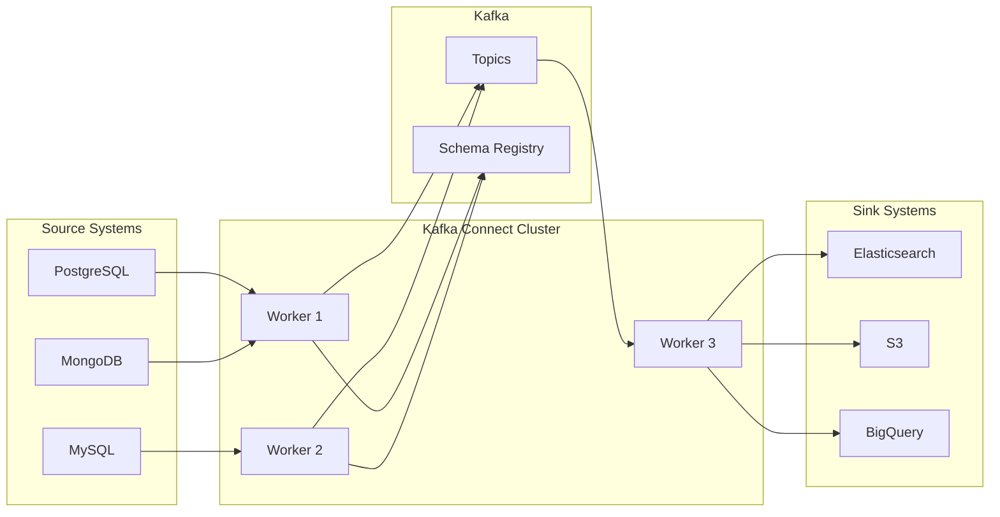

# Kafka Connect

Kafka Connect is a framework for streaming data between Apache Kafka and external systems — databases, search indexes, file systems, cloud storage, and more. Instead of writing custom producer/consumer code for every integration, you configure connectors declaratively.

This matters because data integration is where most engineering teams waste enormous amounts of time. Every team builds its own ETL scripts, cron jobs, and synchronization hacks. Kafka Connect replaces all of that with a standardized, fault-tolerant, scalable framework.

**Related**: [Kafka Internals](/system-design/message-queues/kafka-internals) | [Kafka Streams](/system-design/message-queues/kafka-streams) | [Exactly-Once Semantics](/system-design/message-queues/exactly-once-semantics)

---

## Architecture



### Key Concepts

| Concept | Description |
|---------|-------------|
| **Worker** | JVM process that runs connectors and tasks |
| **Connector** | Plugin that defines how to connect to an external system |
| **Task** | Unit of parallelism within a connector (one task per partition/table) |
| **Source Connector** | Reads from external system, writes to Kafka |
| **Sink Connector** | Reads from Kafka, writes to external system |
| **Converter** | Serializes/deserializes records (JSON, Avro, Protobuf) |
| **Transform (SMT)** | Modifies records in-flight (single message transforms) |

### Deployment Modes

| Mode | Description | Use Case |
|------|-------------|----------|
| **Standalone** | Single worker process | Development, simple pipelines |
| **Distributed** | Multi-worker cluster with automatic task balancing | Production |

---

## Connector Management (REST API)

Kafka Connect exposes a REST API for managing connectors.

| Endpoint | Method | Description |
|----------|--------|-------------|
| `/connectors` | GET | List all connectors |
| `/connectors` | POST | Create a new connector |
| `/connectors/{name}` | GET | Get connector details |
| `/connectors/{name}/config` | GET | Get connector config |
| `/connectors/{name}/config` | PUT | Update connector config |
| `/connectors/{name}/status` | GET | Get connector status |
| `/connectors/{name}/tasks` | GET | List tasks |
| `/connectors/{name}/tasks/{id}/status` | GET | Task status |
| `/connectors/{name}/restart` | POST | Restart connector |
| `/connectors/{name}/tasks/{id}/restart` | POST | Restart a specific task |
| `/connectors/{name}/pause` | PUT | Pause connector |
| `/connectors/{name}/resume` | PUT | Resume connector |
| `/connectors/{name}` | DELETE | Delete connector |
| `/connector-plugins` | GET | List installed plugins |

```bash
# List connectors
curl localhost:8083/connectors | jq

# Create connector
curl -X POST localhost:8083/connectors \
  -H "Content-Type: application/json" \
  -d @connector-config.json

# Check status
curl localhost:8083/connectors/my-connector/status | jq

# Restart failed task
curl -X POST localhost:8083/connectors/my-connector/tasks/0/restart
```

---

## Source Connectors

### Debezium CDC (Change Data Capture)

Debezium reads the database's transaction log (WAL for PostgreSQL, binlog for MySQL) and produces a Kafka record for every row-level change. This is the gold standard for database-to-Kafka integration.

#### PostgreSQL

```json
{
  "name": "postgres-source",
  "config": {
    "connector.class": "io.debezium.connector.postgresql.PostgresConnector",
    "database.hostname": "postgres",
    "database.port": "5432",
    "database.user": "debezium",
    "database.password": "${file:/secrets/pg-password.txt:password}",
    "database.dbname": "myapp",
    "topic.prefix": "myapp",
    "schema.include.list": "public",
    "table.include.list": "public.users,public.orders",
    "plugin.name": "pgoutput",
    "slot.name": "debezium_slot",
    "publication.name": "debezium_pub",
    "heartbeat.interval.ms": "10000",
    "snapshot.mode": "initial",
    "key.converter": "io.confluent.connect.avro.AvroConverter",
    "key.converter.schema.registry.url": "http://schema-registry:8081",
    "value.converter": "io.confluent.connect.avro.AvroConverter",
    "value.converter.schema.registry.url": "http://schema-registry:8081"
  }
}
```

::: tip
Debezium reads from the WAL, which means zero impact on database query performance. It captures every change including DELETE operations. This is fundamentally different from timestamp-based polling which misses deletes and has latency.
:::

#### MySQL

```json
{
  "name": "mysql-source",
  "config": {
    "connector.class": "io.debezium.connector.mysql.MySqlConnector",
    "database.hostname": "mysql",
    "database.port": "3306",
    "database.user": "debezium",
    "database.password": "${file:/secrets/mysql-password.txt:password}",
    "database.server.id": "1",
    "topic.prefix": "myapp",
    "database.include.list": "inventory",
    "schema.history.internal.kafka.bootstrap.servers": "kafka:9092",
    "schema.history.internal.kafka.topic": "schema-changes.inventory",
    "include.schema.changes": "true"
  }
}
```

### JDBC Source Connector

For databases where WAL access is not possible. Uses polling with either timestamp or incrementing column.

```json
{
  "name": "jdbc-source",
  "config": {
    "connector.class": "io.confluent.connect.jdbc.JdbcSourceConnector",
    "connection.url": "jdbc:postgresql://postgres:5432/myapp",
    "connection.user": "reader",
    "connection.password": "${file:/secrets/jdbc-password.txt:password}",
    "mode": "timestamp+incrementing",
    "timestamp.column.name": "updated_at",
    "incrementing.column.name": "id",
    "table.whitelist": "orders,products",
    "topic.prefix": "jdbc-",
    "poll.interval.ms": "5000",
    "batch.max.rows": "1000",
    "transforms": "createKey",
    "transforms.createKey.type": "org.apache.kafka.connect.transforms.ValueToKey",
    "transforms.createKey.fields": "id"
  }
}
```

::: warning
JDBC polling has higher latency than CDC (seconds vs milliseconds), misses hard deletes, and puts load on the source database. Use Debezium CDC whenever possible.
:::

---

## Sink Connectors

### Elasticsearch Sink

```json
{
  "name": "elasticsearch-sink",
  "config": {
    "connector.class": "io.confluent.connect.elasticsearch.ElasticsearchSinkConnector",
    "topics": "myapp.public.products",
    "connection.url": "http://elasticsearch:9200",
    "type.name": "_doc",
    "key.ignore": "false",
    "schema.ignore": "false",
    "behavior.on.null.values": "delete",
    "write.method": "upsert",
    "batch.size": "500",
    "max.buffered.records": "5000",
    "flush.timeout.ms": "10000",
    "max.retries": "5",
    "retry.backoff.ms": "1000"
  }
}
```

### S3 Sink

```json
{
  "name": "s3-sink",
  "config": {
    "connector.class": "io.confluent.connect.s3.S3SinkConnector",
    "topics": "myapp.public.events",
    "s3.bucket.name": "my-data-lake",
    "s3.region": "us-east-1",
    "s3.part.size": "5242880",
    "storage.class": "io.confluent.connect.s3.storage.S3Storage",
    "format.class": "io.confluent.connect.s3.format.parquet.ParquetFormat",
    "partitioner.class": "io.confluent.connect.storage.partitioner.TimeBasedPartitioner",
    "path.format": "'year'=YYYY/'month'=MM/'day'=dd",
    "partition.duration.ms": "3600000",
    "rotate.interval.ms": "600000",
    "flush.size": "10000",
    "locale": "en-US",
    "timezone": "UTC"
  }
}
```

### JDBC Sink

```json
{
  "name": "jdbc-sink",
  "config": {
    "connector.class": "io.confluent.connect.jdbc.JdbcSinkConnector",
    "topics": "myapp.public.users",
    "connection.url": "jdbc:postgresql://analytics-db:5432/warehouse",
    "connection.user": "writer",
    "connection.password": "${file:/secrets/sink-password.txt:password}",
    "insert.mode": "upsert",
    "pk.mode": "record_key",
    "pk.fields": "id",
    "auto.create": "true",
    "auto.evolve": "true",
    "batch.size": "1000"
  }
}
```

---

## Single Message Transforms (SMTs)

SMTs modify records in-flight without writing custom code.

### Common Built-in SMTs

| Transform | Description |
|-----------|-------------|
| `ValueToKey` | Copy fields from value to key |
| `ExtractField` | Extract a single field from struct |
| `ReplaceField` | Include, exclude, or rename fields |
| `MaskField` | Replace field value with null/default |
| `InsertField` | Add static or metadata fields |
| `TimestampRouter` | Route to topics based on timestamp |
| `RegexRouter` | Route to topics based on regex |
| `Flatten` | Flatten nested structs |
| `Cast` | Change field types |
| `HeaderFrom` | Move fields to record headers |
| `Filter` | Drop records based on conditions |

### SMT Configuration Examples

```json
{
  "transforms": "route,unwrap,rename",

  "transforms.route.type": "org.apache.kafka.connect.transforms.RegexRouter",
  "transforms.route.regex": "myapp\\.public\\.(.*)",
  "transforms.route.replacement": "$1",

  "transforms.unwrap.type": "io.debezium.transforms.ExtractNewRecordState",
  "transforms.unwrap.drop.tombstones": "false",
  "transforms.unwrap.delete.handling.mode": "rewrite",
  "transforms.unwrap.add.fields": "op,source.ts_ms",

  "transforms.rename.type": "org.apache.kafka.connect.transforms.ReplaceField$Value",
  "transforms.rename.renames": "old_name:new_name,legacy_id:id"
}
```

::: tip
The Debezium `ExtractNewRecordState` SMT is essential when using Debezium with sink connectors. Without it, the sink receives the full Debezium envelope (before/after/source/op), not the simple row data it expects.
:::

---

## Schema Registry Integration

Schema Registry manages Avro, Protobuf, and JSON schemas, ensuring producers and consumers agree on data format.

### Converter Configuration

```properties
# Avro (most common for Kafka Connect)
key.converter=io.confluent.connect.avro.AvroConverter
key.converter.schema.registry.url=http://schema-registry:8081
value.converter=io.confluent.connect.avro.AvroConverter
value.converter.schema.registry.url=http://schema-registry:8081

# Protobuf
value.converter=io.confluent.connect.protobuf.ProtobufConverter

# JSON with schema
value.converter=org.apache.kafka.connect.json.JsonConverter
value.converter.schemas.enable=true

# JSON without schema (not recommended for production)
value.converter=org.apache.kafka.connect.json.JsonConverter
value.converter.schemas.enable=false
```

### Compatibility Modes

| Mode | Allowed Changes |
|------|----------------|
| `BACKWARD` | Delete fields, add optional fields (default) |
| `FORWARD` | Add fields, delete optional fields |
| `FULL` | Add/delete optional fields only |
| `NONE` | All changes allowed (dangerous) |

---

## Error Handling & Dead Letter Queues

```json
{
  "errors.tolerance": "all",
  "errors.deadletterqueue.topic.name": "dlq-my-connector",
  "errors.deadletterqueue.topic.replication.factor": 3,
  "errors.deadletterqueue.context.headers.enable": true,
  "errors.retry.delay.max.ms": "60000",
  "errors.retry.timeout": "300000",
  "errors.log.enable": true,
  "errors.log.include.messages": true
}
```

::: warning
Setting `errors.tolerance=all` means failed records go to the DLQ instead of crashing the connector. This prevents data loss from one bad record blocking millions of good records. But you must monitor the DLQ topic and investigate failures.
:::

---

## Operational Patterns

### Health Monitoring

```bash
# Check cluster status
curl localhost:8083/ | jq

# Check all connectors
curl localhost:8083/connectors | jq

# Detailed status check script
for connector in $(curl -s localhost:8083/connectors | jq -r '.[]'); do
  status=$(curl -s "localhost:8083/connectors/$connector/status" | jq -r '.connector.state')
  tasks=$(curl -s "localhost:8083/connectors/$connector/status" | jq -r '.tasks[].state')
  echo "$connector: connector=$status tasks=$tasks"
done
```

### Worker Configuration (Distributed Mode)

```properties
# worker.properties
bootstrap.servers=kafka1:9092,kafka2:9092,kafka3:9092
group.id=connect-cluster
key.converter=io.confluent.connect.avro.AvroConverter
value.converter=io.confluent.connect.avro.AvroConverter

# Internal topics (configure once, never change)
config.storage.topic=connect-configs
offset.storage.topic=connect-offsets
status.storage.topic=connect-status
config.storage.replication.factor=3
offset.storage.replication.factor=3
status.storage.replication.factor=3

# REST API
rest.port=8083
rest.advertised.host.name=connect-worker-1

# Plugin path
plugin.path=/usr/share/confluent-hub-components,/usr/share/java
```

### Common Issues & Fixes

| Issue | Cause | Fix |
|-------|-------|-----|
| Connector FAILED | Bad config, auth error | Check logs, fix config, restart |
| Task FAILED | Transient error, schema change | Restart task, check DLQ |
| Consumer lag growing | Slow sink, too few tasks | Increase `tasks.max`, optimize sink |
| Rebalancing storms | Workers joining/leaving | Increase `scheduled.rebalance.max.delay.ms` |
| OOM errors | Large records, too many tasks | Increase heap, reduce `tasks.max` per worker |

---

## Connector Ecosystem

| Category | Popular Connectors |
|----------|-------------------|
| **RDBMS** | Debezium (PG, MySQL, SQL Server, Oracle), JDBC |
| **NoSQL** | MongoDB, Cassandra, DynamoDB |
| **Search** | Elasticsearch, OpenSearch, Solr |
| **Cloud Storage** | S3, GCS, Azure Blob |
| **Data Warehouse** | BigQuery, Snowflake, Redshift |
| **Messaging** | JMS, RabbitMQ, ActiveMQ |
| **Files** | FileStream, Spooldir, SFTP |
| **HTTP** | HTTP Source/Sink (REST APIs) |

---

*Last updated: 2026-03-20*
