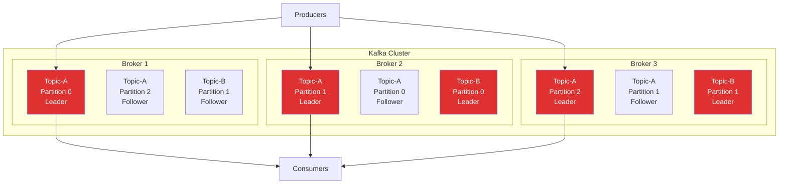
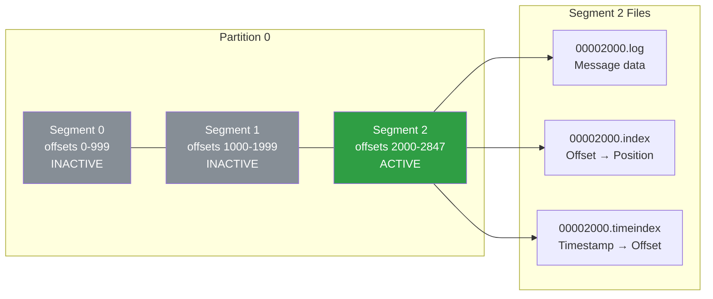
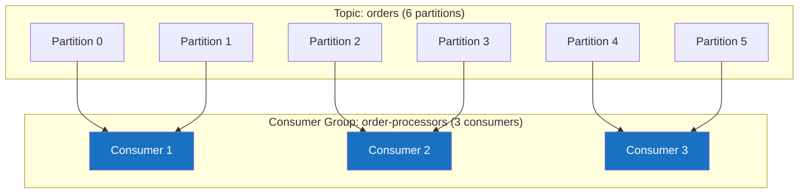
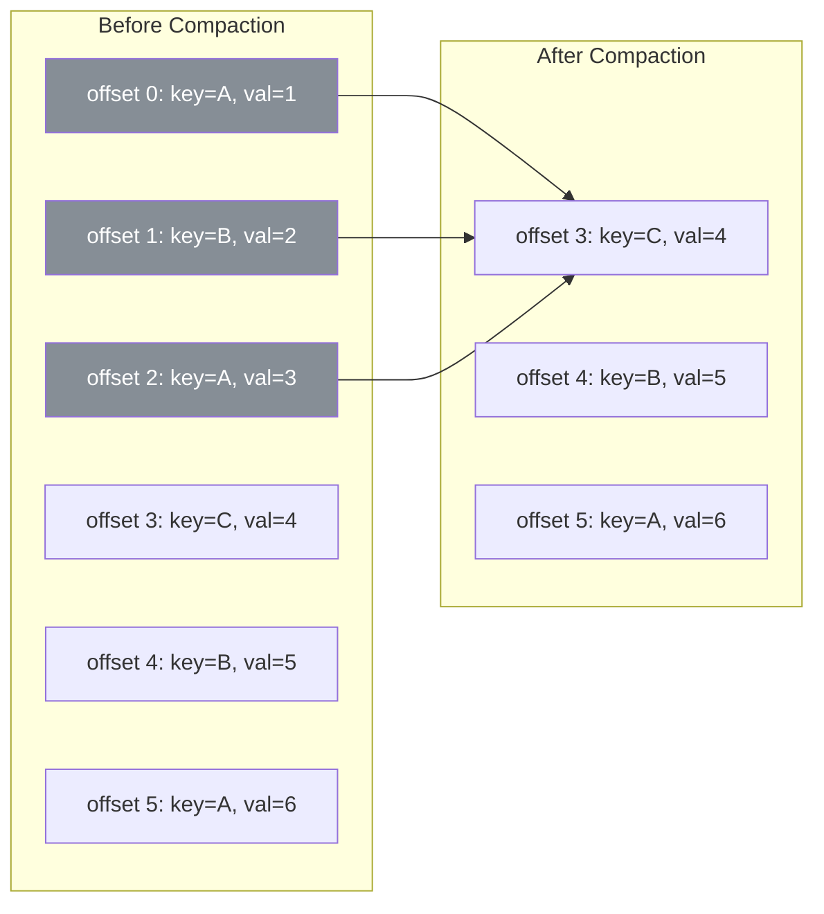
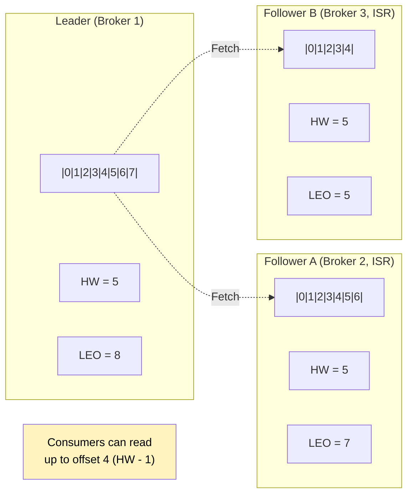

# Kafka Internals

Apache Kafka is the dominant event streaming platform. It handles trillions of messages per day at LinkedIn, Netflix, Uber, and practically every large-scale system built in the last decade. But most developers use Kafka as a black box — they produce messages, consume messages, and pray. When things go wrong (consumer lag spikes, rebalancing storms, data loss during broker failures), they have no mental model to debug the problem.

This page gives you that mental model. We go from the physical storage of bytes on disk through the replication protocol that keeps your data safe, to the exactly-once semantics that make Kafka suitable for financial transactions.

## Architecture Overview

A Kafka cluster consists of multiple **brokers** (servers). Data is organized into **topics**, and each topic is divided into **partitions**. Each partition is an ordered, immutable, append-only log of records. Partitions are distributed across brokers for parallelism and fault tolerance.



### Brokers

A broker is a single Kafka server. Each broker:

- Stores a subset of the cluster's partitions on its local disk
- Handles produce and fetch requests from clients
- Participates in the replication protocol
- Coordinates with other brokers via the controller

One broker is elected as the **controller**. The controller is responsible for:

- Assigning partitions to brokers
- Detecting broker failures
- Triggering leader elections when a partition's leader broker goes down
- Updating cluster metadata

In KRaft mode (Kafka 3.3+, replacing ZooKeeper), the controller is a Raft-based quorum of brokers that manages cluster metadata. In older versions, ZooKeeper serves this role.

### Topics

A topic is a logical category for messages. Topics are named (e.g., `user-events`, `order-placed`, `payment-processed`). Producers write to topics, consumers read from topics. A topic is split into one or more partitions.

### Partitions

Partitions are the unit of parallelism and ordering in Kafka.

**Key properties:**

- Each partition is an ordered, append-only log
- Messages within a partition are assigned a monotonically increasing **offset**
- Ordering is guaranteed only within a single partition, not across partitions
- Each partition is stored on exactly one broker (the leader) and replicated to zero or more follower brokers
- In a consumer group, each partition is consumed by exactly one consumer

**Partition count is critical.** It determines the maximum parallelism of your consumers (you can't have more active consumers in a group than partitions). It also affects throughput, latency, memory usage, and recovery time. Once set, partitions can be increased but never decreased.

### Segments

Each partition is physically stored as a sequence of **segments**. A segment is a pair of files on disk:

- **Log file** (`.log`): Contains the actual message data
- **Index file** (`.index`): Maps offsets to physical positions in the log file
- **Time index file** (`.timeindex`): Maps timestamps to offsets



A new segment is created when the current active segment reaches `log.segment.bytes` (default 1 GB) or `log.roll.ms` / `log.roll.hours`. Only the active segment accepts new writes. Inactive segments are eligible for deletion or compaction based on retention policies.

## Records

A Kafka record (message) consists of:

| Field | Description |
|---|---|
| Key | Optional bytes. Used for partition assignment and log compaction. |
| Value | The message payload (bytes). |
| Timestamp | Set by the producer or broker. Used for time-based retention and time index. |
| Headers | Key-value pairs for metadata (tracing IDs, content type, schema version). |
| Offset | Assigned by the broker. Unique within a partition. |
| Partition | Which partition this record belongs to. |

Records are serialized into bytes before sending. Common serialization formats: JSON, Avro (with Schema Registry), Protobuf, plain strings.

## Producer Internals

The producer is the client that sends records to Kafka. Understanding its internals is essential for tuning throughput and reliability.

### Record Accumulator and Batching

The producer does not send each record individually. It accumulates records in an internal buffer (the **RecordAccumulator**) and groups them into **batches** by topic-partition. A batch is sent when:

1. The batch reaches `batch.size` (default 16 KB)
2. The time since the first record in the batch exceeds `linger.ms` (default 0 ms)
3. The total buffer memory is full (`buffer.memory`, default 32 MB)

```mermaid
graph LR
    APP[Application] -->|send()| RA[Record<br/>Accumulator]

    subgraph "Batches per partition"
        B0[Batch for P0<br/>12 KB / 16 KB]
        B1[Batch for P1<br/>16 KB / 16 KB<br/>FULL - send!]
        B2[Batch for P2<br/>4 KB / 16 KB<br/>linger.ms expired]
    end

    RA --> B0
    RA --> B1
    RA --> B2

    B1 --> NET[Network Thread<br/>Sender]
    B2 --> NET

    NET --> BROKER[Broker]

    style B1 fill:#e03131,color:#fff
    style B2 fill:#f08c00,color:#fff
```

**Tuning trade-offs:**

- `batch.size = 16384` (16 KB): Larger batches = higher throughput, higher latency
- `linger.ms = 0`: By default, the producer sends immediately. Setting `linger.ms = 5` adds 5ms of latency but allows more records to accumulate, improving throughput through better batching and compression
- `buffer.memory = 33554432` (32 MB): If the buffer fills up, `send()` blocks (up to `max.block.ms`)
- `compression.type = none | gzip | snappy | lz4 | zstd`: Compression is applied per-batch. `lz4` and `zstd` offer the best throughput-to-compression ratio

### Acknowledgements (acks)

The `acks` configuration controls how many replicas must acknowledge a write before the producer considers it successful:

| acks | Behavior | Durability | Throughput |
|---|---|---|---|
| `0` | Producer doesn't wait for any acknowledgement. Fire-and-forget. | Lowest — messages can be lost. | Highest |
| `1` | Producer waits for the leader to write the record to its local log. | Medium — data is lost if the leader crashes before replication. | Medium |
| `all` (or `-1`) | Producer waits for all in-sync replicas (ISR) to acknowledge. | Highest — data survives broker failures. | Lowest |

**For production systems, always use `acks: -1`** combined with `min.insync.replicas = 2`. This ensures that at least 2 replicas (including the leader) have persisted the record before the producer receives a success response. If fewer than `min.insync.replicas` are available, the broker rejects the write with a `NotEnoughReplicas` error — this is the correct behavior because it prevents data loss rather than silently accepting writes that can't be replicated.

### Idempotent Producer

Network failures create a dangerous scenario: the producer sends a record, the broker writes it and sends an acknowledgement, but the acknowledgement is lost. The producer retries, and the broker writes a duplicate. With `enable.idempotence = true` (default since Kafka 3.0), the producer assigns a **sequence number** to each record. The broker tracks the expected next sequence number per producer-partition pair and deduplicates retries.

The idempotent producer guarantees exactly-once delivery from a single producer to a single partition. It does not provide exactly-once across multiple partitions — that requires transactions.

### Transactions

Kafka transactions allow a producer to atomically write to multiple partitions and commit consumer offsets as part of the same atomic unit. This is the foundation of Kafka's exactly-once semantics (EOS).

A transactional producer:

1. Initializes with a unique `transactional.id`
2. Calls `beginTransaction()`
3. Produces records to one or more partitions
4. Optionally sends consumer offsets (for consume-transform-produce patterns)
5. Calls `commitTransaction()` or `abortTransaction()`

The broker uses a **Transaction Coordinator** and a **Transaction Log** (internal topic `__transaction_state`) to track transaction state. Consumers configured with `isolation.level = read_committed` only see records from committed transactions.

```typescript
import { Kafka } from 'kafkajs';

const kafka = new Kafka({
  clientId: 'transactional-producer',
  brokers: ['broker1:9092', 'broker2:9092', 'broker3:9092'],
});

const producer = kafka.producer({
  idempotent: true,
  transactionalId: 'order-processor-tx-1',
  maxInFlightRequests: 1,
});

async function processOrderTransactionally(order: Order): Promise<void> {
  const transaction = await producer.transaction();

  try {
    // Write to multiple topics atomically
    await transaction.send({
      topic: 'orders-confirmed',
      messages: [
        {
          key: order.id,
          value: JSON.stringify(order),
          headers: {
            'event-type': 'OrderConfirmed',
            'correlation-id': order.correlationId,
          },
        },
      ],
    });

    await transaction.send({
      topic: 'inventory-reservations',
      messages: order.items.map((item) => ({
        key: item.sku,
        value: JSON.stringify({
          orderId: order.id,
          sku: item.sku,
          quantity: item.quantity,
        }),
      })),
    });

    // Commit consumer offsets as part of the transaction
    await transaction.sendOffsets({
      consumerGroupId: 'order-processor-group',
      topics: [
        {
          topic: 'orders-pending',
          partitions: [
            { partition: order.sourcePartition, offset: String(order.sourceOffset + 1) },
          ],
        },
      ],
    });

    await transaction.commit();
  } catch (error) {
    await transaction.abort();
    throw error;
  }
}
```

### Partitioning Strategy

The producer decides which partition to send each record to:

1. **Explicit partition:** If the application specifies a partition number, that is used
2. **Key-based:** If a key is provided, `hash(key) % numPartitions` determines the partition. All records with the same key go to the same partition, guaranteeing ordering for that key
3. **Sticky partitioning (default since Kafka 2.4):** If no key is provided, the producer sticks to a random partition until the current batch is full, then picks a new random partition. This replaced pure round-robin to improve batching efficiency

**Key design is critical.** Choosing the wrong key can create hot partitions (one partition gets far more traffic than others). Choosing the right key ensures related events are processed in order.

```typescript
// Good: order ID as key ensures all events for an order are in the same partition
await producer.send({
  topic: 'order-events',
  messages: [
    { key: order.id, value: JSON.stringify({ type: 'OrderPlaced', ...order }) },
  ],
});

// Bad: using a high-cardinality field like timestamp creates uniform distribution
// but destroys ordering semantics
await producer.send({
  topic: 'order-events',
  messages: [
    { key: Date.now().toString(), value: JSON.stringify(order) },
  ],
});

// Bad: using a low-cardinality field like country creates hot partitions
// (US partition gets 60% of traffic)
await producer.send({
  topic: 'order-events',
  messages: [
    { key: order.country, value: JSON.stringify(order) },
  ],
});
```

## Consumer Internals

### Consumer Groups

A **consumer group** is a set of consumers that cooperatively consume a topic. Each partition in the topic is assigned to exactly one consumer in the group. This is how Kafka achieves parallel consumption without duplicate processing.



**Key rules:**

- If you have more consumers than partitions, the extra consumers sit idle
- If a consumer fails, its partitions are reassigned to remaining consumers (rebalancing)
- Multiple consumer groups can consume the same topic independently — each group maintains its own offsets
- Adding consumers to a group increases parallelism (up to the partition count)

### Partition Assignment Strategies

When consumers join or leave a group, Kafka must reassign partitions. The assignment strategy determines how:

**RangeAssignor (default before Kafka 3.0):**
Partitions are assigned in contiguous ranges. Consumer 1 gets partitions 0-1, Consumer 2 gets 2-3, Consumer 3 gets 4-5. Simple but can create imbalance when you have multiple topics with different partition counts.

**RoundRobinAssignor:**
Partitions are distributed one at a time in round-robin fashion across consumers. Better balance than Range but doesn't respect topic affinity.

**StickyAssignor:**
Like RoundRobin but tries to preserve existing assignments during rebalancing. If Consumer 2 crashes, only its partitions are reassigned — Consumer 1 and Consumer 3 keep theirs. This minimizes the disruption of rebalancing.

**CooperativeStickyAssignor (recommended):**
Same as Sticky but uses the cooperative rebalancing protocol. Instead of revoking all partitions and reassigning (stop-the-world), it only revokes the partitions that need to move. Other consumers continue processing during the rebalance.

### Offset Management

Each consumer tracks its position in each partition using an **offset** — a 64-bit integer representing the next record to be consumed.

Offsets are committed to an internal Kafka topic (`__consumer_offsets`). The consumer periodically commits its current offsets either:

- **Automatically** (`enable.auto.commit = true`, `auto.commit.interval.ms = 5000`): The consumer commits offsets on a timer. Simple but can cause duplicates (records processed but not yet committed when a crash occurs) or data loss (offsets committed before processing completes).
- **Manually** (`enable.auto.commit = false`): The application commits offsets explicitly after processing. This gives you control but requires careful coding.

```typescript
import { Kafka, EachMessagePayload } from 'kafkajs';

const kafka = new Kafka({
  clientId: 'order-consumer',
  brokers: ['broker1:9092', 'broker2:9092', 'broker3:9092'],
});

const consumer = kafka.consumer({
  groupId: 'order-processors',
  sessionTimeout: 30000,
  heartbeatInterval: 3000,
  maxWaitTimeInMs: 500,
  // Disable auto-commit for manual offset management
  // KafkaJS has autoCommit enabled by default
});

async function startConsumer(): Promise<void> {
  await consumer.connect();
  await consumer.subscribe({ topic: 'orders', fromBeginning: false });

  await consumer.run({
    autoCommit: false,
    eachMessage: async ({ topic, partition, message, heartbeat }: EachMessagePayload) => {
      const order = JSON.parse(message.value!.toString());

      try {
        // Process the order — this might take a while
        await processOrder(order);

        // Call heartbeat periodically during long processing
        // to prevent session timeout and unwanted rebalancing
        await heartbeat();

        // Commit the offset AFTER successful processing
        // The committed offset is the NEXT offset to be read,
        // so we commit message.offset + 1
        await consumer.commitOffsets([
          {
            topic,
            partition,
            offset: (BigInt(message.offset) + 1n).toString(),
          },
        ]);
      } catch (error) {
        // Don't commit the offset — the message will be redelivered
        console.error(`Failed to process order ${order.id}:`, error);
        // Optionally: send to dead letter queue
        await sendToDeadLetterQueue(topic, partition, message, error);
        // Still commit to move past the poison message
        await consumer.commitOffsets([
          {
            topic,
            partition,
            offset: (BigInt(message.offset) + 1n).toString(),
          },
        ]);
      }
    },
  });
}
```

### Rebalancing Protocol

Rebalancing is the process of redistributing partitions among consumers in a group. It is triggered when:

- A consumer joins the group (new instance starts)
- A consumer leaves the group (graceful shutdown)
- A consumer is considered dead (missed heartbeats for `session.timeout.ms`)
- Partitions are added to a subscribed topic
- A subscribed topic is created or deleted

```mermaid
sequenceDiagram
    participant C1 as Consumer 1
    participant C2 as Consumer 2
    participant GC as Group Coordinator<br/>(Broker)
    participant C3 as Consumer 3 (new)

    Note over C1,GC: Stable state: C1 has P0,P1; C2 has P2,P3

    C3->>GC: JoinGroup request
    GC->>C1: Revoke partitions (Eager) /<br/>Keep partitions (Cooperative)
    GC->>C2: Revoke partitions (Eager) /<br/>Keep partitions (Cooperative)

    Note over C1,C2: Eager: All consumers stop<br/>Cooperative: Only affected partitions pause

    C1->>GC: JoinGroup (rejoin)
    C2->>GC: JoinGroup (rejoin)
    C3->>GC: JoinGroup

    GC->>C1: You are the leader,<br/>here are all members

    Note over C1: Leader runs assignment<br/>strategy

    C1->>GC: SyncGroup with assignments
    GC->>C1: Your assignment: P0, P1
    GC->>C2: Your assignment: P2
    GC->>C3: Your assignment: P3

    Note over C1,C3: Consumers resume processing<br/>assigned partitions
```

**Eager rebalancing** (legacy protocol) revokes ALL partitions from ALL consumers, then reassigns. During rebalancing, no consumer processes any messages. This "stop-the-world" pause can last seconds to minutes.

**Cooperative rebalancing** (KIP-429, recommended) only revokes the partitions that need to move. Other consumers continue processing their assigned partitions uninterrupted. Use `partition.assignment.strategy = CooperativeStickyAssignor` to enable this.

**Static group membership** (`group.instance.id`) prevents rebalancing when a consumer restarts within `session.timeout.ms`. Each consumer has a persistent identity, so a restart is treated as a reconnection, not a new join. Essential for rolling deployments.

## Storage Engine

### How Kafka Stores Data on Disk

Kafka stores partition data in log segments on the broker's filesystem. The data directory (configured by `log.dirs`) contains subdirectories for each partition:

```
/var/kafka-data/
├── orders-0/
│   ├── 00000000000000000000.log        # Messages with offsets 0 - 4,999,999
│   ├── 00000000000000000000.index      # Sparse offset index
│   ├── 00000000000000000000.timeindex  # Sparse timestamp index
│   ├── 00000000000005000000.log        # Messages with offsets 5,000,000 - 9,999,999
│   ├── 00000000000005000000.index
│   ├── 00000000000005000000.timeindex
│   └── 00000000000010000000.log        # Active segment (currently being written)
├── orders-1/
│   └── ...
└── orders-2/
    └── ...
```

The `.log` file name is the base offset of the first message in that segment. To find a message at a specific offset:

1. Binary search the segment files by name to find which segment contains the offset
2. Use the `.index` file (a sparse index — not every offset is indexed) to find the nearest indexed entry at or before the desired offset
3. Scan forward in the `.log` file from that position

The `.index` file maps offsets to physical byte positions in the `.log` file. The index is sparse — it stores an entry every `log.index.interval.bytes` (default 4 KB). This keeps the index small enough to be memory-mapped.

### Why Kafka is Fast: Zero-Copy and Sequential I/O

Kafka achieves extraordinary throughput through two techniques:

**Sequential I/O:** Kafka writes records sequentially to the end of the log file. Modern SSDs and HDDs are optimized for sequential writes — an HDD can do 600 MB/s sequential writes vs 100 random IOPS. By treating the disk as an append-only log, Kafka turns the disk from a bottleneck into an asset.

**Zero-copy transfer:** When a consumer fetches data, the broker uses the `sendfile()` system call to transfer data directly from the filesystem page cache to the network socket, bypassing userspace entirely. Normal read path: disk → page cache → application buffer → socket buffer → NIC. Zero-copy path: disk → page cache → NIC. This eliminates two memory copies and two context switches.

### Retention Policies

Kafka supports two retention modes:

**Time-based retention** (`log.retention.hours`, `log.retention.minutes`, `log.retention.ms`): Segments older than the retention period are deleted. Default is 7 days. This is the most common configuration.

**Size-based retention** (`log.retention.bytes`): When the total size of a partition exceeds this limit, the oldest segments are deleted. Default is -1 (unlimited).

**Log compaction** (`log.cleanup.policy = compact`): Instead of deleting old segments, Kafka keeps only the most recent record for each key. This is useful for changelog topics where you want the latest state of each entity. The compaction process runs in the background, scanning closed segments and removing records with duplicate keys (keeping only the newest).



A tombstone (record with a null value) tells the compaction process to eventually delete all records for that key after `delete.retention.ms` has elapsed.

## Replication

### ISR (In-Sync Replicas)

Each partition has one **leader** and zero or more **followers**. Followers continuously fetch data from the leader to stay up to date. The set of replicas that are "caught up" with the leader is called the **In-Sync Replica set (ISR)**.

A follower is removed from the ISR if it falls behind by more than `replica.lag.time.max.ms` (default 30 seconds). This means it hasn't fetched from the leader within that time window. When a follower catches back up, it is added back to the ISR.

**Why ISR matters:**

- With `acks = all`, the producer waits for all ISR members to acknowledge. If the ISR shrinks to just the leader, `acks = all` is equivalent to `acks = 1`.
- `min.insync.replicas` sets the minimum ISR size required for a produce request to succeed. Setting `min.insync.replicas = 2` with `acks = all` and `replication.factor = 3` means: the leader plus at least one follower must acknowledge. If only the leader is in-sync, the write is rejected.

### Replication Protocol

Followers replicate data by sending **Fetch requests** to the leader, the same mechanism consumers use. The follower sends its current offset, and the leader responds with new records.

The leader maintains a **High Watermark (HW)** — the offset up to which all ISR members have replicated. Consumers can only read up to the HW. This prevents consumers from reading records that might be lost if the leader crashes before replication completes.

The leader also tracks the **Log End Offset (LEO)** — the offset of the latest record in the leader's log. The gap between HW and LEO represents data that has been written to the leader but not yet fully replicated.



### Leader Election

When a leader broker fails:

1. The controller detects the failure (missed heartbeats or ZooKeeper/KRaft notification)
2. For each partition that had its leader on the failed broker, the controller selects a new leader from the ISR
3. The controller updates the cluster metadata and notifies all brokers
4. Producers and consumers receive metadata updates and redirect to the new leader

If `unclean.leader.election.enable = false` (default since Kafka 0.11), a new leader can only be elected from the ISR. If all ISR members are down, the partition becomes unavailable until an ISR member recovers. This prevents data loss at the cost of availability.

If `unclean.leader.election.enable = true`, a non-ISR follower can be elected leader. This restores availability but may lose records that were written to the old leader and replicated to ISR members that are now down.

### Epoch-Based Fencing

Kafka uses **leader epochs** to prevent split-brain scenarios and data divergence. Each time a new leader is elected, the epoch is incremented. When a follower recovers after a failure:

1. It sends a `LeaderEpochRequest` to the current leader
2. The leader responds with the end offset for the follower's last known epoch
3. The follower truncates its log to that offset (removing any records that weren't committed in the previous epoch)
4. The follower resumes fetching from the leader

This prevents the "log divergence" problem where a follower has records from a previous leader that the current leader doesn't have.

## Exactly-Once Semantics (EOS)

Kafka's EOS is built on three components:

1. **Idempotent producer:** Prevents duplicate writes from retries (per producer, per partition)
2. **Transactions:** Atomic writes across multiple partitions and consumer offset commits
3. **Consumer `read_committed` isolation:** Consumers only see records from committed transactions

Together, these enable exactly-once processing in consume-transform-produce pipelines: read from input topic, process, write to output topic, and commit input offsets — all atomically.

```typescript
import { Kafka, logLevel } from 'kafkajs';

const kafka = new Kafka({
  clientId: 'eos-processor',
  brokers: ['broker1:9092', 'broker2:9092', 'broker3:9092'],
  logLevel: logLevel.WARN,
});

// Transactional producer for exactly-once
const producer = kafka.producer({
  idempotent: true,
  transactionalId: 'eos-processor-instance-1',
  maxInFlightRequests: 1,
});

// Consumer with read_committed isolation
const consumer = kafka.consumer({
  groupId: 'eos-processor-group',
  // KafkaJS reads committed messages by default when used with transactions
});

async function exactlyOnceProcessingLoop(): Promise<void> {
  await producer.connect();
  await consumer.connect();
  await consumer.subscribe({ topic: 'raw-events', fromBeginning: false });

  await consumer.run({
    autoCommit: false,
    eachBatchAutoResolve: false,
    eachBatch: async ({ batch, resolveOffset, heartbeat, isRunning, isStale }) => {
      for (const message of batch.messages) {
        if (!isRunning() || isStale()) break;

        const rawEvent = JSON.parse(message.value!.toString());
        const enrichedEvent = await enrichEvent(rawEvent);

        // Begin transaction
        const transaction = await producer.transaction();
        try {
          // Write enriched event to output topic
          await transaction.send({
            topic: 'enriched-events',
            messages: [
              {
                key: message.key?.toString(),
                value: JSON.stringify(enrichedEvent),
                headers: message.headers,
              },
            ],
          });

          // Commit consumer offset within the same transaction
          await transaction.sendOffsets({
            consumerGroupId: 'eos-processor-group',
            topics: [
              {
                topic: 'raw-events',
                partitions: [
                  {
                    partition: batch.partition,
                    offset: (BigInt(message.offset) + 1n).toString(),
                  },
                ],
              },
            ],
          });

          await transaction.commit();
          resolveOffset(message.offset);
          await heartbeat();
        } catch (error) {
          await transaction.abort();
          throw error; // Causes the batch to be retried
        }
      }
    },
  });
}
```

### The EOS Guarantee Boundary

Kafka's exactly-once guarantee applies only within the Kafka ecosystem. If your consumer writes to an external system (a database, an API), Kafka cannot guarantee that the external write happened exactly once. For end-to-end exactly-once with external systems, you need idempotent consumers — see the [Exactly-Once Semantics](./exactly-once-semantics) page.

## Kafka Streams

Kafka Streams is a client library (not a separate cluster) for building stream processing applications on top of Kafka. It handles:

- Stateful processing (aggregations, joins, windowing)
- Fault-tolerant local state stores (backed by RocksDB and changelog topics)
- Exactly-once processing
- Time semantics (event time, processing time, ingestion time)

While Kafka Streams is a JVM library (Java/Kotlin), the concepts are important to understand even if you use Node.js/TypeScript:

**Topology:** A directed acyclic graph (DAG) of stream processors. Source processors read from Kafka topics, processing nodes transform data, sink processors write to Kafka topics.

**KTable:** A changelog stream interpreted as a table. Each new record for a key replaces the previous value. KTables are materialized locally using RocksDB and backed by compacted Kafka topics.

**Windowing:** Time-based grouping of events. Tumbling windows (fixed, non-overlapping), hopping windows (fixed, overlapping), sliding windows (event-triggered), session windows (gap-based).

**Joins:** Stream-stream joins, stream-table joins, table-table joins. Stream-stream joins require a time window. Stream-table joins enrich stream events with table lookups.

For TypeScript, you would typically use KafkaJS for the consumer/producer and implement stream processing logic in your application code, or use a framework like Karafka (Ruby) or Faust (Python) that provides Kafka Streams-like abstractions.

## Schema Registry and Avro

As your Kafka ecosystem grows, you need a way to manage message schemas — what fields does an `OrderPlaced` event have? What types are they? What happens when you add a new field?

**Schema Registry** (Confluent) is a centralized service that stores and validates schemas. Producers register schemas before sending messages, and consumers look up schemas when deserializing.

**Avro** is the most common serialization format used with Schema Registry. It provides:

- Compact binary encoding (smaller than JSON, Protobuf is comparable)
- Schema evolution with compatibility rules (backward, forward, full)
- Code generation (optional — can also use generic records)

Compatibility modes:

| Mode | Rule | Example |
|---|---|---|
| **Backward** | New schema can read data written with old schema. | Add optional field, remove field. |
| **Forward** | Old schema can read data written with new schema. | Remove optional field, add field with default. |
| **Full** | Both backward and forward compatible. | Add optional field with default. |
| **None** | No compatibility check. | Any change allowed (dangerous). |

```typescript
// With KafkaJS, you typically use the @kafkajs/confluent-schema-registry package
import { SchemaRegistry, SchemaType } from '@kafkajs/confluent-schema-registry';

const registry = new SchemaRegistry({ host: 'http://schema-registry:8081' });

// Register an Avro schema
const schema = {
  type: 'record',
  name: 'OrderPlaced',
  namespace: 'com.example.events',
  fields: [
    { name: 'orderId', type: 'string' },
    { name: 'userId', type: 'string' },
    { name: 'totalAmount', type: 'double' },
    { name: 'currency', type: 'string', default: 'USD' },
    { name: 'items', type: { type: 'array', items: {
      type: 'record',
      name: 'OrderItem',
      fields: [
        { name: 'sku', type: 'string' },
        { name: 'quantity', type: 'int' },
        { name: 'price', type: 'double' },
      ],
    }}},
    { name: 'timestamp', type: 'long' },
  ],
};

const { id: schemaId } = await registry.register({
  type: SchemaType.AVRO,
  schema: JSON.stringify(schema),
}, { subject: 'order-placed-value' });

// Produce with schema
const encodedValue = await registry.encode(schemaId, {
  orderId: 'ord-123',
  userId: 'user-456',
  totalAmount: 99.99,
  currency: 'USD',
  items: [{ sku: 'SKU-001', quantity: 2, price: 49.995 }],
  timestamp: Date.now(),
});

await producer.send({
  topic: 'order-events',
  messages: [{ key: 'ord-123', value: encodedValue }],
});

// Consume with schema
await consumer.run({
  eachMessage: async ({ message }) => {
    const decoded = await registry.decode(message.value!);
    // decoded is a typed object matching the Avro schema
    console.log(decoded.orderId, decoded.totalAmount);
  },
});
```

## Performance Tuning

### Producer Tuning

| Parameter | Default | Recommendation | Impact |
|---|---|---|---|
| `batch.size` | 16384 (16 KB) | 65536–131072 for high throughput | Larger batches = fewer requests, better compression |
| `linger.ms` | 0 | 5–100 for high throughput | Adds latency but fills batches, improving throughput |
| `compression.type` | none | `lz4` or `zstd` | Reduces network and disk I/O; `zstd` has best ratio, `lz4` has lowest CPU |
| `buffer.memory` | 33554432 (32 MB) | Increase if `send()` blocks | Total memory for unsent batches |
| `max.in.flight.requests.per.connection` | 5 | 1 if ordering matters without idempotence; 5 is fine with idempotent producer | Higher = more throughput but out-of-order risk without idempotency |
| `acks` | all | `all` for durability; `1` only if some loss is acceptable | `all` with `min.insync.replicas=2` is the gold standard |
| `retries` | 2147483647 | Default is fine | Combined with `delivery.timeout.ms` to bound total retry time |
| `delivery.timeout.ms` | 120000 (2 min) | Increase for high-latency networks | Upper bound on time to report success or failure |

### Consumer Tuning

| Parameter | Default | Recommendation | Impact |
|---|---|---|---|
| `fetch.min.bytes` | 1 | 1024–65536 for high throughput | Broker waits until this many bytes are available before responding |
| `fetch.max.wait.ms` | 500 | Balance with `fetch.min.bytes` | Max time broker waits to fill `fetch.min.bytes` |
| `max.poll.records` | 500 | Tune based on processing time | Records returned per `poll()`. Lower if processing is slow to avoid session timeout |
| `max.poll.interval.ms` | 300000 (5 min) | Increase if processing takes longer | Max time between `poll()` calls before consumer is considered dead |
| `session.timeout.ms` | 45000 | 10000–30000 | Time without heartbeat before consumer is considered dead |
| `heartbeat.interval.ms` | 3000 | 1/3 of `session.timeout.ms` | Frequency of heartbeats to group coordinator |
| `auto.offset.reset` | latest | `earliest` for new consumers that need all data; `latest` for real-time consumers | What to do when no committed offset exists |
| `partition.assignment.strategy` | RangeAssignor | CooperativeStickyAssignor | Cooperative rebalancing avoids stop-the-world pauses |

### Broker Tuning

| Parameter | Default | Recommendation | Impact |
|---|---|---|---|
| `num.io.threads` | 8 | Number of disks | Threads for disk I/O |
| `num.network.threads` | 3 | CPU cores / 2 | Threads for network requests |
| `log.flush.interval.messages` | Long.MAX | Don't change — rely on replication for durability | Fsync after N messages. OS page cache + replication is safer and faster than frequent fsync |
| `num.partitions` | 1 | Topic-specific based on throughput needs | Default partition count for auto-created topics |
| `default.replication.factor` | 1 | 3 | Replication factor for auto-created topics |
| `min.insync.replicas` | 1 | 2 | Minimum ISR for `acks=all` writes |
| `log.retention.hours` | 168 (7 days) | Based on use case | How long to keep messages |
| `log.segment.bytes` | 1073741824 (1 GB) | Smaller for topics with time-based retention (enables more granular cleanup) | Segment size |

### Throughput Benchmarking

A well-tuned Kafka cluster on modern hardware can achieve:

- **Producer:** 200–800 MB/s per broker (depends on acks, compression, replication factor)
- **Consumer:** 300–1000 MB/s per broker (benefits from page cache and zero-copy)
- **Latency (p99):** 2–5 ms with `acks=all` and 3x replication (measured at the producer)
- **Partitions per broker:** 2,000–4,000 (more partitions = longer leader election, more memory for indexes)

## Monitoring

### Key Metrics

**Under-replicated partitions (URP):** `kafka.server:type=ReplicaManager,name=UnderReplicatedPartitions`. If this is non-zero, one or more partitions have followers that are out of sync. This is the most important metric to alert on — it indicates replication lag, broker overload, or network issues. If it stays elevated, you're at risk of data loss during a leader failure.

**Consumer lag:** The difference between the latest offset in a partition and the consumer group's committed offset. Monitor with Kafka's built-in `kafka-consumer-groups.sh --describe --group <group-id>` or tools like Burrow, kafka-lag-exporter, or the Confluent Control Center.

```typescript
// Monitoring consumer lag programmatically with KafkaJS
const admin = kafka.admin();
await admin.connect();

const groupDescription = await admin.describeGroups(['order-processors']);
const offsets = await admin.fetchOffsets({ groupId: 'order-processors' });
const topicOffsets = await admin.fetchTopicOffsets('orders');

for (const topicOffset of topicOffsets) {
  const consumerOffset = offsets.find(
    (o) => o.topic === 'orders' && o.partitions.find((p) => p.partition === topicOffset.partition)
  );
  const committed = consumerOffset?.partitions.find(
    (p) => p.partition === topicOffset.partition
  )?.offset;

  const lag = BigInt(topicOffset.offset) - BigInt(committed ?? '0');
  console.log(`Partition ${topicOffset.partition}: lag = ${lag}`);
}

await admin.disconnect();
```

**Other critical metrics:**

| Metric | What It Tells You | Alert Threshold |
|---|---|---|
| `ActiveControllerCount` | Whether this broker is the controller | Should be exactly 1 across the cluster |
| `OfflinePartitionsCount` | Partitions without an active leader | Any value > 0 is critical |
| `RequestHandlerAvgIdlePercent` | How busy the broker's request handler threads are | Alert if < 0.3 (70% utilization) |
| `NetworkProcessorAvgIdlePercent` | How busy the broker's network threads are | Alert if < 0.3 |
| `LogFlushRateAndTimeMs` | Disk write latency | Alert if p99 > 100ms |
| `BytesInPerSec` / `BytesOutPerSec` | Network throughput | Capacity planning |
| `FetchConsumerTotalTimeMs` | Consumer fetch request latency | Alert if p99 spikes |
| `ProduceTotalTimeMs` | Produce request latency | Alert if p99 spikes |

## Operational Concerns

### Topic Creation

Always create topics explicitly with the desired configuration rather than relying on auto-creation:

```bash
kafka-topics.sh --bootstrap-server broker1:9092 \
  --create \
  --topic orders \
  --partitions 12 \
  --replication-factor 3 \
  --config min.insync.replicas=2 \
  --config retention.ms=604800000 \
  --config cleanup.policy=delete \
  --config compression.type=lz4
```

**Partition count guidelines:**

- Start with `max(expected_throughput_MB_per_sec / single_partition_throughput_MB_per_sec, expected_consumer_count)`
- A single partition can handle ~10 MB/s writes
- Consider future growth — you can increase partitions but not decrease them
- More partitions = more files, more memory, longer recovery, longer rebalancing
- For most applications: 6–12 partitions per topic is a good starting point

### Increasing Partitions

You can add partitions to an existing topic, but be aware:

1. **Key-based routing breaks:** Records with the same key may now go to a different partition. If you have 6 partitions and increase to 12, `hash("order-123") % 6` and `hash("order-123") % 12` will likely produce different results. Consumers relying on key-based ordering will see records in the wrong order.
2. **Existing data stays put:** Only new records are distributed across the new partitions. Old data in old partitions remains there.
3. **Consumer rebalancing:** Adding partitions triggers a rebalance.

```bash
kafka-topics.sh --bootstrap-server broker1:9092 \
  --alter \
  --topic orders \
  --partitions 24
```

### Broker Replacement

To replace a broker (hardware upgrade, OS patching):

1. **Decommission gracefully:** Move the broker's partition replicas to other brokers using `kafka-reassign-partitions.sh`
2. **Wait for reassignment to complete:** Monitor with `--verify` flag
3. **Shut down the old broker**
4. **Bring up the new broker** with the same `broker.id` (or a new one if you've already reassigned all partitions)
5. **Reassign partitions back** to balance the cluster

For rolling upgrades (Kafka version upgrade):

1. Upgrade brokers one at a time
2. Set `inter.broker.protocol.version` and `log.message.format.version` to the old version during the rolling upgrade
3. After all brokers are upgraded, bump these to the new version
4. Restart brokers one at a time

### Multi-Datacenter Deployment

Kafka doesn't natively support multi-datacenter replication within a single cluster (stretch clusters have high latency and ZooKeeper/KRaft quorum issues). Instead, use:

- **MirrorMaker 2 (MM2):** Replicates topics between clusters. Supports offset translation, consumer group migration, and active-active topologies with cycle detection.
- **Confluent Replicator:** Commercial alternative with additional features like schema replication and monitoring.
- **Cluster Linking (Confluent):** Byte-for-byte replication that preserves offsets.

### Common Production Issues and Fixes

**Consumer lag growing:**
1. Check if consumer processing is slow (increase `max.poll.interval.ms` as a bandaid)
2. Check if there are enough consumers (should be <= partition count)
3. Check for hot partitions (uneven key distribution)
4. Check broker CPU/disk/network metrics
5. Increase consumer parallelism by adding partitions and consumers

**Rebalancing storms:**
1. Use `CooperativeStickyAssignor` to minimize rebalancing impact
2. Use `group.instance.id` for static membership
3. Increase `session.timeout.ms` and `max.poll.interval.ms`
4. Ensure consumer processing is fast enough to call `poll()` within `max.poll.interval.ms`

**Disk full:**
1. Reduce `log.retention.hours` or `log.retention.bytes`
2. Check if compaction is falling behind (log cleaner metrics)
3. Add brokers and reassign partitions
4. Delete unused topics

**Produce latency spikes:**
1. Check disk I/O latency (especially for `acks=all`)
2. Check for ISR shrinkage (slow followers increase write latency)
3. Check network saturation
4. Consider `compression.type = lz4` to reduce network I/O

## Complete KafkaJS Application Example

A full consumer application with error handling, graceful shutdown, and monitoring:

```typescript
import { Kafka, Consumer, EachBatchPayload, logLevel, KafkaMessage } from 'kafkajs';

interface AppConfig {
  brokers: string[];
  groupId: string;
  topics: string[];
  instanceId?: string;
}

class KafkaConsumerApp {
  private kafka: Kafka;
  private consumer: Consumer;
  private isShuttingDown = false;

  constructor(private config: AppConfig) {
    this.kafka = new Kafka({
      clientId: 'my-service',
      brokers: config.brokers,
      logLevel: logLevel.WARN,
      retry: {
        initialRetryTime: 100,
        retries: 8,
        maxRetryTime: 30000,
        factor: 2,
        multiplier: 1.5,
      },
    });

    this.consumer = this.kafka.consumer({
      groupId: config.groupId,
      sessionTimeout: 30000,
      heartbeatInterval: 3000,
      maxWaitTimeInMs: 1000,
      ...(config.instanceId && { groupInstanceId: config.instanceId }),
    });
  }

  async start(): Promise<void> {
    // Register shutdown handlers
    process.on('SIGINT', () => this.shutdown());
    process.on('SIGTERM', () => this.shutdown());

    await this.consumer.connect();

    for (const topic of this.config.topics) {
      await this.consumer.subscribe({ topic, fromBeginning: false });
    }

    // Use eachBatch for better performance and control
    await this.consumer.run({
      autoCommit: false,
      eachBatchAutoResolve: false,
      eachBatch: async (payload: EachBatchPayload) => {
        const { batch, resolveOffset, heartbeat, isRunning, isStale } = payload;
        const { topic, partition, messages } = batch;

        for (const message of messages) {
          if (!isRunning() || isStale()) return;

          try {
            await this.processMessage(topic, partition, message);
            resolveOffset(message.offset);
          } catch (error) {
            console.error(
              `Error processing message topic=${topic} partition=${partition} offset=${message.offset}:`,
              error,
            );

            // Send to DLQ and continue
            await this.sendToDeadLetterQueue(topic, partition, message, error as Error);
            resolveOffset(message.offset);
          }

          await heartbeat();
        }

        // Commit offsets after processing the entire batch
        await this.consumer.commitOffsets(
          messages.length > 0
            ? [
                {
                  topic,
                  partition,
                  offset: (BigInt(messages[messages.length - 1].offset) + 1n).toString(),
                },
              ]
            : [],
        );
      },
    });

    console.log('Consumer started');
  }

  private async processMessage(
    topic: string,
    partition: number,
    message: KafkaMessage,
  ): Promise<void> {
    const value = message.value?.toString();
    if (!value) return;

    const event = JSON.parse(value);

    // Your business logic here
    switch (topic) {
      case 'order-events':
        await this.handleOrderEvent(event);
        break;
      case 'payment-events':
        await this.handlePaymentEvent(event);
        break;
      default:
        console.warn(`Unhandled topic: ${topic}`);
    }
  }

  private async handleOrderEvent(event: unknown): Promise<void> {
    // Business logic
  }

  private async handlePaymentEvent(event: unknown): Promise<void> {
    // Business logic
  }

  private async sendToDeadLetterQueue(
    topic: string,
    partition: number,
    message: KafkaMessage,
    error: Error,
  ): Promise<void> {
    const dlqProducer = this.kafka.producer();
    await dlqProducer.connect();

    await dlqProducer.send({
      topic: `${topic}.dlq`,
      messages: [
        {
          key: message.key,
          value: message.value,
          headers: {
            ...message.headers,
            'dlq-original-topic': topic,
            'dlq-original-partition': String(partition),
            'dlq-original-offset': message.offset,
            'dlq-error-message': error.message,
            'dlq-error-stack': error.stack ?? '',
            'dlq-timestamp': Date.now().toString(),
          },
        },
      ],
    });

    await dlqProducer.disconnect();
  }

  private async shutdown(): Promise<void> {
    if (this.isShuttingDown) return;
    this.isShuttingDown = true;
    console.log('Shutting down consumer...');

    try {
      await this.consumer.disconnect();
      console.log('Consumer disconnected gracefully');
    } catch (error) {
      console.error('Error during shutdown:', error);
    }

    process.exit(0);
  }
}

// Usage
const app = new KafkaConsumerApp({
  brokers: ['broker1:9092', 'broker2:9092', 'broker3:9092'],
  groupId: 'my-service-group',
  topics: ['order-events', 'payment-events'],
  instanceId: `my-service-${process.env.HOSTNAME}`, // Static membership
});

app.start().catch(console.error);
```

## Summary of Key Guarantees

| Guarantee | How Kafka Achieves It |
|---|---|
| **Durability** | Replication factor >= 3, `acks=all`, `min.insync.replicas=2` |
| **Ordering** | Per-partition ordering. Use message key to route related events to the same partition. |
| **No duplicates (producer)** | Idempotent producer (`enable.idempotence=true`) deduplicates retries per partition. |
| **Exactly-once processing** | Transactions: atomic write to output topics + commit of consumer offsets. Consumer uses `read_committed`. |
| **High availability** | ISR-based leader election. `unclean.leader.election.enable=false` prevents data loss. |
| **High throughput** | Batching, compression, sequential I/O, zero-copy, page cache, horizontal scaling via partitions. |
| **Replay** | Messages retained by policy. Consumer can seek to any offset. |
