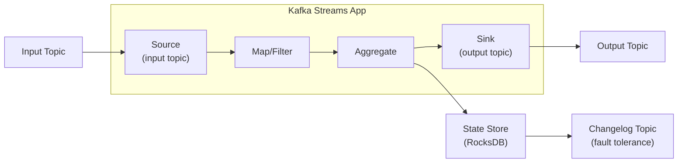

# Kafka Streams

Kafka Streams is a client library for building real-time, stateful stream processing applications on top of Apache Kafka. Unlike Flink or Spark Streaming, it runs as a standard JVM application — no separate cluster infrastructure needed. Your stream processing logic deploys as a regular microservice, scales by adding instances, and uses Kafka itself for fault tolerance.

This matters because it eliminates an entire category of operational complexity. You do not need to manage a Flink cluster, deal with YARN, or debug a Spark driver. Your stream processor is just another service in your Kubernetes cluster.

**Related**: [Kafka Internals](/system-design/message-queues/kafka-internals) | [Exactly-Once Semantics](/system-design/message-queues/exactly-once-semantics) | [Backpressure Patterns](/system-design/message-queues/backpressure-patterns)

---

## Architecture Overview

A Kafka Streams application reads from input topics, processes records through a directed acyclic graph (DAG) called a **topology**, and writes results to output topics.



### Key Concepts

| Concept | Description |
|---------|-------------|
| **Topology** | DAG of stream processors (source, processor, sink nodes) |
| **Stream Task** | Unit of parallelism — one per input partition |
| **State Store** | Local key-value store (RocksDB) for stateful operations |
| **Changelog Topic** | Kafka topic backing a state store for fault tolerance |
| **Repartition Topic** | Internal topic created when key changes require repartitioning |
| **Standby Replicas** | Hot replicas of state stores on other instances for fast failover |

### Parallelism Model

Kafka Streams creates one **stream task** per input topic partition. If your input topic has 12 partitions and you run 4 application instances, each instance gets 3 tasks. Scaling is as simple as adding more instances (up to the number of partitions).

```
Input Topic: 12 partitions
Instance 1: Tasks 0-2  (partitions 0, 1, 2)
Instance 2: Tasks 3-5  (partitions 3, 4, 5)
Instance 3: Tasks 6-8  (partitions 6, 7, 8)
Instance 4: Tasks 9-11 (partitions 9, 10, 11)
```

---

## KStream vs KTable

This is the most important distinction in Kafka Streams. Get it wrong and your processing semantics will be incorrect.

| | KStream | KTable |
|-|---------|--------|
| **Represents** | Unbounded stream of events | Latest value per key (changelog) |
| **Interpretation** | Each record is an independent event | Each record is an upsert (insert or update) |
| **Analogy** | Append-only log | Materialized view / database table |
| **Duplicates** | All records preserved | Later record for same key replaces earlier |
| **Use case** | Click events, transactions, logs | User profiles, inventory counts, config |

### KStream Example

```java
StreamsBuilder builder = new StreamsBuilder();

// Read as stream — every record is an event
KStream<String, String> clicks = builder.stream("click-events");

// Each click is counted, even if same user clicks twice
clicks
    .filter((key, value) -> value.contains("purchase"))
    .mapValues(value -> parseAmount(value))
    .to("purchase-events");
```

### KTable Example

```java
// Read as table — latest value per key wins
KTable<String, String> userProfiles = builder.table("user-profiles");

// If user "alice" updates profile 3 times, KTable holds only the latest
userProfiles
    .filter((userId, profile) -> profile.contains("premium"))
    .toStream()
    .to("premium-users");
```

### GlobalKTable

A `GlobalKTable` is fully replicated on every instance. Use it for small reference data (country codes, config) that needs to be available for joins on every instance without repartitioning.

```java
GlobalKTable<String, String> countries = builder.globalTable("country-codes");

// Join stream with global table — no repartitioning needed
KStream<String, String> enriched = orders.join(
    countries,
    (orderId, order) -> extractCountryCode(order),  // key extractor
    (order, country) -> order + " | " + country      // value joiner
);
```

---

## Joins

### Join Types

| Join | KStream-KStream | KStream-KTable | KTable-KTable |
|------|----------------|----------------|---------------|
| **Inner** | Yes (windowed) | Yes | Yes |
| **Left** | Yes (windowed) | Yes | Yes |
| **Outer** | Yes (windowed) | No | Yes |
| **Requires co-partitioning** | Yes | Yes | Yes |

::: warning
Co-partitioning means both topics must have the same number of partitions and use the same partitioning strategy. If they do not match, Kafka Streams will throw a `TopologyException` at startup.
:::

### KStream-KStream Join (Windowed)

Stream-stream joins require a time window because you cannot join infinite streams without bounding which records can match.

```java
KStream<String, Order> orders = builder.stream("orders");
KStream<String, Payment> payments = builder.stream("payments");

// Join orders with payments within a 5-minute window
KStream<String, String> joined = orders.join(
    payments,
    (order, payment) -> order.id() + " paid: " + payment.amount(),
    JoinWindows.ofTimeDifferenceWithNoGrace(Duration.ofMinutes(5)),
    StreamJoined.with(Serdes.String(), orderSerde, paymentSerde)
);
```

### KStream-KTable Join

This is the most common join pattern: enrich an event stream with the latest reference data.

```java
KStream<String, Order> orders = builder.stream("orders");
KTable<String, Customer> customers = builder.table("customers");

// Enrich each order with customer data (latest customer state)
KStream<String, EnrichedOrder> enriched = orders.join(
    customers,
    (order, customer) -> new EnrichedOrder(order, customer)
);
```

---

## Windowing

Windows group records by time for aggregation.

### Window Types

| Window Type | Description | Use Case |
|-------------|-------------|----------|
| **Tumbling** | Fixed-size, non-overlapping | Hourly metrics, daily counts |
| **Hopping** | Fixed-size, overlapping | Moving averages |
| **Sliding** | Fixed-size, event-triggered | "Events in last 5 min" |
| **Session** | Dynamic size, gap-based | User sessions |

### Tumbling Window

```java
KStream<String, PageView> views = builder.stream("page-views");

KTable<Windowed<String>, Long> hourlyCounts = views
    .groupByKey()
    .windowedBy(TimeWindows.ofSizeWithNoGrace(Duration.ofHours(1)))
    .count(Materialized.as("hourly-page-views"));

// Output: key = [userId]@[windowStart/windowEnd], value = count
```

### Session Window

```java
KTable<Windowed<String>, Long> sessions = clicks
    .groupByKey()
    .windowedBy(SessionWindows.ofInactivityGapWithNoGrace(Duration.ofMinutes(30)))
    .count(Materialized.as("user-sessions"));

// A new session starts when a user is inactive for 30+ minutes
```

### Hopping Window

```java
// 1-hour window, advancing every 5 minutes = overlapping windows
KTable<Windowed<String>, Long> movingCount = events
    .groupByKey()
    .windowedBy(TimeWindows.ofSizeAndGrace(
        Duration.ofHours(1),
        Duration.ofMinutes(5)
    ).advanceBy(Duration.ofMinutes(5)))
    .count();
```

---

## Exactly-Once Processing

Kafka Streams supports exactly-once semantics (EOS) end-to-end: read from input topic, process, update state store, and write to output topic — all atomically.

```java
Properties props = new Properties();
props.put(StreamsConfig.PROCESSING_GUARANTEE_CONFIG,
          StreamsConfig.EXACTLY_ONCE_V2);  // Requires Kafka 2.5+
```

Under the hood, EOS uses:
1. **Transactional producers** — output records and consumer offset commits are written atomically
2. **Read-committed isolation** — downstream consumers only see committed records
3. **Idempotent producers** — retries do not create duplicates

::: tip
Always use `EXACTLY_ONCE_V2` (not the older `EXACTLY_ONCE`). V2 uses fewer transactions and is significantly more efficient. It requires all brokers to be on Kafka 2.5+.
:::

---

## State Stores

State stores are local key-value databases (default: RocksDB) used by stateful operations like `count()`, `aggregate()`, and `reduce()`.

### How Fault Tolerance Works

1. Every state store has a **changelog topic** in Kafka
2. Every state mutation is written to the changelog
3. If an instance crashes, a new instance rebuilds state by replaying the changelog
4. **Standby replicas** keep warm copies to speed up failover

```java
// Configure standby replicas
props.put(StreamsConfig.NUM_STANDBY_REPLICAS_CONFIG, 1);
```

### Custom State Store Operations

```java
// Access state store in a Processor
public class EnrichmentProcessor implements Processor<String, Order, String, EnrichedOrder> {
    private KeyValueStore<String, Customer> customerStore;

    @Override
    public void init(ProcessorContext<String, EnrichedOrder> context) {
        customerStore = context.getStateStore("customer-store");
    }

    @Override
    public void process(Record<String, Order> record) {
        Customer customer = customerStore.get(record.key());
        if (customer != null) {
            context().forward(new Record<>(
                record.key(),
                new EnrichedOrder(record.value(), customer),
                record.timestamp()
            ));
        }
    }
}
```

---

## Interactive Queries

Interactive queries let you query state stores directly via an API — turning your stream processor into a queryable service.

```java
// Query local state store
ReadOnlyKeyValueStore<String, Long> store =
    streams.store(
        StoreQueryParameters.fromNameAndType(
            "word-counts",
            QueryableStoreTypes.keyValueStore()
        )
    );

// Get value for a key
Long count = store.get("hello");

// Iterate all entries
try (KeyValueIterator<String, Long> iter = store.all()) {
    while (iter.hasNext()) {
        KeyValue<String, Long> entry = iter.next();
        System.out.println(entry.key + " = " + entry.value);
    }
}

// Range query
try (KeyValueIterator<String, Long> iter = store.range("a", "z")) {
    // iterate results in key order
}
```

### Distributed Queries

State is partitioned across instances. To query across all instances, you need to know which instance holds which key:

```java
// Find which instance holds a key
KeyQueryMetadata metadata = streams.queryMetadataForKey(
    "word-counts", "hello", Serdes.String().serializer()
);

if (metadata.activeHost().equals(thisHost)) {
    // Query locally
    return store.get("hello");
} else {
    // Forward to the correct instance via HTTP/gRPC
    return httpClient.get(metadata.activeHost(), "/api/counts/hello");
}
```

---

## Error Handling

### Deserialization Errors

```java
// Log and skip bad records instead of crashing
props.put(
    StreamsConfig.DEFAULT_DESERIALIZATION_EXCEPTION_HANDLER_CLASS_CONFIG,
    LogAndContinueExceptionHandler.class
);

// Or send to dead letter queue (custom handler)
public class DlqDeserializationHandler implements DeserializationExceptionHandler {
    @Override
    public DeserializationHandlerResponse handle(ProcessorContext context,
            ConsumerRecord<byte[], byte[]> record, Exception exception) {
        // Send to DLQ topic
        dlqProducer.send(new ProducerRecord<>("dlq-topic", record.key(), record.value()));
        return DeserializationHandlerResponse.CONTINUE;
    }
}
```

### Production Errors

```java
props.put(
    StreamsConfig.DEFAULT_PRODUCTION_EXCEPTION_HANDLER_CLASS_CONFIG,
    DefaultProductionExceptionHandler.class
);
```

---

## Testing

Kafka Streams provides `TopologyTestDriver` for unit testing without a running Kafka cluster.

```java
@Test
void testWordCount() {
    StreamsBuilder builder = new StreamsBuilder();
    buildTopology(builder);  // your topology

    try (TopologyTestDriver driver = new TopologyTestDriver(builder.build(), props)) {
        TestInputTopic<String, String> input = driver.createInputTopic(
            "input-topic", new StringSerializer(), new StringSerializer()
        );
        TestOutputTopic<String, Long> output = driver.createOutputTopic(
            "output-topic", new StringDeserializer(), new LongDeserializer()
        );

        input.pipeInput("key", "hello world");
        input.pipeInput("key", "hello");

        Map<String, Long> results = output.readKeyValuesToMap();
        assertEquals(2L, results.get("hello"));
        assertEquals(1L, results.get("world"));
    }
}
```

---

## When to Use Kafka Streams vs Alternatives

| Criteria | Kafka Streams | Apache Flink | Spark Streaming |
|----------|---------------|-------------|-----------------|
| Deployment | Library (no cluster) | Dedicated cluster | Dedicated cluster |
| Latency | Low (ms) | Very low (ms) | Higher (micro-batch) |
| State management | RocksDB, changelog topics | RocksDB, savepoints | In-memory/disk |
| Exactly-once | Yes | Yes | Yes |
| Source/Sink | Kafka only | Many connectors | Many connectors |
| SQL support | ksqlDB (separate) | Flink SQL | Spark SQL |
| Best for | Kafka-native microservices | Complex event processing | Batch + stream unified |

::: tip
If your input and output are both Kafka topics, Kafka Streams is almost always the right choice. If you need to read from databases, files, or other systems, consider Kafka Connect + Kafka Streams or Apache Flink.
:::

---

*Last updated: 2026-03-20*
