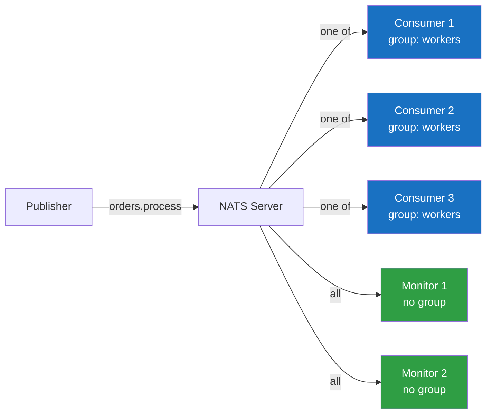

# NATS

NATS is a lightweight, high-performance messaging system designed for cloud-native applications. It was created by Derek Collison (who also built TIBCO EMS) and is a CNCF graduated project. NATS is written in Go and has a reputation for extreme simplicity — the server binary is a single file with zero runtime dependencies, configuration is minimal, and the protocol is text-based and human-readable.

NATS comes in two flavors:

- **Core NATS:** Pure pub/sub with at-most-once delivery. Messages are fire-and-forget — if no subscriber is listening when a message is published, the message is lost. Ultra-fast, ultra-simple.
- **NATS JetStream:** A persistence layer built on top of Core NATS that provides at-least-once and exactly-once delivery, stream replay, key-value stores, and object stores. JetStream is NATS's answer to Kafka, though with a different philosophy.

## Core NATS

### Publish/Subscribe

The simplest messaging pattern. A publisher sends a message to a **subject** (like a topic). All subscribers listening on that subject receive the message. If no subscriber is listening, the message is silently dropped.

Subjects are dot-delimited hierarchical strings: `orders.created`, `orders.us.created`, `payments.processed`. Subscribers can use wildcards:

- `*` matches exactly one token: `orders.*.created` matches `orders.us.created` and `orders.eu.created` but not `orders.created`
- `>` matches one or more tokens: `orders.>` matches `orders.created`, `orders.us.created`, `orders.us.west.created`

```typescript
import { connect, StringCodec, NatsConnection } from 'nats';

const sc = StringCodec();

async function pubSubExample(): Promise<void> {
  const nc: NatsConnection = await connect({ servers: 'nats://localhost:4222' });

  // Subscriber 1: all order events
  const sub1 = nc.subscribe('orders.>');
  (async () => {
    for await (const msg of sub1) {
      console.log(`[orders.>] ${msg.subject}: ${sc.decode(msg.data)}`);
    }
  })();

  // Subscriber 2: only US order creation
  const sub2 = nc.subscribe('orders.us.created');
  (async () => {
    for await (const msg of sub2) {
      console.log(`[orders.us.created]: ${sc.decode(msg.data)}`);
    }
  })();

  // Publisher
  nc.publish('orders.us.created', sc.encode(JSON.stringify({
    orderId: 'ord-123',
    region: 'us',
    amount: 99.99,
  })));

  // Both subscribers receive this message

  nc.publish('orders.eu.shipped', sc.encode(JSON.stringify({
    orderId: 'ord-456',
    region: 'eu',
  })));

  // Only sub1 receives this (sub2 doesn't match 'orders.eu.shipped')

  await nc.drain(); // Graceful shutdown
}
```

### Request/Reply

NATS has built-in request/reply semantics. The requester publishes a message with a unique reply-to subject and waits for a response. The responder subscribes to the subject, processes the request, and publishes the response to the reply-to subject.

This is essentially synchronous RPC over a message bus. It's useful for service-to-service communication where you want the decoupling benefits of a message bus but need a response.

```typescript
import { connect, StringCodec } from 'nats';

const sc = StringCodec();

async function requestReplyExample(): Promise<void> {
  const nc = await connect({ servers: 'nats://localhost:4222' });

  // Service: responds to user lookup requests
  const sub = nc.subscribe('users.lookup');
  (async () => {
    for await (const msg of sub) {
      const request = JSON.parse(sc.decode(msg.data));
      console.log(`Looking up user: ${request.userId}`);

      // Simulate database lookup
      const user = { userId: request.userId, name: 'John Doe', email: 'john@example.com' };

      // Respond on the reply subject
      msg.respond(sc.encode(JSON.stringify(user)));
    }
  })();

  // Client: sends a request and waits for a response
  try {
    const response = await nc.request(
      'users.lookup',
      sc.encode(JSON.stringify({ userId: 'user-123' })),
      { timeout: 5000 }, // 5 second timeout
    );

    const user = JSON.parse(sc.decode(response.data));
    console.log(`Found user: ${user.name}`);
  } catch (error) {
    console.error('Request failed or timed out:', error);
  }

  await nc.drain();
}
```

### Queue Groups

Queue groups provide load balancing across multiple subscribers. When multiple subscribers join the same queue group, each message is delivered to exactly one subscriber in the group (random selection). This is conceptually similar to Kafka consumer groups or RabbitMQ competing consumers.



Each message goes to exactly one consumer in the "workers" queue group AND to every subscriber without a queue group (monitors).

```typescript
async function queueGroupExample(): Promise<void> {
  const nc = await connect({ servers: 'nats://localhost:4222' });

  // Three workers in the same queue group
  // Each message goes to exactly one worker
  for (let i = 1; i <= 3; i++) {
    const sub = nc.subscribe('tasks.process', { queue: 'workers' });
    (async () => {
      for await (const msg of sub) {
        const task = JSON.parse(sc.decode(msg.data));
        console.log(`Worker ${i} processing task: ${task.taskId}`);
      }
    })();
  }

  // Monitor (not in a queue group) — receives ALL messages
  const monitor = nc.subscribe('tasks.process');
  (async () => {
    for await (const msg of monitor) {
      console.log(`Monitor: saw task ${JSON.parse(sc.decode(msg.data)).taskId}`);
    }
  })();

  // Publish 10 tasks — each goes to one worker, all go to the monitor
  for (let i = 0; i < 10; i++) {
    nc.publish('tasks.process', sc.encode(JSON.stringify({ taskId: `task-${i}` })));
  }

  await nc.drain();
}
```

## NATS JetStream

JetStream adds persistence, replay, and delivery guarantees on top of Core NATS. It stores messages in **streams** and delivers them to **consumers**.

### Streams

A stream is a persistent, ordered sequence of messages. Streams capture messages published to one or more subjects and store them according to configurable retention and limits.

```typescript
import { connect, AckPolicy, DeliverPolicy, JetStreamManager } from 'nats';

async function setupJetStream(): Promise<void> {
  const nc = await connect({ servers: 'nats://localhost:4222' });
  const jsm: JetStreamManager = await nc.jetstreamManager();

  // Create a stream that captures all order events
  await jsm.streams.add({
    name: 'ORDERS',
    subjects: ['orders.>'],  // Capture all subjects matching this pattern
    retention: 'limits',     // Keep messages until limits are reached
    max_msgs: -1,            // Unlimited messages
    max_bytes: 1024 * 1024 * 1024, // 1 GB
    max_age: 7 * 24 * 60 * 60 * 1_000_000_000, // 7 days in nanoseconds
    storage: 'file',         // File-based storage (vs 'memory')
    num_replicas: 3,         // Replicate across 3 servers
    duplicate_window: 120_000_000_000, // 2-minute deduplication window (nanoseconds)
    discard: 'old',          // When limits are reached, discard oldest messages
  });

  console.log('Stream ORDERS created');
  await nc.close();
}
```

**Stream retention policies:**

| Policy | Behavior |
|---|---|
| `limits` | Keep messages until `max_msgs`, `max_bytes`, or `max_age` is reached, then discard oldest |
| `interest` | Keep messages only while there are active consumers; delete when all consumers have acknowledged |
| `workqueue` | Delete each message after exactly one consumer acknowledges it (task queue semantics) |

### Consumers

A JetStream consumer is a stateful view of a stream. It tracks which messages have been delivered and acknowledged. Consumers can be **durable** (survive reconnections) or **ephemeral** (deleted when the client disconnects).

```typescript
async function consumeJetStream(): Promise<void> {
  const nc = await connect({ servers: 'nats://localhost:4222' });
  const js = nc.jetstream();
  const jsm = await nc.jetstreamManager();

  // Create a durable pull consumer
  await jsm.consumers.add('ORDERS', {
    durable_name: 'order-processor',
    ack_policy: AckPolicy.Explicit,     // Must explicitly ack each message
    deliver_policy: DeliverPolicy.All,   // Start from the beginning
    max_deliver: 5,                      // Max delivery attempts before giving up
    ack_wait: 30_000_000_000,            // 30 seconds to ack before redelivery (nanoseconds)
    filter_subject: 'orders.*.created',  // Only receive order creation events
  });

  // Pull consumer: application pulls messages on demand
  const consumer = await js.consumers.get('ORDERS', 'order-processor');

  // Fetch messages in batches
  const messages = await consumer.fetch({ max_messages: 10, expires: 5000 });

  for await (const msg of messages) {
    try {
      const order = JSON.parse(msg.string());
      console.log(`Processing order: ${order.orderId}`);

      await processOrder(order);

      msg.ack(); // Acknowledge successful processing
    } catch (error) {
      console.error('Processing failed:', error);
      msg.nak(); // Negative ack — will be redelivered
    }
  }

  // Or use an iterator for continuous processing
  const iter = await consumer.consume({ max_messages: 100 });

  for await (const msg of iter) {
    try {
      const data = JSON.parse(msg.string());
      await processOrder(data);
      msg.ack();
    } catch (error) {
      // nak with a delay — redelivery after 5 seconds
      msg.nak(5000);
    }
  }

  await nc.drain();
}
```

### Exactly-Once Delivery

JetStream supports exactly-once publishing through message deduplication. The publisher sets a `Nats-Msg-Id` header, and JetStream deduplicates messages within the stream's `duplicate_window`.

```typescript
async function exactlyOncePublish(): Promise<void> {
  const nc = await connect({ servers: 'nats://localhost:4222' });
  const js = nc.jetstream();

  // Publish with deduplication ID
  const ack = await js.publish('orders.us.created', sc.encode(JSON.stringify({
    orderId: 'ord-123',
    amount: 99.99,
  })), {
    msgID: 'ord-123-created', // Deduplication key
    expect: {
      streamName: 'ORDERS', // Verify the message goes to the expected stream
    },
  });

  console.log(`Published to stream ${ack.stream}, sequence ${ack.seq}`);

  // If we publish again with the same msgID within the duplicate window,
  // the message is silently deduplicated
  const ack2 = await js.publish('orders.us.created', sc.encode(JSON.stringify({
    orderId: 'ord-123',
    amount: 99.99,
  })), {
    msgID: 'ord-123-created', // Same ID — will be deduplicated
  });

  console.log(`Duplicate: ${ack2.duplicate}`); // true

  await nc.close();
}
```

### Key-Value Store

JetStream includes a distributed key-value store built on top of streams. It's like a distributed `Map<string, Uint8Array>` with change notifications.

```typescript
async function keyValueExample(): Promise<void> {
  const nc = await connect({ servers: 'nats://localhost:4222' });
  const js = nc.jetstream();

  // Create a key-value bucket
  const kv = await js.views.kv('user-sessions', {
    history: 5,        // Keep last 5 values per key
    ttl: 3600_000,     // Keys expire after 1 hour (milliseconds)
    max_bytes: 1024 * 1024 * 100, // 100 MB max
    replicas: 3,       // Replicate across 3 nodes
  });

  // Put a value
  await kv.put('user-123', sc.encode(JSON.stringify({
    userId: 'user-123',
    lastActive: Date.now(),
    role: 'admin',
  })));

  // Get a value
  const entry = await kv.get('user-123');
  if (entry) {
    const session = JSON.parse(sc.decode(entry.value));
    console.log(`User ${session.userId}, role: ${session.role}`);
  }

  // Watch for changes
  const watch = await kv.watch({ key: 'user-*' }); // Wildcard
  (async () => {
    for await (const entry of watch) {
      console.log(`Key ${entry.key} changed: operation=${entry.operation}`);
    }
  })();

  // Delete a key
  await kv.delete('user-123');

  // List keys
  const keys = await kv.keys();
  for await (const key of keys) {
    console.log(`Key: ${key}`);
  }

  await nc.close();
}
```

### Object Store

JetStream's object store handles large binary objects (files, images, videos) that don't fit in a single NATS message (1 MB default limit). It chunks objects and stores them as a series of messages.

```typescript
async function objectStoreExample(): Promise<void> {
  const nc = await connect({ servers: 'nats://localhost:4222' });
  const js = nc.jetstream();

  const os = await js.views.os('artifacts', {
    max_bytes: 1024 * 1024 * 1024 * 10, // 10 GB
    replicas: 3,
  });

  // Store an object
  const data = Buffer.from('large file contents...');
  await os.put({ name: 'build-artifact-v1.2.3.tar.gz' }, readableStreamFrom(data));

  // Retrieve an object
  const result = await os.get('build-artifact-v1.2.3.tar.gz');
  if (result) {
    const chunks: Uint8Array[] = [];
    for await (const chunk of result.data) {
      chunks.push(chunk);
    }
    const content = Buffer.concat(chunks);
    console.log(`Retrieved ${content.length} bytes`);
  }

  // List objects
  const list = await os.list();
  for await (const info of list) {
    console.log(`${info.name}: ${info.size} bytes, ${info.chunks} chunks`);
  }

  // Delete an object
  await os.delete('build-artifact-v1.2.3.tar.gz');

  await nc.close();
}
```

## Comparison with Kafka

| Dimension | NATS (Core + JetStream) | Apache Kafka |
|---|---|---|
| **Philosophy** | Simple, fast, cloud-native | Enterprise-grade, ecosystem-rich |
| **Binary size** | ~20 MB single binary | Requires JVM, ZooKeeper/KRaft |
| **Startup time** | Sub-second | 10+ seconds |
| **Protocol** | Text-based (human-readable) | Binary (efficient) |
| **Core pub/sub** | At-most-once, fire-and-forget | N/A (always persistent) |
| **Persistent messaging** | JetStream (built on Core NATS) | Native |
| **Throughput** | ~15M msg/sec (core), ~1M msg/sec (JetStream) | ~2M msg/sec per broker |
| **Latency** | Sub-millisecond (core), single-digit ms (JetStream) | Single-digit ms |
| **Consumer groups** | Queue groups (core), consumers (JetStream) | Consumer groups |
| **Exactly-once** | Publisher dedup + consumer ack | Idempotent producer + transactions |
| **Stream processing** | Not built-in | Kafka Streams |
| **Schema management** | Not built-in | Schema Registry |
| **Connectors** | Limited | Kafka Connect (hundreds of connectors) |
| **Multi-tenancy** | Accounts and users | Limited (topic-level ACLs) |
| **Operational complexity** | Very low | High |
| **Key-value store** | Built-in (JetStream KV) | Requires external store or KTable |
| **Object store** | Built-in (JetStream Object Store) | Not built-in |
| **Wildcard subscriptions** | Yes (`*` and `>`) | No (exact topic names only) |

## When NATS Is the Better Choice

**Choose NATS when:**

- You need a simple, lightweight messaging solution with minimal operational overhead
- Your team is small and doesn't want to manage a Kafka cluster
- You need both fire-and-forget pub/sub (Core NATS) and persistent streaming (JetStream) in the same system
- You want wildcard subscriptions for dynamic, hierarchical event routing
- You need built-in request/reply for RPC-style communication
- You need a distributed key-value store without adding another infrastructure component
- You're building microservices on Kubernetes and want something that deploys as a simple StatefulSet
- Your throughput needs are moderate (under 1 million persistent messages/sec)

**Choose Kafka instead when:**

- You need millions of persistent messages per second
- You need a rich connector ecosystem (Kafka Connect)
- You need built-in stream processing (Kafka Streams)
- You need schema management (Schema Registry)
- You need exactly-once processing across multiple topics (Kafka transactions)
- You need compacted topics for changelog-based state management

## Deployment and Clustering

### Single Server

```bash
# Download and run
nats-server

# With JetStream enabled
nats-server --jetstream --store_dir /data/nats

# With configuration file
nats-server -c nats.conf
```

### Cluster Configuration

NATS clusters use a full-mesh topology. Every server connects to every other server.

```hcl
# nats.conf for a 3-node cluster
server_name: nats-1
listen: 0.0.0.0:4222

jetstream {
  store_dir: /data/nats
  max_mem: 1G
  max_file: 10G
}

cluster {
  name: nats-cluster
  listen: 0.0.0.0:6222

  routes: [
    nats-route://nats-2:6222
    nats-route://nats-3:6222
  ]
}
```

### Super-Cluster (Multi-Region)

NATS supports **gateway** connections between clusters for multi-region deployments. Each cluster is autonomous but can route messages to other clusters.

```hcl
# Gateway configuration for cross-region routing
gateway {
  name: us-east
  listen: 0.0.0.0:7222

  gateways: [
    { name: eu-west, url: nats-route://eu-nats-1:7222 }
    { name: ap-south, url: nats-route://ap-nats-1:7222 }
  ]
}
```

Messages published in one region are automatically available to subscribers in other regions, with interest-based routing (messages are only forwarded if there are subscribers in the remote cluster).

### Leaf Nodes

Leaf nodes are NATS servers that connect to a cluster as a client rather than a full cluster member. They're useful for:

- Edge computing (IoT devices, mobile backends)
- Multi-tenant isolation (each tenant gets their own leaf node)
- Extending a cluster without full-mesh overhead

```hcl
# Leaf node configuration
leafnodes {
  remotes: [
    { url: nats-leaf://central-cluster:7422 }
  ]
}
```

### Kubernetes Deployment

NATS provides a Helm chart for Kubernetes deployment:

```bash
helm repo add nats https://nats-io.github.io/k8s/helm/charts/
helm install nats nats/nats --set config.jetstream.enabled=true
```

The NATS Kubernetes operator manages cluster lifecycle, rolling upgrades, and JetStream configuration.

## Security

NATS supports multiple authentication and authorization mechanisms:

- **Token-based auth:** Simple shared secret
- **Username/password:** Basic credentials
- **NKey:** Ed25519 public key authentication (no shared secrets)
- **JWT/Decentralized auth:** Operator/account/user JWT hierarchy. Accounts provide multi-tenancy isolation — subjects are scoped to accounts, and accounts can't see each other's messages unless explicitly connected via imports/exports.
- **TLS:** Encrypted connections with mutual TLS support

```hcl
# Authorization configuration
authorization {
  users: [
    { user: order-service, password: $2a$11$..., permissions: {
      publish: ["orders.>"]
      subscribe: ["orders.>", "inventory.>"]
    }}
    { user: analytics, password: $2a$11$..., permissions: {
      publish: []
      subscribe: ["orders.>", "payments.>"]
    }}
  ]
}
```

## Performance Characteristics

- **Core NATS publish/subscribe:** 15+ million messages per second on a single server
- **JetStream persistent publish:** 500K-1M messages per second per server (depends on storage, replication)
- **Latency (core):** Sub-100 microseconds for pub/sub
- **Latency (JetStream):** 1-5 milliseconds for persistent messages
- **Message size limit:** 1 MB by default (configurable up to 64 MB with `max_payload`)
- **Connection overhead:** ~2 KB per connection
- **Memory footprint:** ~50 MB for a server handling 100K connections

NATS's performance comes from its simplicity: no complex routing logic, no message transformation, no heavy metadata tracking in the core protocol. JetStream adds overhead for persistence but is still fast compared to Kafka for moderate workloads.
