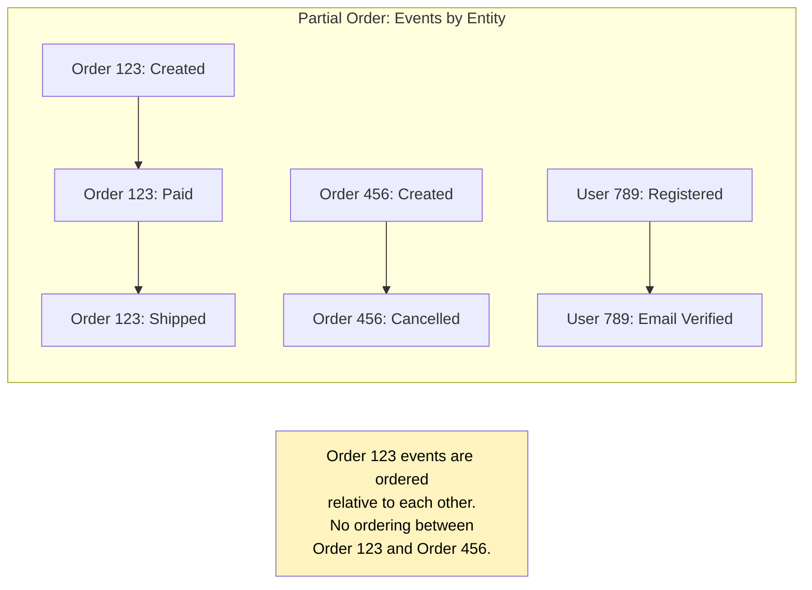
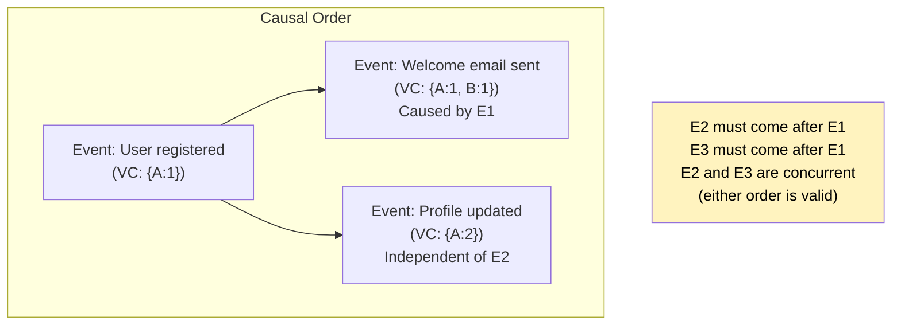
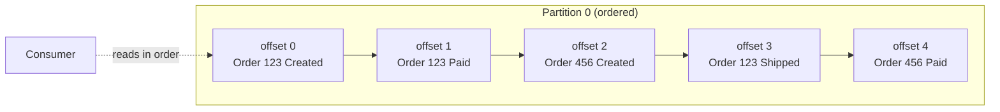
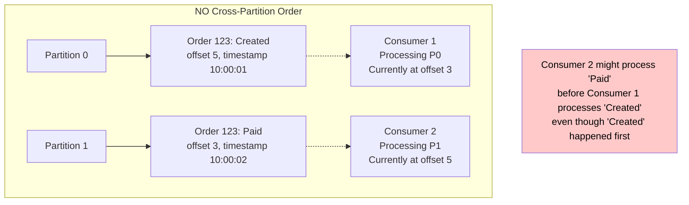
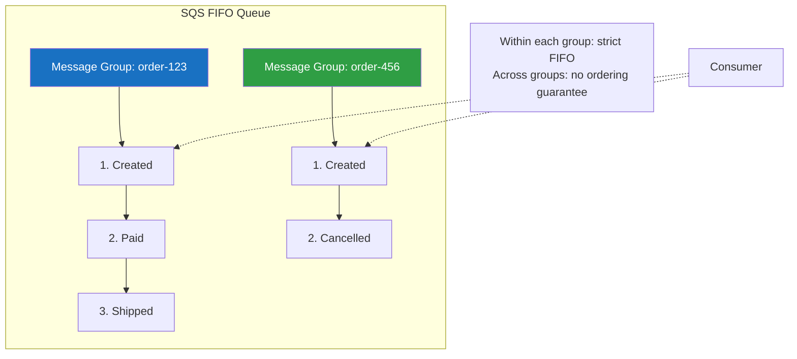
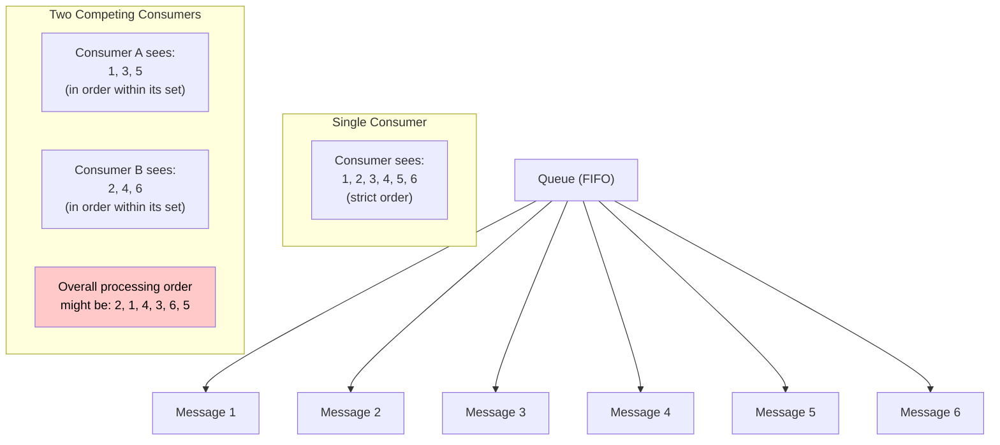
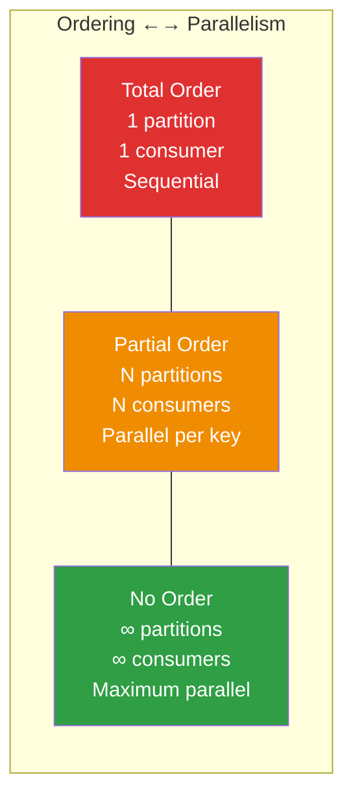

# Ordering Guarantees

Message ordering is one of the most subtle and misunderstood aspects of distributed messaging. Most developers assume messages are delivered in order — they're not. Most systems that claim "ordered delivery" provide it only under specific conditions that are easy to violate. Understanding exactly what ordering guarantees your system provides, and what it costs to maintain them, is the difference between a correct system and one that silently processes events in the wrong sequence.

## The Three Types of Ordering

### Total Order

Every consumer sees every message in the exact same order. There is a single, global sequence of events that all participants agree on.

**Formally:** Given messages m1, m2, ..., mn, a total order relation <= satisfies:
- **Totality:** For all mi, mj: either mi <= mj or mj <= mi
- **Antisymmetry:** If mi <= mj and mj <= mi, then mi = mj
- **Transitivity:** If mi <= mj and mj <= mk, then mi <= mk

Total order is the strongest guarantee. In a distributed system, achieving total order requires consensus (e.g., a single leader that assigns sequence numbers to all messages). A single Kafka partition provides total order. A single-threaded RabbitMQ consumer on a single queue provides total order. A distributed system with multiple partitions, queues, or consumers does not provide total order across the entire system.

**Cost:** Total order limits throughput to what a single sequencer can handle. You cannot parallelize without breaking total order.

### Partial Order

Some pairs of messages have a defined order, but not all pairs. Messages are ordered within groups (partitions, message groups, entity keys) but not across groups.

**Formally:** A partial order relation <= satisfies antisymmetry and transitivity but not totality. There exist pairs (mi, mj) where neither mi <= mj nor mj <= mi — these messages are **concurrent** (their order is undefined).



Partial order is the default guarantee in Kafka (per-partition ordering), SQS FIFO (per-message-group ordering), and most distributed messaging systems. It provides ordering where it matters (within an entity) while allowing parallelism across entities.

### Causal Order

Messages are ordered according to their causal relationship. If message A caused message B (e.g., A is a request and B is its response, or B was produced after consuming A), then A must be delivered before B. Messages with no causal relationship can be delivered in any order.

**Formally:** The causal order relation uses Lamport's happens-before relation (→):
- If a and b are events in the same process and a occurs before b, then a → b
- If a is the sending of a message and b is the receipt of that message, then a → b
- If a → b and b → c, then a → c (transitivity)

Causal order is stronger than partial order (it orders causally related messages across partitions) but weaker than total order (it doesn't order concurrent messages).

**Implementation:** Causal ordering requires tracking causality through vector clocks, version vectors, or explicit dependency tracking. Few message queue systems provide causal ordering out of the box — it's typically implemented at the application level.



## Mathematical Formalization

### Order Relations

Let M = {m1, m2, ..., mn} be a set of messages. An ordering relation R on M can be characterized by which of the following properties it satisfies:

| Property | Definition | Total | Partial | Causal |
|---|---|---|---|---|
| **Reflexivity** | mi R mi for all mi | Yes | Yes | Yes |
| **Antisymmetry** | mi R mj and mj R mi implies mi = mj | Yes | Yes | Yes |
| **Transitivity** | mi R mj and mj R mk implies mi R mk | Yes | Yes | Yes |
| **Totality** | mi R mj or mj R mi for all mi, mj | Yes | No | No |

### Throughput-Ordering Trade-off

Let:
- T = total throughput (messages/second)
- P = number of partitions (or ordered groups)
- Tp = throughput per partition
- C = number of consumers

Then:
- With total order: T = Tp (single partition, single consumer)
- With partial order: T = min(P * Tp, C * Tc) where Tc is consumer throughput
- Maximum parallelism: C ≤ P (consumers cannot exceed partitions in Kafka)

The fundamental trade-off: **stronger ordering guarantees reduce maximum throughput.** Total order constrains you to sequential processing. Partial order allows parallelism proportional to the number of ordered groups.

### The Ordering-Parallelism Duality

For a given message stream with N messages per second and K distinct ordering keys:
- If K = 1 (all messages must be totally ordered): max parallelism = 1
- If K = N (every message is independent): max parallelism = N
- If K is somewhere in between: max parallelism = K

This is why key design is so important — the choice of ordering key directly determines the maximum parallelism of your system.

## Partition-Level Ordering in Kafka

Kafka guarantees ordering within a single partition. Messages written to partition P are read by consumers in the exact order they were written. This is an absolute guarantee — it never fails, as long as:

1. A single producer writes to the partition (or the producer has idempotent/transactional writes enabled)
2. The consumer reads from the partition sequentially

### How Partition Ordering Works

Each partition is an append-only log. Messages are assigned monotonically increasing offsets. The consumer reads messages by offset, from low to high. This is a simple, elegant mechanism that provides ordering without distributed consensus.



### Cross-Partition Ordering is Not Guaranteed

If Order 123's "Created" event goes to partition 0 and "Paid" event goes to partition 1, there is no guarantee about which is consumed first. Different consumers process different partitions at different speeds.



**Solution:** Use the same partition key for all events related to an entity. If all Order 123 events use `key = "order-123"`, they all go to the same partition and are processed in order.

### Producer-Side Ordering Risks

Even with partition keys, ordering can break if:

1. **Multiple producers without idempotence:** Two producer instances write to the same partition. Due to network timing, their messages can interleave in unexpected ways. **Fix:** Use idempotent producer (`enable.idempotence = true`).

2. **Producer retries without idempotence:** A message fails, the producer retries, but a subsequent message has already been sent and acknowledged. With `max.in.flight.requests.per.connection > 1`, the retry may arrive after the next message. **Fix:** Idempotent producer handles this, or set `max.in.flight.requests.per.connection = 1`.

3. **Partition count change:** Adding partitions changes the key-to-partition mapping. `hash("order-123") % 6` might be partition 2, but `hash("order-123") % 12` might be partition 8. After the change, new events for order 123 go to a different partition than old events. **Fix:** Don't change partition count for topics where ordering matters, or use a custom partitioner that handles migration.

## FIFO Queues in SQS

SQS FIFO queues provide ordering per **Message Group ID**. All messages with the same Message Group ID are delivered in the order they were sent. Messages with different Message Group IDs can be interleaved.



**Key difference from Kafka:** In Kafka, the number of partitions limits the number of parallel consumers. In SQS FIFO, the number of message groups limits parallelism, but message groups are dynamic — you don't pre-allocate them.

**Limitation:** SQS FIFO throughput is capped at 300 messages/second per API call (3,000 with batching, higher with high-throughput mode). If you need higher throughput with ordering, use Kafka.

### SQS FIFO Ordering Semantics

Within a Message Group:
- Messages are delivered exactly once (within the 5-minute deduplication window)
- Messages are delivered in order
- A message is not delivered until the previous message in the group is either acknowledged (deleted) or its visibility timeout expires

This means a slow or stuck message in a group blocks all subsequent messages in that group. This is the fundamental trade-off of ordered queues: ordering implies sequential processing.

## Message Ordering in RabbitMQ

RabbitMQ guarantees ordering per queue, per consumer:

- Messages published to a queue are stored in FIFO order
- A single consumer receiving from a queue sees messages in FIFO order
- **But:** With multiple consumers (competing consumers pattern), each consumer sees its own subset in order, but the overall processing order is non-deterministic



### Ordering breaks with

- **Multiple consumers:** As shown above
- **Message priorities:** Higher-priority messages jump the queue
- **Redelivery after nack:** A nacked message goes back to the head of the queue, potentially before messages that were originally behind it
- **Dead letter exchange round-trip:** A message dead-lettered and re-queued has lost its position

### Maintaining order in RabbitMQ

If you need strict ordering for a subset of messages:
- Use a dedicated queue per ordering key (e.g., one queue per customer)
- Use a single consumer per queue
- Accept the throughput limitation

Alternatively, use the **Consistent Hash Exchange** plugin to route messages with the same key to the same queue, similar to Kafka's partition key mechanism.

## The Trade-Off: Ordering vs Parallelism

This is the fundamental tension in messaging system design. You can have strong ordering guarantees or high parallelism, but not both.

### The Spectrum



### Quantifying the Trade-Off

Given:
- R = total message rate (messages/sec)
- K = number of distinct ordering keys
- Tp = throughput per sequential processor
- Desired properties: ordering within each key, maximum parallelism

Maximum throughput:
```
T_max = min(K, R / Tp) × Tp
```

If your system produces 100,000 messages/sec with 10,000 distinct ordering keys and each consumer can process 100 messages/sec:
- Needed consumers: 100,000 / 100 = 1,000
- Available parallelism: min(10,000, 1,000) = 1,000
- Achievable throughput: 1,000 × 100 = 100,000 messages/sec

But if you only have 500 distinct ordering keys:
- Available parallelism: min(500, 1,000) = 500
- Achievable throughput: 500 × 100 = 50,000 messages/sec (half of what you need)

**Solution: Increase key cardinality.** If your ordering key is too coarse (e.g., `country` with 200 values), you can't parallelize enough. Use finer-grained keys (e.g., `customer_id` with millions of values).

## Strategies for Maintaining Order Across Partitions

### 1. Event Key Design

The most important decision. The ordering key should be:

- **Fine-grained enough for parallelism:** Use entity IDs (order ID, user ID) rather than categories (country, product type)
- **Stable:** The same logical entity should always map to the same key. Don't use derived keys that change over time.
- **Aligned with business requirements:** Order events by order ID. User events by user ID. Payment events by payment ID or order ID (depending on whether you need order-level or payment-level ordering).

```typescript
// Good: entity ID as key — high cardinality, natural ordering boundary
const key = order.id; // "ord-abc-123"

// Bad: category as key — low cardinality, hot partitions
const key = order.category; // "electronics" — 5% of all orders

// Bad: composite key that's too broad
const key = order.merchantId; // One merchant might have 50% of orders

// Good: composite key when ordering must span entities
const key = `${order.customerId}:${order.sessionId}`; // Order within a session
```

### 2. Sequence Numbers

Embed a sequence number in each message so consumers can detect and correct out-of-order delivery:

```typescript
interface SequencedMessage<T> {
  sequenceNumber: number;
  entityId: string;
  timestamp: number;
  payload: T;
}

class SequenceTracker {
  private lastSequence: Map<string, number> = new Map();
  private buffer: Map<string, Map<number, SequencedMessage<unknown>>> = new Map();

  processMessage<T>(message: SequencedMessage<T>): ProcessResult<T> {
    const { entityId, sequenceNumber } = message;
    const expectedSequence = (this.lastSequence.get(entityId) ?? 0) + 1;

    if (sequenceNumber === expectedSequence) {
      // In order — process it
      this.lastSequence.set(entityId, sequenceNumber);

      // Check if we have buffered subsequent messages
      const buffered = this.buffer.get(entityId);
      const toProcess: SequencedMessage<T>[] = [message];

      if (buffered) {
        let next = expectedSequence + 1;
        while (buffered.has(next)) {
          toProcess.push(buffered.get(next)! as SequencedMessage<T>);
          buffered.delete(next);
          this.lastSequence.set(entityId, next);
          next++;
        }
        if (buffered.size === 0) {
          this.buffer.delete(entityId);
        }
      }

      return { status: 'process', messages: toProcess };
    }

    if (sequenceNumber < expectedSequence) {
      // Duplicate or old message — skip
      return { status: 'skip', messages: [] };
    }

    // Out of order — buffer for later
    if (!this.buffer.has(entityId)) {
      this.buffer.set(entityId, new Map());
    }
    this.buffer.get(entityId)!.set(sequenceNumber, message);

    return { status: 'buffered', messages: [] };
  }
}

interface ProcessResult<T> {
  status: 'process' | 'skip' | 'buffered';
  messages: SequencedMessage<T>[];
}
```

### 3. Timestamp-Based Reordering

When messages arrive out of order, buffer them briefly and emit in timestamp order:

```typescript
class TimestampReorderBuffer<T> {
  private buffer: Array<{ timestamp: number; message: T }> = [];
  private watermark = 0;

  constructor(
    private maxDelayMs: number,    // How long to wait for late messages
    private maxBufferSize: number,  // Maximum messages to buffer
  ) {}

  add(timestamp: number, message: T): T[] {
    // Add to buffer
    this.buffer.push({ timestamp, message });
    this.buffer.sort((a, b) => a.timestamp - b.timestamp);

    // Emit messages that are old enough (watermark has passed them)
    const cutoff = Date.now() - this.maxDelayMs;
    const toEmit: T[] = [];

    while (
      this.buffer.length > 0 &&
      (this.buffer[0].timestamp <= cutoff || this.buffer.length > this.maxBufferSize)
    ) {
      const entry = this.buffer.shift()!;
      if (entry.timestamp >= this.watermark) {
        this.watermark = entry.timestamp;
        toEmit.push(entry.message);
      }
      // If timestamp < watermark, it's a late arrival — drop or handle
    }

    return toEmit;
  }

  flush(): T[] {
    const messages = this.buffer
      .sort((a, b) => a.timestamp - b.timestamp)
      .map((entry) => entry.message);
    this.buffer = [];
    return messages;
  }
}
```

### 4. Version Vectors for Causal Order

When you need causal ordering across partitions (e.g., Service A produces event E1, Service B consumes E1 and produces E2, and you need consumers to see E1 before E2 even if they're on different partitions):

```typescript
type VectorClock = Map<string, number>;

class CausalOrderTracker {
  private delivered: VectorClock = new Map();
  private pending: Array<{
    clock: VectorClock;
    message: unknown;
  }> = [];

  canDeliver(clock: VectorClock): boolean {
    // A message can be delivered if all its causal dependencies
    // have already been delivered
    for (const [nodeId, timestamp] of clock) {
      const deliveredTimestamp = this.delivered.get(nodeId) ?? 0;

      // The message's own contribution is +1 from what we've delivered
      // All other entries must be <= what we've delivered
      if (nodeId === this.getSourceNode(clock)) {
        if (timestamp !== deliveredTimestamp + 1) return false;
      } else {
        if (timestamp > deliveredTimestamp) return false;
      }
    }
    return true;
  }

  receive(clock: VectorClock, message: unknown): unknown[] {
    this.pending.push({ clock, message });

    // Try to deliver all messages whose dependencies are satisfied
    const delivered: unknown[] = [];
    let progress = true;

    while (progress) {
      progress = false;
      for (let i = this.pending.length - 1; i >= 0; i--) {
        if (this.canDeliver(this.pending[i].clock)) {
          const item = this.pending.splice(i, 1)[0];
          this.mergeClocks(item.clock);
          delivered.push(item.message);
          progress = true;
        }
      }
    }

    return delivered;
  }

  private mergeClocks(clock: VectorClock): void {
    for (const [nodeId, timestamp] of clock) {
      const current = this.delivered.get(nodeId) ?? 0;
      this.delivered.set(nodeId, Math.max(current, timestamp));
    }
  }

  private getSourceNode(clock: VectorClock): string {
    // The source node is the one with the highest timestamp
    let maxNode = '';
    let maxTimestamp = 0;
    for (const [nodeId, timestamp] of clock) {
      if (timestamp > maxTimestamp) {
        maxTimestamp = timestamp;
        maxNode = nodeId;
      }
    }
    return maxNode;
  }
}
```

## Out-of-Order Handling Patterns

When you can't prevent out-of-order delivery (or choose not to for performance), handle it at the consumer:

### 1. Last-Writer-Wins (LWW)

Each message carries a version or timestamp. The consumer always applies the latest version, regardless of arrival order:

```typescript
class LastWriterWins<T> {
  private state: Map<string, { version: number; data: T }> = new Map();

  apply(entityId: string, version: number, data: T): boolean {
    const current = this.state.get(entityId);

    if (!current || version > current.version) {
      this.state.set(entityId, { version, data });
      return true; // Applied
    }

    return false; // Stale update — ignored
  }
}
```

### 2. Commutative Operations (CRDTs)

Design operations that are commutative — the result is the same regardless of order. Addition is commutative: `a + b = b + a`. Setting a field is not commutative: `set(x, 1); set(x, 2)` differs from `set(x, 2); set(x, 1)`.

```typescript
// Commutative: increment a counter
// Order doesn't matter: +5 then +3 = +3 then +5 = 8
interface IncrementEvent {
  type: 'increment';
  entityId: string;
  amount: number;
}

// Not commutative: set a value
// Order matters: set(10) then set(20) ≠ set(20) then set(10)
interface SetEvent {
  type: 'set';
  entityId: string;
  value: number;
}

// Make non-commutative operations commutative by adding version/timestamp
interface VersionedSetEvent {
  type: 'versioned_set';
  entityId: string;
  value: number;
  version: number; // Higher version wins
}
```

### 3. Event Sourcing with Reordering

Store all events and periodically rebuild state by sorting events by their logical timestamp:

```typescript
class EventSourcedEntity {
  private events: Array<{ sequenceNumber: number; event: DomainEvent }> = [];

  applyEvent(sequenceNumber: number, event: DomainEvent): void {
    this.events.push({ sequenceNumber, event });
    // Sort by sequence number and rebuild state
    this.events.sort((a, b) => a.sequenceNumber - b.sequenceNumber);
  }

  getState(): EntityState {
    const state = new EntityState();
    for (const { event } of this.events) {
      state.apply(event);
    }
    return state;
  }
}
```

### 4. Idempotent Processing with Deduplication

Process each message exactly once regardless of order by tracking processed message IDs:

```typescript
class IdempotentProcessor {
  private processedIds: Set<string> = new Set();

  async process(messageId: string, handler: () => Promise<void>): Promise<boolean> {
    if (this.processedIds.has(messageId)) {
      return false; // Already processed — skip
    }

    await handler();
    this.processedIds.add(messageId);
    return true;
  }
}
```

## Choosing Your Ordering Strategy

| Requirement | Strategy | System |
|---|---|---|
| Total order, all messages | Single partition/queue, single consumer | Kafka (1 partition), RabbitMQ (1 consumer) |
| Order per entity, parallel processing | Partition by entity ID | Kafka (entity key), SQS FIFO (MessageGroupId) |
| Causal order across entities | Vector clocks + reorder buffer | Application-level implementation |
| No ordering needed, max throughput | Any system, max consumers | Kafka (round-robin), SQS Standard, RabbitMQ (competing consumers) |
| Best-effort order with late arrival tolerance | Timestamp-based reorder buffer | Application-level with configurable delay |
| Order-independent processing | Commutative operations / CRDTs | Application-level design |

The right choice depends on your business requirements. Not every system needs strong ordering. A click-tracking analytics pipeline can tolerate out-of-order events — the aggregation is commutative. But an order-processing pipeline where "Created" must come before "Paid" which must come before "Shipped" requires strict per-entity ordering.

Start with the weakest ordering guarantee your business logic can tolerate. Strengthen ordering only where it's genuinely required. Every step toward stronger ordering reduces your system's maximum throughput and increases complexity.
