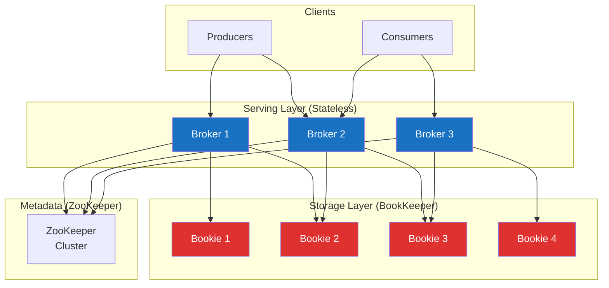
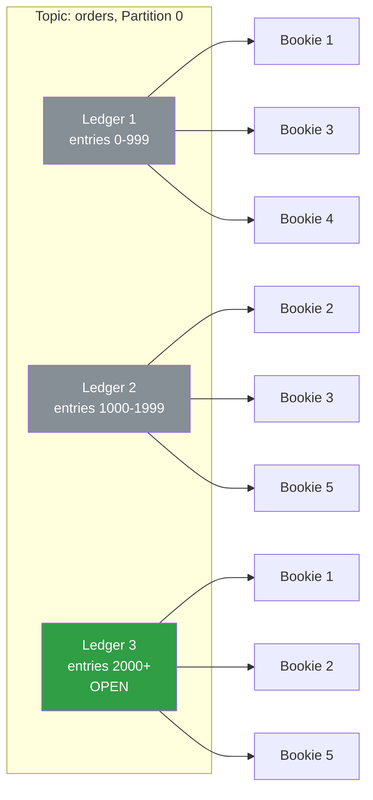
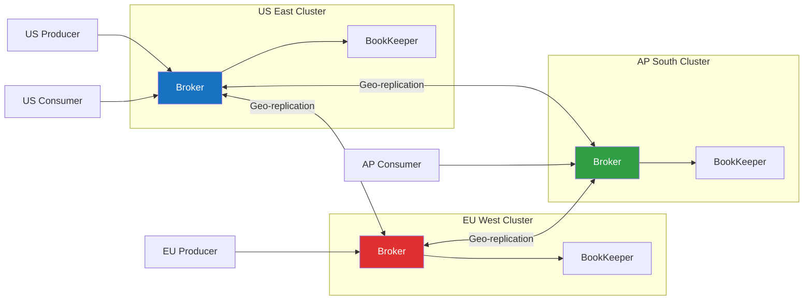

# Apache Pulsar

Apache Pulsar is a distributed messaging and event streaming platform originally developed at Yahoo and donated to the Apache Software Foundation. It was designed to address limitations of Kafka's architecture — particularly around multi-tenancy, geo-replication, and the coupling of compute and storage in Kafka's broker-centric model.

Pulsar's defining architectural decision is the separation of serving (brokers) from storage (Apache BookKeeper). Brokers are stateless — they don't store any data locally. All persistent data lives in BookKeeper, a distributed write-ahead log. This separation has profound implications for operations, scaling, and failure recovery.

## Architecture



### Brokers (Stateless Serving Layer)

Pulsar brokers handle client connections, topic lookups, message routing, and dispatching. They do not store any message data. This means:

- **Adding or removing brokers is fast.** No data rebalancing is needed. A new broker starts serving topics immediately.
- **Broker failure is cheap.** When a broker dies, its topics are reassigned to other brokers within seconds. No data needs to be copied — the new broker reads from BookKeeper.
- **Brokers can be heterogeneous.** You don't need all brokers to have the same disk configuration because they don't use disk for data.

When a producer publishes a message, the broker:

1. Receives the message from the producer
2. Writes it to BookKeeper (across multiple bookies for replication)
3. Sends an acknowledgement to the producer once the write is durable
4. Dispatches the message to active consumers

When a consumer reads, the broker:

1. Checks its read cache (in-memory) for recent messages
2. If not cached, reads from BookKeeper
3. Sends the message to the consumer
4. Tracks the consumer's acknowledgement

### Apache BookKeeper (Storage Layer)

BookKeeper is a distributed write-ahead log service. Each BookKeeper node is called a **bookie**. BookKeeper stores data in **ledgers** — append-only sequences of entries. A Pulsar topic partition is implemented as a chain of BookKeeper ledgers.

**Why BookKeeper?**

- **Append-only:** Writes are sequential, which is fast for both SSDs and HDDs
- **Distributed replication:** Each entry is written to multiple bookies in parallel (quorum write)
- **Fencing:** BookKeeper's fencing protocol prevents split-brain scenarios during leader changes
- **Segment-level replication:** Unlike Kafka where an entire partition is replicated to the same set of brokers, BookKeeper spreads ledger segments across different bookies. This means data from a single topic partition is striped across many bookies, enabling better utilization and faster recovery.



Notice how different ledgers are stored on different sets of bookies. This is a key advantage over Kafka's architecture, where partition replicas live on a fixed set of brokers. In Pulsar/BookKeeper:

- **No hot spots from partition-to-broker assignment.** Data spreads evenly across all bookies.
- **Adding a bookie immediately improves capacity.** New ledger segments can use the new bookie without rebalancing existing data.
- **Bookie failure affects only a fraction of data.** Recovery is parallelized across all remaining bookies that have copies of the affected segments.

### Metadata Store

Pulsar uses ZooKeeper (or its own metadata adapter, which can use etcd or other stores) for:

- Topic ownership (which broker owns which topic)
- Managed ledger metadata (which ledgers belong to which topic)
- Subscription state (consumer cursors)
- Schema registry metadata
- Cluster and tenant configuration

## Multi-Tenancy

Multi-tenancy is a first-class concept in Pulsar, not an afterthought. The resource hierarchy is:

```
Instance → Tenant → Namespace → Topic
```

- **Instance:** A Pulsar cluster (or geo-replicated cluster set)
- **Tenant:** An organizational unit (team, project, or customer). Each tenant has its own authentication, authorization, and resource quotas.
- **Namespace:** A grouping of topics within a tenant. Policies (retention, replication, schema enforcement) are configured at the namespace level.
- **Topic:** The actual message stream

```
persistent://finance-team/payments/transactions
persistent://analytics/clickstream/page-views
non-persistent://iot/sensors/temperature
```

### Resource Isolation

Tenants can have resource quotas:

- **Rate limiting:** Max publish rate, max consume rate, max bytes per second
- **Storage quotas:** Max storage per namespace
- **Topic limits:** Max topics per namespace
- **Backlog quotas:** Max unacknowledged messages before backpressure kicks in

```bash
# Create a tenant with allowed clusters
bin/pulsar-admin tenants create finance-team \
  --admin-roles admin-role \
  --allowed-clusters us-east,eu-west

# Create a namespace with policies
bin/pulsar-admin namespaces create finance-team/payments

# Set retention policy (keep messages for 7 days or 10 GB)
bin/pulsar-admin namespaces set-retention finance-team/payments \
  --size 10G \
  --time 7d

# Set rate limits (1000 msg/sec publish, 5000 msg/sec dispatch)
bin/pulsar-admin namespaces set-publish-rate finance-team/payments \
  --msg-publish-rate 1000 \
  --byte-publish-rate 10485760

bin/pulsar-admin namespaces set-dispatch-rate finance-team/payments \
  --msg-dispatch-rate 5000 \
  --byte-dispatch-rate 52428800

# Set backlog quota (10 GB max, then producer hold)
bin/pulsar-admin namespaces set-backlog-quota finance-team/payments \
  --limit 10G \
  --policy producer_request_hold
```

This level of multi-tenant isolation is something Kafka fundamentally lacks. In Kafka, all topics share the same cluster resources, and isolating one team's workload from another requires separate clusters.

## Geo-Replication

Pulsar has built-in geo-replication that works across data centers. Unlike Kafka's MirrorMaker (which is a separate tool that mirrors topics between clusters), Pulsar's geo-replication is a native feature that replicates at the namespace or topic level.



### Replication Modes

**Asynchronous replication (default):** Messages are published locally first, acknowledged to the producer, and then replicated to remote clusters asynchronously. Low latency for the producer but potential data lag between clusters.

**Synchronous replication:** The producer waits for the message to be replicated to all specified clusters before receiving an acknowledgement. Higher latency but stronger consistency.

```bash
# Enable geo-replication for a namespace
bin/pulsar-admin namespaces set-clusters finance-team/payments \
  --clusters us-east,eu-west,ap-south

# Enable replication on a specific topic
bin/pulsar-admin topics set-replication-clusters \
  persistent://finance-team/payments/transactions \
  --clusters us-east,eu-west
```

### Replicated Subscriptions

When a consumer in one region fails over to another region, Pulsar can synchronize the subscription state so the consumer picks up where it left off. This is configured per subscription.

## Tiered Storage

Pulsar's tiered storage offloads older data from BookKeeper to cheaper, long-term storage backends:

- Amazon S3
- Google Cloud Storage
- Azure Blob Storage
- HDFS
- Local filesystem (for testing)

When data is offloaded:

1. Closed (sealed) ledger segments are copied to the tiered storage backend
2. The data is deleted from BookKeeper to free local disk space
3. The metadata in ZooKeeper records where the offloaded data lives
4. Consumer reads for old data are transparently served from tiered storage

```bash
# Configure automatic offload (offload segments older than 1 hour or when size exceeds 5 GB)
bin/pulsar-admin namespaces set-offload-policies finance-team/payments \
  --driver aws-s3 \
  --region us-east-1 \
  --bucket pulsar-offload-data \
  --offloadAfterElapsed 1h \
  --offloadAfterThreshold 5G
```

**The cost implications are significant.** Hot data (recent, frequently read) lives in BookKeeper on fast SSDs. Cold data (old, rarely read) moves to S3 at a fraction of the cost. This is similar to Kafka's tiered storage (KIP-405), which has been in development for years and is available in some commercial distributions.

## Subscription Types

Pulsar supports four subscription modes, giving more flexibility than Kafka's single consumer-group model:

| Mode | Behavior | Use Case |
|---|---|---|
| **Exclusive** | Only one consumer can attach. Others are rejected. | Single-consumer processing. |
| **Failover** | One active consumer; others are standbys. On failure, a standby takes over. | Active-passive HA. |
| **Shared** | Messages distributed round-robin across consumers. No ordering guarantee. | Task queue, load balancing. |
| **Key_Shared** | Messages with the same key always go to the same consumer. Ordering per key. | Like Kafka's partition-key ordering but without fixed partitions. |

Key_Shared is particularly interesting. It provides key-based ordering without the partition count limit. In Kafka, the number of parallel consumers is capped by the partition count. In Pulsar's Key_Shared mode, you can have any number of consumers, and Pulsar uses consistent hashing to route messages with the same key to the same consumer. If a consumer fails, its keys are redistributed to remaining consumers without a full rebalance.

## Pulsar Functions

Pulsar Functions is a lightweight serverless compute framework built into Pulsar. It processes messages from input topics and publishes results to output topics, similar to Kafka Streams but with a serverless execution model.

```java
// Java example (Pulsar Functions is JVM-only)
import org.apache.pulsar.functions.api.Context;
import org.apache.pulsar.functions.api.Function;

public class EnrichOrderFunction implements Function<String, String> {
    @Override
    public String process(String input, Context context) {
        Order order = parseOrder(input);

        // Enrich with data from state store
        String customerTier = context.getState("customer-" + order.userId);
        order.setCustomerTier(customerTier);

        // Publish enriched order to output topic
        return serializeOrder(order);
    }
}
```

Deploy:

```bash
bin/pulsar-admin functions create \
  --name enrich-orders \
  --inputs persistent://finance-team/payments/raw-orders \
  --output persistent://finance-team/payments/enriched-orders \
  --jar target/order-functions.jar \
  --classname com.example.EnrichOrderFunction \
  --parallelism 3
```

Pulsar Functions can run in three modes:

- **Thread mode:** Functions run as threads in the broker process (lowest overhead)
- **Process mode:** Functions run as separate processes on the broker machine
- **Kubernetes mode:** Functions run as Kubernetes pods (best isolation and scaling)

## Pulsar vs Kafka: Detailed Comparison

### Architecture

| Aspect | Kafka | Pulsar |
|---|---|---|
| **Broker role** | Brokers store data on local disk | Brokers are stateless (data in BookKeeper) |
| **Adding capacity** | Requires partition reassignment (slow, risky) | Add brokers or bookies independently (fast) |
| **Broker failure** | Partitions must elect new leaders; followers must catch up | Topics reassigned to other brokers instantly; no data movement |
| **Storage** | Local disk per broker | BookKeeper (distributed, decoupled) |
| **Metadata** | ZooKeeper (being replaced by KRaft) | ZooKeeper (or pluggable metadata store) |

### Features

| Feature | Kafka | Pulsar |
|---|---|---|
| **Multi-tenancy** | Limited (topic-level ACLs) | First-class (tenants, namespaces, quotas) |
| **Geo-replication** | MirrorMaker 2 (separate tool) | Built-in, bidirectional |
| **Tiered storage** | KIP-405 (limited availability) | Built-in, production-ready |
| **Exactly-once** | Idempotent producer + transactions | Message dedup + transactions |
| **Subscription types** | Consumer groups only | Exclusive, failover, shared, key_shared |
| **Serverless functions** | Not built-in (Kafka Streams is a library) | Pulsar Functions (built-in) |
| **Schema management** | Confluent Schema Registry (external) | Built-in Schema Registry |
| **Log compaction** | Built-in | Built-in |
| **Delayed messages** | Not built-in | Built-in (configurable delay per message) |
| **Dead letter topics** | Not built-in (custom implementation) | Built-in |

### Performance

| Metric | Kafka | Pulsar |
|---|---|---|
| **Throughput (best case)** | Higher (zero-copy, sequential I/O) | Slightly lower (extra network hop to BookKeeper) |
| **Latency (p99)** | 2-5 ms | 5-10 ms (extra hop) |
| **Catch-up reads** | Can degrade performance (displaces page cache) | Handled by BookKeeper with isolated read path |
| **Recovery time** | Slow (follower must replicate data) | Fast (broker is stateless, new broker reads from BookKeeper) |

### Operational

| Aspect | Kafka | Pulsar |
|---|---|---|
| **Ecosystem maturity** | Very mature (10+ years, massive community) | Maturing (younger community, fewer integrations) |
| **Connectors** | Kafka Connect (hundreds of connectors) | Pulsar IO (growing but fewer connectors) |
| **Stream processing** | Kafka Streams, ksqlDB (mature) | Pulsar Functions (simpler), Pulsar SQL (Presto-based) |
| **Managed offerings** | Confluent Cloud, Amazon MSK, many others | StreamNative Cloud, fewer options |
| **Operational complexity** | High (but well-understood) | Higher (BookKeeper adds another component) |
| **Monitoring tools** | Extensive (Burrow, Confluent Control Center) | Growing (Pulsar Manager, Grafana dashboards) |

## Pulsar's Strengths

1. **True compute-storage separation:** Scaling compute (brokers) and storage (bookies) independently is operationally transformative. In Kafka, adding a broker requires rebalancing partitions. In Pulsar, a new broker starts serving immediately.

2. **Multi-tenancy from day one:** If you're building a platform that serves multiple teams or customers, Pulsar's tenant/namespace hierarchy with resource quotas is far more capable than Kafka's topic-level ACLs.

3. **Built-in geo-replication:** Kafka requires MirrorMaker 2, which is complex to configure, introduces its own failure modes, and requires offset translation. Pulsar's geo-replication is native and handles subscription synchronization.

4. **Tiered storage:** Keeping years of event history on cheap object storage while serving recent data from fast BookKeeper nodes is economically compelling.

5. **Key_Shared subscriptions:** Ordering by key without the partition count limit. You can scale consumers independently of the topic's partition configuration.

6. **Delayed message delivery:** Schedule a message to be delivered after a specified delay. Useful for retry with backoff, scheduled tasks, and delayed notifications.

## Pulsar's Weaknesses

1. **Operational complexity:** You're running three distributed systems (brokers, BookKeeper, ZooKeeper) instead of one (Kafka, with KRaft). More components mean more failure modes, more monitoring, and more expertise required.

2. **Smaller ecosystem:** Kafka has a decade-long head start. Kafka Connect has hundreds of connectors. Kafka Streams and ksqlDB are mature stream processing frameworks. Pulsar's equivalents are less mature.

3. **Fewer managed offerings:** Confluent Cloud, Amazon MSK, and many other providers offer managed Kafka. Managed Pulsar options are fewer and less mature.

4. **Extra network hop:** Every write goes from broker to BookKeeper over the network. Kafka writes to local disk, which is faster. This gives Kafka a throughput advantage in well-tuned deployments.

5. **Community size:** Kafka's community is much larger. More Stack Overflow answers, more blog posts, more conference talks, more battle-tested production stories.

6. **Catch-up read latency:** While Pulsar isolates catch-up reads from tailing reads (a theoretical advantage), in practice BookKeeper's read performance for cold data depends heavily on disk configuration and isn't always faster than Kafka's page-cache-based approach.

## When to Choose Pulsar

**Choose Pulsar when:**

- You need first-class multi-tenancy with resource isolation per team/customer
- You need built-in geo-replication across data centers
- You need tiered storage for cost-effective long-term retention
- You want to scale compute (brokers) and storage (bookies) independently
- You need delayed message delivery
- You need Key_Shared subscriptions (key-based ordering without partition limits)
- You're building a platform for multiple teams and need namespace-level policy management
- Your operations team is comfortable running BookKeeper and ZooKeeper

**Choose Kafka instead when:**

- You need maximum throughput and minimum latency
- You need a mature ecosystem with hundreds of connectors
- You need stream processing (Kafka Streams, ksqlDB)
- Your team already knows Kafka and its operational patterns
- You want a managed service with many provider options
- You value community size and available expertise
- Your multi-tenancy needs are modest (separate topics/clusters per team is sufficient)

**The honest assessment:** For most teams, Kafka is the safer choice due to its maturity, ecosystem, and community. Pulsar is the better architecture (compute-storage separation is objectively superior) but the better architecture doesn't always win against the better ecosystem. Choose Pulsar if its specific advantages — multi-tenancy, geo-replication, tiered storage — are requirements, not nice-to-haves.
