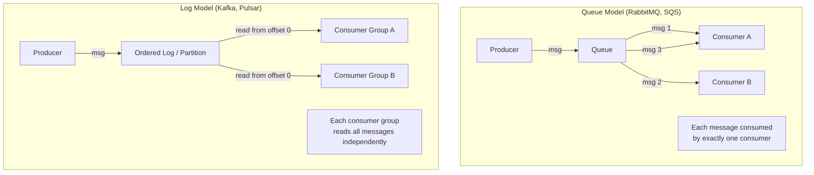
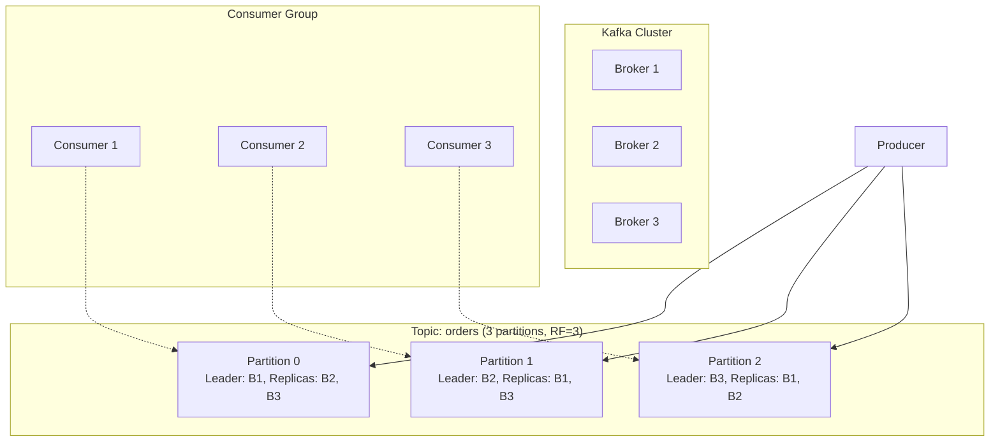
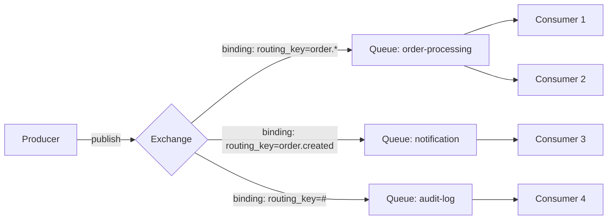
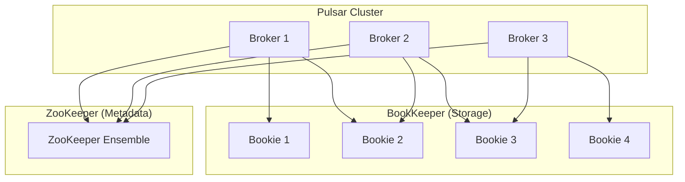
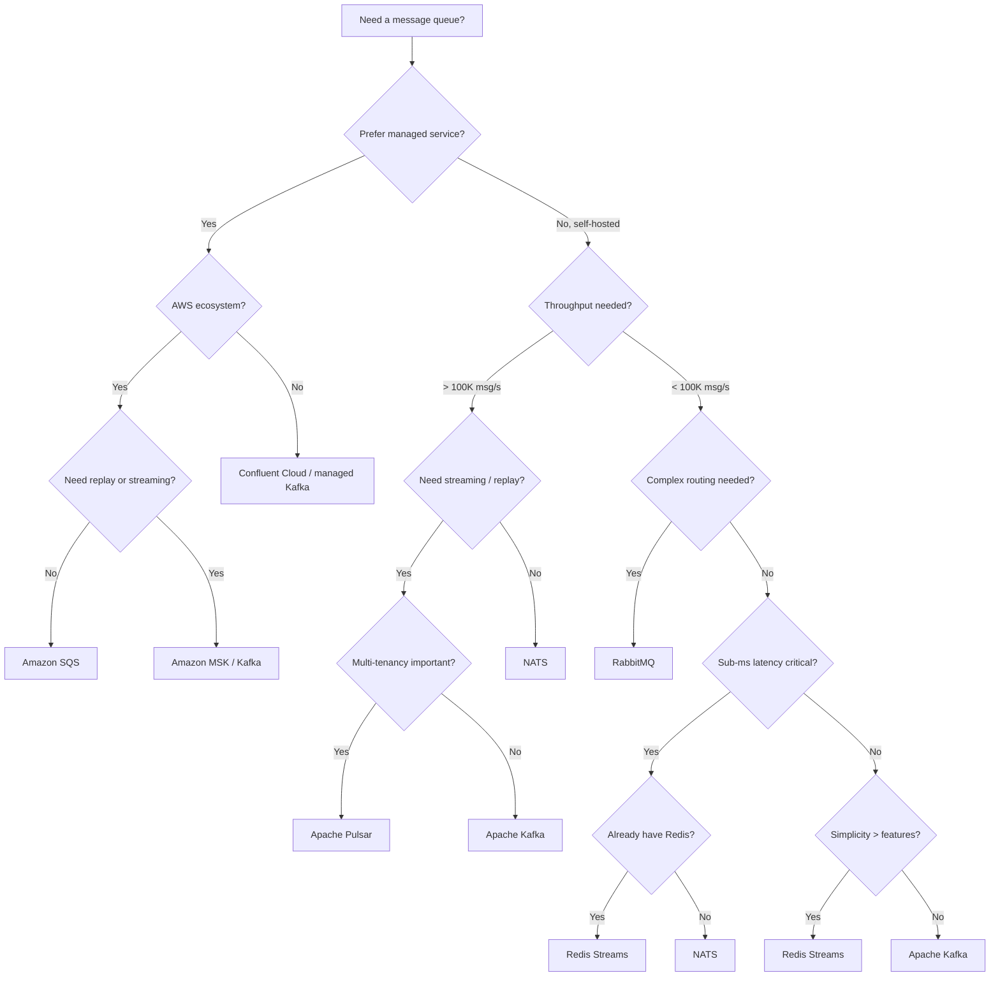
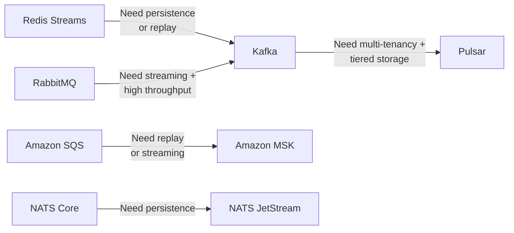
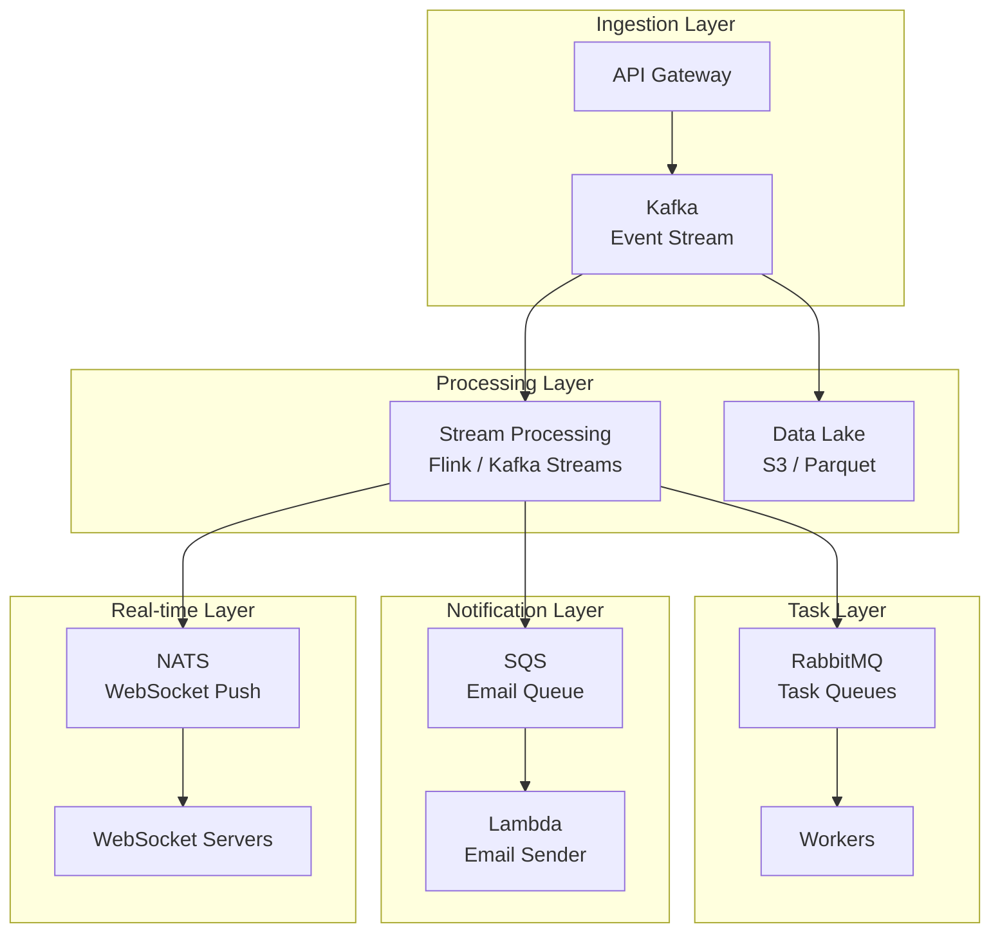

# Queue Selection Guide

## Why Message Queues Exist

Message queues solve a fundamental distributed systems problem: how do services communicate when they cannot (or should not) talk directly to each other? Direct synchronous communication (service A calls service B via HTTP) creates tight coupling — if B is slow, A is slow; if B is down, A fails.

Message queues decouple producers from consumers across three dimensions:

1. **Time** — the producer and consumer don't need to be running simultaneously
2. **Space** — the producer doesn't need to know the consumer's address
3. **Synchrony** — the producer doesn't wait for the consumer to process the message

This decoupling enables:
- **Load leveling** — absorb traffic spikes without overwhelming downstream services
- **Fault isolation** — a crashed consumer doesn't crash the producer
- **Fan-out** — one message processed by multiple consumers
- **Ordering guarantees** — process events in the correct sequence
- **Replay** — re-process historical messages for recovery or analysis

### Historical Context

Message queuing dates back to the 1980s with IBM MQSeries (now IBM MQ). The Java Message Service (JMS) standardized the API in 2001. But the modern landscape was reshaped by three technologies: RabbitMQ (2007, implementing AMQP), Apache Kafka (2011, log-based streaming from LinkedIn), and AWS SQS (2006, managed queue-as-a-service). Each represents a fundamentally different approach to the problem.

## First Principles

### Two Mental Models

There are two fundamentally different models for message systems:

**Queue model (traditional)**: Messages are work items. Each message is processed by exactly one consumer. Once processed, it is removed. Think of a task queue.

**Log model (streaming)**: Messages are events appended to an ordered, immutable log. Multiple consumers can read the same messages independently at their own pace. Think of a commit log.



### Key Properties to Evaluate

| Property | Question |
|----------|----------|
| **Ordering** | Do you need messages processed in order? Per-partition? Global? |
| **Delivery guarantee** | At-most-once? At-least-once? Exactly-once? |
| **Retention** | Delete after consumption? Retain for hours/days/forever? |
| **Throughput** | Messages per second needed? |
| **Latency** | Millisecond? Sub-millisecond? |
| **Consumer model** | Competing consumers? Fan-out? Both? |
| **Replay** | Need to reprocess historical messages? |
| **Message size** | Kilobytes? Megabytes? |
| **Operational complexity** | Managed service acceptable? Self-hosted? |

## The Contenders

### Apache Kafka

Kafka is a distributed commit log. Messages are written to partitioned, replicated topics and retained for a configurable duration (or forever with compacted topics).

**Architecture:**



**Key characteristics:**
- Append-only log with offset-based consumption
- Ordering guaranteed within a partition
- Consumers track their own offset (position in the log)
- Retention by time (default 7 days) or size
- Compacted topics for changelog/state pattern
- Exactly-once semantics (with transactions, since 0.11)

**Performance:**
- Throughput: 1M+ messages/sec per broker (small messages)
- Latency: 2-10ms (p99) typical, sub-ms possible with optimization
- Storage: Sequential I/O, zero-copy transfer to network
- Scale: Thousands of partitions per cluster

```typescript
import { Kafka, type Producer, type Consumer, type EachMessagePayload } from 'kafkajs';

interface OrderEvent {
  orderId: string;
  userId: string;
  action: 'created' | 'paid' | 'shipped' | 'delivered' | 'cancelled';
  amount: number;
  timestamp: string;
}

class KafkaOrderProducer {
  private kafka: Kafka;
  private producer: Producer;

  constructor(brokers: string[]) {
    this.kafka = new Kafka({
      clientId: 'order-service',
      brokers,
      retry: {
        initialRetryTime: 100,
        retries: 8,
        maxRetryTime: 30_000,
      },
    });
    this.producer = this.kafka.producer({
      idempotent: true, // Exactly-once producer
      maxInFlightRequests: 5,
      transactionalId: 'order-producer-tx',
    });
  }

  async connect(): Promise<void> {
    await this.producer.connect();
  }

  async publishOrder(event: OrderEvent): Promise<void> {
    await this.producer.send({
      topic: 'orders',
      messages: [
        {
          // Key determines partition — same orderId always goes to same partition
          // guaranteeing order per order
          key: event.orderId,
          value: JSON.stringify(event),
          headers: {
            'event-type': event.action,
            'correlation-id': event.orderId,
            'produced-at': new Date().toISOString(),
          },
          timestamp: Date.now().toString(),
        },
      ],
    });
  }

  async publishBatch(events: OrderEvent[]): Promise<void> {
    const transaction = await this.producer.transaction();

    try {
      await transaction.send({
        topic: 'orders',
        messages: events.map((event) => ({
          key: event.orderId,
          value: JSON.stringify(event),
          headers: { 'event-type': event.action },
        })),
      });

      // Can also send offsets in same transaction (exactly-once processing)
      await transaction.commit();
    } catch (error) {
      await transaction.abort();
      throw error;
    }
  }

  async disconnect(): Promise<void> {
    await this.producer.disconnect();
  }
}

class KafkaOrderConsumer {
  private kafka: Kafka;
  private consumer: Consumer;

  constructor(brokers: string[], groupId: string) {
    this.kafka = new Kafka({
      clientId: 'order-processor',
      brokers,
    });
    this.consumer = this.kafka.consumer({
      groupId,
      sessionTimeout: 30_000,
      heartbeatInterval: 3_000,
      maxWaitTimeInMs: 5_000,
      retry: { retries: 5 },
    });
  }

  async start(handler: (event: OrderEvent) => Promise<void>): Promise<void> {
    await this.consumer.connect();
    await this.consumer.subscribe({ topic: 'orders', fromBeginning: false });

    await this.consumer.run({
      autoCommit: false, // Manual commit for at-least-once
      eachMessage: async (payload: EachMessagePayload) => {
        const { topic, partition, message } = payload;

        const event: OrderEvent = JSON.parse(message.value!.toString());

        try {
          await handler(event);

          // Commit offset after successful processing
          await this.consumer.commitOffsets([
            {
              topic,
              partition,
              offset: (parseInt(message.offset, 10) + 1).toString(),
            },
          ]);
        } catch (error) {
          console.error(
            `Failed to process message at offset ${message.offset}:`,
            error
          );
          // Don't commit — message will be redelivered
          // (at-least-once semantics)
        }
      },
    });
  }

  async stop(): Promise<void> {
    await this.consumer.disconnect();
  }
}
```

### RabbitMQ

RabbitMQ implements AMQP 0-9-1, a protocol designed around the traditional message queue model with rich routing capabilities.

**Architecture:**



**Key characteristics:**
- Exchange-based routing (direct, topic, fanout, headers)
- Per-message acknowledgment
- Dead letter exchanges for failed messages
- Priority queues
- Quorum queues (Raft-based replication, replacing mirrored queues)
- Streams (log-based, since 3.9) for Kafka-like patterns
- Message TTL and queue TTL

**Performance:**
- Throughput: 20,000-50,000 messages/sec per node (durable, confirmed)
- Latency: 1-5ms typical
- Scale: Clustering for HA, but limited horizontal scale

```typescript
import amqp, { type Channel, type Connection, type ConsumeMessage } from 'amqplib';

interface NotificationMessage {
  type: 'email' | 'sms' | 'push';
  userId: string;
  template: string;
  data: Record<string, unknown>;
  priority: number;
}

class RabbitMQPublisher {
  private connection!: Connection;
  private channel!: Channel;

  async connect(url: string): Promise<void> {
    this.connection = await amqp.connect(url);
    this.channel = await this.connection.createConfirmChannel();

    // Declare exchange
    await this.channel.assertExchange('notifications', 'topic', {
      durable: true,
    });

    // Declare dead letter exchange
    await this.channel.assertExchange('notifications.dlx', 'fanout', {
      durable: true,
    });

    // Declare queues with dead letter configuration
    await this.channel.assertQueue('notifications.email', {
      durable: true,
      deadLetterExchange: 'notifications.dlx',
      deadLetterRoutingKey: 'notifications.email.dead',
      arguments: {
        'x-max-length': 100_000,
        'x-message-ttl': 3_600_000, // 1 hour
        'x-queue-type': 'quorum',   // Raft-based replication
      },
    });

    await this.channel.assertQueue('notifications.sms', {
      durable: true,
      deadLetterExchange: 'notifications.dlx',
      arguments: {
        'x-max-length': 50_000,
        'x-queue-type': 'quorum',
      },
    });

    // Bind queues to exchange
    await this.channel.bindQueue(
      'notifications.email',
      'notifications',
      'notification.email.*'
    );
    await this.channel.bindQueue(
      'notifications.sms',
      'notifications',
      'notification.sms.*'
    );
  }

  async publish(message: NotificationMessage): Promise<boolean> {
    const routingKey = `notification.${message.type}.${message.priority}`;

    return new Promise((resolve, reject) => {
      this.channel.publish(
        'notifications',
        routingKey,
        Buffer.from(JSON.stringify(message)),
        {
          persistent: true,        // Survive broker restart
          contentType: 'application/json',
          priority: message.priority,
          messageId: crypto.randomUUID(),
          timestamp: Date.now(),
          headers: {
            'x-retry-count': 0,
          },
        },
        (err) => {
          if (err) reject(err);
          else resolve(true);
        }
      );
    });
  }

  async close(): Promise<void> {
    await this.channel.close();
    await this.connection.close();
  }
}

class RabbitMQConsumer {
  private connection!: Connection;
  private channel!: Channel;

  async connect(url: string): Promise<void> {
    this.connection = await amqp.connect(url);
    this.channel = await this.connection.createChannel();

    // Prefetch: process N messages concurrently
    await this.channel.prefetch(10);
  }

  async consume(
    queue: string,
    handler: (msg: NotificationMessage) => Promise<void>,
    maxRetries: number = 3
  ): Promise<void> {
    await this.channel.consume(queue, async (msg: ConsumeMessage | null) => {
      if (!msg) return;

      const retryCount = (msg.properties.headers?.['x-retry-count'] as number) ?? 0;

      try {
        const message: NotificationMessage = JSON.parse(
          msg.content.toString()
        );
        await handler(message);
        this.channel.ack(msg);
      } catch (error) {
        console.error(`Processing failed (attempt ${retryCount + 1}):`, error);

        if (retryCount >= maxRetries) {
          // Send to dead letter queue
          this.channel.nack(msg, false, false);
        } else {
          // Requeue with incremented retry count
          this.channel.nack(msg, false, false);
          // Re-publish with updated retry count
          this.channel.publish(
            '',
            queue,
            msg.content,
            {
              ...msg.properties,
              headers: {
                ...msg.properties.headers,
                'x-retry-count': retryCount + 1,
              },
            }
          );
        }
      }
    });
  }

  async close(): Promise<void> {
    await this.channel.close();
    await this.connection.close();
  }
}
```

### Redis Streams

Redis Streams (since Redis 5.0) is a log data structure built into Redis, offering Kafka-like consumer groups with Redis's simplicity.

**Key characteristics:**
- Append-only log with auto-generated IDs (timestamp-based)
- Consumer groups with acknowledgment
- Pending Entry List (PEL) for tracking unacknowledged messages
- XRANGE for time-based queries
- MAXLEN/MINID for capped streams
- Low latency (sub-millisecond)
- Limited by single-node memory (or Redis Cluster sharding)

**Performance:**
- Throughput: 100,000+ messages/sec (single node)
- Latency: <1ms
- Storage: In-memory (limited by RAM)

```typescript
import { createClient, type RedisClientType } from 'redis';

interface TaskMessage {
  taskId: string;
  type: string;
  payload: Record<string, string>;
  createdAt: string;
}

class RedisStreamProducer {
  private client: RedisClientType;

  constructor(url: string) {
    this.client = createClient({ url });
  }

  async connect(): Promise<void> {
    await this.client.connect();
  }

  async publish(stream: string, message: TaskMessage): Promise<string> {
    // XADD with MAXLEN to cap the stream
    const id = await this.client.xAdd(
      stream,
      '*', // Auto-generate ID
      {
        taskId: message.taskId,
        type: message.type,
        payload: JSON.stringify(message.payload),
        createdAt: message.createdAt,
      },
      {
        TRIM: {
          strategy: 'MAXLEN',
          strategyModifier: '~',  // Approximate trimming (more efficient)
          threshold: 1_000_000,
        },
      }
    );

    return id;
  }

  async close(): Promise<void> {
    await this.client.quit();
  }
}

class RedisStreamConsumer {
  private client: RedisClientType;
  private groupName: string;
  private consumerName: string;

  constructor(url: string, groupName: string, consumerName: string) {
    this.client = createClient({ url });
    this.groupName = groupName;
    this.consumerName = consumerName;
  }

  async connect(): Promise<void> {
    await this.client.connect();
  }

  async createGroup(stream: string): Promise<void> {
    try {
      await this.client.xGroupCreate(stream, this.groupName, '0', {
        MKSTREAM: true,
      });
    } catch (error) {
      // Group already exists — that's fine
      const err = error as Error;
      if (!err.message.includes('BUSYGROUP')) throw error;
    }
  }

  async consume(
    stream: string,
    handler: (message: TaskMessage) => Promise<void>,
    batchSize: number = 10
  ): Promise<void> {
    while (true) {
      try {
        // First: process any pending messages (from previous crashes)
        await this.processPending(stream, handler);

        // Then: read new messages
        const results = await this.client.xReadGroup(
          this.groupName,
          this.consumerName,
          { key: stream, id: '>' }, // '>' means new messages only
          { COUNT: batchSize, BLOCK: 5000 }
        );

        if (!results) continue;

        for (const result of results) {
          for (const message of result.messages) {
            const task: TaskMessage = {
              taskId: message.message.taskId,
              type: message.message.type,
              payload: JSON.parse(message.message.payload),
              createdAt: message.message.createdAt,
            };

            try {
              await handler(task);
              await this.client.xAck(stream, this.groupName, message.id);
            } catch (error) {
              console.error(`Failed to process ${message.id}:`, error);
              // Message stays in PEL for retry
            }
          }
        }
      } catch (error) {
        console.error('Consumer error:', error);
        await new Promise((r) => setTimeout(r, 1_000));
      }
    }
  }

  private async processPending(
    stream: string,
    handler: (message: TaskMessage) => Promise<void>
  ): Promise<void> {
    const pending = await this.client.xPendingRange(
      stream,
      this.groupName,
      '-',
      '+',
      10,
      { consumer: this.consumerName }
    );

    for (const entry of pending) {
      // Claim messages idle for more than 60 seconds
      if (entry.millisecondsSinceLastDelivery > 60_000) {
        const claimed = await this.client.xClaim(
          stream,
          this.groupName,
          this.consumerName,
          60_000,
          entry.id
        );

        for (const msg of claimed) {
          const task: TaskMessage = {
            taskId: msg.message.taskId,
            type: msg.message.type,
            payload: JSON.parse(msg.message.payload),
            createdAt: msg.message.createdAt,
          };

          try {
            await handler(task);
            await this.client.xAck(stream, this.groupName, msg.id);
          } catch {
            // If it has been delivered too many times, dead letter it
            if (entry.deliveryCount > 5) {
              await this.client.xAdd(`${stream}:dead`, '*', {
                originalId: entry.id,
                reason: 'max_retries_exceeded',
              });
              await this.client.xAck(stream, this.groupName, entry.id);
            }
          }
        }
      }
    }
  }

  async close(): Promise<void> {
    await this.client.quit();
  }
}
```

### Amazon SQS

SQS is a fully managed queue service. No servers to run, no clusters to manage, no capacity planning.

**Key characteristics:**
- Standard queues: at-least-once, best-effort ordering, nearly unlimited throughput
- FIFO queues: exactly-once, strict ordering, 300-3,000 messages/sec
- Visibility timeout for in-flight message management
- Dead letter queues built-in
- Long polling for efficient consumption
- 14-day message retention (max)
- 256 KB max message size (Extended Client Library for larger)

**Performance:**
- Standard: nearly unlimited throughput
- FIFO: 300 msg/s (without batching), 3,000 msg/s (with batching)
- Latency: 5-20ms typical

```typescript
import {
  SQSClient,
  SendMessageCommand,
  ReceiveMessageCommand,
  DeleteMessageCommand,
  type Message,
} from '@aws-sdk/client-sqs';

interface SqsProcessorConfig {
  queueUrl: string;
  region: string;
  maxConcurrency: number;
  visibilityTimeout: number;
  waitTimeSeconds: number;
}

class SqsProcessor {
  private client: SQSClient;
  private config: SqsProcessorConfig;
  private running = false;

  constructor(config: SqsProcessorConfig) {
    this.config = config;
    this.client = new SQSClient({ region: config.region });
  }

  async send(body: object, options?: {
    delaySeconds?: number;
    messageGroupId?: string;  // Required for FIFO
    deduplicationId?: string; // Required for FIFO
  }): Promise<string> {
    const command = new SendMessageCommand({
      QueueUrl: this.config.queueUrl,
      MessageBody: JSON.stringify(body),
      DelaySeconds: options?.delaySeconds,
      MessageGroupId: options?.messageGroupId,
      MessageDeduplicationId: options?.deduplicationId,
    });

    const result = await this.client.send(command);
    return result.MessageId!;
  }

  async startPolling(
    handler: (message: object) => Promise<void>
  ): Promise<void> {
    this.running = true;
    const inFlight = new Set<Promise<void>>();

    while (this.running) {
      // Don't exceed max concurrency
      if (inFlight.size >= this.config.maxConcurrency) {
        await Promise.race(inFlight);
        continue;
      }

      try {
        const command = new ReceiveMessageCommand({
          QueueUrl: this.config.queueUrl,
          MaxNumberOfMessages: Math.min(
            10,
            this.config.maxConcurrency - inFlight.size
          ),
          WaitTimeSeconds: this.config.waitTimeSeconds,
          VisibilityTimeout: this.config.visibilityTimeout,
          MessageAttributeNames: ['All'],
        });

        const result = await this.client.send(command);

        if (!result.Messages?.length) continue;

        for (const message of result.Messages) {
          const promise = this.processMessage(message, handler)
            .finally(() => inFlight.delete(promise));
          inFlight.add(promise);
        }
      } catch (error) {
        console.error('Poll error:', error);
        await new Promise((r) => setTimeout(r, 1_000));
      }
    }

    // Wait for in-flight messages to complete
    await Promise.all(inFlight);
  }

  private async processMessage(
    message: Message,
    handler: (body: object) => Promise<void>
  ): Promise<void> {
    try {
      const body = JSON.parse(message.Body!);
      await handler(body);

      // Delete message on success
      await this.client.send(
        new DeleteMessageCommand({
          QueueUrl: this.config.queueUrl,
          ReceiptHandle: message.ReceiptHandle,
        })
      );
    } catch (error) {
      console.error(`Failed to process message ${message.MessageId}:`, error);
      // Message will become visible again after visibility timeout
      // and be redelivered (at-least-once semantics)
    }
  }

  stop(): void {
    this.running = false;
  }
}
```

### NATS

NATS is an ultra-lightweight, high-performance messaging system. NATS JetStream (since NATS 2.2) adds persistence, exactly-once semantics, and streams.

**Key characteristics:**
- Core NATS: at-most-once, pub/sub, request-reply, no persistence
- JetStream: at-least-once/exactly-once, persistence, streams, consumers
- Subject-based addressing with wildcards (`orders.>`, `orders.*.created`)
- Extremely low latency (<0.1ms for core NATS)
- Built-in multi-tenancy (accounts)
- Leaf nodes for edge computing

**Performance:**
- Core NATS: 10M+ messages/sec, sub-100-microsecond latency
- JetStream: 1M+ messages/sec with persistence

### Apache Pulsar

Pulsar separates compute (brokers) from storage (Apache BookKeeper), enabling independent scaling:

**Architecture:**



**Key characteristics:**
- Multi-tenancy built-in (tenants, namespaces, topics)
- Tiered storage (hot → warm → cold, offload to S3)
- Geo-replication across clusters
- Both queue and streaming semantics (shared and exclusive subscriptions)
- Schema registry built-in
- Functions (lightweight stream processing)
- IO Connectors (source/sink)

**Performance:**
- Throughput: 1M+ messages/sec
- Latency: 5-10ms typical (higher than Kafka due to BookKeeper)
- Storage: Unlimited (tiered storage)

## Comparison Table

### Feature Matrix

| Feature | Kafka | RabbitMQ | Redis Streams | SQS | NATS JetStream | Pulsar |
|---------|-------|----------|--------------|-----|----------------|--------|
| **Model** | Log | Queue | Log | Queue | Log + Queue | Log + Queue |
| **Ordering** | Per-partition | Per-queue | Per-stream | FIFO queues only | Per-stream | Per-partition |
| **Delivery** | At-least-once, exactly-once | At-least-once | At-least-once | At-least-once, exactly-once (FIFO) | At-least-once, exactly-once | At-least-once, exactly-once |
| **Retention** | Time/size-based | Until consumed | Size-based | 14 days max | Time/size-based | Tiered (unlimited) |
| **Replay** | Yes (seek to offset) | No (unless streams) | Yes (by ID/time) | No | Yes | Yes |
| **Throughput** | 1M+ msg/s | 20-50K msg/s | 100K+ msg/s | "Unlimited" (standard) | 1M+ msg/s | 1M+ msg/s |
| **Latency (p99)** | 5-15ms | 2-10ms | <1ms | 10-30ms | 1-5ms | 5-20ms |
| **Max msg size** | 1MB default | 128MB | 512MB | 256KB | 1MB default | 5MB default |
| **Multi-tenancy** | Limited | vhosts | Databases | Accounts | Accounts | Native |
| **Geo-replication** | MirrorMaker 2 | Federation/Shovel | Redis Enterprise | Cross-region | JetStream | Native |
| **Operational complexity** | High | Medium | Low | None (managed) | Low-Medium | High |
| **Managed options** | Confluent, MSK, Aiven | CloudAMQP, AmazonMQ | Redis Cloud, ElastiCache | Native AWS | Synadia | StreamNative |

### Cost Comparison (Approximate)

| System | Infrastructure Cost (1M msg/day) | Operational Cost | Total |
|--------|----------------------------------|-----------------|-------|
| Kafka (self-hosted, 3 brokers) | $500-1,500/mo | High (dedicated team time) | $2,000-5,000/mo |
| Kafka (Confluent Cloud) | $200-800/mo | Low | $200-800/mo |
| RabbitMQ (self-hosted, 3 nodes) | $300-900/mo | Medium | $1,000-3,000/mo |
| Redis Streams (self-hosted) | $200-600/mo | Low-Medium | $500-1,500/mo |
| SQS | $1-5/mo | None | $1-5/mo |
| NATS (self-hosted) | $200-600/mo | Low | $400-1,200/mo |
| Pulsar (self-hosted) | $800-2,000/mo | High | $2,500-6,000/mo |

::: tip
SQS is dramatically cheaper for low-to-medium throughput workloads. The infrastructure and operational cost of self-hosted solutions often exceeds the SQS bill by 10-100x. Only choose self-hosted when you need features SQS lacks (replay, streaming, sub-millisecond latency).
:::

## Decision Flowchart



## Edge Cases and Failure Modes

### Consumer Lag and Backpressure

When consumers can't keep up with producers:

| System | Behavior | Mitigation |
|--------|----------|------------|
| Kafka | Messages accumulate on disk, consumer lag grows | Add partitions + consumers, faster processing |
| RabbitMQ | Memory/disk alarms, producers blocked | Prefetch limits, add consumers, lazy queues |
| Redis Streams | Memory pressure, OOM risk | MAXLEN, add consumers, offload to disk |
| SQS | Messages wait (up to 14 days) | Scale consumers (Lambda!), increase visibility timeout |
| NATS | Flow control, slow consumer detection | Increase buffer, add consumers |
| Pulsar | Tiered storage absorbs, backlog grows | Scale consumers, configure retention |

### Message Ordering Guarantees

$$
\text{Total ordering} \implies \text{Single partition/queue} \implies \text{Single consumer} \implies \text{Limited throughput}
$$

The fundamental tradeoff: stronger ordering requires less parallelism.

| Guarantee | Kafka | RabbitMQ | SQS |
|-----------|-------|----------|-----|
| Per-key ordering | Partition by key | Single queue | FIFO queue + group ID |
| Global ordering | Single partition | Single queue | Single FIFO queue |
| No ordering | Multiple partitions | Multiple queues | Standard queue |

### Exactly-Once Processing

True exactly-once is impossible in a distributed system (Two Generals' Problem). What "exactly-once" really means in practice is "at-least-once delivery + idempotent processing":

```typescript
interface IdempotentProcessor {
  processedIds: Set<string>;
  process(messageId: string, payload: unknown): Promise<void>;
}

class IdempotentOrderProcessor implements IdempotentProcessor {
  processedIds: Set<string> = new Set();
  private storage: Map<string, boolean> = new Map(); // Simulating a DB

  async process(messageId: string, payload: unknown): Promise<void> {
    // Check if already processed (idempotency check)
    if (this.storage.has(messageId)) {
      console.log(`Message ${messageId} already processed, skipping`);
      return;
    }

    // Process the message
    await this.doWork(payload);

    // Mark as processed (atomically with the work, ideally in same transaction)
    this.storage.set(messageId, true);
  }

  private async doWork(_payload: unknown): Promise<void> {
    // Actual business logic
  }
}
```

::: info War Story
A fintech startup chose RabbitMQ for payment processing because of its mature ecosystem and simple operations. At 5,000 payments/sec, they hit RabbitMQ's per-queue throughput ceiling. They sharded across 10 queues by customer ID hash, which solved throughput but introduced complexity in maintaining ordering. Two years later, during a Black Friday sale, a Rabbit node went down during a queue sync, causing 45 minutes of duplicate payment processing. The root cause was a mirrored queue that failed to synchronize before the primary went down. They migrated to Kafka with exactly-once transactions, which inherently handled both the throughput and durability requirements. The lesson: choose the queue for where you'll be in 2 years, not where you are today.
:::

## Performance Characteristics

### Throughput Scaling

| System | Scaling Mechanism | Practical Limit |
|--------|------------------|-----------------|
| Kafka | Add partitions + brokers | 10M+ msg/s per cluster |
| RabbitMQ | Add queues (sharding) | 200K msg/s per cluster |
| Redis Streams | Redis Cluster sharding | 500K+ msg/s |
| SQS | Automatic | "Unlimited" |
| NATS | Add servers | 10M+ msg/s |
| Pulsar | Add brokers (compute) independently from bookies (storage) | 10M+ msg/s |

### Latency Under Load

$$
T_{\text{e2e}} = T_{\text{produce}} + T_{\text{replicate}} + T_{\text{commit}} + T_{\text{poll}} + T_{\text{deliver}}
$$

| Component | Kafka | RabbitMQ | NATS |
|-----------|-------|----------|------|
| Produce (client → broker) | 0.5ms | 0.5ms | 0.05ms |
| Replicate (broker → replicas) | 1-5ms | 2-10ms | 0.5-2ms |
| Commit (fsync) | 0-5ms | 0-5ms | 0-2ms |
| Poll interval | 0-100ms | 0ms (push) | 0ms (push) |
| Deliver | 0.5ms | 0.5ms | 0.05ms |
| **Total (typical)** | **2-15ms** | **3-15ms** | **0.5-5ms** |

## Mathematical Foundations

### Queue Theory (M/M/1)

A message queue with Poisson arrivals (rate $\lambda$) and exponential service times (rate $\mu$):

$$
\rho = \frac{\lambda}{\mu} \quad \text{(utilization, must be } < 1\text{)}
$$

$$
L = \frac{\rho}{1 - \rho} \quad \text{(average messages in system)}
$$

$$
W = \frac{1}{\mu - \lambda} \quad \text{(average time in system)}
$$

For $\lambda = 9{,}000$ msg/s and $\mu = 10{,}000$ msg/s:

$$
\rho = 0.9, \quad L = 9 \text{ messages}, \quad W = 1\text{ms}
$$

At $\lambda = 9{,}900$ msg/s: $L = 99$, $W = 10\text{ms}$ — approaching capacity causes nonlinear latency growth.

### Partition Count Optimization (Kafka)

Optimal number of partitions:

$$
P = \max\left(\frac{T_{\text{target}}}{T_{\text{producer per partition}}}, \frac{T_{\text{target}}}{T_{\text{consumer per partition}}}\right)
$$

where $T_{\text{target}}$ is target throughput. If each partition can handle 10 MB/s producing and 20 MB/s consuming, and you need 100 MB/s:

$$
P = \max\left(\frac{100}{10}, \frac{100}{20}\right) = \max(10, 5) = 10 \text{ partitions}
$$

Add 20-50% headroom for rebalancing: $P = 12\text{-}15$ partitions.

### Consumer Group Rebalancing Time

When a Kafka consumer group rebalances (member joins/leaves):

$$
T_{\text{rebalance}} = T_{\text{detection}} + T_{\text{revocation}} + T_{\text{assignment}}
$$

With cooperative incremental rebalancing (Kafka 2.4+):

$$
T_{\text{cooperative}} \approx \frac{T_{\text{eager}}}{N_{\text{consumers}}}
$$

because only affected partitions are revoked, not all partitions.

## Decision Framework

### When to Use What

| Use Case | Best Choice | Runner-Up | Avoid |
|----------|------------|-----------|-------|
| Event sourcing / CQRS | Kafka | Pulsar | SQS, RabbitMQ |
| Task/job queue | RabbitMQ | SQS | Kafka (overkill) |
| Real-time analytics pipeline | Kafka | Pulsar | RabbitMQ, SQS |
| Microservice communication | NATS | RabbitMQ | Kafka (overkill for simple cases) |
| IoT device telemetry | NATS | Kafka | RabbitMQ |
| AWS-native serverless | SQS + Lambda | - | Self-hosted anything |
| Multi-tenant SaaS | Pulsar | Kafka | Redis Streams |
| Simple cache invalidation | Redis Streams | NATS | Kafka, Pulsar |
| Financial transactions | Kafka (exactly-once) | Pulsar | Redis Streams |
| Batch processing pipeline | Kafka | SQS | NATS (no persistence in core) |

### Migration Paths

When you outgrow your initial choice:



## Advanced Topics

### Hybrid Architectures

Many production systems combine multiple queue technologies:



### Dead Letter Queue Patterns

Every production queue system needs a DLQ strategy:

```typescript
interface DeadLetterConfig {
  maxRetries: number;
  backoffMultiplier: number;
  maxBackoffMs: number;
  dlqTopic: string;
  alertThreshold: number;
}

class DeadLetterHandler<T> {
  private config: DeadLetterConfig;
  private dlqCount = 0;

  constructor(config: DeadLetterConfig) {
    this.config = config;
  }

  calculateBackoff(retryCount: number): number {
    const backoff = Math.min(
      1000 * Math.pow(this.config.backoffMultiplier, retryCount),
      this.config.maxBackoffMs
    );
    // Add jitter (0.5-1.5x)
    return backoff * (0.5 + Math.random());
  }

  shouldRetry(retryCount: number): boolean {
    return retryCount < this.config.maxRetries;
  }

  async sendToDlq(
    message: T,
    error: Error,
    metadata: { originalTopic: string; retryCount: number; messageId: string }
  ): Promise<void> {
    this.dlqCount++;

    const dlqMessage = {
      originalMessage: message,
      error: {
        message: error.message,
        stack: error.stack,
      },
      metadata: {
        ...metadata,
        dlqTimestamp: new Date().toISOString(),
        dlqReason: metadata.retryCount >= this.config.maxRetries
          ? 'max_retries_exceeded'
          : 'unrecoverable_error',
      },
    };

    // Publish to DLQ topic
    console.error('Message sent to DLQ:', JSON.stringify(dlqMessage));

    if (this.dlqCount >= this.config.alertThreshold) {
      // Trigger PagerDuty / Slack alert
      console.error(
        `DLQ threshold reached: ${this.dlqCount} messages in DLQ`
      );
    }
  }
}
```

### Schema Evolution

Managing message schema changes across producer/consumer versions:

| Strategy | Kafka | RabbitMQ | Pulsar |
|----------|-------|----------|--------|
| Schema Registry | Confluent Schema Registry | Not built-in | Built-in |
| Format | Avro, Protobuf, JSON Schema | Any (no enforcement) | Avro, Protobuf, JSON |
| Compatibility | BACKWARD, FORWARD, FULL, NONE | N/A | BACKWARD, FORWARD, FULL |
| Enforcement | At produce time | None | At produce time |

::: warning
Always use BACKWARD compatibility as the default: new schemas can read data written by old schemas. This allows consumers to upgrade before producers, which is the most natural deployment order. FORWARD compatibility (old schemas can read new data) requires producers to upgrade first, which is harder to coordinate.
:::

### Choosing Partition Keys

The partition key determines ordering and distribution:

$$
\text{partition} = \text{hash}(key) \mod N_{\text{partitions}}
$$

| Key Choice | Ordering Guarantee | Distribution Risk |
|------------|-------------------|-------------------|
| User ID | Per-user ordering | Hot partitions for power users |
| Order ID | Per-order ordering | Good distribution |
| Tenant ID | Per-tenant ordering | Hot partitions for large tenants |
| Random/null | No ordering | Perfect distribution |
| Timestamp | No useful ordering | Hot partition (latest) |

For multi-tenant systems with skewed tenants, consider composite keys:

```typescript
function partitionKey(tenantId: string, entityId: string): string {
  // Large tenants get spread across partitions
  // Small tenants stay on one partition for ordering
  return `${tenantId}-${entityId}`;
}
```
