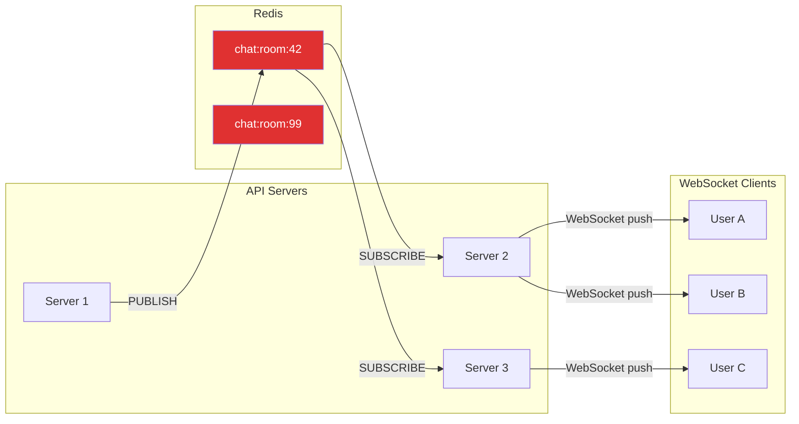
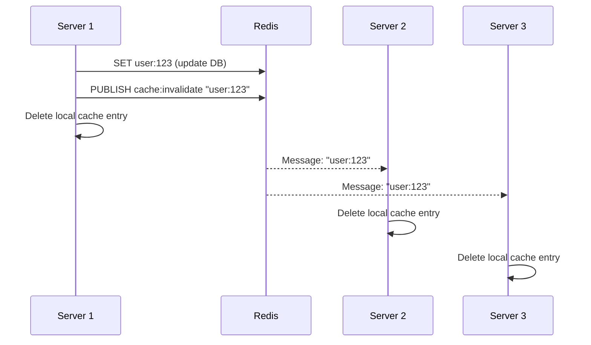
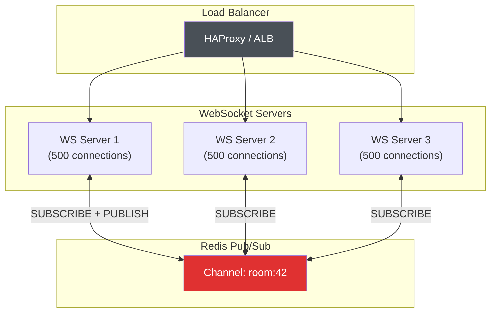
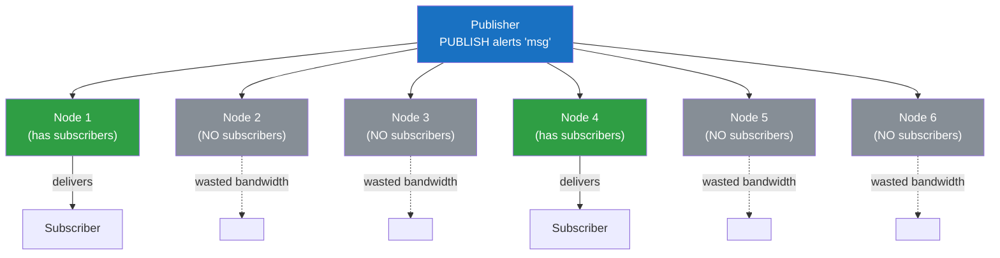
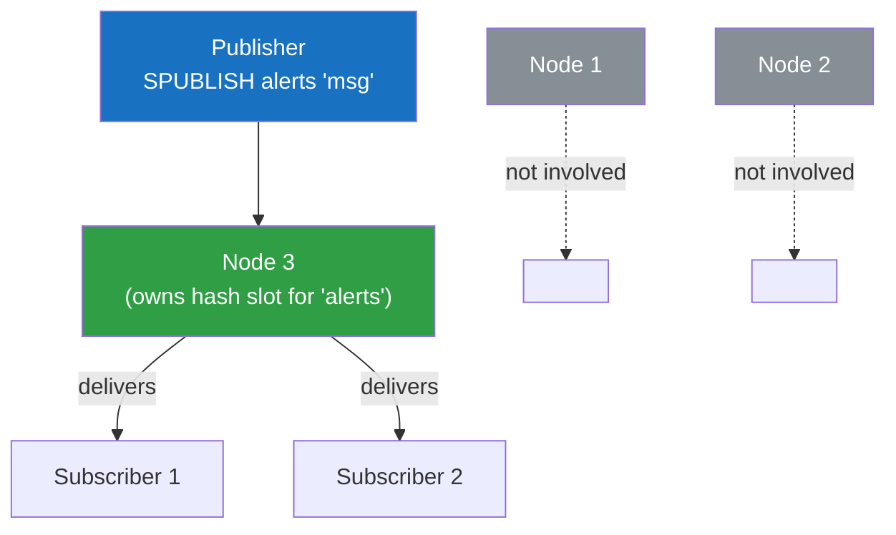
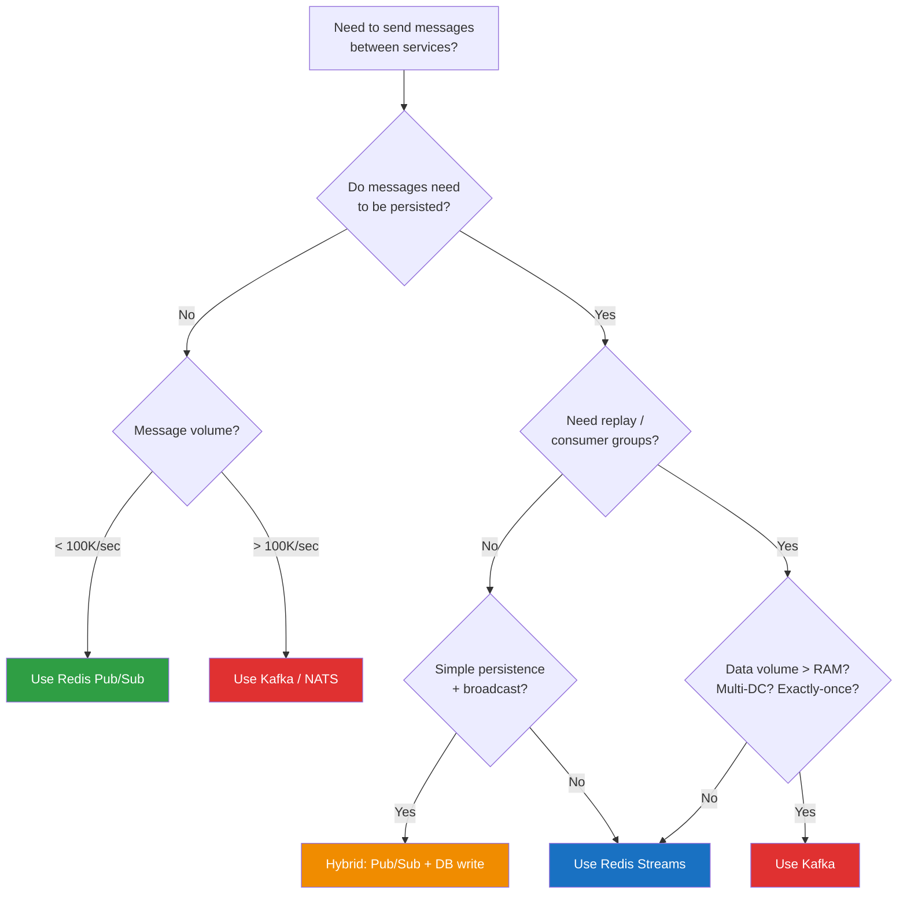
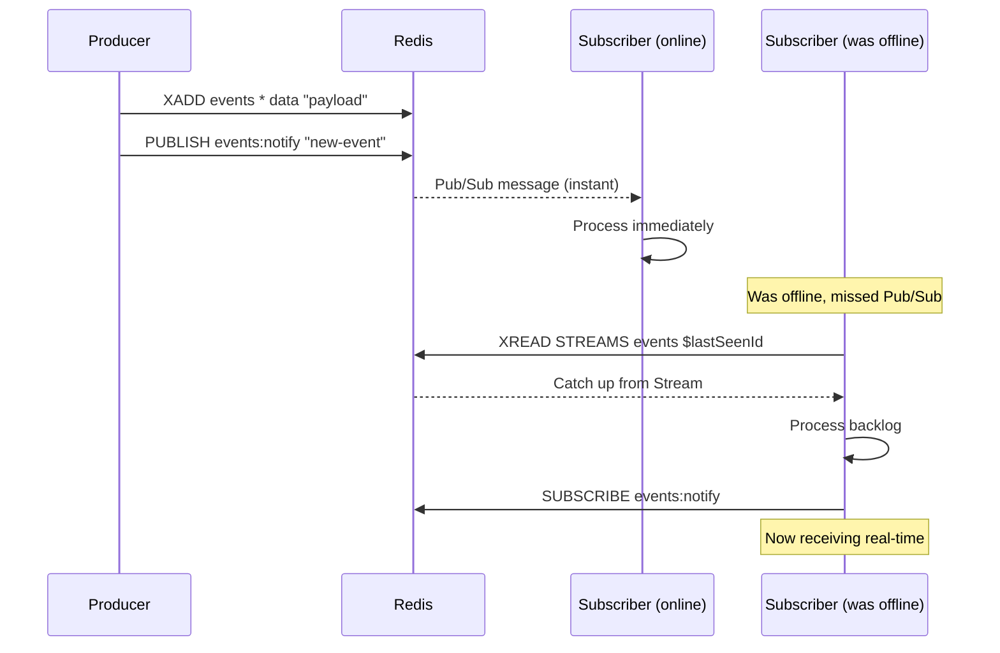

# Redis Pub/Sub Patterns

Redis Pub/Sub is the simplest real-time messaging primitive in the Redis ecosystem. A publisher sends a message to a channel. Every subscriber listening on that channel receives the message immediately. No queues, no offsets, no acknowledgments, no persistence. The message arrives and is gone. If nobody is listening, the message vanishes into the void.

This fire-and-forget model is not a limitation — it is a deliberate design choice. Pub/Sub trades durability for speed and simplicity. When you need real-time broadcast with minimal infrastructure, Pub/Sub is the fastest path. When you need message persistence, replay, or consumer groups, you graduate to [Redis Streams](/system-design/message-queues/redis-streams) or [Kafka](/system-design/message-queues/kafka-internals).

Understanding when Pub/Sub is the right tool — and when it is not — separates engineers who reach for the simplest solution from those who over-engineer every messaging problem with Kafka.

## Redis Pub/Sub Fundamentals

### How Pub/Sub Works

Redis Pub/Sub operates on **channels** — named message buses that exist only when at least one subscriber is connected. The protocol is three commands:

| Command | Description |
|---|---|
| `SUBSCRIBE channel [channel ...]` | Listen for messages on one or more channels |
| `PUBLISH channel message` | Send a message to a channel, returns the number of subscribers who received it |
| `UNSUBSCRIBE [channel ...]` | Stop listening on channels |

```mermaid
graph LR
    P1[Publisher A] -->|PUBLISH alerts "cpu high"| CH[Channel: alerts]
    P2[Publisher B] -->|PUBLISH alerts "disk full"| CH

    CH -->|message delivered| S1[Subscriber 1]
    CH -->|message delivered| S2[Subscriber 2]
    CH -->|message delivered| S3[Subscriber 3]

    style CH fill:#e03131,color:#fff
    style P1 fill:#1971c2,color:#fff
    style P2 fill:#1971c2,color:#fff
    style S1 fill:#2f9e44,color:#fff
    style S2 fill:#2f9e44,color:#fff
    style S3 fill:#2f9e44,color:#fff
```

The flow is straightforward:

1. **Subscribers connect** and issue `SUBSCRIBE channel-name`. The connection enters "subscriber mode" — it can only receive messages, subscribe to more channels, or unsubscribe. No regular Redis commands (GET, SET, etc.) can be issued on a subscriber connection.
2. **Publishers send** messages via `PUBLISH channel-name "payload"` on a separate connection. `PUBLISH` returns the number of subscribers who received the message.
3. **Delivery is immediate.** Redis pushes the message to all subscribers on the channel. There is no buffering, no queue, no retry.
4. **Disconnected subscribers miss everything.** If a subscriber drops off and reconnects, every message published during the disconnect is permanently lost.

### Pattern Subscriptions (PSUBSCRIBE)

`PSUBSCRIBE` lets you subscribe to channels matching a glob pattern, which is essential when channel names are dynamic:

```
PSUBSCRIBE notifications:*       # All notification channels
PSUBSCRIBE user:*:events         # Events for any user
PSUBSCRIBE chat:room:?           # Single-character room IDs
```

Pattern matching follows glob rules:
- `*` matches zero or more characters
- `?` matches exactly one character
- `[abc]` matches any character in the set
- `[a-z]` matches any character in the range

```mermaid
graph TB
    PUB[Publisher] -->|PUBLISH notifications:email "new msg"| R[Redis]
    PUB -->|PUBLISH notifications:sms "alert"| R
    PUB -->|PUBLISH notifications:push "update"| R

    R -->|pattern match| PS["Subscriber<br/>PSUBSCRIBE notifications:*"]
    R -->|exact match| ES["Subscriber<br/>SUBSCRIBE notifications:email"]

    style PUB fill:#1971c2,color:#fff
    style R fill:#e03131,color:#fff
    style PS fill:#2f9e44,color:#fff
    style ES fill:#2f9e44,color:#fff
```

::: warning
A subscriber using `PSUBSCRIBE notifications:*` who also uses `SUBSCRIBE notifications:email` will receive messages on `notifications:email` **twice** — once for the pattern match and once for the exact match. This is a common source of duplicate processing bugs.
:::

### Fire-and-Forget Semantics

Pub/Sub provides **at-most-once delivery** with no persistence:

- **No message queue.** Messages are not stored anywhere. Redis does not buffer messages for offline subscribers.
- **No acknowledgment.** There is no ACK mechanism. Redis delivers the message and forgets it.
- **No replay.** You cannot go back and read old messages. There is no offset, no cursor, no history.
- **No delivery guarantee.** If a subscriber's TCP connection is slow or its output buffer is full, the message may be dropped and the subscriber disconnected.
- **PUBLISH returns the count** of subscribers who received the message, but not whether they processed it.

This is fundamentally different from [Redis Streams](/system-design/message-queues/redis-streams), which persist messages in an append-only log, support consumer groups, and provide at-least-once delivery with acknowledgment.

### When Pub/Sub Is the Right Choice

| Use Case | Pub/Sub | Streams | Kafka |
|---|---|---|---|
| Real-time notifications (ephemeral) | Best fit | Overkill | Overkill |
| Cache invalidation broadcast | Best fit | Unnecessary persistence | Way overkill |
| WebSocket fan-out | Best fit | Viable alternative | Overkill |
| Chat messages (display only, no history) | Good fit | Better if history needed | Overkill |
| Event sourcing | Wrong tool | Good fit | Best fit |
| Task queue (at-least-once) | Wrong tool | Good fit | Good fit |
| Cross-datacenter replication | Wrong tool | Limited | Best fit |
| Audit log | Wrong tool | Viable | Best fit |

**The rule of thumb:** If losing a message means a user sees a stale value for a few seconds, Pub/Sub is fine. If losing a message means lost data or broken business logic, use Streams or Kafka.

---

## Production Patterns

### 1. Real-Time Notifications (Chat, Alerts, Live Updates)

The most natural Pub/Sub use case. Each chat room, user, or alert topic maps to a channel. Messages are ephemeral — if the user is not online, they fetch history from a database, not from Redis.



**Pattern:** The API server that receives the chat message writes it to the database (for history) and PUBLISHes it on the room channel. Every API server subscribed to that room pushes the message to its locally connected WebSocket clients.

### 2. Cache Invalidation Broadcast

When you run multiple application servers, each with a local in-memory cache (Node.js Map, Guava, Caffeine), you need a way to bust the cache across all instances simultaneously. Pub/Sub is the textbook solution.



**Why Pub/Sub over Streams?** Cache invalidation is the definition of fire-and-forget. If a server misses an invalidation message because it was restarting, it will serve stale data temporarily — but the cache entry has a TTL, so it will self-correct. The simplicity of Pub/Sub (no consumer groups, no ACKs, no PEL management) makes it the right choice.

### 3. Event Bus for Microservices

For lightweight, same-datacenter event broadcasting where losing an occasional event is acceptable, Pub/Sub acts as a simple event bus without the operational overhead of Kafka or RabbitMQ.

**Suitable events:** UI theme changed, feature flag toggled, user came online, rate limit updated. These are events where the worst case of a missed message is a slightly stale UI or a delayed propagation.

**Unsuitable events:** Order placed, payment processed, user account deleted. These require guaranteed delivery — use [Streams](/system-design/message-queues/redis-streams) or a proper message broker.

### 4. WebSocket Fan-Out

The most common production pattern for Redis Pub/Sub. When you have multiple WebSocket servers behind a load balancer, a message sent to one server must be broadcast to clients connected to other servers.



Each WebSocket server subscribes to the channels its connected clients care about. When a message arrives via Pub/Sub, the server pushes it to the relevant local WebSocket connections. This decouples the WebSocket layer from the message routing layer.

### 5. Configuration Hot-Reload

Push configuration changes to all application instances simultaneously without redeployment:

```
PUBLISH config:reload '{"feature_flags":{"dark_mode":true,"beta_api":false}}'
```

Every application instance subscribes to `config:reload` and updates its in-memory configuration when a message arrives. This is faster than polling a configuration store and simpler than setting up a dedicated configuration push system.

### 6. Distributed Lock Coordination Signals

When a distributed lock is released, Pub/Sub can notify waiting processes immediately rather than having them poll:

```
# Lock holder releases lock and signals waiters
DEL lock:resource:42
PUBLISH lock:released:resource:42 "available"

# Waiting processes subscribe instead of polling
SUBSCRIBE lock:released:resource:42
```

This reduces Redis load compared to polling-based lock acquisition (where clients repeatedly attempt `SET lock NX` every 100ms). The waiter subscribes, gets notified when the lock is free, and immediately attempts acquisition. See [Redis Internals](/system-design/databases/redis-internals) for more on Redis's single-threaded execution model and why this coordination works.

---

## Implementation Examples

### Node.js (ioredis) — Real-Time Chat with Rooms

```typescript
import Redis from 'ioredis';

// Pub/Sub requires SEPARATE connections — a subscriber connection
// cannot issue regular commands. This is a Redis protocol constraint.
const publisher = new Redis({ host: 'localhost', port: 6379 });
const subscriber = new Redis({ host: 'localhost', port: 6379 });

// Track local WebSocket connections per room
const roomConnections = new Map<string, Set<WebSocket>>();

// --- Subscriber Side ---

// Subscribe to all chat room channels using pattern
subscriber.psubscribe('chat:room:*', (err, count) => {
  if (err) console.error('Failed to subscribe:', err);
  console.log(`Subscribed to ${count} pattern(s)`);
});

// Handle incoming messages
subscriber.on('pmessage', (pattern, channel, message) => {
  // channel = "chat:room:42", extract room ID
  const roomId = channel.split(':')[2];
  const connections = roomConnections.get(roomId);

  if (!connections) return;

  // Fan out to all local WebSocket connections in this room
  const parsed = JSON.parse(message);
  for (const ws of connections) {
    if (ws.readyState === ws.OPEN) {
      ws.send(message);
    }
  }
});

// --- Publisher Side ---

interface ChatMessage {
  userId: string;
  text: string;
  timestamp: number;
  roomId: string;
}

async function sendMessage(msg: ChatMessage): Promise<number> {
  const channel = `chat:room:${msg.roomId}`;
  const payload = JSON.stringify(msg);

  // 1. Persist to database (for chat history)
  await db.insert('messages', msg);

  // 2. Broadcast to all subscribers (for real-time delivery)
  const receiverCount = await publisher.publish(channel, payload);
  console.log(`Message delivered to ${receiverCount} server(s)`);

  return receiverCount;
}

// --- Connection Management ---

function joinRoom(ws: WebSocket, roomId: string): void {
  if (!roomConnections.has(roomId)) {
    roomConnections.set(roomId, new Set());
  }
  roomConnections.get(roomId)!.add(ws);
}

function leaveRoom(ws: WebSocket, roomId: string): void {
  const connections = roomConnections.get(roomId);
  if (connections) {
    connections.delete(ws);
    if (connections.size === 0) {
      roomConnections.delete(roomId);
    }
  }
}

// --- Reconnection Handling ---

subscriber.on('error', (err) => {
  console.error('Subscriber error:', err);
});

// ioredis automatically reconnects, but you must re-subscribe
// after reconnection if using event-based subscription
subscriber.on('connect', () => {
  console.log('Subscriber reconnected');
  // psubscribe is automatically re-issued by ioredis
});
```

::: info
ioredis automatically handles reconnection and re-subscribes to all channels/patterns after a reconnect. The `node-redis` (v4) client also supports this but requires explicit configuration. Always verify reconnection behavior with your chosen client library.
:::

### Python (redis-py) — Event-Driven Microservice

```python
import redis
import json
import signal
import threading
from datetime import datetime

class EventBus:
    """Lightweight event bus using Redis Pub/Sub for microservice communication."""

    def __init__(self, redis_url: str = "redis://localhost:6379"):
        self.redis = redis.from_url(redis_url)
        self.pubsub = self.redis.pubsub()
        self._handlers: dict[str, list[callable]] = {}
        self._running = False
        self._thread: threading.Thread | None = None

    def on(self, event_pattern: str, handler: callable) -> None:
        """Register a handler for an event pattern (supports glob)."""
        if event_pattern not in self._handlers:
            self._handlers[event_pattern] = []
            # Use psubscribe for glob patterns, subscribe for exact
            if any(c in event_pattern for c in "*?["):
                self.pubsub.psubscribe(**{event_pattern: self._dispatch})
            else:
                self.pubsub.subscribe(**{event_pattern: self._dispatch})
        self._handlers[event_pattern].append(handler)

    def emit(self, event: str, data: dict) -> int:
        """Publish an event. Returns number of receivers."""
        payload = json.dumps({
            "event": event,
            "data": data,
            "timestamp": datetime.utcnow().isoformat(),
            "source": "order-service",  # identify the publishing service
        })
        return self.redis.publish(event, payload)

    def _dispatch(self, message: dict) -> None:
        """Route incoming messages to registered handlers."""
        if message["type"] not in ("message", "pmessage"):
            return

        channel = message["channel"]
        if isinstance(channel, bytes):
            channel = channel.decode("utf-8")

        try:
            payload = json.loads(message["data"])
        except (json.JSONDecodeError, TypeError):
            return

        # Match handlers by pattern or exact channel
        for pattern, handlers in self._handlers.items():
            for handler in handlers:
                try:
                    handler(channel, payload)
                except Exception as e:
                    print(f"Handler error on {channel}: {e}")

    def start(self) -> None:
        """Start listening for events in a background thread."""
        self._running = True
        self._thread = self.pubsub.run_in_thread(sleep_time=0.01)
        print("Event bus started")

    def stop(self) -> None:
        """Stop the event bus gracefully."""
        if self._thread:
            self._thread.stop()
        self.pubsub.close()
        self.redis.close()
        print("Event bus stopped")


# --- Usage ---

bus = EventBus("redis://localhost:6379")

# Register handlers
def on_order_created(channel: str, payload: dict) -> None:
    order = payload["data"]
    print(f"New order: {order['order_id']} — ${order['amount']}")
    # Trigger inventory check, send confirmation email, etc.

def on_any_order_event(channel: str, payload: dict) -> None:
    print(f"Order event on {channel}: {payload['event']}")

bus.on("orders:created", on_order_created)
bus.on("orders:*", on_any_order_event)

bus.start()

# Publish from another service
bus.emit("orders:created", {
    "order_id": "ord-789",
    "amount": 99.99,
    "user_id": "user-456",
})

# Graceful shutdown
signal.signal(signal.SIGTERM, lambda *_: bus.stop())
```

### Go (go-redis) — Cache Invalidation Broadcaster

```go
package main

import (
	"context"
	"encoding/json"
	"fmt"
	"log"
	"sync"
	"time"

	"github.com/redis/go-redis/v9"
)

// LocalCache wraps a simple in-memory cache with Pub/Sub invalidation.
type LocalCache struct {
	mu      sync.RWMutex
	store   map[string]CacheEntry
	rdb     *redis.Client
	channel string
}

type CacheEntry struct {
	Value     interface{}
	ExpiresAt time.Time
}

type InvalidationMessage struct {
	Key    string `json:"key"`
	Reason string `json:"reason"`
	Source string `json:"source"`
}

func NewLocalCache(rdb *redis.Client, channel string) *LocalCache {
	cache := &LocalCache{
		store:   make(map[string]CacheEntry),
		rdb:     rdb,
		channel: channel,
	}
	go cache.subscribeInvalidations()
	return cache
}

func (c *LocalCache) Get(key string) (interface{}, bool) {
	c.mu.RLock()
	defer c.mu.RUnlock()

	entry, ok := c.store[key]
	if !ok || time.Now().After(entry.ExpiresAt) {
		return nil, false
	}
	return entry.Value, true
}

func (c *LocalCache) Set(key string, value interface{}, ttl time.Duration) {
	c.mu.Lock()
	c.store[key] = CacheEntry{
		Value:     value,
		ExpiresAt: time.Now().Add(ttl),
	}
	c.mu.Unlock()
}

// Invalidate removes a key locally and broadcasts to all other instances.
func (c *LocalCache) Invalidate(ctx context.Context, key, reason string) error {
	// Remove locally first
	c.mu.Lock()
	delete(c.store, key)
	c.mu.Unlock()

	// Broadcast to all other instances
	msg := InvalidationMessage{
		Key:    key,
		Reason: reason,
		Source: hostname(),
	}
	payload, _ := json.Marshal(msg)
	return c.rdb.Publish(ctx, c.channel, payload).Err()
}

func (c *LocalCache) subscribeInvalidations() {
	ctx := context.Background()

	// IMPORTANT: Create a separate connection for subscribing.
	// The subscribe connection enters a special mode and cannot
	// be used for regular commands.
	pubsub := c.rdb.Subscribe(ctx, c.channel)
	defer pubsub.Close()

	ch := pubsub.Channel()
	for msg := range ch {
		var inv InvalidationMessage
		if err := json.Unmarshal([]byte(msg.Payload), &inv); err != nil {
			log.Printf("Invalid invalidation message: %v", err)
			continue
		}

		// Skip messages from ourselves (we already invalidated locally)
		if inv.Source == hostname() {
			continue
		}

		c.mu.Lock()
		delete(c.store, inv.Key)
		c.mu.Unlock()

		log.Printf("Cache invalidated: key=%s reason=%s source=%s",
			inv.Key, inv.Reason, inv.Source)
	}
}

func hostname() string {
	// In production, use os.Hostname() or a unique instance ID
	return "server-1"
}

func main() {
	rdb := redis.NewClient(&redis.Options{
		Addr: "localhost:6379",
	})

	cache := NewLocalCache(rdb, "cache:invalidate")

	// Set a value
	cache.Set("user:123", map[string]string{"name": "Alice"}, 5*time.Minute)

	// Later, when the user updates their profile...
	ctx := context.Background()
	if err := cache.Invalidate(ctx, "user:123", "profile_updated"); err != nil {
		log.Fatal(err)
	}

	fmt.Println("Cache invalidation broadcast sent")
}
```

### Java (Lettuce) — Spring Boot Integration

```java
@Configuration
public class RedisPubSubConfig {

    @Bean
    public RedisMessageListenerContainer messageListenerContainer(
            RedisConnectionFactory connectionFactory) {

        RedisMessageListenerContainer container = new RedisMessageListenerContainer();
        container.setConnectionFactory(connectionFactory);

        // Exact channel subscription
        container.addMessageListener(
            cacheInvalidationListener(),
            new ChannelTopic("cache:invalidate")
        );

        // Pattern subscription
        container.addMessageListener(
            orderEventListener(),
            new PatternTopic("orders:*")
        );

        return container;
    }

    @Bean
    public MessageListener cacheInvalidationListener() {
        return (message, pattern) -> {
            String key = new String(message.getBody());
            log.info("Cache invalidation received for key: {}", key);
            localCache.evict(key);
        };
    }

    @Bean
    public MessageListener orderEventListener() {
        return (message, pattern) -> {
            String channel = new String(message.getChannel());
            String payload = new String(message.getBody());
            log.info("Order event on {}: {}", channel, payload);
            // Route to appropriate handler based on channel
        };
    }
}

@Service
public class EventPublisher {

    private final StringRedisTemplate redisTemplate;

    public EventPublisher(StringRedisTemplate redisTemplate) {
        this.redisTemplate = redisTemplate;
    }

    public void publishCacheInvalidation(String key) {
        redisTemplate.convertAndSend("cache:invalidate", key);
    }

    public void publishOrderEvent(String eventType, OrderEvent event)
            throws JsonProcessingException {
        String channel = "orders:" + eventType;
        String payload = objectMapper.writeValueAsString(event);
        redisTemplate.convertAndSend(channel, payload);
    }
}
```

::: tip
Spring's `RedisMessageListenerContainer` manages subscriber connections and threading automatically. Each listener runs in a thread pool, so long-running message handlers will not block other listeners. Configure `container.setTaskExecutor(...)` to control the thread pool size.
:::

---

## Scaling Pub/Sub

### Redis Cluster and Pub/Sub (The Amplification Problem)

In Redis Cluster (pre-7.0), Pub/Sub has a significant scaling problem: **every PUBLISH is broadcast to every node in the cluster**, regardless of which nodes have subscribers for that channel.



In a 20-node cluster where only 2 nodes have subscribers, every PUBLISH still consumes bandwidth on all 20 nodes. This is the **fan-out amplification problem** and it makes Pub/Sub in large Redis Clusters inefficient.

### Sharded Pub/Sub (Redis 7.0+)

Redis 7.0 introduced **Sharded Pub/Sub** to solve the amplification problem. Instead of broadcasting to every node, messages are routed only to the shard that owns the channel's hash slot.

| Command | Behavior |
|---|---|
| `SSUBSCRIBE channel` | Subscribe to a sharded channel (routed by hash slot) |
| `SUNSUBSCRIBE channel` | Unsubscribe from a sharded channel |
| `SPUBLISH channel message` | Publish to a sharded channel |



**Key differences from regular Pub/Sub:**

- Messages are only delivered to the shard owning the channel's hash slot
- Pattern subscriptions (`PSUBSCRIBE`) are **not supported** in sharded mode — you must use exact channel names
- Sharded Pub/Sub coexists with regular Pub/Sub — they use different command sets
- If a shard fails over to a replica, subscribers must reconnect to the new primary

### Scaling Strategies

**1. Dedicated Pub/Sub Instance**

Run a separate Redis instance (or small cluster) exclusively for Pub/Sub, independent of your cache/data Redis. This prevents Pub/Sub traffic from consuming resources needed for data operations.

```
┌──────────────────┐    ┌──────────────────┐
│  Redis Data       │    │  Redis Pub/Sub    │
│  (cache, sessions)│    │  (dedicated)      │
│  Port 6379        │    │  Port 6380        │
└──────────────────┘    └──────────────────┘
```

**2. Client-Side Message Filtering**

Instead of creating thousands of fine-grained channels, use fewer channels with structured message payloads. Subscribers filter messages client-side:

```typescript
// Instead of: SUBSCRIBE user:1:notifications, user:2:notifications, ...
// Use: SUBSCRIBE notifications (one channel)
// Then filter client-side:

subscriber.on('message', (channel, message) => {
  const parsed = JSON.parse(message);
  if (parsed.userId === currentUserId) {
    handleNotification(parsed);
  }
});
```

This reduces Redis's channel tracking overhead at the cost of subscribers receiving (and discarding) messages they do not care about. The trade-off works when message volume is moderate and filtering is cheap.

**3. Channel Namespacing**

Use hierarchical channel names to organize and manage subscriptions:

```
chat:room:{roomId}:messages     # Chat messages
chat:room:{roomId}:typing       # Typing indicators
cache:invalidate:{service}      # Per-service invalidation
events:{service}:{event-type}   # Microservice events
```

### Memory and Connection Considerations

**Each subscriber connection costs memory.** A subscriber connection in Redis uses approximately 10-20KB of memory for the connection buffer, plus additional memory for each channel or pattern subscription. At 10,000 subscriber connections with 5 channels each, this is roughly 200MB-400MB just for connection overhead.

**Output buffer limits.** Redis has a `client-output-buffer-limit` setting for Pub/Sub subscribers:

```
client-output-buffer-limit pubsub 32mb 8mb 60
```

This means: disconnect a Pub/Sub subscriber if its output buffer exceeds 32MB, or if it exceeds 8MB for more than 60 seconds. If your subscribers are slow, Redis will disconnect them rather than let their buffers grow unbounded.

**Connection pooling for publishers.** Publishers use regular Redis connections and can share a connection pool. Subscribers must use dedicated connections (one per subscription pattern is common), but a single subscriber connection can listen to multiple channels.

---

## Pub/Sub vs Streams vs Kafka

### Detailed Comparison

| Dimension | Pub/Sub | Redis Streams | Apache Kafka |
|---|---|---|---|
| **Delivery model** | Broadcast (fan-out) | Consumer groups (load balanced) or broadcast | Consumer groups (load balanced) |
| **Persistence** | None | In-memory + RDB/AOF | Disk (append-only log) |
| **Message replay** | Impossible | Yes (XRANGE, XREAD from any ID) | Yes (seek to any offset) |
| **Delivery guarantee** | At-most-once | At-least-once (with ACK) | At-least-once / Exactly-once |
| **Acknowledgment** | None | XACK per entry | Offset commit per consumer group |
| **Consumer groups** | No (all subscribers get all messages) | Yes | Yes |
| **Backpressure** | Disconnect slow subscribers | BLOCK on XREADGROUP | Consumer fetches at its own pace |
| **Throughput** | ~1M msg/sec (small payloads) | ~100K-500K msg/sec | Millions msg/sec per cluster |
| **Latency** | Sub-millisecond | Sub-millisecond | Single-digit milliseconds |
| **Message ordering** | Per-channel FIFO | Per-stream FIFO | Per-partition FIFO |
| **Max message size** | 512MB (Redis string limit) | Field-value pairs (practical: KBs) | Default 1MB (configurable) |
| **Operational cost** | Zero (use existing Redis) | Zero (use existing Redis) | High (brokers, ZK/KRaft, monitoring) |
| **Pattern subscriptions** | Yes (PSUBSCRIBE) | No | No (topic-level only) |

### Decision Flowchart



### When to Graduate from Pub/Sub to Streams

You have outgrown Pub/Sub when:

1. **You need message history.** Users reconnect and ask "what did I miss?" — Pub/Sub cannot answer this. Streams can (XRANGE from the last seen ID).
2. **You need at-least-once delivery.** A dropped message causes data inconsistency or business logic failure. Streams' PEL and ACK mechanism ensures no message is lost.
3. **You need load-balanced consumption.** Ten worker processes should each handle a portion of the work, not all process every message. Streams consumer groups distribute messages across consumers.
4. **Subscriber offline windows matter.** If a service restarts and needs to catch up on missed events, Pub/Sub cannot help. Streams persist the backlog.

**The migration is simple:** replace `PUBLISH` with `XADD`, replace `SUBSCRIBE` with `XREADGROUP`, and add `XACK` after processing. The channel becomes a stream, the subscribers become a consumer group.

### When to Graduate from Streams to Kafka/RabbitMQ

You have outgrown Redis Streams when:

1. **Data volume exceeds available RAM.** Redis Streams live in memory. If you need weeks of retention on high-volume topics, Kafka's disk-based storage is the right model.
2. **You need exactly-once semantics.** Kafka's transactional producer and idempotent writes provide true exactly-once. Redis Streams offer at-least-once only.
3. **You need multi-datacenter replication.** Kafka's MirrorMaker or Confluent Replicator handles cross-DC replication natively. Redis replication was not designed for this use case.
4. **You need log compaction.** Kafka can retain only the latest value per key, which is essential for event-sourced systems. Redis Streams have no compaction.
5. **You need a rich ecosystem.** Kafka Connect, Kafka Streams, Schema Registry, ksqlDB — the Kafka ecosystem is vastly larger.

---

## Reliability Patterns

### Handling Reconnection

When a Pub/Sub subscriber disconnects (network blip, Redis restart, server reboot), every message published during the disconnect is lost. Reconnection strategy matters.

```typescript
// ioredis handles reconnection automatically, but here is the pattern
// for libraries that do not:

class ResilientSubscriber {
  private sub: Redis;
  private channels: Set<string> = new Set();
  private patterns: Set<string> = new Set();

  constructor(private redisUrl: string) {
    this.sub = this.createConnection();
  }

  private createConnection(): Redis {
    const conn = new Redis(this.redisUrl, {
      retryStrategy: (times: number) => {
        // Exponential backoff: 100ms, 200ms, 400ms, ... up to 30s
        return Math.min(times * 100, 30000);
      },
      maxRetriesPerRequest: null, // Never give up
      reconnectOnError: (err) => {
        // Reconnect on READONLY errors (failover scenario)
        return err.message.includes('READONLY');
      },
    });

    conn.on('connect', () => this.resubscribe());
    conn.on('error', (err) => console.error('Subscriber error:', err));

    return conn;
  }

  subscribe(channel: string): void {
    this.channels.add(channel);
    this.sub.subscribe(channel);
  }

  psubscribe(pattern: string): void {
    this.patterns.add(pattern);
    this.sub.psubscribe(pattern);
  }

  private resubscribe(): void {
    // Re-establish all subscriptions after reconnect
    for (const ch of this.channels) {
      this.sub.subscribe(ch);
    }
    for (const pat of this.patterns) {
      this.sub.psubscribe(pat);
    }
    console.log(
      `Resubscribed to ${this.channels.size} channels, ${this.patterns.size} patterns`
    );
  }

  onMessage(handler: (channel: string, message: string) => void): void {
    this.sub.on('message', handler);
    this.sub.on('pmessage', (_pattern, channel, message) => {
      handler(channel, message);
    });
  }
}
```

### Message Loss Mitigation (Pub/Sub + Confirmation Channel)

For critical Pub/Sub scenarios where occasional loss is tolerable but you want to detect it, use a sequence number pattern:

```typescript
// Publisher: include a sequence number in every message
let sequence = 0;

async function publishWithSequence(channel: string, data: any): Promise<void> {
  sequence++;
  const message = JSON.stringify({
    seq: sequence,
    data,
    timestamp: Date.now(),
  });
  await publisher.publish(channel, message);
}

// Subscriber: detect gaps in sequence numbers
let lastSeq = 0;

subscriber.on('message', (channel, raw) => {
  const message = JSON.parse(raw);

  if (message.seq !== lastSeq + 1 && lastSeq !== 0) {
    const missed = message.seq - lastSeq - 1;
    console.warn(`Detected ${missed} missed message(s) on ${channel}`);
    // Trigger a full sync or fetch missed data from the database
    triggerReconciliation(channel, lastSeq + 1, message.seq - 1);
  }

  lastSeq = message.seq;
  processMessage(message.data);
});
```

This does not prevent loss — it detects it. The reconciliation mechanism (fetching from the database or requesting a resend) is application-specific.

### Hybrid: Pub/Sub for Speed + Streams for Durability

The best-of-both-worlds pattern: use Pub/Sub for instant delivery and Streams as a durable fallback.



```typescript
// Producer: write to both Stream and Pub/Sub
async function produce(event: string, data: Record<string, string>) {
  // 1. Durable write (survives restarts, enables replay)
  const entryId = await redis.xadd(
    `stream:${event}`, 'MAXLEN', '~', '100000', '*',
    ...Object.entries(data).flat(),
  );

  // 2. Real-time notification (instant delivery to online subscribers)
  await redis.publish(`notify:${event}`, JSON.stringify({
    streamId: entryId,
    ...data,
  }));
}

// Consumer: listen to Pub/Sub but catch up from Stream on connect
class HybridConsumer {
  private lastSeenId = '0-0';

  async start(event: string) {
    // 1. Catch up on anything missed while offline
    await this.catchUpFromStream(event);

    // 2. Switch to real-time Pub/Sub
    subscriber.subscribe(`notify:${event}`);
    subscriber.on('message', (channel, message) => {
      const parsed = JSON.parse(message);
      this.lastSeenId = parsed.streamId;
      this.process(parsed);
    });
  }

  private async catchUpFromStream(event: string) {
    let cursor = this.lastSeenId;
    while (true) {
      const entries = await redis.xrange(
        `stream:${event}`, `(${cursor}`, '+', 'COUNT', '100',
      );
      if (!entries || entries.length === 0) break;

      for (const [id, fields] of entries) {
        this.process(Object.fromEntries(
          fields.reduce((acc, val, i, arr) =>
            i % 2 === 0 ? [...acc, [val, arr[i + 1]]] : acc, [] as [string, string][])
        ));
        cursor = id;
      }
      this.lastSeenId = cursor;
    }
  }

  private process(data: any) {
    // Business logic
    console.log('Processing:', data);
  }
}
```

This hybrid pattern is what production systems like Discord and Slack use at their core: Pub/Sub for the real-time path (instant message delivery to online users), with a persistent store (Streams, Kafka, or a database) for history and catch-up.

### Monitoring Pub/Sub

Redis provides introspection commands for Pub/Sub:

```bash
# List all active channels (channels with at least one subscriber)
PUBSUB CHANNELS
PUBSUB CHANNELS "chat:*"     # Filter by pattern

# Count subscribers per channel
PUBSUB NUMSUB chat:room:1 chat:room:2 alerts

# Count pattern subscriptions (total across all clients)
PUBSUB NUMPAT

# Sharded Pub/Sub (Redis 7.0+)
PUBSUB SHARDCHANNELS
PUBSUB SHARDNUMSUB channel1 channel2
```

**Metrics to track:**

| Metric | Source | Alert Threshold |
|---|---|---|
| Active channels | `PUBSUB CHANNELS` | Unexpected drop to 0 |
| Subscribers per channel | `PUBSUB NUMSUB` | Drop below expected minimum |
| `pubsub_channels` | `INFO stats` | Sudden spike (channel leak) |
| `pubsub_patterns` | `INFO stats` | Growing unboundedly |
| Output buffer usage | `CLIENT LIST` (oll, omem) | Approaching `client-output-buffer-limit` |
| Messages published/sec | `INFO stats` (`total_commands_processed`) | Anomalous spike or drop |

---

## Common Pitfalls

### 1. Slow Subscriber Problem (Output Buffer Overflow)

The most dangerous Pub/Sub pitfall. If a subscriber processes messages slower than they arrive, Redis buffers messages in the subscriber's output buffer. When the buffer hits the configured limit, Redis **disconnects the subscriber**, and all buffered messages are lost.

```
# Default: hard limit 32MB, soft limit 8MB for 60 seconds
client-output-buffer-limit pubsub 32mb 8mb 60
```

**Symptoms:** Subscribers randomly disconnect. `CLIENT LIST` shows subscribers with large `oll` (output list length) and `omem` (output memory) values. Log entries mentioning "Client closed connection" or "output buffer limit exceeded."

**Mitigation:**
- Process messages asynchronously (push to an in-process queue, process in a worker thread)
- Increase buffer limits if subscribers have occasional slow periods
- Reduce message frequency (batch events, filter at the publisher)
- Use Streams instead of Pub/Sub for high-volume channels where subscriber speed varies

### 2. No Message Persistence

This is not a pitfall so much as a fundamental design property, but engineers new to Pub/Sub often discover it the hard way: deploy, restart a subscriber, and realize they lost every message during the restart.

**Mitigation:** Use the [hybrid pattern](#hybrid-pubsub-for-speed--streams-for-durability) described above. Write critical data to a persistent store (database, Stream) and use Pub/Sub only as a notification mechanism.

### 3. Cluster Fan-Out Amplification

As described in the [scaling section](#redis-cluster-and-pubsub-the-amplification-problem), regular Pub/Sub in Redis Cluster broadcasts to every node. In a 50-node cluster, a single PUBLISH creates 50 inter-node messages even if only 1 node has subscribers.

**Mitigation:**
- Use Sharded Pub/Sub (Redis 7.0+) with `SPUBLISH`/`SSUBSCRIBE`
- Use a dedicated Pub/Sub Redis instance separate from your cluster
- Minimize the number of distinct channels to reduce tracking overhead

### 4. Connection Limits with Many Subscribers

Each Pub/Sub subscriber needs a dedicated Redis connection. If you have 100 microservice instances, each subscribing to 5 channels, that is 100 connections consumed solely by Pub/Sub (not per-channel — a single connection can subscribe to multiple channels, but it cannot do anything else).

**Mitigation:**
- Use a single subscriber connection per process with multiple channel subscriptions
- Use pattern subscriptions (`PSUBSCRIBE`) to reduce the number of explicit subscriptions
- Set `maxclients` appropriately in Redis configuration
- Monitor connection counts with `INFO clients`

### 5. Subscriber Connection Enters Special Mode

A connection that issues `SUBSCRIBE` or `PSUBSCRIBE` enters a restricted mode where only `SUBSCRIBE`, `PSUBSCRIBE`, `UNSUBSCRIBE`, `PUNSUBSCRIBE`, `PING`, and `RESET` commands are allowed. You **cannot** issue GET, SET, or any other command on a subscriber connection.

**Mitigation:** Always use two separate Redis connections — one for regular commands (get/set/publish) and one dedicated to subscriptions. Most client libraries handle this automatically, but it is a common source of confusion when building Pub/Sub systems from scratch.

---

::: info Key Takeaway
Redis Pub/Sub is a broadcast-only, fire-and-forget messaging primitive. It excels at real-time notifications, cache invalidation, and WebSocket fan-out where message loss means a brief inconsistency, not data loss. It is not a queue, not a stream, and not a replacement for Kafka. Use it when speed and simplicity matter more than durability. When you need persistence, replay, or consumer groups, graduate to [Redis Streams](/system-design/message-queues/redis-streams). When you need disk-based retention, exactly-once semantics, or multi-datacenter replication, graduate to [Kafka](/system-design/message-queues/kafka-internals).
:::

::: warning Common Misconceptions

- **"Pub/Sub is a message queue."** It is not. There is no queue, no buffering, no retry. Messages are delivered to current subscribers and immediately discarded. If nobody is listening, the message vanishes. A queue (like RabbitMQ or SQS) stores messages until a consumer pulls them.

- **"If PUBLISH returns 0, the message was lost."** PUBLISH returning 0 means no subscribers are currently connected to that channel. The message was not delivered to anyone, and that is by design. If you need guaranteed delivery, you need a different tool.

- **"Redis Pub/Sub scales horizontally in a cluster."** Regular Pub/Sub in Redis Cluster broadcasts every message to every node (fan-out amplification). It scales worse in a cluster, not better. Sharded Pub/Sub (Redis 7.0+) fixes this, but requires using the separate SPUBLISH/SSUBSCRIBE commands.

- **"Pattern subscriptions are free."** PSUBSCRIBE is more expensive than SUBSCRIBE because Redis must match every published message against every active pattern. With thousands of active patterns, this pattern matching becomes a measurable CPU cost on every PUBLISH.

- **"One Redis connection can handle Pub/Sub and regular commands."** A connection in subscriber mode is restricted to subscription commands only. You need at least two connections: one for Pub/Sub, one for everything else. This is a protocol-level restriction, not a client library limitation.

- **"Pub/Sub messages are ordered across channels."** Messages are ordered within a single channel (FIFO), but there is no ordering guarantee across different channels. A message published to channel A before channel B may arrive at the subscriber in the opposite order.
:::

## When NOT to Use Redis Pub/Sub

- **Task queues.** Workers should process each task exactly once. Pub/Sub delivers to all subscribers. Use Redis Streams consumer groups, RabbitMQ, or SQS.
- **Event sourcing.** Events must be persisted, replayed, and compacted. Pub/Sub has no persistence. Use Kafka or EventStoreDB.
- **Cross-datacenter messaging.** Pub/Sub does not replicate across Redis instances in different datacenters. Use Kafka MirrorMaker or a dedicated cross-DC messaging system.
- **High-throughput, slow consumers.** If consumers cannot keep up, Redis disconnects them. Use Streams (with backpressure via BLOCK) or Kafka (consumer-pulled model).
- **Audit trails.** Anything that requires "prove this message was delivered and processed" cannot rely on Pub/Sub's fire-and-forget semantics.

::: tip In Production
- **Discord** uses a Pub/Sub-like pattern for real-time message delivery across their Elixir-based gateway servers. Each gateway subscribes to channels for the guilds (servers) its connected users belong to. Messages are persisted in Cassandra/ScyllaDB for history, but Pub/Sub handles the real-time path.
- **Slack** broadcasts workspace events through a Pub/Sub layer to distribute real-time updates (messages, reactions, typing indicators) to their connection gateway servers, which fan out to WebSocket clients.
- **GitHub** uses Redis Pub/Sub for real-time page updates — when you are viewing a pull request and someone pushes a new commit, the page updates without refresh. The Pub/Sub message triggers a re-render of the affected page section.
- **Figma** uses a similar pub/sub pattern for broadcasting cursor positions and selection states in real-time multiplayer editing, where losing an occasional cursor update is invisible to users.
- **Laravel** (PHP framework) ships with built-in Redis Pub/Sub broadcasting for real-time events via Laravel Echo — one of the most widely deployed Pub/Sub implementations in web applications.
:::

::: details Quiz

**Question 1:** You call `PUBLISH notifications "hello"` and it returns `0`. What happened to the message?

::: details Answer
The message was discarded. A return value of 0 means no subscribers were connected to the `notifications` channel at the time of publishing. Redis does not buffer or store Pub/Sub messages — if nobody is listening, the message is gone forever. This is the fundamental fire-and-forget behavior.
:::

**Question 2:** Your Redis Cluster has 12 nodes. You PUBLISH a message to a channel that has subscribers on only 2 nodes. How many nodes receive the PUBLISH message (assuming standard Pub/Sub, not Sharded)?

::: details Answer
All 12 nodes receive the message. In standard Redis Cluster Pub/Sub, every PUBLISH is broadcast to every node in the cluster via the cluster bus. Only the 2 nodes with subscribers actually deliver the message to clients, but all 12 nodes consume bandwidth processing it. This is the fan-out amplification problem. Sharded Pub/Sub (Redis 7.0+, using SPUBLISH) routes only to the shard owning the channel's hash slot.
:::

**Question 3:** You have a subscriber connected to Redis with `SUBSCRIBE alerts`. You then try to run `GET user:123` on the same connection. What happens?

::: details Answer
Redis returns an error. Once a connection enters subscriber mode (by issuing SUBSCRIBE or PSUBSCRIBE), it can only execute SUBSCRIBE, PSUBSCRIBE, UNSUBSCRIBE, PUNSUBSCRIBE, PING, and RESET. All other commands are rejected. You must use a separate connection for regular Redis commands.
:::

**Question 4:** A subscriber uses both `SUBSCRIBE notifications:email` and `PSUBSCRIBE notifications:*`. A message is published to `notifications:email`. How many times does the subscriber receive it?

::: details Answer
The subscriber receives the message **twice** — once via the exact channel subscription and once via the pattern match. Redis delivers separately for each matching subscription. This is a common source of duplicate processing bugs. The solution is to use either exact subscriptions or pattern subscriptions, not both on overlapping channels.
:::

**Question 5:** You are building a system where 500 microservice instances each subscribe to a `config:reload` channel. During a config update, you publish one message. What is the primary scaling concern?

::: details Answer
Connection count. Each of the 500 instances needs a dedicated Redis connection for its Pub/Sub subscription (subscriber connections cannot be used for other commands). This is 500 connections consumed just for config reload, on top of whatever connections these instances use for regular Redis operations. Ensure Redis's `maxclients` setting accommodates this, and monitor connection counts. The message itself (one PUBLISH to 500 subscribers) is handled efficiently by Redis — the bottleneck is the connection overhead, not the message delivery.
:::

:::

::: details Exercise: Build a Real-Time Dashboard with Pub/Sub

**Scenario:** You are building a monitoring dashboard that displays real-time metrics from 20 microservices. Each service publishes metrics every second (CPU, memory, request count, error rate). The dashboard is a web application with WebSocket connections to a backend.

**Requirements:**
1. Metrics must appear on the dashboard within 100ms of being published
2. Up to 50 simultaneous dashboard users
3. Each user can filter which services they see
4. If the dashboard backend restarts, it should recover gracefully
5. Historical metrics (last 24 hours) must be available for charts

**Design the system. Address:**
- Channel naming strategy
- How the dashboard backend subscribes and filters
- How you handle the 20 services x 1 msg/sec x 4 metrics = 80 messages/second throughput
- What happens when the backend restarts (message loss during downtime)
- Where historical data comes from

::: details Solution

**Architecture:**

```
[20 Microservices] --PUBLISH--> [Redis Pub/Sub] --SUBSCRIBE--> [Dashboard Backend]
                   --XADD--->  [Redis Stream]                        |
                                     |                          [WebSocket]
                                     |                               |
                               [Stream Consumer]               [50 Browsers]
                                     |
                               [TimescaleDB]
                               (24hr history)
```

**1. Channel Naming:**

```
metrics:{service-name}
```

Examples: `metrics:auth-service`, `metrics:payment-service`, `metrics:api-gateway`

**2. Dual-Write Pattern (Pub/Sub + Stream):**

Each microservice publishes to both Pub/Sub (real-time) and a Stream (durability):

```python
# In each microservice
def emit_metrics(service_name, cpu, memory, requests, errors):
    payload = json.dumps({
        "service": service_name,
        "cpu": cpu, "memory": memory,
        "requests": requests, "errors": errors,
        "ts": time.time()
    })
    # Real-time delivery
    redis.publish(f"metrics:{service_name}", payload)
    # Durable write for history
    redis.xadd(f"stream:metrics:{service_name}",
               {"data": payload}, maxlen=86400)  # ~24hr at 1/sec
```

**3. Dashboard Backend:**

- Subscribes to `metrics:*` via PSUBSCRIBE (single pattern covers all 20 services)
- Maintains a WebSocket connection per dashboard user
- Filters messages per user's selected services before forwarding:

```python
# On WebSocket connect, user sends: {"subscribe": ["auth-service", "api-gateway"]}
# Backend tracks per-user filters and only forwards matching messages
```

**4. Restart Recovery:**

On backend startup:
1. Read last 60 seconds from each `stream:metrics:{service}` to populate initial state
2. Subscribe to `metrics:*` for real-time updates
3. WebSocket clients reconnect (browser-side exponential backoff) and receive current state

**5. Historical Data:**

A separate stream consumer reads from `stream:metrics:*` and writes to TimescaleDB for the 24-hour charts. The dashboard queries TimescaleDB for historical views and switches to Pub/Sub for the live tail.

**6. Throughput:**

80 messages/second is trivial for Redis Pub/Sub (handles millions/sec). The bottleneck will be the 50 WebSocket connections x message filtering, which is also negligible. This system could scale to 1,000+ services and 10,000+ dashboard users before requiring architecture changes.
:::

:::

---

## Related Pages

- [Redis Streams](/system-design/message-queues/redis-streams) — persistent log-based messaging with consumer groups and at-least-once delivery
- [Redis Internals](/system-design/databases/redis-internals) — single-threaded event loop, I/O multiplexing, memory management
- [Kafka Internals](/system-design/message-queues/kafka-internals) — distributed commit log for high-throughput, durable event streaming
- [Backpressure Patterns](/system-design/message-queues/backpressure-patterns) — managing fast producers and slow consumers
- [Queue Selection Guide](/system-design/message-queues/queue-selection-guide) — choosing the right messaging technology
- [Dead Letter Queues](/system-design/message-queues/dead-letter-queues) — handling messages that cannot be processed

---

**One-Liner Summary:** Redis Pub/Sub is a zero-persistence, instant-delivery broadcast primitive — perfect for cache invalidation, real-time notifications, and WebSocket fan-out where losing a message means a brief stale read, not lost business data; graduate to Streams when you need replay, and to Kafka when you need disk-scale durability.
