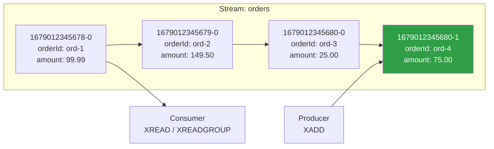
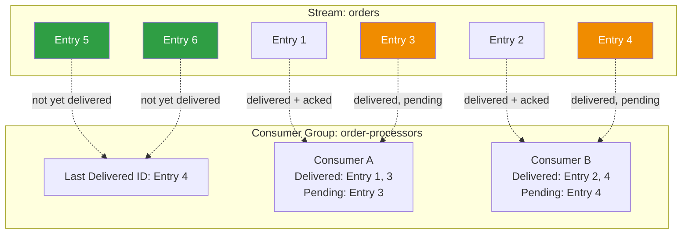

# Redis Streams

Redis Streams (introduced in Redis 5.0) bring log-based message streaming to Redis. They share conceptual DNA with Kafka — append-only logs, consumer groups, offset tracking — but live inside your Redis instance, which means zero additional infrastructure if you already run Redis. This makes them ideal for moderate-throughput event streaming where you don't want the operational overhead of a dedicated Kafka cluster.

Redis Streams are not a toy. They support consumer groups with at-least-once delivery, pending entry lists for tracking unacknowledged messages, message claiming for handling dead consumers, and persistence through RDB/AOF. They're a serious messaging primitive that fills the gap between "we need Kafka" and "we don't want to run Kafka."

## Stream Data Structure

A Redis Stream is an append-only log data structure. Each entry has:

- **An ID:** A unique, time-ordered identifier in the format `<millisecondsTimestamp>-<sequenceNumber>` (e.g., `1679012345678-0`). IDs are auto-generated by default but can be partially or fully specified by the client.
- **Field-value pairs:** The message payload, stored as a hash-like structure.



Stream IDs are guaranteed to be monotonically increasing. If two entries arrive in the same millisecond, the sequence number differentiates them (`1679012345680-0` and `1679012345680-1`). This gives you a natural time-ordered log without maintaining an explicit offset counter.

## Core Commands

### XADD — Adding Entries

`XADD` appends an entry to a stream. If the stream doesn't exist, it's created.

```
XADD stream_name [MAXLEN | MINID [= | ~] threshold] [NOMKSTREAM] * | id field value [field value ...]
```

- `*` tells Redis to auto-generate the ID
- `MAXLEN ~ 10000` caps the stream at approximately 10,000 entries (the `~` allows Redis to be efficient by deleting entries in macro-nodes rather than precisely trimming)
- `MINID ~ 1679012345678-0` removes entries older than the specified ID

```typescript
import Redis from 'ioredis';

const redis = new Redis({ host: 'localhost', port: 6379 });

// Basic XADD
const entryId = await redis.xadd('orders', '*',
  'orderId', 'ord-123',
  'userId', 'user-456',
  'amount', '99.99',
  'currency', 'USD',
);
console.log(`Added entry: ${entryId}`); // e.g., "1679012345678-0"

// XADD with MAXLEN to cap stream size
await redis.xadd('orders', 'MAXLEN', '~', '100000', '*',
  'orderId', 'ord-124',
  'userId', 'user-789',
  'amount', '149.50',
  'currency', 'USD',
);

// XADD with explicit ID (rare — usually auto-generate)
await redis.xadd('orders', '1679012345999-0',
  'orderId', 'ord-125',
  'userId', 'user-101',
  'amount', '25.00',
  'currency', 'EUR',
);
```

### XREAD — Reading Entries

`XREAD` reads entries from one or more streams, optionally blocking until new entries arrive.

```typescript
// Read up to 10 entries newer than the given ID
const entries = await redis.xread('COUNT', '10', 'STREAMS', 'orders', '0-0');
// entries = [['orders', [['1679012345678-0', ['orderId', 'ord-123', ...]], ...]]]

// Block for up to 5 seconds waiting for new entries
// '$' means "only entries added after the XREAD call"
const newEntries = await redis.xread('BLOCK', '5000', 'COUNT', '10', 'STREAMS', 'orders', '$');

// Read from multiple streams simultaneously
const multiEntries = await redis.xread(
  'BLOCK', '5000', 'COUNT', '10',
  'STREAMS', 'orders', 'payments', '$', '$',
);
```

### XRANGE / XREVRANGE — Range Queries

`XRANGE` returns entries within a range of IDs. This is something Kafka can't do natively — you can query by time range without maintaining a secondary index.

```typescript
// All entries from beginning to end
const allEntries = await redis.xrange('orders', '-', '+');

// Entries in a time range (IDs are millisecond timestamps)
const startMs = Date.now() - 3600000; // Last hour
const entries = await redis.xrange('orders', `${startMs}-0`, '+');

// Entries in a specific ID range with a count limit
const page = await redis.xrange('orders', '1679012345678-0', '+', 'COUNT', '100');

// Reverse range (newest first)
const latest = await redis.xrevrange('orders', '+', '-', 'COUNT', '5');
```

### XLEN and XINFO

```typescript
// Number of entries in the stream
const length = await redis.xlen('orders');

// Detailed stream info
const info = await redis.xinfo('STREAM', 'orders');
// Returns: length, radix-tree-keys, radix-tree-nodes, last-generated-id,
// groups, first-entry, last-entry

// Info about consumer groups
const groupInfo = await redis.xinfo('GROUPS', 'orders');

// Info about consumers within a group
const consumerInfo = await redis.xinfo('CONSUMERS', 'orders', 'order-processors');
```

### XTRIM — Trimming the Stream

```typescript
// Trim to approximately 10,000 entries
await redis.xtrim('orders', 'MAXLEN', '~', '10000');

// Trim entries older than a specific ID
await redis.xtrim('orders', 'MINID', '~', `${Date.now() - 86400000}-0`);
```

### XDEL — Deleting Specific Entries

```typescript
// Delete specific entries by ID
await redis.xdel('orders', '1679012345678-0', '1679012345679-0');
```

Note: `XDEL` marks entries as deleted but doesn't immediately reclaim memory. The entry is removed from the stream's logical view but the memory is reclaimed when the radix tree node is reorganized.

## Consumer Groups

Consumer groups provide Kafka-like semantics: multiple consumers cooperatively consume a stream, with each entry delivered to exactly one consumer in the group. Redis tracks which entries have been delivered and acknowledged.



### Creating Consumer Groups

```typescript
// Create a consumer group starting from the beginning of the stream
await redis.xgroup('CREATE', 'orders', 'order-processors', '0', 'MKSTREAM');

// Create a consumer group starting from new entries only
await redis.xgroup('CREATE', 'orders', 'notification-senders', '$', 'MKSTREAM');

// Create a consumer group starting from a specific ID
await redis.xgroup('CREATE', 'orders', 'analytics', '1679012345678-0', 'MKSTREAM');
```

### XREADGROUP — Reading as a Consumer Group Member

```typescript
// Read entries as consumer 'worker-1' in group 'order-processors'
// '>' means "give me entries that haven't been delivered to any consumer in this group"
const entries = await redis.xreadgroup(
  'GROUP', 'order-processors', 'worker-1',
  'COUNT', '10',
  'BLOCK', '5000',
  'STREAMS', 'orders', '>',
);

// Read entries that were previously delivered to THIS consumer but not yet acknowledged
// (useful after a crash/restart to reprocess pending entries)
const pending = await redis.xreadgroup(
  'GROUP', 'order-processors', 'worker-1',
  'COUNT', '10',
  'STREAMS', 'orders', '0', // '0' means "give me my pending entries"
);
```

### XACK — Acknowledging Entries

After processing an entry, the consumer must acknowledge it. Unacknowledged entries remain in the **Pending Entries List (PEL)** and will be redelivered.

```typescript
// Acknowledge a single entry
await redis.xack('orders', 'order-processors', '1679012345678-0');

// Acknowledge multiple entries
await redis.xack('orders', 'order-processors',
  '1679012345678-0',
  '1679012345679-0',
  '1679012345680-0',
);
```

### XPENDING — Inspecting the Pending Entry List

The PEL tracks entries that have been delivered to consumers but not yet acknowledged. This is how Redis knows which entries need redelivery.

```typescript
// Summary of pending entries for the group
const summary = await redis.xpending('orders', 'order-processors');
// Returns: [totalPending, smallestId, largestId, [[consumerName, count], ...]]

// Detailed pending entries (which consumer, how many times delivered, idle time)
const details = await redis.xpending(
  'orders', 'order-processors',
  '-', '+', '10', // range and count
);
// Returns: [[entryId, consumerName, idleTimeMs, deliveryCount], ...]

// Pending entries for a specific consumer
const consumerPending = await redis.xpending(
  'orders', 'order-processors',
  '-', '+', '10',
  'worker-1',
);
```

### XCLAIM — Claiming Entries from Dead Consumers

When a consumer dies, its pending entries are stuck. `XCLAIM` lets another consumer take ownership of those entries.

```typescript
// Claim entries that have been idle for more than 60 seconds
// This transfers ownership from the dead consumer to 'worker-2'
const claimed = await redis.xclaim(
  'orders', 'order-processors', 'worker-2',
  60000, // min-idle-time in milliseconds
  '1679012345678-0', '1679012345679-0',
);
// Returns the full entries so the new consumer can process them

// XAUTOCLAIM (Redis 6.2+) — automatically claim idle entries
// Returns entries that have been idle for more than 60 seconds
const [nextStartId, claimedEntries] = await redis.xautoclaim(
  'orders', 'order-processors', 'worker-2',
  60000, // min-idle-time
  '0-0', // start scanning from this ID
  'COUNT', '10',
);
```

## PEL Management and Dead Consumer Recovery

The Pending Entries List is the foundation of at-least-once delivery in Redis Streams. Managing it correctly is critical for reliable message processing.

### The PEL Lifecycle

1. **Entry delivered:** Consumer calls `XREADGROUP` with `>`. Entry is added to the PEL with `deliveryCount = 1`.
2. **Entry acknowledged:** Consumer calls `XACK`. Entry is removed from the PEL.
3. **Consumer dies:** Entry stays in PEL. Idle time grows.
4. **Entry claimed:** Another consumer calls `XCLAIM` or `XAUTOCLAIM`. Entry moves to the new consumer's PEL. Delivery count increments.
5. **Max retries exceeded:** Application logic detects high delivery count and routes to a DLQ.

```typescript
class PELManager {
  private redis: Redis;

  constructor(redis: Redis) {
    this.redis = redis;
  }

  async recoverDeadConsumerEntries(
    stream: string,
    group: string,
    claimingConsumer: string,
    maxIdleMs: number = 60000,
    maxRetries: number = 5,
    batchSize: number = 100,
  ): Promise<void> {
    let startId = '0-0';

    while (true) {
      const result = await this.redis.xautoclaim(
        stream, group, claimingConsumer,
        maxIdleMs, startId,
        'COUNT', String(batchSize),
      );

      const nextId = result[0] as string;
      const entries = result[1] as Array<[string, string[]]>;

      if (entries.length === 0) break;

      for (const [entryId, fields] of entries) {
        // Check delivery count
        const pendingInfo = await this.redis.xpending(
          stream, group, entryId, entryId, '1',
        );

        const deliveryCount = pendingInfo[0]?.[3] ?? 0;

        if (Number(deliveryCount) > maxRetries) {
          // Max retries exceeded — send to DLQ
          await this.sendToDeadLetterQueue(stream, group, entryId, fields);
          await this.redis.xack(stream, group, entryId);
          continue;
        }

        // Attempt to process
        try {
          await this.processEntry(entryId, fields);
          await this.redis.xack(stream, group, entryId);
        } catch (error) {
          // Leave in PEL for next recovery cycle
          console.error(`Failed to process recovered entry ${entryId}:`, error);
        }
      }

      if (nextId === '0-0') break; // No more entries to scan
      startId = nextId;
    }
  }

  private async sendToDeadLetterQueue(
    stream: string,
    group: string,
    entryId: string,
    fields: string[],
  ): Promise<void> {
    const dlqStream = `${stream}:dlq`;
    const fieldPairs: string[] = [
      'original-stream', stream,
      'original-group', group,
      'original-id', entryId,
      'dlq-timestamp', String(Date.now()),
      ...fields,
    ];

    await this.redis.xadd(dlqStream, '*', ...fieldPairs);
  }

  private async processEntry(entryId: string, fields: string[]): Promise<void> {
    // Convert fields array to object
    const data: Record<string, string> = {};
    for (let i = 0; i < fields.length; i += 2) {
      data[fields[i]] = fields[i + 1];
    }
    // Business logic here
    console.log(`Processing recovered entry ${entryId}:`, data);
  }
}
```

## Comparison with Kafka

| Dimension | Redis Streams | Apache Kafka |
|---|---|---|
| **Architecture** | Single-node or Redis Cluster (sharded) | Multi-broker cluster with replication |
| **Storage** | In-memory with RDB/AOF persistence | On-disk with sequential I/O and page cache |
| **Throughput** | ~100K-500K messages/sec per instance | Millions of messages/sec per cluster |
| **Retention** | `MAXLEN` or `MINID` trimming; bound by memory | Time-based or size-based; bound by disk |
| **Consumer groups** | Built-in, similar to Kafka's | Built-in, more mature |
| **Exactly-once** | Not built-in (at-least-once with PEL) | Built-in with idempotent producer + transactions |
| **Ordering** | Total order per stream (single stream = single partition) | Per-partition ordering |
| **Partitioning** | Manual via Redis Cluster hash slots | Built-in partition management |
| **Replay** | Yes (XRANGE, XREAD from any ID) | Yes (seek to any offset) |
| **Log compaction** | No | Yes (keep latest value per key) |
| **Schema management** | None | Schema Registry integration |
| **Operational overhead** | Low (if Redis already deployed) | High (ZooKeeper/KRaft, brokers, monitoring) |
| **Client ecosystem** | Any Redis client | Dedicated Kafka clients (kafkajs, etc.) |

## When to Use Redis Streams vs Kafka

### Choose Redis Streams When

- You already run Redis and don't want another infrastructure component
- Your message volume is moderate (under 500K messages/sec)
- Your total data volume fits in memory (or you're comfortable with stream trimming)
- You need simple pub/sub with consumer group semantics
- You need time-range queries on your message log
- You're building a lightweight event bus within a single service or small microservice architecture
- You need low-latency message delivery (sub-millisecond in Redis vs single-digit milliseconds in Kafka)

### Choose Kafka When

- You need millions of messages per second
- You need days or weeks of message retention
- You need exactly-once processing guarantees
- You need log compaction for stateful event sourcing
- You need a mature ecosystem (Kafka Connect, Kafka Streams, Schema Registry, MirrorMaker)
- You're building a large-scale event-driven architecture with many teams and services
- You need multi-datacenter replication

### The Middle Ground

Some teams use both: Redis Streams for low-latency, ephemeral messaging within a service boundary, and Kafka for durable, cross-service event streaming. A service might use Redis Streams internally for task distribution among its workers, while publishing important events to Kafka for other services to consume.

## Complete TypeScript Implementation

A full Redis Streams consumer with consumer groups, PEL recovery, graceful shutdown, and DLQ handling:

```typescript
import Redis from 'ioredis';

interface StreamConsumerConfig {
  redisUrl: string;
  stream: string;
  group: string;
  consumer: string;
  batchSize: number;
  blockTimeMs: number;
  maxRetries: number;
  claimIdleMs: number;
  claimIntervalMs: number;
}

type MessageHandler = (
  id: string,
  fields: Record<string, string>,
) => Promise<void>;

class RedisStreamConsumer {
  private redis: Redis;
  private isRunning = false;
  private claimTimer: ReturnType<typeof setInterval> | null = null;

  constructor(
    private config: StreamConsumerConfig,
    private handler: MessageHandler,
  ) {
    this.redis = new Redis(config.redisUrl);
  }

  async start(): Promise<void> {
    // Create consumer group if it doesn't exist
    try {
      await this.redis.xgroup(
        'CREATE', this.config.stream, this.config.group,
        '0', 'MKSTREAM',
      );
    } catch (error: any) {
      // Group already exists — that's fine
      if (!error.message.includes('BUSYGROUP')) throw error;
    }

    this.isRunning = true;

    // Process any pending entries from a previous crash first
    await this.processPendingEntries();

    // Start claiming idle entries periodically
    this.claimTimer = setInterval(
      () => this.claimIdleEntries(),
      this.config.claimIntervalMs,
    );

    // Main consume loop
    await this.consumeLoop();
  }

  private async consumeLoop(): Promise<void> {
    while (this.isRunning) {
      try {
        const result = await this.redis.xreadgroup(
          'GROUP', this.config.group, this.config.consumer,
          'COUNT', String(this.config.batchSize),
          'BLOCK', String(this.config.blockTimeMs),
          'STREAMS', this.config.stream, '>',
        );

        if (!result) continue; // Timed out, no new entries

        const [, entries] = result[0] as [string, Array<[string, string[]]>];

        for (const [id, fieldArray] of entries) {
          const fields = this.parseFields(fieldArray);

          try {
            await this.handler(id, fields);
            await this.redis.xack(this.config.stream, this.config.group, id);
          } catch (error) {
            console.error(`Error processing entry ${id}:`, error);
            // Leave unacked — PEL will track it for retry or claiming
          }
        }
      } catch (error) {
        if (this.isRunning) {
          console.error('Error in consume loop:', error);
          await this.sleep(1000); // Brief pause before retrying
        }
      }
    }
  }

  private async processPendingEntries(): Promise<void> {
    let startId = '0-0';

    while (this.isRunning) {
      const result = await this.redis.xreadgroup(
        'GROUP', this.config.group, this.config.consumer,
        'COUNT', String(this.config.batchSize),
        'STREAMS', this.config.stream, startId,
      );

      if (!result) break;

      const [, entries] = result[0] as [string, Array<[string, string[]]>];
      if (entries.length === 0) break;

      for (const [id, fieldArray] of entries) {
        const fields = this.parseFields(fieldArray);

        // Check delivery count
        const pendingInfo = await this.redis.xpending(
          this.config.stream, this.config.group,
          id, id, '1',
        );

        const deliveryCount = Number(pendingInfo[0]?.[3] ?? 0);

        if (deliveryCount > this.config.maxRetries) {
          await this.sendToDLQ(id, fields, 'max_retries_exceeded');
          await this.redis.xack(this.config.stream, this.config.group, id);
          continue;
        }

        try {
          await this.handler(id, fields);
          await this.redis.xack(this.config.stream, this.config.group, id);
        } catch (error) {
          console.error(`Error processing pending entry ${id}:`, error);
        }

        startId = id; // Continue from after this entry
      }
    }
  }

  private async claimIdleEntries(): Promise<void> {
    try {
      let startId = '0-0';

      while (true) {
        const result = await this.redis.xautoclaim(
          this.config.stream, this.config.group, this.config.consumer,
          this.config.claimIdleMs, startId,
          'COUNT', '50',
        );

        const nextId = result[0] as string;
        const entries = result[1] as Array<[string, string[]]>;

        if (entries.length === 0) break;

        for (const [id, fieldArray] of entries) {
          const fields = this.parseFields(fieldArray);

          const pendingInfo = await this.redis.xpending(
            this.config.stream, this.config.group, id, id, '1',
          );
          const deliveryCount = Number(pendingInfo[0]?.[3] ?? 0);

          if (deliveryCount > this.config.maxRetries) {
            await this.sendToDLQ(id, fields, 'max_retries_exceeded');
            await this.redis.xack(this.config.stream, this.config.group, id);
            continue;
          }

          try {
            await this.handler(id, fields);
            await this.redis.xack(this.config.stream, this.config.group, id);
          } catch (error) {
            console.error(`Error processing claimed entry ${id}:`, error);
          }
        }

        if (nextId === '0-0') break;
        startId = nextId;
      }
    } catch (error) {
      console.error('Error claiming idle entries:', error);
    }
  }

  private async sendToDLQ(
    id: string,
    fields: Record<string, string>,
    reason: string,
  ): Promise<void> {
    const dlqStream = `${this.config.stream}:dlq`;
    const dlqFields: string[] = [];

    for (const [key, value] of Object.entries(fields)) {
      dlqFields.push(key, value);
    }
    dlqFields.push(
      'dlq:original-id', id,
      'dlq:original-stream', this.config.stream,
      'dlq:original-group', this.config.group,
      'dlq:reason', reason,
      'dlq:timestamp', String(Date.now()),
    );

    await this.redis.xadd(dlqStream, '*', ...dlqFields);
    console.log(`Entry ${id} sent to DLQ: ${reason}`);
  }

  private parseFields(fieldArray: string[]): Record<string, string> {
    const fields: Record<string, string> = {};
    for (let i = 0; i < fieldArray.length; i += 2) {
      fields[fieldArray[i]] = fieldArray[i + 1];
    }
    return fields;
  }

  private sleep(ms: number): Promise<void> {
    return new Promise((resolve) => setTimeout(resolve, ms));
  }

  async stop(): Promise<void> {
    this.isRunning = false;
    if (this.claimTimer) {
      clearInterval(this.claimTimer);
    }

    // Remove consumer from the group (optional — releases PEL entries)
    try {
      await this.redis.xgroup(
        'DELCONSUMER', this.config.stream, this.config.group, this.config.consumer,
      );
    } catch (error) {
      // Consumer may not exist if it was already removed
    }

    await this.redis.quit();
    console.log('Redis Stream consumer stopped');
  }
}

// Usage
const consumer = new RedisStreamConsumer(
  {
    redisUrl: 'redis://localhost:6379',
    stream: 'orders',
    group: 'order-processors',
    consumer: `worker-${process.env.HOSTNAME ?? process.pid}`,
    batchSize: 10,
    blockTimeMs: 5000,
    maxRetries: 5,
    claimIdleMs: 60000,
    claimIntervalMs: 30000,
  },
  async (id, fields) => {
    console.log(`Processing order ${fields.orderId}: $${fields.amount}`);
    // Your business logic here
  },
);

process.on('SIGINT', () => consumer.stop());
process.on('SIGTERM', () => consumer.stop());

consumer.start().catch(console.error);
```

## Producer Implementation

```typescript
class RedisStreamProducer {
  private redis: Redis;

  constructor(redisUrl: string) {
    this.redis = new Redis(redisUrl);
  }

  async publish(
    stream: string,
    data: Record<string, string>,
    options?: {
      maxLen?: number;
      approximateTrimming?: boolean;
    },
  ): Promise<string> {
    const fields: string[] = [];
    for (const [key, value] of Object.entries(data)) {
      fields.push(key, value);
    }

    if (options?.maxLen) {
      const trimOp = options.approximateTrimming ? '~' : '=';
      return redis.xadd(
        stream, 'MAXLEN', trimOp, String(options.maxLen), '*', ...fields,
      );
    }

    return redis.xadd(stream, '*', ...fields);
  }

  async publishBatch(
    stream: string,
    messages: Array<Record<string, string>>,
    maxLen?: number,
  ): Promise<string[]> {
    const pipeline = this.redis.pipeline();

    for (const data of messages) {
      const fields: string[] = [];
      for (const [key, value] of Object.entries(data)) {
        fields.push(key, value);
      }

      if (maxLen) {
        pipeline.xadd(stream, 'MAXLEN', '~', String(maxLen), '*', ...fields);
      } else {
        pipeline.xadd(stream, '*', ...fields);
      }
    }

    const results = await pipeline.exec();
    return (results ?? []).map(([, id]) => id as string);
  }

  async close(): Promise<void> {
    await this.redis.quit();
  }
}

// Usage
const producer = new RedisStreamProducer('redis://localhost:6379');

await producer.publish('orders', {
  orderId: 'ord-123',
  userId: 'user-456',
  amount: '99.99',
  currency: 'USD',
}, { maxLen: 100000, approximateTrimming: true });

// Batch publish for higher throughput
await producer.publishBatch('orders', [
  { orderId: 'ord-124', userId: 'user-789', amount: '50.00', currency: 'USD' },
  { orderId: 'ord-125', userId: 'user-101', amount: '75.00', currency: 'EUR' },
  { orderId: 'ord-126', userId: 'user-102', amount: '120.00', currency: 'GBP' },
], 100000);
```

## Performance Considerations

**Memory:** Redis Streams are stored in memory. Each entry overhead is approximately 100-200 bytes plus the field/value data. A stream with 1 million entries, each with 500 bytes of payload, uses approximately 600-700 MB of RAM. Use `MAXLEN` or `MINID` to cap memory usage.

**Throughput:** A single Redis instance can handle 100K-500K XADD operations per second, depending on payload size and persistence configuration. Redis Cluster provides horizontal scaling by distributing streams across shards, but a single stream lives on a single shard.

**Persistence:** Configure `appendonly yes` with `appendfsync everysec` for good durability. `appendfsync always` provides the strongest guarantees but reduces throughput significantly. Without AOF, data is lost on restart (only RDB snapshots are available, which may be stale).

**Consumer groups vs simple XREAD:** Consumer groups add overhead due to PEL management. If you don't need at-least-once delivery semantics, simple `XREAD` with application-managed cursors is faster.
