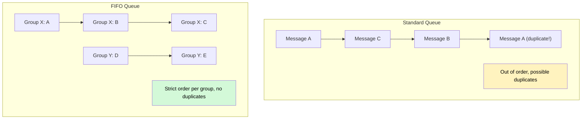
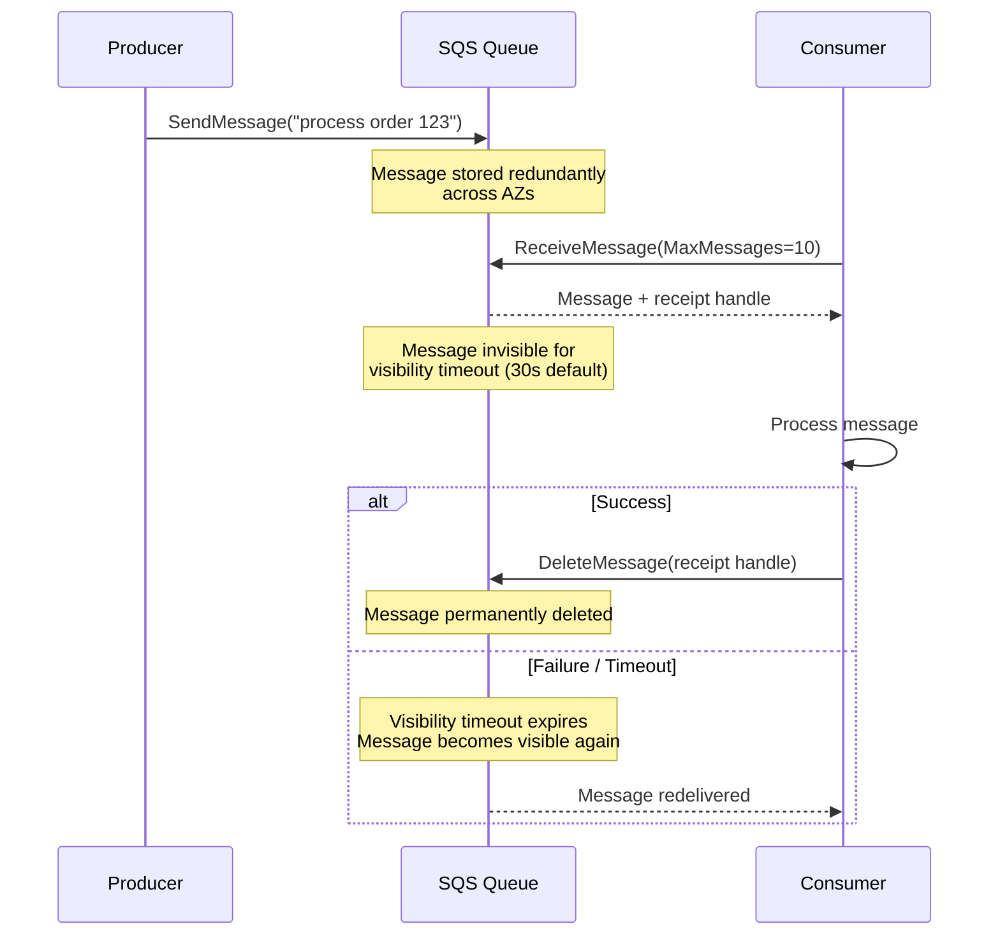
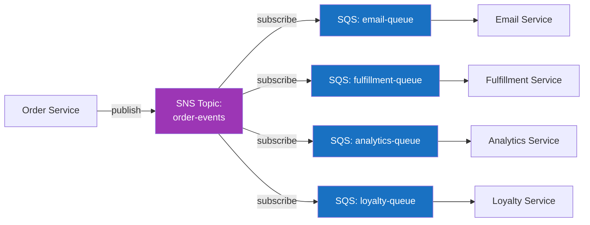

# SQS & SNS

Amazon SQS (Simple Queue Service) and SNS (Simple Notification Service) are AWS's managed messaging services. They eliminate the operational burden of running message brokers — no servers to provision, no clusters to monitor, no disks to manage. You pay per API call and per data transfer, and AWS handles availability, durability, and scaling.

SQS provides point-to-point queuing. SNS provides pub/sub fan-out. Together, they form the backbone of event-driven architectures on AWS. Understanding their semantics, guarantees, and limitations is essential for building reliable serverless and microservice systems on AWS.

## Amazon SQS

### Standard Queues vs FIFO Queues

SQS offers two queue types with fundamentally different guarantees:

| Feature | Standard Queue | FIFO Queue |
|---|---|---|
| **Throughput** | Nearly unlimited (~120,000 in-flight messages) | 300 messages/sec (3,000 with batching, 70,000 with high throughput mode) |
| **Ordering** | Best-effort ordering (no guarantee) | Strict ordering within a message group |
| **Delivery** | At-least-once (possible duplicates) | Exactly-once processing (within the 5-minute deduplication window) |
| **Deduplication** | None built-in | Content-based or explicit deduplication ID |
| **Name** | Any valid name | Must end with `.fifo` suffix |
| **Price** | Lower | ~20% more expensive |



### How SQS Works Internally

When a producer sends a message to SQS, the message is redundantly stored across multiple AWS availability zones. When a consumer calls `ReceiveMessage`, SQS selects messages and makes them temporarily invisible to other consumers (the **visibility timeout**). The consumer processes the message and calls `DeleteMessage`. If the consumer doesn't delete the message within the visibility timeout, the message becomes visible again and can be processed by another consumer.



### Visibility Timeout

The visibility timeout is the period during which a message is hidden from other consumers after being received. It prevents multiple consumers from processing the same message simultaneously.

- **Default:** 30 seconds
- **Range:** 0 seconds to 12 hours
- **If processing takes longer than the timeout:** The message becomes visible and another consumer may pick it up, causing duplicate processing
- **Solution:** Call `ChangeMessageVisibility` to extend the timeout during processing

```typescript
import {
  SQSClient,
  SendMessageCommand,
  ReceiveMessageCommand,
  DeleteMessageCommand,
  ChangeMessageVisibilityCommand,
} from '@aws-sdk/client-sqs';

const sqs = new SQSClient({ region: 'us-east-1' });
const QUEUE_URL = 'https://sqs.us-east-1.amazonaws.com/123456789/orders';

// Extend visibility timeout during long processing
async function processWithExtendedVisibility(): Promise<void> {
  const { Messages } = await sqs.send(new ReceiveMessageCommand({
    QueueUrl: QUEUE_URL,
    MaxNumberOfMessages: 1,
    VisibilityTimeout: 30,
    WaitTimeSeconds: 20, // Long polling
  }));

  if (!Messages?.length) return;

  const message = Messages[0];
  const receiptHandle = message.ReceiptHandle!;

  // Set up a timer to extend visibility every 20 seconds
  const extender = setInterval(async () => {
    try {
      await sqs.send(new ChangeMessageVisibilityCommand({
        QueueUrl: QUEUE_URL,
        ReceiptHandle: receiptHandle,
        VisibilityTimeout: 30,
      }));
    } catch (error) {
      console.error('Failed to extend visibility:', error);
    }
  }, 20000); // Extend 10 seconds before expiry

  try {
    const body = JSON.parse(message.Body!);
    await processOrder(body); // May take several minutes

    await sqs.send(new DeleteMessageCommand({
      QueueUrl: QUEUE_URL,
      ReceiptHandle: receiptHandle,
    }));
  } finally {
    clearInterval(extender);
  }
}
```

### Dead Letter Queues

SQS has built-in DLQ support. You configure a **redrive policy** on the source queue that specifies:

- **deadLetterTargetArn:** The ARN of the DLQ
- **maxReceiveCount:** How many times a message can be received before being moved to the DLQ

When a message's receive count exceeds `maxReceiveCount`, SQS automatically moves it to the DLQ.

```typescript
import {
  SQSClient,
  CreateQueueCommand,
  SetQueueAttributesCommand,
  GetQueueAttributesCommand,
} from '@aws-sdk/client-sqs';

const sqs = new SQSClient({ region: 'us-east-1' });

async function createQueueWithDLQ(): Promise<void> {
  // Create the DLQ first
  const dlq = await sqs.send(new CreateQueueCommand({
    QueueName: 'orders-dlq',
    Attributes: {
      MessageRetentionPeriod: '1209600', // 14 days (max)
    },
  }));

  // Get the DLQ ARN
  const dlqAttrs = await sqs.send(new GetQueueAttributesCommand({
    QueueUrl: dlq.QueueUrl!,
    AttributeNames: ['QueueArn'],
  }));
  const dlqArn = dlqAttrs.Attributes!.QueueArn!;

  // Create the main queue with redrive policy
  await sqs.send(new CreateQueueCommand({
    QueueName: 'orders',
    Attributes: {
      VisibilityTimeout: '60',
      MessageRetentionPeriod: '345600', // 4 days
      RedrivePolicy: JSON.stringify({
        deadLetterTargetArn: dlqArn,
        maxReceiveCount: 3, // Move to DLQ after 3 failed attempts
      }),
    },
  }));
}
```

### Long Polling

By default, `ReceiveMessage` returns immediately even if no messages are available (short polling). This wastes API calls and money. **Long polling** keeps the connection open for up to 20 seconds, waiting for messages to arrive.

```typescript
// Long polling — saves money, reduces empty responses
const { Messages } = await sqs.send(new ReceiveMessageCommand({
  QueueUrl: QUEUE_URL,
  MaxNumberOfMessages: 10,
  WaitTimeSeconds: 20, // Long poll for 20 seconds
  MessageAttributeNames: ['All'],
  AttributeNames: ['All'],
}));
```

Long polling reduces the number of empty responses and thus reduces cost. Always use `WaitTimeSeconds: 20` unless you have a specific reason for short polling.

### Message Deduplication (FIFO)

FIFO queues prevent duplicate processing using two mechanisms:

**Content-based deduplication:** SQS computes a SHA-256 hash of the message body and uses it as the deduplication ID. If the same hash appears within 5 minutes, the duplicate is rejected.

**Explicit deduplication ID:** The producer provides a `MessageDeduplicationId` that uniquely identifies the message. Preferred over content-based because it handles cases where the same logical operation produces different message bodies (timestamps, UUIDs).

```typescript
import { SendMessageCommand } from '@aws-sdk/client-sqs';

const FIFO_QUEUE_URL = 'https://sqs.us-east-1.amazonaws.com/123456789/orders.fifo';

// FIFO with explicit deduplication
await sqs.send(new SendMessageCommand({
  QueueUrl: FIFO_QUEUE_URL,
  MessageBody: JSON.stringify({
    orderId: 'ord-123',
    action: 'process',
    timestamp: Date.now(),
  }),
  MessageGroupId: 'ord-123', // Messages in the same group are ordered
  MessageDeduplicationId: 'ord-123-process-v1', // Unique operation ID
}));

// Messages with the same deduplication ID within 5 minutes are silently discarded
await sqs.send(new SendMessageCommand({
  QueueUrl: FIFO_QUEUE_URL,
  MessageBody: JSON.stringify({
    orderId: 'ord-123',
    action: 'process',
    timestamp: Date.now(), // Different body, same dedup ID
  }),
  MessageGroupId: 'ord-123',
  MessageDeduplicationId: 'ord-123-process-v1', // Duplicate — will be ignored
}));
```

### Message Group ID (FIFO)

The `MessageGroupId` partitions a FIFO queue into message groups. Ordering is guaranteed within a group but not across groups. Different groups can be processed in parallel.

This is conceptually similar to Kafka partitions — the message group ID is the partitioning key.

```typescript
// All events for order 123 are processed in order
await sqs.send(new SendMessageCommand({
  QueueUrl: FIFO_QUEUE_URL,
  MessageBody: JSON.stringify({ orderId: 'ord-123', event: 'created' }),
  MessageGroupId: 'ord-123',
  MessageDeduplicationId: 'ord-123-created',
}));

await sqs.send(new SendMessageCommand({
  QueueUrl: FIFO_QUEUE_URL,
  MessageBody: JSON.stringify({ orderId: 'ord-123', event: 'paid' }),
  MessageGroupId: 'ord-123',
  MessageDeduplicationId: 'ord-123-paid',
}));

// Order 456 events can be processed concurrently with order 123
await sqs.send(new SendMessageCommand({
  QueueUrl: FIFO_QUEUE_URL,
  MessageBody: JSON.stringify({ orderId: 'ord-456', event: 'created' }),
  MessageGroupId: 'ord-456',
  MessageDeduplicationId: 'ord-456-created',
}));
```

### Batch Operations

SQS supports batch send, receive, and delete. Batching reduces API calls and cost (you pay per request, and a batch counts as one request for up to 10 messages).

```typescript
import {
  SendMessageBatchCommand,
  DeleteMessageBatchCommand,
} from '@aws-sdk/client-sqs';

// Batch send (up to 10 messages)
await sqs.send(new SendMessageBatchCommand({
  QueueUrl: QUEUE_URL,
  Entries: Array.from({ length: 10 }, (_, i) => ({
    Id: `msg-${i}`,
    MessageBody: JSON.stringify({ orderId: `ord-${i}`, amount: Math.random() * 100 }),
    // For FIFO:
    // MessageGroupId: `ord-${i}`,
    // MessageDeduplicationId: `ord-${i}-created`,
  })),
}));

// Batch delete (up to 10 messages)
// Use receipt handles from ReceiveMessage responses
await sqs.send(new DeleteMessageBatchCommand({
  QueueUrl: QUEUE_URL,
  Entries: processedMessages.map((msg, i) => ({
    Id: `del-${i}`,
    ReceiptHandle: msg.ReceiptHandle!,
  })),
}));
```

## Amazon SNS

SNS is a pub/sub service. Producers publish messages to **topics**, and subscribers receive messages from topics. Unlike SQS (point-to-point), SNS delivers a copy of each message to every subscriber.

### Topics and Subscriptions

An SNS topic is a communication channel. Subscribers can be:

- **SQS queues** (most common for service-to-service messaging)
- **Lambda functions** (serverless event processing)
- **HTTP/S endpoints** (webhook callbacks)
- **Email** (human notifications)
- **SMS** (text messages)
- **Kinesis Data Firehose** (data streaming to S3, Redshift, etc.)
- **Platform application endpoints** (mobile push notifications)

```typescript
import {
  SNSClient,
  CreateTopicCommand,
  SubscribeCommand,
  PublishCommand,
} from '@aws-sdk/client-sns';

const sns = new SNSClient({ region: 'us-east-1' });

// Create a topic
const topic = await sns.send(new CreateTopicCommand({
  Name: 'order-events',
}));
const topicArn = topic.TopicArn!;

// Subscribe an SQS queue
await sns.send(new SubscribeCommand({
  TopicArn: topicArn,
  Protocol: 'sqs',
  Endpoint: 'arn:aws:sqs:us-east-1:123456789:order-processor',
  Attributes: {
    RawMessageDelivery: 'true', // Deliver the raw message, not wrapped in SNS envelope
  },
}));

// Subscribe a Lambda function
await sns.send(new SubscribeCommand({
  TopicArn: topicArn,
  Protocol: 'lambda',
  Endpoint: 'arn:aws:lambda:us-east-1:123456789:function:process-order',
}));

// Subscribe an HTTP endpoint
await sns.send(new SubscribeCommand({
  TopicArn: topicArn,
  Protocol: 'https',
  Endpoint: 'https://api.example.com/webhooks/orders',
}));

// Publish a message
await sns.send(new PublishCommand({
  TopicArn: topicArn,
  Message: JSON.stringify({
    eventType: 'OrderPlaced',
    orderId: 'ord-123',
    userId: 'user-456',
    amount: 99.99,
  }),
  MessageAttributes: {
    eventType: { DataType: 'String', StringValue: 'OrderPlaced' },
    region: { DataType: 'String', StringValue: 'us-east-1' },
  },
}));
```

### Message Filtering

SNS supports subscription filter policies that let subscribers receive only messages that match specific criteria. This is evaluated server-side, so filtered-out messages never reach the subscriber, saving cost and processing.

```typescript
// Subscriber only receives OrderPlaced events
await sns.send(new SubscribeCommand({
  TopicArn: topicArn,
  Protocol: 'sqs',
  Endpoint: 'arn:aws:sqs:us-east-1:123456789:new-order-handler',
  Attributes: {
    RawMessageDelivery: 'true',
    FilterPolicy: JSON.stringify({
      eventType: ['OrderPlaced'],
    }),
    FilterPolicyScope: 'MessageAttributes', // or 'MessageBody' for body-based filtering
  },
}));

// Subscriber only receives events for orders over $100
await sns.send(new SubscribeCommand({
  TopicArn: topicArn,
  Protocol: 'sqs',
  Endpoint: 'arn:aws:sqs:us-east-1:123456789:high-value-orders',
  Attributes: {
    RawMessageDelivery: 'true',
    FilterPolicy: JSON.stringify({
      eventType: ['OrderPlaced', 'OrderUpdated'],
      amount: [{ numeric: ['>', 100] }],
    }),
    FilterPolicyScope: 'MessageAttributes',
  },
}));

// Body-based filtering (available since 2022)
await sns.send(new SubscribeCommand({
  TopicArn: topicArn,
  Protocol: 'sqs',
  Endpoint: 'arn:aws:sqs:us-east-1:123456789:eu-orders',
  Attributes: {
    RawMessageDelivery: 'true',
    FilterPolicy: JSON.stringify({
      region: ['eu-west-1', 'eu-central-1'],
    }),
    FilterPolicyScope: 'MessageBody',
  },
}));
```

Filter policy operators:

| Operator | Example | Matches |
|---|---|---|
| Exact match | `["OrderPlaced"]` | `eventType = "OrderPlaced"` |
| Anything-but | `[{"anything-but": ["test"]}]` | Any value except "test" |
| Prefix | `[{"prefix": "order"}]` | Values starting with "order" |
| Numeric range | `[{"numeric": [">", 100, "<=", 1000]}]` | 100 < value <= 1000 |
| Exists | `[{"exists": true}]` | Attribute is present |
| IP address | `[{"cidr": "10.0.0.0/8"}]` | IPs in the range |

## SQS + SNS Fan-Out Pattern

The most common pattern in AWS messaging: SNS publishes to multiple SQS queues. Each service has its own queue and processes events independently. If one service is slow or down, it doesn't affect the others.



**Why not just use SNS with Lambda subscribers?** You can, but SQS adds:

- **Buffering:** If the downstream service is slow or down, messages accumulate in SQS rather than being lost or throttled
- **Batching:** SQS Lambda trigger processes up to 10 messages per invocation, reducing Lambda invocations and cost
- **DLQ:** Failed messages go to a dead letter queue for investigation
- **Rate control:** You control concurrency by setting the number of consumers or Lambda concurrency

```typescript
import {
  SQSClient,
  CreateQueueCommand,
  GetQueueAttributesCommand,
  SetQueueAttributesCommand,
} from '@aws-sdk/client-sqs';
import {
  SNSClient,
  CreateTopicCommand,
  SubscribeCommand,
} from '@aws-sdk/client-sns';

async function setupFanOut(): Promise<void> {
  const sqs = new SQSClient({ region: 'us-east-1' });
  const sns = new SNSClient({ region: 'us-east-1' });

  // Create the SNS topic
  const topic = await sns.send(new CreateTopicCommand({ Name: 'order-events' }));
  const topicArn = topic.TopicArn!;

  // Create SQS queues for each service
  const services = ['email', 'fulfillment', 'analytics', 'loyalty'];

  for (const service of services) {
    // Create DLQ
    const dlq = await sqs.send(new CreateQueueCommand({
      QueueName: `${service}-dlq`,
      Attributes: { MessageRetentionPeriod: '1209600' },
    }));
    const dlqAttrs = await sqs.send(new GetQueueAttributesCommand({
      QueueUrl: dlq.QueueUrl!, AttributeNames: ['QueueArn'],
    }));

    // Create main queue with DLQ
    const queue = await sqs.send(new CreateQueueCommand({
      QueueName: `${service}-queue`,
      Attributes: {
        VisibilityTimeout: '60',
        RedrivePolicy: JSON.stringify({
          deadLetterTargetArn: dlqAttrs.Attributes!.QueueArn!,
          maxReceiveCount: 3,
        }),
      },
    }));
    const queueAttrs = await sqs.send(new GetQueueAttributesCommand({
      QueueUrl: queue.QueueUrl!, AttributeNames: ['QueueArn'],
    }));
    const queueArn = queueAttrs.Attributes!.QueueArn!;

    // Allow SNS to send to this SQS queue
    await sqs.send(new SetQueueAttributesCommand({
      QueueUrl: queue.QueueUrl!,
      Attributes: {
        Policy: JSON.stringify({
          Version: '2012-10-17',
          Statement: [{
            Effect: 'Allow',
            Principal: { Service: 'sns.amazonaws.com' },
            Action: 'sqs:SendMessage',
            Resource: queueArn,
            Condition: { ArnEquals: { 'aws:SourceArn': topicArn } },
          }],
        }),
      },
    }));

    // Subscribe the queue to the SNS topic
    await sns.send(new SubscribeCommand({
      TopicArn: topicArn,
      Protocol: 'sqs',
      Endpoint: queueArn,
      Attributes: { RawMessageDelivery: 'true' },
    }));
  }
}
```

## EventBridge Comparison

Amazon EventBridge (formerly CloudWatch Events) is AWS's event bus service. It overlaps significantly with SNS but adds:

- **Schema Registry:** Automatic schema detection and code generation
- **Content-based filtering on the event body:** SNS filter policies are limited to message attributes (though body-based filtering was added later)
- **Archive and replay:** Store events and replay them (SNS cannot)
- **Cross-account and cross-region:** Built-in support for routing events across AWS accounts and regions
- **Partner integrations:** Events from SaaS services (Shopify, Zendesk, Auth0) arrive directly in EventBridge
- **Scheduling:** Built-in cron/rate scheduling (replaces CloudWatch Events)

| Feature | SNS | EventBridge |
|---|---|---|
| **Throughput** | Soft limit ~30M publishes/sec per region | Soft limit varies by region; typically lower than SNS |
| **Latency** | ~20-30ms | ~50-100ms |
| **Filtering** | Attribute-based (body-based since 2022) | Rich content-based on entire event body |
| **Targets** | SQS, Lambda, HTTP, Email, SMS | 20+ targets including Step Functions, API Gateway, ECS tasks |
| **Event replay** | No | Yes (archive and replay) |
| **Schema management** | No | Schema Registry with code generation |
| **Cross-account** | SNS cross-account subscriptions | Native cross-account event routing |
| **Cost** | $0.50/million publishes | $1.00/million events |
| **FIFO** | SNS FIFO topics (with SQS FIFO) | No ordering guarantees |

**When to use SNS:** High-throughput, low-latency fan-out with simple filtering. When you need FIFO ordering.

**When to use EventBridge:** Complex routing rules, event replay, schema management, cross-account/region routing, integration with third-party SaaS.

**When to use both:** EventBridge as the primary event bus for complex routing, with SNS for high-throughput paths where latency matters.

## Cost Analysis

SQS and SNS pricing is straightforward but can surprise you at scale.

### SQS Pricing (us-east-1, as of 2026)

| Item | Standard Queue | FIFO Queue |
|---|---|---|
| First 1M requests/month | Free | Free |
| Per 1M requests after | $0.40 | $0.50 |
| Data transfer (out) | Standard AWS rates | Standard AWS rates |

A "request" is a single API call. A `SendMessageBatch` with 10 messages counts as 1 request. A `ReceiveMessage` that returns 10 messages counts as 1 request. An empty `ReceiveMessage` (no messages available) also counts as 1 request — this is why long polling is important.

**Example cost calculation:**

- 10 million messages/day
- Producer: 1M batch sends (10 msgs each) = 1M requests
- Consumer (long polling, 20s): ~4,320 empty receives/day per consumer, 1M receive requests for messages, 1M delete requests
- Total: ~3M requests/day = ~90M/month = $36/month for Standard, $45/month for FIFO

### SNS Pricing (us-east-1)

| Item | Cost |
|---|---|
| First 1M publishes/month | Free |
| Per 1M publishes after | $0.50 |
| SQS delivery | Free |
| HTTP/S delivery | $0.60/million |
| Lambda delivery | Free (but Lambda charges apply) |
| Email delivery | $2.00/100,000 |
| SMS delivery | Varies by country |

**SNS + SQS fan-out cost:** You pay for the SNS publish plus the SQS receives. If you fan out to 5 SQS queues, you pay 1 SNS publish + 5 SQS receives.

### Cost Optimization Tips

1. **Always use long polling** (`WaitTimeSeconds: 20`) to eliminate empty receives
2. **Use batch operations** (`SendMessageBatch`, `DeleteMessageBatch`) to reduce API calls by 10x
3. **Use SNS message filtering** to avoid delivering (and paying for) messages that subscribers don't need
4. **Set message retention to the minimum needed** (reduces storage costs for FIFO)
5. **Use Standard queues unless you need FIFO** — 20% cheaper
6. **Monitor DLQ depth** to avoid paying for re-processing failed messages repeatedly

## Complete SQS Consumer Application

A production-ready SQS consumer with graceful shutdown, visibility timeout extension, batching, and DLQ monitoring:

```typescript
import {
  SQSClient,
  ReceiveMessageCommand,
  DeleteMessageCommand,
  ChangeMessageVisibilityCommand,
  GetQueueAttributesCommand,
  Message,
} from '@aws-sdk/client-sqs';

interface SQSConsumerConfig {
  queueUrl: string;
  dlqUrl?: string;
  region: string;
  batchSize: number; // 1–10
  visibilityTimeout: number; // seconds
  waitTimeSeconds: number; // 0–20
  maxConcurrency: number;
}

class SQSConsumer {
  private client: SQSClient;
  private isRunning = false;
  private activeMessages = 0;

  constructor(
    private config: SQSConsumerConfig,
    private handler: (message: Message) => Promise<void>,
  ) {
    this.client = new SQSClient({ region: config.region });
  }

  async start(): Promise<void> {
    this.isRunning = true;
    console.log(`Starting SQS consumer for ${this.config.queueUrl}`);

    // Start monitoring DLQ
    if (this.config.dlqUrl) {
      this.monitorDLQ();
    }

    // Start polling loop
    while (this.isRunning) {
      // Backpressure: wait if too many messages are being processed
      if (this.activeMessages >= this.config.maxConcurrency) {
        await this.sleep(100);
        continue;
      }

      try {
        const batchSize = Math.min(
          this.config.batchSize,
          this.config.maxConcurrency - this.activeMessages,
        );

        const { Messages } = await this.client.send(new ReceiveMessageCommand({
          QueueUrl: this.config.queueUrl,
          MaxNumberOfMessages: batchSize,
          VisibilityTimeout: this.config.visibilityTimeout,
          WaitTimeSeconds: this.config.waitTimeSeconds,
          MessageAttributeNames: ['All'],
          AttributeNames: ['All'],
        }));

        if (!Messages?.length) continue;

        // Process messages concurrently
        for (const message of Messages) {
          this.activeMessages++;
          this.processMessage(message).finally(() => {
            this.activeMessages--;
          });
        }
      } catch (error) {
        console.error('Error receiving messages:', error);
        await this.sleep(5000);
      }
    }
  }

  private async processMessage(message: Message): Promise<void> {
    const receiptHandle = message.ReceiptHandle!;

    // Start heartbeat to extend visibility timeout
    const heartbeat = setInterval(async () => {
      try {
        await this.client.send(new ChangeMessageVisibilityCommand({
          QueueUrl: this.config.queueUrl,
          ReceiptHandle: receiptHandle,
          VisibilityTimeout: this.config.visibilityTimeout,
        }));
      } catch (error) {
        console.error('Failed to extend visibility:', error);
      }
    }, (this.config.visibilityTimeout * 1000) * 0.66); // Extend at 2/3 of timeout

    try {
      await this.handler(message);

      // Success — delete the message
      await this.client.send(new DeleteMessageCommand({
        QueueUrl: this.config.queueUrl,
        ReceiptHandle: receiptHandle,
      }));
    } catch (error) {
      console.error(
        `Failed to process message ${message.MessageId}:`,
        error,
      );
      // Don't delete — SQS will make it visible again after visibility timeout
      // After maxReceiveCount attempts, SQS moves it to the DLQ
    } finally {
      clearInterval(heartbeat);
    }
  }

  private async monitorDLQ(): Promise<void> {
    const check = async () => {
      try {
        const attrs = await this.client.send(new GetQueueAttributesCommand({
          QueueUrl: this.config.dlqUrl!,
          AttributeNames: ['ApproximateNumberOfMessages'],
        }));

        const count = parseInt(
          attrs.Attributes?.ApproximateNumberOfMessages ?? '0',
          10,
        );

        if (count > 0) {
          console.warn(`DLQ has ${count} messages — investigate!`);
          // In production: send to monitoring/alerting system
        }
      } catch (error) {
        console.error('Error checking DLQ:', error);
      }
    };

    // Check every 60 seconds
    const interval = setInterval(check, 60000);
    check(); // Initial check

    // Clean up on stop
    const originalStop = this.stop.bind(this);
    this.stop = async () => {
      clearInterval(interval);
      await originalStop();
    };
  }

  private sleep(ms: number): Promise<void> {
    return new Promise((resolve) => setTimeout(resolve, ms));
  }

  async stop(): Promise<void> {
    this.isRunning = false;
    console.log('Stopping SQS consumer...');

    // Wait for active messages to complete (up to 30 seconds)
    const deadline = Date.now() + 30000;
    while (this.activeMessages > 0 && Date.now() < deadline) {
      await this.sleep(500);
    }

    if (this.activeMessages > 0) {
      console.warn(`Shutting down with ${this.activeMessages} messages still processing`);
    }

    console.log('SQS consumer stopped');
  }
}

// Usage
const consumer = new SQSConsumer(
  {
    queueUrl: 'https://sqs.us-east-1.amazonaws.com/123456789/orders',
    dlqUrl: 'https://sqs.us-east-1.amazonaws.com/123456789/orders-dlq',
    region: 'us-east-1',
    batchSize: 10,
    visibilityTimeout: 60,
    waitTimeSeconds: 20,
    maxConcurrency: 50,
  },
  async (message) => {
    const body = JSON.parse(message.Body!);
    console.log(`Processing order: ${body.orderId}`);
    // Business logic here
  },
);

process.on('SIGINT', () => consumer.stop());
process.on('SIGTERM', () => consumer.stop());

consumer.start().catch(console.error);
```

## SNS + SQS FIFO Fan-Out

SNS FIFO topics work with SQS FIFO queues to provide ordered fan-out:

```typescript
import { SNSClient, CreateTopicCommand, PublishCommand, SubscribeCommand } from '@aws-sdk/client-sns';
import { SQSClient, CreateQueueCommand, GetQueueAttributesCommand, SetQueueAttributesCommand } from '@aws-sdk/client-sqs';

async function setupFifoFanOut(): Promise<void> {
  const sns = new SNSClient({ region: 'us-east-1' });
  const sqs = new SQSClient({ region: 'us-east-1' });

  // Create SNS FIFO topic
  const topic = await sns.send(new CreateTopicCommand({
    Name: 'order-events.fifo',
    Attributes: {
      FifoTopic: 'true',
      ContentBasedDeduplication: 'false',
    },
  }));

  // Create SQS FIFO queue
  const queue = await sqs.send(new CreateQueueCommand({
    QueueName: 'order-processor.fifo',
    Attributes: {
      FifoQueue: 'true',
      ContentBasedDeduplication: 'false',
    },
  }));

  const queueAttrs = await sqs.send(new GetQueueAttributesCommand({
    QueueUrl: queue.QueueUrl!, AttributeNames: ['QueueArn'],
  }));

  // Subscribe FIFO queue to FIFO topic
  await sns.send(new SubscribeCommand({
    TopicArn: topic.TopicArn!,
    Protocol: 'sqs',
    Endpoint: queueAttrs.Attributes!.QueueArn!,
    Attributes: { RawMessageDelivery: 'true' },
  }));

  // Publish to FIFO topic
  await sns.send(new PublishCommand({
    TopicArn: topic.TopicArn!,
    Message: JSON.stringify({ orderId: 'ord-123', event: 'placed' }),
    MessageGroupId: 'ord-123',
    MessageDeduplicationId: 'ord-123-placed-001',
  }));
}
```

## When to Choose SQS/SNS

**Choose SQS when:**

- You're on AWS and want zero operational overhead
- You need a simple task queue or work distribution
- You want built-in DLQ with no code required
- You need FIFO ordering with exactly-once processing (FIFO queues)
- You want pay-per-use pricing (no idle costs)

**Choose SNS when:**

- You need pub/sub fan-out on AWS
- You want to deliver events to multiple SQS queues, Lambdas, or HTTP endpoints
- You need message filtering at the broker level

**Choose something else when:**

- You need message replay (SQS deletes after consumption; Kafka/EventBridge retains)
- You need millions of messages per second (SQS/SNS scale well but Kafka is more cost-effective at extreme scale)
- You need multi-cloud or on-premises deployment
- You need complex routing (RabbitMQ topic exchanges are more flexible than SNS filtering)
