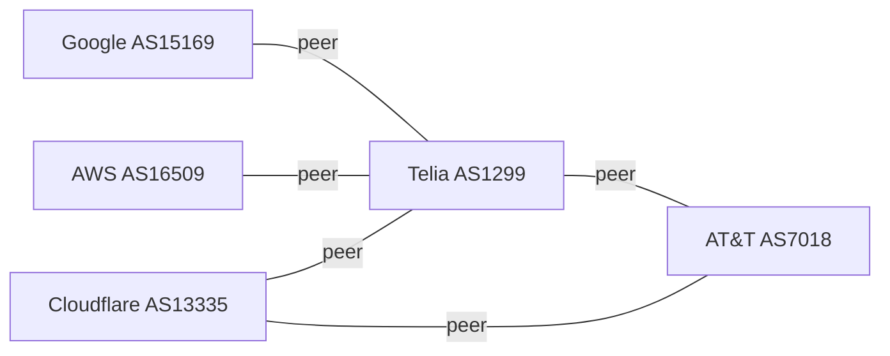

# BGP — Border Gateway Protocol

BGP is the protocol that makes the internet work. Every major ISP, cloud provider, CDN, and large enterprise runs BGP. It's the system by which networks tell each other "I can reach these IP addresses — route traffic to me."

Understanding BGP explains: why Cloudflare can absorb DDoS attacks globally, how anycast CDNs work, why an ISP "going dark" can disconnect millions of users, and how a single misconfigured router can accidentally route half the internet's traffic through Pakistan.

---

## Autonomous Systems

The internet is divided into **Autonomous Systems (AS)** — independently operated networks with their own routing policies.

```
AS15169 = Google
AS16509 = Amazon (AWS)
AS13335 = Cloudflare
AS7018  = AT&T
AS1299  = Telia (major backbone)
```

Each AS gets an **ASN (Autonomous System Number)** assigned by IANA/RIRs (ARIN, RIPE, APNIC, etc.).



---

## What BGP Does

BGP routers exchange **reachability information** — "I can reach these CIDR prefixes, and here's the path to get there."

```
BGP announcement:
  Prefix:  203.0.113.0/24
  AS path: 15169 → 1299 → 7018
  Next hop: 192.0.2.1

Meaning: "To reach 203.0.113.0/24, send traffic to 192.0.2.1.
          It will traverse AS15169, then AS1299, then reach AS7018."
```

The **AS path** serves two purposes:
1. Loop prevention — if your own ASN appears in the path, reject it
2. Path length as a routing metric — shorter AS path is preferred (by default)

---

## iBGP vs eBGP

**eBGP (External BGP):** BGP sessions between routers in *different* Autonomous Systems. This is what "BGP on the internet" means.

**iBGP (Internal BGP):** BGP sessions between routers *within* the same AS. Used to propagate external routes learned at one edge router to all other edge routers in the same AS.

```
                    eBGP session
AS15169 ────────────────────────────────── AS1299
(Google)   │                          │  (Telia)
        Router1    iBGP    Router2
           └──────────────────┘
           (both in AS15169)
```

iBGP requirement: all routers in an AS that run iBGP must be **fully meshed** (or use route reflectors), because iBGP does not re-advertise routes learned from iBGP to other iBGP peers (loop prevention).

---

## BGP Peering Types

**Tier 1 ISPs** (AT&T, Telia, NTT, etc.) peer with each other for free — **settlement-free peering**. They have agreements not to charge each other because traffic exchange is roughly equal.

**Peering (IX):** Two networks directly exchange traffic, usually at an **Internet Exchange Point (IXP)** like DE-CIX, LINX, or AMS-IX. Free or low-cost. Requires similar traffic volumes.

**Transit:** A smaller network pays a larger one (upstream) to carry its traffic to the global internet. A startup buys transit from an ISP; the ISP buys transit from a Tier 1.

```
Your startup → ISP (pays transit) → Tier 1 → Global internet
Cloudflare → peers with everyone at IXPs (doesn't pay transit)
```

---

## BGP Route Selection

When a router receives multiple routes to the same prefix, it selects the best one using a priority-ordered list of attributes:

| Priority | Attribute | Prefer |
|----------|-----------|--------|
| 1 | Weight (Cisco-specific) | Highest |
| 2 | LOCAL_PREF | Highest (prefer this exit) |
| 3 | Locally originated | Local routes win |
| 4 | AS path length | Shortest |
| 5 | Origin type | IGP > EGP > incomplete |
| 6 | MED (Multi-Exit Discriminator) | Lowest |
| 7 | eBGP over iBGP | eBGP preferred |
| 8 | IGP metric to next hop | Lowest |
| 9 | Router ID | Lowest (tiebreaker) |

**LOCAL_PREF** is the most important attribute for traffic engineering. Set it higher on preferred exit points to control which path outbound traffic takes.

**MED** lets you tell your upstream "prefer this entry point." You set MED; your upstream may or may not honor it.

---

## BGP and Anycast

**Anycast** is the killer feature that CDNs and DNS providers use to serve users from the nearest location.

The idea: announce the **same IP prefix** from multiple locations globally. BGP's shortest-path routing automatically directs users to the nearest data center.

```
Cloudflare announces 1.1.1.0/24 from:
  - San Jose
  - Frankfurt  
  - Singapore
  - São Paulo

User in Germany → BGP routes to Frankfurt (shortest path)
User in Australia → BGP routes to Singapore
```

This is how Cloudflare's DDoS mitigation works — attack traffic is absorbed at the nearest PoP rather than overwhelming a single datacenter. Each PoP can absorb traffic independently.

**DNS anycast:** `8.8.8.8` (Google DNS) and `1.1.1.1` (Cloudflare DNS) use anycast. Queries go to the nearest Google/Cloudflare server automatically.

---

## BGP Security Problems

BGP was designed in 1989 on the assumption that operators would behave honestly. They often don't — accidentally or maliciously.

### BGP Hijacking

An AS announces a prefix it doesn't own. Other routers accept it because BGP has no built-in authentication.

**2010 China Telecom incident:** AS23724 (China Telecom) briefly advertised routes for 50,000+ prefixes — including Google, YouTube, and major US networks. Traffic was rerouted through China for 18 minutes.

**2018 MyEtherwallet attack:** AS10297 hijacked AWS Route 53 IP addresses for 2 hours. Users were redirected to a fake MyEtherWallet site that stole ~$150K in cryptocurrency.

### BGP Route Leaks

An AS re-advertises routes it received from one peer to another peer, unintentionally becoming a transit provider.

**2019 Cloudflare incident:** A small Pennsylvania ISP (Verizon customer) leaked routes from DQE Communications to Verizon. Verizon propagated them globally. Traffic for Cloudflare, Amazon, and others routed through the ISP's tiny pipe. 30+ minutes of widespread outages.

### RPKI — The Fix

**RPKI (Resource Public Key Infrastructure)** is the modern solution. Network operators cryptographically sign their IP prefix announcements, associating prefixes with their ASN. Routers can validate: "Is AS15169 actually authorized to originate 8.8.8.0/24?"

```
Route Origin Authorization (ROA):
  Prefix:  8.8.8.0/24
  Origin:  AS15169
  Signed by: Google's RPKI certificate
```

Cloudflare, AWS, and major Tier 1s have deployed RPKI. Adoption is ~50% as of 2025 — enough to block most accidental hijacks, not yet universal.

---

## BGP in Cloud Networking

### AWS Direct Connect
BGP sessions between your on-premises routers and AWS. You advertise your on-prem prefixes; AWS advertises VPC prefixes.

### AWS Transit Gateway with BGP
Used for hub-and-spoke VPC connectivity at scale. BGP dynamically propagates routes between VPCs and on-premises networks.

### Kubernetes (MetalLB, Cilium)
BGP-based load balancer controllers advertise pod/service IP ranges from Kubernetes nodes. Used for bare-metal Kubernetes to integrate with the datacenter's BGP fabric.

### Cloudflare Workers / CDN Edge
Cloudflare uses BGP anycast for every request. When you set a DNS record to Cloudflare, your traffic is being routed by BGP to the nearest Cloudflare PoP before it ever reaches your origin server.

---

## BGP Looking Glass

You can inspect live BGP routes without running a router:

- **BGP.he.net** — Hurricane Electric's BGP toolkit
- **RIPE RIS** — real-time BGP data from 900+ peers
- **Route Views** — University of Oregon BGP archive
- **Cloudflare Radar** — BGP routing changes and outages in near real-time

```bash
# Check BGP path to an IP (requires a BGP-capable system)
# Or use online looking glass tools
```

---

## Why Application Engineers Should Care

- **Latency optimization:** CDNs use BGP anycast. Choosing a CDN means choosing whose BGP relationships determine where your users' traffic terminates.
- **DDoS resilience:** Services with anycast BGP can absorb volumetric DDoS — Cloudflare absorbs 1.5Tbps+ attacks at the routing layer.
- **Multi-cloud routing:** AWS Direct Connect, Azure ExpressRoute, GCP Interconnect all use BGP. Understanding BGP is essential for hybrid cloud networking.
- **Outage postmortems:** Major internet outages almost always involve BGP — a leaked route, a misconfigured AS, or a fiber cut that triggers route withdrawals. Reading BGP-related postmortems is much easier when you understand the protocol.
