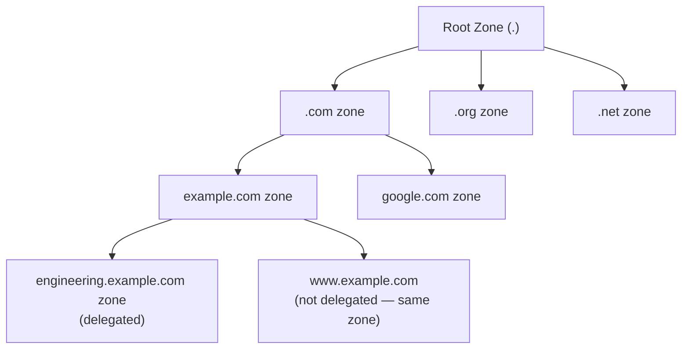
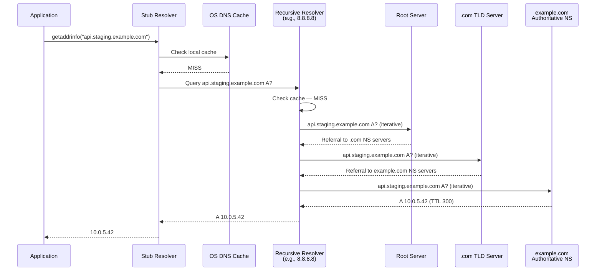
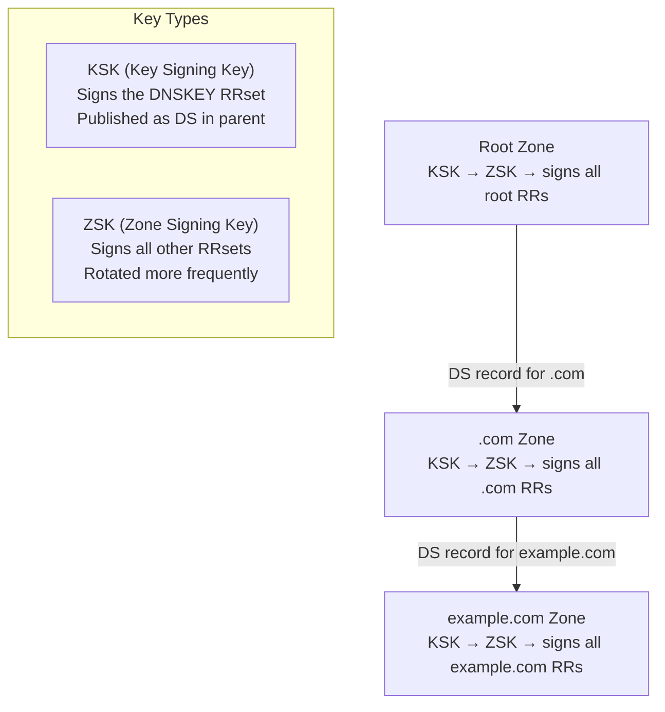
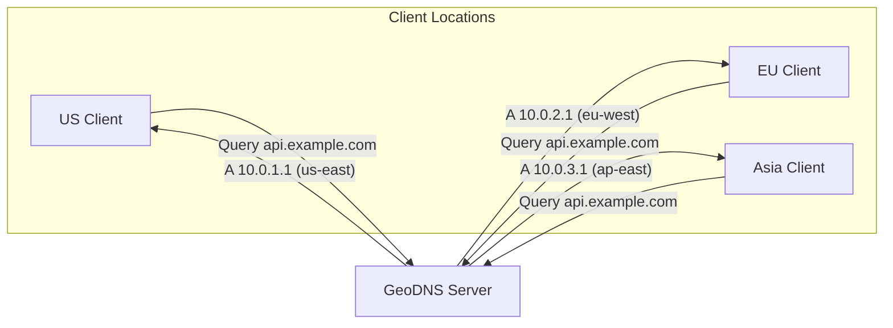
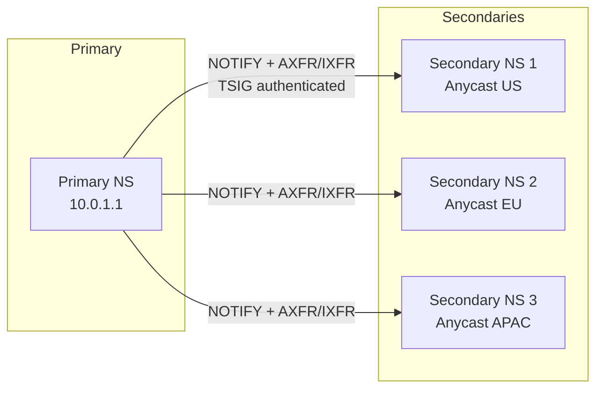

# DNS Deep Dive

## Why DNS Exists

Every device on the Internet communicates using IP addresses — numeric identifiers like `93.184.216.34` (IPv4) or `2606:2800:220:1:248:1893:25c8:1946` (IPv6). Humans cannot memorize these. DNS (Domain Name System) was invented in 1983 by Paul Mockapetris (RFC 882/883, later RFC 1034/1035) to replace the earlier `/etc/hosts` flat-file approach that simply could not scale beyond a few hundred hosts on ARPANET.

Before DNS, every machine on the network maintained a local `HOSTS.TXT` file distributed from a single source at SRI-NIC. As the network grew, this centralized file became a bottleneck — updates were slow, inconsistent, and name collisions were inevitable. DNS solved this with a hierarchical, distributed, eventually-consistent database that today handles over 1.1 trillion queries per day globally.

### The Core Problem

DNS solves three intertwined problems:
1. **Human-readable naming** — translating `example.com` to `93.184.216.34`
2. **Decentralized administration** — letting organizations manage their own namespace
3. **Scalable resolution** — serving billions of queries without a single point of failure

## First Principles

### The DNS Namespace Hierarchy

DNS uses a tree structure rooted at the empty string `""` (the root). Every fully qualified domain name (FQDN) is a path from a leaf to the root:

```
www.engineering.example.com.
│   │           │       │  │
│   │           │       │  └── root (empty label)
│   │           │       └── TLD (top-level domain)
│   │           └── second-level domain (SLD)
│   └── subdomain
└── hostname
```

::: tip
The trailing dot in `www.example.com.` is the root. Most software adds it implicitly, but it matters in zone files where its absence changes meaning entirely.
:::

### Labels and Constraints

- Each label: max 63 octets
- Total FQDN: max 253 characters (255 octets in wire format including length bytes)
- Case-insensitive but case-preserving (RFC 4343)
- Allowed characters: `a-z`, `0-9`, `-` (hyphens, but not at start/end of label)
- Internationalized Domain Names (IDN) use Punycode encoding (RFC 3492)

### The Zone Concept

A **zone** is a contiguous portion of the namespace under a single administrative authority. Zones are bounded by delegation — when a parent zone creates NS records pointing to another name server, everything below that point becomes a separate zone.



## Core Mechanics: Resolution Process

### Recursive vs Iterative Resolution

There are two resolution strategies:

1. **Recursive**: The resolver does all the work. The client sends one query and gets back the final answer. Most stub resolvers (like the one in your OS) use this mode.

2. **Iterative**: The resolver asks each authoritative server in turn, following referrals. This is how recursive resolvers talk to authoritative servers.

### The Full Resolution Path

When you type `https://api.staging.example.com` in a browser:



### DNS Message Format

Every DNS message (query and response) uses the same binary format:

```
+---------------------+
|        Header       |  12 bytes fixed
+---------------------+
|       Question      |  Variable: QNAME + QTYPE + QCLASS
+---------------------+
|        Answer       |  Variable: RRs
+---------------------+
|      Authority      |  Variable: NS RRs
+---------------------+
|      Additional     |  Variable: glue records, OPT
+---------------------+
```

The header structure (12 bytes):

```
  0  1  2  3  4  5  6  7  8  9  10 11 12 13 14 15
+--+--+--+--+--+--+--+--+--+--+--+--+--+--+--+--+
|                      ID                         |
+--+--+--+--+--+--+--+--+--+--+--+--+--+--+--+--+
|QR| Opcode  |AA|TC|RD|RA| Z|AD|CD|   RCODE     |
+--+--+--+--+--+--+--+--+--+--+--+--+--+--+--+--+
|                    QDCOUNT                      |
+--+--+--+--+--+--+--+--+--+--+--+--+--+--+--+--+
|                    ANCOUNT                      |
+--+--+--+--+--+--+--+--+--+--+--+--+--+--+--+--+
|                    NSCOUNT                      |
+--+--+--+--+--+--+--+--+--+--+--+--+--+--+--+--+
|                    ARCOUNT                      |
+--+--+--+--+--+--+--+--+--+--+--+--+--+--+--+--+
```

Key flags:
- **QR**: 0 = query, 1 = response
- **AA**: Authoritative Answer
- **TC**: Truncation (response too large for UDP, retry with TCP)
- **RD**: Recursion Desired
- **RA**: Recursion Available
- **AD**: Authenticated Data (DNSSEC)
- **CD**: Checking Disabled

### Name Compression

DNS uses pointer compression to reduce message size. When a domain name (or suffix of one) has already appeared in the message, subsequent occurrences can reference it via a 2-byte pointer:

```
Bits:  1 1 | 14-bit offset from start of message
```

The two high bits being `11` distinguish a pointer from a label length byte (which is always < 64, so bit 7 is 0).

## DNS Record Types

### Essential Records

| Type | Code | Purpose | Example |
|------|------|---------|---------|
| A | 1 | IPv4 address | `example.com. 300 IN A 93.184.216.34` |
| AAAA | 28 | IPv6 address | `example.com. 300 IN AAAA 2606:2800:...` |
| CNAME | 5 | Canonical name alias | `www.example.com. 300 IN CNAME example.com.` |
| MX | 15 | Mail exchange | `example.com. 3600 IN MX 10 mail.example.com.` |
| NS | 2 | Name server delegation | `example.com. 86400 IN NS ns1.example.com.` |
| TXT | 16 | Arbitrary text | SPF, DKIM, domain verification |
| SOA | 6 | Start of Authority | Zone metadata, serial, refresh timers |
| SRV | 33 | Service location | `_http._tcp.example.com. 300 IN SRV 10 60 80 web1.example.com.` |
| PTR | 12 | Reverse lookup | `34.216.184.93.in-addr.arpa. IN PTR example.com.` |
| CAA | 257 | Certificate Authority Authorization | `example.com. 3600 IN CAA 0 issue "letsencrypt.org"` |

### CNAME Restrictions and ALIAS/ANAME

A CNAME record **cannot** coexist with any other record type at the same name. This means you cannot have a CNAME at the zone apex (where SOA and NS records must exist). This limitation led to proprietary solutions:

- **ALIAS** (Route 53, DNSimple): Resolved server-side at query time
- **ANAME** (RFC draft): Standardization attempt
- **CNAME flattening** (Cloudflare): Resolves CNAME chains and returns A/AAAA

```typescript
// Demonstrating DNS record lookup with Node.js
import { Resolver } from 'node:dns/promises';

const resolver = new Resolver();
resolver.setServers(['8.8.8.8', '1.1.1.1']);

interface DnsLookupResult {
  hostname: string;
  addresses: string[];
  cname?: string;
  mx?: Array<{ priority: number; exchange: string }>;
  txt?: string[][];
  ns?: string[];
  soa?: {
    nsname: string;
    hostmaster: string;
    serial: number;
    refresh: number;
    retry: number;
    expire: number;
    minttl: number;
  };
}

async function comprehensiveLookup(hostname: string): Promise<DnsLookupResult> {
  const result: DnsLookupResult = { hostname, addresses: [] };

  const lookups = await Promise.allSettled([
    resolver.resolve4(hostname),
    resolver.resolve6(hostname),
    resolver.resolveCname(hostname),
    resolver.resolveMx(hostname),
    resolver.resolveTxt(hostname),
    resolver.resolveNs(hostname),
    resolver.resolveSoa(hostname),
  ]);

  if (lookups[0].status === 'fulfilled') {
    result.addresses.push(...lookups[0].value);
  }
  if (lookups[1].status === 'fulfilled') {
    result.addresses.push(...lookups[1].value);
  }
  if (lookups[2].status === 'fulfilled') {
    result.cname = lookups[2].value[0];
  }
  if (lookups[3].status === 'fulfilled') {
    result.mx = lookups[3].value;
  }
  if (lookups[4].status === 'fulfilled') {
    result.txt = lookups[4].value;
  }
  if (lookups[5].status === 'fulfilled') {
    result.ns = lookups[5].value;
  }
  if (lookups[6].status === 'fulfilled') {
    result.soa = lookups[6].value;
  }

  return result;
}

// Usage
const result = await comprehensiveLookup('example.com');
console.log(JSON.stringify(result, null, 2));
```

### SRV Records in Depth

SRV records encode service location with priority and weight:

```
_service._protocol.name. TTL IN SRV priority weight port target
```

Resolution algorithm (RFC 2782):
1. Sort by priority (lowest first)
2. Within same priority, select by weight using weighted random selection
3. Weight 0 means "use only when no other targets are available at this priority"

$$
P(\text{selecting server } i) = \frac{w_i}{\sum_{j \in S} w_j}
$$

where $S$ is the set of servers at the current priority level.

## TTL and Caching

### How TTL Works

Every resource record has a TTL (Time To Live) in seconds. When a recursive resolver caches a record, it decrements the TTL with each passing second. When it reaches 0, the record is evicted.

::: warning
TTL is not a guarantee. Some resolvers (notably older versions of dnsmasq) ignore low TTLs. Some ISP resolvers enforce minimum TTLs of 30-300 seconds. Never rely on TTL for time-critical changes.
:::

### TTL Strategy for Different Scenarios

| Scenario | Recommended TTL | Rationale |
|----------|----------------|-----------|
| Static content CDN | 86400 (24h) | Rarely changes, maximize cache hits |
| Production API | 300 (5min) | Balance between cache and flexibility |
| Pre-migration | 60 (1min) | Lower 48h before migration |
| During migration | 30 (30s) | Fastest safe propagation |
| Failover records | 30-60 | Fast recovery during incidents |
| MX records | 3600 (1h) | Mail retries handle temporary failures |

### Negative Caching

When a name does not exist, the resolver caches the **NXDOMAIN** response for the duration specified by the SOA record's minimum TTL field (RFC 2308). This prevents repeated queries for nonexistent names.

```
example.com. 86400 IN SOA ns1.example.com. admin.example.com. (
    2024010101  ; serial
    3600        ; refresh
    900         ; retry
    604800      ; expire
    300         ; minimum TTL (used for negative caching)
)
```

## DNSSEC

### The Problem DNSSEC Solves

Standard DNS has no authentication. A man-in-the-middle or a compromised resolver can return forged responses. DNSSEC adds cryptographic signatures to DNS records, allowing validators to verify that responses are authentic and unmodified.

### DNSSEC Chain of Trust



### DNSSEC Record Types

| Record | Purpose |
|--------|---------|
| **DNSKEY** | Public key published in the zone |
| **RRSIG** | Signature over an RRset (one per type per name) |
| **DS** | Delegation Signer — hash of child's KSK, stored in parent zone |
| **NSEC/NSEC3** | Authenticated denial of existence |

### RRSIG Validation

When a DNSSEC-validating resolver receives a response:

1. Fetch the DNSKEY records for the zone
2. Verify the DNSKEY RRset's RRSIG using the KSK
3. Verify the KSK matches the DS record in the parent zone
4. Verify the actual answer's RRSIG using the ZSK
5. Recurse up to the root trust anchor

$$
\text{Valid}(RRset) = \text{Verify}_{ZSK}(\text{RRSIG}(RRset)) \land \text{Verify}_{KSK}(\text{RRSIG}(DNSKEY)) \land \text{Match}(DS_{parent}, \text{Hash}(KSK))
$$

### NSEC vs NSEC3

**NSEC** (Next Secure) proves nonexistence by listing the next existing name in canonical order. Problem: you can walk the entire zone by following NSEC chains (zone enumeration).

**NSEC3** (RFC 5155) hashes the names before ordering, making enumeration computationally expensive (but not impossible — tools like `nsec3walker` exist).

```
; NSEC example — reveals zone contents
alpha.example.com. NSEC beta.example.com. A AAAA RRSIG NSEC

; NSEC3 example — hashed names
A1B2C3D4E5.example.com. NSEC3 1 0 10 AABB F6G7H8I9J0 A AAAA RRSIG
```

### DNSSEC Operational Concerns

::: danger
DNSSEC key rotation failures are a leading cause of DNS outages. The 2018 .gov DNSSEC incident and the 2019 root KSK rollover demonstrated that even well-resourced operators struggle with key management.
:::

Key rotation process:
1. **Pre-publish** new key (add to DNSKEY RRset)
2. Wait for old DNSKEY TTL to expire from all caches
3. **Sign** records with new key
4. Wait for old RRSIG TTL to expire
5. **Remove** old key

## DNS-Based Load Balancing

### Round-Robin DNS

The simplest form: return multiple A records and let the client choose.

```
api.example.com. 60 IN A 10.0.1.1
api.example.com. 60 IN A 10.0.1.2
api.example.com. 60 IN A 10.0.1.3
```

Most resolvers cycle through the list. However, round-robin DNS has severe limitations:

- No health checking — dead servers still receive traffic
- Uneven distribution due to caching (a resolver caches all records with the same TTL)
- Cannot handle server weighting
- Client-side behavior varies (some always pick first, some randomize)

### Weighted DNS

Some DNS providers support weighted responses:

```
; Route 53 weighted routing
api.example.com. 60 IN A 10.0.1.1  ; weight 70
api.example.com. 60 IN A 10.0.1.2  ; weight 20
api.example.com. 60 IN A 10.0.1.3  ; weight 10
```

The authoritative server returns different records based on configured weights. This enables gradual traffic shifting (canary deployments).

### GeoDNS

Return different IP addresses based on the client's geographic location:



GeoDNS relies on mapping resolver IP addresses to geographic locations using databases like MaxMind GeoIP. With the introduction of EDNS Client Subnet (ECS, RFC 7871), authoritative servers can see the client's subnet instead of just the resolver's IP, dramatically improving geographic accuracy.

### DNS Failover

Health-checked DNS removes unhealthy endpoints from responses:

```typescript
import { createServer, type RemoteInfo } from 'node:dgram';
import { encode, decode, type DNSPacket } from 'dns-packet';

interface Backend {
  ip: string;
  healthy: boolean;
  lastCheck: number;
  weight: number;
}

class HealthCheckedDns {
  private backends: Map<string, Backend[]> = new Map();
  private checkIntervalMs = 10_000;

  constructor() {
    this.startHealthChecks();
  }

  registerBackends(domain: string, backends: Backend[]): void {
    this.backends.set(domain, backends);
  }

  private async checkHealth(backend: Backend): Promise<boolean> {
    try {
      const controller = new AbortController();
      const timeout = setTimeout(() => controller.abort(), 5_000);

      const response = await fetch(`http://${backend.ip}/health`, {
        signal: controller.signal,
      });

      clearTimeout(timeout);
      return response.ok;
    } catch {
      return false;
    }
  }

  private startHealthChecks(): void {
    setInterval(async () => {
      for (const [_domain, backends] of this.backends) {
        await Promise.all(
          backends.map(async (backend) => {
            backend.healthy = await this.checkHealth(backend);
            backend.lastCheck = Date.now();
          })
        );
      }
    }, this.checkIntervalMs);
  }

  getHealthyBackends(domain: string): Backend[] {
    const backends = this.backends.get(domain) ?? [];
    const healthy = backends.filter((b) => b.healthy);

    // Fallback: if all are unhealthy, return all (avoid total outage)
    return healthy.length > 0 ? healthy : backends;
  }

  selectByWeight(backends: Backend[]): Backend {
    const totalWeight = backends.reduce((sum, b) => sum + b.weight, 0);
    let random = Math.random() * totalWeight;

    for (const backend of backends) {
      random -= backend.weight;
      if (random <= 0) return backend;
    }

    return backends[backends.length - 1];
  }
}
```

## Edge Cases and Failure Modes

### DNS Amplification Attacks

DNS is a prime vector for DDoS amplification because:
- UDP is connectionless (source IP easily spoofed)
- Small queries can produce large responses (amplification factor up to 70x with DNSSEC)

Mitigation:
- **Response Rate Limiting (RRL)** on authoritative servers
- **BCP38** ingress filtering to prevent IP spoofing
- Limit `ANY` query responses (RFC 8482)

### DNS Rebinding

An attacker controls a domain and returns a short-TTL record pointing to their server, then changes it to `127.0.0.1` or an internal IP. The browser's same-origin policy is bypassed because the hostname hasn't changed.

```
Step 1: evil.com → 1.2.3.4 (attacker's server), TTL=0
Step 2: evil.com → 192.168.1.1 (victim's router)
         ↑ JavaScript from step 1 now sends requests to internal network
```

Mitigation: DNS pinning, private IP filtering in resolvers.

### Cache Poisoning (Kaminsky Attack)

The 2008 Kaminsky attack exploited DNS's 16-bit transaction ID:

$$
P(\text{successful poison in } n \text{ attempts}) = 1 - \left(1 - \frac{1}{2^{16}}\right)^n \approx 1 - e^{-n/65536}
$$

With birthday-attack optimization and high query rates, poisoning was practical within seconds. Mitigations:
- **Source port randomization** (adds ~16 bits of entropy)
- **0x20 encoding** (randomize case in query name, check in response)
- **DNSSEC** (definitive solution)

::: info War Story
In 2014, a major ISP's recursive resolver was compromised via cache poisoning. The attacker redirected `bank.example.com` to a phishing server for 37 minutes before detection. Over 12,000 customers were exposed. The root cause: the resolver used a fixed source port. After the incident, source port randomization was deployed within 4 hours, and DNSSEC validation was enabled within 2 weeks.
:::

### SERVFAIL Storms

When a zone's DNSSEC signatures expire (because the operator forgot to re-sign), all DNSSEC-validating resolvers return SERVFAIL. This can cascade:

1. Application retries immediately → resolver load spikes
2. Resolver re-queries authoritative → authoritative server overload
3. Timeouts cascade into application-layer failures

::: info War Story
In October 2021, Facebook's BGP withdrawal caused their authoritative DNS servers to become unreachable. Because the TTL on `facebook.com` records was relatively short, cached records expired quickly. Recursive resolvers worldwide began hammering the root and `.com` TLD servers with queries for `facebook.com`, causing measurable increases in query latency for unrelated domains. The incident lasted approximately 6 hours.
:::

## Performance Characteristics

### Latency Breakdown

| Step | Typical Latency | Notes |
|------|----------------|-------|
| Stub → Recursive (local) | 1-5ms | Same network/machine |
| Stub → Recursive (ISP) | 5-30ms | Regional network |
| Stub → Recursive (public, e.g., 8.8.8.8) | 5-50ms | Anycast, varies by location |
| Recursive → Root | 10-30ms | 13 root server clusters, globally anycasted |
| Recursive → TLD | 10-50ms | Regional distribution |
| Recursive → Authoritative | 10-200ms | Depends on location, hosting provider |
| Full cold resolution | 50-500ms | Sum of all iterative steps |
| Cached resolution | 0-5ms | In-memory lookup |

### UDP vs TCP

DNS traditionally uses UDP (port 53) for queries under 512 bytes. EDNS(0) (RFC 6891) extends this to 4096 bytes. If a response is truncated (TC flag set), the client retries over TCP.

$$
\text{TCP overhead} = 3 \times RTT_{\text{handshake}} + RTT_{\text{query}} \approx 4 \times RTT
$$

versus UDP's single $RTT$.

Modern developments:
- **DNS over HTTPS (DoH)** — RFC 8484, port 443
- **DNS over TLS (DoT)** — RFC 7858, port 853
- **DNS over QUIC (DoQ)** — RFC 9250, port 853

### Root Server Capacity

The 13 root server letters (A through M) represent over 1,500 anycast instances worldwide. Combined, they handle over 100,000 queries per second under normal conditions and are provisioned for sustained loads exceeding 1 million QPS.

## Mathematical Foundations

### Cache Hit Rate Modeling

DNS cache effectiveness follows a power-law distribution. Let $f_i$ be the frequency of the $i$-th most popular domain:

$$
f_i = \frac{C}{i^\alpha}
$$

where $\alpha \approx 0.91$ for web traffic (empirically measured). The cache hit rate $H$ for a cache that stores $k$ entries with average TTL $T$:

$$
H = \sum_{i=1}^{k} f_i \cdot \min\left(1, \frac{T}{\Delta t_i}\right)
$$

where $\Delta t_i$ is the average inter-query gap for domain $i$.

### Anycast Routing Convergence

BGP anycast used by root servers means the "closest" server is determined by BGP path selection, not geographic proximity. Convergence time after a failure:

$$
T_{\text{convergence}} = T_{\text{detection}} + T_{\text{withdrawal}} + T_{\text{propagation}}
$$

Typical values: $T_{\text{detection}} \approx 3\text{s}$, $T_{\text{withdrawal}} \approx 30\text{s}$, $T_{\text{propagation}} \approx 60-120\text{s}$.

## DNS in Kubernetes

Kubernetes uses CoreDNS (previously kube-dns) for in-cluster name resolution.

### Service Discovery via DNS

```
<service-name>.<namespace>.svc.cluster.local
```

CoreDNS watches the Kubernetes API and creates:
- **A records** for ClusterIP services
- **SRV records** for named ports
- **A records** for each pod (when headless service)

### ndots Configuration

The `/etc/resolv.conf` in every pod defaults to:

```
search default.svc.cluster.local svc.cluster.local cluster.local
options ndots:5
```

`ndots:5` means any name with fewer than 5 dots gets the search domains appended first. This means `api.example.com` (2 dots < 5) triggers **4 extra DNS queries** before the external lookup succeeds:

1. `api.example.com.default.svc.cluster.local` → NXDOMAIN
2. `api.example.com.svc.cluster.local` → NXDOMAIN
3. `api.example.com.cluster.local` → NXDOMAIN
4. `api.example.com.` → SUCCESS

::: danger
In high-throughput services making frequent external DNS queries, the default `ndots:5` can **quadruple** DNS load. Set `ndots:2` or use FQDNs (trailing dot) for external hostnames.
:::

```yaml
# Pod spec with optimized DNS
spec:
  dnsConfig:
    options:
      - name: ndots
        value: "2"
      - name: timeout
        value: "2"
      - name: attempts
        value: "3"
```

## Decision Framework

### When to Use DNS-Based Load Balancing

| Factor | DNS LB | Hardware/Software LB |
|--------|--------|---------------------|
| Cost | Low (just DNS records) | Moderate-high |
| Health checking | Limited (provider-dependent) | Real-time, per-request |
| Granularity | Per-resolver-cache | Per-connection or per-request |
| Failover speed | TTL-dependent (30s-5min) | Immediate (< 1s) |
| Geographic routing | Excellent | Requires multiple LB instances |
| SSL termination | No | Yes |
| Session affinity | Very limited | Full support |
| Best for | Global traffic distribution | Application-level routing |

### Choosing a DNS Provider

| Provider | GeoDNS | Health Checks | DNSSEC | Latency-Based | Price |
|----------|--------|---------------|--------|---------------|-------|
| Route 53 | Yes | Yes | Yes | Yes | $0.50/zone + $0.40/M queries |
| Cloudflare | Yes | Yes | Yes | Yes | Free tier available |
| NS1 | Yes | Yes | Yes | Yes (Filter Chains) | Enterprise |
| Google Cloud DNS | Limited | Via LB | Yes | Via LB | $0.20/zone + $0.40/M queries |

## Advanced Topics

### DNS over HTTPS (DoH) Implementation

DoH encrypts DNS queries inside HTTPS, preventing ISP inspection and manipulation:

```typescript
import { Buffer } from 'node:buffer';

interface DoHResponse {
  Status: number;
  TC: boolean;
  RD: boolean;
  RA: boolean;
  AD: boolean; // Authenticated Data (DNSSEC)
  CD: boolean;
  Question: Array<{ name: string; type: number }>;
  Answer?: Array<{
    name: string;
    type: number;
    TTL: number;
    data: string;
  }>;
}

async function dohQuery(
  domain: string,
  type: string = 'A',
  server: string = 'https://cloudflare-dns.com/dns-query'
): Promise<DoHResponse> {
  const url = new URL(server);
  url.searchParams.set('name', domain);
  url.searchParams.set('type', type);

  const response = await fetch(url.toString(), {
    headers: {
      Accept: 'application/dns-json',
    },
  });

  if (!response.ok) {
    throw new Error(
      `DoH query failed: ${response.status} ${response.statusText}`
    );
  }

  return response.json() as Promise<DoHResponse>;
}

// Parallel multi-type lookup via DoH
async function fullDoHLookup(domain: string): Promise<Map<string, DoHResponse>> {
  const types = ['A', 'AAAA', 'MX', 'TXT', 'NS', 'CAA'];
  const results = new Map<string, DoHResponse>();

  const responses = await Promise.allSettled(
    types.map((type) => dohQuery(domain, type))
  );

  for (let i = 0; i < types.length; i++) {
    const resp = responses[i];
    if (resp.status === 'fulfilled') {
      results.set(types[i], resp.value);
    }
  }

  return results;
}
```

### Encrypted Client Hello (ECH) and DNS

ECH (formerly ESNI) encrypts the TLS ClientHello's SNI field. The ECH public key is published as an HTTPS/SVCB DNS record:

```
example.com. 300 IN HTTPS 1 . alpn="h2,h3" ech="..."
```

This creates a dependency: DNS must be secure (DoH/DoT) for ECH to work, because an attacker who can see DNS responses can see the ECH key and thus the intended server name.

### Happy Eyeballs (RFC 8305)

Modern clients implement "Happy Eyeballs" — they query both A and AAAA simultaneously, then race connections to IPv4 and IPv6 addresses. The algorithm:

1. Send A and AAAA queries simultaneously
2. If AAAA arrives first, start IPv6 connection immediately
3. If no IPv6 connection within 250ms, start IPv4 connection
4. Use whichever connects first, cancel the other

This prevents IPv6 failures from adding latency, while preferring IPv6 when it works.

### DNS Prefetching and Preconnect

Browsers optimize DNS latency with resource hints:

```html
<!-- DNS prefetch only (resolve the name) -->
<link rel="dns-prefetch" href="//cdn.example.com">

<!-- Preconnect (DNS + TCP + TLS) -->
<link rel="preconnect" href="https://api.example.com">
```

In high-performance applications, preemptive DNS resolution saves 50-200ms per unique hostname on first access.

### Authoritative Server Implementation Patterns

Modern authoritative servers use:

- **Anycast** for geographic distribution
- **XFR (zone transfer)** for primary → secondary replication
- **NOTIFY** (RFC 1996) to trigger immediate transfers on zone changes
- **TSIG** (RFC 2845) for authenticated zone transfers
- **Catalog Zones** (RFC 9432) for automated secondary provisioning



### The Future: SVCB and HTTPS Records

RFC 9460 introduced SVCB (Service Binding) and HTTPS record types that bundle service parameters into DNS:

```
example.com. 300 IN HTTPS 1 . alpn="h2,h3" port=8443 ech="..." ipv4hint=1.2.3.4 ipv6hint=2001:db8::1
```

This eliminates extra round trips — the client learns the port, supported protocols (HTTP/2, HTTP/3), ECH keys, and IP addresses in a single DNS query, saving 1-3 RTTs during connection setup.
