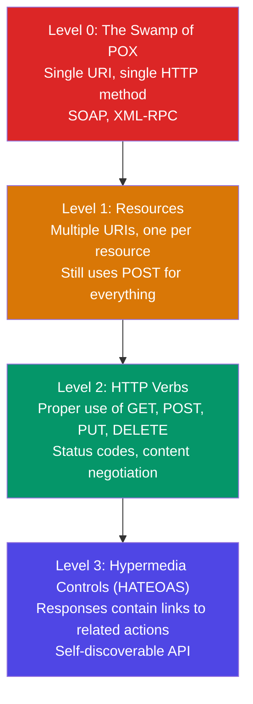
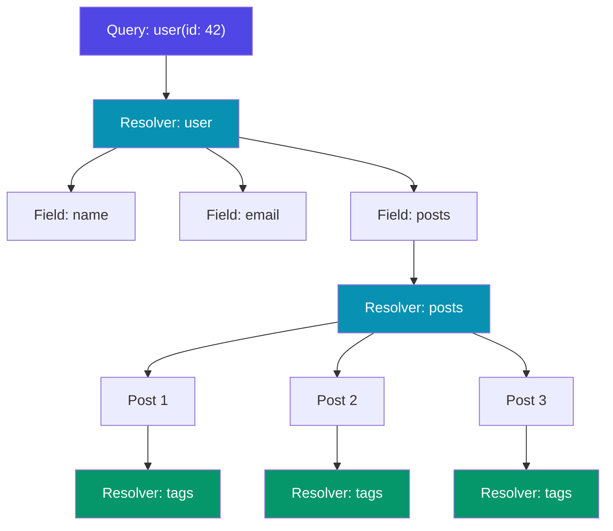
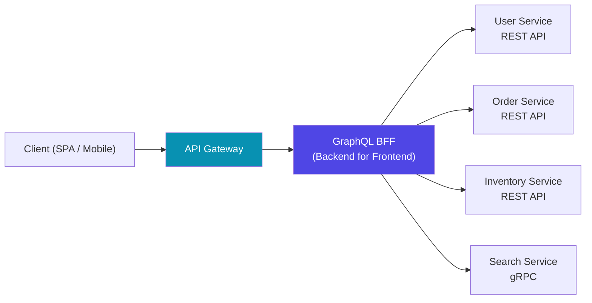

# GraphQL vs REST

Every engineering team eventually faces the question: should we use REST or GraphQL? The answer is never as simple as a blog post headline suggests. Both are mature, production-proven paradigms with deep ecosystems. Choosing between them — or choosing to combine them — requires understanding their internal mechanics, performance characteristics, caching models, and failure modes. This page goes beyond surface-level comparisons and examines what actually happens when a request travels through each system.

## REST: First Principles

REST (Representational State Transfer) is not a protocol. It is an architectural style defined by Roy Fielding in his 2000 doctoral dissertation. Most APIs that call themselves "RESTful" are actually just HTTP APIs with JSON payloads. True REST has six constraints:

### The Six Constraints

| Constraint | What It Means | Why It Matters |
|-----------|---------------|----------------|
| Client-Server | Separation of concerns between UI and data | Independent evolution of frontend and backend |
| Stateless | Each request contains all information needed | Horizontal scaling, no server-side session affinity |
| Cacheable | Responses must declare themselves cacheable or not | HTTP caching headers, CDN compatibility |
| Uniform Interface | Standardized resource identification and manipulation | Predictable API surface, self-documenting |
| Layered System | Client cannot tell if it is connected to end server or intermediary | Load balancers, proxies, CDNs work transparently |
| Code on Demand (optional) | Server can extend client functionality by sending code | JavaScript in browsers, WASM modules |

### Richardson Maturity Model

Leonard Richardson proposed a maturity model that classifies APIs by how well they use HTTP:



Most production APIs sit at **Level 2**. Level 3 (HATEOAS) is rare outside of enterprise systems because the overhead of hypermedia controls rarely pays off for SPAs and mobile apps that already know the API structure at compile time.

### HATEOAS in Practice

HATEOAS (Hypermedia as the Engine of Application State) means responses include links that tell the client what actions are available:

```json
{
  "id": 42,
  "name": "Acme Corp",
  "status": "active",
  "_links": {
    "self": { "href": "/api/companies/42" },
    "deactivate": { "href": "/api/companies/42/deactivate", "method": "POST" },
    "employees": { "href": "/api/companies/42/employees" },
    "invoices": { "href": "/api/companies/42/invoices?status=pending" }
  }
}
```

The benefit is that the client never hard-codes URLs — the server drives navigation. The cost is larger payloads and the need for clients to parse link structures dynamically.

### A Well-Designed REST API

```yaml
# OpenAPI 3.0 snippet
paths:
  /users:
    get:
      summary: List users
      parameters:
        - name: page
          in: query
          schema: { type: integer, default: 1 }
        - name: per_page
          in: query
          schema: { type: integer, default: 20, maximum: 100 }
      responses:
        '200':
          description: Paginated list of users
          headers:
            X-Total-Count: { schema: { type: integer } }
            Link: { schema: { type: string } }
    post:
      summary: Create a user
      requestBody:
        required: true
        content:
          application/json:
            schema: { $ref: '#/components/schemas/CreateUser' }
      responses:
        '201':
          description: User created
          headers:
            Location: { schema: { type: string } }
  /users/{id}:
    get:
      summary: Get a user by ID
    put:
      summary: Replace a user
    patch:
      summary: Partially update a user
    delete:
      summary: Delete a user
```

::: tip REST Design Rule of Thumb
Use nouns for resources (`/users`, `/orders`), HTTP verbs for actions (`GET`, `POST`, `PUT`, `DELETE`), and query parameters for filtering (`?status=active&sort=-created_at`). Avoid verbs in URLs (`/getUser`, `/createOrder`) — they indicate RPC thinking, not resource thinking.
:::

## GraphQL: First Principles

GraphQL is a query language for APIs and a runtime for executing those queries. Developed at Facebook in 2012 and open-sourced in 2015, it gives clients the power to request exactly the data they need in a single round-trip.

### The Type System

GraphQL's foundation is a strongly typed schema. Every field, argument, and return type is declared explicitly:

```graphql
type User {
  id: ID!
  email: String!
  name: String!
  role: Role!
  posts(first: Int = 10, after: String): PostConnection!
  company: Company
  createdAt: DateTime!
}

enum Role {
  ADMIN
  EDITOR
  VIEWER
}

type Post {
  id: ID!
  title: String!
  body: String!
  author: User!
  tags: [Tag!]!
  publishedAt: DateTime
}

type PostConnection {
  edges: [PostEdge!]!
  pageInfo: PageInfo!
  totalCount: Int!
}

type PostEdge {
  node: Post!
  cursor: String!
}

type PageInfo {
  hasNextPage: Boolean!
  hasPreviousPage: Boolean!
  startCursor: String
  endCursor: String
}
```

### Queries, Mutations, and Subscriptions

GraphQL has three operation types:

```graphql
# Query — read data
query GetUserWithPosts($userId: ID!, $first: Int!) {
  user(id: $userId) {
    name
    email
    posts(first: $first) {
      edges {
        node {
          title
          publishedAt
          tags {
            name
          }
        }
      }
      pageInfo {
        hasNextPage
        endCursor
      }
    }
  }
}

# Mutation — write data
mutation CreatePost($input: CreatePostInput!) {
  createPost(input: $input) {
    post {
      id
      title
    }
    errors {
      field
      message
    }
  }
}

# Subscription — real-time updates over WebSocket
subscription OnPostPublished($companyId: ID!) {
  postPublished(companyId: $companyId) {
    id
    title
    author {
      name
    }
  }
}
```

### The Execution Model

When a GraphQL query arrives at the server, the execution engine walks the query tree and calls a **resolver** for each field:



Each resolver is a function that knows how to fetch the data for its field:

```typescript
const resolvers = {
  Query: {
    user: async (_parent, { id }, context) => {
      return context.dataSources.users.findById(id);
    },
  },
  User: {
    posts: async (user, { first, after }, context) => {
      return context.dataSources.posts.findByAuthor(user.id, { first, after });
    },
  },
  Post: {
    tags: async (post, _args, context) => {
      return context.dataSources.tags.findByPost(post.id);
    },
  },
};
```

## The N+1 Problem and DataLoader

The tree-based execution model creates a classic N+1 query problem. If you query a user with 50 posts, and each post has tags, the naive resolver execution is:

1. **1 query** to fetch the user
2. **1 query** to fetch 50 posts
3. **50 queries** to fetch tags for each post

That is 52 database queries for a single GraphQL request.

### DataLoader: Batching and Caching

Facebook's DataLoader library solves this by batching and deduplicating requests within a single execution tick:

```typescript
import DataLoader from 'dataloader';

// Create a batching function
const tagLoader = new DataLoader(async (postIds: readonly string[]) => {
  // Single query: SELECT * FROM tags WHERE post_id IN (...)
  const tags = await db.query(
    'SELECT * FROM post_tags JOIN tags ON tags.id = post_tags.tag_id WHERE post_tags.post_id = ANY($1)',
    [postIds]
  );

  // Return results in the same order as the input keys
  const tagsByPostId = new Map<string, Tag[]>();
  for (const tag of tags) {
    const existing = tagsByPostId.get(tag.postId) || [];
    existing.push(tag);
    tagsByPostId.set(tag.postId, existing);
  }

  return postIds.map(id => tagsByPostId.get(id) || []);
});

// Resolver now uses the loader
const resolvers = {
  Post: {
    tags: (post, _args, context) => context.loaders.tag.load(post.id),
  },
};
```

With DataLoader, the 52-query scenario becomes:

1. **1 query** to fetch the user
2. **1 query** to fetch 50 posts
3. **1 query** to fetch tags for all 50 posts (batched `IN` clause)

**3 queries total.** DataLoader instances must be created per-request to prevent cross-request data leakage.

::: warning DataLoader Is Not Optional
Any production GraphQL server without DataLoader (or an equivalent batching layer) will have catastrophic database performance. It is not an optimization — it is a requirement.
:::

## Caching: Fundamentally Different Models

### REST Caching

REST has caching built into its DNA via HTTP caching semantics:

```
GET /api/users/42 HTTP/2
---
HTTP/2 200 OK
Cache-Control: public, max-age=300, s-maxage=600
ETag: "a1b2c3d4"
Last-Modified: Thu, 20 Mar 2026 10:00:00 GMT
Vary: Accept, Authorization
```

The entire HTTP caching infrastructure — browser caches, CDN edge nodes, reverse proxies — understands these headers natively. A `GET /api/users/42` request can be served from a CDN edge without ever hitting your origin server.

**Cache invalidation** works via:
- `ETag` + `If-None-Match` for conditional requests (304 Not Modified)
- `Cache-Control: max-age` for time-based expiration
- `Surrogate-Key` headers for CDN purging

### GraphQL Caching

GraphQL caching is harder because all queries go to a single endpoint (`POST /graphql`), which means:

- CDNs cannot cache by URL (all URLs are the same)
- Browser HTTP caches cannot differentiate between queries
- Response shapes vary per client

**Solutions:**

| Strategy | How It Works | Trade-offs |
|----------|-------------|------------|
| Persisted queries | Client sends a hash instead of full query string; enables `GET` with query ID in URL | Requires build-time query extraction; enables CDN caching |
| Normalized cache (client) | Apollo Client stores entities by `__typename:id` in a normalized store | Powerful for SPAs; complex cache eviction logic |
| Response caching (server) | Cache full query responses keyed by query hash + variables | Simple but coarse; cache invalidation is hard |
| Field-level caching | `@cacheControl` directive per field with different max-age values | Fine-grained but complex implementation |
| CDN with `GET` queries | Send query as URL parameter: `GET /graphql?query={...}` | URL length limits; works for small queries |

```graphql
# Apollo Server cache control directives
type User @cacheControl(maxAge: 300) {
  id: ID!
  name: String! @cacheControl(maxAge: 3600)
  email: String! @cacheControl(maxAge: 0)  # never cache PII
  posts: [Post!]! @cacheControl(maxAge: 60)
}
```

::: tip Persisted Queries Are the Answer
For production GraphQL, use Automatic Persisted Queries (APQ). The client sends a SHA-256 hash of the query. If the server does not recognize the hash, the client resends the full query. This enables `GET`-based CDN caching and also prevents arbitrary query attacks.
:::

## Performance Comparison

### Payload Size

REST often returns more data than the client needs (over-fetching) or requires multiple round-trips to get all needed data (under-fetching).

Consider a mobile app that needs a user's name, avatar, and the titles of their last 3 posts:

**REST approach — 2 requests:**
```
GET /api/users/42           → 2.1 KB (full user object with 30 fields)
GET /api/users/42/posts?limit=3  → 4.8 KB (3 full post objects with body text)
Total: 6.9 KB, 2 round-trips
```

**GraphQL approach — 1 request:**
```graphql
query {
  user(id: "42") {
    name
    avatarUrl
    posts(first: 3) {
      edges { node { title } }
    }
  }
}
# Response: ~0.4 KB, 1 round-trip
```

The GraphQL response is **17x smaller** in this example because the client requested only the fields it needed.

### Latency

| Scenario | REST | GraphQL |
|----------|------|---------|
| Single resource, all fields | Equivalent | Equivalent |
| Single resource, few fields | Slight overhead (over-fetching) | Optimal |
| Multiple related resources | Multiple round-trips (N requests) | Single round-trip |
| Deeply nested data | Many sequential requests | Single request (watch query depth) |
| Simple list with filters | Optimal | Slight parsing overhead |

### Server-Side CPU

GraphQL has higher per-request server CPU cost due to:
- Query parsing and validation against the schema
- Execution plan construction (walking the query tree)
- Resolver orchestration and DataLoader batching

For high-throughput, simple APIs (e.g., a key-value lookup), REST will be faster. For complex data fetching with many relationships, GraphQL's single round-trip usually wins overall despite higher server cost.

## Security Considerations

### REST Security

REST APIs have well-understood security patterns:
- Authentication via `Authorization` header (Bearer tokens, API keys)
- Rate limiting by endpoint and method
- Input validation per endpoint
- CORS configuration per route

### GraphQL Security

GraphQL introduces unique security challenges:

```typescript
// Query depth limiting — prevent deeply nested attacks
const depthLimitRule = depthLimit(10);

// Query complexity analysis — prevent expensive queries
const complexityRule = createComplexityRule({
  maximumComplexity: 1000,
  estimators: [
    fieldExtensionsEstimator(),
    simpleEstimator({ defaultComplexity: 1 }),
  ],
  onComplete: (complexity: number) => {
    if (complexity > 800) {
      logger.warn(`High complexity query: ${complexity}`);
    }
  },
});

// Apply to server
const server = new ApolloServer({
  schema,
  validationRules: [depthLimitRule, complexityRule],
});
```

**Key GraphQL security measures:**

| Threat | Mitigation |
|--------|-----------|
| Query depth attacks | Depth limiting (max 10-15 levels) |
| Expensive queries | Complexity analysis with cost per field |
| Introspection exposure | Disable introspection in production |
| Denial of service | Persisted queries (allowlisted queries only) |
| Field-level authorization | Auth directives on schema fields |
| Batched query attacks | Limit number of operations per request |

::: danger Never Expose Introspection in Production
GraphQL introspection (`__schema`, `__type`) reveals your entire API surface to attackers. Always disable it in production environments. Use persisted queries to restrict clients to known query shapes.
:::

## When to Use Which

### Choose REST When

- Your API is **resource-centric** with well-defined CRUD operations
- You need **HTTP caching** (CDN, browser, reverse proxy) without additional complexity
- Your consumers are **third-party developers** who expect conventional HTTP APIs
- You have **simple data relationships** (few joins, shallow nesting)
- Your team is **small** and does not want to maintain a GraphQL schema layer
- You need **file uploads** as a primary concern (multipart forms work natively in REST)

### Choose GraphQL When

- You have **multiple client types** (web, iOS, Android, TV) with different data needs
- Your data model is a **graph** with deep relationships (social networks, content management)
- You suffer from **over-fetching or under-fetching** in REST (especially on mobile with bandwidth constraints)
- You want a **single source of truth** for your API schema that generates types for clients
- You need **real-time subscriptions** as a first-class concern
- Your frontend team wants to **iterate on data requirements** without backend changes

### Hybrid Approaches

Many production systems use both:



**The BFF pattern (Backend for Frontend):** A GraphQL layer sits in front of REST microservices. The GraphQL server aggregates data from multiple REST APIs into a single response. Internal services remain simple REST or [gRPC](/system-design/networking/grpc-internals), while the client gets the flexibility of GraphQL.

This is the architecture used at Netflix, Airbnb, and many other companies with diverse client platforms.

## Schema Design Best Practices

### GraphQL Schema Design

```graphql
# Use input types for mutations
input CreateOrderInput {
  items: [OrderItemInput!]!
  shippingAddressId: ID!
  paymentMethodId: ID!
  notes: String
}

# Use payload types for mutation responses (not bare objects)
type CreateOrderPayload {
  order: Order
  errors: [UserError!]!
}

type UserError {
  field: [String!]!
  message: String!
  code: ErrorCode!
}

# Use connections for pagination (Relay spec)
type Query {
  orders(
    first: Int
    after: String
    last: Int
    before: String
    filter: OrderFilter
  ): OrderConnection!
}
```

### REST API Versioning

```
# URL versioning (most common)
GET /api/v2/users/42

# Header versioning (cleaner URLs)
GET /api/users/42
Accept: application/vnd.myapi.v2+json

# Query parameter versioning
GET /api/users/42?version=2
```

GraphQL typically avoids versioning entirely — you add new fields and deprecate old ones:

```graphql
type User {
  fullName: String!       # new field
  name: String! @deprecated(reason: "Use fullName instead. Will be removed 2026-06-01.")
}
```

## Error Handling

### REST Errors

REST uses HTTP status codes as the primary error signal:

```json
// 422 Unprocessable Entity
{
  "error": {
    "code": "VALIDATION_ERROR",
    "message": "Validation failed",
    "details": [
      { "field": "email", "message": "must be a valid email address" },
      { "field": "age", "message": "must be at least 18" }
    ]
  }
}
```

### GraphQL Errors

GraphQL always returns HTTP 200 and puts errors in the response body:

```json
{
  "data": {
    "user": {
      "name": "Alice",
      "email": null
    }
  },
  "errors": [
    {
      "message": "You do not have permission to view this field",
      "locations": [{ "line": 4, "column": 5 }],
      "path": ["user", "email"],
      "extensions": {
        "code": "FORBIDDEN",
        "classification": "AUTHORIZATION"
      }
    }
  ]
}
```

Note that GraphQL can return **partial data** — the name succeeded but the email failed. This is a feature, not a bug. REST would typically fail the entire request.

## Monitoring and Observability

| Aspect | REST | GraphQL |
|--------|------|---------|
| Request identification | URL + method (`GET /users/42`) | Operation name (`GetUserWithPosts`) |
| Latency tracking | Per-endpoint metrics | Per-field resolver timing |
| Error rates | HTTP status codes (5xx rate) | Error array in 200 responses; need custom parsing |
| Traffic analysis | Standard access logs | Need query parsing to understand which fields are used |
| Deprecation tracking | Versioned URLs; traffic per version | Field-level usage analytics |
| APM integration | Native in all tools | Requires GraphQL-aware tracing (Apollo Studio, etc.) |

## Summary: Decision Matrix

| Factor | REST Advantage | GraphQL Advantage |
|--------|---------------|------------------|
| Caching | Built-in HTTP caching | Client-side normalized cache |
| Learning curve | Lower, uses standard HTTP | Higher, new query language and runtime |
| Tooling maturity | Extremely mature (20+ years) | Rapidly maturing (10+ years) |
| Performance | Lower server overhead per request | Fewer round-trips, smaller payloads |
| Type safety | Requires OpenAPI/Swagger | Built into the schema |
| Real-time | Requires separate WebSocket design | Subscriptions are first-class |
| File uploads | Native multipart support | Requires extensions (multipart spec) |
| Ecosystem | Universal support | Excellent for JS/TS, good for Go/Java/Python |
| API evolution | Versioned endpoints | Field deprecation, additive changes |

Neither REST nor GraphQL is universally "better." REST is simpler for simple APIs. GraphQL is more powerful for complex, relationship-heavy data accessed by diverse clients. The best engineering teams understand both deeply and choose based on their specific constraints.

## Further Reading

- [gRPC Internals](/system-design/networking/grpc-internals) — the third major API paradigm, optimized for service-to-service communication
- [HTTP/2 and HTTP/3](/system-design/networking/http2-http3) — the transport layer that both REST and GraphQL run on
- [Caching Strategies](/system-design/caching/caching-strategies) — deep dive into caching patterns referenced in this page
- [WebSockets](/system-design/networking/websockets) — the underlying technology for GraphQL subscriptions
- [Service Discovery](/system-design/networking/service-discovery) — how API gateways and BFF layers find backend services
