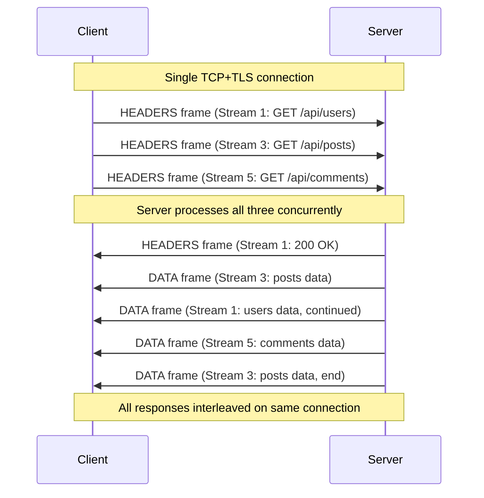
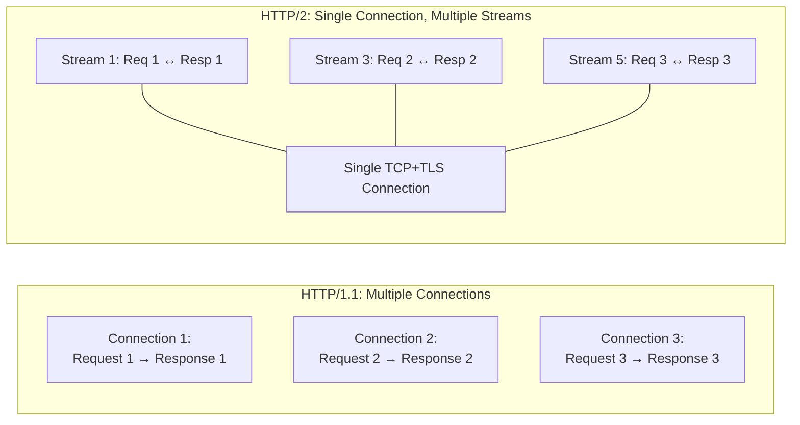
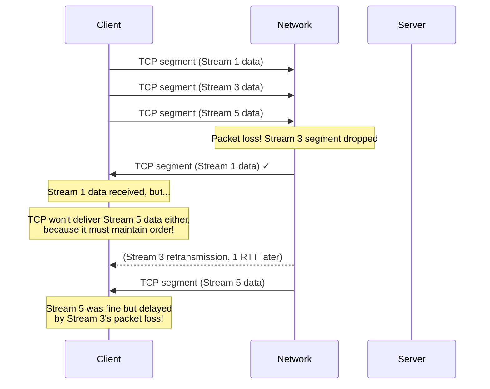
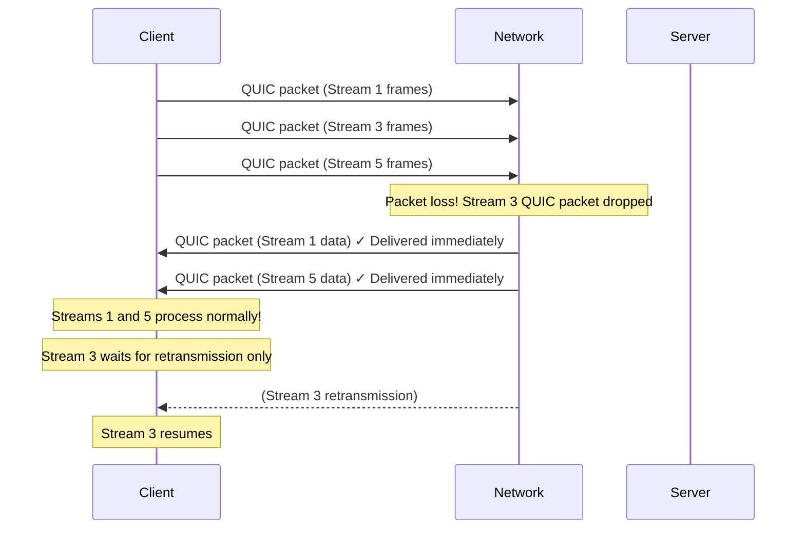
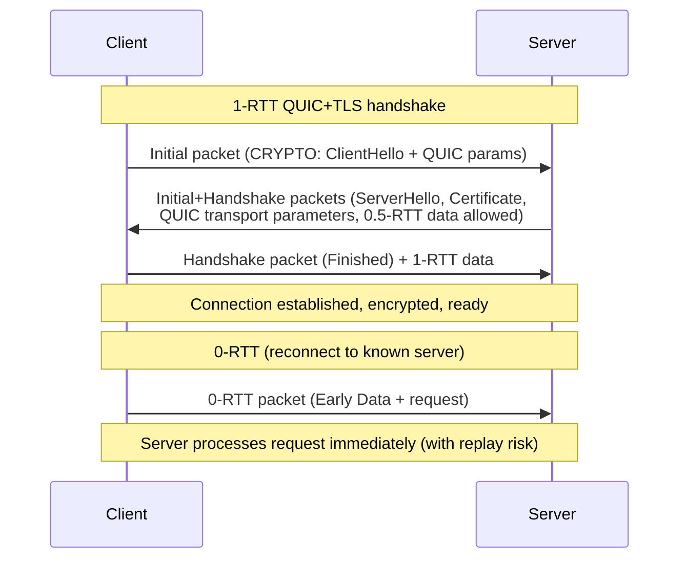

# HTTP/2 and HTTP/3

HTTP/1.1 was designed in 1997. It has served the web for nearly three decades, but its fundamental design assumptions — one request per connection, text-based headers, no multiplexing — become severe bottlenecks at the scale and complexity of modern web applications. HTTP/2 (2015) and HTTP/3 (2022) are not just incremental updates; they rearchitect how data moves between client and server.

Understanding these protocols is essential not just for web performance optimization, but for building and debugging any system that uses HTTP as a transport — which today means virtually every microservice, API, and data pipeline.

## The HTTP/1.1 Problem Set

HTTP/1.1 has several fundamental limitations that HTTP/2 was designed to address:

### 1. Head-of-Line Blocking at the Application Layer

HTTP/1.1 is strictly sequential: request 2 cannot be sent until the response to request 1 is complete (or pipelining is used, which almost no one does in practice because of middleware incompatibilities).

The workaround was to open **multiple parallel TCP connections** to the same server — browsers typically open 6 connections per origin. This is wasteful:
- Each connection requires its own handshake (TCP + TLS)
- Congestion control is per-connection, so 6 connections each start in slow start
- Server has to manage 6× more connection state
- NATs and proxies have 6× more state to track

### 2. Verbose, Redundant Headers

HTTP/1.1 headers are plain text and completely uncompressed. A typical HTTP request has 500–1000 bytes of headers. For APIs that make many small requests, header overhead can exceed payload size.

Worse, many headers are identical across requests: `User-Agent`, `Accept`, `Accept-Encoding`, `Cookie`, `Authorization`. HTTP/1.1 sends all of them in full every time.

### 3. No Server Push

HTTP/1.1 is purely client-initiated. The server cannot send resources the client will need before the client asks for them. This forces clients to download an HTML page, parse it, discover referenced CSS/JS files, and then make additional round trips to fetch them.

### 4. Text-Based Protocol

HTTP/1.1 headers are human-readable ASCII text, which simplifies debugging but requires parsing — tokenizing headers is slower than deserializing binary frames.

## HTTP/2: The Binary Framing Layer

HTTP/2 (RFC 7540, 2015; RFC 9113, 2022) solves all of these problems without changing the semantics of HTTP. GET, POST, headers, status codes — all the same. Only the wire format changes.

### Binary Framing

HTTP/2 introduces a **binary framing layer** between the TCP connection and the HTTP messages. Instead of text, all communication is binary frames of a fixed format:

```
+-----------------------------------------------+
|                 Length (24 bits)              |
+---------------+---------------+---------------+
|   Type (8)    |   Flags (8)   |
+-+-------------+---------------+-------------------------------+
|R|                 Stream Identifier (31 bits)                |
+=+=============================================================+
|                   Frame Payload (variable)                   |
+---------------------------------------------------------------+
```

Frame types include:

| Type | Value | Purpose |
|------|-------|---------|
| DATA | 0x0 | HTTP body payload |
| HEADERS | 0x1 | HTTP headers (compressed) |
| PRIORITY | 0x2 | Stream priority (deprecated in RFC 9113) |
| RST_STREAM | 0x3 | Cancel a stream |
| SETTINGS | 0x4 | Connection parameters |
| PUSH_PROMISE | 0x5 | Server push announcement |
| PING | 0x6 | Heartbeat / RTT measurement |
| GOAWAY | 0x7 | Graceful connection shutdown |
| WINDOW_UPDATE | 0x8 | Flow control credit |
| CONTINUATION | 0x9 | Continuation of HEADERS |

### Streams and Multiplexing

The key abstraction in HTTP/2 is the **stream** — a bidirectional sequence of frames within a single TCP connection. Multiple streams can be interleaved on the same connection simultaneously.



Stream IDs: client-initiated streams use odd numbers (1, 3, 5, ...), server-initiated (push) use even numbers (2, 4, 6, ...). Stream 0 is reserved for connection-level control.

**The fundamental difference from HTTP/1.1:**



### HPACK Header Compression

HPACK (RFC 7541) compresses HTTP headers using two techniques:

**1. Static table:** 61 pre-defined header name-value pairs. Common headers like `:method: GET`, `:status: 200`, `content-type: application/json` are encoded as a single byte.

**2. Dynamic table:** A client-maintained and server-maintained table of recently seen header values. When the server sends `content-type: application/json` for the first time, it can add it to the dynamic table. Future responses can reference it by index — 1–3 bytes instead of 30+ bytes.

HPACK compression is stateful. Compressing headers for a stream assumes knowledge of previous streams on the same connection. This is one reason HTTP/2 has per-connection (not per-request) flow control — the state must be consistent.

**Real numbers:** HTTP/2 header compression typically reduces header size by 85–95% in steady state. An API making 100 requests with 600-byte headers saves ~57,000 bytes in headers alone.

### Flow Control

HTTP/2 has **two levels** of flow control, both separate from TCP's flow control:

1. **Connection-level:** Total bytes the sender can send across all streams before receiving a WINDOW_UPDATE for the connection.
2. **Stream-level:** Bytes the sender can send on a specific stream before receiving a WINDOW_UPDATE for that stream.

Initial window size (default): 65,535 bytes for both levels. Servers often increase this via SETTINGS frame.

```
Client sends: SETTINGS { INITIAL_WINDOW_SIZE: 1048576 }  // 1MB window per stream
Server sends: SETTINGS { INITIAL_WINDOW_SIZE: 2097152 }  // 2MB window per stream
             WINDOW_UPDATE { stream_id: 0, increment: 10485760 }  // 10MB connection window
```

Flow control exists because without it, a fast sender could overwhelm a slow receiver's memory, even if TCP's window was large enough to allow it.

### HTTP/2 Server Push

Server push allows the server to proactively send resources the client will need, without waiting for the client to request them.

```
Client: GET /index.html
Server: PUSH_PROMISE { stream 4: GET /style.css }
        PUSH_PROMISE { stream 6: GET /app.js }
        HEADERS + DATA { stream 1: index.html content }
        HEADERS + DATA { stream 4: style.css content }
        HEADERS + DATA { stream 6: app.js content }
```

**Why server push mostly failed:**
- Clients may already have the resource in cache; the push is wasted bandwidth
- The server cannot know what's in the client's cache without hints (`Cache-Digest`, which was never widely adopted)
- Pushed resources cannot be shared across origins
- HTTP/3 removed server push from the core specification (made optional)

The feature that replaced push in practice: **`<link rel="preload">` headers** — the server hints what the client should fetch, and the client fetches it with proper cache checking.

### HTTP/2 Settings

The SETTINGS frame configures connection behavior. Key settings:

| Setting | Default | Purpose |
|---------|---------|---------|
| HEADER_TABLE_SIZE | 4096 | HPACK dynamic table size |
| ENABLE_PUSH | 1 | Server push enabled |
| MAX_CONCURRENT_STREAMS | unlimited | Max simultaneous streams |
| INITIAL_WINDOW_SIZE | 65535 | Per-stream flow control window |
| MAX_FRAME_SIZE | 16384 | Max frame payload size |
| MAX_HEADER_LIST_SIZE | unlimited | Max header block size |

In practice, `MAX_CONCURRENT_STREAMS` is often set to 100–1000 by servers. Exceeding it causes new stream requests to be queued.

## HTTP/2's Remaining Problem: TCP Head-of-Line Blocking

HTTP/2 eliminated **application-layer** head-of-line blocking. But TCP is still underneath, and TCP has its own head-of-line blocking at the **transport layer**.



If a single TCP packet is lost, TCP must retransmit it and will not deliver any later packets until the retransmission is received. All HTTP/2 streams on that connection are blocked — even the streams that had no lost packets.

On paths with 1% packet loss, this means a 1-in-100 chance of stalling all concurrent HTTP/2 streams. With 6 concurrent streams, the probability that at least one stalls is ~6%.

**This is the core motivation for HTTP/3.**

## HTTP/3 and QUIC

HTTP/3 (RFC 9114, 2022) moves from TCP to **QUIC** (RFC 9000, 2021). QUIC is a transport protocol built on UDP that reimplements the reliability guarantees of TCP while solving the head-of-line blocking problem.

### Why QUIC on UDP?

QUIC could not be built on TCP because:
- TCP is implemented in the OS kernel; updating all deployed kernels takes decades
- TCP's wire format cannot be changed without breaking compatibility (middleboxes expect specific patterns)
- UDP passes through almost all firewalls and NATs (unlike new TCP options or a new transport protocol number)

QUIC uses UDP as a substrate but implements its own:
- Reliability (ACKs, retransmission)
- Flow control (per-stream and per-connection)
- Congestion control (BBR or CUBIC)
- TLS 1.3 (integrated, not layered on top)
- Stream multiplexing

### QUIC Connection IDs

TCP identifies connections by 4-tuple: (src IP, src port, dst IP, dst port). If any of these change — e.g., a mobile client switches from Wi-Fi to 4G — the TCP connection is broken and must be restarted.

QUIC uses **Connection IDs** — arbitrary-length opaque values chosen by both endpoints. A QUIC connection can survive IP address changes, network changes, and NAT rebinding. The connection migrates seamlessly.

This is particularly valuable for mobile applications and long-lived connections.

### QUIC Stream Multiplexing (No HOL Blocking)

QUIC implements streams at the transport layer, not the application layer. When a QUIC packet is lost:
- Only the stream(s) using that packet are stalled
- Other streams continue receiving data from their own QUIC packets
- No transport-layer HOL blocking



### QUIC's Integrated TLS 1.3

QUIC does not layer TLS on top of QUIC the way HTTP/2 layers TLS on top of TCP. TLS 1.3 is **integrated** into the QUIC handshake. The initial handshake establishes both the QUIC connection AND the TLS session in one pass:



For a **new connection to a known server** (0-RTT), QUIC can send application data in the very first packet — eliminating the connection establishment RTT entirely.

### HTTP/3 over QUIC

HTTP/3 (RFC 9114) maps HTTP semantics onto QUIC streams:

- Each HTTP request/response pair uses one bidirectional QUIC stream
- HTTP/3 uses **QPACK** for header compression (instead of HPACK)
- The control stream (unidirectional) carries SETTINGS frames
- Server push exists but is optional (most implementations disable it)

**QPACK vs HPACK:**

HPACK requires strict ordering of header blocks because the dynamic table is updated sequentially. This means header blocks must be sent and acknowledged in order — one form of HOL blocking.

QPACK (RFC 9204) is redesigned for QUIC's out-of-order delivery:
- Two unidirectional streams carry encoder/decoder instructions
- Header blocks can reference entries that haven't been acknowledged yet (with a risk flag)
- Required Insert Count (RIC) field tells the decoder when it's safe to apply the header block

### Protocol Comparison

```mermaid
graph TB
    subgraph HTTP1["HTTP/1.1"]
        H1APP["HTTP/1.1<br/>(text headers, sequential)"]
        H1TLS["TLS 1.2/1.3<br/>(optional)"]
        H1TCP["TCP"]
        H1IP["IP"]
        H1APP --> H1TLS --> H1TCP --> H1IP
    end

    subgraph HTTP2["HTTP/2"]
        H2APP["HTTP/2<br/>(binary, multiplexed, HPACK)"]
        H2TLS["TLS 1.2/1.3<br/>(required)"]
        H2TCP["TCP"]
        H2IP["IP"]
        H2APP --> H2TLS --> H2TCP --> H2IP
    end

    subgraph HTTP3["HTTP/3"]
        H3APP["HTTP/3<br/>(QUIC streams, QPACK)"]
        H3QUIC["QUIC<br/>(TLS 1.3 integrated,<br/>no HOL blocking)"]
        H3UDP["UDP"]
        H3IP["IP"]
        H3APP --> H3QUIC --> H3UDP --> H3IP
    end
```



### Real-World Performance Numbers

| Scenario | HTTP/1.1 | HTTP/2 | HTTP/3 |
|----------|----------|--------|--------|
| Fresh connection latency | 3 RTT (TCP+TLS 1.2) | 2 RTT (TCP+TLS 1.3) | 1 RTT (0-RTT possible) |
| Reconnect to known server | 2 RTT | 1 RTT | 0 RTT |
| 100 concurrent requests, 0% loss | ~6 connections × ~17 requests | 1 connection, 100 streams | 1 connection, 100 streams |
| 100 concurrent requests, 1% loss | ~6% chance of slow connection | All streams block | Only affected streams block |
| Page load, 0ms extra latency | 100% (baseline) | ~20% faster | ~10% faster than H2 |
| Page load, 150ms RTT, 2% loss | 100% (baseline) | Similar to H1.1 | ~30% faster than H2 |

**Key finding:** HTTP/3 shows the most improvement on **high-latency, lossy connections** (mobile, international). On low-latency, low-loss LAN connections, the difference is minimal.

### HTTP/3 Adoption

As of 2026:
- **Cloudflare, Fastly, Akamai**: HTTP/3 enabled by default
- **Google, YouTube**: HTTP/3 for all traffic
- **Chrome, Firefox, Safari**: Full HTTP/3 support
- **Nginx**: HTTP/3 supported (experimental → stable in 1.25+)
- **Caddy**: HTTP/3 enabled by default
- **Node.js**: QUIC support in progress (not stable)
- **Go net/http**: HTTP/3 via `quic-go` library

## Enabling HTTP/2 and HTTP/3 in Nginx

```nginx
# /etc/nginx/nginx.conf

http {
    # HTTP/2 (requires TLS)
    server {
        listen 443 ssl;
        listen [::]:443 ssl;
        http2 on;  # nginx 1.25.1+ syntax

        ssl_certificate /etc/nginx/ssl/cert.pem;
        ssl_certificate_key /etc/nginx/ssl/key.pem;
        ssl_protocols TLSv1.3 TLSv1.2;
        ssl_prefer_server_ciphers off;  # TLS 1.3 handles this

        # ALPN: advertise h2 (HTTP/2)
        # nginx handles this automatically when http2 is on

        # HTTP/3 (QUIC)
        listen 443 quic reuseport;
        listen [::]:443 quic reuseport;

        # Tell clients to try HTTP/3
        add_header Alt-Svc 'h3=":443"; ma=86400';
        add_header QUIC-Status $quic;  # diagnostic

        # HTTP/2 push (use sparingly or not at all)
        # http2_push /style.css;  # Don't: use Link preload instead
        add_header Link "</style.css>; rel=preload; as=style";

        # Tuning for HTTP/2
        http2_max_concurrent_streams 256;
        http2_chunk_size 16k;
        http2_idle_timeout 5m;

        location / {
            proxy_pass http://backend;
            proxy_http_version 1.1;  # HTTP/2 to backend requires special config
            proxy_set_header Connection "";  # Required for keepalive
        }
    }
}
```

::: tip HTTP/2 to Backend
Nginx supports HTTP/2 for upstream connections (`proxy_http_version 2`) but it requires the upstream to support HTTP/2 as well. Most application servers (Node.js, Python, Ruby) only support HTTP/1.1 internally; the HTTP/2 is terminated at nginx. This is fine — the expensive part (external clients) gets HTTP/2, and the internal connection uses HTTP/1.1 keep-alive.
:::

## TypeScript: HTTP/2 Client with Node.js

Node.js has a built-in `http2` module that supports full HTTP/2. For production use, `undici` is the recommended HTTP client with HTTP/2 and HTTP/3 support:

```typescript
import http2 from 'http2';

// Low-level HTTP/2 client session
class Http2Client {
  private session: http2.ClientHttp2Session | null = null;
  private readonly url: URL;
  private reconnectTimer: ReturnType<typeof setTimeout> | null = null;
  private destroyed = false;

  constructor(baseUrl: string) {
    this.url = new URL(baseUrl);
  }

  private connect(): http2.ClientHttp2Session {
    const session = http2.connect(this.url.origin, {
      // TLS options
      rejectUnauthorized: true,
      // ALPN: prefer HTTP/2
      ALPNProtocols: ['h2'],
      // Connection settings
      settings: {
        initialWindowSize: 1024 * 1024,       // 1MB per stream
        enablePush: false,                      // Don't want server push
        maxConcurrentStreams: 100,
      },
    });

    session.on('error', (err) => {
      console.error('HTTP/2 session error:', err.message);
      this.session = null;
      if (!this.destroyed) this.scheduleReconnect();
    });

    session.on('goaway', (errorCode, lastStreamID, opaqueData) => {
      console.warn(`HTTP/2 GOAWAY received: code=${errorCode}, lastStream=${lastStreamID}`);
      this.session = null;
      if (!this.destroyed) this.scheduleReconnect();
    });

    session.on('close', () => {
      this.session = null;
      if (!this.destroyed) this.scheduleReconnect();
    });

    // Send PING every 30s to detect dead connections
    const pingInterval = setInterval(() => {
      if (session.destroyed) {
        clearInterval(pingInterval);
        return;
      }
      session.ping(Buffer.from([0, 1, 2, 3, 4, 5, 6, 7]), (err, duration, payload) => {
        if (err) console.warn('HTTP/2 PING failed:', err.message);
        // duration is the RTT in milliseconds
      });
    }, 30_000);

    session.on('close', () => clearInterval(pingInterval));

    return session;
  }

  private getSession(): http2.ClientHttp2Session {
    if (!this.session || this.session.destroyed || this.session.closed) {
      this.session = this.connect();
    }
    return this.session;
  }

  private scheduleReconnect(delay = 1000): void {
    if (this.reconnectTimer) return;
    this.reconnectTimer = setTimeout(() => {
      this.reconnectTimer = null;
      try {
        this.session = this.connect();
      } catch (err) {
        console.error('Reconnect failed:', err);
        this.scheduleReconnect(Math.min(delay * 2, 30_000));
      }
    }, delay);
  }

  async request(
    path: string,
    options: { method?: string; headers?: Record<string, string>; body?: Buffer | string } = {}
  ): Promise<{ status: number; headers: http2.IncomingHttpHeaders; body: Buffer }> {
    const session = this.getSession();

    return new Promise((resolve, reject) => {
      const headers: http2.OutgoingHttpHeaders = {
        ':method': options.method ?? 'GET',
        ':path': path,
        ':scheme': this.url.protocol.replace(':', ''),
        ':authority': this.url.host,
        'content-type': 'application/json',
        ...options.headers,
      };

      if (options.body) {
        headers['content-length'] = Buffer.byteLength(options.body).toString();
      }

      const req = session.request(headers, {
        endStream: !options.body,
      });

      // Request timeout
      req.setTimeout(30_000, () => {
        req.destroy(new Error('Request timeout'));
      });

      req.on('response', (responseHeaders) => {
        const chunks: Buffer[] = [];

        req.on('data', (chunk: Buffer) => chunks.push(chunk));

        req.on('end', () => {
          resolve({
            status: Number(responseHeaders[':status']),
            headers: responseHeaders,
            body: Buffer.concat(chunks),
          });
        });
      });

      req.on('error', reject);

      if (options.body) {
        req.end(options.body);
      }
    });
  }

  destroy(): void {
    this.destroyed = true;
    if (this.reconnectTimer) clearTimeout(this.reconnectTimer);
    this.session?.destroy();
  }
}

// Usage
const client = new Http2Client('https://api.example.com');

// Multiple concurrent requests — all on one TCP connection
const [users, posts, comments] = await Promise.all([
  client.request('/api/users'),
  client.request('/api/posts'),
  client.request('/api/comments'),
]);

// Graceful shutdown
process.on('SIGTERM', () => client.destroy());
```

### Using undici for HTTP/2 (Recommended)

```typescript
import { Agent, request } from 'undici';

// undici Agent handles HTTP/2 multiplexing, connection pooling automatically
const agent = new Agent({
  connections: 1,         // One HTTP/2 connection is enough (multiplexed)
  pipelining: 100,        // Up to 100 concurrent requests
  keepAliveTimeout: 4000,
  keepAliveMaxTimeout: 600000,
  headersTimeout: 30000,
  bodyTimeout: 30000,
  // Enable HTTP/2
  allowH2: true,
});

const { statusCode, body } = await request('https://api.example.com/data', {
  dispatcher: agent,
  method: 'GET',
  headers: { 'accept': 'application/json' },
});

const data = await body.json();
```

## HTTP/2 Problems and Edge Cases

### Stream Limit Exhaustion

If all `MAX_CONCURRENT_STREAMS` streams are in use, new requests queue. Under high concurrency, this can cause head-of-line blocking at the HTTP/2 layer (different from TCP HOL blocking, but similar effect). Solutions:

1. Increase `MAX_CONCURRENT_STREAMS` on the server (tune based on server capacity)
2. Use multiple HTTP/2 sessions (one per server; connection pooling still applies)
3. Monitor stream utilization and alert before exhaustion

### HPACK Compression State Corruption

HPACK state is per-connection. If the connection drops mid-stream and is reestablished, the HPACK dynamic table is reset. This is handled automatically by HTTP/2 implementations but means headers are larger on the first requests of a new connection (cold start).

### HTTP/2 and Load Balancers

HTTP/1.1 connections are ephemeral — the load balancer distributes each connection to a backend. HTTP/2 connections are persistent — once established, all requests from a client to that connection go to the same backend.

This changes load balancer behavior significantly:
- A client with 100 concurrent requests via HTTP/2 sends all 100 to one backend
- A client with 100 concurrent HTTP/1.1 connections distributes them across 6 backends

For internal service-to-service HTTP/2, **L7 load balancing** (not L4) is required to distribute at the stream/request level. See [gRPC Internals](./grpc-internals) for how this relates to gRPC.

::: info War Story
**Migrating a high-traffic image API to HTTP/2**

An image serving API processed ~50,000 requests/second from a global CDN. We migrated from HTTP/1.1 with 6 connections per CDN PoP to HTTP/2 with 1 connection per PoP.

**What broke:**
1. **Per-connection state**: The CDN's health check hit a different backend than user requests (HTTP/1.1 load balancer spread connections; HTTP/2 stuck to one backend). Some backends went unhealthy undetected.
2. **SETTINGS frame negotiation**: Our origin server sent `MAX_CONCURRENT_STREAMS: 128`. The CDN tried to send 500 concurrent requests, which queued. The CDN's timeout fired before many requests completed.
3. **Header size limits**: We had a middleware that added a debug trace header with a full request path (sometimes 2KB). HTTP/2's `MAX_HEADER_LIST_SIZE` of 8KB was fine, but HPACK dynamic table thrashing (new values every request) caused compression to be less effective than expected.

**Fixes:**
1. Increased `MAX_CONCURRENT_STREAMS` to 1000 after capacity testing each backend
2. Switched to L7 load balancing (Envoy) for HTTP/2-aware request distribution
3. Capped the trace header to 256 bytes

**Results:** 18% latency reduction at P50, 35% reduction at P99. Header bandwidth reduced by 76%. Backend server CPU down 12% (fewer connections to maintain).

The lesson: HTTP/2 is not a drop-in replacement. Connection persistence changes load balancing assumptions, and concurrent stream limits must be tuned to match backend capacity.
:::

## HTTP/3 Migration Checklist

Enabling HTTP/3 is generally lower risk than HTTP/2 because:
- HTTP/3 requires TLS anyway (already needed for HTTP/2)
- Fallback to HTTP/2/1.1 is automatic via the `Alt-Svc` header
- No load balancer behavioral changes (QUIC is L4-terminated per-connection)

```bash
# 1. Verify QUIC is supported in nginx version
nginx -V 2>&1 | grep quic

# 2. Open UDP port 443 in firewall (QUIC uses UDP)
ufw allow 443/udp

# 3. Test QUIC connectivity
curl --http3 https://yoursite.example.com -I

# 4. Check with quic-debug tools
quic-debug-client yoursite.example.com:443

# 5. Cloudflare: enable in Network settings → HTTP/3 (with QUIC)
```

::: warning QUIC and UDP Blocking
Some corporate firewalls block UDP traffic other than DNS. Clients behind these firewalls cannot connect via QUIC and fall back to HTTP/2. This is expected and handled automatically by the `Alt-Svc` mechanism. Monitor HTTP/3 adoption rate; don't expect 100%.
:::

---

**Next:** [gRPC Internals](./grpc-internals) — how gRPC maps RPC semantics onto HTTP/2 streams, and the Protocol Buffers encoding underneath.
