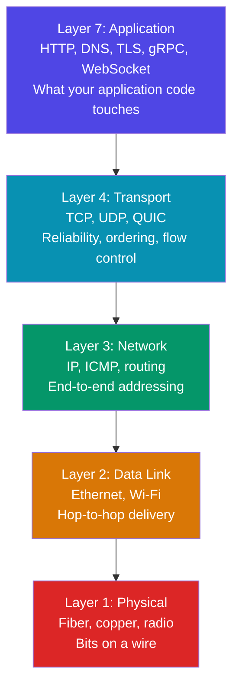
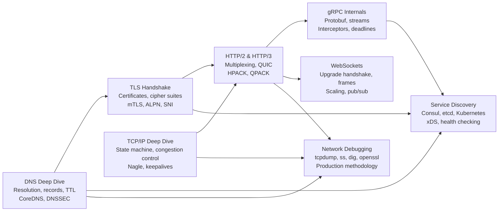

# Networking for Engineers

Most engineers treat the network as a black box — you send bytes in one end and they appear on the other side. That mental model works until it doesn't: until the load balancer starts dropping connections, until your gRPC service hangs with no error, until your deployment silently breaks DNS for 20 minutes. At that point you need to know what is actually happening in the wire.

This section builds a mental model of networking from first principles, going deep enough that you can debug any network issue in production and make confident architectural decisions about protocols, service discovery, and connection management.

## Why Networking Matters to Every Engineer

Networking is not just "ops work." Every line of application code that touches a database, calls a downstream API, or serves a user request runs over the network. The network is not a reliable transport — it is a distributed system with its own failure modes, latency characteristics, and correctness constraints.

**The fundamental insight:** Every network call is a distributed systems problem.

When you write `await fetch('https://api.example.com/data')`, you are:
- Resolving DNS (potentially stale, potentially failing)
- Establishing a TCP connection (three-way handshake, ~1 RTT)
- Performing a TLS handshake (1–2 RTTs, certificate validation)
- Sending an HTTP request over a multiplexed connection
- Waiting for a response that may never come
- Deciding what to do if the connection drops mid-response

Each of those steps has failure modes. Engineers who understand them write resilient code. Engineers who do not write code that works in development and fails mysteriously in production.

## The Networking Stack

The OSI model is a teaching tool. The real model used in practice is the TCP/IP model, which has four layers (or five if you split the physical layer):

### Layer by Layer: What Each Does

| Layer | Protocol(s) | Key Concepts | Where Engineers Spend Time |
|-------|-------------|--------------|---------------------------|
| L7 Application | HTTP/1.1, HTTP/2, HTTP/3, gRPC, WebSocket, DNS | Request-response semantics, streaming, encoding | Most application code lives here |
| L4 Transport | TCP, UDP, QUIC | Connections, reliability, ordering, flow control, congestion control | Connection pooling, timeout tuning, keepalives |
| L3 Network | IPv4, IPv6, ICMP | Routing, fragmentation, NAT, TTL | Firewall rules, VPC routing, MTU issues |
| L2 Data Link | Ethernet, 802.11 Wi-Fi | MAC addresses, frames, ARP | Rarely touched in software; matters for MTU debugging |
| L1 Physical | Fiber, copper, coax | Bandwidth, latency, signal | Almost never touched by software engineers |

**Where most production problems live:** L4 (TCP connection exhaustion, TIME_WAIT, window scaling) and L7 (protocol bugs, header misconfiguration, HTTP/2 stream limits).

## Concept Map of This Section

## Real Latency Numbers Every Engineer Must Know

Understanding networking means having latency numbers internalized. These are ballpark figures for 2025 hardware and infrastructure:

| Network Type | Round-trip Latency | Bandwidth (typical) | Notes |
|-------------|-------------------|---------------------|-------|
| Same process (loopback) | < 0.05 ms | 40+ Gbps | Just kernel overhead |
| Same machine, different process | 0.05–0.1 ms | 10–40 Gbps | IPC or loopback |
| Same rack (LAN) | 0.1–0.5 ms | 10–100 Gbps | Datacenter backbone |
| Same datacenter, different rack | 0.5–2 ms | 1–40 Gbps | Top-of-rack switching |
| Same region, different AZ | 2–5 ms | 1–10 Gbps | Intra-region cross-AZ |
| Same continent, different region | 20–80 ms | 100 Mbps–10 Gbps | Long-haul fiber |
| Cross-continent (US ↔ Europe) | 80–150 ms | 100 Mbps–1 Gbps | Transatlantic cable |
| Cross-continental (US ↔ Asia) | 150–300 ms | 100 Mbps–1 Gbps | Transpacific cable |
| LEO satellite (Starlink) | 20–60 ms | 50–300 Mbps | Varies by weather, congestion |
| GEO satellite | 500–800 ms | 10–50 Mbps | Physics: 36,000 km altitude |
| Mobile (4G/LTE) | 20–50 ms | 10–100 Mbps | Highly variable |
| Mobile (5G) | 5–20 ms | 100 Mbps–1 Gbps | Cell density dependent |

### Latency Breakdown of a Typical HTTPS Request

For an uncached request from a browser to a production API in the same region:

| Phase | Typical Duration | Protocol |
|-------|-----------------|---------|
| DNS resolution (cached at OS) | < 1 ms | — |
| DNS resolution (recursive resolver) | 5–50 ms | DNS/UDP |
| TCP handshake (3-way) | 1× RTT = ~2–10 ms | TCP |
| TLS 1.3 handshake | 1× RTT = ~2–10 ms | TLS |
| HTTP request + first byte | 1× RTT + server time | HTTP/2 |
| **Total (warm DNS, TLS 1.3)** | **~15–50 ms** | — |
| **Total (cold DNS, TLS 1.2)** | **~50–200 ms** | — |

This is why connection reuse matters — eliminating the TCP and TLS handshake on subsequent requests is the single biggest latency optimization available.

## The Key Principles Running Through This Section

### 1. Reliability is Illusion, Not Default

The network does not guarantee delivery. Packets are dropped, reordered, duplicated, and corrupted. TCP builds a reliable abstraction on top of unreliable IP, but TCP itself can fail (connections time out, resets arrive, windows stall). Your application must handle network failures explicitly.

### 2. Every Protocol is a Negotiation

HTTP/2 requires TLS, which requires TCP, which requires IP routing, which requires DNS. Each layer negotiates its own parameters: TLS negotiates cipher suites and certificates, TCP negotiates window sizes and options, HTTP/2 negotiates settings frames. Understanding what gets negotiated and when tells you where to look when things fail.

### 3. Statefulness is the Enemy of Scale

TCP connections are stateful. WebSockets are stateful. Sessions are stateful. Every piece of state you push to the network layer makes horizontal scaling harder. The solutions — connection pooling, sticky sessions, Redis-backed session stores, connection draining — all exist to manage this fundamental tension.

### 4. Timeouts Are Required Everywhere

A network call without a timeout is a promise to wait forever. In a microservices system, one slow upstream without a timeout will eventually exhaust the thread pool or connection pool of every service that calls it. Timeouts must be set at every layer: DNS timeout, TCP connect timeout, TLS handshake timeout, request timeout, idle connection timeout.

### 5. Observability at the Network Layer

Most application observability (tracing, metrics, logs) lives at the application layer. But network-layer problems — packet loss, TCP retransmissions, DNS failures, TLS errors — are invisible to application code. Tools like `tcpdump`, `ss`, `dig`, and `openssl s_client` are the microscope for this layer.

## Learning Path

Work through the pages in this order for the most coherent understanding:

| Order | Page | Difficulty | Key Question It Answers |
|-------|------|------------|------------------------|
| 1 | [TCP/IP Deep Dive](./tcp-ip-deep-dive) | Intermediate | How does TCP actually work? Why does TIME_WAIT happen? |
| 2 | [HTTP/2 and HTTP/3](./http2-http3) | Intermediate | What changed from HTTP/1.1? Why is QUIC over UDP? |
| 3 | [gRPC Internals](./grpc-internals) | Advanced | How does protobuf encoding work? How do streams map to HTTP/2? |
| 4 | [WebSockets](./websockets) | Intermediate | How do persistent connections work? How do you scale them? |
| 5 | [DNS Deep Dive](./dns-deep-dive) | Intermediate | How does name resolution actually work? What is TTL? |
| 6 | [TLS Handshake](./tls-handshake) | Advanced | How is a secure channel established? What is mTLS? |
| 7 | [Service Discovery](./service-discovery) | Advanced | How do services find each other in dynamic environments? |
| 8 | [Network Debugging](./network-debugging) | Intermediate | How do I diagnose a network problem in production? |

## How the Pages Connect

**Start with TCP** because HTTP/2, HTTP/3, gRPC, and WebSockets all build on it (or deliberately work around it). Understanding TCP's congestion control and flow control makes HTTP/2 multiplexing make sense. Understanding TCP's three-way handshake makes TLS's layering on top of it make sense.

**DNS and TLS** are prerequisites for understanding service discovery. Service discovery in Kubernetes uses CoreDNS under the hood. mTLS in service meshes requires understanding the TLS handshake deeply.

**The debugging page** is a capstone — it assumes you know the protocols and teaches you how to inspect them in a running system. Read it after the protocol pages.

## A Note on Protocol Versions

At the time of writing (2026), the state of the world is:

- **HTTP/1.1:** Still dominant for internal microservice communication where TLS termination happens at the load balancer
- **HTTP/2:** Standard for external API traffic; widely supported in all major HTTP clients and servers
- **HTTP/3 / QUIC:** Deployed by major CDNs (Cloudflare, Google, Fastly); browser support universal; backend support still catching up
- **TLS 1.3:** Default in all modern servers; TLS 1.2 still configured for compatibility
- **gRPC:** Standard for internal service-to-service communication in microservices architectures
- **WebSockets:** Still the standard for bidirectional real-time communication; WebTransport (WebRTC data channels over QUIC) emerging

The networking landscape changes fast. The fundamentals — how TCP handles congestion, how TLS establishes trust, how DNS resolves names — are stable across decades. Master the fundamentals and you can adapt to any protocol evolution.

---

::: tip Where to Start
If you are debugging a production issue right now, jump to [Network Debugging](./network-debugging). If you are learning systematically, start with [TCP/IP Deep Dive](./tcp-ip-deep-dive).
:::
