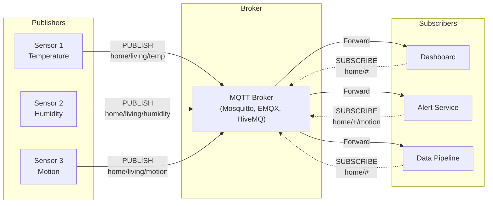
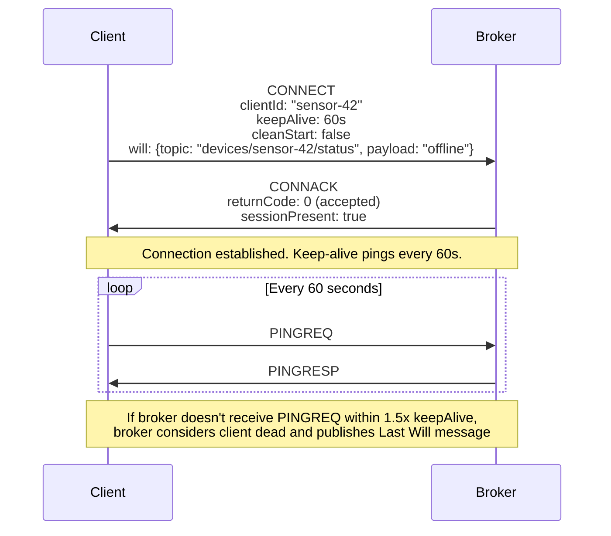
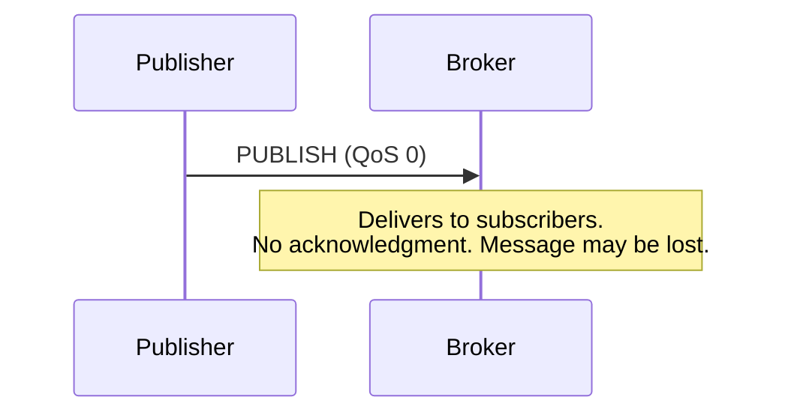
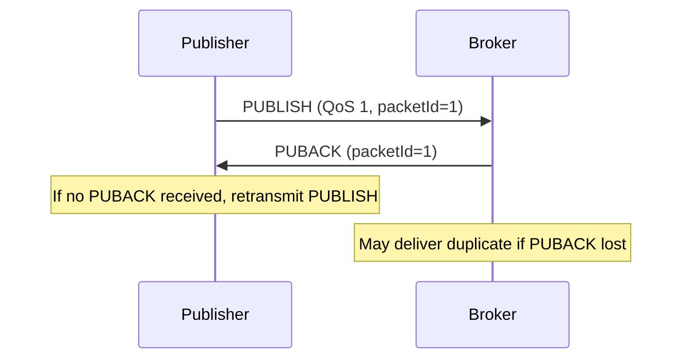
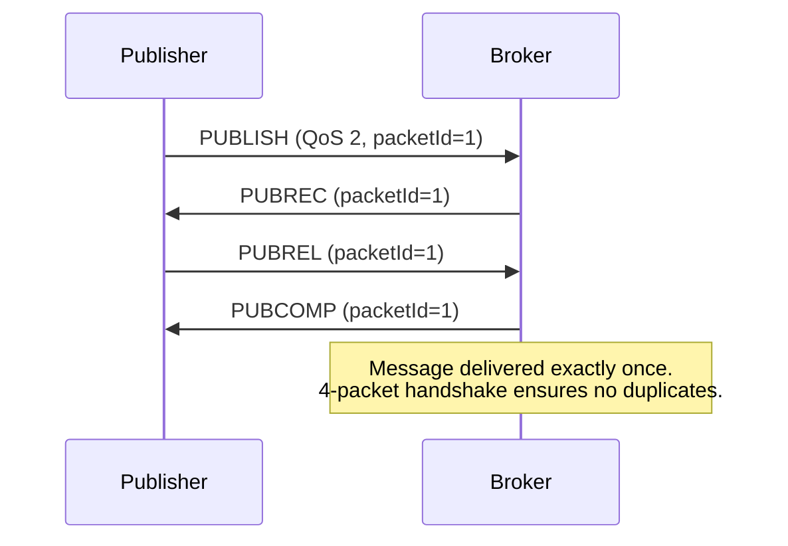
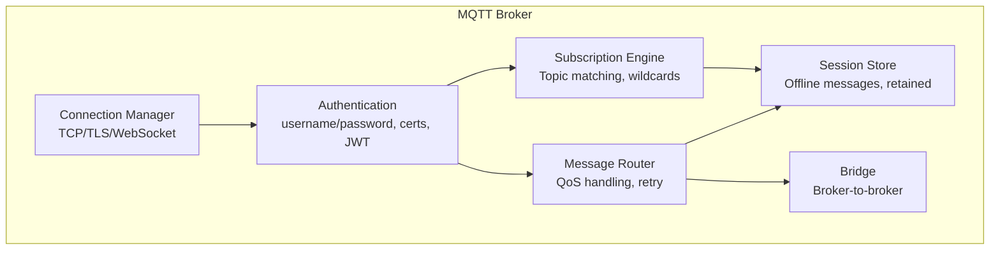

# MQTT for IoT

MQTT (Message Queuing Telemetry Transport) is the dominant messaging protocol for IoT (Internet of Things). Designed in 1999 by Andy Stanford-Clark (IBM) and Arlen Nipper for connecting oil pipeline sensors over satellite links, MQTT was built from the ground up for constrained environments: low bandwidth, unreliable networks, limited device memory and CPU.

Today MQTT connects billions of devices — from industrial sensors and smart home devices to connected vehicles and medical equipment. It is also widely used outside IoT for mobile messaging (Facebook Messenger used MQTT for years), real-time dashboards, and event-driven microservices where its lightweight publish/subscribe model outperforms HTTP-based alternatives.

## Why MQTT Over HTTP

| Dimension | HTTP | MQTT |
|-----------|------|------|
| Protocol overhead | Large headers (hundreds of bytes) | Minimal header (2 bytes minimum) |
| Communication pattern | Request-response (client pulls) | Publish-subscribe (server pushes) |
| Connection | Short-lived or keep-alive | Persistent, always-on |
| Power consumption | High (frequent reconnections, TLS handshakes) | Low (single long-lived connection) |
| Bandwidth efficiency | Low (verbose headers, redundant metadata) | High (binary protocol, tiny overhead) |
| Bidirectional | No (without WebSockets) | Yes (both directions on same connection) |
| Message delivery guarantees | None (application must implement) | Built-in QoS 0, 1, 2 |
| Offline message buffering | None | Retained messages + persistent sessions |

For a temperature sensor sending a 10-byte reading every 30 seconds, HTTP adds ~200 bytes of headers per request. MQTT adds ~4 bytes. Over 24 hours, that is 576 KB (HTTP) vs 11.5 KB (MQTT) — a 50x difference that matters on battery-powered cellular devices.

## Publish/Subscribe Model

MQTT decouples message producers (publishers) from consumers (subscribers) through a central broker:



### Topic Structure

MQTT topics are hierarchical strings separated by `/`:

```
home/living-room/temperature
home/living-room/humidity
home/bedroom/temperature
factory/line-1/machine-42/vibration
fleet/vehicle-abc/gps/position
```

### Wildcard Subscriptions

| Wildcard | Meaning | Example |
|----------|---------|---------|
| `+` (single level) | Matches exactly one level | `home/+/temperature` matches `home/living-room/temperature` and `home/bedroom/temperature` but not `home/living-room/sub/temperature` |
| `#` (multi level) | Matches zero or more levels (must be last) | `home/#` matches `home/living-room/temperature`, `home/bedroom/humidity`, and `home` itself |
| Combined | Mix wildcards | `factory/+/+/vibration` matches any machine's vibration on any line |

::: warning Topic Design Matters
Design topics like you design REST API paths — with a clear hierarchy. Bad topic design leads to wildcard over-matching and excessive message delivery.

**Good:** `{org}/{site}/{device-type}/{device-id}/{metric}`
`acme/factory-1/pump/pump-42/pressure`

**Bad:** `pump-42-pressure` (flat, no hierarchy, cannot use wildcards)
:::

## Connection Lifecycle

### CONNECT Packet

Every MQTT session starts with a CONNECT packet from the client to the broker:



### Key CONNECT Parameters

| Parameter | Purpose | Typical Value |
|-----------|---------|---------------|
| `clientId` | Unique identifier for the client | `sensor-42`, `mobile-app-user-123` |
| `keepAlive` | Max seconds between control packets | 30-120 seconds |
| `cleanStart` | Discard previous session state? | `false` for persistent sessions |
| `username/password` | Authentication credentials | Varies |
| `will` | Message published if client disconnects unexpectedly | Status: "offline" |

## QoS Levels

MQTT provides three Quality of Service levels that trade delivery guarantees against overhead:

### QoS 0: At Most Once (Fire and Forget)



- No acknowledgment, no retransmission
- Message may be lost if the network drops it
- Lowest overhead, highest throughput
- **Use for:** Frequent sensor readings where losing one is acceptable (temperature every second)

### QoS 1: At Least Once



- Broker acknowledges receipt with PUBACK
- Publisher retransmits if no PUBACK received
- Message is guaranteed to arrive but may arrive more than once
- **Subscriber must be idempotent** — handle duplicate messages correctly
- **Use for:** Alerts, status changes, commands (with idempotent handlers)

### QoS 2: Exactly Once



- Four-packet handshake eliminates duplicates
- Highest overhead, lowest throughput
- Guaranteed exactly-once delivery
- **Use for:** Billing events, critical commands, financial transactions

### QoS Comparison

| Property | QoS 0 | QoS 1 | QoS 2 |
|----------|-------|-------|-------|
| Delivery guarantee | At most once | At least once | Exactly once |
| Packets per message | 1 | 2 | 4 |
| Duplicates possible | No (just loss) | Yes | No |
| Throughput | Highest | Medium | Lowest |
| Use case | Telemetry | Alerts, commands | Billing, critical state |

::: tip QoS Is End-to-End, Not Just Publisher-to-Broker
The QoS level applies independently on two legs: publisher-to-broker and broker-to-subscriber. A message published at QoS 2 to the broker is delivered to the subscriber at the subscriber's QoS level, which may be lower. The broker delivers at the **minimum** of the published QoS and the subscription QoS.
:::

## Retained Messages

A retained message is the last message published to a topic with the retain flag set. When a new subscriber subscribes to that topic, the broker immediately delivers the retained message — even if it was published hours ago.

```javascript
// Publisher: set retain flag
client.publish('devices/sensor-42/status', 'online', {
  retain: true,
  qos: 1
});

// Later, a new subscriber connects and subscribes
// Immediately receives "online" without waiting for next publish
client.subscribe('devices/sensor-42/status');
client.on('message', (topic, msg) => {
  console.log(`${topic}: ${msg}`); // devices/sensor-42/status: online
});
```

**Use cases:**
- Device status (online/offline) — new dashboards immediately see current state
- Configuration — new devices subscribe and get current config
- Last known value — new subscribers get the latest sensor reading without waiting

To clear a retained message, publish an empty payload with retain flag set.

## Last Will and Testament (LWT)

The Last Will is a message that the broker publishes on behalf of a client when the client disconnects unexpectedly (network failure, crash, no PINGREQ within keepAlive timeout):

```javascript
const client = mqtt.connect('mqtt://broker.example.com', {
  clientId: 'sensor-42',
  will: {
    topic: 'devices/sensor-42/status',
    payload: 'offline',
    qos: 1,
    retain: true  // Combined with retain: updates device status
  }
});

// On connect, publish "online" as retained
client.on('connect', () => {
  client.publish('devices/sensor-42/status', 'online', {
    retain: true,
    qos: 1
  });
});
```

This pattern gives you real-time device presence tracking:
1. Client connects with LWT: "offline" (retained)
2. Client publishes "online" (retained) on connect
3. If client disconnects gracefully: publishes "offline" (retained)
4. If client disconnects unexpectedly: broker publishes LWT "offline" (retained)

Any subscriber to `devices/sensor-42/status` always knows the device's current state.

## MQTT 5.0 Features

MQTT 5.0 (released 2019) added significant improvements over 3.1.1:

### Key New Features

| Feature | Description | Use Case |
|---------|-------------|----------|
| **User Properties** | Key-value pairs on any packet | Metadata, correlation IDs, tracing headers |
| **Shared Subscriptions** | Load-balance messages across subscriber group | Scaling consumers horizontally |
| **Message Expiry** | TTL on messages (seconds) | Time-sensitive alerts, stale data cleanup |
| **Topic Aliases** | Map long topic strings to short integers | Bandwidth reduction for verbose topics |
| **Request/Response** | Correlation data + response topic | RPC-style patterns over MQTT |
| **Reason Codes** | Detailed error codes on all ACK packets | Better error handling and debugging |
| **Flow Control** | Receive Maximum — limit in-flight messages | Backpressure on slow consumers |
| **Subscription Options** | No-local, retain-as-published, handling | Fine-grained delivery control |
| **Auth Enhanced** | Multi-step authentication (SASL-like) | OAuth, SCRAM, challenge-response |

### Shared Subscriptions

In MQTT 3.1.1, every subscriber to a topic receives every message. In MQTT 5.0, shared subscriptions distribute messages across a group:

```
# Normal subscription (all get every message):
subscriber-1: SUBSCRIBE "sensors/temperature"
subscriber-2: SUBSCRIBE "sensors/temperature"
# Both receive every message

# Shared subscription (load-balanced):
subscriber-1: SUBSCRIBE "$share/workers/sensors/temperature"
subscriber-2: SUBSCRIBE "$share/workers/sensors/temperature"
# Each message goes to one subscriber (round-robin)
```

This enables horizontal scaling of MQTT consumers, similar to Kafka consumer groups.

### Request/Response Pattern

```javascript
// Requester
const correlationId = crypto.randomUUID();

client.subscribe('responses/' + clientId);
client.publish('commands/device-42/reboot', JSON.stringify({ action: 'reboot' }), {
  properties: {
    responseTopic: 'responses/' + clientId,
    correlationData: Buffer.from(correlationId)
  }
});

// Responder (device-42)
client.on('message', (topic, payload, packet) => {
  const responseTopic = packet.properties.responseTopic;
  const correlationData = packet.properties.correlationData;

  // Process command...
  client.publish(responseTopic, JSON.stringify({ status: 'rebooting' }), {
    properties: { correlationData }
  });
});
```

### Message Expiry

```javascript
client.publish('alerts/fire', 'FIRE DETECTED', {
  qos: 1,
  properties: {
    messageExpiryInterval: 300  // Expires after 5 minutes
  }
});
```

Messages expire in the broker if not delivered within the TTL. This prevents stale alerts from being delivered to a subscriber that reconnects hours later.

## Broker Architecture

### Broker Responsibilities



### Broker Comparison

| Broker | Language | License | Max Connections | Clustering | MQTT 5.0 | Notable Feature |
|--------|----------|---------|-----------------|------------|----------|-----------------|
| **Mosquitto** | C | EPL/EDL | ~100K | Limited (bridging) | Yes | Lightweight, single-node, embedded |
| **EMQX** | Erlang | Apache 2.0 | 100M+ (clustered) | Native RAFT | Yes | Highest scalability, rule engine |
| **HiveMQ** | Java | Commercial | 10M+ (clustered) | Native | Yes | Enterprise, Kafka bridge |
| **VerneMQ** | Erlang | Apache 2.0 | 1M+ | Native | Partial | Clustering, plugin system |
| **NanoMQ** | C | MIT | ~100K | MQTT bridge | Yes | Ultra-lightweight, edge computing |

### Mosquitto (Single Node)

Mosquitto is the most common MQTT broker for development and small deployments:

```bash
# Install
apt-get install mosquitto mosquitto-clients

# Configuration (/etc/mosquitto/mosquitto.conf)
listener 1883
listener 8883
certfile /etc/mosquitto/certs/server.crt
keyfile /etc/mosquitto/certs/server.key
cafile /etc/mosquitto/certs/ca.crt
require_certificate false

# WebSocket support
listener 8083
protocol websockets

# Authentication
password_file /etc/mosquitto/passwords
allow_anonymous false

# Persistence
persistence true
persistence_location /var/lib/mosquitto/
```

```bash
# Test with CLI
mosquitto_pub -h localhost -t "test/topic" -m "hello" -q 1
mosquitto_sub -h localhost -t "test/#" -v
```

### EMQX (Clustered Production)

For production IoT at scale, EMQX handles millions of concurrent connections:

```yaml
# EMQX cluster with Docker Compose
services:
  emqx1:
    image: emqx:5
    environment:
      EMQX_NODE_NAME: emqx@node1.emqx.io
      EMQX_CLUSTER__DISCOVERY_STRATEGY: static
      EMQX_CLUSTER__STATIC__SEEDS: "[emqx@node1.emqx.io,emqx@node2.emqx.io]"
    ports:
      - "1883:1883"   # MQTT
      - "8883:8883"   # MQTT/TLS
      - "8083:8083"   # MQTT/WebSocket
      - "18083:18083" # Dashboard

  emqx2:
    image: emqx:5
    environment:
      EMQX_NODE_NAME: emqx@node2.emqx.io
      EMQX_CLUSTER__DISCOVERY_STRATEGY: static
      EMQX_CLUSTER__STATIC__SEEDS: "[emqx@node1.emqx.io,emqx@node2.emqx.io]"
```

### Scaling MQTT

| Scale | Architecture | Example |
|-------|-------------|---------|
| < 10K connections | Single Mosquitto instance | Home automation, prototypes |
| 10K-100K | Mosquitto with bridging | Small fleet management |
| 100K-1M | EMQX/HiveMQ cluster (3-5 nodes) | Smart buildings, medium IoT |
| 1M-100M | EMQX cluster (10+ nodes) + LB | Connected vehicles, national IoT |
| 100M+ | Multi-region EMQX + edge brokers | Global consumer IoT platform |

## MQTT Security

| Layer | Mechanism | Implementation |
|-------|-----------|----------------|
| Transport | TLS 1.2/1.3 | Standard TLS on port 8883 |
| Authentication | Username/password, X.509 certs, JWT | Broker configuration |
| Authorization | Topic-level ACLs | Per-user publish/subscribe permissions |
| Payload | Application-level encryption | Encrypt payload before PUBLISH |

```
# ACL example (Mosquitto)
# user sensor-42 can publish to its own topics only
user sensor-42
topic write devices/sensor-42/#
topic read commands/sensor-42/#

# user dashboard can read everything
user dashboard
topic read devices/#
topic read alerts/#
```

::: danger Never Run MQTT Without TLS in Production
MQTT 3.1.1 transmits usernames and passwords in plaintext. Even with MQTT 5.0's enhanced authentication, the transport must be encrypted. Always use TLS (port 8883) or WSS (WebSocket Secure) in production. Mutual TLS (mTLS) with client certificates is the gold standard for device authentication.
:::

## Further Reading

- [Kafka Internals](/system-design/message-queues/kafka-internals) — Comparison: Kafka for high-throughput data pipelines, MQTT for device connectivity
- [WebSockets Deep Dive](/system-design/networking/websockets) — MQTT over WebSockets for browser clients
- [Backpressure Patterns](/system-design/message-queues/backpressure-patterns) — Handling slow consumers in MQTT
- [Queue Selection Guide](/system-design/message-queues/queue-selection-guide) — When to use MQTT vs Kafka vs RabbitMQ
- [Encryption in Transit](/security/encryption/encryption-in-transit) — TLS configuration for MQTT brokers
- MQTT.org specification — Official MQTT 5.0 and 3.1.1 standards
- *MQTT Essentials* (HiveMQ blog series) — Excellent free tutorial series
- Steve's Internet Guide (steves-internet-guide.com) — Practical MQTT tutorials with Python examples
