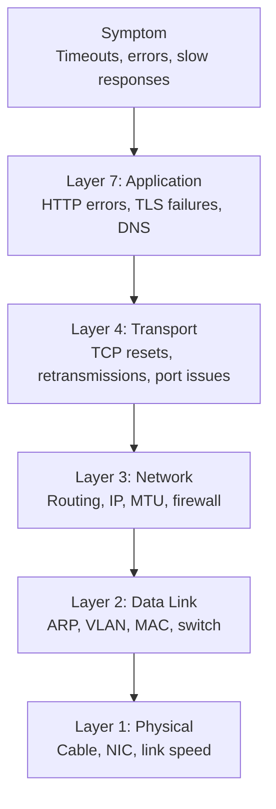
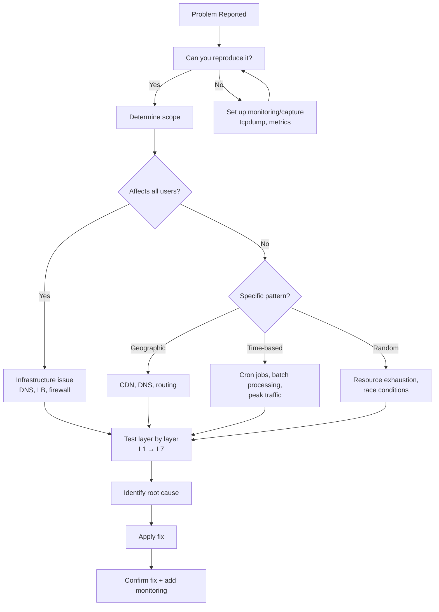
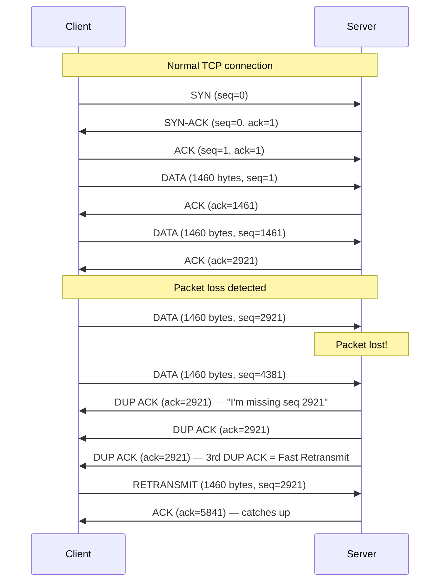
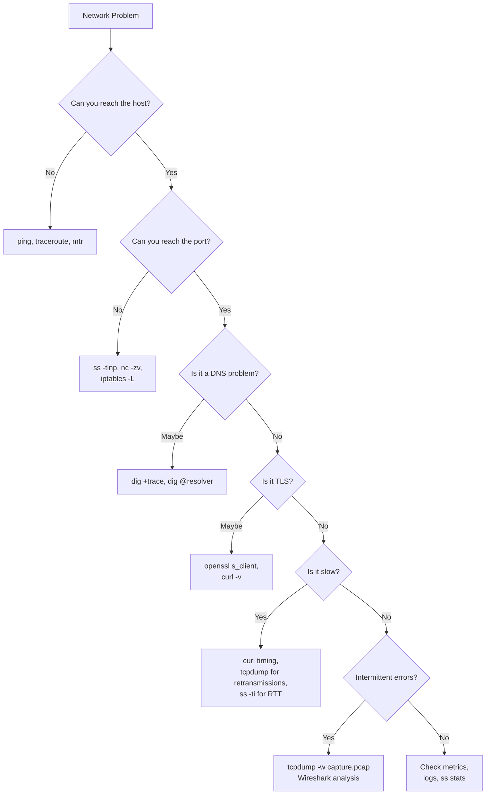

# Network Debugging

## Why Network Debugging Matters

Network issues are the most insidious class of production problems. Unlike application bugs that produce stack traces, network problems manifest as intermittent timeouts, degraded performance, or silent data corruption. They cross team boundaries — is it the app, the load balancer, the firewall, DNS, or the cloud provider? Systematic network debugging separates hours-long firefights from 15-minute resolutions.

The fundamental challenge: the network is a shared, stateful, multi-layered system where problems at any layer can masquerade as problems at another. A misconfigured MTU causes TCP retransmissions that look like application slowness. A DNS misconfiguration causes 5-second delays that look like database timeouts. A firewall rule change silently drops packets from a single service.

## First Principles

### The Debugging Mental Model

Network debugging follows the OSI model bottom-up, but in practice you start from the symptoms and narrow down:



### The Five Questions

For any network problem, answer these in order:

1. **Can I reach the host?** (ping, traceroute)
2. **Can I reach the port?** (telnet, nc, ss)
3. **Is DNS resolving correctly?** (dig, nslookup)
4. **Is the connection being established?** (tcpdump SYN/SYN-ACK)
5. **Is the application-layer protocol working?** (curl, openssl s_client)

## Core Tools

### ss — Socket Statistics

`ss` replaces `netstat` and is significantly faster (reads directly from kernel's `/proc/net`). It's the first tool to reach for when diagnosing connection issues on a host.

```bash
# Show all TCP connections with state
ss -tnp

# Show listening sockets with process names
ss -tlnp

# Show connections to a specific port
ss -tnp dport = :443

# Show connections from a specific source
ss -tnp src 10.0.1.0/24

# Show connections in specific state
ss -tn state established
ss -tn state time-wait
ss -tn state close-wait

# Show socket memory and timer info
ss -tnmi

# Count connections by state
ss -tn state established | wc -l
ss -tn state time-wait | wc -l
ss -tn state close-wait | wc -l

# Show TCP internal info (congestion window, RTT, retransmits)
ss -ti dst 10.0.2.5
```

Key `ss` output fields and what they mean:

| Field | Meaning | What to Look For |
|-------|---------|------------------|
| `State` | TCP state | Many CLOSE-WAIT = app not closing; many TIME-WAIT = high churn |
| `Recv-Q` | Bytes in receive buffer | Non-zero on ESTABLISHED = app not reading fast enough |
| `Send-Q` | Bytes in send buffer | Non-zero = network or receiver can't keep up |
| `Local Address` | Source IP:port | Verify correct interface binding |
| `Peer Address` | Destination IP:port | Verify connecting to correct endpoint |

```typescript
import { execSync } from 'node:child_process';

interface ConnectionStats {
  established: number;
  timeWait: number;
  closeWait: number;
  synRecv: number;
  synSent: number;
  listening: number;
  finWait1: number;
  finWait2: number;
}

function getConnectionStats(): ConnectionStats {
  const states = [
    'established',
    'time-wait',
    'close-wait',
    'syn-recv',
    'syn-sent',
    'listening',
    'fin-wait-1',
    'fin-wait-2',
  ] as const;

  const stats: Record<string, number> = {};

  for (const state of states) {
    const output = execSync(`ss -tn state ${state} | tail -n +2 | wc -l`, {
      encoding: 'utf-8',
    });
    stats[state] = parseInt(output.trim(), 10);
  }

  return {
    established: stats['established'],
    timeWait: stats['time-wait'],
    closeWait: stats['close-wait'],
    synRecv: stats['syn-recv'],
    synSent: stats['syn-sent'],
    listening: stats['listening'],
    finWait1: stats['fin-wait-1'],
    finWait2: stats['fin-wait-2'],
  };
}

function diagnoseFromStats(stats: ConnectionStats): string[] {
  const issues: string[] = [];

  if (stats.closeWait > 100) {
    issues.push(
      `HIGH CLOSE-WAIT (${stats.closeWait}): Application is not closing connections. ` +
      `Check for leaked HTTP clients or unclosed sockets.`
    );
  }

  if (stats.timeWait > 10_000) {
    issues.push(
      `HIGH TIME-WAIT (${stats.timeWait}): Many short-lived connections. ` +
      `Consider connection pooling or enabling tcp_tw_reuse.`
    );
  }

  if (stats.synRecv > 500) {
    issues.push(
      `HIGH SYN-RECV (${stats.synRecv}): Possible SYN flood attack or slow handshakes. ` +
      `Check SYN cookies (net.ipv4.tcp_syncookies).`
    );
  }

  if (stats.synSent > 200) {
    issues.push(
      `HIGH SYN-SENT (${stats.synSent}): Connections not completing. ` +
      `Target may be unreachable, firewalled, or overloaded.`
    );
  }

  if (stats.finWait2 > 500) {
    issues.push(
      `HIGH FIN-WAIT-2 (${stats.finWait2}): Remote side not closing cleanly. ` +
      `Check remote application's shutdown behavior.`
    );
  }

  return issues;
}
```

### tcpdump — Packet Capture

tcpdump is the most powerful network debugging tool. It captures raw packets on an interface and can filter by protocol, host, port, flags, and more.

#### Essential tcpdump Commands

```bash
# Capture all traffic on eth0
tcpdump -i eth0

# Capture traffic to/from a specific host
tcpdump -i eth0 host 10.0.1.5

# Capture only TCP traffic on port 443
tcpdump -i eth0 tcp port 443

# Capture with full packet contents (hex + ASCII)
tcpdump -i eth0 -XX port 80

# Capture and save to file for Wireshark analysis
tcpdump -i eth0 -w capture.pcap port 443

# Capture with timestamps and don't resolve names
tcpdump -i eth0 -tttt -n port 80

# Capture TCP SYN packets only (new connections)
tcpdump -i eth0 'tcp[tcpflags] & (tcp-syn) != 0'

# Capture TCP RST packets (connection resets)
tcpdump -i eth0 'tcp[tcpflags] & (tcp-rst) != 0'

# Capture only retransmissions (requires Linux)
tcpdump -i eth0 'tcp[tcpflags] & (tcp-syn|tcp-fin) = 0 and tcp[4:4] != 0'

# Capture DNS queries
tcpdump -i eth0 udp port 53

# Capture ICMP (ping, traceroute)
tcpdump -i eth0 icmp

# Capture first 200 bytes of each packet (headers + start of payload)
tcpdump -i eth0 -s 200 port 80

# Capture with ring buffer (rotate files)
tcpdump -i eth0 -w capture_%Y%m%d_%H%M%S.pcap -G 3600 -W 24 port 443
```

#### Reading tcpdump Output

```
14:32:05.123456 IP 10.0.1.5.52431 > 10.0.2.10.443: Flags [S], seq 1234567890, win 65535, options [mss 1460,sackOK,TS val 123456 ecr 0,nop,wscale 7], length 0
```

| Field | Value | Meaning |
|-------|-------|---------|
| `14:32:05.123456` | Timestamp | Microsecond precision |
| `10.0.1.5.52431` | Source IP.port | Client side |
| `10.0.2.10.443` | Destination IP.port | Server side |
| `Flags [S]` | TCP flags | S=SYN, .=ACK, F=FIN, R=RST, P=PUSH |
| `seq 1234567890` | Sequence number | Initial sequence number |
| `win 65535` | Window size | Receive buffer advertisement |
| `mss 1460` | Max segment size | Usually 1460 for Ethernet |
| `wscale 7` | Window scaling | Multiply win by 2^7 = 128 |
| `length 0` | Payload length | SYN has no payload |

#### Common TCP Flag Combinations

| Flags | Meaning |
|-------|---------|
| `[S]` | SYN — connection initiation |
| `[S.]` | SYN-ACK — connection accepted |
| `[.]` | ACK — acknowledgment |
| `[P.]` | PSH-ACK — data segment |
| `[F.]` | FIN-ACK — connection close |
| `[R]` | RST — connection reset (abrupt close) |
| `[R.]` | RST-ACK — reset with acknowledgment |

#### Debugging a TLS Handshake with tcpdump

```bash
# Capture TLS handshake details
tcpdump -i eth0 -nn -X port 443 | head -100

# What to look for:
# 1. Client SYN → Server SYN-ACK → Client ACK  (TCP handshake)
# 2. Client → Server: TLS ClientHello (0x16 0x03 0x01)
# 3. Server → Client: TLS ServerHello + Certificate
# 4. If RST after ClientHello: cipher mismatch or TLS version mismatch
# 5. If no response: firewall blocking, server not listening
```

### traceroute / mtr — Path Discovery

traceroute reveals the network path and identifies where packets are being dropped or delayed.

```bash
# Standard traceroute (ICMP)
traceroute 10.0.2.5

# TCP traceroute to a specific port (bypasses ICMP-blocking firewalls)
traceroute -T -p 443 10.0.2.5

# UDP traceroute (default on Linux)
traceroute -U 10.0.2.5

# mtr — continuous traceroute with statistics
mtr --report --report-cycles 100 10.0.2.5
```

#### Reading mtr Output

```
HOST                     Loss%   Snt   Last   Avg  Best  Wrst StDev
1. gateway.local          0.0%   100    0.5   0.6   0.3   1.2   0.2
2. isp-router.example     0.0%   100    3.2   3.5   2.8   8.1   1.1
3. core-router.isp.net    0.0%   100   10.1  10.5   9.8  15.2   1.3
4. peer.transit.net        2.0%   100   25.3  26.1  24.2  45.3   4.2
5. target-dc.example.com  0.0%   100   25.8  26.3  24.5  44.1   3.8
```

| Column | Meaning | Red Flags |
|--------|---------|-----------|
| Loss% | Packet loss at this hop | > 1% sustained = problem at or before this hop |
| Avg | Average RTT to this hop | Sudden jump = congestion at that hop |
| StDev | Latency variance | High StDev = jitter, bufferbloat, or shared link |
| Wrst | Worst case latency | Outliers indicate intermittent problems |

::: warning
Loss at intermediate hops but not the final destination is usually benign — many routers rate-limit ICMP responses (control plane policing). Only worry about loss if it persists at the final destination.
:::

### dig — DNS Debugging

```bash
# Basic A record lookup
dig example.com A

# Query a specific name server
dig @8.8.8.8 example.com A

# Trace the full resolution path
dig +trace example.com A

# Show short answer only
dig +short example.com A

# Check DNSSEC validation
dig +dnssec example.com A

# Check for CNAME chains
dig +trace +nodnssec www.example.com A

# Reverse lookup
dig -x 93.184.216.34

# Check SOA (useful for determining zone authority)
dig SOA example.com

# Check NS records
dig NS example.com

# Time the query
dig example.com A | grep "Query time"

# Check TXT records (SPF, DKIM, verification)
dig TXT example.com
```

### curl — HTTP Debugging

```bash
# Verbose output showing headers and TLS info
curl -v https://api.example.com/health

# Show timing breakdown
curl -o /dev/null -s -w "\
    DNS:        %{time_namelookup}s\n\
    Connect:    %{time_connect}s\n\
    TLS:        %{time_appconnect}s\n\
    TTFB:       %{time_starttransfer}s\n\
    Total:      %{time_total}s\n\
    Size:       %{size_download} bytes\n\
    Speed:      %{speed_download} bytes/s\n" \
    https://api.example.com/health

# Resolve to specific IP (bypass DNS)
curl --resolve api.example.com:443:10.0.1.5 https://api.example.com/health

# Test with specific TLS version
curl --tlsv1.3 --tls-max 1.3 https://api.example.com/health

# Show certificate chain
curl -vvv --head https://example.com 2>&1 | grep -A 20 "Server certificate"

# Follow redirects with verbose
curl -Lv https://example.com

# Test with specific HTTP version
curl --http2 https://api.example.com/health

# Connect timeout vs transfer timeout
curl --connect-timeout 5 --max-time 30 https://api.example.com/slow-endpoint
```

### openssl — TLS Debugging

```bash
# Connect and show full certificate chain
openssl s_client -connect example.com:443 -showcerts

# Test specific TLS version
openssl s_client -connect example.com:443 -tls1_3

# Check certificate expiration
echo | openssl s_client -connect example.com:443 2>/dev/null | \
  openssl x509 -noout -dates

# Verify certificate chain
openssl verify -CAfile /etc/ssl/certs/ca-certificates.crt cert.pem

# Show certificate details
openssl x509 -in cert.pem -noout -text

# Test ALPN negotiation
openssl s_client -connect example.com:443 -alpn h2,http/1.1

# Test SNI
openssl s_client -connect example.com:443 -servername example.com

# Check OCSP stapling
openssl s_client -connect example.com:443 -status
```

## Debugging Methodology

### The Systematic Approach



### Common Debugging Scenarios

#### Scenario 1: Connection Timeouts

```typescript
interface TimeoutDiagnosis {
  symptom: string;
  checks: string[];
  likelyCauses: string[];
  commands: string[];
}

const connectionTimeout: TimeoutDiagnosis = {
  symptom: 'Connection to service times out',
  checks: [
    '1. Can you ping the host? (L3 reachability)',
    '2. Can you connect to the port? (nc -zv host port)',
    '3. Is the service listening? (ss -tlnp on target)',
    '4. Is there a firewall? (iptables -L -n)',
    '5. Is TCP handshake completing? (tcpdump SYN/SYN-ACK)',
    '6. Is there packet loss? (mtr --report host)',
  ],
  likelyCauses: [
    'Firewall blocking the port',
    'Service not running or not bound to correct interface',
    'Security group / Network ACL misconfiguration',
    'Route table missing or incorrect',
    'Source NAT exhaustion (ephemeral port exhaustion)',
    'TCP backlog full (SYN queue overflow)',
  ],
  commands: [
    'ss -tlnp | grep <port>',
    'tcpdump -i any "tcp port <port> and tcp[tcpflags] & (tcp-syn) != 0"',
    'iptables -L -n -v | grep <port>',
    'ip route get <dest_ip>',
    'cat /proc/sys/net/ipv4/ip_local_port_range',
    'ss -tn state syn-sent | wc -l',
  ],
};
```

#### Scenario 2: Intermittent 502/503 Errors

```bash
# Check if backend is returning errors
tcpdump -i eth0 -A port 80 | grep -i "HTTP/1.1 5"

# Check for connection resets from backend
tcpdump -i eth0 'tcp[tcpflags] & (tcp-rst) != 0 and host <backend_ip>'

# Check backend connection stats
ss -tn dst <backend_ip> | head -20

# Check if LB health checks are failing
curl -v http://<backend_ip>:<port>/health

# Check for ephemeral port exhaustion
ss -tn state time-wait | wc -l
cat /proc/sys/net/ipv4/ip_local_port_range

# Check if ulimit is the issue
cat /proc/<pid>/limits | grep "open files"
ls /proc/<pid>/fd | wc -l
```

#### Scenario 3: Slow Responses

```bash
# Measure each phase of the connection
curl -o /dev/null -s -w "DNS: %{time_namelookup}\nTCP: %{time_connect}\nTLS: %{time_appconnect}\nTTFB: %{time_starttransfer}\nTotal: %{time_total}\n" https://api.example.com/endpoint

# If DNS is slow (> 50ms):
dig +trace api.example.com
# Check ndots in /etc/resolv.conf

# If TCP connect is slow (> 100ms):
mtr --report api.example.com
# Check for retransmissions:
ss -ti dst <ip>

# If TLS is slow (> 200ms):
openssl s_client -connect api.example.com:443
# Check if OCSP stapling is working:
openssl s_client -connect api.example.com:443 -status

# If TTFB is slow (> 500ms):
# Problem is application-side, not network
# Check application logs, database queries, etc.
```

### Wireshark Analysis

While tcpdump captures packets, Wireshark provides deep protocol analysis. Capture with tcpdump, analyze with Wireshark:

```bash
# Capture on remote server, analyze locally
tcpdump -i eth0 -w /tmp/capture.pcap -c 10000 port 443

# Transfer to local machine
scp server:/tmp/capture.pcap .

# Open in Wireshark
wireshark capture.pcap
```

#### Essential Wireshark Filters

| Filter | Purpose |
|--------|---------|
| `tcp.analysis.retransmission` | Show retransmitted packets |
| `tcp.analysis.zero_window` | Receiver's buffer is full |
| `tcp.analysis.reset` | Connection resets |
| `tcp.analysis.duplicate_ack` | Packet loss indicator |
| `tcp.time_delta > 1` | Gaps > 1 second between packets |
| `http.response.code >= 500` | Server errors |
| `tls.handshake.type == 1` | TLS ClientHello |
| `dns.flags.rcode != 0` | DNS errors |
| `tcp.flags.syn == 1 && tcp.flags.ack == 0` | New connections only |

#### Wireshark TCP Stream Analysis



## Edge Cases and Failure Modes

### Ephemeral Port Exhaustion

Each outbound TCP connection requires a unique (source IP, source port, dest IP, dest port) tuple. With the default Linux range of 32768-60999, you have ~28,000 ephemeral ports per destination IP. TIME-WAIT connections hold ports for 60 seconds.

$$
\text{Max new connections/sec} = \frac{\text{port range}}{T_{\text{TIME\_WAIT}}} = \frac{28{,}231}{60} \approx 470 \text{ conn/s per dest IP}
$$

```bash
# Check current usage
ss -tn state time-wait | wc -l

# Check port range
cat /proc/sys/net/ipv4/ip_local_port_range

# Enable port reuse (use with caution)
sysctl net.ipv4.tcp_tw_reuse=1

# Expand port range
sysctl net.ipv4.ip_local_port_range="1024 65535"
```

::: info War Story
A microservices platform experienced cascading failures every day at 2 PM during a batch processing job. Investigation revealed that the job opened 500 short-lived HTTP connections per second to a single downstream service. With 60-second TIME-WAIT and the default port range, port exhaustion hit after ~56 seconds of sustained load. The fix was twofold: (1) implement HTTP connection pooling (reducing new connections from 500/s to 5/s), and (2) enable `tcp_tw_reuse` as a safety net.
:::

### MTU / Path MTU Discovery Issues

Maximum Transmission Unit (MTU) mismatches cause mysterious failures:

```
Standard Ethernet MTU: 1500 bytes
Jumbo Frames: 9000 bytes
VPN/tunnel overhead: 20-60 bytes
IPv6 minimum MTU: 1280 bytes
```

When a packet exceeds a link's MTU and DF (Don't Fragment) is set, the router should return an ICMP "Fragmentation Needed" message. If ICMP is blocked (by a firewall), the sender never learns about the MTU limitation — this is called a **PMTU black hole**.

Symptoms:
- Small requests work, large responses fail
- SSH works, SCP/SFTP hangs
- HTTP GET works, HTTP POST with body fails

```bash
# Discover path MTU
ping -M do -s 1472 10.0.2.5  # 1472 + 28 (IP+ICMP headers) = 1500

# Reduce MTU to find the working size
ping -M do -s 1400 10.0.2.5

# Check interface MTU
ip link show eth0 | grep mtu

# Temporarily set MTU
ip link set eth0 mtu 1400

# Check if PMTU discovery is working
cat /proc/sys/net/ipv4/ip_no_pmtu_disc
# 0 = PMTUD enabled (default), 1 = disabled

# TCP MSS clamping (fix for tunnels/VPNs)
iptables -t mangle -A FORWARD -p tcp --tcp-flags SYN,RST SYN -j TCPMSS --clamp-mss-to-pmtu
```

### Half-Open Connections

When a server crashes without sending FIN/RST, the client's connection remains in ESTABLISHED state until TCP keepalive detects the failure (default: 2+ hours on Linux).

```bash
# Check TCP keepalive settings
cat /proc/sys/net/ipv4/tcp_keepalive_time    # 7200 (2 hours!)
cat /proc/sys/net/ipv4/tcp_keepalive_intvl   # 75 seconds
cat /proc/sys/net/ipv4/tcp_keepalive_probes  # 9

# More aggressive keepalive for production
sysctl net.ipv4.tcp_keepalive_time=300
sysctl net.ipv4.tcp_keepalive_intvl=30
sysctl net.ipv4.tcp_keepalive_probes=5
# Detection time: 300 + 30*5 = 450 seconds (7.5 min)
```

Application-level keepalive (HTTP/2 PING, gRPC keepalive) is more responsive than TCP keepalive and should be preferred for critical connections.

### Conntrack Table Exhaustion

On Linux, `nf_conntrack` tracks every connection for NAT and firewalling. When the table fills up, new connections are silently dropped.

```bash
# Check current and max entries
cat /proc/sys/net/netfilter/nf_conntrack_count
cat /proc/sys/net/netfilter/nf_conntrack_max

# Check for drops
dmesg | grep "nf_conntrack: table full"
cat /proc/sys/net/netfilter/nf_conntrack_count

# Increase table size
sysctl net.netfilter.nf_conntrack_max=1048576

# Reduce timeout for TIME_WAIT entries in conntrack
sysctl net.netfilter.nf_conntrack_tcp_timeout_time_wait=30
```

::: info War Story
A Kubernetes cluster running on-premise started randomly dropping connections under high load. No errors in application logs, no TCP RSTs visible, connections just vanished. `dmesg` revealed `nf_conntrack: table full, dropping packet`. The default conntrack table of 65,536 entries was overwhelmed by the combination of pod-to-pod traffic, service mesh sidecars, and health checks. Doubling the table to 131,072 was a temporary fix; the permanent solution was increasing it to 1M and reducing conntrack timeouts for short-lived connections.
:::

## Performance Characteristics

### Tool Performance Comparison

| Tool | Overhead | Max Capture Rate | Best For |
|------|----------|-----------------|----------|
| tcpdump | Low (~5% CPU at wire speed) | 1-10 Gbps (kernel BPF) | Real-time capture, quick checks |
| Wireshark | Medium (GUI overhead) | Analysis only | Deep protocol analysis |
| ss | Negligible | N/A (reads /proc) | Socket state inspection |
| mtr | Low | N/A | Path quality monitoring |
| eBPF tools | Very low (kernel-native) | 40+ Gbps | High-performance monitoring |
| ngrep | Medium | ~1 Gbps | Pattern matching in packets |

### Network Latency Reference

| Path | Expected Latency | Concern Threshold |
|------|-----------------|-------------------|
| Same host (loopback) | < 0.1ms | > 1ms |
| Same rack (switch) | 0.1-0.5ms | > 2ms |
| Same datacenter | 0.5-2ms | > 5ms |
| Same region (AZ to AZ) | 1-5ms | > 10ms |
| Cross-region (same continent) | 10-50ms | > 100ms |
| Cross-continent | 50-150ms | > 200ms |
| Satellite (GEO) | 500-700ms | > 800ms |

### TCP Tuning Parameters

```bash
# --- Connection Handling ---
# Max backlog of pending connections
sysctl net.core.somaxconn=65535

# SYN backlog
sysctl net.ipv4.tcp_max_syn_backlog=65535

# Enable SYN cookies (protection against SYN floods)
sysctl net.ipv4.tcp_syncookies=1

# --- Memory ---
# TCP buffer sizes: min, default, max (bytes)
sysctl net.ipv4.tcp_rmem="4096 87380 67108864"
sysctl net.ipv4.tcp_wmem="4096 65536 67108864"
sysctl net.core.rmem_max=67108864
sysctl net.core.wmem_max=67108864

# --- Congestion Control ---
# Use BBR congestion control
sysctl net.ipv4.tcp_congestion_control=bbr
sysctl net.core.default_qdisc=fq

# --- TIME-WAIT ---
sysctl net.ipv4.tcp_tw_reuse=1
sysctl net.ipv4.tcp_fin_timeout=30
```

## Mathematical Foundations

### Bandwidth-Delay Product

The BDP determines the optimal TCP window size:

$$
BDP = \text{Bandwidth} \times RTT
$$

For a 1 Gbps link with 50ms RTT:

$$
BDP = 1 \times 10^9 \times 0.050 = 50{,}000{,}000 \text{ bits} = 6.25 \text{ MB}
$$

The TCP receive window must be at least this large to fully utilize the link. With the default 64KB window (without scaling), utilization would be:

$$
\text{Utilization} = \frac{\text{Window}}{BDP} = \frac{65{,}536}{6{,}250{,}000} = 1.05\%
$$

This is why TCP window scaling (RFC 7323) is essential for high-bandwidth or high-latency links.

### Retransmission Timeout (RTO)

TCP estimates RTO using exponentially weighted moving averages:

$$
SRTT_{n+1} = (1 - \alpha) \cdot SRTT_n + \alpha \cdot RTT_{\text{sample}}
$$

$$
RTTVAR_{n+1} = (1 - \beta) \cdot RTTVAR_n + \beta \cdot |SRTT_n - RTT_{\text{sample}}|
$$

$$
RTO = SRTT + \max(G, 4 \cdot RTTVAR)
$$

where $\alpha = 1/8$, $\beta = 1/4$, and $G$ is the clock granularity. Linux enforces a minimum RTO of 200ms (configurable with `ip route change ... rto_min`).

### Packet Loss Impact on Throughput

For TCP Reno, throughput with packet loss rate $p$:

$$
\text{Throughput} \approx \frac{MSS}{RTT \cdot \sqrt{p}}
$$

For a 1460-byte MSS, 50ms RTT, and 1% packet loss:

$$
\text{Throughput} = \frac{1460}{0.050 \times \sqrt{0.01}} = \frac{1460}{0.005} = 292{,}000 \text{ bytes/s} \approx 2.3 \text{ Mbps}
$$

On a 1 Gbps link, 1% packet loss reduces effective throughput to just 2.3 Mbps — a 99.8% reduction. This is why packet loss is far more damaging than raw latency.

## Decision Framework

### Which Tool to Use When



### Network Debugging Checklist

| Check | Command | Expected | Problem Indicator |
|-------|---------|----------|-------------------|
| DNS resolution | `dig +short host` | IP address | NXDOMAIN, wrong IP, slow |
| TCP connectivity | `nc -zv host port` | Connection succeeded | Timeout, refused |
| TLS handshake | `openssl s_client -connect host:443` | Certificate chain | Verify errors, wrong cert |
| HTTP response | `curl -sI host` | 200 OK | 5xx, timeout |
| Latency | `mtr --report host` | Consistent, low | High loss, jitter |
| Connections | `ss -tn state established \| wc -l` | < 10000 | Very high counts |
| Port exhaustion | `ss -tn state time-wait \| wc -l` | < 5000 | > 20000 |
| Conntrack | `cat /proc/sys/net/netfilter/nf_conntrack_count` | < 80% of max | Near max |
| Retransmissions | `ss -ti dst host` | retrans: 0 | High retrans count |

## Advanced Topics

### eBPF for Network Debugging

eBPF (extended Berkeley Packet Filter) enables high-performance network monitoring without the overhead of traditional packet capture:

```bash
# Trace TCP connections
bpftrace -e 'kprobe:tcp_connect { printf("connect: %s:%d -> %s:%d\n",
  ntop(((struct sock *)arg0)->__sk_common.skc_rcv_saddr),
  ((struct sock *)arg0)->__sk_common.skc_num,
  ntop(((struct sock *)arg0)->__sk_common.skc_daddr),
  ((struct sock *)arg0)->__sk_common.skc_dport); }'

# Trace TCP retransmissions
bpftrace -e 'kprobe:tcp_retransmit_skb {
  @retrans[ntop(((struct sock *)arg0)->__sk_common.skc_daddr)] = count();
}'

# BCC tools (higher level)
tcpconnect     # Trace TCP connect() calls
tcpaccept      # Trace TCP accept() calls
tcpretrans     # Trace TCP retransmissions
tcpdrop        # Trace TCP drops with stack traces
tcplife        # Trace TCP connection lifetimes
biolatency     # Block I/O latency histogram
```

### Debugging in Kubernetes

Kubernetes adds layers of networking complexity:

```bash
# Debug DNS in a pod
kubectl exec -it <pod> -- nslookup kubernetes.default.svc.cluster.local
kubectl exec -it <pod> -- cat /etc/resolv.conf

# Debug from a temporary debug container
kubectl debug -it <pod> --image=nicolaka/netshoot -- bash

# Inside netshoot:
# Check connectivity to another service
curl -v http://orders-svc.production.svc.cluster.local:80/health

# Check what iptables rules exist for a service
iptables -t nat -L KUBE-SERVICES -n | grep <service-clusterip>

# Capture traffic in a pod's network namespace
# Find the pod's PID on the node
crictl inspect <container-id> | grep pid
# Enter the namespace
nsenter -t <pid> -n tcpdump -i eth0 -nn port 8080

# Check CoreDNS logs
kubectl logs -n kube-system -l k8s-app=kube-dns -f

# Check kube-proxy mode and status
kubectl logs -n kube-system -l k8s-app=kube-proxy | head -50
```

### Network Policy Debugging

When Kubernetes NetworkPolicies are in play, debugging becomes harder because traffic may be silently dropped by the CNI:

```bash
# List all network policies in a namespace
kubectl get networkpolicy -n production

# Describe a specific policy
kubectl describe networkpolicy allow-orders -n production

# Test connectivity between pods
kubectl exec -it <source-pod> -- nc -zv <dest-pod-ip> 8080

# If using Calico, check which policies apply
calicoctl get networkpolicy -n production -o yaml

# Check Calico denied flows
kubectl logs -n calico-system -l k8s-app=calico-node | grep -i denied
```

### Automated Network Health Monitoring

```typescript
import http from 'node:http';
import https from 'node:https';
import dns from 'node:dns/promises';
import net from 'node:net';

interface HealthCheckResult {
  target: string;
  type: string;
  success: boolean;
  latencyMs: number;
  error?: string;
  details?: Record<string, unknown>;
}

async function checkDns(
  hostname: string,
  expectedIps?: string[]
): Promise<HealthCheckResult> {
  const start = performance.now();

  try {
    const addresses = await dns.resolve4(hostname);
    const latencyMs = performance.now() - start;

    const success = expectedIps
      ? expectedIps.every((ip) => addresses.includes(ip))
      : addresses.length > 0;

    return {
      target: hostname,
      type: 'dns',
      success,
      latencyMs,
      details: { addresses, expected: expectedIps },
    };
  } catch (error) {
    return {
      target: hostname,
      type: 'dns',
      success: false,
      latencyMs: performance.now() - start,
      error: (error as Error).message,
    };
  }
}

async function checkTcp(
  host: string,
  port: number,
  timeoutMs: number = 5_000
): Promise<HealthCheckResult> {
  const start = performance.now();

  return new Promise((resolve) => {
    const socket = net.createConnection({ host, port, timeout: timeoutMs });

    socket.on('connect', () => {
      const latencyMs = performance.now() - start;
      socket.destroy();
      resolve({
        target: `${host}:${port}`,
        type: 'tcp',
        success: true,
        latencyMs,
      });
    });

    socket.on('timeout', () => {
      socket.destroy();
      resolve({
        target: `${host}:${port}`,
        type: 'tcp',
        success: false,
        latencyMs: performance.now() - start,
        error: 'Connection timed out',
      });
    });

    socket.on('error', (err) => {
      resolve({
        target: `${host}:${port}`,
        type: 'tcp',
        success: false,
        latencyMs: performance.now() - start,
        error: err.message,
      });
    });
  });
}

async function checkHttp(
  url: string,
  options: {
    method?: string;
    expectedStatus?: number;
    timeoutMs?: number;
    headers?: Record<string, string>;
  } = {}
): Promise<HealthCheckResult> {
  const start = performance.now();
  const { method = 'GET', expectedStatus = 200, timeoutMs = 10_000 } = options;

  try {
    const controller = new AbortController();
    const timeout = setTimeout(() => controller.abort(), timeoutMs);

    const response = await fetch(url, {
      method,
      headers: options.headers,
      signal: controller.signal,
    });

    clearTimeout(timeout);
    const latencyMs = performance.now() - start;

    return {
      target: url,
      type: 'http',
      success: response.status === expectedStatus,
      latencyMs,
      details: {
        status: response.status,
        statusText: response.statusText,
        headers: Object.fromEntries(response.headers.entries()),
      },
    };
  } catch (error) {
    return {
      target: url,
      type: 'http',
      success: false,
      latencyMs: performance.now() - start,
      error: (error as Error).message,
    };
  }
}

// Run all checks and report
async function runHealthChecks(): Promise<HealthCheckResult[]> {
  const checks = await Promise.all([
    checkDns('api.example.com', ['10.0.1.5']),
    checkDns('orders.production.svc.cluster.local'),
    checkTcp('10.0.1.5', 443),
    checkTcp('10.0.2.10', 5432), // PostgreSQL
    checkTcp('10.0.3.15', 6379), // Redis
    checkHttp('https://api.example.com/health'),
    checkHttp('http://orders-svc:80/health'),
  ]);

  const failed = checks.filter((c) => !c.success);
  if (failed.length > 0) {
    console.error('FAILED CHECKS:');
    for (const check of failed) {
      console.error(
        `  ${check.type} ${check.target}: ${check.error} (${check.latencyMs.toFixed(1)}ms)`
      );
    }
  }

  return checks;
}
```

### Packet Loss Simulation for Testing

Testing how your application handles network degradation:

```bash
# Add 100ms latency to all traffic on eth0
tc qdisc add dev eth0 root netem delay 100ms

# Add 100ms ± 25ms latency (jitter)
tc qdisc add dev eth0 root netem delay 100ms 25ms

# Add 5% packet loss
tc qdisc add dev eth0 root netem loss 5%

# Add 5% packet loss with correlation
tc qdisc add dev eth0 root netem loss 5% 25%

# Combine: 50ms latency + 1% loss
tc qdisc add dev eth0 root netem delay 50ms loss 1%

# Rate limit to 10 Mbit
tc qdisc add dev eth0 root tbf rate 10mbit burst 32kbit latency 400ms

# Remove all tc rules
tc qdisc del dev eth0 root

# Apply only to specific destination
tc qdisc add dev eth0 root handle 1: prio
tc qdisc add dev eth0 parent 1:3 handle 30: netem delay 200ms loss 5%
tc filter add dev eth0 protocol ip parent 1:0 prio 3 u32 match ip dst 10.0.2.0/24 flowid 1:3
```

::: tip
Use `tc` (traffic control) in your CI/CD pipeline to run integration tests under degraded network conditions. This catches issues that only appear in production with real-world network impairments — a common source of "it works on my machine" bugs.
:::
