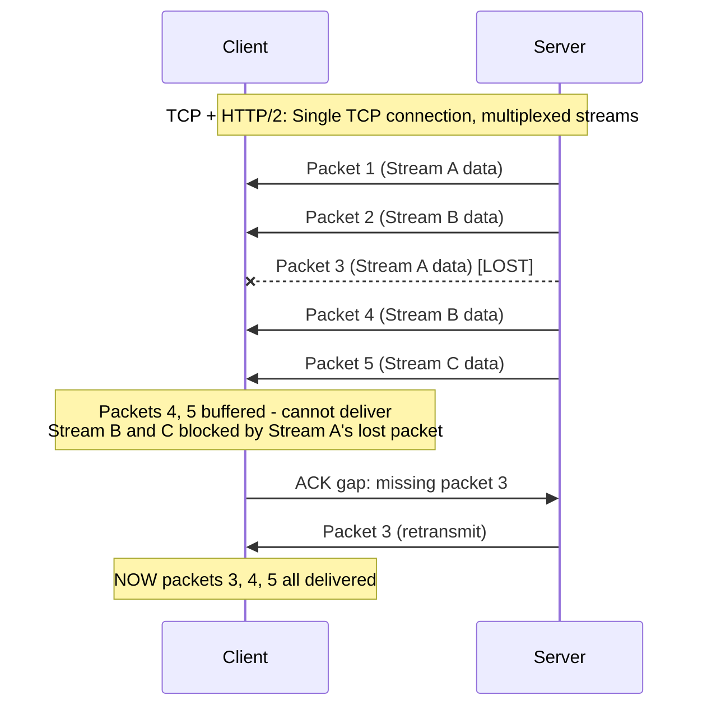
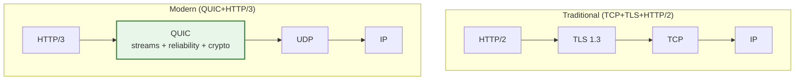
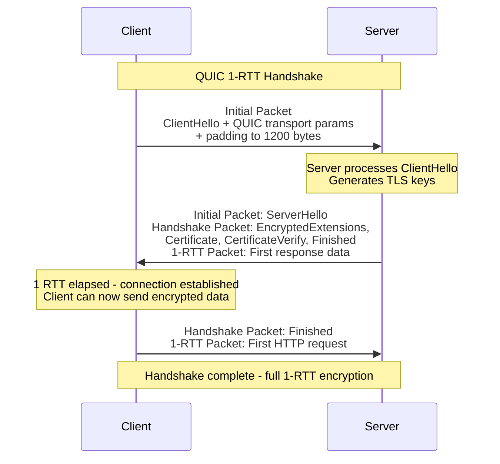
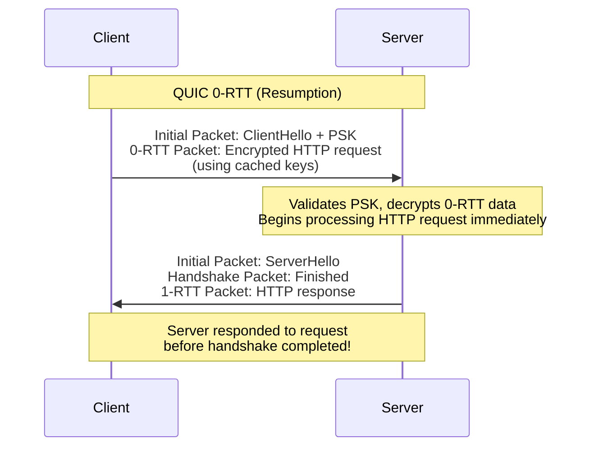
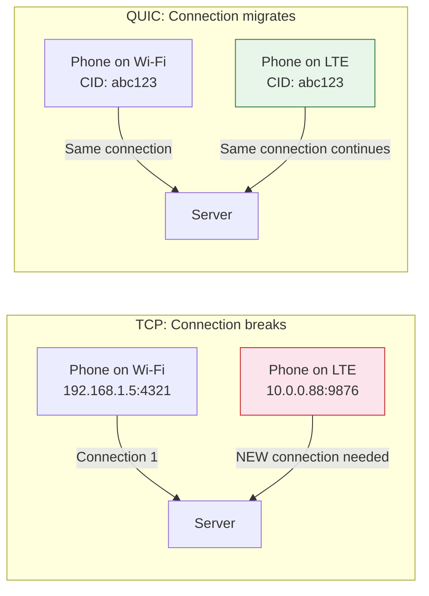

# QUIC Protocol Deep Dive

QUIC (originally "Quick UDP Internet Connections") is a transport protocol built on UDP that combines the reliability of TCP, the security of TLS 1.3, and multiplexed streams without head-of-line blocking — all in a single protocol. It is the transport layer for HTTP/3 and is already carrying over 30% of global web traffic (primarily through Google and Cloudflare).

QUIC exists because TCP has fundamental design limitations that cannot be fixed without replacing it. After decades of attempting to incrementally improve TCP (TCP Fast Open, Multipath TCP, TLS 1.3 over TCP), the industry concluded that starting fresh on top of UDP was the pragmatic path forward.

## Why QUIC Exists

### Head-of-Line Blocking in TCP

TCP provides a single, ordered byte stream. If packet 3 of 10 is lost, packets 4-10 must wait for packet 3 to be retransmitted, even if they contain data for completely independent HTTP requests.



HTTP/2 multiplexes streams over a single TCP connection to avoid the overhead of multiple connections. But because TCP sees only one byte stream, a single lost packet blocks all streams — defeating the purpose of multiplexing.

### The Handshake Tax

A new HTTPS connection over TCP requires:

| Step | Round Trips | Cumulative |
|------|-------------|------------|
| TCP handshake (SYN, SYN-ACK, ACK) | 1 RTT | 1 RTT |
| TLS 1.3 handshake | 1 RTT | 2 RTTs |
| First HTTP request | 0.5 RTT | 2.5 RTTs |

On a 100ms RTT connection (common for mobile), that is **250ms** before the first byte of application data. For a user on a mobile network with 200ms RTT, it is half a second of staring at a blank screen.

### TCP Ossification

TCP runs in the kernel. Changing TCP behavior requires OS kernel updates rolled out across billions of devices — a process that takes years or never completes. Many middleboxes (firewalls, NATs, load balancers) inspect TCP headers and drop packets with unfamiliar options, making it effectively impossible to deploy new TCP extensions.

QUIC runs in user space over UDP, which middleboxes pass through without inspection. This allows rapid iteration on the protocol.

## QUIC Architecture

### Protocol Stack Comparison



QUIC absorbs the responsibilities of TCP and TLS into a single layer:

| Responsibility | TCP Stack | QUIC |
|---------------|-----------|------|
| Reliable delivery | TCP | QUIC |
| Ordered delivery | TCP (single stream) | QUIC (per-stream) |
| Congestion control | TCP | QUIC |
| Encryption | TLS 1.3 (separate layer) | Built into QUIC |
| Stream multiplexing | HTTP/2 (application layer) | QUIC (transport layer) |
| Connection identity | 4-tuple (IP:port pairs) | Connection ID |

### Stream Multiplexing Without HOL Blocking

QUIC implements independent streams at the transport layer. Each stream has its own flow control and ordering guarantees. A lost packet on Stream A does not block delivery on Streams B or C:

```
QUIC Connection (single UDP socket):
  Stream 1 (HTTP request A): [frame1] [frame2] ...
  Stream 2 (HTTP request B): [frame1] [frame2] ...
  Stream 3 (HTTP request C): [frame1] [frame2] ...

Packet loss on Stream 1:
  Stream 1: blocked, waiting for retransmit
  Stream 2: unaffected, continues delivery
  Stream 3: unaffected, continues delivery
```

Streams can be:
- **Bidirectional** — Both client and server send data (HTTP request/response)
- **Unidirectional** — One direction only (server push, QPACK encoder/decoder)

Stream IDs encode the initiator and type:
- Client-initiated bidirectional: 0, 4, 8, 12, ...
- Server-initiated bidirectional: 1, 5, 9, 13, ...
- Client-initiated unidirectional: 2, 6, 10, 14, ...
- Server-initiated unidirectional: 3, 7, 11, 15, ...

## Handshakes: 0-RTT and 1-RTT

### 1-RTT Handshake (Initial Connection)

QUIC combines the transport handshake and TLS handshake into a single round trip:



This saves one full RTT compared to TCP+TLS 1.3:
- **TCP+TLS 1.3:** 1 RTT (TCP handshake) + 1 RTT (TLS handshake) = **2 RTTs**
- **QUIC:** 1 RTT (combined) = **1 RTT**

### 0-RTT Handshake (Resumed Connection)

When a client has connected to a server before, it caches the server's transport parameters and a pre-shared key (PSK) from the TLS session. On reconnection, the client sends encrypted application data in the very first packet:



The server processes the HTTP request from the first flight. From the user's perspective, the connection appears instant.

::: danger 0-RTT Replay Attacks
0-RTT data is not protected against replay attacks. An attacker who captures the client's first packet can replay it, causing the server to process the same request twice. Only use 0-RTT for idempotent operations (GET requests). Never for state-changing operations (POST, PUT, DELETE).

Servers should implement replay protection:
- Single-use session tickets
- Strike registers (remember recently seen 0-RTT tokens)
- Limit 0-RTT to safe HTTP methods
:::

### Handshake Comparison Summary

| Scenario | TCP+TLS 1.3 | QUIC |
|----------|------------|------|
| New connection | 2 RTTs | 1 RTT |
| Resumed connection | 1 RTT (TLS session resumption) | 0 RTT |
| With TCP Fast Open + TLS 1.3 early data | 1 RTT | 0 RTT |
| Real-world savings (100ms RTT) | 200ms → first byte | 100ms → first byte (50% faster) |
| Real-world savings (200ms RTT, mobile) | 400ms → first byte | 200ms → first byte |

## Connection Migration

TCP connections are identified by a 4-tuple: (source IP, source port, destination IP, destination port). When any of these change — such as when a phone switches from Wi-Fi to cellular — the connection breaks and must be re-established.

QUIC connections are identified by a **Connection ID** embedded in the QUIC header. The Connection ID is independent of the network path:



### Path Validation

When QUIC detects a path change, it performs path validation to prevent spoofing:

1. Client sends a `PATH_CHALLENGE` frame containing a random token on the new path
2. Server responds with a `PATH_RESPONSE` frame echoing the token
3. Only after validation does the server migrate the connection to the new path

This prevents an attacker from redirecting a connection to a victim's IP address.

### Connection ID Rotation

For privacy, QUIC rotates Connection IDs when the network path changes. Without rotation, a network observer could track a user across different networks by their Connection ID.

The server provides the client with a pool of unused Connection IDs. When the client migrates to a new path, it uses a fresh Connection ID from the pool, unlinkable to the previous one.

## QUIC Packet Structure

Every QUIC packet is encrypted and authenticated (except the Initial packets, which use keys derived from the connection ID). The packet structure:

```
QUIC Short Header (after handshake):
┌─────────────────────────────────────────┐
│ Header Form (1 bit): 0 (short)          │
│ Fixed Bit (1 bit): 1                    │
│ Spin Bit (1 bit): latency measurement   │
│ Reserved (2 bits)                       │
│ Key Phase (1 bit): key rotation         │
│ Packet Number Length (2 bits)           │
│ Destination Connection ID (0-20 bytes)  │
│ Packet Number (1-4 bytes)               │
├─────────────────────────────────────────┤
│ Encrypted Payload (AEAD protected)      │
│   ├── STREAM frames                     │
│   ├── ACK frames                        │
│   ├── FLOW_CONTROL frames               │
│   └── ...                               │
└─────────────────────────────────────────┘
```

::: tip The Spin Bit
The spin bit is a single bit that alternates on each RTT, allowing network operators to passively measure latency without decrypting traffic. It is optional and can be disabled for privacy, but most implementations enable it as a compromise between network observability and encryption.
:::

## Congestion Control

QUIC implements congestion control in user space, allowing different algorithms without kernel changes. The default in most implementations:

| Implementation | Default Algorithm | Notes |
|---------------|-------------------|-------|
| Google (Chromium) | BBRv3 | Bandwidth-based, not loss-based |
| Cloudflare (quiche) | CUBIC/BBRv2 | Configurable per connection |
| Meta (mvfst) | BBRv2, Copa | Research-grade algorithms |
| Apple | CUBIC | Familiar, conservative |

QUIC also improves ACK handling over TCP:
- **Explicit packet numbering** — QUIC packet numbers are never reused (unlike TCP sequence numbers), eliminating retransmission ambiguity
- **ACK delay reporting** — The receiver reports how long it held an ACK before sending, improving RTT estimation
- **Per-stream flow control** — Individual streams cannot starve each other

## HTTP/3 Over QUIC

HTTP/3 is HTTP/2 adapted to run over QUIC instead of TCP. The core changes:

| Feature | HTTP/2 (over TCP) | HTTP/3 (over QUIC) |
|---------|-------------------|---------------------|
| Transport | TCP | QUIC (UDP) |
| TLS | TLS 1.2+ (separate) | TLS 1.3 (built-in) |
| Multiplexing | Application-layer streams | Transport-layer streams |
| HOL blocking | Yes (TCP layer) | No (independent streams) |
| Header compression | HPACK (depends on ordered delivery) | QPACK (works with unordered delivery) |
| Server push | Supported | Supported (rarely used) |
| Connection coalescing | Same TLS cert + IP | Same TLS cert (IP can change) |

### QPACK vs HPACK

HTTP/2's HPACK header compression uses a dynamic table that requires in-order delivery — the encoder and decoder must process headers in the same order. Over QUIC's independent streams, this ordering guarantee is lost.

QPACK solves this with a separate unidirectional stream for dynamic table updates. The encoder sends table updates on this dedicated stream, and the decoder references them by index. If a header references a table entry that has not arrived yet, the decoder can either block or use the literal value.

### Enabling HTTP/3

```nginx
# Nginx (1.25.0+)
server {
    listen 443 ssl;
    listen 443 quic reuseport;

    ssl_certificate /etc/ssl/cert.pem;
    ssl_certificate_key /etc/ssl/key.pem;

    # Advertise HTTP/3 support via Alt-Svc header
    add_header Alt-Svc 'h3=":443"; ma=86400';

    # Enable 0-RTT (use with caution)
    ssl_early_data on;
}
```

```yaml
# Caddy (built-in HTTP/3 support, enabled by default)
example.com {
    # HTTP/3 is automatic with HTTPS
    reverse_proxy localhost:8080
}
```

### Alt-Svc Discovery

Clients discover HTTP/3 support through the `Alt-Svc` HTTP header. The first request goes over HTTP/2 (TCP), and the response includes:

```
Alt-Svc: h3=":443"; ma=86400
```

The client then races a QUIC connection against the existing TCP connection. If QUIC wins, subsequent requests use HTTP/3. The client caches this preference.

::: tip Why Not QUIC First?
Browsers do not try QUIC first because many networks block UDP or throttle non-TCP traffic. The Alt-Svc mechanism ensures graceful fallback: if QUIC fails, HTTP/2 over TCP continues to work seamlessly.
:::

## QUIC in Production

### When to Use QUIC / HTTP/3

| Scenario | QUIC Benefit | Priority |
|----------|-------------|----------|
| High-latency networks (mobile, satellite) | Fewer RTTs, 0-RTT | High |
| Lossy networks (Wi-Fi, cellular) | No HOL blocking | High |
| Users switching networks (commuting) | Connection migration | Medium |
| Global CDN | Reduced handshake latency at edge | High |
| Internal datacenter service-to-service | Minimal benefit (low latency, reliable network) | Low |
| Real-time media (WebRTC replacement) | Stream multiplexing, congestion control | Medium |

### Performance Measurements

Real-world measurements from Cloudflare and Google:

| Metric | HTTP/2 (TCP) | HTTP/3 (QUIC) | Improvement |
|--------|-------------|---------------|-------------|
| Time to First Byte (mobile) | 620ms | 430ms | 30% faster |
| Page load (2% loss network) | 4.2s | 2.8s | 33% faster |
| Connection establishment | 200-300ms | 100-200ms | ~50% |
| Video rebuffer rate | 2.1% | 1.4% | 33% fewer |

### Debugging QUIC

```bash
# Check if a site supports HTTP/3
curl -I --http3 https://example.com

# Verbose QUIC connection info
curl -v --http3 https://cloudflare.com 2>&1 | grep -i quic

# Chrome: view QUIC connections
# Navigate to chrome://net-internals/#quic

# Wireshark: QUIC dissector
# Filter: quic
# Note: payload is encrypted, only headers visible

# qlog: standardized QUIC logging format
# Most QUIC implementations support QLOG output
# Visualize at https://qvis.quictools.info
```

## Limitations and Challenges

| Challenge | Details |
|-----------|---------|
| UDP blocking | Some corporate firewalls and networks block UDP. Fallback to TCP is required. |
| CPU overhead | QUIC runs in user space — more CPU than kernel TCP. Offset by fewer RTTs. |
| Middlebox interference | Some middleboxes rate-limit UDP or treat it as low priority. |
| Debugging complexity | Encrypted transport means traditional packet inspection tools do not work. |
| Load balancer support | QUIC Connection IDs require QUIC-aware load balancers for sticky routing. |
| Kernel bypass | For high-throughput servers, user-space QUIC needs kernel bypass (io_uring, DPDK) for performance. |

## Further Reading

- [TCP/IP Deep Dive](/system-design/networking/tcp-ip-deep-dive) — Understand what QUIC replaces
- [TLS Handshake](/system-design/networking/tls-handshake) — TLS 1.3, which QUIC embeds
- [HTTP/2 and HTTP/3](/system-design/networking/http2-http3) — The application protocols over QUIC
- [gRPC Internals](/system-design/networking/grpc-internals) — gRPC over QUIC is emerging
- [DNS Deep Dive](/system-design/networking/dns-deep-dive) — DNS over QUIC (DoQ) is standardized
- RFC 9000 — QUIC: A UDP-Based Multiplexed and Secure Transport
- RFC 9001 — Using TLS to Secure QUIC
- RFC 9114 — HTTP/3
- Cloudflare Blog: "The Road to QUIC" series
