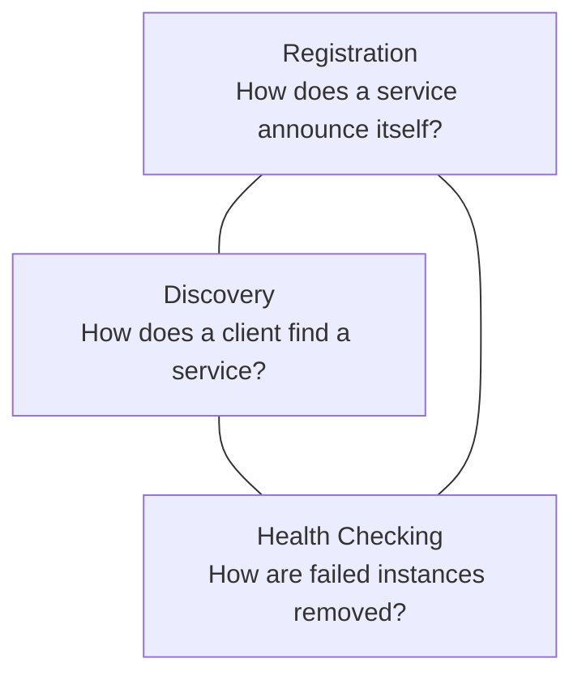
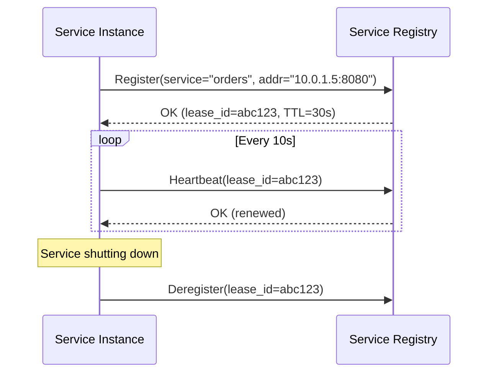
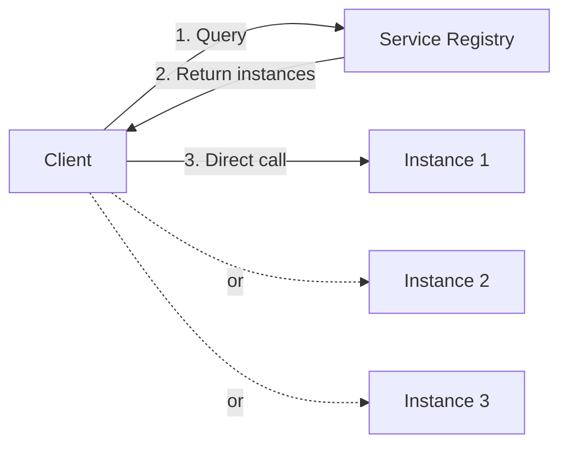
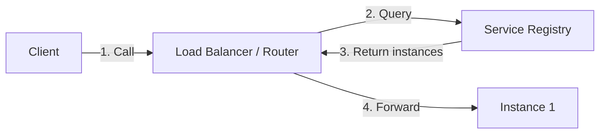
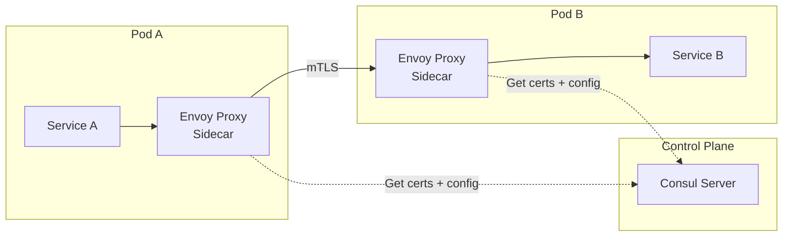
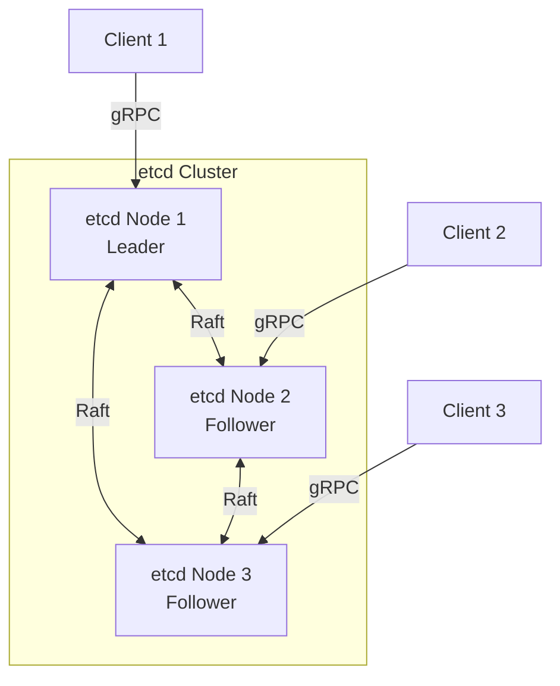
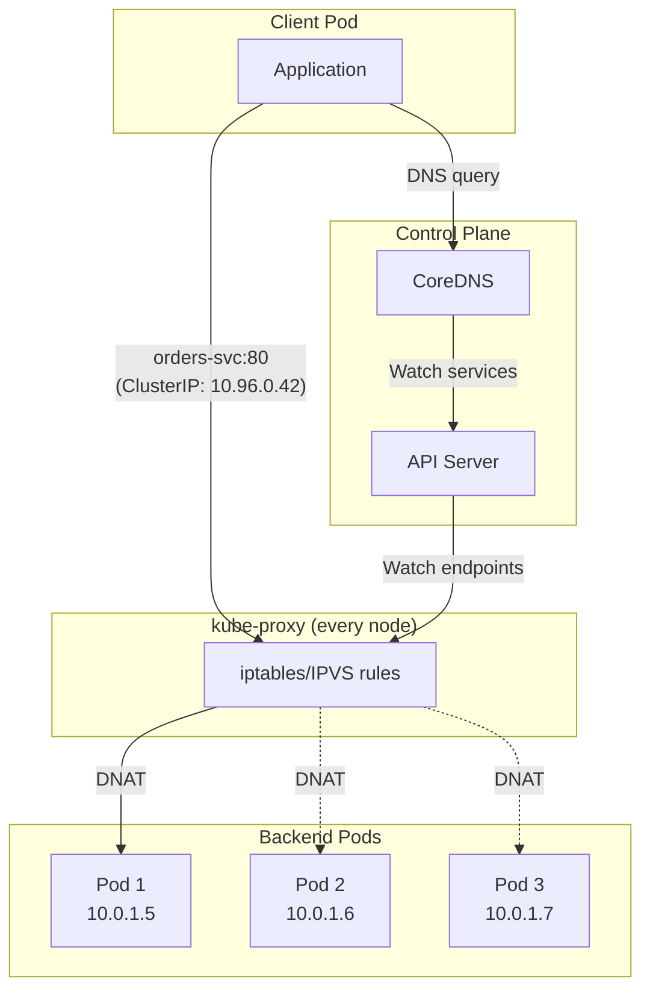
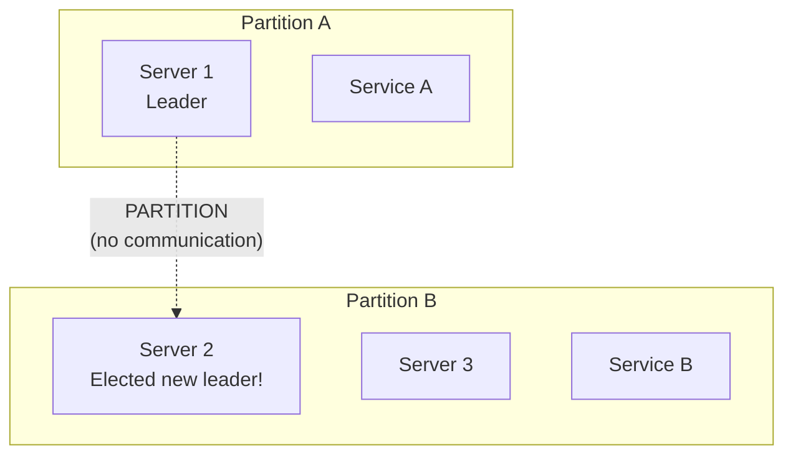
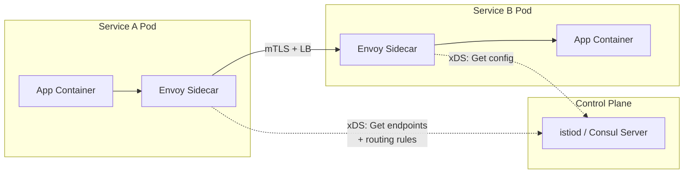
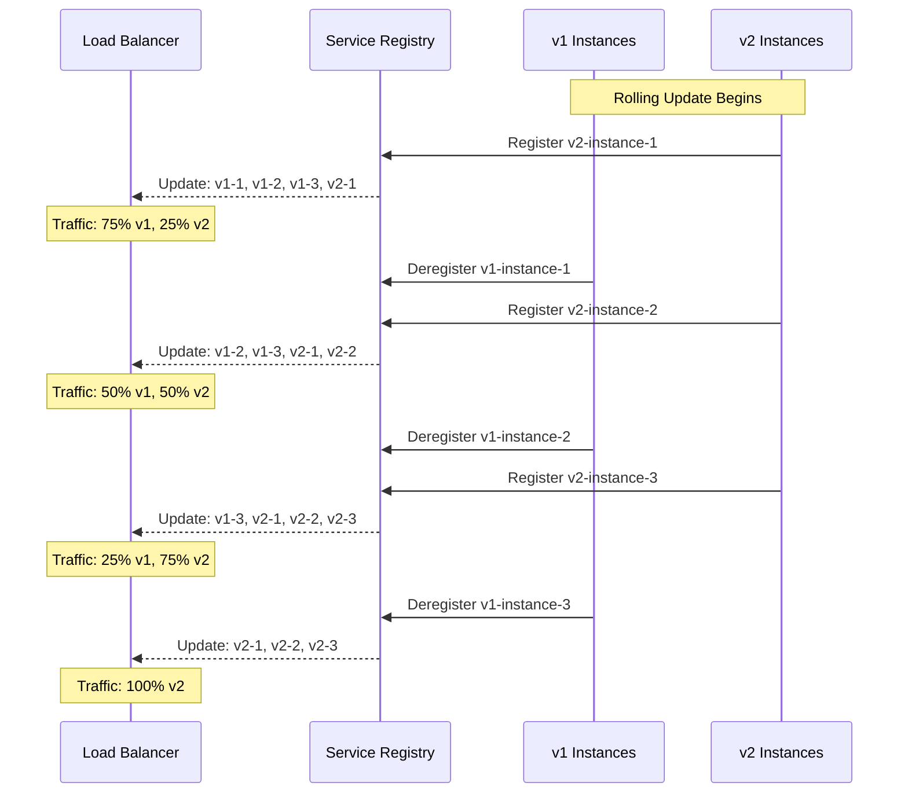

# Service Discovery

## Why Service Discovery Exists

In monolithic architectures, services communicate via well-known addresses — a database lives at `db.internal:5432`, the cache at `redis.internal:6379`. These addresses are configured once and rarely change. Microservices shatter this simplicity. When a single application decomposes into dozens or hundreds of services, each with multiple instances that scale dynamically, the question "where is service X right now?" becomes a fundamental infrastructure problem.

Service discovery solves:
1. **Dynamic location** — instances come and go as they scale, deploy, or fail
2. **Load distribution** — distributing requests across healthy instances
3. **Health awareness** — automatically removing failed instances
4. **Multi-environment** — services exist in dev, staging, production with different locations

Without service discovery, you are left with static configuration files that must be updated every time an instance changes — a process that breaks down at scale and velocity.

### Historical Context

The problem isn't new. DNS was the original service discovery mechanism (and still is, in many environments). But DNS was designed for the relatively stable Internet namespace, not for microservices where instances churn every few seconds. The limitations — TTL-based caching delays, lack of health checking, no metadata — drove the creation of purpose-built service discovery systems.

## First Principles

### The Service Discovery Triangle

Every service discovery system must address three concerns:



### Registration Patterns

**Self-registration**: The service instance registers itself with the registry on startup and deregisters on shutdown.



**Third-party registration**: An external registrar (e.g., the orchestrator) manages registration. Kubernetes uses this pattern — the kubelet and kube-proxy handle service registration, not the application.

| Pattern | Pros | Cons |
|---------|------|------|
| Self-registration | Simple, no external dependency | App coupling to registry, language-specific |
| Third-party registration | App unaware of registry, consistent | Requires orchestrator, additional component |

### Discovery Patterns

**Client-side discovery**: The client queries the registry and selects an instance.



**Server-side discovery**: The client calls a load balancer/router, which queries the registry.



| Pattern | Pros | Cons |
|---------|------|------|
| Client-side | No SPOF at LB, fewer hops, flexible LB algorithms | Client complexity, language-specific, tight coupling |
| Server-side | Simple clients, centralized control, language-agnostic | Extra hop, LB is potential bottleneck/SPOF |

## Consul: Full-Featured Service Discovery

### Architecture

Consul uses a gossip-based architecture with a Raft consensus protocol for leadership:

```mermaid
graph TB
    subgraph "Datacenter 1"
        S1[Server 1<br/>Leader]
        S2[Server 2<br/>Follower]
        S3[Server 3<br/>Follower]

        S1 <-->|Raft Consensus| S2
        S1 <-->|Raft Consensus| S3
        S2 <-->|Raft Consensus| S3

        A1[Agent<br/>Client Mode]
        A2[Agent<br/>Client Mode]
        A3[Agent<br/>Client Mode]

        A1 <-->|Gossip (Serf)| A2
        A2 <-->|Gossip (Serf)| A3
        A1 -->|RPC| S1
        A2 -->|RPC| S2
        A3 -->|RPC| S3
    end

    subgraph "Datacenter 2"
        S4[Server 4<br/>Leader]
        S5[Server 5]
    end

    S1 <-->|WAN Gossip| S4
```

### Service Registration

```typescript
interface ConsulServiceRegistration {
  Name: string;
  ID: string;
  Address: string;
  Port: number;
  Tags: string[];
  Meta: Record<string, string>;
  Check: ConsulHealthCheck;
  Weights: { Passing: number; Warning: number };
}

interface ConsulHealthCheck {
  HTTP?: string;
  TCP?: string;
  GRPC?: string;
  Interval: string;
  Timeout: string;
  DeregisterCriticalServiceAfter: string;
}

class ConsulClient {
  private baseUrl: string;

  constructor(address: string = 'http://127.0.0.1:8500') {
    this.baseUrl = address;
  }

  async registerService(service: ConsulServiceRegistration): Promise<void> {
    const response = await fetch(
      `${this.baseUrl}/v1/agent/service/register`,
      {
        method: 'PUT',
        headers: { 'Content-Type': 'application/json' },
        body: JSON.stringify(service),
      }
    );

    if (!response.ok) {
      throw new Error(
        `Failed to register service: ${response.status} ${await response.text()}`
      );
    }
  }

  async deregisterService(serviceId: string): Promise<void> {
    const response = await fetch(
      `${this.baseUrl}/v1/agent/service/deregister/${serviceId}`,
      { method: 'PUT' }
    );

    if (!response.ok) {
      throw new Error(`Failed to deregister service: ${response.status}`);
    }
  }

  async discoverService(
    serviceName: string,
    options: { passing?: boolean; tag?: string; dc?: string } = {}
  ): Promise<ConsulServiceInstance[]> {
    const params = new URLSearchParams();
    if (options.passing) params.set('passing', 'true');
    if (options.tag) params.set('tag', options.tag);
    if (options.dc) params.set('dc', options.dc);

    const response = await fetch(
      `${this.baseUrl}/v1/health/service/${serviceName}?${params.toString()}`
    );

    if (!response.ok) {
      throw new Error(`Failed to discover service: ${response.status}`);
    }

    const entries = (await response.json()) as ConsulHealthServiceEntry[];

    return entries.map((entry) => ({
      id: entry.Service.ID,
      address: entry.Service.Address || entry.Node.Address,
      port: entry.Service.Port,
      tags: entry.Service.Tags,
      meta: entry.Service.Meta,
      healthy: entry.Checks.every(
        (c) => c.Status === 'passing' || c.Status === 'warning'
      ),
      weight: entry.Service.Weights?.Passing ?? 1,
    }));
  }

  // Long-polling watch for changes (blocking query)
  async watchService(
    serviceName: string,
    callback: (instances: ConsulServiceInstance[]) => void,
    signal?: AbortSignal
  ): Promise<void> {
    let index = '0';

    while (!signal?.aborted) {
      try {
        const response = await fetch(
          `${this.baseUrl}/v1/health/service/${serviceName}?passing=true&index=${index}&wait=55s`,
          { signal }
        );

        const newIndex = response.headers.get('X-Consul-Index') ?? '0';

        if (newIndex !== index) {
          index = newIndex;
          const entries = (await response.json()) as ConsulHealthServiceEntry[];
          const instances = entries.map((entry) => ({
            id: entry.Service.ID,
            address: entry.Service.Address || entry.Node.Address,
            port: entry.Service.Port,
            tags: entry.Service.Tags,
            meta: entry.Service.Meta,
            healthy: true,
            weight: entry.Service.Weights?.Passing ?? 1,
          }));
          callback(instances);
        }
      } catch (error) {
        if (signal?.aborted) return;
        console.error('Watch error, retrying in 5s:', error);
        await new Promise((r) => setTimeout(r, 5_000));
      }
    }
  }
}

interface ConsulServiceInstance {
  id: string;
  address: string;
  port: number;
  tags: string[];
  meta: Record<string, string>;
  healthy: boolean;
  weight: number;
}

interface ConsulHealthServiceEntry {
  Node: { Address: string };
  Service: {
    ID: string;
    Address: string;
    Port: number;
    Tags: string[];
    Meta: Record<string, string>;
    Weights: { Passing: number; Warning: number };
  };
  Checks: Array<{ Status: string }>;
}
```

### Consul Connect (Service Mesh)

Consul Connect provides automatic mTLS between services using sidecar proxies (Envoy):



### Consul DNS Interface

Consul exposes a DNS interface on port 8600, allowing legacy applications to use service discovery without code changes:

```
# Standard service lookup
dig @127.0.0.1 -p 8600 orders.service.consul

# Tag-based filtering
dig @127.0.0.1 -p 8600 primary.orders.service.consul

# SRV records (includes port)
dig @127.0.0.1 -p 8600 orders.service.consul SRV

# Cross-datacenter
dig @127.0.0.1 -p 8600 orders.service.dc2.consul
```

## etcd: Distributed Key-Value for Service Discovery

### Architecture

etcd uses the Raft consensus algorithm with a linearizable key-value store:



### Service Discovery with etcd

etcd doesn't have built-in service discovery — you build it on top of its primitives: key-value storage, leases, and watches.

```typescript
import { Etcd3, Lease, Watcher } from 'etcd3';

interface ServiceInstance {
  id: string;
  service: string;
  address: string;
  port: number;
  metadata: Record<string, string>;
  registeredAt: string;
}

class EtcdServiceRegistry {
  private client: Etcd3;
  private lease: Lease | null = null;
  private readonly prefix = '/services/';

  constructor(endpoints: string[] = ['http://127.0.0.1:2379']) {
    this.client = new Etcd3({ hosts: endpoints });
  }

  async register(instance: ServiceInstance, ttlSeconds: number = 15): Promise<void> {
    // Create a lease that must be refreshed
    this.lease = this.client.lease(ttlSeconds);

    this.lease.on('lost', (error) => {
      console.error('Lease lost:', error);
      // Re-register on lease loss
      this.register(instance, ttlSeconds).catch(console.error);
    });

    const key = `${this.prefix}${instance.service}/${instance.id}`;
    const value = JSON.stringify(instance);

    await this.lease.put(key).value(value);

    console.log(`Registered ${instance.service}/${instance.id} with TTL ${ttlSeconds}s`);
  }

  async deregister(service: string, instanceId: string): Promise<void> {
    const key = `${this.prefix}${service}/${instanceId}`;
    await this.client.delete().key(key);

    if (this.lease) {
      await this.lease.revoke();
      this.lease = null;
    }
  }

  async discover(service: string): Promise<ServiceInstance[]> {
    const prefix = `${this.prefix}${service}/`;
    const response = await this.client.getAll().prefix(prefix);

    const instances: ServiceInstance[] = [];
    for (const [_key, value] of Object.entries(response)) {
      try {
        instances.push(JSON.parse(value) as ServiceInstance);
      } catch {
        // Skip malformed entries
      }
    }

    return instances;
  }

  async watch(
    service: string,
    onUpdate: (instances: ServiceInstance[]) => void
  ): Promise<Watcher> {
    const prefix = `${this.prefix}${service}/`;

    const watcher = await this.client.watch().prefix(prefix).create();

    watcher.on('put', async () => {
      const instances = await this.discover(service);
      onUpdate(instances);
    });

    watcher.on('delete', async () => {
      const instances = await this.discover(service);
      onUpdate(instances);
    });

    watcher.on('error', (error) => {
      console.error('Watch error:', error);
    });

    return watcher;
  }

  async close(): Promise<void> {
    if (this.lease) {
      await this.lease.revoke();
    }
    this.client.close();
  }
}

// Usage with client-side load balancing
class ServiceClient {
  private registry: EtcdServiceRegistry;
  private instances: Map<string, ServiceInstance[]> = new Map();

  constructor(registry: EtcdServiceRegistry) {
    this.registry = registry;
  }

  async startWatching(service: string): Promise<void> {
    // Initial fetch
    const instances = await this.registry.discover(service);
    this.instances.set(service, instances);

    // Watch for changes
    await this.registry.watch(service, (updated) => {
      this.instances.set(service, updated);
      console.log(
        `Service ${service} updated: ${updated.length} instances`
      );
    });
  }

  getEndpoint(service: string): string {
    const instances = this.instances.get(service) ?? [];
    if (instances.length === 0) {
      throw new Error(`No instances available for service: ${service}`);
    }

    // Round-robin selection
    const idx = Math.floor(Math.random() * instances.length);
    const instance = instances[idx];
    return `http://${instance.address}:${instance.port}`;
  }
}
```

### etcd vs Consul Comparison

| Feature | etcd | Consul |
|---------|------|--------|
| Primary use | General KV store (Kubernetes backing store) | Service discovery + mesh |
| Consensus | Raft | Raft |
| Health checking | Build your own (leases + TTL) | Built-in (HTTP, TCP, gRPC, script) |
| DNS interface | No | Yes (port 8600) |
| Service mesh | No | Yes (Consul Connect) |
| Multi-datacenter | No (single cluster) | Yes (WAN federation) |
| ACLs | Yes (RBAC) | Yes (token-based) |
| Watch mechanism | gRPC streams (efficient) | Long-polling (HTTP blocking queries) |
| Typical scale | Hundreds of nodes | Thousands of nodes |

## Kubernetes Service Discovery

### How Kubernetes Services Work

Kubernetes provides built-in service discovery through the Service resource. When you create a Service, Kubernetes:

1. Allocates a virtual IP (ClusterIP) from the service CIDR
2. Creates DNS records in CoreDNS
3. Programs iptables/IPVS rules on every node via kube-proxy



### Service Types

```yaml
# ClusterIP (default) — internal only
apiVersion: v1
kind: Service
metadata:
  name: orders-svc
  namespace: production
spec:
  type: ClusterIP
  selector:
    app: orders
  ports:
    - port: 80         # Service port
      targetPort: 8080  # Pod port
      protocol: TCP
---
# NodePort — exposes on every node's IP at a static port
apiVersion: v1
kind: Service
metadata:
  name: orders-nodeport
spec:
  type: NodePort
  selector:
    app: orders
  ports:
    - port: 80
      targetPort: 8080
      nodePort: 30080  # 30000-32767 range
---
# LoadBalancer — provisions external LB (cloud provider)
apiVersion: v1
kind: Service
metadata:
  name: orders-lb
spec:
  type: LoadBalancer
  selector:
    app: orders
  ports:
    - port: 80
      targetPort: 8080
---
# Headless Service — no ClusterIP, returns pod IPs directly
apiVersion: v1
kind: Service
metadata:
  name: orders-headless
spec:
  clusterIP: None
  selector:
    app: orders
  ports:
    - port: 80
      targetPort: 8080
```

### DNS Records Created by Kubernetes

For a Service named `orders-svc` in namespace `production`:

| Record | Name | Value |
|--------|------|-------|
| A | `orders-svc.production.svc.cluster.local` | ClusterIP (e.g., `10.96.0.42`) |
| SRV | `_http._tcp.orders-svc.production.svc.cluster.local` | `0 100 80 orders-svc.production.svc.cluster.local` |

For a **headless** service, DNS returns individual pod IPs:

| Record | Name | Value |
|--------|------|-------|
| A | `orders-headless.production.svc.cluster.local` | `10.0.1.5`, `10.0.1.6`, `10.0.1.7` |
| A | `pod-name.orders-headless.production.svc.cluster.local` | Individual pod IP |

### kube-proxy Modes

| Mode | Mechanism | Performance | Features |
|------|-----------|-------------|----------|
| **iptables** (default) | Kernel iptables rules | O(n) rule matching | Random LB, no connection draining |
| **IPVS** | Kernel IPVS module | O(1) hash lookup | Round-robin, least-conn, source hash |
| **nftables** (new) | nftables rules | Better than iptables | Modern kernel replacement |

At scale, iptables mode degrades:

$$
T_{\text{rule\_update}} \approx O(n^2) \text{ where } n = \text{total service endpoints}
$$

With 10,000 services and 100,000 endpoints, iptables rule updates can take 5+ seconds and consume significant CPU. IPVS mode scales to 100,000+ services with constant-time lookups.

### EndpointSlices

Kubernetes 1.21+ uses EndpointSlices instead of the monolithic Endpoints resource:

```yaml
apiVersion: discovery.k8s.io/v1
kind: EndpointSlice
metadata:
  name: orders-svc-abc12
  labels:
    kubernetes.io/service-name: orders-svc
addressType: IPv4
ports:
  - name: http
    protocol: TCP
    port: 8080
endpoints:
  - addresses: ["10.0.1.5"]
    conditions:
      ready: true
      serving: true
      terminating: false
    nodeName: node-1
    zone: us-east-1a
  - addresses: ["10.0.1.6"]
    conditions:
      ready: true
    nodeName: node-2
    zone: us-east-1b
```

Each EndpointSlice holds up to 100 endpoints (configurable). This prevents the "thundering herd" problem where a single Endpoints object with thousands of IPs causes massive watch notifications to every kube-proxy.

## Edge Cases and Failure Modes

### Split-Brain Scenarios

When network partitions occur, service registries can experience split-brain:



**Consul's approach**: Raft requires a majority quorum. In a 3-server cluster, the partition with 2 servers continues operating; the single server becomes read-only (stale reads) or rejects requests.

**etcd's approach**: Same — Raft quorum. The minority partition cannot write.

::: danger
If you run an even number of Consul/etcd servers (e.g., 2 or 4), network partitions can leave both sides without a quorum, causing a full outage. Always run an odd number (3, 5, or 7).
:::

### Thundering Herd on Service Changes

When a popular service updates, all clients watching that service receive notifications simultaneously and reconnect:

$$
\text{Reconnection spike} = N_{\text{clients}} \times P_{\text{simultaneous}}
$$

Mitigations:
- **Jittered backoff**: Add random delay before reconnection
- **Connection draining**: Gradually shift traffic to new instances
- **Watch coalescing**: Registry batches notifications

```typescript
function jitteredBackoff(attempt: number, baseMs: number = 100, maxMs: number = 30_000): number {
  const exponentialMs = Math.min(maxMs, baseMs * Math.pow(2, attempt));
  const jitter = Math.random() * exponentialMs;
  return jitter;
}
```

### Stale Reads and Consistency

Service registries face the classic CAP theorem tradeoff. Consul offers tunable consistency:

| Mode | Guarantee | Latency | Use Case |
|------|-----------|---------|----------|
| `default` | Leader lease (could be stale by lease duration) | Low | Most service discovery |
| `consistent` | Linearizable (leader verifies with quorum) | Higher | Critical operations |
| `stale` | Any server answers (may be behind) | Lowest | High-read scenarios, dashboards |

::: info War Story
A company running Consul for service discovery experienced intermittent 503 errors during a network partition event. Their services used `consistent` reads for discovery, meaning when the Consul leader was unreachable from some clients, those clients received errors instead of (potentially stale) service endpoints. Switching to `stale` reads with a staleness limit of 10 seconds eliminated the errors — stale endpoints were vastly preferable to no endpoints. The lesson: for service discovery, availability usually trumps consistency.
:::

### Graceful Shutdown and Connection Draining

When a service instance shuts down, in-flight requests must complete:

```typescript
import http from 'node:http';

class GracefulServer {
  private server: http.Server;
  private connections = new Set<http.ServerResponse>();
  private isShuttingDown = false;

  constructor(handler: http.RequestListener) {
    this.server = http.createServer((req, res) => {
      if (this.isShuttingDown) {
        res.writeHead(503, { 'Connection': 'close' });
        res.end('Service shutting down');
        return;
      }

      this.connections.add(res);
      res.on('close', () => this.connections.delete(res));

      handler(req, res);
    });
  }

  listen(port: number): void {
    this.server.listen(port);
  }

  async shutdown(consul: ConsulClient, serviceId: string): Promise<void> {
    console.log('Starting graceful shutdown...');

    // 1. Deregister from service registry FIRST
    await consul.deregisterService(serviceId);
    console.log('Deregistered from Consul');

    // 2. Wait for deregistration to propagate
    // (accounts for DNS TTL, health check intervals)
    await new Promise((r) => setTimeout(r, 5_000));

    // 3. Stop accepting new connections
    this.isShuttingDown = true;
    this.server.close();

    // 4. Wait for in-flight requests (with timeout)
    const drainTimeout = 30_000;
    const deadline = Date.now() + drainTimeout;

    while (this.connections.size > 0 && Date.now() < deadline) {
      console.log(`Waiting for ${this.connections.size} connections to drain...`);
      await new Promise((r) => setTimeout(r, 1_000));
    }

    if (this.connections.size > 0) {
      console.warn(
        `Force closing ${this.connections.size} connections after timeout`
      );
    }

    console.log('Shutdown complete');
  }
}

interface ConsulClient {
  deregisterService(serviceId: string): Promise<void>;
}
```

## Performance Characteristics

### Consul Benchmarks

| Operation | Latency (p50) | Latency (p99) | Throughput |
|-----------|--------------|---------------|------------|
| Service registration | 2-5ms | 15-30ms | 2,000 ops/s |
| Service discovery (cached) | <1ms | 2-5ms | 50,000 ops/s |
| Service discovery (consistent) | 5-15ms | 30-80ms | 5,000 ops/s |
| Health check (HTTP) | 10-50ms | 100-500ms | Depends on check interval |
| KV read | 1-3ms | 10-20ms | 20,000 ops/s |
| KV write | 3-10ms | 20-50ms | 5,000 ops/s |

### etcd Benchmarks

| Operation | Latency (p50) | Latency (p99) | Throughput |
|-----------|--------------|---------------|------------|
| Put (single key) | 1-2ms | 5-10ms | 10,000 ops/s |
| Get (single key) | 0.2-0.5ms | 1-3ms | 50,000 ops/s |
| Range (100 keys) | 1-3ms | 5-10ms | 10,000 ops/s |
| Watch | Near real-time | <100ms | 10,000 watchers |
| Txn (compare-and-swap) | 2-5ms | 10-20ms | 5,000 ops/s |

### Kubernetes Service Discovery Latency

| Component | Latency | Notes |
|-----------|---------|-------|
| CoreDNS lookup (cached) | <1ms | In-cluster, UDP |
| CoreDNS lookup (miss) | 2-10ms | Fetch from API server |
| Endpoint propagation | 1-10s | API server → kube-proxy |
| iptables rule update | 0.1-5s | Depends on total rules |
| IPVS rule update | <100ms | O(1) regardless of scale |

## Mathematical Foundations

### Consistent Hashing for Client-Side LB

Many service discovery clients use consistent hashing for routing:

$$
h(key) \mod 2^{32} \rightarrow \text{position on hash ring}
$$

With $n$ nodes and $k$ virtual nodes per physical node, the expected number of keys per node:

$$
E[\text{keys per node}] = \frac{K}{n}
$$

Standard deviation (with virtual nodes):

$$
\sigma = \frac{K}{n} \cdot \frac{1}{\sqrt{k}}
$$

Increasing virtual nodes ($k$) reduces variance. At $k = 150$, the load imbalance is typically < 10%.

### Failure Detection

Consul and etcd use heartbeat-based failure detection. The probability of false positive (declaring a healthy node dead) given network jitter:

$$
P(\text{false positive}) = P(\text{all } k \text{ heartbeats lost}) = p_{\text{loss}}^k
$$

With 1% packet loss and 3 missed heartbeats required: $P = 0.01^3 = 10^{-6}$.

With 5% packet loss: $P = 0.05^3 = 1.25 \times 10^{-4}$ (one false positive per ~8,000 check intervals).

### Phi Accrual Failure Detector

More sophisticated systems (Cassandra, Akka) use the Phi Accrual Failure Detector, which outputs a continuous suspicion level rather than a binary dead/alive:

$$
\Phi(t) = -\log_{10}(1 - F(t - t_{\text{last}}))
$$

where $F$ is the CDF of the inter-arrival time distribution. When $\Phi > \Phi_{\text{threshold}}$ (typically 8-12), the node is considered dead. This adapts to network conditions automatically.

## Decision Framework

### Choosing a Service Discovery Solution

| Requirement | Consul | etcd | K8s Services | DNS (Route 53) |
|-------------|--------|------|-------------|----------------|
| Kubernetes-native | Possible (CSI) | Native (backing store) | Native | External |
| Multi-cloud | Excellent | Single cluster | Federation | Excellent |
| Health checking | Built-in | DIY | Built-in (probes) | Route 53 health checks |
| Service mesh | Consul Connect | No | Istio/Linkerd | No |
| Configuration mgmt | KV store | KV store | ConfigMaps | No |
| Operational complexity | Medium | Medium | Low (bundled) | Low |
| Latency (discovery) | 1-15ms | 0.2-5ms | <1ms (DNS) | 5-50ms (DNS TTL) |

### When to Use What

- **Kubernetes Services**: Default choice when running on K8s. Use headless services for stateful workloads.
- **Consul**: Multi-datacenter, hybrid cloud, need service mesh, or not exclusively on K8s.
- **etcd**: Already using K8s (it's the backing store), need strong consistency, custom discovery logic.
- **DNS**: Simple environments, legacy systems, cross-cloud with stable endpoints.

## Advanced Topics

### Service Mesh Integration

Modern service meshes (Istio, Linkerd, Consul Connect) integrate service discovery with traffic management:



The sidecar proxy handles service discovery, load balancing, retries, circuit breaking, and mTLS — the application just calls `localhost:port`.

### Zero-Downtime Deployments with Service Discovery



### Topology-Aware Routing

Kubernetes 1.23+ supports topology-aware routing, preferring endpoints in the same zone to reduce cross-zone traffic costs:

```yaml
apiVersion: v1
kind: Service
metadata:
  name: orders-svc
  annotations:
    service.kubernetes.io/topology-mode: Auto
spec:
  selector:
    app: orders
  ports:
    - port: 80
      targetPort: 8080
```

With topology-aware routing, kube-proxy preferentially routes traffic to endpoints in the same availability zone. Cross-zone data transfer on major clouds costs $0.01-0.02/GB, which adds up rapidly at scale.

$$
\text{Monthly savings} = \text{Cross-zone traffic (GB)} \times \$0.01 \times P_{\text{zone-local}}
$$

For a service handling 10 TB/month of internal traffic across 3 zones, enabling topology-aware routing with 80% zone-local traffic:

$$
\text{Savings} = 10{,}000 \times 0.01 \times 0.80 \approx \$80/\text{month per service}
$$

With 50 services, that is $4,000/month.
