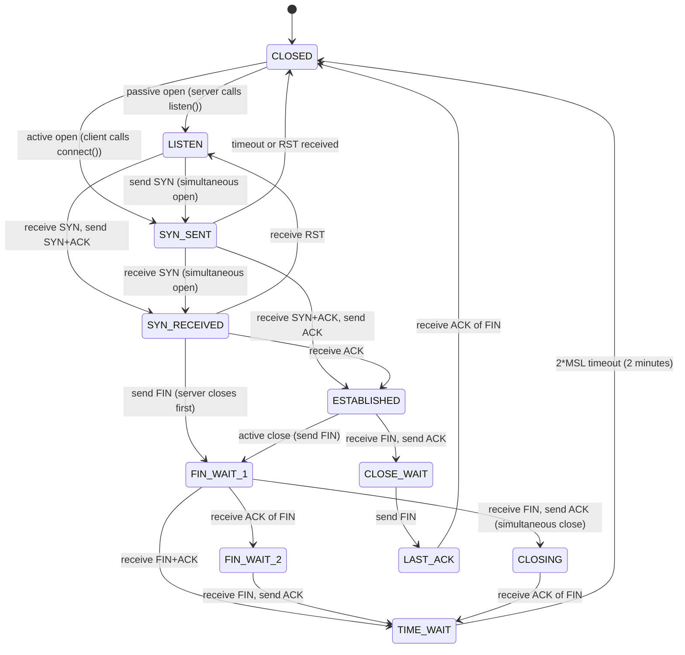
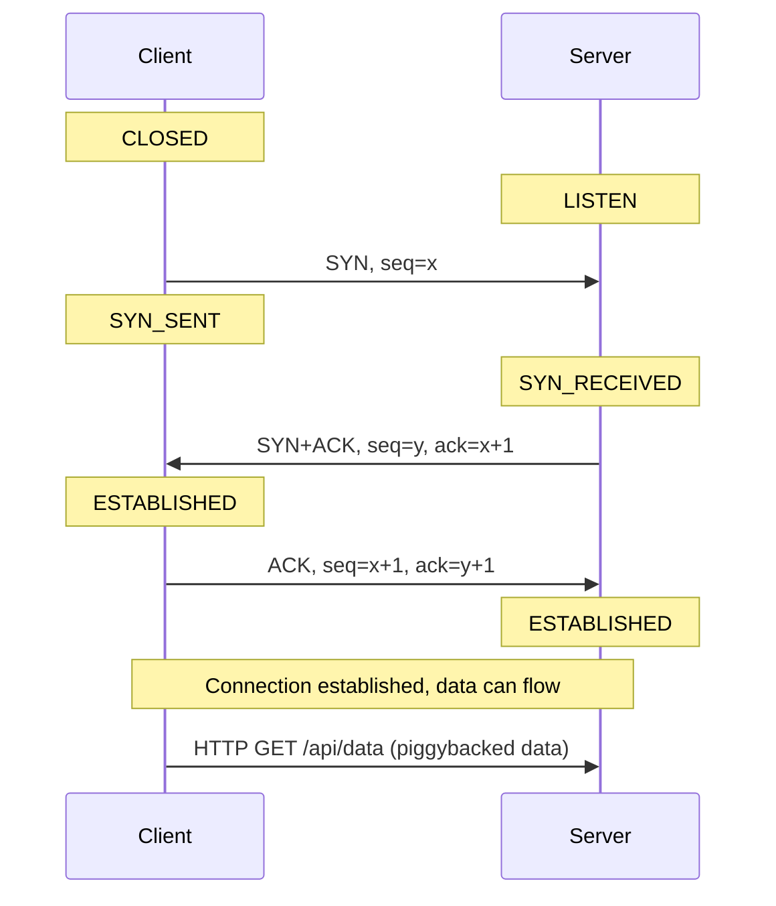
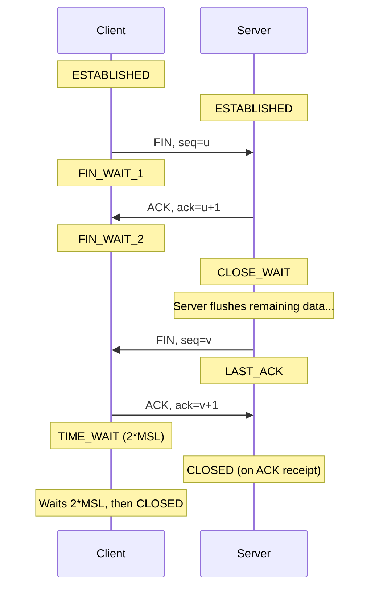
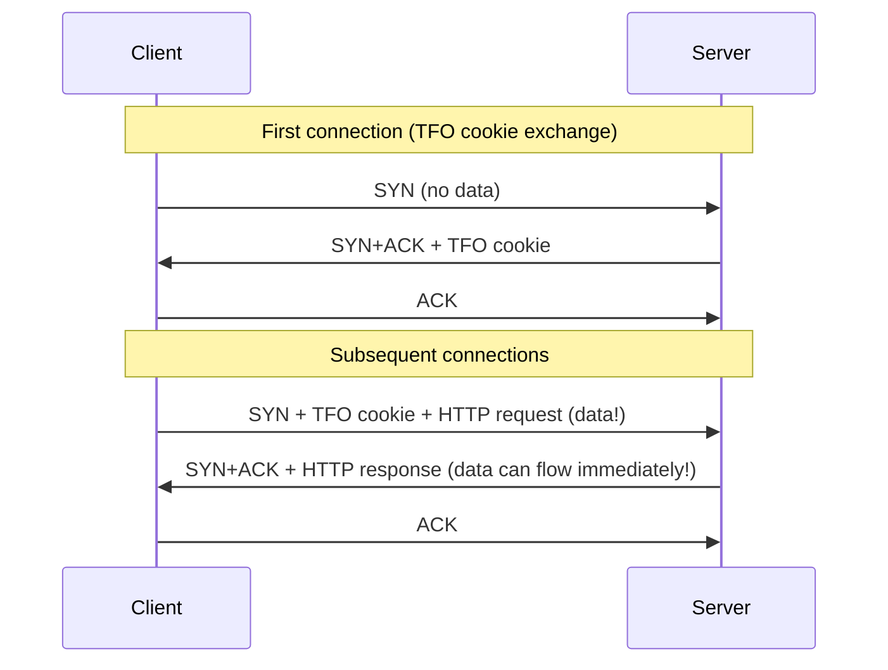

# TCP/IP Deep Dive

TCP is 50 years old and still carries the majority of internet traffic. It is one of the most studied protocols in computer science, yet most engineers have only a surface-level understanding of it. That gap costs them: TIME_WAIT exhaustion, mysterious connection drops, Nagle-induced latency, and throughput problems that are invisible without knowing how congestion control works.

This page gives you complete TCP internals: the state machine, the wire format, congestion control algorithms from Tahoe to BBR, and the practical implications for production systems.

## Why TCP Exists: The Reliability Problem

IP is unreliable. It makes best-effort delivery of packets — packets can be lost, duplicated, reordered, and corrupted. This is not a bug; it is a deliberate design choice that keeps the network core simple and fast. Reliability is pushed to the endpoints.

TCP was designed in 1974 (RFC 675) and standardized in 1981 (RFC 793) to provide:

1. **Reliable delivery**: every byte sent is eventually received, or the sender is notified of failure
2. **In-order delivery**: bytes arrive in the order they were sent, regardless of how packets were routed
3. **Flow control**: the sender does not overwhelm the receiver's buffer
4. **Congestion control**: the sender does not overwhelm the network itself

These four guarantees come at a cost: TCP maintains significant state at both endpoints, and that state requires handshakes to establish and teardown to clean up.

## The TCP Segment Header

Every TCP segment has a 20-byte minimum header (up to 60 bytes with options):

```
 0                   1                   2                   3
 0 1 2 3 4 5 6 7 8 9 0 1 2 3 4 5 6 7 8 9 0 1 2 3 4 5 6 7 8 9 0 1
+-+-+-+-+-+-+-+-+-+-+-+-+-+-+-+-+-+-+-+-+-+-+-+-+-+-+-+-+-+-+-+-+
|          Source Port          |       Destination Port        |
+-+-+-+-+-+-+-+-+-+-+-+-+-+-+-+-+-+-+-+-+-+-+-+-+-+-+-+-+-+-+-+-+
|                        Sequence Number                        |
+-+-+-+-+-+-+-+-+-+-+-+-+-+-+-+-+-+-+-+-+-+-+-+-+-+-+-+-+-+-+-+-+
|                    Acknowledgment Number                      |
+-+-+-+-+-+-+-+-+-+-+-+-+-+-+-+-+-+-+-+-+-+-+-+-+-+-+-+-+-+-+-+-+
|  Data |           |U|A|P|R|S|F|                               |
| Offset| Reserved  |R|C|S|S|Y|I|            Window             |
|       |           |G|K|H|T|N|N|                               |
+-+-+-+-+-+-+-+-+-+-+-+-+-+-+-+-+-+-+-+-+-+-+-+-+-+-+-+-+-+-+-+-+
|           Checksum            |         Urgent Pointer        |
+-+-+-+-+-+-+-+-+-+-+-+-+-+-+-+-+-+-+-+-+-+-+-+-+-+-+-+-+-+-+-+-+
|                    Options                    |    Padding    |
+-+-+-+-+-+-+-+-+-+-+-+-+-+-+-+-+-+-+-+-+-+-+-+-+-+-+-+-+-+-+-+-+
|                             data                              |
+-+-+-+-+-+-+-+-+-+-+-+-+-+-+-+-+-+-+-+-+-+-+-+-+-+-+-+-+-+-+-+-+
```

### Field Breakdown

| Field | Size | Purpose |
|-------|------|---------|
| Source Port | 16 bits | Ephemeral port of sender (1024–65535 typically) |
| Destination Port | 16 bits | Well-known port of service (80, 443, 5432, etc.) |
| Sequence Number | 32 bits | Byte offset of first byte in this segment; wraps around |
| Acknowledgment Number | 32 bits | Next byte the receiver expects; cumulative ACK |
| Data Offset | 4 bits | Header length in 32-bit words; minimum 5 (20 bytes) |
| URG | 1 bit | Urgent pointer is valid (rarely used) |
| ACK | 1 bit | Acknowledgment field is valid |
| PSH | 1 bit | Push data to application immediately (bypass buffer) |
| RST | 1 bit | Reset the connection |
| SYN | 1 bit | Synchronize sequence numbers (connection setup) |
| FIN | 1 bit | Finished sending (connection teardown) |
| Window | 16 bits | Receive window size (bytes sender can send unacked) |
| Checksum | 16 bits | Error detection over header + data + pseudo-header |
| Urgent Pointer | 16 bits | Offset to urgent data (when URG is set) |
| Options | 0–320 bits | MSS, window scale, SACK, timestamps, etc. |

**Key insight about sequence numbers:** The sequence number space is 32 bits (0 to 4,294,967,295). At 10 Gbps with 1500-byte segments, you exhaust the sequence number space in about 51 seconds. This is why TCP timestamps (RFC 7323) are essential for high-bandwidth connections — they allow the receiver to distinguish between segments from different "laps" of the sequence number space.

## The TCP State Machine

TCP has 11 states. Understanding this state machine is essential for debugging connection issues and understanding why TIME_WAIT exists.



### The Three-Way Handshake

Connection establishment requires 1.5 RTTs (the ACK to the SYN+ACK is piggybacked on the first data segment in practice):



**Why a three-way handshake and not two-way?** The server needs to confirm that the client received the server's sequence number. A two-way handshake would leave the server unable to detect whether its SYN+ACK was lost (and thus whether the client's sequence number is synchronized). The third message (ACK) confirms bidirectional synchronization.

### Connection Teardown (Four-Way)

Each side must close independently, allowing half-close (one side done sending, other still sending):



## TIME_WAIT: Why It Exists and Why It Causes Problems

TIME_WAIT is the state that confuses engineers most. Why does the active closer (client by convention) wait 2×MSL (Maximum Segment Lifetime, typically 60 seconds, so 2 minutes total) before freeing the connection resources?

### Reason 1: Ensure the Final ACK Arrives

The server sends its FIN. The client responds with ACK. If that ACK is lost, the server will retransmit its FIN. If the client's port has already been reused by a new connection, the new connection will receive a FIN it doesn't expect — corrupting the new connection.

TIME_WAIT keeps the socket around so stray FINs from the old connection are absorbed and re-ACKed, not delivered to a new connection on the same port.

### Reason 2: Prevent Delayed Segments from Contaminating New Connections

Consider a segment delayed in the network for up to 1 MSL (the maximum time IP allows a packet to live, typically 60 seconds). If you immediately reuse the same 4-tuple (src IP, src port, dst IP, dst port), that delayed segment could arrive and appear to be data for the new connection.

2×MSL ensures that all segments from the old connection have expired from the network before the port can be reused.

### The TIME_WAIT Exhaustion Problem

By default, the ephemeral port range is 32,768–60,999 on Linux (~28,000 ports). Each outgoing connection uses one ephemeral port, and that port is held in TIME_WAIT for 2 minutes.

Maximum new connections per second to a single (IP, port) destination = 28,000 / 120 seconds ≈ **233 connections/second**.

At 233 new connections per second, you exhaust the port space. Symptoms:
- `connect(): Cannot assign requested address (EADDRNOTAVAIL)`
- Sudden connection failures under high load
- `ss -s` shows tens of thousands of TIME_WAIT sockets

### Fixes for TIME_WAIT Exhaustion

```bash
# 1. Enable TCP connection reuse (reuse TIME_WAIT sockets for new outgoing connections)
# Safe for outgoing connections; requires tcp_timestamps
sysctl net.ipv4.tcp_tw_reuse=1

# 2. Expand ephemeral port range (default: 32768-60999, ~28K ports)
sysctl net.ipv4.ip_local_port_range="1024 65535"  # ~64K ports

# 3. Use connection pooling in application code (eliminates TIME_WAIT entirely)
# This is always the right solution; the kernel settings are band-aids

# 4. SO_LINGER with l_onoff=1, l_linger=0: sends RST instead of FIN (immediate close)
# USE WITH CAUTION: data loss possible, prevents clean shutdown
```

::: warning Avoid tcp_tw_recycle
`net.ipv4.tcp_tw_recycle` was removed in Linux 4.12. It was dangerous because it broke connections from NATted clients (multiple clients behind the same IP but with different timestamps). Never enable it on kernels that still have it.
:::

::: info War Story
**Production incident: TIME_WAIT exhaustion at a payments company**

A payment gateway processed ~200 HTTP requests/second to a downstream fraud detection API. Each request opened a new TCP connection (the SDK was not configured for connection reuse). During Black Friday traffic spike at 400 req/s, engineers started seeing `EADDRNOTAVAIL` errors on the application servers.

The investigation: `ss -s` showed 52,000 sockets in TIME_WAIT state. The port range was the default 32,768–60,999 (28,231 ports). At 400 connections/second, they were creating 48,000 connections/minute but the TIME_WAIT cleanup only freed 28,000 connections/minute.

The immediate fix: `sysctl net.ipv4.tcp_tw_reuse=1` — restored service in 30 seconds without a deploy.

The proper fix: configure the HTTP client to use a connection pool with keep-alive. Deployed the next day. The TIME_WAIT count dropped from 52,000 to under 50. The fix also reduced latency by 40ms per request (eliminated handshake RTT).

The lesson: connection pooling is not a performance optimization — it is a correctness requirement at scale.
:::

## TCP Options

Options are negotiated during the three-way handshake (in SYN and SYN+ACK segments) or set on established connections. The most important ones:

### Maximum Segment Size (MSS)

Each side announces the maximum payload it can receive in a single TCP segment. Typically set to MTU − 40 bytes (20 IP + 20 TCP headers): for Ethernet MTU of 1500 bytes, MSS = 1460 bytes.

If MSS is not set, it defaults to 536 bytes (conservative default for any path). Misconfigured firewalls that strip the MSS option cause "black hole" connections — data is sent but never acknowledged because the receiver drops oversized packets silently.

### Window Scaling (RFC 7323)

The window field is 16 bits, limiting the receive window to 65,535 bytes. On a path with 100ms RTT and 1 Gbps bandwidth, the bandwidth-delay product is:

$$BDP = bandwidth \times RTT = 10^9 \text{ bps} \times 0.1 \text{ s} = 10^8 \text{ bytes} = 100 \text{ MB}$$

A 64KB window limits throughput to 64KB / 0.1s = 640 Kbps on that path — far below the link capacity.

Window scaling extends the window to up to 1 GB using a shift factor (0–14). Enabled by default in all modern kernels.

### Selective Acknowledgment (SACK)

Without SACK, TCP uses cumulative acknowledgments: ACK N means "I've received everything up to byte N-1." If segment 5 out of 10 is lost, the receiver must retransmit segments 5–10 (Go-Back-N), wasting bandwidth.

With SACK, the receiver can acknowledge non-contiguous ranges: "I have bytes 1–4 and 6–10; please retransmit only bytes 4–6." Enabled by default on Linux; always negotiate it.

### TCP Timestamps (RFC 7323)

Two purposes:
1. **RTT measurement**: more accurate than the coarse-grained retransmission timer
2. **Protection Against Wrapped Sequence Numbers (PAWS)**: allows distinguishing segments from different wraps of the 32-bit sequence space

Required for `tcp_tw_reuse` to work safely.

## Congestion Control

TCP's congestion control is the mechanism that prevents senders from overwhelming the network. It is one of the most studied areas in networking, and the algorithm used significantly impacts throughput under loss and high bandwidth-delay product paths.

### The Congestion Window

Each sender maintains a **congestion window (CWND)** — the maximum number of unacknowledged bytes allowed in flight. The actual send rate is:

$$\text{send rate} \approx \frac{\min(CWND, RWND)}{RTT}$$

where RWND is the receiver's advertised window. The sender can transmit at most $\min(CWND, RWND)$ bytes before waiting for an acknowledgment.

### Slow Start

Despite the name, slow start grows exponentially. Starting from an initial window (IW = 10 × MSS on modern Linux, per RFC 6928), CWND doubles every RTT until it reaches the **slow start threshold (ssthresh)** or a loss event occurs:

```
CWND starts at 10 * MSS ≈ 14,600 bytes
After 1 RTT: CWND = 20 * MSS
After 2 RTT: CWND = 40 * MSS
After 3 RTT: CWND = 80 * MSS (if ssthresh not reached)
...
```

A 100KB file on a 50ms RTT path might spend 3–4 RTTs in slow start before reaching full window. This is why **connection reuse matters enormously for small requests** — each new connection pays the slow-start tax.

### Congestion Avoidance

Once CWND exceeds ssthresh, the sender enters congestion avoidance and grows CWND linearly:

$$CWND_{n+1} = CWND_n + \frac{MSS^2}{CWND_n}$$

This is approximately 1 MSS per RTT. Growth slows dramatically — it can take minutes to fill a high-BDP path after a loss event.

### Loss Detection

TCP detects loss in two ways:

1. **Retransmission Timeout (RTO)**: if no ACK received within RTO, assume loss and retransmit. RTO = SRTT + 4×RTTVAR (RFC 6298). Very expensive — RTO typically ≥ 200ms.

2. **Fast Retransmit**: if the sender receives 3 duplicate ACKs (three consecutive ACKs for the same sequence number), it infers a loss and retransmits immediately without waiting for RTO.

### The Major Algorithms

#### TCP Tahoe (1988)
The first congestion control algorithm. On loss:
- CWND → 1 MSS (full reset)
- ssthresh → CWND / 2
- Enter slow start

Brutal but simple. Performs poorly on noisy wireless links where packet loss is not congestion.

#### TCP Reno (1990)
Adds **fast recovery**: on 3 duplicate ACKs:
- ssthresh → CWND / 2
- CWND → ssthresh (not reset to 1)
- Enter congestion avoidance directly

Much better than Tahoe for transient losses. Still in the Linux kernel for compatibility.

#### TCP CUBIC (Linux default since 2.6.19)
CUBIC is the default Linux congestion control. It uses a cubic function to model window growth, allowing faster recovery of bandwidth after loss without the oscillation of Reno:

$$W(t) = C(t - K)^3 + W_{max}$$

where:
- $W_{max}$ is the window size at the last congestion event
- $K = \sqrt[3]{\frac{W_{max} \beta}{C}}$ is the time to reach $W_{max}$ again
- $C = 0.4$ is a scaling constant
- $\beta = 0.7$ is the multiplicative decrease factor

CUBIC grows slowly near $W_{max}$ (cautious) and quickly far from it (aggressive). This makes it well-suited for high-BDP paths.

#### TCP BBR (Google, 2016)
BBR (Bottleneck Bandwidth and Round-trip propagation time) is fundamentally different from all previous algorithms. It is **model-based**, not **loss-based**.

Previous algorithms (Tahoe, Reno, CUBIC) infer congestion from packet loss. BBR infers the available bandwidth and the minimum RTT by measuring them directly:

$$BtlBW = \frac{\text{delivered data}}{\text{delivery time}}$$

BBR maintains estimates of:
- **BtlBW**: bottleneck bandwidth (maximum delivery rate observed)
- **RTprop**: round-trip propagation time (minimum RTT observed)

It then sets the pacing rate and CWND to keep the inflight data at $BtlBW \times RTprop$ — the bandwidth-delay product.

**Key insight:** Loss-based congestion control must fill the bottleneck queue to detect congestion. This creates **bufferbloat** — the queue fills up, adds latency, and then the algorithm sees the loss and backs off. BBR operates below queue saturation, delivering lower latency at high throughput.

BBR is particularly effective on:
- Long-distance high-bandwidth paths (international fiber)
- Lossy paths (wireless, satellite) where loss is not congestion
- Connections with shallow buffers

```bash
# Check current congestion control
sysctl net.ipv4.tcp_congestion_control

# Set BBR globally
sysctl net.ipv4.tcp_congestion_control=bbr

# BBR requires FQ (Fair Queuing) packet scheduler for pacing
tc qdisc add dev eth0 root fq

# Set per-socket (application level)
setsockopt(fd, IPPROTO_TCP, TCP_CONGESTION, "bbr", 3);
```

### Congestion Control Comparison

| Algorithm | Loss Reaction | RTT Fairness | Bufferbloat | Best Use Case |
|-----------|-------------|-------------|------------|--------------|
| Tahoe | CWND → 1 | Good | Moderate | Historical only |
| Reno | CWND halved | Good | Moderate | Legacy systems |
| CUBIC | CWND × 0.7 | Moderate | High | Default LAN/WAN |
| BBR | Maintain BDP | Good | Low | High-BDP, lossy paths |
| QUIC/BBR | Same as BBR | Good | Low | HTTP/3 |

## Nagle's Algorithm

Nagle's algorithm (RFC 896, 1984) addresses the **silly window syndrome**: applications that send small packets (like terminal applications sending one keystroke at a time) waste network bandwidth — each 1-byte payload has a 40-byte header overhead.

Nagle's rule: **A TCP sender may have only one small unacknowledged packet in flight.** If there is an unacknowledged packet smaller than MSS, buffer new small writes until the previous packet is acknowledged.

```
Application writes: [1 byte] [1 byte] [1 byte] [1 byte]
Without Nagle: 4 packets, each with 41-byte overhead
With Nagle:   1 packet (first byte sent immediately, next 3 buffered until ACK returns)
```

### When Nagle Hurts

Nagle interacts badly with delayed ACKs. The receiver delays ACKs for up to 40ms (hoping to piggyback ACK on data). If the sender is waiting for an ACK before sending more data, and the receiver is waiting 40ms to ACK, you get a 40ms stall on every write.

This is catastrophic for:
- Real-time applications (gaming, interactive terminals, trading systems)
- Request-response protocols where the client sends a small request and waits for a response
- Any protocol with small write-then-wait patterns

**Disable Nagle's algorithm with `TCP_NODELAY`:**

```typescript
import * as net from 'net';

const socket = new net.Socket();
socket.connect(8080, 'localhost', () => {
  // Disable Nagle: each write is sent immediately
  socket.setNoDelay(true);
  socket.write('GET / HTTP/1.1\r\nHost: localhost\r\n\r\n');
});
```

**When to keep Nagle on:** Bulk transfers where you want to minimize packet count (file transfers, streaming large responses). Most databases and message queues benefit from Nagle.

**When to disable Nagle:** Any interactive or request-response protocol. HTTP servers typically set `TCP_NODELAY` by default. Redis, PostgreSQL, MySQL all set `TCP_NODELAY`.

### TCP_CORK (Linux-specific)

`TCP_CORK` is the opposite of `TCP_NODELAY`. When corked, TCP buffers all writes and sends only full MSS packets. Useful when you know you're going to send a burst of data (e.g., HTTP response headers + body) and want to pack them into as few packets as possible.

```c
int cork = 1;
setsockopt(fd, IPPROTO_TCP, TCP_CORK, &cork, sizeof(cork));
// Write headers
write(fd, headers, header_len);
// Write body
write(fd, body, body_len);
// Uncork: flush remaining data
cork = 0;
setsockopt(fd, IPPROTO_TCP, TCP_CORK, &cork, sizeof(cork));
```

`TCP_CORK` is Linux-only. The BSD equivalent is `TCP_NOPUSH`.

## Keepalives

### Why Connections Die

Stateful firewalls and NAT gateways track TCP connections and expire them after a period of inactivity (typically 5–15 minutes for corporate firewalls, sometimes as low as 30 seconds for mobile NATs). When a firewall drops a connection from its state table, the endpoints do not know — the connection appears established but any new data silently vanishes.

### TCP-Level Keepalives

TCP keepalives send empty ACK segments after a period of inactivity to probe whether the peer is still alive:

```bash
# Linux kernel defaults (seconds):
net.ipv4.tcp_keepalive_time=7200    # 2 hours before first keepalive
net.ipv4.tcp_keepalive_intvl=75     # 75 seconds between probes
net.ipv4.tcp_keepalive_probes=9     # 9 probes before declaring dead
# Total: connection declared dead after 2h + 9*75s ≈ 2h 11m
```

These defaults are too conservative for most applications. Common production settings:

```bash
sysctl net.ipv4.tcp_keepalive_time=60    # 1 minute idle before probing
sysctl net.ipv4.tcp_keepalive_intvl=10   # 10 seconds between probes
sysctl net.ipv4.tcp_keepalive_probes=3   # 3 probes = 30 seconds to detect dead
```

Per-socket keepalive in TypeScript:

```typescript
import * as net from 'net';

const server = net.createServer((socket) => {
  // Enable keepalive with 60-second idle delay
  socket.setKeepAlive(true, 60000);  // 60 seconds
});
```

### Application-Level Keepalives vs TCP Keepalives

TCP keepalives happen at the OS level. The application does not know about them. They detect dead connections but cannot distinguish between a live connection and one where the peer's application is hung.

Application-level keepalives (PING/PONG in WebSockets, HTTP/2 PING frames, heartbeat messages) are more flexible:
- They test the full stack (application, not just TCP)
- They can carry metadata (round-trip time measurement)
- They work in environments where TCP keepalives are stripped (some proxies)
- They can be application-aware (stop heartbeating during known idle periods)

**Rule of thumb:** Use both. TCP keepalives catch dead connections at the OS level (fast, no application code). Application keepalives test the application stack and provide visibility into connection health.

## TCP Mathematical Model

### Throughput and the Bandwidth-Delay Product

$$\text{Throughput} = \frac{CWND}{RTT}$$

The bandwidth-delay product (BDP) is the amount of data "in flight" that fills the pipe:

$$BDP = \text{bandwidth} \times RTT$$

To fully utilize a 1 Gbps link with 100ms RTT, you need CWND ≥ 12.5 MB. With the default Linux max socket buffer of 128 KB, you can achieve at most:

$$\frac{131072 \text{ bytes}}{0.1 \text{ s}} = 1.31 \text{ Mbps}$$

out of a possible 1 Gbps — a 1000× shortfall. This is why tuning socket buffers is essential for high-BDP paths.

```bash
# Increase socket buffers for high-BDP paths
sysctl net.core.rmem_max=134217728    # 128MB
sysctl net.core.wmem_max=134217728    # 128MB
sysctl net.ipv4.tcp_rmem="4096 87380 134217728"
sysctl net.ipv4.tcp_wmem="4096 65536 134217728"
sysctl net.ipv4.tcp_mem="786432 1048576 26777216"
```

### Mathis Formula (TCP Throughput Under Loss)

For a connection experiencing packet loss rate $p$:

$$\text{Throughput} \leq \frac{MSS}{RTT \sqrt{p}}$$

At 1% packet loss on a 100ms RTT path with 1460-byte MSS:

$$\text{Throughput} \leq \frac{1460}{0.1 \times \sqrt{0.01}} = \frac{1460}{0.01} = 146,000 \text{ B/s} \approx 1.17 \text{ Mbps}$$

Even 1% packet loss caps TCP throughput at ~1 Mbps regardless of available bandwidth. This is why **QUIC (HTTP/3) outperforms HTTP/2 on lossy networks** — QUIC can retransmit individual streams without blocking others.

## Production TypeScript: Connection Pool with Timeout Handling

A production HTTP connection pool that handles timeout, retry, and connection lifecycle properly:

```typescript
import * as http from 'http';
import * as https from 'https';

interface PoolConfig {
  maxSockets: number;
  maxFreeSockets: number;
  keepAliveMsecs: number;
  timeout: number;         // Request timeout (ms)
  connectTimeout: number;  // TCP connect timeout (ms)
}

interface RequestOptions {
  url: string;
  method?: string;
  headers?: Record<string, string>;
  body?: string | Buffer;
  signal?: AbortSignal;
}

class ConnectionPool {
  private readonly httpAgent: http.Agent;
  private readonly httpsAgent: https.Agent;
  private readonly config: PoolConfig;

  constructor(config: Partial<PoolConfig> = {}) {
    this.config = {
      maxSockets: 50,
      maxFreeSockets: 10,
      keepAliveMsecs: 30_000,  // Send keepalive every 30s
      timeout: 30_000,          // 30s request timeout
      connectTimeout: 5_000,    // 5s connect timeout
      ...config,
    };

    const agentOptions: http.AgentOptions = {
      keepAlive: true,
      maxSockets: this.config.maxSockets,
      maxFreeSockets: this.config.maxFreeSockets,
      keepAliveMsecs: this.config.keepAliveMsecs,
      // Socket-level timeout; separate from request timeout
      timeout: this.config.timeout,
    };

    this.httpAgent = new http.Agent(agentOptions);
    this.httpsAgent = new https.Agent({
      ...agentOptions,
      // Reject self-signed certs in production
      rejectUnauthorized: true,
    });
  }

  async request(options: RequestOptions): Promise<{ status: number; headers: http.IncomingHttpHeaders; body: Buffer }> {
    const url = new URL(options.url);
    const isHttps = url.protocol === 'https:';
    const agent = isHttps ? this.httpsAgent : this.httpAgent;
    const transport = isHttps ? https : http;

    return new Promise((resolve, reject) => {
      const controller = new AbortController();
      const signal = options.signal ?? controller.signal;

      // Connect timeout: abort if TCP connection takes too long
      const connectTimer = setTimeout(() => {
        controller.abort(new Error(`Connect timeout after ${this.config.connectTimeout}ms`));
      }, this.config.connectTimeout);

      const reqOptions: http.RequestOptions = {
        hostname: url.hostname,
        port: url.port || (isHttps ? 443 : 80),
        path: url.pathname + url.search,
        method: options.method ?? 'GET',
        headers: {
          'Connection': 'keep-alive',
          ...options.headers,
        },
        agent,
        signal,
      };

      const req = transport.request(reqOptions, (res) => {
        clearTimeout(connectTimer);

        const chunks: Buffer[] = [];

        // Request timeout: abort if response is too slow
        const responseTimer = setTimeout(() => {
          req.destroy(new Error(`Response timeout after ${this.config.timeout}ms`));
        }, this.config.timeout);

        res.on('data', (chunk: Buffer) => chunks.push(chunk));

        res.on('end', () => {
          clearTimeout(responseTimer);
          resolve({
            status: res.statusCode ?? 0,
            headers: res.headers,
            body: Buffer.concat(chunks),
          });
        });

        res.on('error', (err) => {
          clearTimeout(responseTimer);
          reject(err);
        });
      });

      req.on('socket', (socket: net.Socket) => {
        // Disable Nagle for request-response patterns
        socket.setNoDelay(true);
        // TCP keepalive: detect dead connections faster than default 2 hours
        socket.setKeepAlive(true, 30_000);
      });

      req.on('error', (err) => {
        clearTimeout(connectTimer);
        reject(err);
      });

      if (options.body) {
        req.write(options.body);
      }
      req.end();
    });
  }

  /**
   * Gracefully drain all connections before shutdown.
   * Waits for in-flight requests to complete, then destroys idle sockets.
   */
  async drain(timeoutMs: number = 30_000): Promise<void> {
    return new Promise((resolve) => {
      const timer = setTimeout(() => {
        // Force close if graceful drain times out
        this.httpAgent.destroy();
        this.httpsAgent.destroy();
        resolve();
      }, timeoutMs);

      // Close idle sockets immediately; in-flight requests complete naturally
      // Node.js agents don't have a built-in drain, so we track pending requests
      this.httpAgent.destroy();
      this.httpsAgent.destroy();
      clearTimeout(timer);
      resolve();
    });
  }

  get stats() {
    return {
      http: {
        sockets: Object.keys(this.httpAgent.sockets).length,
        freeSockets: Object.keys(this.httpAgent.freeSockets).length,
        requests: Object.keys(this.httpAgent.requests ?? {}).length,
      },
      https: {
        sockets: Object.keys(this.httpsAgent.sockets).length,
        freeSockets: Object.keys(this.httpsAgent.freeSockets).length,
        requests: Object.keys(this.httpsAgent.requests ?? {}).length,
      },
    };
  }
}

// Usage
import * as net from 'net';

const pool = new ConnectionPool({
  maxSockets: 100,
  connectTimeout: 3_000,
  timeout: 15_000,
});

// Graceful shutdown
process.on('SIGTERM', async () => {
  await pool.drain(30_000);
  process.exit(0);
});

async function fetchWithRetry(url: string, maxRetries = 3): Promise<Buffer> {
  for (let attempt = 0; attempt <= maxRetries; attempt++) {
    try {
      const { status, body } = await pool.request({ url });
      if (status >= 200 && status < 300) return body;
      if (status >= 400 && status < 500) throw new Error(`Client error: ${status}`);
      // 5xx: retry with backoff
      if (attempt === maxRetries) throw new Error(`Server error after ${maxRetries} retries: ${status}`);
    } catch (err) {
      if (attempt === maxRetries) throw err;
      // Exponential backoff with jitter
      const delay = Math.min(1000 * 2 ** attempt + Math.random() * 1000, 30_000);
      await new Promise(r => setTimeout(r, delay));
    }
  }
  throw new Error('Unreachable');
}
```

## Performance Numbers

| Metric | Value |
|--------|-------|
| TCP handshake overhead | 1 RTT |
| TLS 1.3 overhead | 1 additional RTT (on new connections) |
| TIME_WAIT duration | 2 × MSL = 60–120 seconds |
| Default ephemeral port range (Linux) | 32,768–60,999 (28,231 ports) |
| Max new connections/sec (default range) | ~235/sec to same destination |
| Initial congestion window (Linux) | 10 × MSS ≈ 14,600 bytes |
| Default max socket buffer | 128 KB |
| Max socket buffer (tuned) | 128 MB |
| TCP keepalive default idle time | 2 hours (too long!) |
| Typical keepalive for production | 30–60 seconds |

## Key Tuning Parameters Summary

```bash
# Connection establishment
net.ipv4.tcp_syn_retries=3               # SYN retransmit attempts
net.ipv4.tcp_synack_retries=3            # SYN+ACK retransmit attempts
net.ipv4.tcp_fin_timeout=30              # FIN_WAIT_2 timeout (default 60s)

# TIME_WAIT
net.ipv4.tcp_tw_reuse=1                  # Allow reuse for outgoing connections
net.ipv4.ip_local_port_range="1024 65535"  # Expand ephemeral ports

# Buffer sizes (for high-BDP paths)
net.core.rmem_max=134217728
net.core.wmem_max=134217728
net.ipv4.tcp_rmem="4096 87380 134217728"
net.ipv4.tcp_wmem="4096 65536 134217728"

# Congestion control
net.ipv4.tcp_congestion_control=bbr

# Keepalives
net.ipv4.tcp_keepalive_time=60
net.ipv4.tcp_keepalive_intvl=10
net.ipv4.tcp_keepalive_probes=3

# Features (should be enabled by default, verify)
net.ipv4.tcp_sack=1                      # Selective ACK
net.ipv4.tcp_window_scaling=1            # Window scaling
net.ipv4.tcp_timestamps=1                # Required for tw_reuse
net.ipv4.tcp_fastopen=3                  # TCP Fast Open (server+client)
```

## Advanced: TCP Fast Open

TCP Fast Open (TFO, RFC 7413) allows data to be sent in the SYN packet, eliminating one RTT for repeat connections:



TFO saves 1 RTT on the repeat connection. The cookie proves the client's IP address (prevents IP spoofing in SYN data).

```bash
# Enable TFO (Linux)
sysctl net.ipv4.tcp_fastopen=3  # 1=client, 2=server, 3=both
```

::: warning TFO Caveats
TFO is blocked by some middleboxes (firewalls, NATs) that don't understand SYN data. Some corporate firewalls strip or drop SYN packets with data payloads. Test carefully before deploying.
:::

---

**Next:** [HTTP/2 and HTTP/3](./http2-http3) — how HTTP builds on top of TCP, and why HTTP/3 replaced TCP with QUIC.
