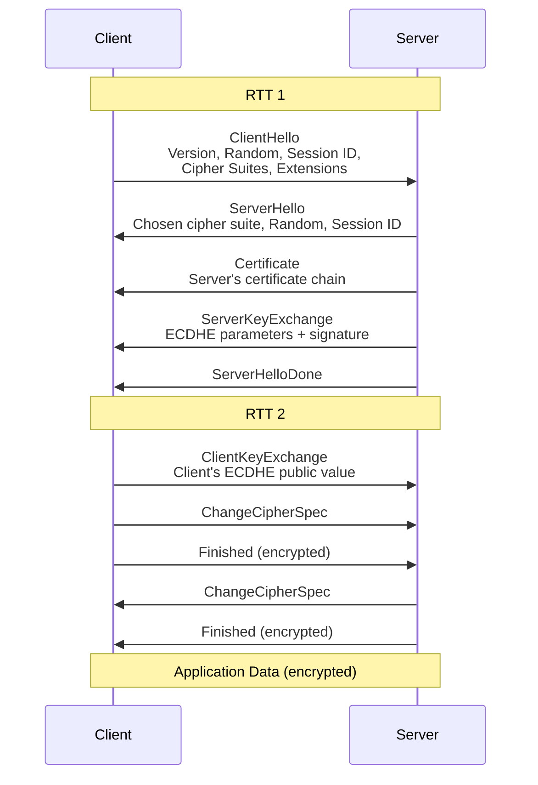
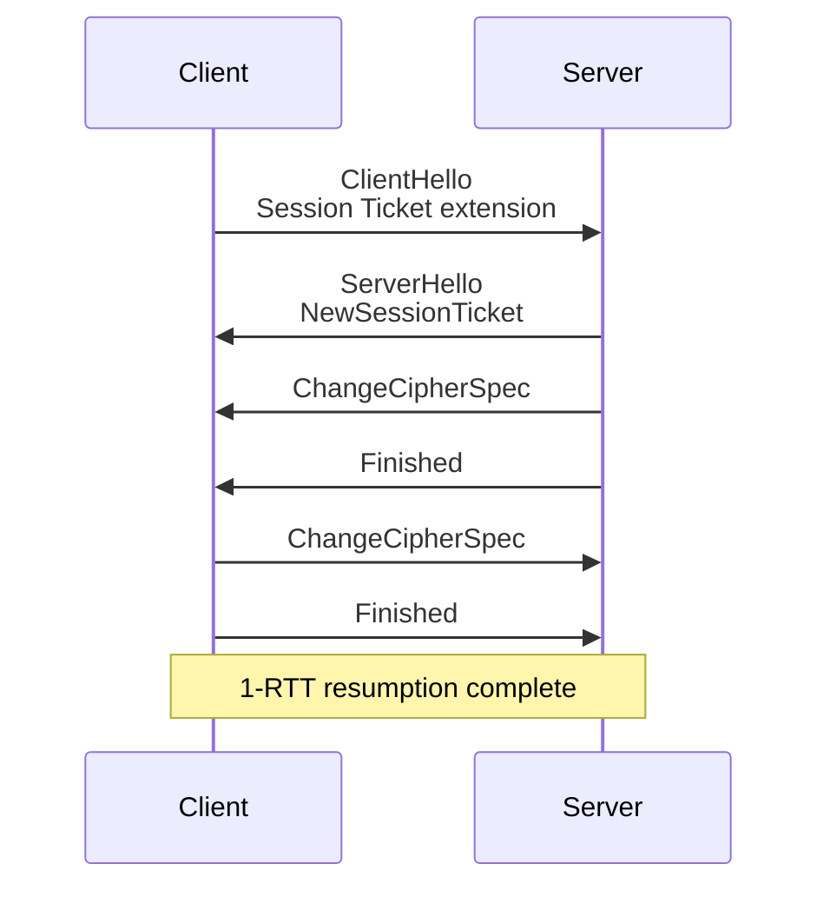
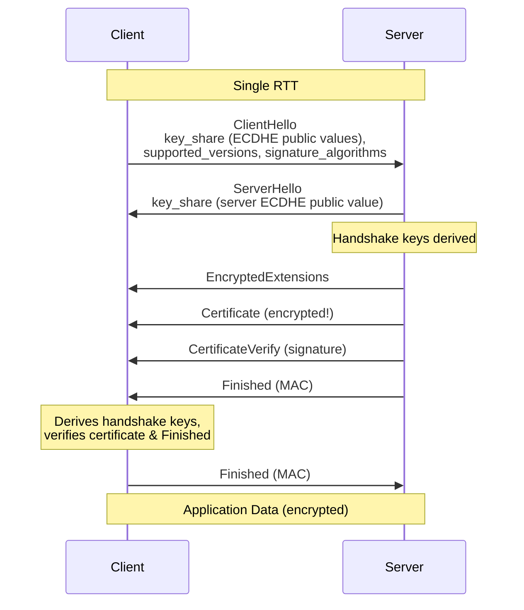
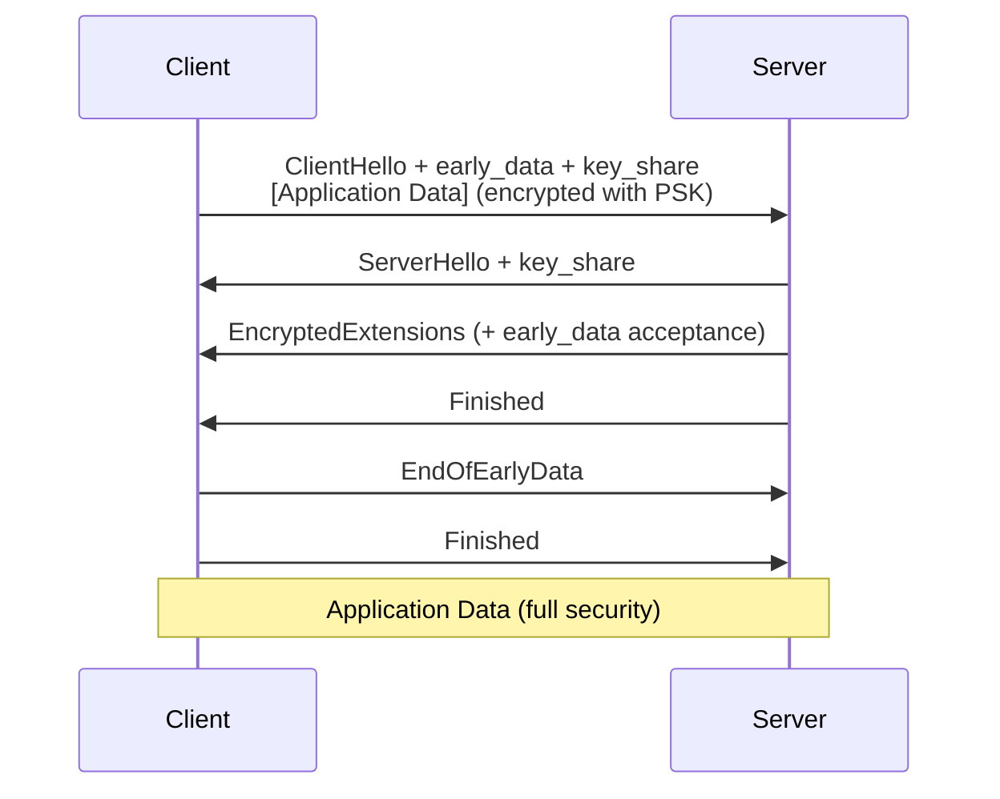
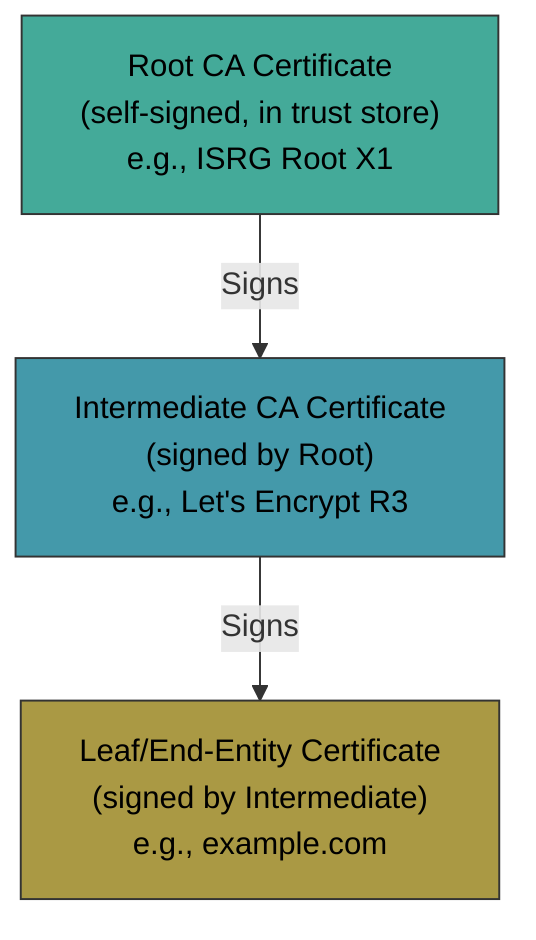
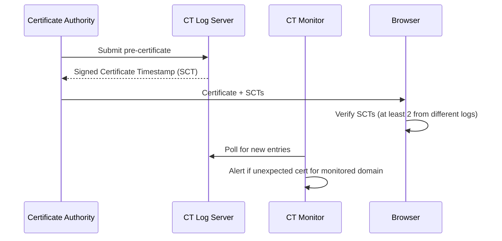
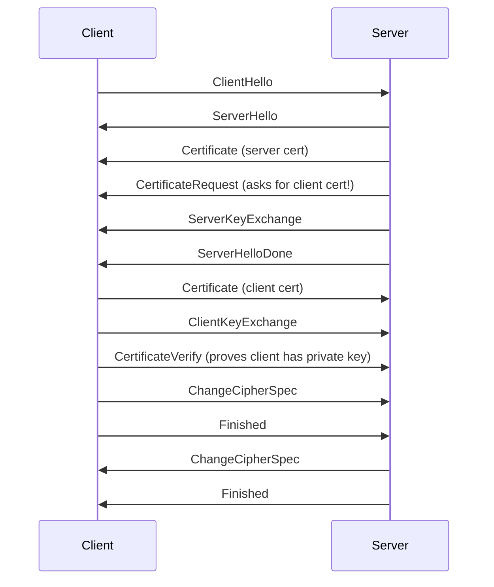
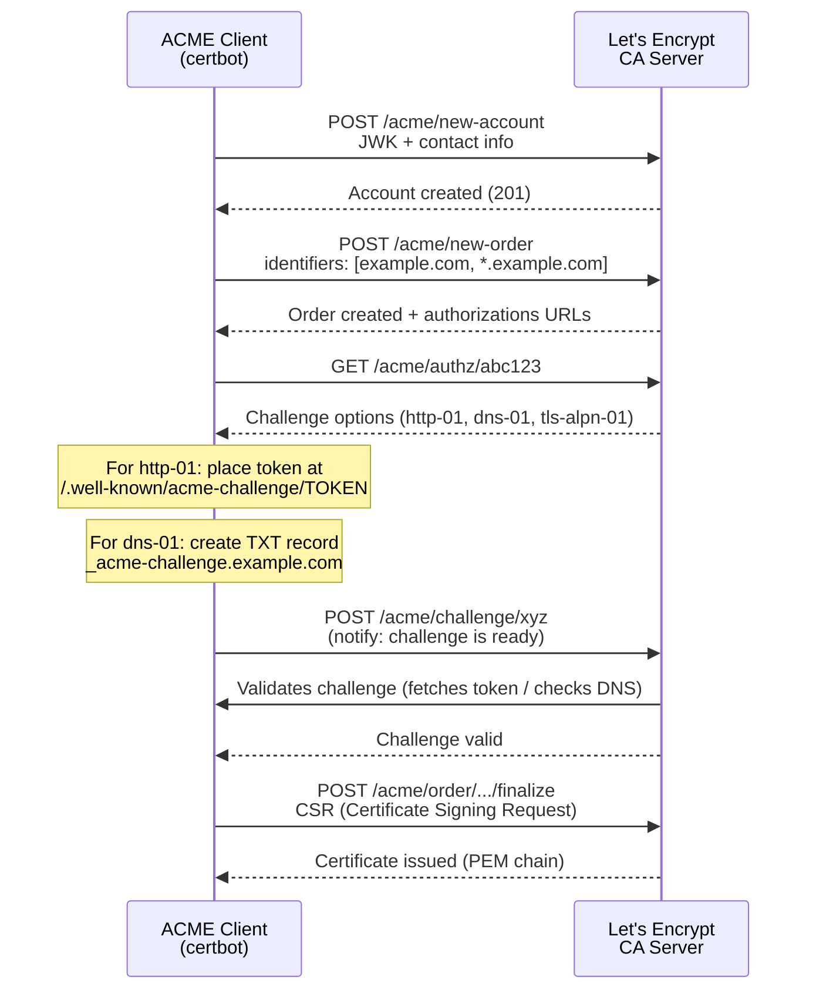
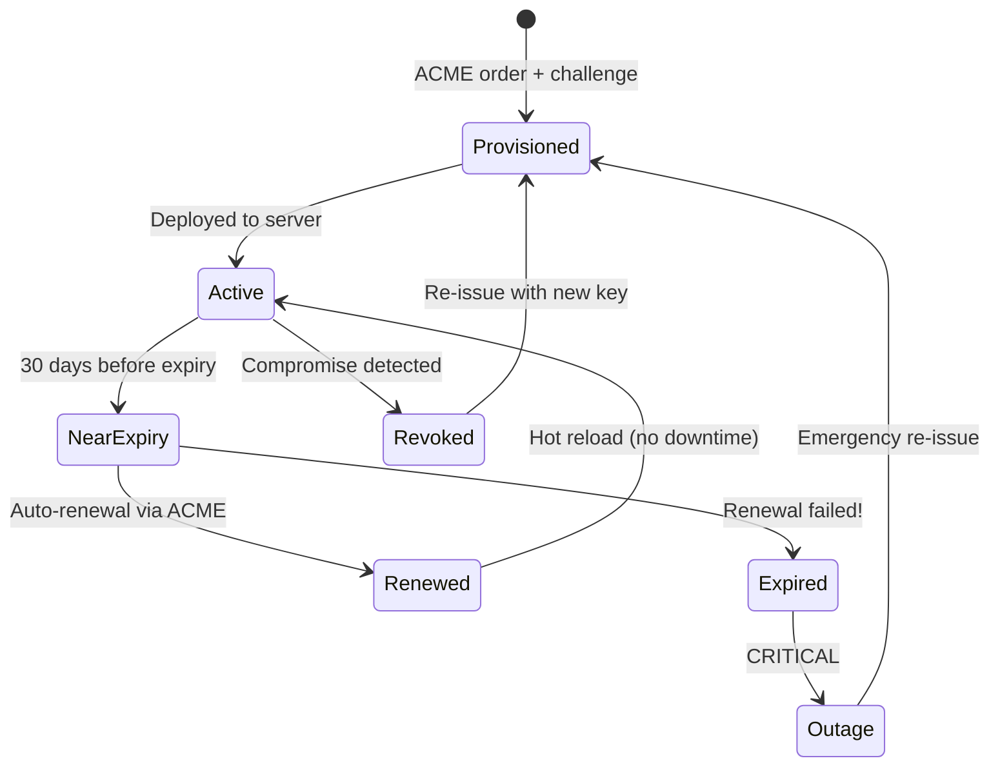

# TLS Handshake

## Why TLS Exists

Before TLS, all Internet communication was plaintext. Anyone on the network path — ISPs, coffee shop Wi-Fi operators, government agencies — could read, modify, or inject data into HTTP, SMTP, and other protocol streams. TLS (Transport Layer Security) solves three fundamental security problems:

1. **Confidentiality** — encryption prevents eavesdropping
2. **Integrity** — MACs prevent tampering
3. **Authentication** — certificates prove server (and optionally client) identity

TLS evolved from SSL (Secure Sockets Layer), created by Netscape in 1994. The lineage is SSL 2.0 (1995, broken) → SSL 3.0 (1996, broken by POODLE) → TLS 1.0 (1999) → TLS 1.1 (2006) → TLS 1.2 (2008) → TLS 1.3 (2018). As of 2024, TLS 1.2 and 1.3 are the only versions considered secure.

## First Principles

### The Cryptographic Building Blocks

TLS composes four cryptographic primitives:

| Primitive | Purpose | Examples |
|-----------|---------|----------|
| **Key Exchange** | Establish shared secret over insecure channel | ECDHE, DHE, RSA (deprecated in TLS 1.3) |
| **Authentication** | Prove identity via certificates | RSA, ECDSA, EdDSA |
| **Symmetric Encryption** | Encrypt bulk data | AES-128-GCM, AES-256-GCM, ChaCha20-Poly1305 |
| **Hash / MAC** | Ensure integrity | SHA-256, SHA-384, HMAC |

A TLS cipher suite combines one of each. Example:

```
TLS_ECDHE_RSA_WITH_AES_256_GCM_SHA384
│    │     │        │       │    │
│    │     │        │       │    └── Hash for PRF/HKDF
│    │     │        │       └── AEAD mode
│    │     │        └── Symmetric cipher
│    │     └── Authentication algorithm
│    └── Key exchange algorithm
└── Protocol
```

TLS 1.3 simplifies naming: `TLS_AES_256_GCM_SHA384` — key exchange and authentication are negotiated separately.

### Forward Secrecy

Forward secrecy (also called Perfect Forward Secrecy, PFS) ensures that compromising the server's long-term private key does not compromise past session keys. This is achieved by using **ephemeral** Diffie-Hellman (DHE or ECDHE) for key exchange.

Without forward secrecy (RSA key exchange):

$$
\text{premaster\_secret} = \text{Enc}_{K_{pub}}(R_C)
$$

An attacker who obtains $K_{priv}$ can decrypt all recorded sessions.

With forward secrecy (ECDHE):

$$
\text{shared\_secret} = g^{ab} \mod p
$$

where $a$ and $b$ are ephemeral, destroyed after the session. Even with $K_{priv}$, past sessions remain secure.

::: danger
TLS 1.3 **mandates** forward secrecy. RSA key exchange was removed entirely. If you still need TLS 1.2, always configure ECDHE cipher suites first.
:::

## Core Mechanics: TLS 1.2 Handshake

### Full Handshake (2-RTT)



### Step-by-Step Breakdown

**ClientHello** contains:
- Maximum supported TLS version
- 32 bytes of client random
- Session ID (for resumption)
- List of supported cipher suites (ordered by preference)
- List of supported extensions (SNI, ALPN, supported_groups, signature_algorithms, etc.)

**ServerHello** responds with:
- Chosen TLS version
- 32 bytes of server random
- Session ID
- Chosen cipher suite
- Selected extensions

**Key Derivation (TLS 1.2)**:

$$
\text{premaster\_secret} = \text{ECDH}(client\_privkey, server\_pubkey)
$$

$$
\text{master\_secret} = \text{PRF}(\text{premaster\_secret}, \text{"master secret"}, ClientRandom \| ServerRandom)
$$

$$
\text{key\_block} = \text{PRF}(\text{master\_secret}, \text{"key expansion"}, ServerRandom \| ClientRandom)
$$

The key block is sliced into:
- Client write MAC key
- Server write MAC key
- Client write encryption key
- Server write encryption key
- Client write IV
- Server write IV

### Session Resumption (1-RTT)

TLS 1.2 supports two resumption mechanisms:

**Session ID resumption**: Server stores session state, client sends the ID in ClientHello.

**Session Tickets (RFC 5077)**: Server encrypts the session state and sends it to the client. No server-side storage needed.



## Core Mechanics: TLS 1.3 Handshake

TLS 1.3 (RFC 8446) is a major redesign. Key changes:

1. **1-RTT full handshake** (down from 2-RTT)
2. **0-RTT resumption** (down from 1-RTT)
3. **Removed** RSA key exchange, static DH, CBC mode, RC4, SHA-1, compression, renegotiation
4. **Encrypted** certificates (server cert is no longer in plaintext)
5. **Simplified** cipher suites (only 5 defined)

### Full Handshake (1-RTT)



The key insight: the client sends its key_share **speculatively** in the ClientHello. If the server supports the offered group, the handshake completes in 1-RTT. If not, the server sends a HelloRetryRequest.

### TLS 1.3 Key Schedule

TLS 1.3 uses HKDF (HMAC-based Key Derivation Function) with a structured key schedule:

```
                    0
                    |
                    v
      PSK -----> HKDF-Extract = Early Secret
                    |
                    +----> Derive-Secret(., "ext binder" | "res binder", "")
                    |                     = binder_key
                    +----> Derive-Secret(., "c e traffic", ClientHello)
                    |                     = client_early_traffic_secret
                    v
              (EC)DHE ----> HKDF-Extract = Handshake Secret
                    |
                    +----> Derive-Secret(., "c hs traffic", ClientHello...ServerHello)
                    |                     = client_handshake_traffic_secret
                    +----> Derive-Secret(., "s hs traffic", ClientHello...ServerHello)
                    |                     = server_handshake_traffic_secret
                    v
              0 --------> HKDF-Extract = Master Secret
                    |
                    +----> Derive-Secret(., "c ap traffic", ClientHello...server Finished)
                    |                     = client_application_traffic_secret_0
                    +----> Derive-Secret(., "s ap traffic", ClientHello...server Finished)
                    |                     = server_application_traffic_secret_0
                    +----> Derive-Secret(., "exp master", ClientHello...server Finished)
                    |                     = exporter_master_secret
                    +----> Derive-Secret(., "res master", ClientHello...client Finished)
                                          = resumption_master_secret
```

### 0-RTT Resumption

TLS 1.3 allows sending application data in the very first flight (before the handshake completes):



::: warning
0-RTT data is **not replay-protected**. An attacker can capture and replay the 0-RTT data. Only use 0-RTT for idempotent operations (GET requests, not POST). Servers must implement anti-replay mechanisms (single-use tickets, time-window checks).
:::

### Comparing TLS 1.2 vs 1.3

| Feature | TLS 1.2 | TLS 1.3 |
|---------|---------|---------|
| Full handshake RTT | 2 | 1 |
| Resumption RTT | 1 | 0 (with caveats) |
| Forward secrecy | Optional (ECDHE suites) | Mandatory |
| Certificate encryption | No (plaintext) | Yes (encrypted) |
| Cipher suites | 300+ (many insecure) | 5 |
| Renegotiation | Yes | No (removed) |
| Compression | Yes (CRIME attack) | No (removed) |
| 0-RTT | No | Yes |
| Key exchange | RSA, DHE, ECDHE | ECDHE, PSK only |
| Record format | Variable | Unified (all look like application_data) |

## Certificate Chain Validation

### X.509 Certificate Structure

```
Certificate:
    Data:
        Version: v3
        Serial Number: 0x0A01...
        Signature Algorithm: sha256WithRSAEncryption
        Issuer: CN=Let's Encrypt Authority X3, O=Let's Encrypt
        Validity:
            Not Before: 2024-01-15 00:00:00 UTC
            Not After:  2024-04-14 23:59:59 UTC
        Subject: CN=example.com
        Subject Public Key Info:
            Algorithm: id-ecPublicKey (P-256)
            Public Key: 04:ab:cd:...
        X509v3 Extensions:
            Subject Alternative Name:
                DNS:example.com, DNS:*.example.com
            Key Usage: Digital Signature
            Extended Key Usage: TLS Web Server Authentication
            Authority Information Access:
                OCSP: http://ocsp.letsencrypt.org
                CA Issuers: http://cert.letsencrypt.org/...
            Certificate Policies: 2.23.140.1.2.1 (DV)
    Signature Algorithm: sha256WithRSAEncryption
    Signature Value: 30:45:...
```

### Chain of Trust



Validation algorithm:
1. Server sends leaf + intermediate(s) in Certificate message
2. Client builds chain up to a trusted root in its trust store
3. For each certificate in the chain:
   - Check signature validity
   - Check validity period (notBefore ≤ now ≤ notAfter)
   - Check revocation status (CRL or OCSP)
   - Check constraints (Basic Constraints, Key Usage, Name Constraints)
4. Verify leaf's Subject Alternative Name (SAN) matches requested hostname

### Certificate Transparency (CT)

CT (RFC 6962) requires CAs to log all issued certificates to publicly auditable append-only logs. This makes misissued certificates detectable.



### OCSP Stapling

Instead of the client querying the CA's OCSP responder (privacy concern + latency), the server periodically fetches the OCSP response and includes ("staples") it in the TLS handshake:

```typescript
import tls from 'node:tls';
import fs from 'node:fs';
import https from 'node:https';

// Node.js HTTPS server with OCSP stapling
const server = https.createServer({
  key: fs.readFileSync('/etc/letsencrypt/live/example.com/privkey.pem'),
  cert: fs.readFileSync('/etc/letsencrypt/live/example.com/fullchain.pem'),

  // Enable OCSP stapling
  // Node.js handles this via the 'OCSPRequest' event
});

server.on('OCSPRequest', async (cert, issuer, callback) => {
  try {
    const ocspResponse = await fetchOcspResponse(cert, issuer);
    callback(null, ocspResponse);
  } catch (error) {
    // Return no stapled response (client may check OCSP directly)
    callback(null, null);
  }
});

async function fetchOcspResponse(
  cert: Buffer,
  issuer: Buffer
): Promise<Buffer> {
  // In production, use a library like 'ocsp' for proper ASN.1 handling
  // This is a simplified illustration
  const ocspUrl = extractOcspUrl(cert);
  const ocspRequest = buildOcspRequest(cert, issuer);

  const response = await fetch(ocspUrl, {
    method: 'POST',
    headers: { 'Content-Type': 'application/ocsp-request' },
    body: ocspRequest,
  });

  return Buffer.from(await response.arrayBuffer());
}

function extractOcspUrl(_cert: Buffer): string {
  // Parse AIA extension to get OCSP responder URL
  return 'http://ocsp.letsencrypt.org';
}

function buildOcspRequest(_cert: Buffer, _issuer: Buffer): Buffer {
  // Build ASN.1 DER-encoded OCSP request
  return Buffer.alloc(0);
}
```

## ALPN (Application-Layer Protocol Negotiation)

ALPN (RFC 7301) allows the client and server to negotiate the application protocol during the TLS handshake, avoiding an extra round trip. This is essential for HTTP/2 and HTTP/3 negotiation.

```
ClientHello extension:
  application_layer_protocol_negotiation:
    - h2        (HTTP/2)
    - http/1.1  (HTTP/1.1 fallback)

ServerHello extension:
  application_layer_protocol_negotiation:
    - h2        (server chose HTTP/2)
```

Without ALPN, the client would need to connect, complete TLS, then use HTTP Upgrade headers — adding latency.

### ALPN in Practice

```typescript
import tls from 'node:tls';
import fs from 'node:fs';

function createALPNServer(port: number): tls.Server {
  const server = tls.createServer({
    key: fs.readFileSync('server-key.pem'),
    cert: fs.readFileSync('server-cert.pem'),
    ALPNProtocols: ['h2', 'http/1.1'],
  });

  server.on('secureConnection', (socket: tls.TLSSocket) => {
    const protocol = socket.alpnProtocol;
    console.log(`Negotiated protocol: ${protocol}`);

    switch (protocol) {
      case 'h2':
        handleHttp2(socket);
        break;
      case 'http/1.1':
        handleHttp1(socket);
        break;
      case false:
        // ALPN not supported by client — default to HTTP/1.1
        handleHttp1(socket);
        break;
    }
  });

  server.listen(port);
  return server;
}

function handleHttp2(socket: tls.TLSSocket): void {
  // HTTP/2 connection handling
  console.log(`HTTP/2 connection from ${socket.remoteAddress}`);
}

function handleHttp1(socket: tls.TLSSocket): void {
  // HTTP/1.1 connection handling
  console.log(`HTTP/1.1 connection from ${socket.remoteAddress}`);
}

createALPNServer(443);
```

## Mutual TLS (mTLS)

In standard TLS, only the server presents a certificate. In mTLS, **both** parties authenticate:



### mTLS Use Cases

| Use Case | Why mTLS |
|----------|----------|
| Service-to-service in microservices | Zero-trust networking, no shared secrets |
| Kubernetes API server | kubectl authenticates via client cert |
| IoT device authentication | Devices have pre-provisioned certs |
| Banking/financial APIs | Strong client authentication required |
| Service mesh (Istio, Linkerd) | Automatic mTLS between sidecar proxies |

### Production mTLS Implementation

```typescript
import tls from 'node:tls';
import fs from 'node:fs';
import https from 'node:https';
import { X509Certificate } from 'node:crypto';

interface MtlsConfig {
  serverCert: string;
  serverKey: string;
  caCert: string; // CA that signed client certificates
  crl?: string;   // Certificate Revocation List
}

function createMtlsServer(config: MtlsConfig, port: number): https.Server {
  const server = https.createServer(
    {
      key: fs.readFileSync(config.serverKey),
      cert: fs.readFileSync(config.serverCert),
      ca: [fs.readFileSync(config.caCert)],
      requestCert: true,
      rejectUnauthorized: true,
      crl: config.crl ? [fs.readFileSync(config.crl)] : undefined,
      minVersion: 'TLSv1.2',
      ciphers: [
        'TLS_AES_256_GCM_SHA384',
        'TLS_CHACHA20_POLY1305_SHA256',
        'TLS_AES_128_GCM_SHA256',
        'ECDHE-RSA-AES256-GCM-SHA384',
        'ECDHE-RSA-AES128-GCM-SHA256',
      ].join(':'),
    },
    (req, res) => {
      const clientCert = (req.socket as tls.TLSSocket).getPeerCertificate();

      if (!clientCert || !clientCert.subject) {
        res.writeHead(401);
        res.end('No client certificate provided');
        return;
      }

      // Extract identity from client certificate
      const identity = {
        commonName: clientCert.subject.CN,
        organization: clientCert.subject.O,
        serialNumber: clientCert.serialNumber,
        fingerprint: clientCert.fingerprint256,
        validFrom: clientCert.valid_from,
        validTo: clientCert.valid_to,
      };

      console.log('Authenticated client:', identity);

      // Use certificate identity for authorization
      if (!authorizeClient(identity.commonName)) {
        res.writeHead(403);
        res.end('Forbidden');
        return;
      }

      res.writeHead(200, { 'Content-Type': 'application/json' });
      res.end(JSON.stringify({ message: 'Authenticated', identity }));
    }
  );

  server.listen(port, () => {
    console.log(`mTLS server listening on port ${port}`);
  });

  return server;
}

function authorizeClient(cn: string): boolean {
  const allowedClients = new Set([
    'payment-service',
    'order-service',
    'api-gateway',
  ]);
  return allowedClients.has(cn);
}

// Client side
function createMtlsClient(
  serverUrl: string,
  clientCert: string,
  clientKey: string,
  caCert: string
): Promise<string> {
  return new Promise((resolve, reject) => {
    const options: https.RequestOptions = {
      cert: fs.readFileSync(clientCert),
      key: fs.readFileSync(clientKey),
      ca: [fs.readFileSync(caCert)],
      rejectUnauthorized: true,
    };

    const req = https.get(serverUrl, options, (res) => {
      let data = '';
      res.on('data', (chunk: Buffer) => { data += chunk.toString(); });
      res.on('end', () => resolve(data));
    });

    req.on('error', reject);
  });
}
```

## Let's Encrypt and ACME

### How ACME Works

The ACME (Automatic Certificate Management Environment) protocol (RFC 8555) automates certificate issuance:



### ACME Challenge Types

| Challenge | How It Works | Pros | Cons |
|-----------|-------------|------|------|
| **http-01** | Serve token at `/.well-known/acme-challenge/` on port 80 | Simple, widely supported | Requires port 80, no wildcards |
| **dns-01** | Create `_acme-challenge` TXT record | Supports wildcards, no port needed | Requires DNS API, propagation delay |
| **tls-alpn-01** | Serve self-signed cert with ACME ALPN on port 443 | Works when only port 443 is available | Less common, complex setup |

### Automated Certificate Management

```typescript
import { execSync } from 'node:child_process';
import fs from 'node:fs';

interface CertInfo {
  domain: string;
  expiresAt: Date;
  daysUntilExpiry: number;
  issuer: string;
  serialNumber: string;
}

function getCertificateInfo(domain: string): CertInfo {
  const certPath = `/etc/letsencrypt/live/${domain}/cert.pem`;

  if (!fs.existsSync(certPath)) {
    throw new Error(`Certificate not found for ${domain}`);
  }

  const output = execSync(
    `openssl x509 -in ${certPath} -noout -enddate -issuer -serial`,
    { encoding: 'utf-8' }
  );

  const expiryMatch = output.match(/notAfter=(.*)/);
  const issuerMatch = output.match(/issuer=(.*)/);
  const serialMatch = output.match(/serial=(.*)/);

  const expiresAt = new Date(expiryMatch![1]);
  const now = new Date();
  const daysUntilExpiry = Math.floor(
    (expiresAt.getTime() - now.getTime()) / (86400 * 1000)
  );

  return {
    domain,
    expiresAt,
    daysUntilExpiry,
    issuer: issuerMatch![1].trim(),
    serialNumber: serialMatch![1].trim(),
  };
}

async function renewCertificate(
  domain: string,
  options: {
    dryRun?: boolean;
    forceRenew?: boolean;
    preHook?: string;
    postHook?: string;
  } = {}
): Promise<{ success: boolean; output: string }> {
  const args = [
    'certbot',
    'renew',
    '--cert-name', domain,
    '--non-interactive',
    '--agree-tos',
  ];

  if (options.dryRun) args.push('--dry-run');
  if (options.forceRenew) args.push('--force-renewal');
  if (options.preHook) args.push('--pre-hook', options.preHook);
  if (options.postHook) args.push('--post-hook', options.postHook);

  try {
    const output = execSync(args.join(' '), { encoding: 'utf-8' });
    return { success: true, output };
  } catch (error) {
    const err = error as { stderr: string };
    return { success: false, output: err.stderr };
  }
}

// Monitor and auto-renew certificates
async function monitorCertificates(domains: string[]): Promise<void> {
  for (const domain of domains) {
    try {
      const info = getCertificateInfo(domain);

      if (info.daysUntilExpiry <= 30) {
        console.warn(
          `Certificate for ${domain} expires in ${info.daysUntilExpiry} days`
        );

        if (info.daysUntilExpiry <= 14) {
          console.log(`Attempting renewal for ${domain}...`);
          const result = await renewCertificate(domain, {
            postHook: 'systemctl reload nginx',
          });

          if (!result.success) {
            console.error(`Renewal failed for ${domain}: ${result.output}`);
            // Alert on-call via PagerDuty, Slack, etc.
          }
        }
      } else {
        console.log(
          `Certificate for ${domain} is valid for ${info.daysUntilExpiry} more days`
        );
      }
    } catch (error) {
      console.error(`Failed to check certificate for ${domain}:`, error);
    }
  }
}
```

## Edge Cases and Failure Modes

### SNI and Virtual Hosting

Server Name Indication (SNI) sends the hostname in the ClientHello, allowing one IP to serve multiple TLS certificates. Without SNI, the server cannot determine which certificate to present before the handshake completes.

::: warning
In TLS 1.2, SNI is sent in plaintext — any observer can see which domain you are connecting to. TLS 1.3 addresses this with Encrypted Client Hello (ECH), but adoption is still limited as of 2025.
:::

### Common TLS Failures

| Error | Cause | Fix |
|-------|-------|-----|
| `CERTIFICATE_VERIFY_FAILED` | Expired cert, wrong hostname, missing intermediate | Check cert chain, SAN, validity |
| `TLSV1_ALERT_PROTOCOL_VERSION` | Client/server version mismatch | Update TLS config, min version |
| `HANDSHAKE_FAILURE` | No common cipher suite | Check cipher suite configuration |
| `CERTIFICATE_REQUIRED` | mTLS: client didn't send cert | Configure client certificate |
| `DEPTH_ZERO_SELF_SIGNED_CERT` | Self-signed certificate | Add to trust store or use proper CA |
| `UNABLE_TO_GET_ISSUER_CERT_LOCALLY` | Missing intermediate/root cert | Install CA bundle, send full chain |

### The Mixed Content Problem

If a page is loaded over HTTPS but includes resources over HTTP, browsers block or warn about "mixed content." This breaks gradually during HTTPS migration.

### Certificate Pinning (and Why It's Mostly Dead)

Certificate pinning hardcodes expected certificate hashes in the client. If the server presents a different cert (even a valid one), the connection is rejected.

- **HPKP** (HTTP Public Key Pinning) — deprecated, too dangerous (self-DoS risk)
- **Mobile app pinning** — still used but makes cert rotation harder
- **DANE/TLSA** (DNS-based) — niche adoption, requires DNSSEC

::: info War Story
In 2017, a major mobile banking app pinned its certificate but forgot about the pin when rotating CAs. After the certificate was renewed with a different intermediate CA, every user was locked out of the app for 48 hours until an emergency app update could be pushed through the app stores. The incident affected 2 million users and led to the company abandoning pinning entirely.
:::

## Performance Characteristics

### Handshake Latency

| Scenario | RTTs | Typical Latency |
|----------|------|----------------|
| TLS 1.2 full handshake | 2 | 100-300ms |
| TLS 1.2 session resumption | 1 | 50-150ms |
| TLS 1.3 full handshake | 1 | 50-150ms |
| TLS 1.3 0-RTT | 0 | 0ms (data sent with ClientHello) |
| TLS 1.3 HelloRetryRequest | 2 | 100-300ms |

### Computational Cost

RSA-2048 operations per second on a modern server (single core):

| Operation | ops/sec |
|-----------|---------|
| RSA-2048 sign | ~1,000 |
| RSA-2048 verify | ~35,000 |
| ECDSA P-256 sign | ~35,000 |
| ECDSA P-256 verify | ~12,000 |
| ECDHE P-256 key gen | ~30,000 |
| AES-256-GCM encrypt (1KB) | ~2,000,000 |
| ChaCha20-Poly1305 encrypt (1KB) | ~1,500,000 |

ECDSA is significantly faster than RSA for signing, which is what the server does. This is why modern deployments prefer ECDSA certificates.

$$
\text{TLS overhead} \approx \frac{T_{\text{handshake}} + T_{\text{crypto}}}{T_{\text{total}}} \approx 1-5\% \text{ for long-lived connections}
$$

For short-lived connections (e.g., HTTP/1.0 without keep-alive), TLS overhead can dominate:

$$
\text{Overhead ratio} = \frac{N \times T_{\text{handshake}}}{T_{\text{payload}}}
$$

where $N$ is the number of connections.

### TLS Session Cache Sizing

For a server handling $C$ new TLS connections per second with average session lifetime $L$:

$$
\text{Cache entries} = C \times \min(L, T_{\text{ticket\_lifetime}})
$$

Each session ticket is approximately 200 bytes. For 10,000 conn/s and 1 hour ticket lifetime:

$$
\text{Memory} = 10{,}000 \times 3{,}600 \times 200 \text{ bytes} \approx 6.7 \text{ GB}
$$

In practice, use session tickets (which are stored client-side) to avoid server-side memory pressure.

## Mathematical Foundations

### Diffie-Hellman Key Exchange

The security of ECDHE relies on the hardness of the Elliptic Curve Discrete Logarithm Problem (ECDLP).

Given elliptic curve $E$ over finite field $\mathbb{F}_p$, base point $G$ of order $n$:

$$
\text{Alice: } a \xleftarrow{R} [1, n-1], \quad A = aG
$$

$$
\text{Bob: } b \xleftarrow{R} [1, n-1], \quad B = bG
$$

$$
\text{Shared secret: } S = aB = bA = abG
$$

The ECDLP states: given $G$ and $aG$, computing $a$ is computationally infeasible. For P-256, the best known attack requires $O(2^{128})$ operations.

### AEAD Construction

AES-GCM (Galois/Counter Mode) provides both encryption and authentication:

$$
C_i = E_K(\text{counter}_i) \oplus P_i
$$

$$
T = \text{GHASH}_H(A \| C) \oplus E_K(\text{counter}_0)
$$

where $H = E_K(0^{128})$, $A$ is additional authenticated data, and $T$ is the authentication tag. If the tag doesn't verify, the entire ciphertext is rejected — there is no partial decryption.

## Decision Framework

### TLS Configuration Recommendations

| Environment | Min Version | Cipher Preference | Certificate Type |
|-------------|-------------|-------------------|------------------|
| Public web | TLS 1.2 | AES-256-GCM, ChaCha20 | ECDSA P-256 |
| Internal services | TLS 1.3 only | Server's choice | ECDSA P-256 or Ed25519 |
| Legacy compatibility | TLS 1.2 | Broader set (with ECDHE) | RSA-2048 + ECDSA |
| IoT/embedded | TLS 1.3 | ChaCha20 (no AES-NI) | ECDSA P-256 |
| High-security | TLS 1.3 only | AES-256-GCM | RSA-4096 + ECDSA P-384 |

### When to Use mTLS

Use mTLS when:
- Service-to-service communication in zero-trust networks
- API authentication for machine-to-machine (stronger than API keys)
- Regulatory requirements (PCI DSS, SOC 2 for certain controls)

Avoid mTLS when:
- User-facing authentication (use OIDC/OAuth instead)
- Simple internal services where network segmentation is sufficient
- You don't have PKI infrastructure to manage client certs

## Advanced Topics

### Post-Quantum TLS

Quantum computers threaten all current key exchange algorithms (Shor's algorithm breaks RSA, DH, ECDH in polynomial time). NIST standardized ML-KEM (Kyber) in 2024 for post-quantum key encapsulation.

TLS 1.3 hybrid key exchange combines classical ECDHE with ML-KEM:

$$
\text{shared\_secret} = \text{ECDHE\_secret} \| \text{ML-KEM\_secret}
$$

Chrome and other browsers began shipping hybrid `X25519Kyber768` key exchange in 2024. The ClientHello grows significantly (~1200 bytes for the ML-KEM public key), occasionally causing issues with middleboxes that cannot handle large ClientHellos.

### TLS Fingerprinting (JA3/JA4)

Every TLS client produces a characteristic fingerprint based on:
- TLS version
- Cipher suites offered (and order)
- Extensions (and order)
- Elliptic curves
- Point formats

JA3 computes an MD5 hash of these values. This fingerprint can identify specific client applications (curl vs Chrome vs Python requests) and is used for:
- Bot detection
- Threat intelligence
- Application identification

::: info War Story
A financial services company noticed unusual API traffic that passed all authentication checks. JA3 fingerprinting revealed that the "browser" clients had fingerprints matching Python's `requests` library, not Chrome. Investigation uncovered a credential stuffing attack using stolen API tokens, with the attacker's automation framework disguised to look like legitimate browser traffic. The JA3 mismatch was the only indicator of compromise. Blocking the fingerprint stopped the attack while legitimate users were unaffected.
:::

### Certificate Lifecycle Automation

Modern certificate management follows the principle of short-lived certificates (Let's Encrypt issues 90-day certs, moving toward even shorter lifetimes):



The industry is moving toward even shorter certificate lifetimes. Google has proposed 90-day maximum validity (down from 398 days) and ultimately aims for certificates valid for only days, making revocation mechanisms less critical since certificates naturally expire before revocation would take effect.
