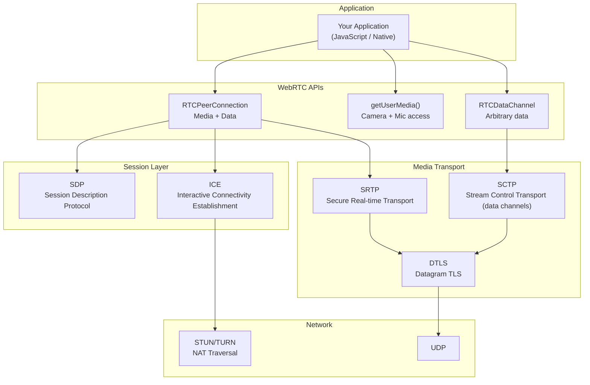
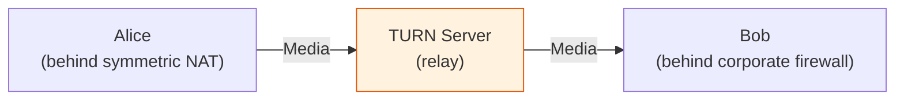
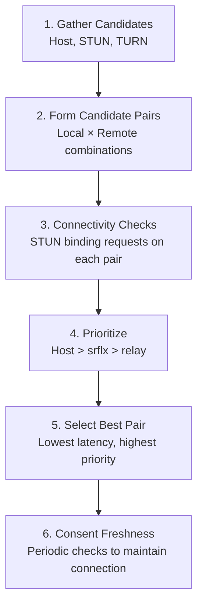
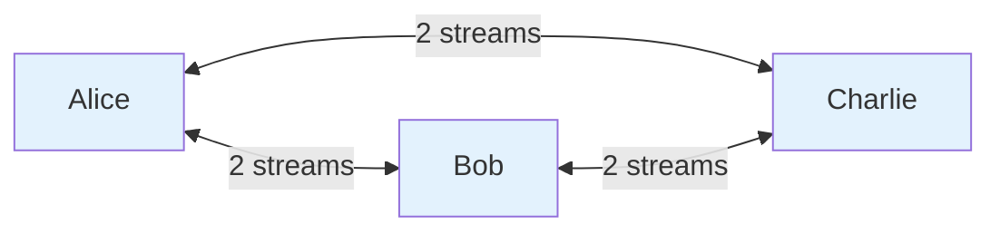
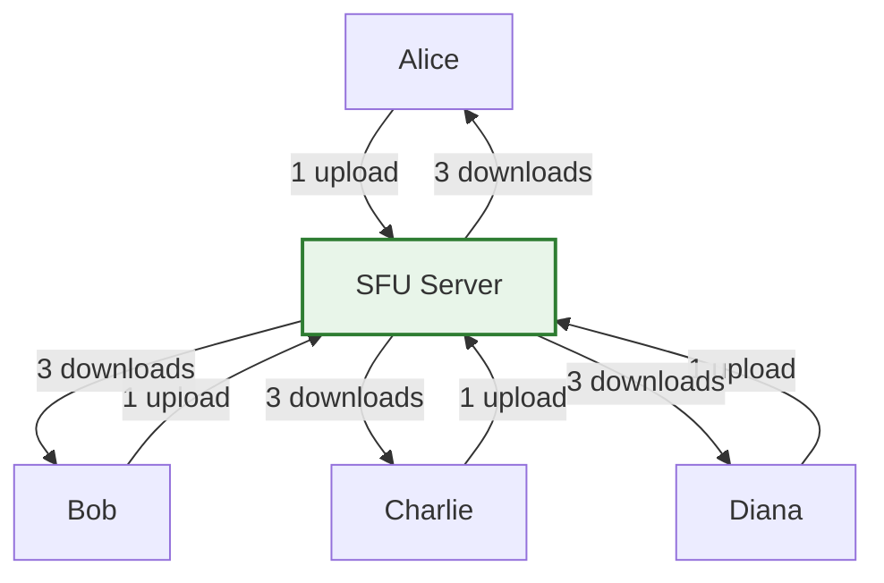
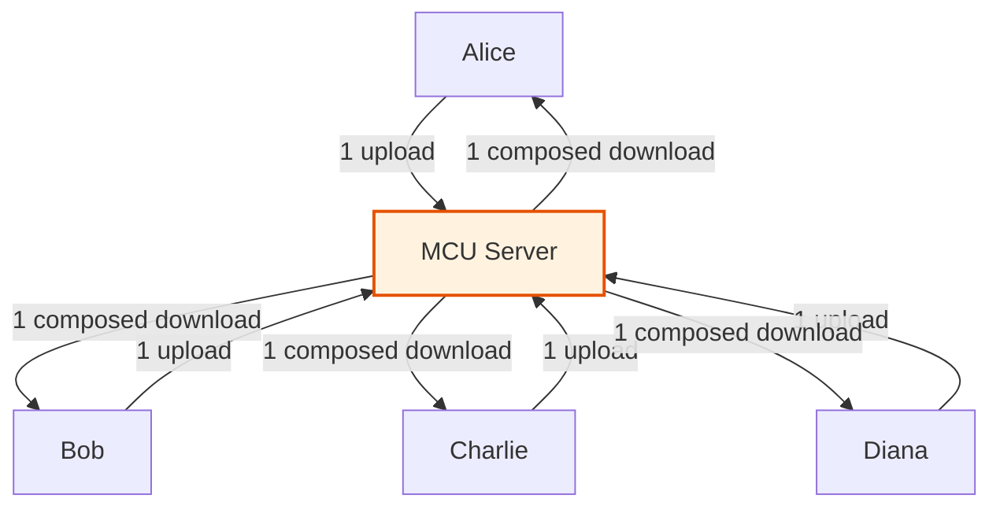
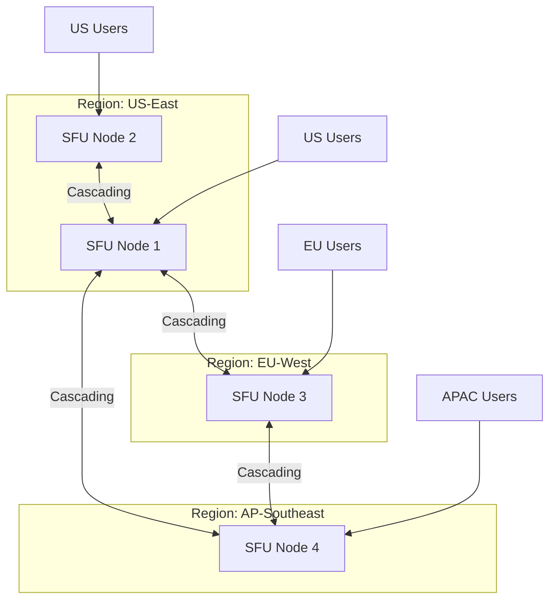

# WebRTC Architecture

WebRTC (Web Real-Time Communication) enables peer-to-peer audio, video, and data streaming directly between browsers and native applications without plugins. It powers Google Meet, Discord, Zoom (web client), Twitch low-latency streaming, and countless telehealth, education, and collaboration platforms.

WebRTC is deceptively complex. The API is straightforward — a few JavaScript calls to get a video call working — but production-grade WebRTC involves navigating NAT traversal, codec negotiation, network adaptation, packet loss concealment, echo cancellation, and scalable media routing. This page covers the architecture from signaling to scale.

## WebRTC Protocol Stack



## Signaling

WebRTC does not define a signaling protocol. Signaling is the mechanism by which two peers exchange the information needed to establish a connection: session descriptions (SDP) and ICE candidates. You choose the transport — WebSocket, HTTP polling, carrier pigeon — WebRTC does not care.

### Signaling Flow

```mermaid
sequenceDiagram
    participant Alice as Alice (Caller)
    participant Signal as Signaling Server
    participant Bob as Bob (Callee)

    Note over Alice,Bob: 1. Session Description Exchange

    Alice->>Alice: createOffer()
    Alice->>Alice: setLocalDescription(offer)
    Alice->>Signal: Send SDP Offer
    Signal->>Bob: Forward SDP Offer

    Bob->>Bob: setRemoteDescription(offer)
    Bob->>Bob: createAnswer()
    Bob->>Bob: setLocalDescription(answer)
    Bob->>Signal: Send SDP Answer
    Signal->>Alice: Forward SDP Answer
    Alice->>Alice: setRemoteDescription(answer)

    Note over Alice,Bob: 2. ICE Candidate Exchange

    Alice->>Signal: Send ICE Candidate
    Signal->>Bob: Forward ICE Candidate
    Bob->>Alice: Send ICE Candidate (via Signal)

    Note over Alice,Bob: 3. Direct peer-to-peer connection established
    Alice<-->Bob: Encrypted media + data (SRTP/SCTP over DTLS)
```

### Minimal Signaling Server

```javascript
// Signaling server (Node.js + WebSocket)
import { WebSocketServer } from 'ws';

const wss = new WebSocketServer({ port: 8080 });
const rooms = new Map(); // roomId -> Set<WebSocket>

wss.on('connection', (ws) => {
  ws.on('message', (data) => {
    const msg = JSON.parse(data);

    switch (msg.type) {
      case 'join': {
        const room = rooms.get(msg.roomId) || new Set();
        room.add(ws);
        rooms.set(msg.roomId, room);
        ws.roomId = msg.roomId;
        break;
      }
      case 'offer':
      case 'answer':
      case 'ice-candidate': {
        // Relay to all other peers in the room
        const room = rooms.get(ws.roomId);
        if (room) {
          for (const peer of room) {
            if (peer !== ws && peer.readyState === 1) {
              peer.send(data);
            }
          }
        }
        break;
      }
    }
  });

  ws.on('close', () => {
    const room = rooms.get(ws.roomId);
    if (room) {
      room.delete(ws);
      if (room.size === 0) rooms.delete(ws.roomId);
    }
  });
});
```

::: tip Signaling Is Your Responsibility
The signaling server is the one component you must build and operate. It does not handle media — only metadata. This means it is lightweight and can be a simple WebSocket server, a Firebase Realtime Database, or even an MQTT broker.
:::

## ICE, STUN, and TURN

### The NAT Problem

Most devices sit behind NAT (Network Address Translation). A device's local address (e.g., `192.168.1.5`) is not reachable from the internet. ICE (Interactive Connectivity Establishment) discovers the best path between two peers through NAT.

### ICE Candidate Types

| Type | Description | Latency | Cost |
|------|-------------|---------|------|
| **Host** | Device's local IP address | Lowest (LAN only) | Free |
| **Server Reflexive (srflx)** | Public IP as seen by STUN server | Low | Free (STUN is lightweight) |
| **Peer Reflexive (prflx)** | Discovered during connectivity checks | Low | Free |
| **Relay** | Traffic relayed through TURN server | Higher (extra hop) | Expensive (bandwidth costs) |

### STUN (Session Traversal Utilities for NAT)

STUN is a simple protocol. The client sends a request to a STUN server, and the server responds with the client's public IP and port as seen from the outside:

```
Client (192.168.1.5:4321) ---NAT---> STUN Server (stun.example.com:3478)

STUN Response: "Your public address is 203.0.113.5:62000"
```

This public address becomes a "server reflexive" ICE candidate that the peer can use to reach through the NAT.

```javascript
const pc = new RTCPeerConnection({
  iceServers: [
    { urls: 'stun:stun.l.google.com:19302' },         // Free Google STUN
    { urls: 'stun:stun.cloudflare.com:3478' },         // Free Cloudflare STUN
  ]
});
```

### TURN (Traversal Using Relays around NAT)

When direct peer-to-peer connectivity fails (symmetric NATs, corporate firewalls), TURN relays all media traffic through a server:



TURN is the fallback of last resort. It works in virtually all network conditions but adds latency (extra hop) and costs bandwidth (the TURN server relays every byte of media).

```javascript
const pc = new RTCPeerConnection({
  iceServers: [
    { urls: 'stun:stun.l.google.com:19302' },
    {
      urls: 'turn:turn.example.com:3478',
      username: 'user',
      credential: 'pass'
    },
    {
      urls: 'turns:turn.example.com:443',  // TURN over TLS (port 443)
      username: 'user',
      credential: 'pass'
    }
  ]
});
```

::: warning TURN Costs Real Money
TURN relays media traffic — potentially gigabytes per call. At scale, TURN bandwidth is the largest cost in a WebRTC system. Typical cost: $0.04-0.08 per GB. A 1-hour 720p video call uses ~1.5 GB bidirectional. With 10,000 concurrent calls relayed through TURN, that is 15 TB/hour.

Optimize by:
1. Using ICE properly so TURN is only used when necessary (~10-15% of connections)
2. Deploying TURN servers in multiple regions (reduce relay latency)
3. Using TURN over TCP/TLS on port 443 to traverse firewalls without a separate TURN port
:::

### ICE Connectivity Check Process



ICE tries all candidate pairs in priority order and selects the best working path. This process is called "Trickle ICE" when candidates are sent as they are discovered (rather than waiting to gather all of them).

## SDP Negotiation

SDP (Session Description Protocol, RFC 8866) describes the media capabilities of each peer: codecs supported, transport parameters, encryption keys, and network candidates.

### SDP Offer Example

```
v=0
o=- 1234567890 2 IN IP4 127.0.0.1
s=-
t=0 0
a=group:BUNDLE 0 1
a=extmap-allow-mixed
a=msid-semantic: WMS stream1

m=audio 9 UDP/TLS/RTP/SAVPF 111 103 104
c=IN IP4 0.0.0.0
a=rtcp:9 IN IP4 0.0.0.0
a=ice-ufrag:aB3d
a=ice-pwd:randompassword123
a=fingerprint:sha-256 A1:B2:C3:...
a=setup:actpass
a=mid:0
a=sendrecv
a=rtcp-mux
a=rtpmap:111 opus/48000/2
a=fmtp:111 minptime=10;useinbandfec=1
a=rtpmap:103 ISAC/16000
a=rtpmap:104 ISAC/32000

m=video 9 UDP/TLS/RTP/SAVPF 96 97
c=IN IP4 0.0.0.0
a=rtcp:9 IN IP4 0.0.0.0
a=ice-ufrag:aB3d
a=ice-pwd:randompassword123
a=fingerprint:sha-256 A1:B2:C3:...
a=setup:actpass
a=mid:1
a=sendrecv
a=rtcp-mux
a=rtpmap:96 VP8/90000
a=rtpmap:97 H264/90000
a=fmtp:97 level-asymmetry-allowed=1;packetization-mode=1;profile-level-id=42e01f
a=rtcp-fb:96 nack
a=rtcp-fb:96 nack pli
a=rtcp-fb:96 goog-remb
```

### Key SDP Fields

| Field | Meaning |
|-------|---------|
| `m=audio/video` | Media line — defines a media stream |
| `a=rtpmap` | Maps payload type to codec (e.g., 111 = Opus) |
| `a=fmtp` | Codec parameters (bitrate, channels, FEC) |
| `a=ice-ufrag/ice-pwd` | ICE credentials for connectivity checks |
| `a=fingerprint` | DTLS certificate fingerprint for verification |
| `a=setup` | DTLS role (actpass = either role) |
| `a=sendrecv` | Direction (send+receive, sendonly, recvonly, inactive) |
| `a=rtcp-fb` | RTCP feedback mechanisms (NACK, PLI, REMB) |

## Media Servers: SFU vs MCU

Peer-to-peer WebRTC works for 1:1 calls. For group calls with 3+ participants, peer-to-peer becomes impractical: each participant must encode and upload their media stream to every other participant. With N participants, each sends N-1 streams.

### Peer-to-Peer (Mesh)



- Each participant uploads N-1 streams
- Each participant downloads N-1 streams
- Total: $N(N-1)$ streams
- Practical limit: 3-4 participants (bandwidth and CPU constrained)

### SFU (Selective Forwarding Unit)



- Each participant uploads 1 stream to the SFU
- SFU selectively forwards streams to each participant (no transcoding)
- Each participant downloads N-1 streams
- Server CPU: low (forwarding only, no encoding/decoding)
- Server bandwidth: high ($N(N-1)$ outbound streams)
- Practical limit: 50-100+ participants

### MCU (Multipoint Control Unit)



- Each participant uploads 1 stream
- MCU decodes all streams, composites them into a single layout, re-encodes, and sends 1 stream to each participant
- Each participant downloads 1 stream
- Server CPU: very high (decode + encode for every participant)
- Server bandwidth: low ($2N$ streams)
- Practical limit: depends on server capacity

### SFU vs MCU Comparison

| Dimension | SFU | MCU |
|-----------|-----|-----|
| Server CPU | Low (forward packets) | Very high (transcode) |
| Server bandwidth | High ($N^2$) | Low ($2N$) |
| Client bandwidth | High (N-1 downloads) | Low (1 download) |
| Latency | Lower (no transcoding) | Higher (decode+encode) |
| Flexibility | Each client controls layout | Server controls layout |
| Adaptive bitrate | Yes (simulcast/SVC) | Implicit (single output) |
| Cost at scale | Bandwidth-dominated | CPU-dominated |
| Used by | Google Meet, Zoom, Discord | Legacy conferencing, recording |

::: tip SFU Is the Modern Default
Virtually all modern WebRTC platforms use SFUs. The combination of simulcast (sending multiple quality layers) and selective forwarding gives SFUs the flexibility of MCUs without the CPU cost. MCUs are mainly used for recording (compositing to a single video file) or bridging to legacy telephony systems.
:::

## Scaling Video Calls

### Simulcast

Simulcast sends the same video at multiple quality levels simultaneously. The SFU selects the appropriate layer for each recipient based on their bandwidth, screen size, and speaker state:

```
Sender encodes 3 layers:
  High:   1280x720, 2.5 Mbps
  Medium: 640x360,  500 Kbps
  Low:    320x180,  150 Kbps

SFU forwards:
  - Active speaker: High layer to all
  - Gallery view, large tile: Medium layer
  - Gallery view, small tile: Low layer
  - Minimized/off-screen: No layer (bandwidth saving)
```

### SVC (Scalable Video Coding)

SVC encodes a single bitstream with embedded quality layers. The SFU can drop enhancement layers without re-encoding:

```
SVC Bitstream:
  Base Layer (always sent):     320x180,  150 Kbps
  Spatial Layer 1 (optional):   +640x360, +350 Kbps
  Spatial Layer 2 (optional):   +1280x720, +2000 Kbps

SFU drops layers based on recipient's bandwidth
```

VP9 SVC and AV1 SVC are increasingly supported. SVC is more bandwidth-efficient than simulcast (no redundant encoding) but requires codec support.

### Scalable SFU Architecture

For large meetings (100+ participants) or high-traffic platforms, a single SFU server is not enough:



**Cascaded SFUs:** Each regional SFU connects to other SFUs. A user in Europe sends media to their local EU SFU, which forwards it to the US and APAC SFUs. This minimizes cross-region latency for each participant.

### Popular SFU Implementations

| SFU | Language | License | Notable Users |
|-----|----------|---------|---------------|
| mediasoup | C++/Node.js | ISC | Many startups |
| Janus | C | GPLv3 | Meetecho, research |
| Pion | Go | MIT | LiveKit, Dyte |
| LiveKit | Go (Pion-based) | Apache 2.0 | Production SFU-as-a-service |
| Jitsi Videobridge | Java | Apache 2.0 | Jitsi Meet |
| ion-sfu | Go | MIT | Research, small deployments |

## Data Channels

WebRTC data channels provide a peer-to-peer, encrypted, low-latency channel for arbitrary data. They run over SCTP (Stream Control Transmission Protocol) tunneled through DTLS over UDP.

### Data Channel Features

| Feature | Description |
|---------|-------------|
| Ordered / Unordered | Choose per-channel: ordered delivery or faster unordered |
| Reliable / Unreliable | Choose per-channel: guaranteed delivery or fire-and-forget |
| Max retransmits | Limit retransmission attempts (partial reliability) |
| Max packet lifetime | Drop packets older than N milliseconds |
| Low latency | UDP-based, no TCP head-of-line blocking |
| Encrypted | DTLS encryption, same as media |

### Data Channel Use Cases

```javascript
// Create a data channel
const dc = peerConnection.createDataChannel('game-state', {
  ordered: false,       // Unordered for lowest latency
  maxRetransmits: 0     // Unreliable - drop lost packets
});

dc.onopen = () => {
  // Send game state updates at 60fps
  setInterval(() => {
    dc.send(JSON.stringify({
      position: { x: player.x, y: player.y },
      timestamp: Date.now()
    }));
  }, 16); // ~60fps
};

dc.onmessage = (event) => {
  const state = JSON.parse(event.data);
  updateRemotePlayer(state);
};
```

Use cases:
- **Multiplayer gaming** — Low-latency game state synchronization
- **File transfer** — Peer-to-peer file sharing without a server
- **Chat** — Encrypted messaging alongside video
- **Screen sharing control** — Remote mouse/keyboard events
- **IoT telemetry** — Direct device-to-device data streaming

## Common Production Challenges

| Challenge | Solution |
|-----------|----------|
| "It works on localhost but not in production" | You need a TURN server. Test with TURN-only to verify relay path works. |
| Echo and feedback | WebRTC includes AEC (Acoustic Echo Cancellation). Ensure `echoCancellation: true` in `getUserMedia` constraints. |
| High CPU on mobile | Reduce resolution and framerate. Use hardware-accelerated codecs (H.264 over VP8/VP9). |
| Packet loss causing frozen video | Enable NACK, PLI, and FEC. Use simulcast so SFU can switch to lower layer. |
| Firewall blocks UDP | Deploy TURN on port 443 with TLS (`turns:` URI). TCP fallback (last resort). |
| Bandwidth estimation | WebRTC uses GCC (Google Congestion Control) or SendSide BWE. Monitor `RTCStatsReport` for bandwidth estimates. |

::: warning Test on Real Networks
WebRTC works perfectly on localhost and LAN. Real-world issues (NAT traversal failures, bandwidth fluctuations, packet loss, jitter) only appear on real networks. Always test on mobile cellular, corporate VPNs, and international connections.
:::

## Further Reading

- [WebSockets Deep Dive](/system-design/networking/websockets) — Signaling transport for WebRTC
- [QUIC Protocol](/system-design/networking/quic-protocol) — QUIC shares many concepts with WebRTC (UDP, multiplexing)
- [TCP/IP Deep Dive](/system-design/networking/tcp-ip-deep-dive) — Understanding why WebRTC chose UDP
- [TLS Handshake](/system-design/networking/tls-handshake) — DTLS is TLS adapted for datagrams
- WebRTC for the Curious (webrtcforthecurious.com) — Excellent free book
- *High Performance Browser Networking* by Ilya Grigorik — Chapter 18 on WebRTC
- RFC 8825 — Overview: Real-Time Protocols for Browser-Based Applications
- RFC 8829 — JavaScript Session Establishment Protocol (JSEP)
- LiveKit documentation — Modern SFU platform with excellent architecture docs
