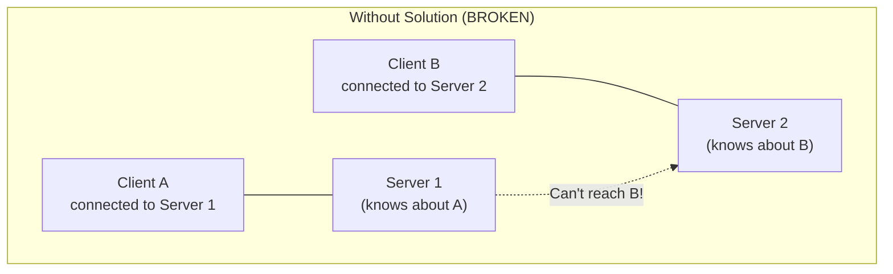
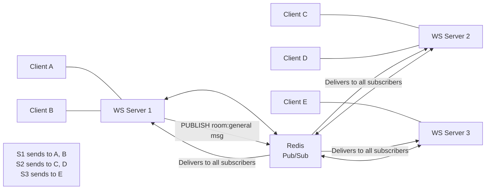

# WebSockets Deep Dive

WebSockets solve a specific problem: HTTP is request-response — the server cannot send data unless the client asks first. For real-time applications (chat, live dashboards, collaborative editing, trading feeds, online games), polling is wasteful and long-polling is a hack. WebSockets provide a genuine full-duplex persistent channel where either side can send data at any time.

WebSockets are deceptively simple to use (a few API calls in JavaScript) but surprisingly complex to operate at scale. The stateful, persistent nature of WebSocket connections breaks almost every assumption made by horizontally-scaled HTTP infrastructure.

## Why WebSockets Exist: The Polling Problem

Before WebSockets (standardized in 2011, RFC 6455), real-time web applications used one of three techniques:

### Short Polling

```
Client: GET /messages?since=1234567890
Server: 200 OK []  (no new messages)
(wait 1 second)
Client: GET /messages?since=1234567890
Server: 200 OK []
(wait 1 second)
...
```

100 clients polling every second = 100 HTTP requests/second, most returning empty responses. High server load, high latency (up to 1s delay), high bandwidth waste.

### Long Polling (Comet)

```
Client: GET /messages?since=1234567890 (request hangs open)
Server: (holds connection, waiting for data)
        ...30 seconds later...
Server: 200 OK [new message data]
Client: immediately opens another long-poll request
```

Better latency, but each client holds a server thread/goroutine. 10,000 clients = 10,000 threads. Also complex: need to handle timeouts, reconnection, message ordering, duplicate delivery.

### Server-Sent Events (SSE)

A streaming HTTP response where the server sends events as they occur. Server-to-client only. Simpler than WebSockets for one-directional push. (More on SSE vs WebSocket below.)

### WebSocket: The Upgrade

WebSockets start as HTTP/1.1 and upgrade to the WebSocket protocol on the same TCP connection. No new ports needed, works through existing infrastructure (with caveats).

## The WebSocket Handshake

WebSocket connections begin with an HTTP/1.1 upgrade request:

```
GET /chat HTTP/1.1
Host: server.example.com
Upgrade: websocket
Connection: Upgrade
Sec-WebSocket-Key: dGhlIHNhbXBsZSBub25jZQ==
Sec-WebSocket-Version: 13
Sec-WebSocket-Protocol: chat, superchat
Sec-WebSocket-Extensions: permessage-deflate; client_max_window_bits
Origin: http://example.com
```

Server response (101 Switching Protocols):

```
HTTP/1.1 101 Switching Protocols
Upgrade: websocket
Connection: Upgrade
Sec-WebSocket-Accept: s3pPLMBiTxaQ9kYGzzhZRbK+xOo=
Sec-WebSocket-Protocol: chat
Sec-WebSocket-Extensions: permessage-deflate
```

### The Sec-WebSocket-Accept Calculation

The `Sec-WebSocket-Accept` header proves the server understood the WebSocket handshake (not just reflecting an HTTP response). It is calculated as:

$$Accept = \text{base64}(\text{SHA-1}(Key + \text{"258EAFA5-E914-47DA-95CA-C5AB0DC85B11"}))$$

The GUID `258EAFA5-E914-47DA-95CA-C5AB0DC85B11` is a magic constant defined in RFC 6455. Concatenating it with the client's key and hashing prevents proxies that don't understand WebSockets from accidentally accepting the upgrade.

```typescript
import crypto from 'crypto';

function computeAcceptKey(clientKey: string): string {
  const WEBSOCKET_GUID = '258EAFA5-E914-47DA-95CA-C5AB0DC85B11';
  return crypto
    .createHash('sha1')
    .update(clientKey + WEBSOCKET_GUID)
    .digest('base64');
}
```

After the 101 response, the TCP connection is handed over to the WebSocket protocol. HTTP is no longer used on this connection.

## The WebSocket Frame Format

Every WebSocket message is transmitted as one or more **frames**. The frame format:

```
 0                   1                   2                   3
 0 1 2 3 4 5 6 7 8 9 0 1 2 3 4 5 6 7 8 9 0 1 2 3 4 5 6 7 8 9 0 1
+-+-+-+-+-------+-+-------------+-------------------------------+
|F|R|R|R| opcode|M| Payload len |    Extended payload length    |
|I|S|S|S|  (4)  |A|     (7)     |             (16/64)           |
|N|V|V|V|       |S|             |   (if payload len==126/127)   |
| |1|2|3|       |K|             |                               |
+-+-+-+-+-------+-+-------------+ - - - - - - - - - - - - - - - +
|     Extended payload length continued, if payload len == 127  |
+ - - - - - - - - - - - - - - -+-------------------------------+
|                               |Masking-key, if MASK set to 1  |
+-------------------------------+-------------------------------+
| Masking-key (continued)       |          Payload Data         |
+-------------------------------- - - - - - - - - - - - - - - - +
:                     Payload Data continued ...                 :
+ - - - - - - - - - - - - - - - - - - - - - - - - - - - - - - - +
|                     Payload Data continued ...                 |
+---------------------------------------------------------------+
```

### Frame Fields

**FIN (1 bit):** Final fragment flag. If 0, this frame is a fragment and more frames follow for this message. If 1, this is the final (or only) frame of the message.

**RSV1/RSV2/RSV3 (1 bit each):** Reserved; must be 0 unless negotiated by an extension. The `permessage-deflate` extension uses RSV1 to indicate compressed messages.

**Opcode (4 bits):**

| Opcode | Hex | Meaning |
|--------|-----|---------|
| 0 | 0x0 | Continuation frame |
| 1 | 0x1 | Text frame (UTF-8) |
| 2 | 0x2 | Binary frame |
| 3–7 | — | Reserved (data frames) |
| 8 | 0x8 | Connection close |
| 9 | 0x9 | Ping |
| 10 | 0xA | Pong |
| 11–15 | — | Reserved (control frames) |

**MASK (1 bit):** All frames from client to server **must** be masked. Frames from server to client **must not** be masked. This requirement prevents cache poisoning attacks against transparent proxies.

**Payload length (7 bits + optional extensions):**
- 0–125: payload length is this value
- 126: next 2 bytes are payload length (uint16, 16-bit)
- 127: next 8 bytes are payload length (uint64, 64-bit)

**Masking key (32 bits, if MASK=1):** Random 4-byte value. Each byte of payload is XORed with the corresponding byte of the masking key (cycling):

$$\text{masked}[i] = \text{payload}[i] \oplus \text{key}[i \bmod 4]$$

**Minimum frame overhead:** 2 bytes (for payload ≤ 125 bytes, no mask). Maximum overhead: 14 bytes (8-byte extended length + 4-byte mask + 2-byte header).

### Control Frames

Control frames (Close, Ping, Pong) must not be fragmented and cannot exceed 125 bytes of payload.

**Ping/Pong:** Either side can send a Ping (opcode 0x9); the receiver must respond with a Pong (opcode 0xA) containing the same payload. This is the WebSocket keepalive mechanism.

**Close frame:** Either side initiates close by sending a Close frame. The close frame payload is:
- Bytes 0–1: status code (uint16, big-endian)
- Bytes 2+: UTF-8 reason string (optional)

After sending Close, the sender must not send more data frames. After receiving Close, the receiver sends its own Close frame and closes the TCP connection.

Common close codes:

| Code | Meaning |
|------|---------|
| 1000 | Normal closure |
| 1001 | Going away (server shutdown, browser navigating away) |
| 1002 | Protocol error |
| 1003 | Unsupported data type |
| 1006 | Abnormal closure (no Close frame received) |
| 1007 | Invalid data (non-UTF-8 in text frame) |
| 1008 | Policy violation |
| 1009 | Message too large |
| 1011 | Internal server error |
| 4000–4999 | Application-defined codes |

## Production WebSocket Server (Node.js)

```typescript
import { WebSocketServer, WebSocket, RawData } from 'ws';
import * as http from 'http';
import * as url from 'url';
import { EventEmitter } from 'events';

interface ClientState {
  id: string;
  ws: WebSocket;
  userId: string;
  rooms: Set<string>;
  lastPong: number;
  messagesSent: number;
  messagesReceived: number;
  connectedAt: Date;
  ipAddress: string;
}

interface Message {
  type: 'message' | 'join' | 'leave' | 'ping' | 'error';
  roomId?: string;
  payload?: unknown;
  timestamp: number;
}

class WebSocketManager extends EventEmitter {
  private readonly clients = new Map<string, ClientState>();
  private readonly rooms = new Map<string, Set<string>>(); // roomId → Set<clientId>
  private pingTimer: ReturnType<typeof setInterval> | null = null;
  private readonly wss: WebSocketServer;

  constructor(server: http.Server) {
    super();

    this.wss = new WebSocketServer({
      server,
      // Don't use path; handle routing manually
      perMessageDeflate: {
        // Enable per-message deflate compression
        zlibDeflateOptions: { chunkSize: 1024, memLevel: 7, level: 3 },
        zlibInflateOptions: { chunkSize: 10 * 1024 },
        clientNoContextTakeover: true,  // Limit memory usage
        serverNoContextTakeover: true,
        serverMaxWindowBits: 10,
        concurrencyLimit: 10,
        threshold: 1024,  // Only compress messages > 1KB
      },
      // Rate limiting: max pending connections
      backlog: 100,
      // Maximum message size (protects against memory attacks)
      maxPayload: 1024 * 1024,  // 1MB
    });

    this.wss.on('connection', this.handleConnection.bind(this));
    this.wss.on('error', (err) => this.emit('error', err));

    // Start ping/pong heartbeat
    this.startHeartbeat();
  }

  private async handleConnection(ws: WebSocket, req: http.IncomingMessage): Promise<void> {
    // 1. Origin validation
    const origin = req.headers.origin;
    if (!this.isAllowedOrigin(origin)) {
      ws.close(1008, 'Forbidden origin');
      return;
    }

    // 2. Parse and validate auth token
    const parsedUrl = url.parse(req.url ?? '', true);
    // Don't put tokens in URL params in production (logged, cached)
    // Better: accept token in first message or from cookie
    const cookie = req.headers.cookie;
    const token = this.extractTokenFromCookie(cookie ?? '');

    if (!token) {
      ws.close(1008, 'Authentication required');
      return;
    }

    let userId: string;
    try {
      userId = await this.validateToken(token);
    } catch {
      ws.close(1008, 'Invalid token');
      return;
    }

    // 3. Rate limiting: max connections per user
    const userConnections = [...this.clients.values()].filter(c => c.userId === userId);
    if (userConnections.length >= 5) {
      ws.close(1008, 'Too many connections');
      return;
    }

    // 4. Register client
    const clientId = crypto.randomUUID();
    const clientState: ClientState = {
      id: clientId,
      ws,
      userId,
      rooms: new Set(),
      lastPong: Date.now(),
      messagesSent: 0,
      messagesReceived: 0,
      connectedAt: new Date(),
      ipAddress: req.socket.remoteAddress ?? 'unknown',
    };

    this.clients.set(clientId, clientState);

    console.log({
      event: 'ws_connect',
      clientId,
      userId,
      totalClients: this.clients.size,
    });

    // 5. Set up event handlers
    ws.on('message', (data: RawData, isBinary: boolean) =>
      this.handleMessage(clientId, data, isBinary)
    );

    ws.on('pong', () => {
      const client = this.clients.get(clientId);
      if (client) client.lastPong = Date.now();
    });

    ws.on('close', (code: number, reason: Buffer) =>
      this.handleClose(clientId, code, reason.toString())
    );

    ws.on('error', (err: Error) => {
      console.error({ event: 'ws_error', clientId, error: err.message });
    });

    // 6. Send welcome message
    this.sendToClient(clientId, {
      type: 'message',
      payload: { status: 'connected', clientId },
      timestamp: Date.now(),
    });
  }

  private handleMessage(clientId: string, data: RawData, isBinary: boolean): void {
    const client = this.clients.get(clientId);
    if (!client) return;

    client.messagesReceived++;

    // Rate limiting: max messages per second (simple token bucket)
    // In production, use a proper rate limiter (sliding window in Redis)

    let message: Message;
    try {
      if (isBinary) {
        // Handle binary protocol (e.g., msgpack)
        throw new Error('Binary messages not supported');
      }
      message = JSON.parse(data.toString()) as Message;
    } catch {
      this.sendToClient(clientId, {
        type: 'error',
        payload: { code: 'INVALID_JSON', message: 'Invalid message format' },
        timestamp: Date.now(),
      });
      return;
    }

    switch (message.type) {
      case 'join':
        if (message.roomId) this.joinRoom(clientId, message.roomId);
        break;
      case 'leave':
        if (message.roomId) this.leaveRoom(clientId, message.roomId);
        break;
      case 'message':
        if (message.roomId) this.broadcastToRoom(message.roomId, message, clientId);
        break;
      case 'ping':
        this.sendToClient(clientId, { type: 'ping', timestamp: Date.now() });
        break;
      default:
        this.sendToClient(clientId, {
          type: 'error',
          payload: { code: 'UNKNOWN_TYPE', message: `Unknown message type: ${message.type}` },
          timestamp: Date.now(),
        });
    }
  }

  private handleClose(clientId: string, code: number, reason: string): void {
    const client = this.clients.get(clientId);
    if (!client) return;

    // Remove from all rooms
    for (const roomId of client.rooms) {
      this.leaveRoom(clientId, roomId);
    }

    this.clients.delete(clientId);

    console.log({
      event: 'ws_disconnect',
      clientId,
      userId: client.userId,
      code,
      reason,
      totalClients: this.clients.size,
      sessionDurationMs: Date.now() - client.connectedAt.getTime(),
    });
  }

  private joinRoom(clientId: string, roomId: string): void {
    const client = this.clients.get(clientId);
    if (!client) return;

    if (!this.rooms.has(roomId)) {
      this.rooms.set(roomId, new Set());
    }

    this.rooms.get(roomId)!.add(clientId);
    client.rooms.add(roomId);
  }

  private leaveRoom(clientId: string, roomId: string): void {
    const client = this.clients.get(clientId);
    const room = this.rooms.get(roomId);

    if (room) {
      room.delete(clientId);
      if (room.size === 0) this.rooms.delete(roomId);
    }

    client?.rooms.delete(roomId);
  }

  private broadcastToRoom(roomId: string, message: Message, excludeClientId?: string): void {
    const room = this.rooms.get(roomId);
    if (!room) return;

    const data = JSON.stringify(message);

    for (const clientId of room) {
      if (clientId === excludeClientId) continue;
      const client = this.clients.get(clientId);
      if (client?.ws.readyState === WebSocket.OPEN) {
        client.ws.send(data, { binary: false }, (err) => {
          if (err) console.error({ event: 'ws_send_error', clientId, error: err.message });
        });
      }
    }
  }

  private sendToClient(clientId: string, message: Message): boolean {
    const client = this.clients.get(clientId);
    if (!client || client.ws.readyState !== WebSocket.OPEN) return false;

    client.ws.send(JSON.stringify(message));
    client.messagesSent++;
    return true;
  }

  private startHeartbeat(): void {
    this.pingTimer = setInterval(() => {
      const now = Date.now();
      const timeout = 30_000;  // 30 second pong timeout

      for (const [clientId, client] of this.clients) {
        if (now - client.lastPong > timeout) {
          console.warn({ event: 'ws_timeout', clientId, lastPong: client.lastPong });
          client.ws.terminate();  // Force close without waiting for Close frame
          continue;
        }

        if (client.ws.readyState === WebSocket.OPEN) {
          client.ws.ping();  // Send ping; expect pong within timeout interval
        }
      }
    }, 15_000);  // Ping every 15s; timeout after 30s (2 missed pings)
  }

  private isAllowedOrigin(origin: string | undefined): boolean {
    const allowed = new Set([
      'https://app.example.com',
      'https://www.example.com',
      // Development
      'http://localhost:3000',
    ]);
    return origin ? allowed.has(origin) : false;
  }

  private extractTokenFromCookie(cookieHeader: string): string | null {
    // Parse "session=abc123; other=value" → abc123
    const match = cookieHeader.match(/\bsession=([^;]+)/);
    return match?.[1] ?? null;
  }

  private async validateToken(token: string): Promise<string> {
    // Validate JWT or session token, return userId
    // throw if invalid
    return verifyJWT(token);
  }

  async shutdown(timeoutMs = 30_000): Promise<void> {
    if (this.pingTimer) clearInterval(this.pingTimer);

    // Notify all clients of shutdown
    const closePromises: Promise<void>[] = [];

    for (const [clientId, client] of this.clients) {
      const p = new Promise<void>((resolve) => {
        client.ws.once('close', resolve);
        client.ws.close(1001, 'Server shutting down');
        // Force close after 5s if client doesn't respond
        setTimeout(() => { client.ws.terminate(); resolve(); }, 5_000);
      });
      closePromises.push(p);
    }

    const timeout = new Promise<void>((resolve) => setTimeout(resolve, timeoutMs));
    await Promise.race([Promise.all(closePromises), timeout]);

    this.wss.close();
  }

  get stats() {
    return {
      totalClients: this.clients.size,
      totalRooms: this.rooms.size,
      clientsByRoom: Object.fromEntries(
        [...this.rooms.entries()].map(([roomId, clients]) => [roomId, clients.size])
      ),
    };
  }
}

// Stub implementations
declare function verifyJWT(token: string): Promise<string>;
declare const crypto: { randomUUID(): string };
```

## Client-Side Reconnection with Exponential Backoff

```typescript
class ReconnectingWebSocket extends EventEmitter {
  private ws: WebSocket | null = null;
  private reconnectAttempts = 0;
  private reconnectTimer: ReturnType<typeof setTimeout> | null = null;
  private intentionallyClosed = false;
  private readonly messageQueue: string[] = [];

  constructor(
    private readonly url: string,
    private readonly options: {
      maxReconnectAttempts?: number;
      baseDelay?: number;
      maxDelay?: number;
      jitterFactor?: number;
    } = {}
  ) {
    super();
    this.connect();
  }

  private connect(): void {
    if (this.intentionallyClosed) return;

    this.ws = new WebSocket(this.url);

    this.ws.addEventListener('open', () => {
      console.log('WebSocket connected');
      this.reconnectAttempts = 0;
      this.emit('open');

      // Flush queued messages
      const queued = this.messageQueue.splice(0);
      for (const msg of queued) {
        this.ws?.send(msg);
      }
    });

    this.ws.addEventListener('message', (event) => {
      this.emit('message', event.data);
    });

    this.ws.addEventListener('close', (event) => {
      this.emit('close', event.code, event.reason);
      if (!this.intentionallyClosed) {
        this.scheduleReconnect();
      }
    });

    this.ws.addEventListener('error', (event) => {
      this.emit('error', event);
      // 'close' event will fire after 'error'; let that handle reconnect
    });
  }

  private scheduleReconnect(): void {
    const {
      maxReconnectAttempts = Infinity,
      baseDelay = 1000,
      maxDelay = 30_000,
      jitterFactor = 0.3,
    } = this.options;

    if (this.reconnectAttempts >= maxReconnectAttempts) {
      this.emit('reconnect_failed');
      return;
    }

    // Exponential backoff: baseDelay * 2^attempts, capped at maxDelay
    const exponentialDelay = Math.min(baseDelay * 2 ** this.reconnectAttempts, maxDelay);

    // Add jitter: ±jitterFactor of the delay, to prevent thundering herd
    const jitter = exponentialDelay * jitterFactor * (Math.random() * 2 - 1);
    const delay = Math.max(0, exponentialDelay + jitter);

    console.log(
      `WebSocket reconnecting in ${delay.toFixed(0)}ms ` +
      `(attempt ${this.reconnectAttempts + 1}/${maxReconnectAttempts === Infinity ? '∞' : maxReconnectAttempts})`
    );

    this.reconnectTimer = setTimeout(() => {
      this.reconnectAttempts++;
      this.connect();
    }, delay);
  }

  send(data: string | ArrayBuffer | Blob): void {
    if (this.ws?.readyState === WebSocket.OPEN) {
      this.ws.send(data);
    } else {
      // Queue messages while disconnected (bounded queue)
      if (typeof data === 'string' && this.messageQueue.length < 100) {
        this.messageQueue.push(data);
      }
    }
  }

  close(code?: number, reason?: string): void {
    this.intentionallyClosed = true;
    if (this.reconnectTimer) clearTimeout(this.reconnectTimer);
    this.ws?.close(code, reason);
  }

  get readyState(): number {
    return this.ws?.readyState ?? WebSocket.CLOSED;
  }
}

// Usage
const ws = new ReconnectingWebSocket('wss://api.example.com/ws', {
  maxReconnectAttempts: 10,
  baseDelay: 1000,      // Start with 1s
  maxDelay: 30_000,     // Cap at 30s
  jitterFactor: 0.3,    // ±30% jitter
});

ws.on('open', () => ws.send(JSON.stringify({ type: 'join', roomId: 'general' })));
ws.on('message', (data) => console.log('Received:', data));
ws.on('reconnect_failed', () => console.error('Could not reconnect after max attempts'));
```

## Scaling WebSockets: The Fundamental Challenge

A single Node.js process can handle 50,000–100,000 concurrent WebSocket connections (limited by memory: ~50KB per connection including buffers). For applications needing more, or for resilience, multiple servers are needed.

### The Problem: Connection State is Local

When client A connects to Server 1 and client B connects to Server 2, Server 1 cannot broadcast to Server 2's clients — they're in different process memories.



### Solution 1: Sticky Sessions (Limited)

Route each client to the same server for all requests using a load balancer cookie or IP hash:

```nginx
upstream websocket {
    ip_hash;  # Same client IP → same server
    server ws1.example.com:8080;
    server ws2.example.com:8080;
}
```

**Problems:**
- Doesn't help with server-to-server communication (A on Server 1 still can't message B on Server 2)
- Uneven load distribution (one IP may have many clients)
- Server restart = all connections to that server must reconnect
- No help for global fan-out (broadcasting to all connected clients)

### Solution 2: Redis Pub/Sub (The Standard Approach)

Each WebSocket server subscribes to Redis channels. When a server needs to broadcast, it publishes to Redis. Redis delivers to all subscribers:



```typescript
import Redis from 'ioredis';
import { WebSocketServer, WebSocket } from 'ws';

class ScalableWebSocketServer {
  private readonly clients = new Map<string, WebSocket>();
  private readonly clientRooms = new Map<string, Set<string>>();
  private readonly pub: Redis;    // Publishing connection
  private readonly sub: Redis;    // Subscribing connection (separate connection required)
  private readonly serverId: string;

  constructor() {
    this.serverId = `server-${Math.random().toString(36).slice(2, 8)}`;

    // Redis requires separate connections for pub/sub
    this.pub = new Redis({ host: 'redis.internal', port: 6379 });
    this.sub = new Redis({ host: 'redis.internal', port: 6379 });

    this.sub.on('message', this.handleRedisMessage.bind(this));
    this.sub.on('error', (err) => console.error('Redis sub error:', err));
    this.pub.on('error', (err) => console.error('Redis pub error:', err));
  }

  /**
   * Broadcast a message to all clients in a room,
   * whether they're connected to this server or another.
   */
  async broadcastToRoom(roomId: string, message: unknown): Promise<void> {
    const channelKey = `room:${roomId}`;
    const payload = JSON.stringify({
      serverId: this.serverId,
      roomId,
      message,
      timestamp: Date.now(),
    });

    // Publish to Redis — all servers in the cluster receive it
    await this.pub.publish(channelKey, payload);
  }

  /**
   * Subscribe this server instance to a room's channel.
   * Called when the first client on this server joins a room.
   */
  async subscribeToRoom(roomId: string): Promise<void> {
    const channelKey = `room:${roomId}`;
    await this.sub.subscribe(channelKey);
  }

  /**
   * Unsubscribe when no clients on this server are in the room.
   */
  async unsubscribeFromRoom(roomId: string): Promise<void> {
    const channelKey = `room:${roomId}`;
    await this.sub.unsubscribe(channelKey);
  }

  private handleRedisMessage(channel: string, payload: string): void {
    try {
      const { serverId, roomId, message } = JSON.parse(payload);

      // Skip messages we published ourselves (already delivered locally)
      // NOTE: remove this if you want the publisher's clients to also receive
      if (serverId === this.serverId) return;

      // Find local clients subscribed to this room and deliver
      const data = JSON.stringify(message);
      for (const [clientId, ws] of this.clients) {
        if (this.clientRooms.get(clientId)?.has(roomId) && ws.readyState === WebSocket.OPEN) {
          ws.send(data);
        }
      }
    } catch (err) {
      console.error('Failed to process Redis message:', err);
    }
  }

  addClient(clientId: string, ws: WebSocket): void {
    this.clients.set(clientId, ws);
    this.clientRooms.set(clientId, new Set());
  }

  removeClient(clientId: string): void {
    const rooms = this.clientRooms.get(clientId) ?? new Set();
    for (const roomId of rooms) {
      this.leaveRoom(clientId, roomId);
    }
    this.clients.delete(clientId);
    this.clientRooms.delete(clientId);
  }

  async joinRoom(clientId: string, roomId: string): Promise<void> {
    const rooms = this.clientRooms.get(clientId);
    if (!rooms) return;

    const isFirstInRoom = ![...this.clientRooms.values()].some(r => r.has(roomId));
    rooms.add(roomId);

    if (isFirstInRoom) {
      await this.subscribeToRoom(roomId);
    }
  }

  leaveRoom(clientId: string, roomId: string): void {
    const rooms = this.clientRooms.get(clientId);
    rooms?.delete(roomId);

    // If no local clients are in this room, unsubscribe from Redis
    const anyoneInRoom = [...this.clientRooms.values()].some(r => r.has(roomId));
    if (!anyoneInRoom) {
      this.sub.unsubscribe(`room:${roomId}`).catch(console.error);
    }
  }
}
```

### Redis Pub/Sub Limitations

- **Fan-out cost:** Broadcasting to 1,000,000 clients via Redis requires each of 10 servers to send to 100,000 local clients. Redis delivers the message 10 times (once per server). Works well up to millions of connections.
- **Redis becomes SPOF:** If Redis goes down, pub/sub stops. Use Redis Sentinel or Redis Cluster for HA.
- **Message ordering:** Pub/sub is best-effort ordering. Use Redis Streams for guaranteed delivery and replay.
- **Not for high-throughput:** Redis pub/sub is not suited for millions of messages/second. Consider Kafka or NATS for extreme throughput.

## WebSocket vs SSE vs Long-Polling

| Feature | WebSocket | Server-Sent Events (SSE) | Long Polling |
|---------|-----------|--------------------------|--------------|
| Direction | Full-duplex | Server → Client only | Server → Client (one at a time) |
| Protocol | Own (WS/WSS) | HTTP | HTTP |
| Browser support | Universal | Universal (except IE) | Universal |
| Automatic reconnect | No (must implement) | Built-in | Built-in |
| Multiplexing (HTTP/2) | No | Yes | No |
| Binary data | Yes | No (text only) | Depends |
| Firewall/proxy friendly | Moderate | Yes | Yes |
| Header overhead | Low (2-14 bytes/frame) | Medium (HTTP overhead per message) | High (full HTTP per response) |

**When to use WebSockets:**
- Bidirectional communication (chat, gaming, collaborative tools)
- Very high message rates (trading feeds, telemetry)
- Binary protocol (custom binary messages)

**When to use SSE:**
- Server-to-client only (dashboards, notifications, live updates)
- Better firewall traversal is needed
- Automatic reconnection is desired without custom code
- Running behind HTTP/2 (SSE multiplexes naturally)

**When to use Long-Polling:**
- Legacy environment constraints
- SSE is not supported
- Simplest possible implementation

## Socket.IO vs Raw WebSockets

Socket.IO adds a layer on top of WebSockets with:
- **Transport fallbacks:** falls back to long-polling if WebSockets aren't available
- **Rooms and namespaces:** built-in room management
- **Automatic reconnection:** with exponential backoff
- **Message acknowledgments:** request-response over WebSocket
- **Broadcasting helpers:** to rooms, all except sender, etc.

**When to use Socket.IO:**
- You need automatic fallback for restrictive corporate networks
- You want built-in rooms without implementing them yourself
- The convenience features outweigh the ~60KB bundle overhead

**When to use raw WebSockets:**
- You control the client environment (mobile apps, internal tools)
- Bundle size matters (60KB+ for Socket.IO)
- You want to understand and control exactly what's on the wire
- High performance is required (Socket.IO adds overhead per message)
- You're using a non-JavaScript client (Socket.IO protocol is specific to Socket.IO)

::: info War Story
**WebSocket connection leak that brought down a production chat server**

A chat application using Node.js and `ws` was serving 15,000 concurrent users. Engineers noticed memory increasing by ~200MB/hour with no apparent cause. Heap snapshots showed WebSocket objects being retained.

The bug: the shutdown handler for graceful restart was:
```typescript
server.on('SIGTERM', () => {
  wsServer.close(() => process.exit(0));
});
```

`wsServer.close()` stops accepting new connections but does NOT terminate existing connections. The server waited for existing connections to close naturally — which they never did, because clients kept pinging. `process.exit(0)` was never called.

The new deploy process created a new process alongside the old one. The old process kept running, holding all 15,000 connections. New connections went to the new process. After 20 minutes, two processes were running: one old (15K connections, growing memory) and one new. After 3 hours: 15 processes, each with growing memory. OOM killer triggered, all processes died simultaneously, 100% of users disconnected.

The fix:
```typescript
process.on('SIGTERM', async () => {
  // 1. Stop accepting new connections
  wsServer.close();
  // 2. Actively terminate all clients
  for (const client of wsServer.clients) {
    client.close(1001, 'Server shutting down');
  }
  // 3. Force kill after 30s grace period
  setTimeout(() => process.exit(0), 30_000);
  // 4. Exit cleanly when all connections close
  wsServer.on('close', () => process.exit(0));
});
```

The deeper lesson: production WebSocket servers need explicit connection draining logic. Graceful shutdown is not automatic.
:::

## Security Considerations

### Origin Validation

WebSocket connections bypass CORS (since the WebSocket protocol does not use the CORS preflight). Validate the `Origin` header in the HTTP upgrade request server-side — do not rely on the browser to enforce it.

```typescript
wss.on('connection', (ws, req) => {
  const origin = req.headers.origin;
  const allowedOrigins = new Set(['https://app.example.com']);

  if (!origin || !allowedOrigins.has(origin)) {
    ws.close(1008, 'Invalid origin');
    return;
  }
});
```

### Authentication

Three patterns for WebSocket authentication:

**1. Cookie (Best for browser apps):** Include the session cookie in the HTTP upgrade request. Same-Site cookie attributes apply. CSRF is mitigated by origin validation.

**2. First message token:** Connect unauthenticated, then send auth token as the first WebSocket message. Reject the connection if auth fails within 5 seconds.

**3. URL parameter (Avoid):** `wss://api.example.com/ws?token=abc`. Tokens in URLs are logged by web servers, CDNs, and proxies, and appear in browser history. Never use for production.

### Rate Limiting

```typescript
class RateLimiter {
  private readonly windows = new Map<string, number[]>();

  isAllowed(clientId: string, maxMessages: number, windowMs: number): boolean {
    const now = Date.now();
    const windowStart = now - windowMs;

    let timestamps = this.windows.get(clientId) ?? [];
    // Remove old timestamps
    timestamps = timestamps.filter(t => t > windowStart);
    timestamps.push(now);
    this.windows.set(clientId, timestamps);

    return timestamps.length <= maxMessages;
  }
}

const rateLimiter = new RateLimiter();

ws.on('message', (data) => {
  if (!rateLimiter.isAllowed(clientId, 10, 1000)) {  // 10 messages/second
    ws.close(1008, 'Rate limit exceeded');
    return;
  }
  // Process message
});
```

---

**Next:** [DNS Deep Dive](./dns-deep-dive) — how names are resolved to addresses, DNS record types, caching, and debugging.
