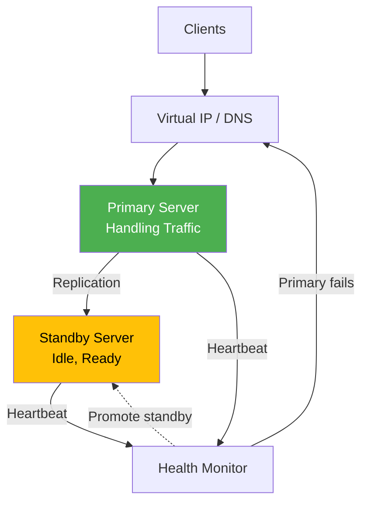
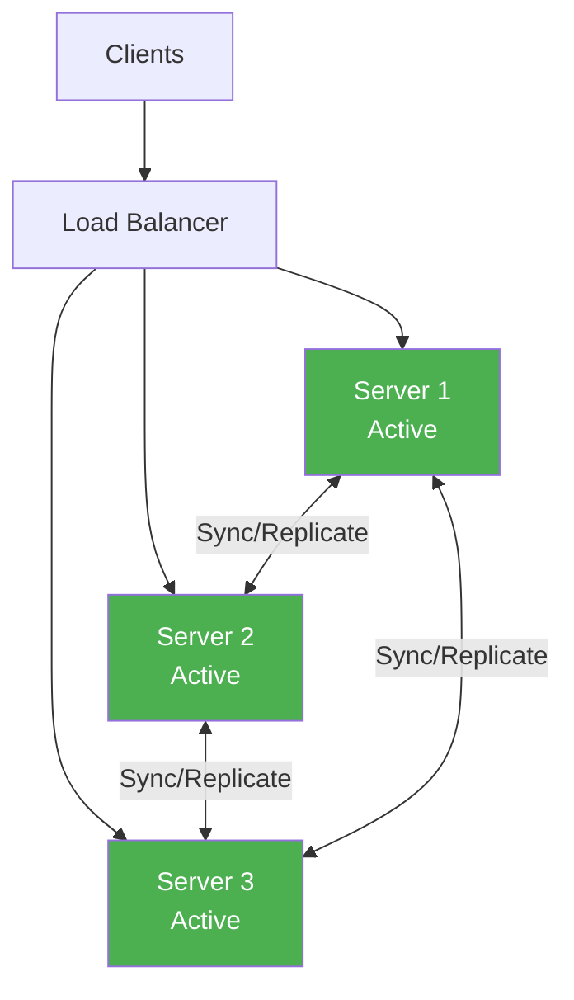
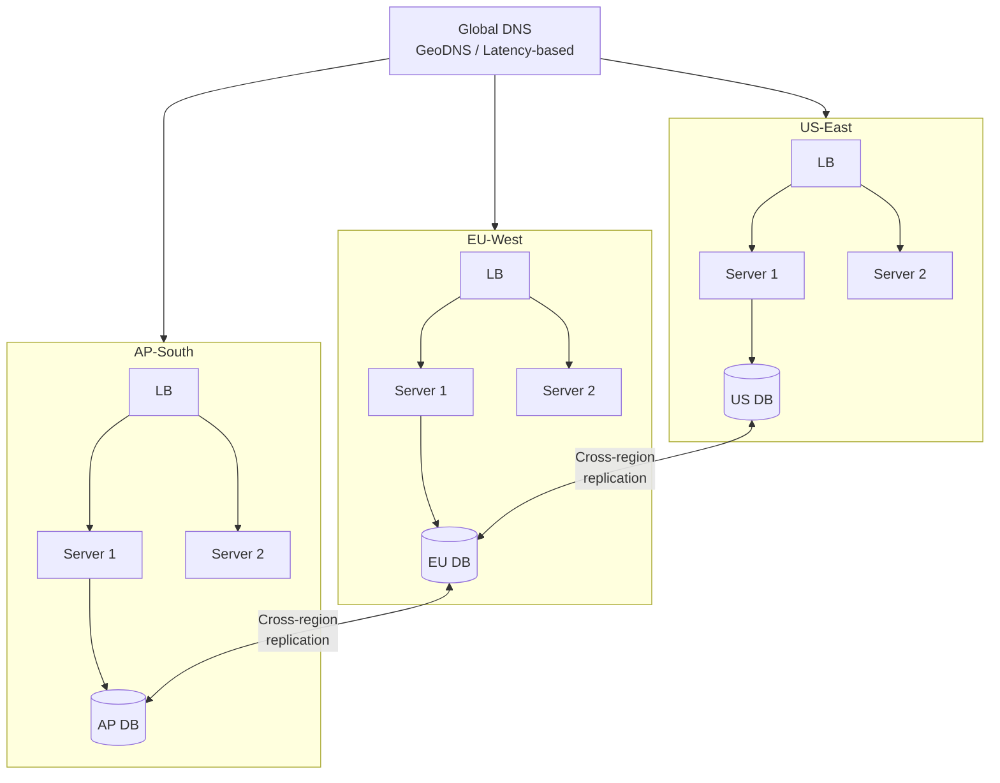
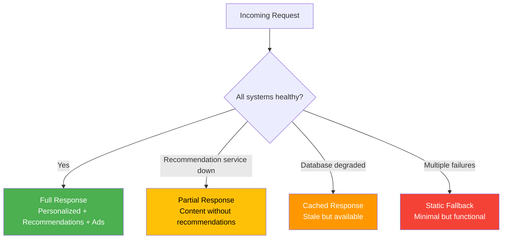
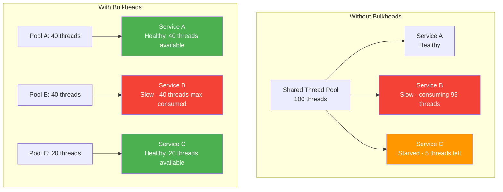
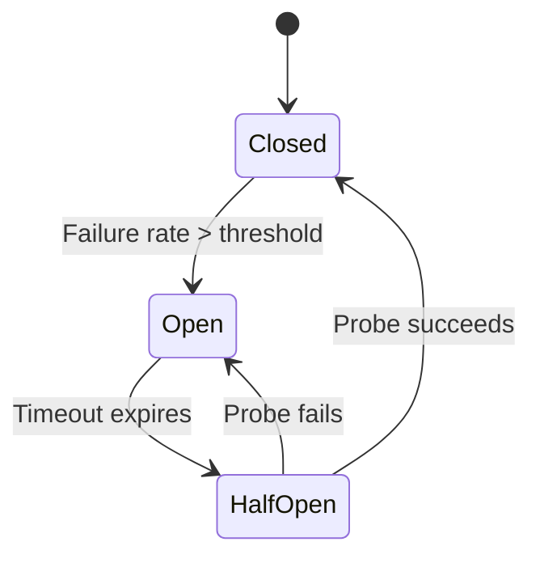

# Availability Patterns

Availability measures the percentage of time a system is operational and accessible. Five nines (99.999%) sounds impressive until you calculate it — that is 5.26 minutes of total downtime per year. Every extra nine costs exponentially more money and engineering effort. The patterns on this page are how you buy those nines.

Availability is not about preventing failures. Hardware fails. Networks partition. Software has bugs. Availability is about ensuring failures do not become outages. The difference between a system that is 99% available and one that is 99.99% is not better hardware — it is better patterns.

## Availability Math

Before diving into patterns, understand the math that drives decisions.

| Availability | Downtime/Year | Downtime/Month | Downtime/Week |
|-------------|---------------|----------------|---------------|
| 99% (two nines) | 3.65 days | 7.31 hours | 1.68 hours |
| 99.9% (three nines) | 8.77 hours | 43.83 min | 10.08 min |
| 99.99% (four nines) | 52.6 min | 4.38 min | 1.01 min |
| 99.999% (five nines) | 5.26 min | 26.3 sec | 6.05 sec |

**Serial dependencies reduce availability:** If Service A (99.9%) calls Service B (99.9%), the combined availability is 99.9% x 99.9% = 99.8%. Add more services in a chain and availability drops fast.

**Parallel redundancy increases availability:** If you have two independent instances, each at 99%, the system availability is 1 - (1 - 0.99)^2 = 99.99%. Redundancy is how you buy nines.

```python
def serial_availability(*components: float) -> float:
    """Combined availability of components in series (all must work)."""
    result = 1.0
    for a in components:
        result *= a
    return result


def parallel_availability(*components: float) -> float:
    """Combined availability of components in parallel (any must work)."""
    failure_prob = 1.0
    for a in components:
        failure_prob *= (1 - a)
    return 1 - failure_prob


# Example: Three 99.9% services in series
serial = serial_availability(0.999, 0.999, 0.999)
print(f"Serial: {serial:.4%}")  # 99.7003% — worse than any single component

# Example: Two 99.9% instances in parallel
parallel = parallel_availability(0.999, 0.999)
print(f"Parallel: {parallel:.6%}")  # 99.999900% — better than either alone
```

## Failover Patterns

Failover is the process of switching to a standby component when the primary fails.

### Active-Passive (Hot Standby)

One server handles all traffic. A standby server is ready to take over if the primary fails. The standby receives replicated data but does not serve traffic.



**How failover happens:**
1. Health monitor detects primary is unresponsive (missed heartbeats)
2. Monitor promotes standby to primary (VIP/DNS switch)
3. Standby starts serving traffic
4. Recovery time: seconds to minutes depending on implementation

**Trade-offs:**
- Simple to understand and implement
- Standby wastes resources (paying for idle capacity)
- Data loss possible if replication is asynchronous (last few writes may be lost)
- Failover is not instant — there is a detection window + promotion time

### Active-Active

All servers handle traffic simultaneously. If one fails, the others absorb its load. No idle resources.



**Trade-offs:**
- No wasted capacity — all servers are productive
- Higher throughput (N servers serving traffic, not N-1)
- Conflict resolution needed (two servers modify the same data)
- More complex to implement correctly
- Split-brain risk if network partitions

| Aspect | Active-Passive | Active-Active |
|--------|---------------|---------------|
| Resource utilization | 50% (standby idle) | 100% |
| Failover time | Seconds to minutes | Immediate (LB routes around) |
| Complexity | Lower | Higher |
| Data conflicts | None (single writer) | Must handle conflicts |
| Cost efficiency | Lower | Higher |
| Best for | Databases, stateful services | Stateless app servers, CDNs |

### Multi-Region Active-Active

For global availability, run active instances in multiple regions.



## Health Checks

Health checks are the foundation of automated failover. Without them, you cannot detect failures.

### Health Check Types

```python
from dataclasses import dataclass
from enum import Enum
from datetime import datetime
from typing import Optional


class HealthStatus(Enum):
    HEALTHY = "healthy"
    DEGRADED = "degraded"
    UNHEALTHY = "unhealthy"


@dataclass
class HealthCheckResult:
    status: HealthStatus
    component: str
    latency_ms: float
    message: Optional[str] = None
    checked_at: datetime = None

    def __post_init__(self):
        self.checked_at = self.checked_at or datetime.utcnow()


class HealthChecker:
    """Comprehensive health check implementation."""

    async def liveness_check(self) -> HealthCheckResult:
        """Is the process running? (Kubernetes liveness probe)
        If this fails, the container should be restarted.
        Keep it simple — just confirm the process is not deadlocked."""
        return HealthCheckResult(
            status=HealthStatus.HEALTHY,
            component="process",
            latency_ms=0.1,
            message="Process is alive"
        )

    async def readiness_check(self) -> HealthCheckResult:
        """Can the service handle requests? (Kubernetes readiness probe)
        Check dependencies: DB connection, cache, required services."""
        checks = []

        # Database connectivity
        try:
            start = datetime.utcnow()
            await self.db.execute("SELECT 1")
            latency = (datetime.utcnow() - start).total_seconds() * 1000
            checks.append(HealthCheckResult(
                status=HealthStatus.HEALTHY if latency < 100
                else HealthStatus.DEGRADED,
                component="database",
                latency_ms=latency
            ))
        except Exception as e:
            checks.append(HealthCheckResult(
                status=HealthStatus.UNHEALTHY,
                component="database",
                latency_ms=0,
                message=str(e)
            ))

        # Cache connectivity
        try:
            start = datetime.utcnow()
            await self.cache.ping()
            latency = (datetime.utcnow() - start).total_seconds() * 1000
            checks.append(HealthCheckResult(
                status=HealthStatus.HEALTHY if latency < 10
                else HealthStatus.DEGRADED,
                component="cache",
                latency_ms=latency
            ))
        except Exception as e:
            checks.append(HealthCheckResult(
                status=HealthStatus.UNHEALTHY,
                component="cache",
                latency_ms=0,
                message=str(e)
            ))

        # Aggregate: unhealthy if any critical dependency is down
        if any(c.status == HealthStatus.UNHEALTHY for c in checks):
            overall = HealthStatus.UNHEALTHY
        elif any(c.status == HealthStatus.DEGRADED for c in checks):
            overall = HealthStatus.DEGRADED
        else:
            overall = HealthStatus.HEALTHY

        return HealthCheckResult(
            status=overall,
            component="service",
            latency_ms=max(c.latency_ms for c in checks)
        )
```

### Health Check Patterns

| Pattern | Mechanism | Detection Speed | False Positives |
|---------|-----------|----------------|-----------------|
| TCP check | Connect to port | Fast (ms) | Low |
| HTTP check | GET /health | Fast | Low |
| Deep health | Check all dependencies | Slower (100ms+) | Higher |
| Peer health | Services check each other | Medium | Medium |
| Synthetic transactions | Execute real operations | Slow (seconds) | Very low |

## Graceful Degradation

When a component fails, the system should degrade gracefully — offering reduced functionality rather than complete failure.



```python
class GracefulDegradation:
    """Degrade functionality rather than fail entirely."""

    async def get_product_page(self, product_id: str):
        # Core data — if this fails, we cannot serve the page
        product = await self._get_product(product_id)
        if not product:
            raise NotFoundException(f"Product {product_id} not found")

        # Non-critical enrichments — degrade if unavailable
        recommendations = await self._safe_call(
            self.recommendation_service.get(product_id),
            fallback=[],
            timeout=0.5
        )

        reviews = await self._safe_call(
            self.review_service.get(product_id),
            fallback={"count": 0, "items": [], "degraded": True},
            timeout=1.0
        )

        personalization = await self._safe_call(
            self.personalization_service.get(product_id, self.user_id),
            fallback=None,
            timeout=0.3
        )

        return ProductPage(
            product=product,
            recommendations=recommendations,
            reviews=reviews,
            personalization=personalization
        )

    async def _safe_call(self, coroutine, fallback, timeout: float):
        """Call with timeout and fallback on any failure."""
        try:
            import asyncio
            return await asyncio.wait_for(coroutine, timeout=timeout)
        except Exception:
            return fallback
```

## Bulkhead Isolation

Named after ship bulkheads that contain flooding to one compartment, this pattern isolates failures so they cannot spread.



```go
package bulkhead

import (
	"context"
	"errors"
	"sync"
	"time"
)

var ErrBulkheadFull = errors.New("bulkhead: max concurrent calls reached")

// Bulkhead limits concurrent calls to a downstream service.
type Bulkhead struct {
	name       string
	semaphore  chan struct{}
	maxWait    time.Duration
	mu         sync.Mutex
	active     int
	rejected   int
}

func NewBulkhead(name string, maxConcurrent int, maxWait time.Duration) *Bulkhead {
	return &Bulkhead{
		name:      name,
		semaphore: make(chan struct{}, maxConcurrent),
		maxWait:   maxWait,
	}
}

func (b *Bulkhead) Execute(ctx context.Context, fn func() (interface{}, error)) (interface{}, error) {
	// Try to acquire a slot
	timer := time.NewTimer(b.maxWait)
	defer timer.Stop()

	select {
	case b.semaphore <- struct{}{}:
		// Got a slot
		defer func() { <-b.semaphore }()

		b.mu.Lock()
		b.active++
		b.mu.Unlock()

		defer func() {
			b.mu.Lock()
			b.active--
			b.mu.Unlock()
		}()

		return fn()

	case <-timer.C:
		b.mu.Lock()
		b.rejected++
		b.mu.Unlock()
		return nil, ErrBulkheadFull

	case <-ctx.Done():
		return nil, ctx.Err()
	}
}

func (b *Bulkhead) Stats() (active int, rejected int) {
	b.mu.Lock()
	defer b.mu.Unlock()
	return b.active, b.rejected
}
```

### Bulkhead Strategies

| Strategy | Isolation | Overhead | Best For |
|----------|-----------|----------|----------|
| Thread pool | Per-service thread pool | Higher (thread cost) | JVM-based services |
| Semaphore | Count-based concurrency limit | Low | Non-blocking I/O |
| Process isolation | Separate processes | Highest | Critical isolation |
| Container isolation | Separate containers/pods | Medium | Kubernetes |
| Connection pool | Dedicated DB connections | Medium | Database calls |

## Circuit Breaker Pattern

Circuit breakers prevent cascading failures by stopping calls to a failing dependency. When a service starts failing, the circuit "opens" and calls fail immediately without attempting the network call.

For a complete deep dive into circuit breaker implementation, state machines, and tuning, see our dedicated [Circuit Breaker Pattern](/system-design/distributed-systems/circuit-breaker) page.

The key availability insight: circuit breakers trade partial failure (one feature unavailable) for system stability (everything else keeps working).



## Retry with Exponential Backoff

Retries handle transient failures. Exponential backoff prevents retry storms from overwhelming a recovering service.

```python
import random
import asyncio
from typing import TypeVar, Callable

T = TypeVar("T")


async def retry_with_backoff(
    fn: Callable[..., T],
    max_retries: int = 3,
    base_delay: float = 1.0,
    max_delay: float = 30.0,
    jitter: bool = True,
    retryable_exceptions: tuple = (Exception,)
) -> T:
    """Retry with exponential backoff and optional jitter."""
    last_exception = None

    for attempt in range(max_retries + 1):
        try:
            return await fn()
        except retryable_exceptions as e:
            last_exception = e

            if attempt == max_retries:
                break

            delay = min(base_delay * (2 ** attempt), max_delay)

            if jitter:
                # Full jitter: random between 0 and calculated delay
                delay = random.uniform(0, delay)

            await asyncio.sleep(delay)

    raise last_exception
```

**Jitter is critical.** Without jitter, all clients retry at the exact same time, creating a "thundering herd." With jitter, retries spread out.

| Backoff Type | Delay Pattern | Thundering Herd Risk |
|-------------|---------------|---------------------|
| No backoff | 1s, 1s, 1s | Very high |
| Linear | 1s, 2s, 3s | High |
| Exponential | 1s, 2s, 4s, 8s | Medium |
| Exponential + full jitter | rand(0,1), rand(0,2), rand(0,4) | Low |
| Decorrelated jitter | rand(base, prev*3) | Lowest |

## Load Shedding

When a system is overloaded, it is better to reject some requests quickly than to serve all requests slowly. Load shedding intentionally drops low-priority traffic to maintain service for high-priority traffic.

```python
from enum import IntEnum
from collections import deque
from time import time


class Priority(IntEnum):
    CRITICAL = 0   # Health checks, payments in progress
    HIGH = 1       # Authenticated user actions
    NORMAL = 2     # General API requests
    LOW = 3        # Analytics, batch operations
    BEST_EFFORT = 4  # Prefetch, speculative requests


class LoadShedder:
    """Shed load by priority when approaching capacity."""

    def __init__(self, max_concurrent: int, shed_threshold: float = 0.8):
        self.max_concurrent = max_concurrent
        self.shed_threshold = shed_threshold
        self.current_load = 0
        self.request_times = deque(maxlen=1000)

    def should_accept(self, priority: Priority) -> bool:
        load_ratio = self.current_load / self.max_concurrent

        if load_ratio < self.shed_threshold:
            return True  # Under threshold, accept everything

        # Over threshold: shed by priority
        # Higher load = more aggressive shedding
        if priority == Priority.CRITICAL:
            return True  # Always accept critical
        elif priority == Priority.HIGH:
            return load_ratio < 0.95
        elif priority == Priority.NORMAL:
            return load_ratio < 0.90
        elif priority == Priority.LOW:
            return load_ratio < 0.85
        else:
            return False  # Shed best-effort first
```

## Chaos Engineering

You cannot be confident in your availability patterns unless you test them. Chaos engineering deliberately introduces failures to verify your system handles them correctly.

### Principles

1. **Define "steady state"** — What does normal look like? (latency, error rate, throughput)
2. **Hypothesize** — "If we kill one database replica, latency stays under 200ms"
3. **Introduce failure** — Kill the replica
4. **Observe** — Did the system behave as expected?
5. **Learn** — Fix what broke, add monitoring, improve runbooks

### Common Chaos Experiments

| Experiment | What It Tests | Tools |
|-----------|--------------|-------|
| Kill a server instance | Auto-scaling, load balancing | Chaos Monkey, `kill -9` |
| Inject network latency | Timeout handling, circuit breakers | tc netem, Toxiproxy |
| Fill disk | Log rotation, alerting | dd, stress-ng |
| DNS failure | Fallback, caching | iptables, Chaos Mesh |
| Kill a database primary | Failover, data consistency | Manual, LitmusChaos |
| Corrupt a response | Input validation, error handling | Toxiproxy |
| Region failure | Multi-region failover | AWS Fault Injection Simulator |

### Chaos in Practice

```yaml
# LitmusChaos experiment: kill a pod
apiVersion: litmuschaos.io/v1alpha1
kind: ChaosEngine
metadata:
  name: pod-kill-experiment
spec:
  appinfo:
    appns: production
    applabel: app=payment-service
    appkind: deployment
  chaosServiceAccount: litmus-admin
  experiments:
    - name: pod-delete
      spec:
        components:
          env:
            - name: TOTAL_CHAOS_DURATION
              value: "30"
            - name: CHAOS_INTERVAL
              value: "10"
            - name: FORCE
              value: "false"
```

## Availability Pattern Decision Matrix

| Pattern | Nines It Buys | Cost | Complexity | Start Using At |
|---------|-------------|------|-----------|----------------|
| Health checks | Base requirement | Low | Low | Day 1 |
| Load balancing | 99% -> 99.9% | Low | Low | Day 1 |
| Active-passive failover | 99.9% -> 99.95% | Medium | Medium | 1K+ users |
| Active-active | 99.95% -> 99.99% | High | High | 100K+ users |
| Circuit breakers | Prevents cascading | Low | Medium | Any microservice |
| Bulkhead isolation | Prevents cascading | Low | Medium | 3+ dependencies |
| Graceful degradation | Reduces blast radius | Medium | Medium | Complex features |
| Multi-region | 99.99% -> 99.999% | Very high | Very high | Global product |
| Chaos engineering | Validates everything | Medium | Medium | After patterns are in place |

## Cross-References

- [Circuit Breaker Pattern](/system-design/distributed-systems/circuit-breaker) — full implementation deep dive
- [Health Checks](/system-design/load-balancing/health-checks) — load balancer health check configuration
- [Load Balancing Algorithms](/system-design/load-balancing/algorithms) — distributing traffic across healthy instances
- [CAP Theorem](/system-design/distributed-systems/cap-theorem) — availability vs consistency trade-off
- [Database Replication](/system-design/databases/replication) — replication for failover
- [Consistency Patterns](/system-design/patterns/consistency-patterns) — what you trade for availability

---

*High availability is not a feature you add at the end. It is a property that emerges from patterns applied consistently across every layer of your architecture. Start with health checks and load balancing, add circuit breakers and bulkheads as you grow, and validate everything with chaos engineering.*
