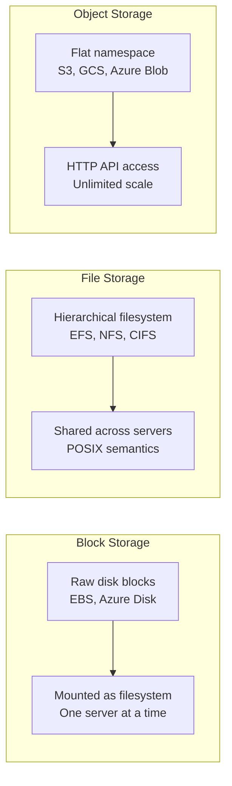
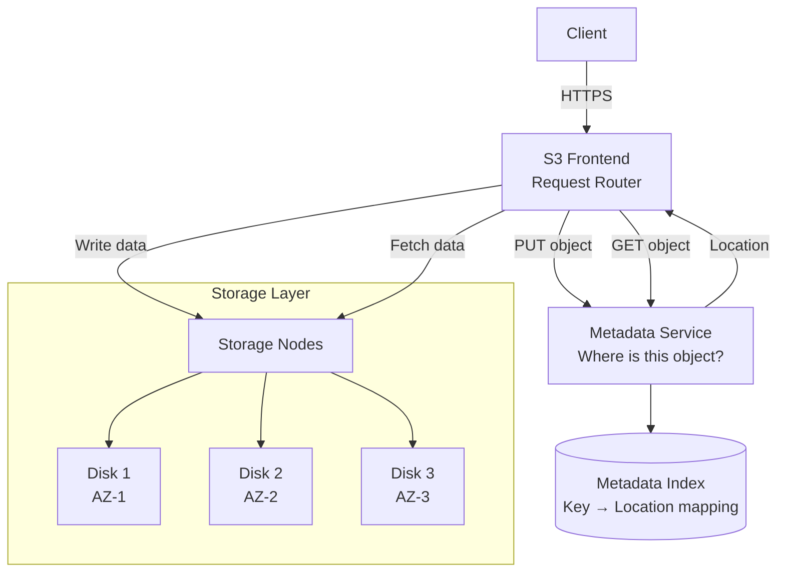
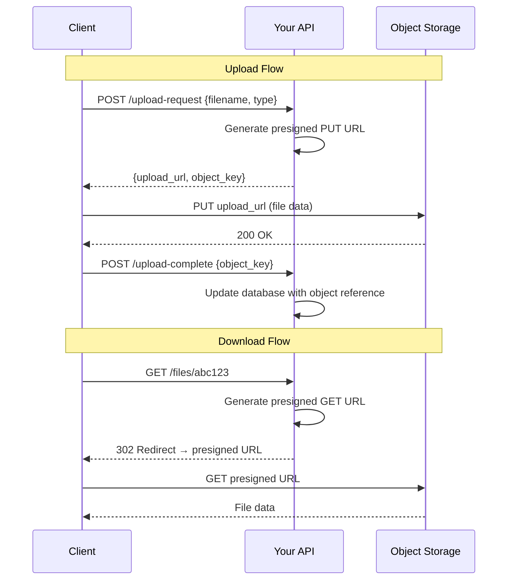
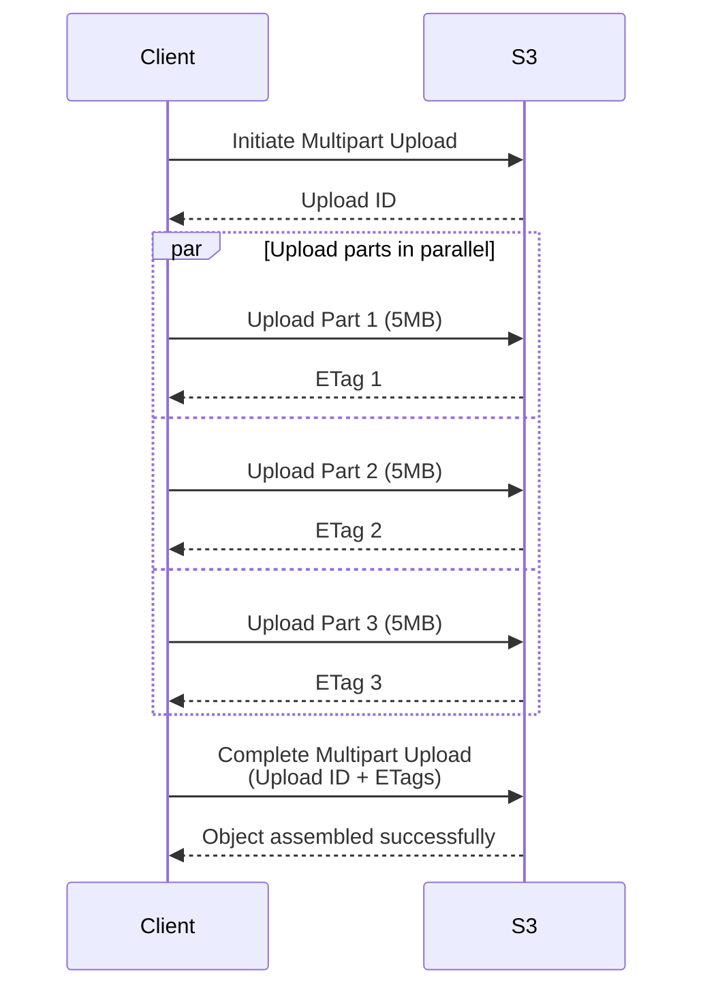
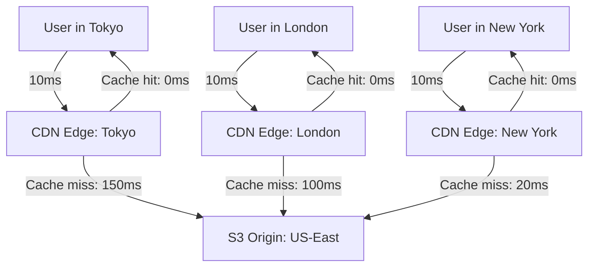
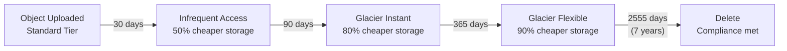
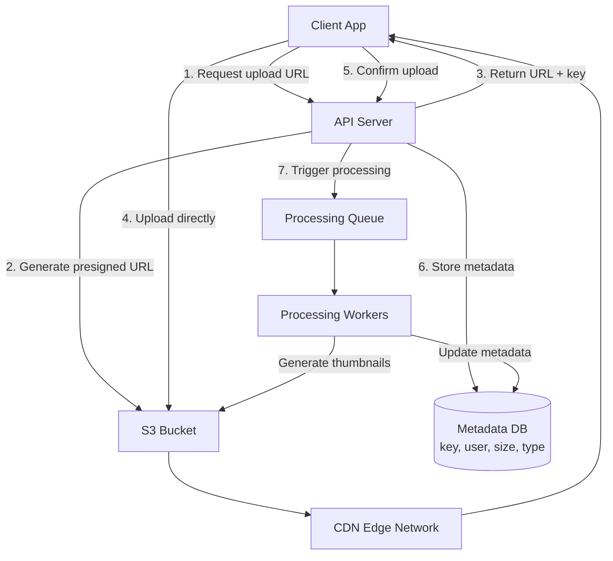

# Blob Storage Design

Binary Large Objects (blobs) — images, videos, documents, backups, logs — make up the vast majority of data in modern systems. A 100,000-user app might have 10 GB of structured data in PostgreSQL but 10 TB of blobs in object storage. Understanding how to design blob storage determines whether your file handling is fast, cheap, and reliable or slow, expensive, and fragile.

## Storage Types Compared

Before jumping to object storage, understand what exists and when each type is appropriate.



| Aspect | Block Storage | File Storage | Object Storage |
|--------|--------------|-------------|----------------|
| Interface | Raw blocks, mount as disk | POSIX filesystem (open/read/write) | HTTP API (PUT/GET) |
| Access | Single server (usually) | Multiple servers (NFS) | Any client with HTTP |
| Modification | In-place updates | In-place updates | Replace entire object |
| Latency | Sub-millisecond | Low milliseconds | 10-100ms |
| Scale | TB per volume | PB (with complexity) | Unlimited |
| Cost | $$ | $$ | $ |
| Metadata | Filesystem metadata | Filesystem metadata | Custom metadata (key-value) |
| Best for | Databases, OS disks | Shared config, legacy apps | Media, backups, logs, any blob |

## S3 Architecture (Simplified)

Amazon S3 is the de facto standard for object storage. Understanding its architecture helps you use it effectively and design similar systems.



### Key S3 Concepts

```python
import boto3
from botocore.config import Config

# S3 is organized into buckets (namespace) and objects (key-value)
s3 = boto3.client('s3', config=Config(
    region_name='us-east-1',
    retries={'max_attempts': 3, 'mode': 'adaptive'}
))

# Bucket: globally unique name, region-specific
# Object: bucket + key = unique address
# Key is a flat string, "/" is just a character (not a real directory)

# Upload an object
s3.put_object(
    Bucket='my-app-media',
    Key='users/user_123/avatar.jpg',        # Flat key, not a path
    Body=image_bytes,
    ContentType='image/jpeg',
    Metadata={'uploaded-by': 'user_123'},     # Custom metadata
    StorageClass='STANDARD'                   # Storage tier
)

# Read an object
response = s3.get_object(
    Bucket='my-app-media',
    Key='users/user_123/avatar.jpg'
)
data = response['Body'].read()
content_type = response['ContentType']
custom_meta = response['Metadata']

# List objects with a prefix (simulates directory listing)
response = s3.list_objects_v2(
    Bucket='my-app-media',
    Prefix='users/user_123/',
    MaxKeys=100
)
for obj in response.get('Contents', []):
    print(f"{obj['Key']}: {obj['Size']} bytes, modified {obj['LastModified']}")
```

### Durability and Availability

S3 Standard stores objects across a minimum of 3 Availability Zones:
- **Durability:** 99.999999999% (11 nines) — lose 1 object per 10 million stored for 10,000 years
- **Availability:** 99.99% — ~52 minutes of downtime per year

This is achieved through erasure coding: data is split into fragments, parity fragments are computed, and fragments are distributed across AZs. Any subset of fragments can reconstruct the original data.

## Presigned URLs

Presigned URLs allow clients to upload/download directly to/from object storage without routing through your application servers. This eliminates your servers as a bottleneck for file transfers.



```python
import boto3
from datetime import datetime
import uuid


class BlobStorageService:
    """Manage blob uploads and downloads with presigned URLs."""

    def __init__(self, bucket: str, region: str = 'us-east-1'):
        self.s3 = boto3.client('s3', region_name=region)
        self.bucket = bucket

    def create_upload_url(
        self,
        user_id: str,
        filename: str,
        content_type: str,
        max_size_bytes: int = 10 * 1024 * 1024  # 10 MB default
    ) -> dict:
        """Generate a presigned URL for direct upload to S3."""
        object_key = f"uploads/{user_id}/{uuid.uuid4()}/{filename}"

        presigned = self.s3.generate_presigned_url(
            'put_object',
            Params={
                'Bucket': self.bucket,
                'Key': object_key,
                'ContentType': content_type,
            },
            ExpiresIn=3600,  # URL valid for 1 hour
        )

        # For POST-based uploads with size limits (presigned POST)
        presigned_post = self.s3.generate_presigned_post(
            Bucket=self.bucket,
            Key=object_key,
            Fields={'Content-Type': content_type},
            Conditions=[
                ['content-length-range', 1, max_size_bytes],
                {'Content-Type': content_type},
            ],
            ExpiresIn=3600,
        )

        return {
            'upload_url': presigned,
            'upload_post': presigned_post,
            'object_key': object_key,
            'expires_in': 3600,
        }

    def create_download_url(self, object_key: str, expires_in: int = 3600) -> str:
        """Generate a presigned URL for downloading."""
        return self.s3.generate_presigned_url(
            'get_object',
            Params={
                'Bucket': self.bucket,
                'Key': object_key,
            },
            ExpiresIn=expires_in,
        )
```

## Multipart Upload

Large files (100 MB+) should use multipart upload: split the file into parts, upload them in parallel, then combine on the server side.



```python
import os
from concurrent.futures import ThreadPoolExecutor


class MultipartUploader:
    """Upload large files using S3 multipart upload."""

    PART_SIZE = 10 * 1024 * 1024  # 10 MB per part

    def __init__(self, s3_client, bucket: str):
        self.s3 = s3_client
        self.bucket = bucket

    def upload_file(self, file_path: str, object_key: str, max_workers: int = 5):
        file_size = os.path.getsize(file_path)

        if file_size < self.PART_SIZE:
            # Small file: simple upload
            with open(file_path, 'rb') as f:
                self.s3.put_object(Bucket=self.bucket, Key=object_key, Body=f)
            return

        # Initiate multipart upload
        response = self.s3.create_multipart_upload(
            Bucket=self.bucket,
            Key=object_key
        )
        upload_id = response['UploadId']

        try:
            # Calculate parts
            parts_info = []
            part_number = 1
            offset = 0
            while offset < file_size:
                size = min(self.PART_SIZE, file_size - offset)
                parts_info.append((part_number, offset, size))
                part_number += 1
                offset += size

            # Upload parts in parallel
            completed_parts = []
            with ThreadPoolExecutor(max_workers=max_workers) as executor:
                futures = {
                    executor.submit(
                        self._upload_part,
                        file_path, object_key, upload_id, pn, off, sz
                    ): pn
                    for pn, off, sz in parts_info
                }
                for future in futures:
                    pn = futures[future]
                    etag = future.result()
                    completed_parts.append({
                        'PartNumber': pn,
                        'ETag': etag
                    })

            # Complete multipart upload
            completed_parts.sort(key=lambda x: x['PartNumber'])
            self.s3.complete_multipart_upload(
                Bucket=self.bucket,
                Key=object_key,
                UploadId=upload_id,
                MultipartUpload={'Parts': completed_parts}
            )
        except Exception:
            # Abort on failure (clean up incomplete parts)
            self.s3.abort_multipart_upload(
                Bucket=self.bucket,
                Key=object_key,
                UploadId=upload_id
            )
            raise

    def _upload_part(self, file_path, key, upload_id, part_number, offset, size):
        with open(file_path, 'rb') as f:
            f.seek(offset)
            data = f.read(size)

        response = self.s3.upload_part(
            Bucket=self.bucket,
            Key=key,
            UploadId=upload_id,
            PartNumber=part_number,
            Body=data
        )
        return response['ETag']
```

## CDN Integration

For globally distributed users, serve blobs through a CDN. The CDN caches objects at edge locations worldwide, reducing latency from 200ms (cross-continent) to 10ms (nearest edge).



```python
class CDNIntegratedStorage:
    """Serve blobs via CDN with origin fallback to S3."""

    def __init__(self, cdn_domain: str, s3_bucket: str, signing_key=None):
        self.cdn_domain = cdn_domain
        self.s3_bucket = s3_bucket
        self.signing_key = signing_key

    def get_public_url(self, object_key: str) -> str:
        """Public CDN URL for cacheable content."""
        return f"https://{self.cdn_domain}/{object_key}"

    def get_signed_url(self, object_key: str, expires_in: int = 3600) -> str:
        """Signed CDN URL for private content (CloudFront signed URL)."""
        from datetime import datetime, timedelta
        expiry = datetime.utcnow() + timedelta(seconds=expires_in)

        # CloudFront signed URL (simplified)
        policy = {
            "Statement": [{
                "Resource": f"https://{self.cdn_domain}/{object_key}",
                "Condition": {
                    "DateLessThan": {"AWS:EpochTime": int(expiry.timestamp())}
                }
            }]
        }
        # In practice, sign this policy with your CloudFront key pair
        return f"https://{self.cdn_domain}/{object_key}?Policy=...&Signature=..."

    def get_url_strategy(self, object_key: str, is_private: bool) -> str:
        """Choose URL strategy based on content type."""
        if is_private:
            return self.get_signed_url(object_key)
        else:
            return self.get_public_url(object_key)
```

### Cache Control Headers

```python
# Set cache headers when uploading to control CDN behavior
s3.put_object(
    Bucket='my-app-media',
    Key='static/logo.png',
    Body=logo_bytes,
    ContentType='image/png',
    CacheControl='public, max-age=31536000, immutable',  # Cache 1 year
)

s3.put_object(
    Bucket='my-app-media',
    Key='users/user_123/avatar.jpg',
    Body=avatar_bytes,
    ContentType='image/jpeg',
    CacheControl='public, max-age=86400',  # Cache 24 hours
)

s3.put_object(
    Bucket='my-app-media',
    Key='reports/daily-2026-03-25.pdf',
    Body=report_bytes,
    ContentType='application/pdf',
    CacheControl='private, no-cache',  # Always revalidate
)
```

## Storage Tiers

Not all data is accessed equally. Storage tiering matches access frequency to cost.

| Tier | Access Pattern | Retrieval | Storage Cost | Retrieval Cost | Example |
|------|---------------|-----------|-------------|----------------|---------|
| Hot (Standard) | Frequent | Instant | $0.023/GB | Free | Active user uploads |
| Warm (Infrequent Access) | Monthly | Instant | $0.0125/GB | $0.01/GB | Old profile photos |
| Cold (Glacier Instant) | Quarterly | Instant | $0.004/GB | $0.03/GB | Compliance archives |
| Archive (Glacier Flexible) | Yearly | 3-12 hours | $0.0036/GB | $0.03/GB + wait | Legal holds |
| Deep Archive | Rarely | 12-48 hours | $0.00099/GB | $0.02/GB + wait | Disaster recovery |

*Prices are approximate AWS S3 US-East as of 2026.*

## Lifecycle Policies

Automatically transition objects between tiers based on age or access patterns.

```json
{
  "Rules": [
    {
      "ID": "TransitionOldUploads",
      "Status": "Enabled",
      "Filter": {
        "Prefix": "uploads/"
      },
      "Transitions": [
        {
          "Days": 30,
          "StorageClass": "STANDARD_IA"
        },
        {
          "Days": 90,
          "StorageClass": "GLACIER_IR"
        },
        {
          "Days": 365,
          "StorageClass": "GLACIER"
        }
      ]
    },
    {
      "ID": "DeleteTempFiles",
      "Status": "Enabled",
      "Filter": {
        "Prefix": "temp/"
      },
      "Expiration": {
        "Days": 7
      }
    },
    {
      "ID": "AbortIncompleteMultipart",
      "Status": "Enabled",
      "Filter": {},
      "AbortIncompleteMultipartUpload": {
        "DaysAfterInitiation": 1
      }
    }
  ]
}
```



## Cost Optimization Strategies

| Strategy | Savings | Effort | Risk |
|----------|---------|--------|------|
| Lifecycle policies | 40-70% | Low | Low (if policies are correct) |
| Intelligent tiering | 20-40% | Very low | Very low (automatic) |
| Compression before upload | 30-60% | Low | Low |
| Deduplication | 10-50% | Medium | Medium (hash collision risk) |
| Right-size objects | 10-30% | Medium | Low |
| CDN caching | Reduces origin requests | Low | Low |
| Delete unused objects | Variable | Medium | Medium (might delete needed data) |

```python
class CostOptimizedStorage:
    """Storage service with cost optimization built in."""

    MAX_INLINE_SIZE = 256 * 1024  # 256 KB — below this, consider DB storage
    COMPRESSION_THRESHOLD = 1024  # Compress objects > 1 KB

    def __init__(self, s3_client, bucket: str):
        self.s3 = s3_client
        self.bucket = bucket

    def store(self, key: str, data: bytes, content_type: str) -> dict:
        """Store with automatic optimization."""
        original_size = len(data)
        storage_class = self._select_tier(content_type)

        # Compress if beneficial
        if original_size > self.COMPRESSION_THRESHOLD and self._is_compressible(content_type):
            import gzip
            compressed = gzip.compress(data, compresslevel=6)
            if len(compressed) < original_size * 0.8:  # Only if 20%+ savings
                data = compressed
                content_encoding = 'gzip'
            else:
                content_encoding = None
        else:
            content_encoding = None

        params = {
            'Bucket': self.bucket,
            'Key': key,
            'Body': data,
            'ContentType': content_type,
            'StorageClass': storage_class,
        }
        if content_encoding:
            params['ContentEncoding'] = content_encoding

        self.s3.put_object(**params)

        return {
            'key': key,
            'original_size': original_size,
            'stored_size': len(data),
            'compression_ratio': len(data) / original_size if original_size > 0 else 1,
            'storage_class': storage_class,
        }

    def _select_tier(self, content_type: str) -> str:
        """Select storage tier based on content type heuristics."""
        if content_type.startswith('image/') or content_type.startswith('video/'):
            return 'INTELLIGENT_TIERING'  # Let AWS figure it out
        elif content_type == 'application/pdf':
            return 'STANDARD_IA'  # Documents accessed infrequently
        else:
            return 'STANDARD'

    def _is_compressible(self, content_type: str) -> bool:
        """Check if content type benefits from compression."""
        compressible = {'text/', 'application/json', 'application/xml',
                       'application/javascript', 'image/svg+xml'}
        return any(content_type.startswith(ct) for ct in compressible)
```

## Blob Storage Architecture for a Production App



## Cross-References

- [CDN Deep Dive](/system-design/caching/cdn-deep-dive) — CDN architecture and configuration
- [Scalability Patterns](/system-design/patterns/scalability-patterns) — scaling storage and processing
- [Communication Patterns](/system-design/patterns/communication-patterns) — upload/download protocols
- [Notification Patterns](/system-design/patterns/notification-patterns) — upload progress notifications
- [Distributed Logging](/system-design/patterns/distributed-logging) — log storage in object storage

---

*Object storage is the most cost-effective way to store unstructured data at any scale. Design your blob storage around presigned URLs (keep files off your servers), lifecycle policies (pay for the tier you need), and CDN integration (serve from the edge). These three patterns alone handle 90% of blob storage use cases.*

## Real-World Examples

::: tip Dropbox
Dropbox started on **AWS S3** but migrated to their own custom blob storage system ("Magic Pocket") when they reached exabyte scale. The move saved them nearly $75 million over two years. They kept S3's API interface but built custom erasure coding and placement algorithms optimized for their access patterns — showing that S3 is the right starting point, but custom storage makes sense at extreme scale.
:::

::: tip Netflix
Netflix stores **petabytes of video content** in S3, organized by encoding profile and resolution. Each movie exists in 1,200+ different encodings to optimize playback across devices and network conditions. They use lifecycle policies to keep popular titles in S3 Standard and move older, rarely-watched content to Glacier — saving millions per month on storage costs.
:::

::: tip Pinterest
Pinterest uses **presigned URLs** for all image uploads. When a user pins an image, the mobile app gets a presigned S3 URL from the API, uploads directly to S3 (bypassing their servers entirely), then notifies the API of completion. This pattern handles 1 billion+ image uploads without any image data flowing through their application servers, dramatically reducing compute costs and latency.
:::

## Interview Tip

::: tip What to say
"For blob storage, I'd always use presigned URLs to keep files off my application servers — the client uploads directly to S3, which eliminates my servers as a bandwidth bottleneck. I'd store only the object key in the database, never the file itself. For serving, I'd put a CDN in front of S3 — CloudFront serves cached images from the nearest edge location in 10ms versus 200ms from the origin. For cost optimization, lifecycle policies are essential: transition objects from Standard to Infrequent Access after 30 days, then to Glacier after 90 days. This typically saves 50-70% on storage costs with zero application changes."
:::
