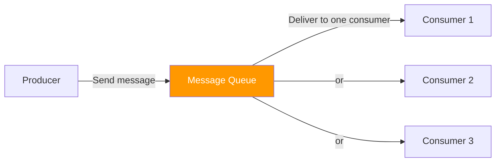
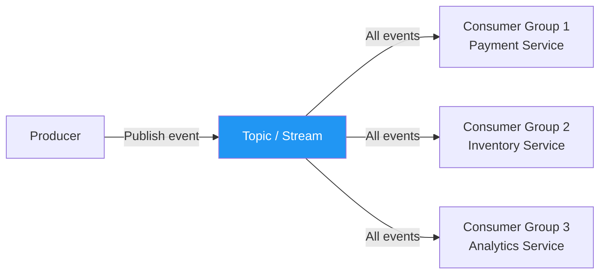
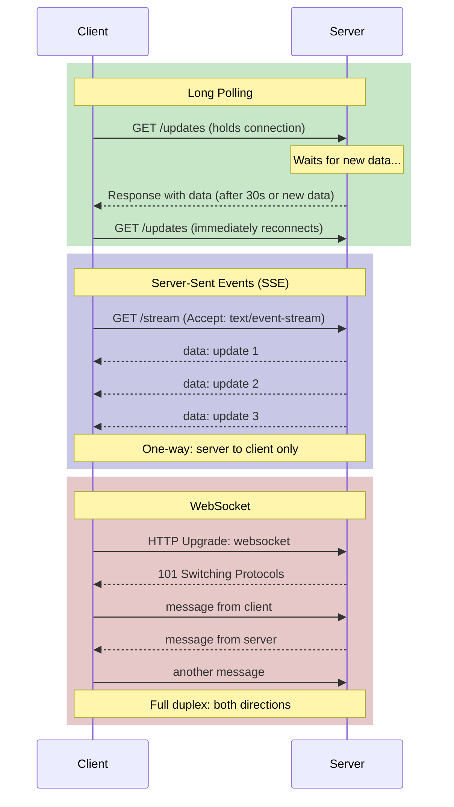
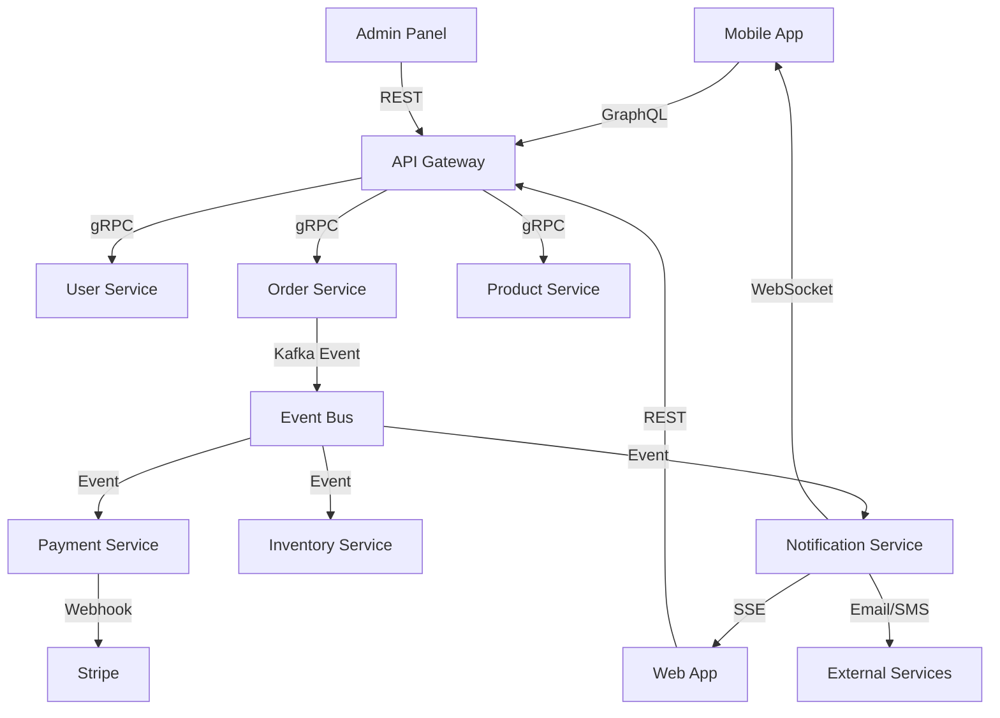

# Communication Patterns

Every distributed system is fundamentally about services communicating. The communication pattern you choose dictates latency, coupling, reliability, and how your system behaves under failure. Choose synchronous when you need an immediate answer. Choose asynchronous when you need resilience and decoupling. In practice, most systems use both — sync for user-facing requests, async for background processing and inter-service events.

## Synchronous Communication

The caller sends a request and blocks (or awaits) until the response arrives. Simple, intuitive, and the right choice when the user is waiting for an answer.

### REST (HTTP/JSON)

The dominant protocol for public APIs and most internal services. Uses HTTP verbs, URLs as resource identifiers, JSON payloads.

```python
# REST API — Flask example
from flask import Flask, jsonify, request

app = Flask(__name__)

@app.route("/api/v1/users/<user_id>", methods=["GET"])
def get_user(user_id):
    user = db.find_user(user_id)
    if not user:
        return jsonify({"error": "User not found"}), 404
    return jsonify({
        "id": user.id,
        "name": user.name,
        "email": user.email,
        "_links": {
            "self": f"/api/v1/users/{user.id}",
            "orders": f"/api/v1/users/{user.id}/orders"
        }
    }), 200

@app.route("/api/v1/users", methods=["POST"])
def create_user():
    data = request.json
    user = db.create_user(data["name"], data["email"])
    return jsonify({"id": user.id}), 201, {
        "Location": f"/api/v1/users/{user.id}"
    }
```

### gRPC (HTTP/2 + Protocol Buffers)

Binary protocol with strong typing, code generation, and streaming. 2-10x faster than REST/JSON for internal service-to-service calls.

```protobuf
// user_service.proto
syntax = "proto3";

package user;

service UserService {
  // Unary RPC — like REST
  rpc GetUser(GetUserRequest) returns (User);
  rpc CreateUser(CreateUserRequest) returns (User);

  // Server streaming — server sends multiple responses
  rpc ListUsers(ListUsersRequest) returns (stream User);

  // Client streaming — client sends multiple requests
  rpc UploadUserPhotos(stream PhotoChunk) returns (UploadResult);

  // Bidirectional streaming — both sides stream
  rpc Chat(stream ChatMessage) returns (stream ChatMessage);
}

message GetUserRequest {
  string user_id = 1;
}

message User {
  string id = 1;
  string name = 2;
  string email = 3;
  int64 created_at = 4;
}

message CreateUserRequest {
  string name = 1;
  string email = 2;
}

message ListUsersRequest {
  int32 page_size = 1;
  string page_token = 2;
}
```

```python
# gRPC server implementation
import grpc
from concurrent import futures
import user_pb2
import user_pb2_grpc


class UserServicer(user_pb2_grpc.UserServiceServicer):
    def GetUser(self, request, context):
        user = db.find_user(request.user_id)
        if not user:
            context.set_code(grpc.StatusCode.NOT_FOUND)
            context.set_details(f"User {request.user_id} not found")
            return user_pb2.User()
        return user_pb2.User(
            id=user.id,
            name=user.name,
            email=user.email
        )

    def ListUsers(self, request, context):
        """Server streaming: yield users one at a time."""
        for user in db.iter_users(page_size=request.page_size):
            yield user_pb2.User(
                id=user.id,
                name=user.name,
                email=user.email
            )


server = grpc.server(futures.ThreadPoolExecutor(max_workers=10))
user_pb2_grpc.add_UserServiceServicer_to_server(UserServicer(), server)
server.add_insecure_port("[::]:50051")
server.start()
```

### GraphQL

Client specifies exactly what data it needs. Eliminates over-fetching and under-fetching. Single endpoint.

```graphql
# Schema definition
type User {
  id: ID!
  name: String!
  email: String!
  orders(first: Int, after: String): OrderConnection!
  avatar: String
}

type Order {
  id: ID!
  total: Float!
  status: OrderStatus!
  items: [OrderItem!]!
}

type Query {
  user(id: ID!): User
  users(first: Int, after: String): UserConnection!
}

type Mutation {
  createUser(input: CreateUserInput!): User!
  updateUser(id: ID!, input: UpdateUserInput!): User!
}

# Client query — gets exactly what it needs
# Mobile: minimal data
query MobileProfile {
  user(id: "123") {
    name
    avatar
  }
}

# Web: richer data in a single request
query WebProfile {
  user(id: "123") {
    name
    email
    avatar
    orders(first: 5) {
      edges {
        node {
          id
          total
          status
        }
      }
    }
  }
}
```

### Synchronous Protocol Comparison

| Aspect | REST | gRPC | GraphQL |
|--------|------|------|---------|
| Transport | HTTP/1.1 or 2 | HTTP/2 | HTTP (any version) |
| Payload | JSON (text) | Protobuf (binary) | JSON (text) |
| Typing | Weak (OpenAPI optional) | Strong (proto schema) | Strong (GraphQL schema) |
| Streaming | No (workarounds exist) | Yes (4 patterns) | Subscriptions only |
| Code generation | Optional | Built-in | Optional |
| Browser support | Native | Needs grpc-web proxy | Native |
| Caching | HTTP caching works | Custom | Complex (POST-based) |
| Over-fetching | Common | No (typed responses) | Never (client chooses) |
| Learning curve | Low | Medium | Medium-High |
| Best for | Public APIs, CRUD | Internal services, high perf | Mobile/web frontends |

## Asynchronous Communication

The sender publishes a message and does not wait for a response. Decouples sender and receiver in time, space, and failure.

### Message Queues (Point-to-Point)

One producer, one consumer. The queue guarantees delivery. Consumer processes at its own pace.



```python
# RabbitMQ-style queue pattern
import json
from dataclasses import dataclass, asdict
from datetime import datetime


@dataclass
class OrderMessage:
    order_id: str
    user_id: str
    total: float
    items: list
    timestamp: str = ""

    def __post_init__(self):
        self.timestamp = self.timestamp or datetime.utcnow().isoformat()


class OrderProducer:
    """Publishes order messages to a queue."""

    def __init__(self, channel):
        self.channel = channel
        self.channel.queue_declare(queue="orders", durable=True)

    def publish(self, order: OrderMessage):
        self.channel.basic_publish(
            exchange="",
            routing_key="orders",
            body=json.dumps(asdict(order)),
            properties={"delivery_mode": 2}  # Persistent
        )


class OrderConsumer:
    """Processes orders from the queue."""

    def __init__(self, channel):
        self.channel = channel

    def start(self):
        self.channel.basic_qos(prefetch_count=1)  # One at a time
        self.channel.basic_consume(
            queue="orders",
            on_message_callback=self._handle
        )
        self.channel.start_consuming()

    def _handle(self, ch, method, properties, body):
        order = json.loads(body)
        try:
            self._process_order(order)
            ch.basic_ack(delivery_tag=method.delivery_tag)
        except Exception:
            ch.basic_nack(delivery_tag=method.delivery_tag, requeue=True)

    def _process_order(self, order: dict):
        # Process payment, update inventory, send confirmation
        pass
```

### Event Streaming (Pub-Sub)

One producer, many consumers. Each consumer group gets every message. Consumers can replay from any point in the stream.



```python
# Kafka-style event streaming
from dataclasses import dataclass, asdict
from typing import Callable
import json


@dataclass
class Event:
    event_type: str
    aggregate_id: str
    data: dict
    timestamp: str
    version: int = 1


class EventProducer:
    """Publish events to a Kafka topic."""

    def __init__(self, kafka_producer, topic: str):
        self.producer = kafka_producer
        self.topic = topic

    def emit(self, event: Event):
        """Publish event with key for partition ordering."""
        self.producer.send(
            self.topic,
            key=event.aggregate_id.encode(),  # Same key = same partition = ordered
            value=json.dumps(asdict(event)).encode()
        )
        self.producer.flush()


class EventConsumer:
    """Consume events from a Kafka topic."""

    def __init__(self, kafka_consumer, handlers: dict[str, Callable]):
        self.consumer = kafka_consumer
        self.handlers = handlers

    def process(self):
        for message in self.consumer:
            event = json.loads(message.value)
            handler = self.handlers.get(event["event_type"])
            if handler:
                handler(event)
            self.consumer.commit()


# Usage: multiple independent consumers processing the same events
order_events = EventProducer(kafka, "order-events")

# Emit once
order_events.emit(Event(
    event_type="OrderPlaced",
    aggregate_id="order_123",
    data={"user_id": "user_456", "total": 99.99},
    timestamp="2026-03-25T10:30:00Z"
))

# Consumed independently by payment, inventory, and analytics services
```

### Queue vs Stream Comparison

| Aspect | Message Queue | Event Stream |
|--------|--------------|-------------|
| Delivery | One consumer per message | All consumers get all messages |
| Retention | Deleted after consumption | Retained (configurable) |
| Replay | No | Yes (replay from any offset) |
| Ordering | FIFO within queue | Ordered within partition |
| Use case | Task distribution | Event broadcasting |
| Example | RabbitMQ, SQS | Kafka, Kinesis, Pulsar |
| Backpressure | Queue depth grows | Consumer lag grows |

## Real-Time Communication

For pushing updates to clients without polling.

### Long Polling vs SSE vs WebSocket



| Aspect | Long Polling | SSE | WebSocket |
|--------|-------------|-----|-----------|
| Direction | Client-initiated | Server to client | Bidirectional |
| Protocol | HTTP | HTTP | WS (over HTTP upgrade) |
| Connection | Reconnect per response | Persistent | Persistent |
| Overhead | High (HTTP headers each time) | Low | Lowest |
| Browser support | Universal | All modern | All modern |
| Proxy/firewall friendly | Yes | Mostly | Sometimes issues |
| Auto-reconnect | Manual | Built-in (EventSource) | Manual |
| Binary data | No | No (text only) | Yes |
| Max connections | Limited by HTTP pool | ~6 per domain (HTTP/1.1) | Thousands |
| Best for | Simple updates, compatibility | Notifications, feeds, dashboards | Chat, gaming, collaboration |

```javascript
// Server-Sent Events — simple server-to-client streaming
// Server (Node.js)
app.get('/events', (req, res) => {
  res.writeHead(200, {
    'Content-Type': 'text/event-stream',
    'Cache-Control': 'no-cache',
    'Connection': 'keep-alive',
  });

  const sendEvent = (data) => {
    res.write(`event: notification\n`);
    res.write(`data: ${JSON.stringify(data)}\n\n`);
  };

  // Send heartbeat every 30s to keep connection alive
  const heartbeat = setInterval(() => {
    res.write(': heartbeat\n\n');
  }, 30000);

  // Subscribe to notifications for this user
  const userId = req.query.userId;
  notificationService.subscribe(userId, sendEvent);

  req.on('close', () => {
    clearInterval(heartbeat);
    notificationService.unsubscribe(userId, sendEvent);
  });
});

// Client (browser)
const source = new EventSource('/events?userId=123');

source.addEventListener('notification', (event) => {
  const data = JSON.parse(event.data);
  showNotification(data);
});

source.onerror = () => {
  // EventSource auto-reconnects with Last-Event-ID
  console.log('Connection lost, reconnecting...');
};
```

```javascript
// WebSocket — full duplex communication
// Server (Node.js with ws library)
const WebSocket = require('ws');
const wss = new WebSocket.Server({ port: 8080 });

wss.on('connection', (ws, req) => {
  const userId = authenticate(req);

  ws.on('message', (data) => {
    const message = JSON.parse(data);

    switch (message.type) {
      case 'chat':
        // Broadcast to room
        broadcastToRoom(message.roomId, {
          type: 'chat',
          from: userId,
          text: message.text,
          timestamp: Date.now(),
        });
        break;

      case 'typing':
        broadcastToRoom(message.roomId, {
          type: 'typing',
          from: userId,
        });
        break;
    }
  });

  ws.on('close', () => {
    removeFromRooms(userId);
  });

  // Send messages to this client
  ws.send(JSON.stringify({ type: 'connected', userId }));
});
```

## Communication Pattern Decision Matrix

| Scenario | Recommended Pattern | Why |
|----------|-------------------|-----|
| 1. Public API for mobile/web | REST | Universal support, caching, simple |
| 2. Internal service-to-service, high throughput | gRPC | Binary, streaming, code-gen |
| 3. Mobile app needing flexible data | GraphQL | Client controls payload, reduces round trips |
| 4. Order processing pipeline | Message Queue | Reliable delivery, backpressure handling |
| 5. Event broadcasting to many services | Event Stream (Kafka) | Fan-out, replay, decoupling |
| 6. Real-time dashboard updates | SSE | Simple, server-to-client, auto-reconnect |
| 7. Chat application | WebSocket | Bidirectional, low latency |
| 8. File upload with progress | gRPC client streaming | Efficient binary streaming |
| 9. Microservice choreography | Events + async | Loose coupling, independent scaling |
| 10. Payment confirmation callback | Webhook (HTTP POST) | Standard, simple, retry-friendly |

## Hybrid Architecture Example

Most real systems combine multiple communication patterns.



**Pattern reasoning:**
- **GraphQL** for mobile (flexible queries, bandwidth efficiency)
- **REST** for web (simple, cacheable, well-tooled)
- **gRPC** between internal services (fast, typed, streaming)
- **Kafka events** for cross-service communication (decoupled, replayable)
- **WebSocket** for mobile push (bidirectional, battery efficient)
- **SSE** for web push (simpler than WebSocket for server-to-client)
- **Webhooks** for third-party integration (standard callback pattern)

## Anti-Patterns

| Anti-Pattern | Problem | Fix |
|-------------|---------|-----|
| Sync chains (A->B->C->D) | Latency adds up, any failure breaks all | Async where possible, parallelize |
| Chatty APIs | 50 HTTP calls to render one page | GraphQL or BFF (Backend for Frontend) |
| Fire-and-forget without queue | Messages lost on crash | Use a durable message queue |
| WebSocket for everything | Unnecessary complexity for simple reads | Use SSE or REST where sufficient |
| No timeouts on sync calls | Thread pool exhaustion | Always set timeouts, use circuit breakers |
| Ignoring backpressure | Producer overwhelms consumer | Queue with bounded depth, rate limiting |

## Cross-References

- [REST Best Practices](/system-design/api-design/rest-best-practices) — designing RESTful APIs
- [gRPC Internals](/system-design/networking/grpc-internals) — HTTP/2 framing and streaming
- [GraphQL Advanced](/system-design/api-design/graphql-advanced) — federation, batching, subscriptions
- [Kafka Internals](/system-design/message-queues/kafka-internals) — event streaming at scale
- [WebSockets](/system-design/networking/websockets) — WebSocket protocol deep dive
- [Event-Driven vs Request-Driven](/system-design/patterns/event-vs-request) — architectural comparison
- [Notification Patterns](/system-design/patterns/notification-patterns) — push notification architecture

---

*The best communication pattern is the simplest one that meets your requirements. Start with REST for synchronous, a message queue for async, and SSE for push. Graduate to gRPC, Kafka, and WebSocket when you have proven you need them.*

## Real-World Examples

::: tip Spotify
Spotify uses **gRPC** for all internal service-to-service communication, processing millions of requests per second. They chose gRPC over REST for its binary serialization (5-10x smaller payloads), strong typing (schema enforcement prevents breaking changes), and HTTP/2 multiplexing (multiple requests over a single connection). Public APIs remain REST for browser and third-party compatibility.
:::

::: tip Slack
Slack uses a **hybrid of WebSocket and REST**. When a user opens Slack, they establish a WebSocket connection for real-time message delivery (bidirectional, low-latency). Message history, file uploads, and search use REST APIs. If the WebSocket connection drops, messages are buffered server-side and delivered on reconnect — combining the strengths of both patterns.
:::

::: tip Shopify
Shopify uses **GraphQL** for their Storefront API, letting merchants' frontends request exactly the data they need. A mobile app can request just product names and prices (lightweight), while a desktop app requests full product details with reviews and variants — all from the same endpoint. This eliminated the over-fetching problem that plagued their REST API and reduced bandwidth by 40%.
:::

## Interview Tip

::: tip What to say
"I match communication patterns to requirements. For user-facing reads that need an immediate response, I'd use REST — it's simple, cacheable, and universally supported. For internal service-to-service calls at high throughput, gRPC is 2-10x faster due to binary serialization and HTTP/2 multiplexing. For side effects that don't need an immediate response (sending emails, updating analytics), I'd use async events via Kafka — this decouples services, provides replay capability, and means a downstream failure doesn't break the user experience. For real-time updates, SSE for server-to-client and WebSocket for bidirectional. Most production systems use all four, each where it fits best."
:::
