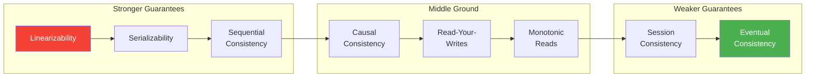
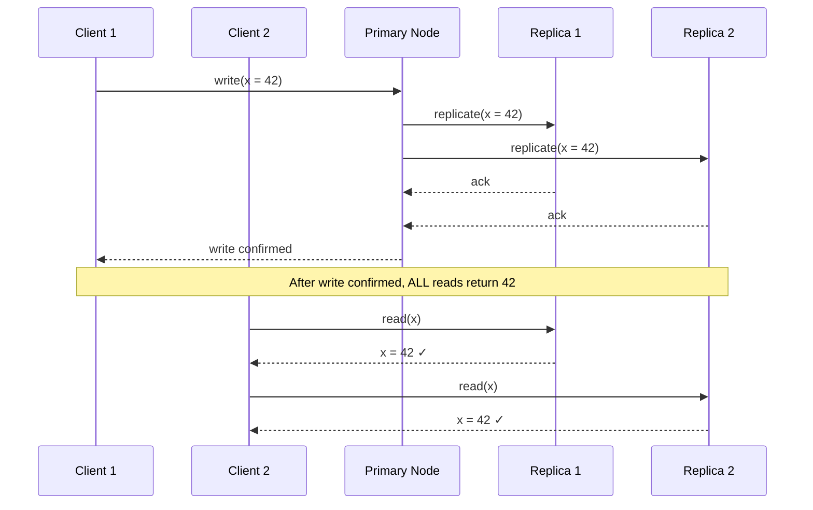
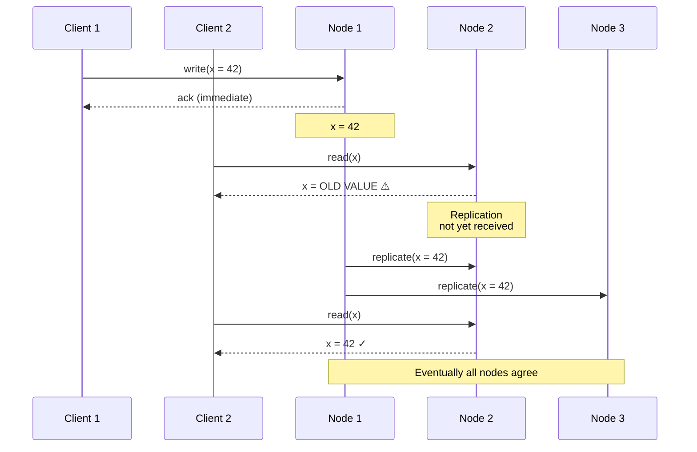
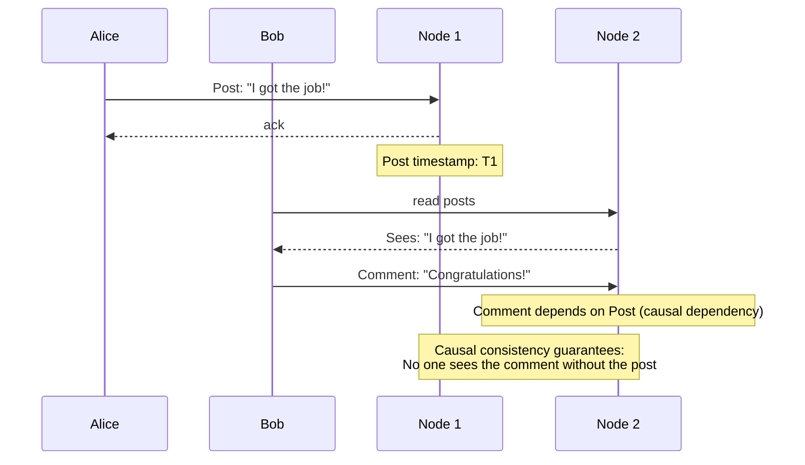
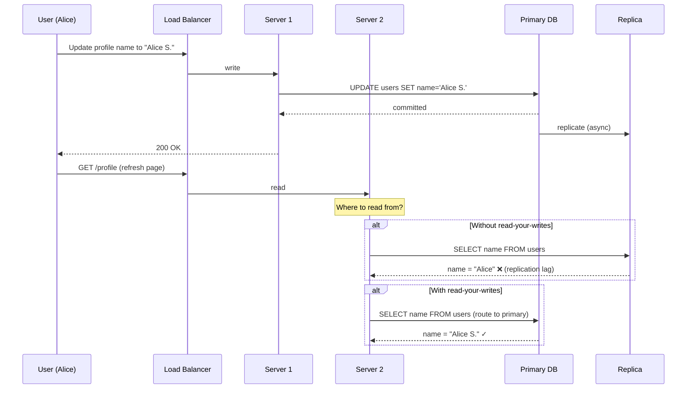
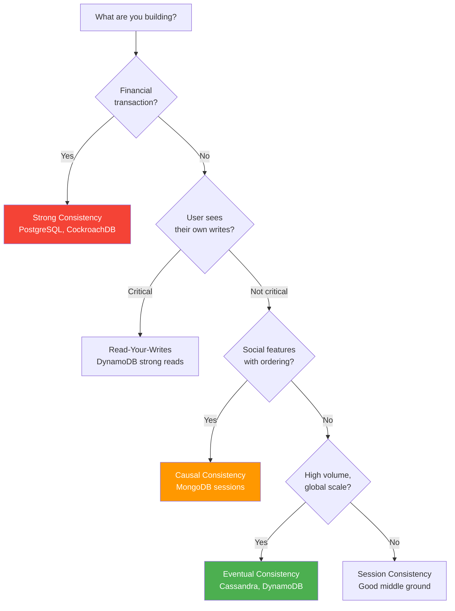

# Consistency Patterns

Consistency in distributed systems answers a deceptively simple question: when a write completes, which readers see it, and when? In a single-server system the answer is trivial — everyone sees the latest write immediately. In distributed systems with replication, partitioning, and caching, the answer is "it depends on your consistency model."

The consistency model you choose fundamentally shapes your system's behavior, performance, and availability. Strong consistency gives users predictable behavior but limits throughput and availability. Eventual consistency delivers speed and availability but forces you to handle stale reads and conflicts.

## The Consistency Spectrum

Consistency is not binary. It exists on a spectrum from strongest to weakest guarantees.



| Model | Guarantee | Performance | Availability | Example DB |
|-------|-----------|-------------|-------------|------------|
| Linearizability | Every read sees the most recent write | Lowest | Lowest | Spanner, ZooKeeper |
| Serializability | Transactions appear serial | Low | Low | PostgreSQL (serializable) |
| Sequential consistency | All processes see same order | Low-Medium | Medium | — |
| Causal consistency | Causally related ops ordered | Medium | High | MongoDB (causal sessions) |
| Read-your-writes | You see your own writes | Medium-High | High | DynamoDB (strong reads) |
| Monotonic reads | Reads never go backward | High | High | — |
| Session consistency | Guarantees within a session | High | High | Azure Cosmos DB |
| Eventual consistency | All replicas converge eventually | Highest | Highest | DynamoDB (default), Cassandra |

## Strong Consistency (Linearizability)

Linearizability is the gold standard. Once a write completes, every subsequent read from any client on any node returns that value or a newer one. The system behaves as if there is a single copy of the data.



### How PostgreSQL Achieves Strong Consistency

PostgreSQL uses synchronous replication for strong consistency. The primary waits for at least one replica to confirm the write before acknowledging the client.

```sql
-- PostgreSQL: Configure synchronous replication
-- In postgresql.conf on primary:
-- synchronous_standby_names = 'FIRST 1 (replica1, replica2)'
-- synchronous_commit = on

-- Every committed transaction is guaranteed to be on at least one replica
BEGIN;
UPDATE accounts SET balance = balance - 100 WHERE id = 1;
UPDATE accounts SET balance = balance + 100 WHERE id = 2;
COMMIT;  -- Returns only after replica confirms

-- Serializable isolation: strongest transaction guarantee
SET TRANSACTION ISOLATION LEVEL SERIALIZABLE;
BEGIN;
SELECT balance FROM accounts WHERE id = 1;  -- Sees consistent snapshot
-- If another transaction modifies this row before we commit,
-- PostgreSQL will abort one of them (serialization failure)
UPDATE accounts SET balance = balance - 100 WHERE id = 1;
COMMIT;
```

### CockroachDB: Serializable by Default

CockroachDB uses serializable isolation as the default (and only) level. It implements this with a combination of MVCC timestamps, a transaction conflict detection protocol, and hybrid logical clocks (HLC).

```sql
-- CockroachDB: Every transaction is serializable
-- No need to set isolation level — it is always serializable

-- Distributed transaction across multiple ranges (shards)
BEGIN;
INSERT INTO orders (id, user_id, total) VALUES (gen_random_uuid(), 'user_123', 99.99);
UPDATE inventory SET quantity = quantity - 1 WHERE product_id = 'prod_456';
COMMIT;
-- This is serializable even though the rows may be on different nodes

-- CockroachDB also supports AS OF SYSTEM TIME for historical reads
-- This is useful for analytics that do not need the latest data
SELECT * FROM orders AS OF SYSTEM TIME '-30s' WHERE user_id = 'user_123';
```

### Cost of Strong Consistency

```python
# Simulating latency impact of consistency levels
from dataclasses import dataclass


@dataclass
class ConsistencyBenchmark:
    """Latency characteristics of different consistency levels."""
    model: str
    write_latency_ms: float     # p50
    read_latency_ms: float      # p50
    write_availability: float   # Percentage
    read_availability: float    # Percentage
    explanation: str


benchmarks = [
    ConsistencyBenchmark(
        model="Linearizable",
        write_latency_ms=15.0,     # Must wait for replica acks
        read_latency_ms=5.0,       # Must read from leader or quorum
        write_availability=99.9,    # Need majority of replicas
        read_availability=99.9,
        explanation="Writes wait for quorum ack. Reads must contact leader."
    ),
    ConsistencyBenchmark(
        model="Eventual",
        write_latency_ms=2.0,      # Write to local, replicate async
        read_latency_ms=1.0,       # Read from any replica
        write_availability=99.99,   # Any node can accept writes
        read_availability=99.99,
        explanation="Writes ack immediately. Reads from nearest replica."
    ),
    ConsistencyBenchmark(
        model="Causal",
        write_latency_ms=5.0,      # Track causal dependencies
        read_latency_ms=2.0,       # May wait for causal consistency
        write_availability=99.95,
        read_availability=99.95,
        explanation="Tracks causality. Reads may wait for dependent writes."
    ),
]

# The numbers tell the story:
# Strong consistency: 7.5x write latency vs eventual
# But you get predictable, correct behavior
```

## Eventual Consistency

In an eventually consistent system, if no new writes are made, all replicas will eventually converge to the same value. The key word is "eventually" — there is a window of inconsistency after a write where different readers may see different values.



### DynamoDB: Eventual by Default

DynamoDB defaults to eventually consistent reads, which are cheaper and faster. You opt into strongly consistent reads per-request when you need them.

```python
import boto3

dynamodb = boto3.resource('dynamodb')
table = dynamodb.Table('Users')

# Eventually consistent read (default) — fast, cheap, might be stale
response = table.get_item(
    Key={'user_id': 'user_123'}
    # ConsistentRead defaults to False
)
# Cost: 0.5 RCU for items up to 4 KB

# Strongly consistent read — slower, costlier, guaranteed current
response = table.get_item(
    Key={'user_id': 'user_123'},
    ConsistentRead=True
)
# Cost: 1.0 RCU for items up to 4 KB (2x the cost)

# Pattern: Write then immediately read your own write
table.put_item(Item={'user_id': 'user_123', 'name': 'Alice'})

# If you read immediately with eventual consistency,
# you might not see the write yet
stale = table.get_item(Key={'user_id': 'user_123'})  # Might return old data

# Use strong consistency when you need read-your-writes
fresh = table.get_item(
    Key={'user_id': 'user_123'},
    ConsistentRead=True  # Guaranteed to see the write
)
```

### Conflict Resolution in Eventually Consistent Systems

When two nodes accept conflicting writes, you need a conflict resolution strategy.

| Strategy | How It Works | Data Loss Risk | Example |
|----------|-------------|---------------|---------|
| Last-writer-wins (LWW) | Timestamp decides winner | Yes (losing write discarded) | Cassandra default |
| Version vectors | Track causality, detect conflicts | No (but must resolve) | Riak, DynamoDB |
| CRDTs | Conflict-free data structures | No | Redis CRDT, Riak |
| Application-level | App logic merges conflicts | Depends on logic | CouchDB |

```python
# Last-Writer-Wins: Simple but lossy
class LWWRegister:
    """Last-Writer-Wins register for conflict resolution."""

    def __init__(self):
        self.value = None
        self.timestamp = 0

    def write(self, value, timestamp: float):
        if timestamp > self.timestamp:
            self.value = value
            self.timestamp = timestamp

    def merge(self, other: 'LWWRegister'):
        """Merge with a remote replica's state."""
        if other.timestamp > self.timestamp:
            self.value = other.value
            self.timestamp = other.timestamp


# Version Vector: Detects conflicts without data loss
class VersionVector:
    """Track causality across replicas."""

    def __init__(self):
        self.versions: dict[str, int] = {}  # node_id -> counter

    def increment(self, node_id: str):
        self.versions[node_id] = self.versions.get(node_id, 0) + 1

    def merge(self, other: 'VersionVector'):
        all_nodes = set(self.versions) | set(other.versions)
        for node in all_nodes:
            self.versions[node] = max(
                self.versions.get(node, 0),
                other.versions.get(node, 0)
            )

    def is_concurrent_with(self, other: 'VersionVector') -> bool:
        """True if neither vector dominates — conflict detected."""
        self_dominates = False
        other_dominates = False
        all_nodes = set(self.versions) | set(other.versions)

        for node in all_nodes:
            sv = self.versions.get(node, 0)
            ov = other.versions.get(node, 0)
            if sv > ov:
                self_dominates = True
            if ov > sv:
                other_dominates = True

        return self_dominates and other_dominates
```

## Causal Consistency

Causal consistency guarantees that causally related operations are seen in the correct order by all nodes. Operations that are not causally related (concurrent) may be seen in different orders by different nodes.



**Why it matters:** Without causal consistency, a third user (Carol) might see Bob's "Congratulations!" comment but not Alice's post — which makes no sense.

### MongoDB: Causal Consistency Sessions

```javascript
// MongoDB causal consistency with sessions
const session = client.startSession({ causalConsistency: true });

// All operations in this session maintain causal ordering
const usersCollection = client.db("app").collection("users");
const postsCollection = client.db("app").collection("posts");

// Write a post (this sets the session's operation time)
await postsCollection.insertOne(
  { userId: "alice", text: "I got the job!", createdAt: new Date() },
  { session }
);

// Any subsequent read in this session is guaranteed to see the write above
// Even if the read goes to a different replica
const posts = await postsCollection
  .find({ userId: "alice" })
  .session(session)
  .toArray();

// posts WILL include "I got the job!" — causal consistency guarantees it
console.log(posts);

session.endSession();
```

## Read-Your-Writes Consistency

A specific guarantee: after a client writes a value, that same client will always see the written value (or a newer one) on subsequent reads. Other clients may still see stale data.



### Implementation Strategies

```python
from time import time
from typing import Optional


class ReadYourWritesRouter:
    """Route reads to primary when the user recently wrote."""

    def __init__(self, primary, replicas: list, consistency_window: float = 5.0):
        self.primary = primary
        self.replicas = replicas
        self.consistency_window = consistency_window
        # Track last write time per user
        self.last_write: dict[str, float] = {}

    def record_write(self, user_id: str):
        """Call after any write operation."""
        self.last_write[user_id] = time()

    def get_connection(self, user_id: Optional[str] = None, is_write: bool = False):
        """Get appropriate database connection."""
        if is_write:
            return self.primary

        # If user recently wrote, read from primary
        if user_id and user_id in self.last_write:
            elapsed = time() - self.last_write[user_id]
            if elapsed < self.consistency_window:
                return self.primary
            else:
                # Outside window, safe to read from replica
                del self.last_write[user_id]

        # No recent writes, use replica (round-robin)
        return self._pick_replica()

    def _pick_replica(self):
        import random
        return random.choice(self.replicas)
```

## Monotonic Reads

Monotonic reads guarantee that if a client reads a value at time T, any subsequent read will return a value at least as recent as T. Reads never "go backward."

**The problem without monotonic reads:**

```
Client reads from Replica A: balance = $100 (current)
Client reads from Replica B: balance = $80  (stale!)  <-- went backward
Client reads from Replica A: balance = $100 (current)
```

The user sees their balance flip between $100 and $80 — confusing and trust-destroying.

**Solution:** Route the same client to the same replica (sticky sessions) or track replica replication positions.

## Cassandra: Tunable Consistency

Cassandra lets you tune consistency per query. The combination of write consistency level (W) and read consistency level (R) determines your effective consistency.

```cql
-- Cassandra consistency levels
-- ONE: fastest, read/write from any single replica
-- QUORUM: majority of replicas must respond
-- ALL: every replica must respond
-- LOCAL_QUORUM: quorum within the local datacenter

-- Eventually consistent: fast writes, fast reads, may be stale
CONSISTENCY ONE;
INSERT INTO users (id, name, email) VALUES (uuid(), 'Alice', 'alice@example.com');
SELECT * FROM users WHERE id = ?;

-- Strongly consistent: R + W > N (replication factor)
-- With RF=3: QUORUM reads + QUORUM writes = 2 + 2 > 3
CONSISTENCY QUORUM;
INSERT INTO users (id, name, email) VALUES (uuid(), 'Alice', 'alice@example.com');
SELECT * FROM users WHERE id = ?;

-- Maximum consistency (but lowest availability)
CONSISTENCY ALL;
SELECT * FROM users WHERE id = ?;
-- All 3 replicas must respond — if any is down, the read fails
```

### Tunable Consistency Formula

With a replication factor of N:
- **W + R > N** = Strong consistency (reads always see latest write)
- **W + R <= N** = Eventual consistency (reads may miss recent writes)

| W | R | N | Consistent? | Trade-off |
|---|---|---|-------------|-----------|
| 1 | 1 | 3 | No | Fast, available, may be stale |
| 2 | 2 | 3 | Yes | Balanced |
| 3 | 1 | 3 | Yes | Slow writes, fast reads |
| 1 | 3 | 3 | Yes | Fast writes, slow reads |
| 1 | 1 | 1 | Yes | No replication (single node) |

## Consistency Patterns Comparison

| Pattern | Use Case | Real-World Example |
|---------|----------|-------------------|
| Strong (linearizable) | Financial transactions, inventory | Bank transfers, stock trading |
| Eventual | Social media feeds, analytics | Twitter timeline, view counts |
| Causal | Social features, comments | Facebook comments on a post |
| Read-your-writes | User profile updates | Change email, see it immediately |
| Monotonic reads | Dashboards, reporting | Account balance should not fluctuate |
| Session | Shopping cart, user workflow | E-commerce checkout flow |

## Choosing the Right Consistency Model



## Cross-References

- [CAP Theorem](/system-design/distributed-systems/cap-theorem) — the fundamental trade-off between consistency and availability
- [Consistency Models](/system-design/distributed-systems/consistency-models) — formal definitions and proofs
- [Database Replication](/system-design/databases/replication) — how replication affects consistency
- [CRDT Fundamentals](/system-design/distributed-systems/crdt-fundamentals) — conflict-free data structures for eventual consistency
- [Distributed Transactions](/system-design/distributed-systems/distributed-transactions) — achieving consistency across services
- [Availability Patterns](/system-design/patterns/availability-patterns) — the other side of the CAP trade-off

---

*The right consistency model is not the strongest one — it is the weakest one that still meets your requirements. Every extra guarantee costs performance and availability. Know exactly what your users need and pay for nothing more.*
