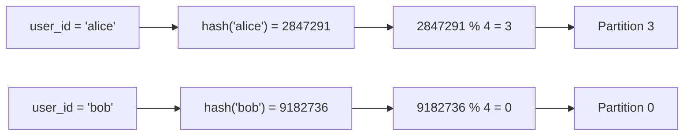
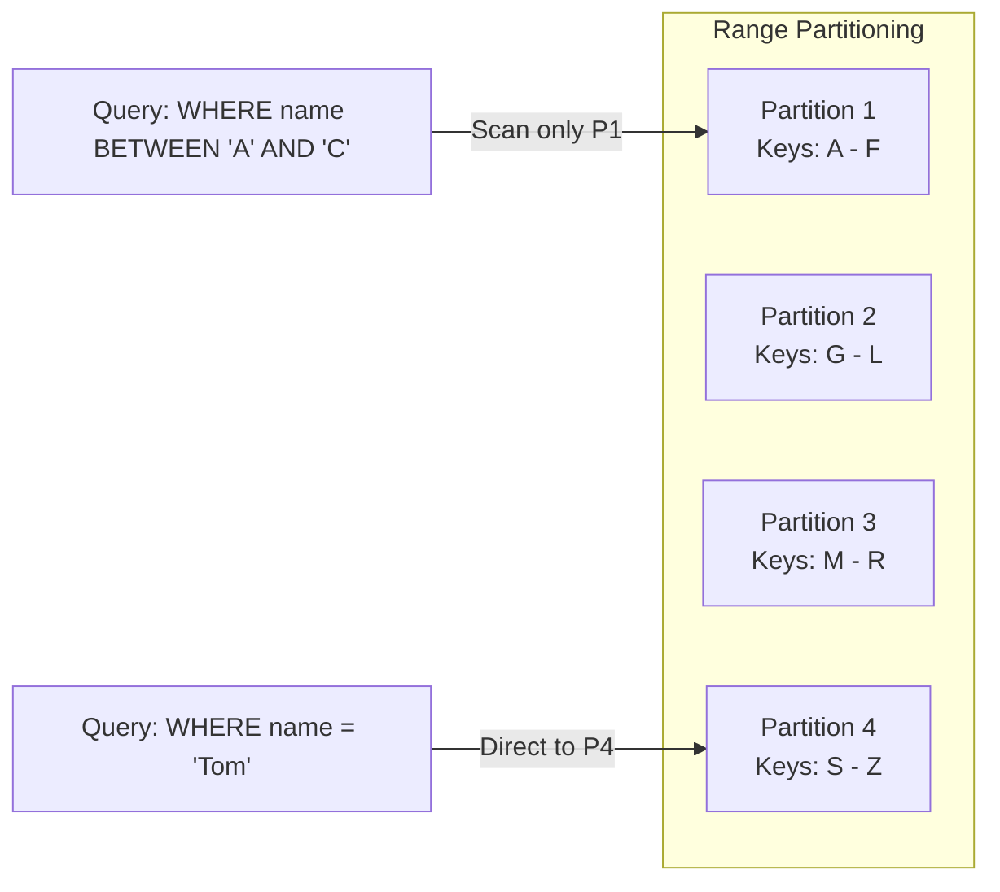
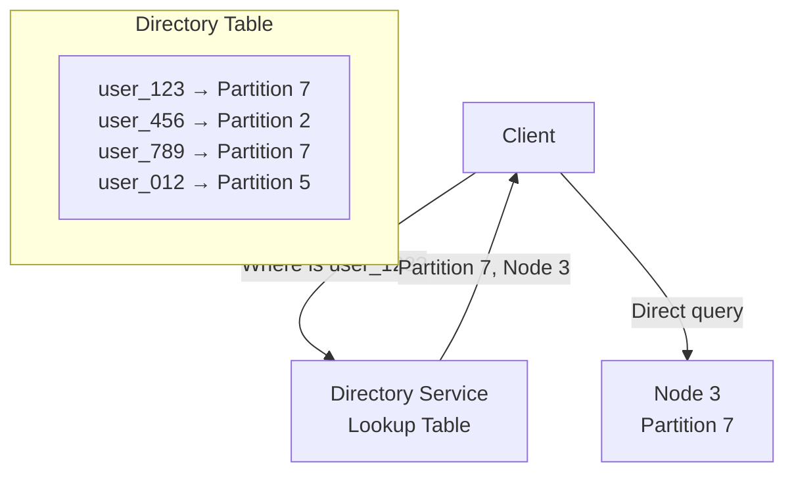
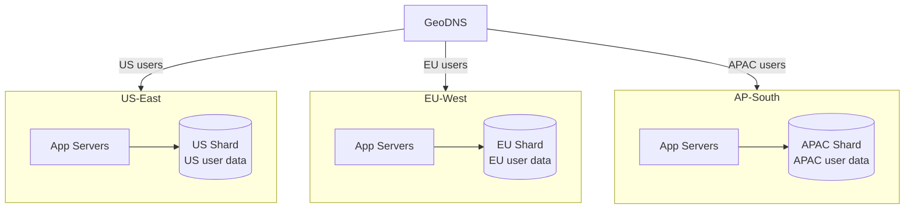
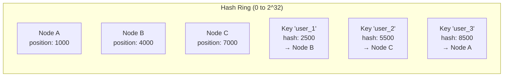
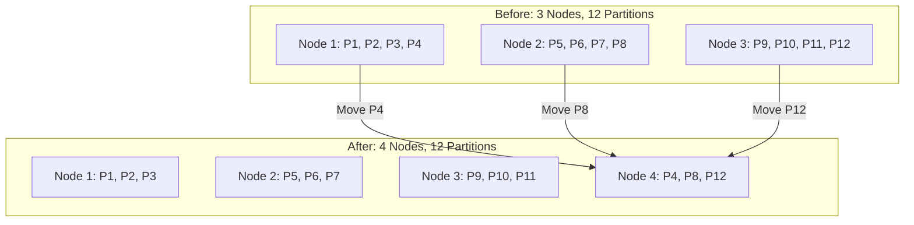
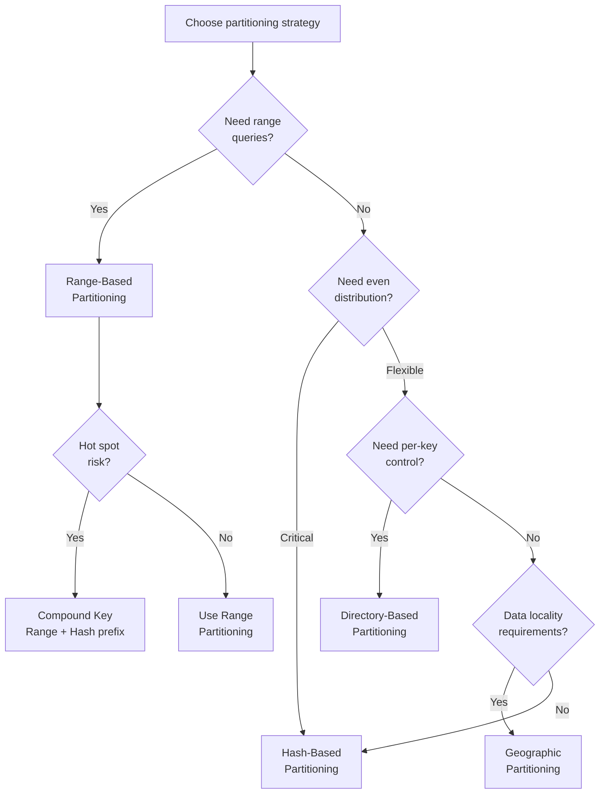

# Data Partitioning Strategies

Data partitioning (sharding) splits a dataset across multiple nodes so that each node stores and processes only a subset of the total data. When your data exceeds what a single machine can handle — in storage, read throughput, or write throughput — partitioning is how you scale horizontally.

The partitioning strategy you choose determines everything: query performance, data distribution, operational complexity, and how painful it is to add or remove nodes. Get it right, and your system scales smoothly. Get it wrong, and you have hot partitions, cross-shard queries, and rebalancing nightmares.

## Why Partition?

| Problem | How Partitioning Helps |
|---------|----------------------|
| Dataset too large for one disk | Each node stores a fraction |
| Read throughput exceeded | Reads distributed across nodes |
| Write throughput exceeded | Writes distributed across nodes |
| Single point of failure | Each partition can be replicated independently |
| Geographic latency | Partitions placed near users |

## Partitioning Strategies

### Hash-Based Partitioning

Compute a hash of the partition key and assign to a node: `partition = hash(key) % num_partitions`.



```python
import hashlib
from typing import Any


class HashPartitioner:
    """Simple hash-based partitioning."""

    def __init__(self, num_partitions: int):
        self.num_partitions = num_partitions

    def get_partition(self, key: str) -> int:
        """Deterministic partition assignment using consistent hashing."""
        hash_value = int(hashlib.md5(key.encode()).hexdigest(), 16)
        return hash_value % self.num_partitions

    def get_node(self, key: str, nodes: list[str]) -> str:
        """Map a key to a specific node."""
        partition = self.get_partition(key)
        return nodes[partition % len(nodes)]


# Usage
partitioner = HashPartitioner(num_partitions=16)
print(partitioner.get_partition("user_123"))  # Always returns same partition
print(partitioner.get_partition("user_456"))  # Different partition (probably)
```

| Pros | Cons |
|------|------|
| Even distribution (with good hash function) | Range queries impossible (hashed keys are not ordered) |
| Simple to implement | Adding/removing nodes reshuffles most keys |
| No hot spots from sequential keys | Cannot exploit data locality |

### Range-Based Partitioning

Assign contiguous ranges of the partition key to each node. Like volumes of an encyclopedia: A-F on shelf 1, G-L on shelf 2.



```python
from dataclasses import dataclass
from typing import Optional, Any


@dataclass
class RangePartition:
    partition_id: int
    start_key: str  # Inclusive
    end_key: str    # Exclusive
    node: str


class RangePartitioner:
    """Range-based partitioning with ordered key ranges."""

    def __init__(self):
        self.partitions: list[RangePartition] = []

    def add_partition(self, partition: RangePartition):
        self.partitions.append(partition)
        self.partitions.sort(key=lambda p: p.start_key)

    def get_partition(self, key: str) -> Optional[RangePartition]:
        """Binary search for the partition containing this key."""
        low, high = 0, len(self.partitions) - 1
        while low <= high:
            mid = (low + high) // 2
            p = self.partitions[mid]
            if key < p.start_key:
                high = mid - 1
            elif key >= p.end_key:
                low = mid + 1
            else:
                return p
        return None

    def get_range_partitions(self, start: str, end: str) -> list[RangePartition]:
        """Find all partitions that overlap with the given range."""
        return [
            p for p in self.partitions
            if p.start_key < end and p.end_key > start
        ]


# Usage
partitioner = RangePartitioner()
partitioner.add_partition(RangePartition(1, "2024-01", "2024-04", "node-1"))
partitioner.add_partition(RangePartition(2, "2024-04", "2024-07", "node-2"))
partitioner.add_partition(RangePartition(3, "2024-07", "2024-10", "node-3"))
partitioner.add_partition(RangePartition(4, "2024-10", "2025-01", "node-4"))

# Range scan: only hits relevant partitions
partitions = partitioner.get_range_partitions("2024-05", "2024-08")
# Returns partitions 2 and 3 — skip 1 and 4
```

| Pros | Cons |
|------|------|
| Range queries efficient (scan adjacent partitions) | Hot spots on recent ranges (time-based keys) |
| Data locality (related keys on same node) | Uneven distribution if key distribution is skewed |
| Easy to understand | Manual range boundary management |

### Directory-Based Partitioning

A lookup service maps each key (or key range) to a partition. Maximum flexibility at the cost of an extra hop and a single point of coordination.



```python
class DirectoryPartitioner:
    """Directory-based partitioning with flexible key-to-node mapping."""

    def __init__(self):
        self.directory: dict[str, str] = {}  # key -> node_id
        self.default_partitioner = HashPartitioner(num_partitions=16)

    def assign(self, key: str, node_id: str):
        """Explicitly assign a key to a node."""
        self.directory[key] = node_id

    def lookup(self, key: str) -> str:
        """Look up which node holds this key."""
        if key in self.directory:
            return self.directory[key]
        # Fallback to hash partitioning for unknown keys
        return f"node-{self.default_partitioner.get_partition(key)}"

    def migrate(self, key: str, from_node: str, to_node: str):
        """Move a key to a different node (for rebalancing)."""
        self.directory[key] = to_node
```

| Pros | Cons |
|------|------|
| Maximum flexibility | Directory is a bottleneck / SPOF |
| Can optimize placement per-key | Extra network hop for lookup |
| Easy rebalancing (just update directory) | Directory must be highly available |

### Geographic Partitioning

Partition data by geographic region. Users in Europe hit European servers with European data.



| Pros | Cons |
|------|------|
| Low latency (data near users) | Cross-region queries are expensive |
| Data sovereignty compliance (GDPR) | Uneven distribution (more users in some regions) |
| Regional fault isolation | Traveling users need routing logic |

## Consistent Hashing

Simple hash partitioning (`hash(key) % N`) has a fatal flaw: when you add or remove a node, almost every key's assignment changes. Consistent hashing solves this by mapping both keys and nodes onto a hash ring.



When a node is added or removed, only keys adjacent to that node on the ring are affected. With N nodes, adding one node only remaps ~1/N of keys instead of nearly all of them.

### Virtual Nodes

With three physical nodes on the ring, distribution can be very uneven. Virtual nodes solve this by placing each physical node at multiple positions on the ring.

```python
import hashlib
from bisect import bisect_right
from collections import defaultdict


class ConsistentHashRing:
    """Consistent hashing with virtual nodes."""

    def __init__(self, virtual_nodes_per_physical: int = 150):
        self.virtual_nodes = virtual_nodes_per_physical
        self.ring: list[tuple[int, str]] = []  # (hash_position, node_id)
        self.nodes: set[str] = set()

    def _hash(self, key: str) -> int:
        return int(hashlib.sha256(key.encode()).hexdigest(), 16)

    def add_node(self, node_id: str):
        """Add a physical node with multiple virtual positions."""
        self.nodes.add(node_id)
        for i in range(self.virtual_nodes):
            virtual_key = f"{node_id}:vn{i}"
            position = self._hash(virtual_key)
            self.ring.append((position, node_id))
        self.ring.sort(key=lambda x: x[0])

    def remove_node(self, node_id: str):
        """Remove a node and all its virtual positions."""
        self.nodes.discard(node_id)
        self.ring = [(pos, nid) for pos, nid in self.ring if nid != node_id]

    def get_node(self, key: str) -> str:
        """Find the node responsible for this key."""
        if not self.ring:
            raise ValueError("No nodes in ring")

        hash_value = self._hash(key)
        positions = [pos for pos, _ in self.ring]

        # Find first node clockwise from key's position
        idx = bisect_right(positions, hash_value)
        if idx == len(self.ring):
            idx = 0  # Wrap around

        return self.ring[idx][1]

    def get_distribution(self, num_keys: int = 10000) -> dict[str, int]:
        """Test distribution evenness."""
        counts: dict[str, int] = defaultdict(int)
        for i in range(num_keys):
            node = self.get_node(f"key_{i}")
            counts[node] += 1
        return dict(counts)


# Demo: distribution with and without virtual nodes
ring_few = ConsistentHashRing(virtual_nodes_per_physical=1)
ring_many = ConsistentHashRing(virtual_nodes_per_physical=150)

for node in ["node-A", "node-B", "node-C"]:
    ring_few.add_node(node)
    ring_many.add_node(node)

# 1 virtual node: could be 70/20/10 split (very uneven)
# 150 virtual nodes: close to 33/33/34 split (even)
```

### Impact of Adding a Node

| Partitioning | Keys Remapped When Adding 1 Node |
|-------------|--------------------------------|
| `hash % N` | ~75% of all keys (N=4 to N=5) |
| Consistent hashing (no vnodes) | ~1/N of keys (~25% with N=4) |
| Consistent hashing (with vnodes) | ~1/N of keys (evenly distributed) |

## Hot Partition Prevention

A hot partition is one that receives disproportionately more traffic than others. This is the most common partitioning problem.

### Common Causes

| Cause | Example | Fix |
|-------|---------|-----|
| Celebrity users | Justin Bieber's tweet = millions of writes | Add random suffix to key |
| Time-based keys | All writes to "today's" partition | Compound key with salt |
| Sequential IDs | Auto-increment always hits latest shard | Use random/UUID keys |
| Popular items | Product on sale gets all reads | Cache hot items separately |
| Event spikes | Black Friday, World Cup final | Pre-split known hot partitions |

### Technique: Key Salting

```python
import random


class HotPartitionMitigator:
    """Spread hot keys across multiple partitions using salting."""

    def __init__(self, partitioner, num_sub_partitions: int = 10):
        self.partitioner = partitioner
        self.num_sub_partitions = num_sub_partitions
        self.hot_keys: set[str] = set()

    def mark_hot(self, key: str):
        """Mark a key as hot (detected by monitoring)."""
        self.hot_keys.add(key)

    def write(self, key: str, value):
        """Write to a salted partition for hot keys."""
        if key in self.hot_keys:
            salt = random.randint(0, self.num_sub_partitions - 1)
            salted_key = f"{key}::{salt}"
            partition = self.partitioner.get_partition(salted_key)
            return self._write_to_partition(partition, salted_key, value)
        else:
            partition = self.partitioner.get_partition(key)
            return self._write_to_partition(partition, key, value)

    def read(self, key: str):
        """Read from all sub-partitions for hot keys and merge."""
        if key in self.hot_keys:
            results = []
            for salt in range(self.num_sub_partitions):
                salted_key = f"{key}::{salt}"
                partition = self.partitioner.get_partition(salted_key)
                results.extend(self._read_from_partition(partition, salted_key))
            return self._merge(results)
        else:
            partition = self.partitioner.get_partition(key)
            return self._read_from_partition(partition, key)

    def _write_to_partition(self, partition, key, value):
        pass  # Implementation depends on storage backend

    def _read_from_partition(self, partition, key):
        pass

    def _merge(self, results):
        pass
```

## Rebalancing Strategies

When you add or remove nodes, data must move. Rebalancing should be:
- **Gradual:** Do not move everything at once
- **Non-disruptive:** System stays available during rebalancing
- **Minimal:** Move as little data as possible

### Strategy Comparison

| Strategy | Data Movement | Disruption | Complexity |
|----------|-------------|-----------|-----------|
| Fixed partitions | Minimal (move whole partitions) | Low | Low |
| Dynamic splitting | Moderate (split hot partitions) | Medium | Medium |
| Consistent hashing | Minimal (~1/N of data) | Low | Low |
| Full rehash | All data moves | High | Low |

### Fixed Number of Partitions

Create many more partitions than nodes. When a node is added, it steals partitions from existing nodes. When a node is removed, its partitions are distributed to remaining nodes.



This is how Elasticsearch, Kafka, Riak, and CockroachDB handle it.

## Partition Key Selection

The most critical decision. A bad partition key causes hot spots, cross-partition queries, and uneven growth.

### Selection Criteria

| Criteria | Good Key | Bad Key |
|----------|----------|---------|
| High cardinality | user_id (millions of values) | country (hundreds) |
| Even distribution | UUID, hash | sequential ID, timestamp |
| Query alignment | Key used in WHERE clauses | Key never queried |
| Write distribution | Each key gets similar writes | Celebrity ID, trending topic |
| Growth pattern | Grows with users | Grows with time (hot recent shard) |

### Real-World Partition Key Examples

| System | Partition Key | Why |
|--------|--------------|-----|
| Social media posts | user_id | Queries are per-user; even write distribution |
| E-commerce orders | order_id (hash) | Even distribution; no range queries needed |
| Time-series metrics | (metric_name, time_bucket) | Compound key avoids hot "latest" partition |
| Chat messages | conversation_id | All messages in a conversation on same shard |
| IoT telemetry | device_id | Even distribution across millions of devices |
| Multi-tenant SaaS | tenant_id | Isolation, per-tenant queries, easy tenant migration |

### Anti-Pattern: Timestamp as Partition Key

```python
# BAD: All writes go to the "latest" partition
# DynamoDB will throttle this shard
table.put_item(Item={
    'timestamp': '2026-03-25T10:30:00',  # Partition key
    'sensor_id': 'temp_001',
    'value': 23.5
})

# GOOD: Compound key distributes writes
table.put_item(Item={
    'sensor_id': 'temp_001',             # Partition key (high cardinality)
    'timestamp': '2026-03-25T10:30:00',  # Sort key (range queries within partition)
    'value': 23.5
})
```

## Cross-Partition Queries

Some queries inevitably span multiple partitions. Strategies for handling them:

| Strategy | How | Performance | Consistency |
|----------|-----|-------------|------------|
| Scatter-gather | Query all partitions, merge results | O(N) partitions | Eventual |
| Global secondary index | Separate index spanning all partitions | Fast lookup, eventual updates | Eventual |
| Denormalization | Duplicate data in query-optimized layout | Fast reads, complex writes | Application-managed |
| Materialized views | Pre-computed cross-partition aggregates | Fast reads | Eventual |

```python
class ScatterGatherQuery:
    """Query across all partitions and merge results."""

    def __init__(self, partitions: list):
        self.partitions = partitions

    async def query(self, predicate, sort_key=None, limit=None):
        """Fan out query to all partitions, merge results."""
        import asyncio

        # Scatter: send query to all partitions in parallel
        tasks = [
            partition.query(predicate, limit=limit)
            for partition in self.partitions
        ]
        results = await asyncio.gather(*tasks)

        # Gather: merge and sort results
        merged = []
        for partition_results in results:
            merged.extend(partition_results)

        if sort_key:
            merged.sort(key=sort_key)

        if limit:
            merged = merged[:limit]

        return merged
```

## Partitioning Strategy Decision Matrix



## Cross-References

- [Consistent Hashing](/system-design/distributed-systems/consistent-hashing) — hash ring deep dive
- [Database Sharding](/system-design/databases/sharding) — database-specific sharding implementation
- [Scalability Patterns](/system-design/patterns/scalability-patterns) — Z-axis scaling context
- [DynamoDB Internals](/system-design/databases/dynamodb-internals) — DynamoDB partition key design
- [Cassandra Internals](/system-design/databases/cassandra-internals) — Cassandra partitioner and virtual nodes
- [Kafka Internals](/system-design/message-queues/kafka-internals) — Kafka partition strategy

---

*The best partition key is one you never have to change. Spend time upfront modeling your access patterns and data growth before committing to a partitioning strategy — rebalancing after the fact is always more expensive than getting it right the first time.*
