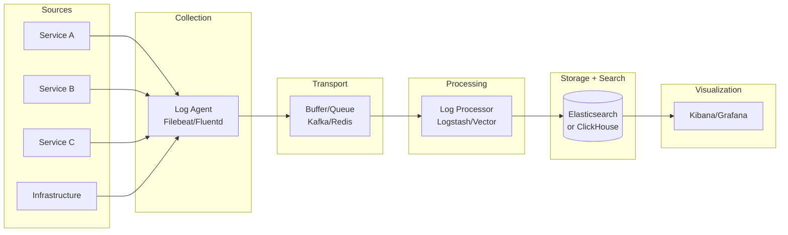
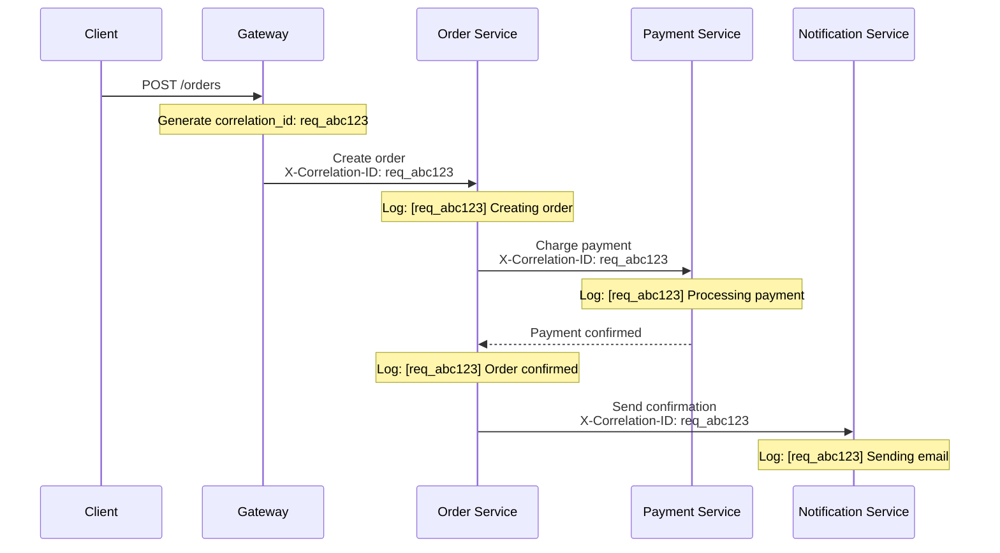
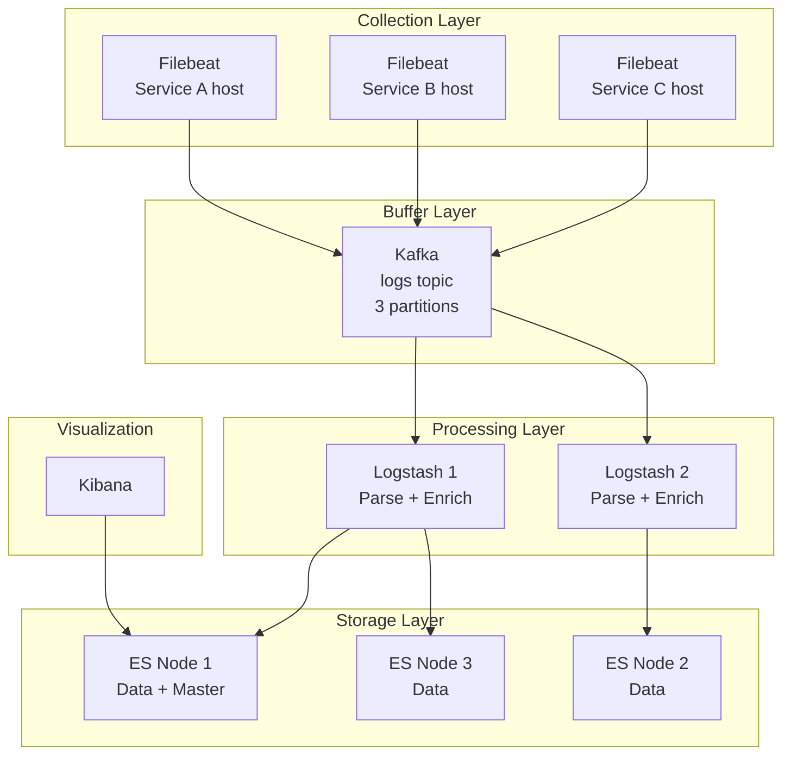
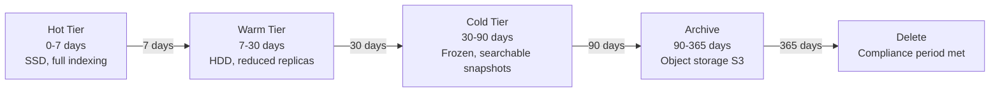

# Distributed Logging Design

In a monolith, you `tail -f application.log` and life is good. In a distributed system with 50 services across 200 containers, logs are scattered across machines, rotated independently, and disappear when containers restart. You need a centralized logging pipeline that collects, structures, stores, and makes searchable every log line from every service. Without this, debugging a production issue means SSHing into machines and hoping you find the right log before it is rotated away.

## The Logging Pipeline

Every distributed logging system follows the same fundamental pipeline.



### Pipeline Components

| Component | Role | Examples |
|-----------|------|---------|
| Log source | Generate log entries | Application code, web servers, databases |
| Agent/shipper | Collect and forward logs | Filebeat, Fluentd, Vector, Promtail |
| Buffer | Decouple collection from processing | Kafka, Redis, disk buffer |
| Processor | Parse, enrich, transform, filter | Logstash, Vector, Fluentd |
| Storage | Index and store for search | Elasticsearch, Loki, ClickHouse |
| Visualization | Search, dashboard, alert | Kibana, Grafana, Datadog |

## Structured Logging

Unstructured logs are text strings. Structured logs are key-value pairs (usually JSON). Structured logging is not optional at scale — it is the difference between grepping through millions of text lines and running precise queries.

```python
import json
import logging
import sys
from datetime import datetime, timezone
from typing import Any


class StructuredLogger:
    """JSON-structured logging for distributed systems."""

    def __init__(self, service_name: str, version: str):
        self.service_name = service_name
        self.version = version
        self.logger = logging.getLogger(service_name)
        self.logger.setLevel(logging.DEBUG)

        handler = logging.StreamHandler(sys.stdout)
        handler.setFormatter(StructuredFormatter(service_name, version))
        self.logger.addHandler(handler)

    def info(self, message: str, **context):
        self.logger.info(message, extra={"context": context})

    def error(self, message: str, **context):
        self.logger.error(message, extra={"context": context})

    def warn(self, message: str, **context):
        self.logger.warning(message, extra={"context": context})


class StructuredFormatter(logging.Formatter):
    def __init__(self, service_name: str, version: str):
        super().__init__()
        self.service_name = service_name
        self.version = version

    def format(self, record: logging.LogRecord) -> str:
        log_entry = {
            "timestamp": datetime.now(timezone.utc).isoformat(),
            "level": record.levelname,
            "service": self.service_name,
            "version": self.version,
            "message": record.getMessage(),
            "logger": record.name,
            "thread": record.threadName,
        }

        # Add structured context
        context = getattr(record, "context", {})
        if context:
            log_entry.update(context)

        # Add exception info
        if record.exc_info and record.exc_info[0]:
            log_entry["exception"] = {
                "type": record.exc_info[0].__name__,
                "message": str(record.exc_info[1]),
                "stacktrace": self.formatException(record.exc_info),
            }

        return json.dumps(log_entry)


# Usage
logger = StructuredLogger("order-service", "1.5.2")

logger.info("Order created",
    order_id="ord_123",
    user_id="usr_456",
    total=99.99,
    items_count=3,
    correlation_id="req_abc"
)
# Output:
# {"timestamp":"2026-03-25T10:30:00+00:00","level":"INFO","service":"order-service",
#  "version":"1.5.2","message":"Order created","order_id":"ord_123",
#  "user_id":"usr_456","total":99.99,"items_count":3,"correlation_id":"req_abc"}
```

### Structured vs Unstructured

```
# Unstructured — hard to parse, impossible to query
2026-03-25 10:30:00 INFO Order created for user usr_456, order ord_123, total $99.99

# Structured — every field is queryable
{"timestamp":"2026-03-25T10:30:00Z","level":"INFO","message":"Order created",
 "order_id":"ord_123","user_id":"usr_456","total":99.99}
```

| Aspect | Unstructured | Structured (JSON) |
|--------|-------------|-------------------|
| Human readability | Good in terminal | Harder in raw form |
| Machine parseability | Regex nightmare | Trivial |
| Query capability | Full-text search only | Field-level queries |
| Storage efficiency | Smaller | Larger (field names repeated) |
| Schema evolution | No schema to evolve | Add fields freely |
| Alerting rules | Fragile (regex-based) | Precise (field-based) |

## Correlation IDs

In a distributed system, a single user request may touch 10 services. A correlation ID (also called trace ID or request ID) links all log entries for a single request across all services.



```python
import uuid
from contextvars import ContextVar
from functools import wraps

# Thread-safe context variable for correlation ID
correlation_id_var: ContextVar[str] = ContextVar('correlation_id', default='')


class CorrelationMiddleware:
    """ASGI middleware that propagates correlation IDs."""

    HEADER_NAME = "X-Correlation-ID"

    def __init__(self, app):
        self.app = app

    async def __call__(self, scope, receive, send):
        if scope["type"] == "http":
            headers = dict(scope.get("headers", []))
            header_key = self.HEADER_NAME.lower().encode()

            # Extract or generate correlation ID
            corr_id = headers.get(header_key, b"").decode()
            if not corr_id:
                corr_id = f"req_{uuid.uuid4().hex[:12]}"

            token = correlation_id_var.set(corr_id)

            # Add correlation ID to response headers
            async def send_with_correlation(message):
                if message["type"] == "http.response.start":
                    headers = list(message.get("headers", []))
                    headers.append(
                        (self.HEADER_NAME.encode(), corr_id.encode())
                    )
                    message["headers"] = headers
                await send(message)

            try:
                await self.app(scope, receive, send_with_correlation)
            finally:
                correlation_id_var.reset(token)
        else:
            await self.app(scope, receive, send)


def get_correlation_id() -> str:
    """Get current correlation ID from context."""
    return correlation_id_var.get()
```

## ELK Stack Internals

The ELK stack (Elasticsearch, Logstash, Kibana) is the most common open-source logging stack.



### Logstash Processing Pipeline

```ruby
# logstash.conf
input {
  kafka {
    bootstrap_servers => "kafka:9092"
    topics => ["application-logs"]
    group_id => "logstash-consumers"
    codec => "json"
  }
}

filter {
  # Parse JSON logs
  json {
    source => "message"
    target => "parsed"
  }

  # Extract fields
  mutate {
    rename => {
      "[parsed][timestamp]" => "@timestamp"
      "[parsed][level]" => "log_level"
      "[parsed][service]" => "service_name"
      "[parsed][correlation_id]" => "correlation_id"
    }
  }

  # GeoIP enrichment for access logs
  if [parsed][client_ip] {
    geoip {
      source => "[parsed][client_ip]"
      target => "geo"
    }
  }

  # Drop debug logs in production to save storage
  if [log_level] == "DEBUG" {
    drop { }
  }

  # Add Kubernetes metadata
  mutate {
    add_field => {
      "environment" => "production"
      "cluster" => "us-east-1"
    }
  }
}

output {
  elasticsearch {
    hosts => ["es-node-1:9200", "es-node-2:9200", "es-node-3:9200"]
    index => "logs-%{service_name}-%{+YYYY.MM.dd}"
    ilm_enabled => true
    ilm_policy => "logs-lifecycle"
  }
}
```

## Log Levels at Scale

In a distributed system, log levels serve a different purpose than in local development.

| Level | When to Use | Volume | Example |
|-------|-------------|--------|---------|
| FATAL | System cannot continue | Very rare | Database connection pool exhausted |
| ERROR | Operation failed, needs attention | Low | Payment processing failed |
| WARN | Unexpected but handled | Medium | Retrying failed API call |
| INFO | Normal operations, business events | High | Order created, user logged in |
| DEBUG | Detailed diagnostic info | Very high | SQL query details, cache hit/miss |
| TRACE | Extremely detailed | Extreme | Every function entry/exit |

### Dynamic Log Level Adjustment

```python
class DynamicLogLevel:
    """Change log levels at runtime without redeployment."""

    def __init__(self, config_store, service_name: str):
        self.config_store = config_store  # Redis, Consul, etcd
        self.service_name = service_name
        self.default_level = "INFO"

    def get_effective_level(self, logger_name: str) -> str:
        """Check for dynamic overrides."""
        # Per-logger override (most specific)
        key = f"log-level:{self.service_name}:{logger_name}"
        level = self.config_store.get(key)
        if level:
            return level

        # Per-service override
        key = f"log-level:{self.service_name}"
        level = self.config_store.get(key)
        if level:
            return level

        return self.default_level

    def set_level(self, level: str, logger_name: str = None, ttl: int = 3600):
        """Set log level dynamically (auto-expires)."""
        if logger_name:
            key = f"log-level:{self.service_name}:{logger_name}"
        else:
            key = f"log-level:{self.service_name}"
        self.config_store.set(key, level, ex=ttl)


# Usage: Temporarily enable DEBUG for a specific service
# redis-cli SET log-level:order-service DEBUG EX 3600
# After 1 hour, automatically reverts to default
```

## Sampling Strategies

At 100,000 requests per second, logging every request generates 8.6 billion log lines per day. Sampling reduces volume while preserving observability.

| Strategy | How It Works | Keeps | Loses |
|----------|-------------|-------|-------|
| Rate sampling | Log 1 in N requests | Proportional sample | Individual request tracing |
| Head-based | Decide at request entry | Complete traces | Nothing (for sampled requests) |
| Tail-based | Decide after completion | Interesting traces | Low-latency normal traces |
| Priority sampling | Always log errors, sample info | All errors | Some normal operations |
| Adaptive | Increase sampling under load | More during quiet periods | Less during peak |

```python
import random
import time
from dataclasses import dataclass


@dataclass
class SamplingConfig:
    base_rate: float = 0.1          # Sample 10% of normal requests
    error_rate: float = 1.0         # Sample 100% of errors
    slow_threshold_ms: float = 1000  # Always log requests > 1s
    burst_rate: float = 0.01        # Sample 1% during high load
    burst_threshold_qps: int = 10000


class AdaptiveSampler:
    """Adaptive sampling based on request characteristics and load."""

    def __init__(self, config: SamplingConfig):
        self.config = config
        self.request_count = 0
        self.window_start = time.time()

    def should_sample(self, is_error: bool = False, latency_ms: float = 0) -> bool:
        # Always sample errors
        if is_error:
            return random.random() < self.config.error_rate

        # Always sample slow requests
        if latency_ms > self.config.slow_threshold_ms:
            return True

        # Check current load
        self.request_count += 1
        elapsed = time.time() - self.window_start
        if elapsed > 1.0:
            current_qps = self.request_count / elapsed
            self.request_count = 0
            self.window_start = time.time()

            if current_qps > self.config.burst_threshold_qps:
                return random.random() < self.config.burst_rate

        return random.random() < self.config.base_rate
```

## Retention and Index Management

Logs grow fast. Without lifecycle management, storage costs explode.



### Elasticsearch Index Lifecycle Management

```json
{
  "policy": {
    "phases": {
      "hot": {
        "min_age": "0ms",
        "actions": {
          "rollover": {
            "max_age": "1d",
            "max_primary_shard_size": "50gb"
          },
          "set_priority": { "priority": 100 }
        }
      },
      "warm": {
        "min_age": "7d",
        "actions": {
          "shrink": { "number_of_shards": 1 },
          "forcemerge": { "max_num_segments": 1 },
          "allocate": {
            "number_of_replicas": 1,
            "require": { "data": "warm" }
          },
          "set_priority": { "priority": 50 }
        }
      },
      "cold": {
        "min_age": "30d",
        "actions": {
          "searchable_snapshot": {
            "snapshot_repository": "logs-s3-repo"
          },
          "allocate": {
            "number_of_replicas": 0,
            "require": { "data": "cold" }
          }
        }
      },
      "delete": {
        "min_age": "365d",
        "actions": {
          "delete": {}
        }
      }
    }
  }
}
```

## Cost Management

| Cost Driver | Impact | Mitigation |
|------------|--------|-----------|
| Log volume | Storage + indexing | Sampling, drop DEBUG in prod |
| Retention period | Linear storage growth | Tiered retention, archive to S3 |
| Index replicas | 2x-3x storage | Reduce replicas on older indices |
| Full-text indexing | CPU + storage | Index only searchable fields |
| Log line size | Storage per event | Truncate large payloads, exclude stack traces from indexing |
| Cross-AZ transfer | Network costs | Co-locate agents and storage |

### Cost Estimation Formula

```python
def estimate_monthly_log_cost(
    services: int,
    avg_log_lines_per_sec: int,
    avg_line_size_bytes: int,
    retention_days: int,
    replication_factor: int = 2,
    compression_ratio: float = 0.3,  # 70% compression
    cost_per_gb_month: float = 0.10  # Managed Elasticsearch
) -> dict:
    """Estimate monthly logging infrastructure cost."""
    # Daily volume
    daily_lines = services * avg_log_lines_per_sec * 86400
    daily_raw_gb = (daily_lines * avg_line_size_bytes) / (1024 ** 3)
    daily_compressed_gb = daily_raw_gb * compression_ratio

    # Total stored (with retention and replication)
    total_stored_gb = daily_compressed_gb * retention_days * replication_factor

    # Index overhead (~10% of data)
    index_overhead_gb = total_stored_gb * 0.10

    total_gb = total_stored_gb + index_overhead_gb
    monthly_cost = total_gb * cost_per_gb_month

    return {
        "daily_lines": f"{daily_lines:,.0f}",
        "daily_raw_gb": f"{daily_raw_gb:.1f} GB",
        "daily_compressed_gb": f"{daily_compressed_gb:.1f} GB",
        "total_stored_gb": f"{total_gb:.0f} GB",
        "monthly_cost": f"${monthly_cost:,.0f}",
    }

# Example: 20 services, 500 lines/sec each, 500 bytes avg, 30 days retention
print(estimate_monthly_log_cost(
    services=20,
    avg_log_lines_per_sec=500,
    avg_line_size_bytes=500,
    retention_days=30
))
# {'daily_lines': '864,000,000', 'daily_raw_gb': '402.8 GB',
#  'daily_compressed_gb': '120.8 GB', 'total_stored_gb': '7,972 GB',
#  'monthly_cost': '$797'}
```

## Alternative Stacks

| Stack | Strengths | Weaknesses | Best For |
|-------|-----------|-----------|----------|
| ELK (Elastic) | Full-text search, mature | Resource-heavy, costly at scale | General purpose |
| Grafana Loki | Label-based, low cost | No full-text indexing | Kubernetes-native |
| ClickHouse | Fast SQL analytics | Less mature for logs | High-cardinality analytics |
| Datadog | SaaS, zero ops | Expensive at scale | Teams without infra expertise |
| Splunk | Enterprise features | Very expensive | Large enterprises |

## Cross-References

- [Observability Tools](/devops/observability-tools/) — broader observability context
- [Elasticsearch Internals](/system-design/databases/elasticsearch-internals) — how ES indexes and searches
- [Kafka Internals](/system-design/message-queues/kafka-internals) — Kafka as a log buffer
- [Communication Patterns](/system-design/patterns/communication-patterns) — how services send logs
- [Blob Storage](/system-design/patterns/blob-storage) — archiving logs to object storage

---

*Good logging is invisible when everything works and invaluable when things break. Invest in structured logging, correlation IDs, and a proper aggregation pipeline from day one — retrofitting logging into an existing distributed system is far more expensive than building it in from the start.*
