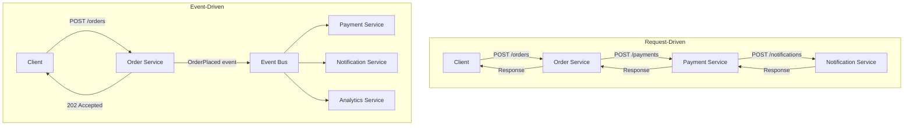
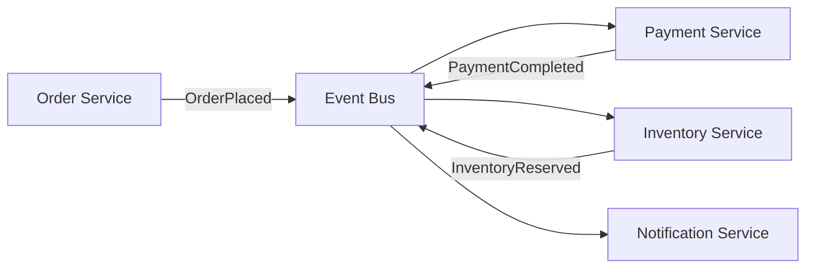
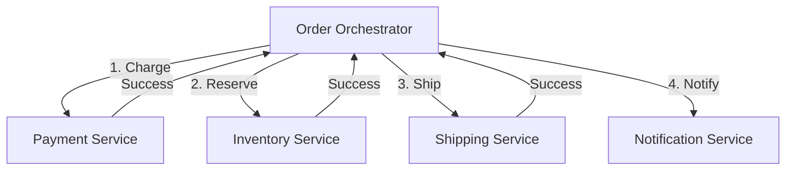
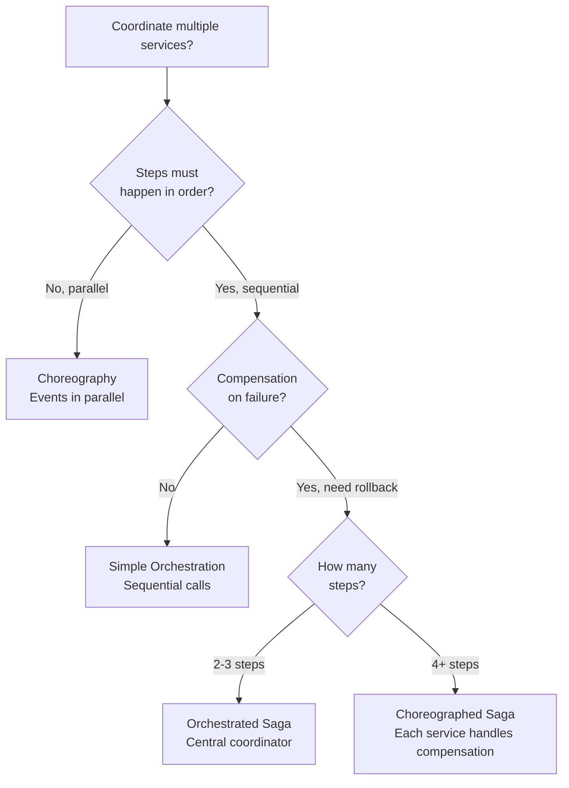
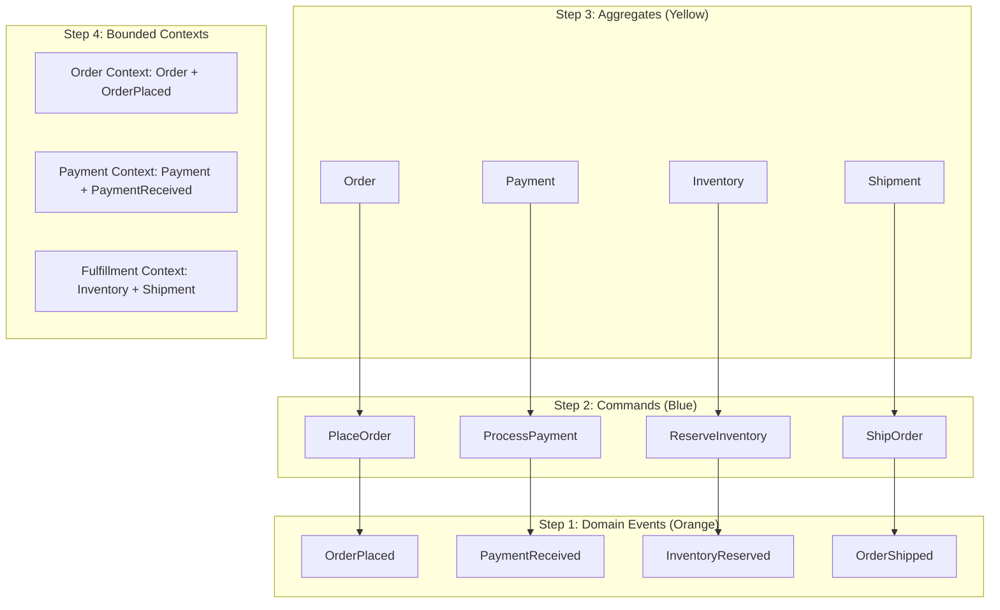
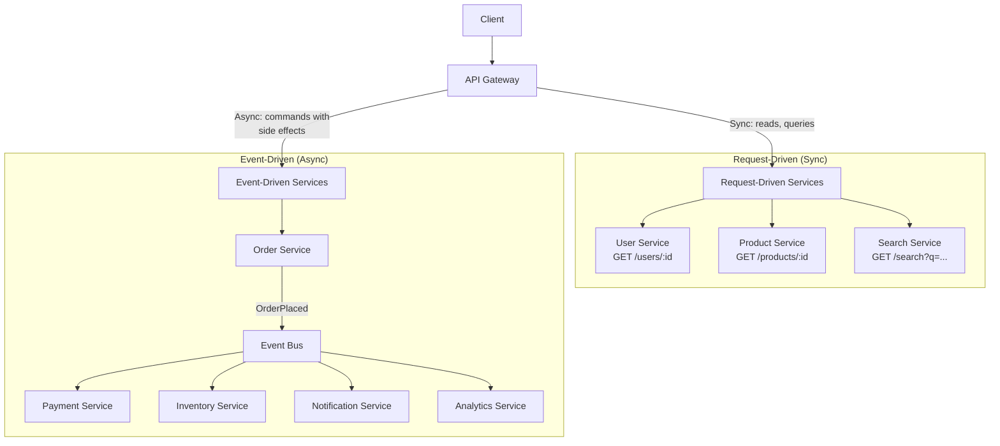

# Event-Driven vs Request-Driven

Request-driven architecture: Service A calls Service B and waits for a response. Simple, synchronous, and the default mental model for most developers. Event-driven architecture: Service A emits an event ("OrderPlaced") and does not care who listens. Services are decoupled in time, space, and failure. The right choice depends on your coupling tolerance, latency requirements, and team structure.

Most production systems use both. The question is not "which one" but "which one where."

## Side-by-Side Comparison



| Aspect | Request-Driven | Event-Driven |
|--------|---------------|-------------|
| Coupling | Tight (A knows B's API) | Loose (A does not know consumers) |
| Response time | Synchronous (sum of all calls) | Async (returns immediately) |
| Failure handling | Cascade (B down = A fails) | Isolated (B down = B catches up later) |
| Adding consumers | Change A to call C too | C subscribes to event (A unchanged) |
| Debugging | Follow the call chain | Trace through event logs |
| Consistency | Immediate (within transaction) | Eventual (events processed later) |
| Complexity | Lower (familiar pattern) | Higher (event schema, ordering, idempotency) |
| Testing | Unit test API calls | Need event infrastructure in tests |

## When Request-Driven Wins

Request-driven is the right choice when:

**1. You need an immediate response**
```python
# User checks their balance — they need the answer NOW
@app.route("/api/accounts/<account_id>/balance")
def get_balance(account_id):
    balance = account_service.get_balance(account_id)  # Sync call
    return {"balance": balance}
# Event-driven makes no sense here — the user is waiting
```

**2. The operation is a simple CRUD**
```python
# Create a user — straightforward, no downstream effects
@app.route("/api/users", methods=["POST"])
def create_user():
    user = user_service.create(request.json)
    return {"id": user.id}, 201
# Over-engineering: emit "UserCreated" event just to store in DB
```

**3. You need strong consistency**
```python
# Transfer money between accounts — both must succeed or fail
@app.route("/api/transfers", methods=["POST"])
def transfer():
    with db.transaction():
        debit(from_account, amount)
        credit(to_account, amount)
    return {"status": "completed"}
# Eventual consistency is unacceptable for financial transactions
```

**4. Small team (under 10 developers)**
- Everyone works in the same codebase
- The overhead of event infrastructure is not worth it
- Direct calls are easier to understand and debug

**5. Latency-sensitive reads**
- Search queries, autocomplete, real-time dashboards
- Cannot afford the latency of event processing

## When Event-Driven Wins

Event-driven is the right choice when:

**1. Multiple services need to react to the same event**
```python
# Order placed — 5 services need to know
class OrderService:
    async def place_order(self, order):
        order = await self.repository.save(order)

        # Request-driven: OrderService must know about ALL consumers
        # and call each one. Adding a new consumer = changing OrderService.
        await self.payment_service.charge(order)
        await self.inventory_service.reserve(order)
        await self.notification_service.notify(order)
        await self.analytics_service.track(order)
        await self.loyalty_service.add_points(order)

        # Event-driven: emit one event, consumers subscribe independently
        await self.event_bus.emit("OrderPlaced", order.to_event())
        # Adding a new consumer = deploying a new service. Zero changes to OrderService.
```

**2. You need resilience to downstream failures**
```python
# Notification service is down — should order creation fail?
# Request-driven: YES (unless you add complex error handling)
# Event-driven: NO (event stays in queue, processed when service recovers)
```

**3. Workloads have different scaling needs**
```
OrderService:      100 req/sec (writes)
PaymentService:    100 req/sec (matches orders)
NotificationService: 500 req/sec (sends email + push + SMS per order)
AnalyticsService:   10 req/sec (batch processing is fine)
```
Each service scales independently based on its own throughput.

**4. You want audit trails and replay**
```python
# Event log = complete history of everything that happened
# Replay events to:
# - Rebuild a service's state from scratch
# - Debug what happened last Tuesday at 3 PM
# - Populate a new service with historical data
```

**5. Cross-team boundaries**
Teams own their services. Events define the contract. Team A emits "OrderPlaced", Team B consumes it. Neither team depends on the other's release schedule.

## Choreography vs Orchestration

When using event-driven patterns, there are two coordination models.

### Choreography: Decentralized

Each service reacts to events independently. No central coordinator.



**Pros:** No single point of failure, services are truly independent, easy to add new consumers
**Cons:** Hard to understand the full flow, difficult to handle failures across steps, no central view of process state

### Orchestration: Centralized

A central orchestrator coordinates the workflow, calling services in order.



**Pros:** Easy to understand (one place shows the flow), centralized error handling, clear process visibility
**Cons:** Orchestrator is a single point of failure, tighter coupling, orchestrator must change when flow changes

### Decision Tree



## Saga Pattern for Distributed Transactions

In event-driven systems, you cannot use a database transaction across services. Sagas replace transactions with a sequence of local transactions + compensating actions.

```python
from dataclasses import dataclass
from enum import Enum
from typing import Callable, Optional


class SagaStepStatus(Enum):
    PENDING = "pending"
    COMPLETED = "completed"
    COMPENSATED = "compensated"
    FAILED = "failed"


@dataclass
class SagaStep:
    name: str
    action: Callable       # Forward action
    compensation: Callable  # Rollback action
    status: SagaStepStatus = SagaStepStatus.PENDING


class SagaOrchestrator:
    """Orchestrated saga with compensation on failure."""

    def __init__(self, saga_id: str, steps: list[SagaStep]):
        self.saga_id = saga_id
        self.steps = steps

    async def execute(self) -> bool:
        """Execute saga steps. Compensate on failure."""
        completed_steps = []

        for step in self.steps:
            try:
                await step.action()
                step.status = SagaStepStatus.COMPLETED
                completed_steps.append(step)
            except Exception as e:
                step.status = SagaStepStatus.FAILED
                # Compensate in reverse order
                await self._compensate(completed_steps)
                return False

        return True

    async def _compensate(self, completed_steps: list[SagaStep]):
        """Run compensating actions in reverse order."""
        for step in reversed(completed_steps):
            try:
                await step.compensation()
                step.status = SagaStepStatus.COMPENSATED
            except Exception as e:
                # Compensation failed — needs manual intervention
                step.status = SagaStepStatus.FAILED
                # Alert operations team


# Usage: Order processing saga
saga = SagaOrchestrator(
    saga_id="order_123",
    steps=[
        SagaStep(
            name="reserve_inventory",
            action=lambda: inventory_service.reserve("prod_456", qty=1),
            compensation=lambda: inventory_service.release("prod_456", qty=1)
        ),
        SagaStep(
            name="charge_payment",
            action=lambda: payment_service.charge("user_789", amount=99.99),
            compensation=lambda: payment_service.refund("user_789", amount=99.99)
        ),
        SagaStep(
            name="create_shipment",
            action=lambda: shipping_service.create("order_123"),
            compensation=lambda: shipping_service.cancel("order_123")
        ),
    ]
)
```

## Event Storming

Event storming is a workshop methodology for discovering domain events and designing event-driven architectures.

### The Process



| Step | Activity | Output |
|------|----------|--------|
| 1. Domain events | Brainstorm all events (past tense) | Orange sticky notes |
| 2. Timeline | Arrange events in order | Temporal flow |
| 3. Commands | What triggers each event? | Blue sticky notes |
| 4. Aggregates | Which entity processes the command? | Yellow sticky notes |
| 5. Bounded contexts | Group related aggregates | Service boundaries |
| 6. Policies | Automatic reactions (event -> command) | Lilac sticky notes |

## Eventual Consistency Implications

Event-driven systems are eventually consistent by nature. A user creates an order, but the inventory might not be reserved for another 500ms. You must design for this.

### Patterns for Handling Eventual Consistency

| Pattern | How It Works | Use Case |
|---------|-------------|----------|
| Optimistic UI | Show success immediately, reconcile later | "Your order is being processed" |
| Polling | Client checks status periodically | Order status page |
| WebSocket push | Server pushes updates when processing completes | Real-time status updates |
| Compensation | Undo if downstream processing fails | Refund if inventory is out |
| Read-your-writes | Route reads to the write source | User sees their own post immediately |

```python
class EventuallyConsistentOrderAPI:
    """Handle eventual consistency in order creation."""

    async def create_order(self, order_data):
        # Step 1: Create order in PENDING state
        order = await self.order_repo.create(
            status="PENDING",
            **order_data
        )

        # Step 2: Emit event (async processing begins)
        await self.event_bus.emit("OrderPlaced", {
            "order_id": order.id,
            "items": order_data["items"],
            "user_id": order_data["user_id"],
        })

        # Step 3: Return immediately with PENDING status
        return {
            "order_id": order.id,
            "status": "PENDING",
            "message": "Order is being processed",
            "status_url": f"/api/orders/{order.id}/status"
        }

    async def get_order_status(self, order_id):
        """Poll endpoint for order status."""
        order = await self.order_repo.get(order_id)
        return {
            "order_id": order.id,
            "status": order.status,
            # PENDING -> PAYMENT_PROCESSING -> CONFIRMED -> SHIPPED
            "updated_at": order.updated_at.isoformat()
        }
```

## Hybrid Architecture: The Pragmatic Approach



### When to Use Each (Decision Guide)

| Scenario | Use Request-Driven | Use Event-Driven |
|----------|-------------------|------------------|
| User needs an immediate answer | Yes | No |
| Simple CRUD operation | Yes | No |
| Multiple consumers need to react | No | Yes |
| Downstream failure should not block caller | No | Yes |
| Need audit trail / replay | No | Yes |
| Strong consistency required | Yes | No |
| Cross-team boundaries | Either | Preferred |
| Latency-critical reads | Yes | No |
| High fanout (1 event -> many reactions) | No | Yes |
| Workflow with compensation | No | Yes (Saga) |

## Anti-Patterns

| Anti-Pattern | Problem | Fix |
|-------------|---------|-----|
| Event soup | Every tiny action emits an event | Only emit meaningful domain events |
| God orchestrator | One service orchestrates everything | Break into bounded context sagas |
| Sync over async | Using events but blocking for response | Accept eventual consistency or use sync |
| Missing idempotency | Duplicate events cause duplicate side effects | Idempotency keys on all consumers |
| Event schema chaos | Events change without versioning | Event schema registry + versioning |
| Distributed monolith | Services share a database via events | Each service owns its data |

## Cross-References

- [Communication Patterns](/system-design/patterns/communication-patterns) — sync vs async protocols
- [Kafka Internals](/system-design/message-queues/kafka-internals) — event streaming infrastructure
- [Distributed Transactions](/system-design/distributed-systems/distributed-transactions) — saga pattern deep dive
- [Consistency Patterns](/system-design/patterns/consistency-patterns) — eventual consistency models
- [Microservices vs Monolith](/system-design/patterns/microservices-vs-monolith) — architectural context
- [Notification Patterns](/system-design/patterns/notification-patterns) — event-driven notifications

---

*The question is not "event-driven or request-driven" — it is "event-driven where and request-driven where." Use events for side effects and decoupling. Use requests for queries and immediate responses. The art is finding the boundary.*

## Real-World Examples

::: tip Amazon
Amazon's order processing is **event-driven**. When a customer places an order, the Order Service emits an "OrderPlaced" event. Payment, Inventory, Shipping, Notifications, and Analytics services each independently consume this event. This lets each team own their service and scale independently — Amazon deploys code every 11.7 seconds across hundreds of teams, which would be impossible with synchronous chains.
:::

::: tip Uber
Uber uses a **hybrid approach**. Ride matching is request-driven — when a rider requests a ride, the system needs an immediate answer about driver availability. But downstream operations (trip analytics, driver payments, receipt generation, surge pricing recalculation) are all event-driven through Kafka. This keeps the user-facing flow fast while decoupling complex background processing.
:::

::: tip Segment
Segment processes **billions of events per day** using an event-driven architecture. Customer data events ("User Signed Up," "Page Viewed") flow through their event pipeline and are fanned out to 300+ integration partners (analytics, marketing, advertising tools). Adding a new integration requires zero changes to the event producer — the new integration simply subscribes to the relevant event topics.
:::

## Interview Tip

::: tip What to say
"I use request-driven for queries that need immediate answers and event-driven for side effects and fan-out. When a user creates an order, I need to validate and respond synchronously — that's request-driven. But sending confirmation emails, updating analytics, reserving inventory, and notifying the warehouse are all side effects that can happen asynchronously via events. The key benefit of events is extensibility: adding a new consumer (loyalty points, fraud detection) requires zero changes to the order service. The trade-off is eventual consistency — I'd handle this with optimistic UI (show 'processing' immediately) and status polling or WebSocket push for completion. Amazon's architecture proves this scales — they deploy every 11.7 seconds because services are decoupled through events."
:::
