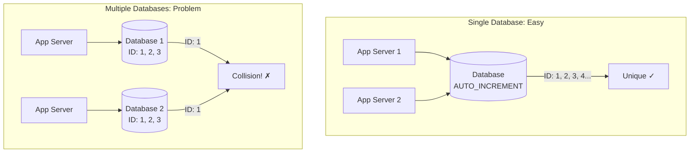
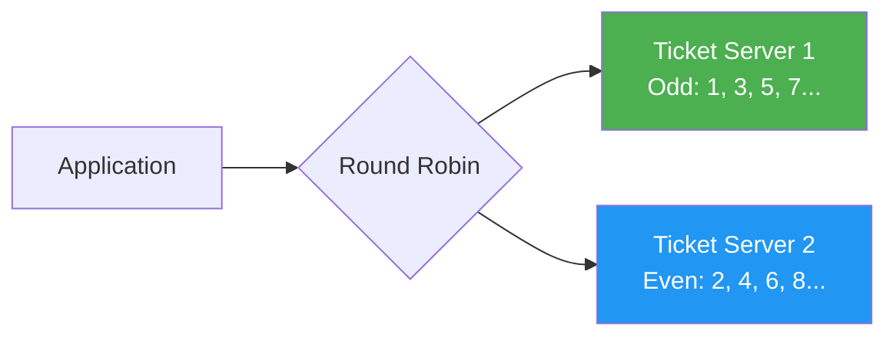
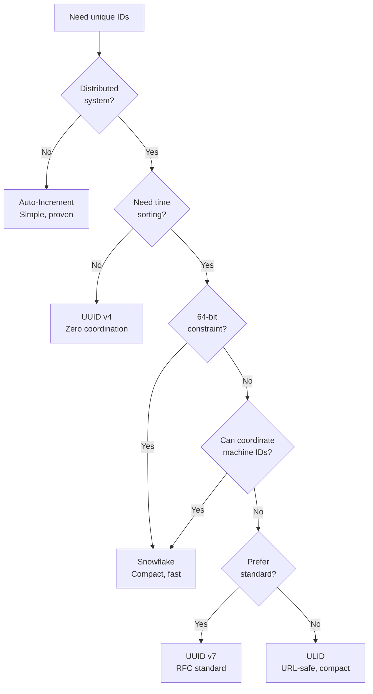

# Distributed ID Generation

Every record needs a unique identifier. In a single-database system, `AUTO_INCREMENT` works perfectly. In distributed systems with multiple databases, services, and data centers, generating globally unique IDs without coordination is a fundamental challenge. The ID generation strategy you choose affects performance, sortability, storage efficiency, and even security.

## Why Auto-Increment Fails at Scale



| Problem | Description |
|---------|-------------|
| Single point of failure | One DB generates all IDs — if it goes down, nothing gets an ID |
| Throughput bottleneck | All services must call the same DB for IDs |
| Collision on sharding | Two shards independently generate the same ID |
| Information leakage | Sequential IDs reveal total count and creation rate |
| Merge conflicts | Cannot merge data from independent databases |

## UUID (Universally Unique Identifier)

UUIDs are 128-bit identifiers that can be generated anywhere without coordination. The probability of collision is astronomically low.

### UUID v4 (Random)

```
550e8400-e29b-41d4-a716-446655440000
^^^^^^^^ ^^^^ ^^^^ ^^^^ ^^^^^^^^^^^^
 random  rand ver  var    random
```

```python
import uuid

# UUID v4: 122 random bits, 6 bits for version/variant
id1 = uuid.uuid4()
print(id1)  # e.g., 7c9e6679-7425-40de-944b-e07fc1f90ae7

# Properties
print(f"Version: {id1.version}")  # 4
print(f"Bytes: {len(id1.bytes)}")  # 16 bytes = 128 bits
print(f"String length: {len(str(id1))}")  # 36 chars (with hyphens)
```

**Pros:** No coordination needed, universally unique, simple
**Cons:** Not sortable by time, poor index performance (random inserts into B-tree), 36 chars as string, no embedded metadata

### UUID v7 (Time-Ordered, RFC 9562)

UUID v7 is the modern answer. It embeds a Unix timestamp in the most significant bits, making it naturally sortable by creation time while maintaining uniqueness.

```
018e5c2e-9b3a-7def-8123-456789abcdef
^^^^^^^^ ^^^^ ^^^^ ^^^^ ^^^^^^^^^^^^
 unix_ms  ms  ver  var   random
```

```python
import time
import os
import struct


def uuid_v7() -> str:
    """Generate a UUID v7 (time-ordered, RFC 9562)."""
    # 48-bit Unix timestamp in milliseconds
    timestamp_ms = int(time.time() * 1000)
    ts_bytes = struct.pack(">Q", timestamp_ms)[2:]  # 6 bytes

    # 10 bytes of randomness
    rand_bytes = bytearray(os.urandom(10))

    # Set version (7) in bits 48-51
    rand_bytes[0] = (rand_bytes[0] & 0x0F) | 0x70

    # Set variant (10) in bits 64-65
    rand_bytes[2] = (rand_bytes[2] & 0x3F) | 0x80

    raw = ts_bytes + bytes(rand_bytes)

    # Format as UUID string
    hex_str = raw.hex()
    return f"{hex_str[:8]}-{hex_str[8:12]}-{hex_str[12:16]}-{hex_str[16:20]}-{hex_str[20:]}"


# Generate time-ordered UUIDs
ids = [uuid_v7() for _ in range(5)]
for id in ids:
    print(id)
# They sort lexicographically by creation time!
assert ids == sorted(ids)
```

## Twitter Snowflake

Twitter Snowflake generates 64-bit IDs that are time-ordered, unique across data centers, and can be generated without coordination. This is the most influential ID generation scheme in distributed systems.

### Bit Layout

```
 0                   1                   2                   3
 0 1 2 3 4 5 6 7 8 9 0 1 2 3 4 5 6 7 8 9 0 1 2 3 4 5 6 7 8 9 0 1
+-+-+-+-+-+-+-+-+-+-+-+-+-+-+-+-+-+-+-+-+-+-+-+-+-+-+-+-+-+-+-+-+
|0|                    Timestamp (41 bits)                       |
+-+-+-+-+-+-+-+-+-+-+-+-+-+-+-+-+-+-+-+-+-+-+-+-+-+-+-+-+-+-+-+-+
|     Timestamp    | Datacenter | Machine  |    Sequence (12)    |
|     (continued)  |  ID (5)    | ID (5)   |                     |
+-+-+-+-+-+-+-+-+-+-+-+-+-+-+-+-+-+-+-+-+-+-+-+-+-+-+-+-+-+-+-+-+

Bit allocation:
- 1 bit:  Sign (always 0)
- 41 bits: Timestamp (ms since custom epoch) — ~69 years
- 5 bits:  Datacenter ID (0-31)
- 5 bits:  Machine ID (0-31)
- 12 bits: Sequence number (0-4095 per ms)

Max IDs per machine per second: 4,096 * 1,000 = 4,096,000
```

```python
import time
import threading


class SnowflakeGenerator:
    """Twitter Snowflake ID generator."""

    # Custom epoch: 2024-01-01T00:00:00Z
    EPOCH = 1704067200000

    TIMESTAMP_BITS = 41
    DATACENTER_BITS = 5
    MACHINE_BITS = 5
    SEQUENCE_BITS = 12

    MAX_DATACENTER_ID = (1 << DATACENTER_BITS) - 1   # 31
    MAX_MACHINE_ID = (1 << MACHINE_BITS) - 1          # 31
    MAX_SEQUENCE = (1 << SEQUENCE_BITS) - 1            # 4095

    def __init__(self, datacenter_id: int, machine_id: int):
        if datacenter_id > self.MAX_DATACENTER_ID or datacenter_id < 0:
            raise ValueError(f"Datacenter ID must be 0-{self.MAX_DATACENTER_ID}")
        if machine_id > self.MAX_MACHINE_ID or machine_id < 0:
            raise ValueError(f"Machine ID must be 0-{self.MAX_MACHINE_ID}")

        self.datacenter_id = datacenter_id
        self.machine_id = machine_id
        self.sequence = 0
        self.last_timestamp = -1
        self.lock = threading.Lock()

    def generate(self) -> int:
        with self.lock:
            timestamp = self._current_time()

            if timestamp < self.last_timestamp:
                raise Exception("Clock moved backwards!")

            if timestamp == self.last_timestamp:
                self.sequence = (self.sequence + 1) & self.MAX_SEQUENCE
                if self.sequence == 0:
                    # Sequence exhausted in this ms, wait for next ms
                    timestamp = self._wait_next_ms(self.last_timestamp)
            else:
                self.sequence = 0

            self.last_timestamp = timestamp

            return (
                ((timestamp - self.EPOCH) << (self.DATACENTER_BITS + self.MACHINE_BITS + self.SEQUENCE_BITS))
                | (self.datacenter_id << (self.MACHINE_BITS + self.SEQUENCE_BITS))
                | (self.machine_id << self.SEQUENCE_BITS)
                | self.sequence
            )

    def _current_time(self) -> int:
        return int(time.time() * 1000)

    def _wait_next_ms(self, last_ts: int) -> int:
        ts = self._current_time()
        while ts <= last_ts:
            ts = self._current_time()
        return ts

    @staticmethod
    def parse(snowflake_id: int) -> dict:
        """Extract components from a Snowflake ID."""
        sequence = snowflake_id & 0xFFF
        machine_id = (snowflake_id >> 12) & 0x1F
        datacenter_id = (snowflake_id >> 17) & 0x1F
        timestamp = (snowflake_id >> 22) + SnowflakeGenerator.EPOCH
        return {
            "timestamp": timestamp,
            "datacenter_id": datacenter_id,
            "machine_id": machine_id,
            "sequence": sequence,
            "datetime": time.strftime(
                "%Y-%m-%d %H:%M:%S",
                time.gmtime(timestamp / 1000)
            ),
        }


# Usage
gen = SnowflakeGenerator(datacenter_id=1, machine_id=5)
id1 = gen.generate()
id2 = gen.generate()
print(f"ID: {id1}")                         # e.g., 7189462532997120005
print(f"Parsed: {gen.parse(id1)}")          # Shows timestamp, dc, machine, seq
print(f"Time ordered: {id1 < id2}")         # True
print(f"Fits in 64-bit int: {id1 < 2**63}")  # True
```

### Go Implementation

```go
package snowflake

import (
	"errors"
	"sync"
	"time"
)

const (
	epoch            = int64(1704067200000) // 2024-01-01T00:00:00Z
	datacenterBits   = 5
	machineBits      = 5
	sequenceBits     = 12
	maxDatacenterID  = -1 ^ (-1 << datacenterBits)
	maxMachineID     = -1 ^ (-1 << machineBits)
	maxSequence      = -1 ^ (-1 << sequenceBits)
	machineShift     = sequenceBits
	datacenterShift  = sequenceBits + machineBits
	timestampShift   = sequenceBits + machineBits + datacenterBits
)

type Generator struct {
	mu            sync.Mutex
	datacenterID  int64
	machineID     int64
	sequence      int64
	lastTimestamp int64
}

func New(datacenterID, machineID int64) (*Generator, error) {
	if datacenterID < 0 || datacenterID > maxDatacenterID {
		return nil, errors.New("datacenter ID out of range")
	}
	if machineID < 0 || machineID > maxMachineID {
		return nil, errors.New("machine ID out of range")
	}
	return &Generator{
		datacenterID: datacenterID,
		machineID:    machineID,
	}, nil
}

func (g *Generator) Generate() (int64, error) {
	g.mu.Lock()
	defer g.mu.Unlock()

	now := time.Now().UnixMilli()

	if now < g.lastTimestamp {
		return 0, errors.New("clock moved backwards")
	}

	if now == g.lastTimestamp {
		g.sequence = (g.sequence + 1) & maxSequence
		if g.sequence == 0 {
			for now <= g.lastTimestamp {
				now = time.Now().UnixMilli()
			}
		}
	} else {
		g.sequence = 0
	}

	g.lastTimestamp = now

	id := ((now - epoch) << timestampShift) |
		(g.datacenterID << datacenterShift) |
		(g.machineID << machineShift) |
		g.sequence

	return id, nil
}
```

## ULID (Universally Unique Lexicographically Sortable Identifier)

ULID combines timestamp ordering with randomness in a URL-safe format.

```
 01AN4Z07BY      79KA1307SR9X4MV3
|----------|    |----------------|
 Timestamp          Randomness
  48 bits            80 bits
  10 chars           16 chars
```

```python
import os
import time
import struct

# Crockford's Base32 encoding
ENCODING = "0123456789ABCDEFGHJKMNPQRSTVWXYZ"


def generate_ulid() -> str:
    """Generate a ULID: 48-bit timestamp + 80-bit random."""
    timestamp_ms = int(time.time() * 1000)

    # Encode timestamp (48 bits -> 10 chars)
    ts_chars = []
    for _ in range(10):
        ts_chars.append(ENCODING[timestamp_ms & 0x1F])
        timestamp_ms >>= 5
    ts_part = "".join(reversed(ts_chars))

    # Encode randomness (80 bits -> 16 chars)
    rand_bytes = int.from_bytes(os.urandom(10), "big")
    rand_chars = []
    for _ in range(16):
        rand_chars.append(ENCODING[rand_bytes & 0x1F])
        rand_bytes >>= 5
    rand_part = "".join(reversed(rand_chars))

    return ts_part + rand_part


# ULIDs sort lexicographically by time
ids = [generate_ulid() for _ in range(5)]
print(ids)
assert ids == sorted(ids)  # Time-ordered!

# Properties:
# - 26 characters (vs 36 for UUID)
# - Case-insensitive
# - No special characters (URL-safe)
# - Monotonic within same millisecond (if implemented correctly)
# - 128 bits total (same as UUID)
```

## Instagram ID Scheme

Instagram needed IDs that are:
- Time-ordered (for feed sorting)
- Generated across multiple PostgreSQL shards
- 64-bit (fit in a bigint column)

Their solution: a custom scheme similar to Snowflake but using PostgreSQL sequences.

```sql
-- Instagram's ID generation using PostgreSQL
-- Each shard has its own sequence, ensuring uniqueness

CREATE SCHEMA IF NOT EXISTS insta5;

CREATE SEQUENCE insta5.table_id_seq;

CREATE OR REPLACE FUNCTION insta5.next_id(OUT result bigint) AS $$
DECLARE
    our_epoch bigint := 1314220021721;  -- Instagram epoch
    seq_id bigint;
    now_millis bigint;
    shard_id int := 5;  -- This shard's ID
BEGIN
    SELECT nextval('insta5.table_id_seq') INTO seq_id;
    SELECT FLOOR(EXTRACT(EPOCH FROM clock_timestamp()) * 1000) INTO now_millis;

    result := (now_millis - our_epoch) << 23;   -- 41 bits timestamp
    result := result | (shard_id << 10);         -- 13 bits shard ID
    result := result | (seq_id & 1023);          -- 10 bits sequence
END;
$$ LANGUAGE PLPGSQL;

-- Usage:
-- INSERT INTO photos (id, ...) VALUES (insta5.next_id(), ...);
```

**Bit layout:**
- 41 bits: Timestamp (ms since custom epoch) — ~69 years
- 13 bits: Shard ID (0-8191 logical shards)
- 10 bits: Sequence (0-1023 per ms per shard)

## Flickr Ticket Servers

Flickr uses dedicated "ticket server" databases that do nothing but generate sequential IDs. Two servers for redundancy, using MySQL's auto-increment with different offsets.

```sql
-- Ticket Server 1: generates odd numbers
-- auto_increment_increment = 2
-- auto_increment_offset = 1
-- IDs: 1, 3, 5, 7, 9, ...

-- Ticket Server 2: generates even numbers
-- auto_increment_increment = 2
-- auto_increment_offset = 2
-- IDs: 2, 4, 6, 8, 10, ...

CREATE TABLE tickets_64 (
    id BIGINT NOT NULL AUTO_INCREMENT,
    stub CHAR(1) NOT NULL DEFAULT '',
    PRIMARY KEY (id),
    UNIQUE KEY stub (stub)
) ENGINE=InnoDB;

-- Get next ID:
REPLACE INTO tickets_64 (stub) VALUES ('a');
SELECT LAST_INSERT_ID();
```



**Pros:** Simple, sequential, proven
**Cons:** Single point of coordination (even with two servers), network hop required, not truly distributed

## Comprehensive Comparison

| Scheme | Size | Sortable | Coordination | Speed | Info Leakage | Index Performance |
|--------|------|----------|-------------|-------|-------------|------------------|
| Auto-increment | 32/64 bit | Yes | Single DB | High | High (count visible) | Excellent |
| UUID v4 | 128 bit | No | None | High | None | Poor (random B-tree inserts) |
| UUID v7 | 128 bit | Yes (time) | None | High | Minimal (time only) | Good (sequential) |
| Snowflake | 64 bit | Yes (time) | Machine ID assignment | Very high | Low (time, DC) | Excellent |
| ULID | 128 bit | Yes (time) | None | High | Minimal (time only) | Good |
| Instagram | 64 bit | Yes (time) | Shard sequence | High | Low (time, shard) | Excellent |
| Flickr tickets | 64 bit | Yes | Ticket servers | Medium | High (sequential) | Excellent |
| NanoID | Variable | No | None | High | None | Poor |

## Choosing the Right Strategy



## Implementation Considerations

### Clock Skew Handling

Snowflake-style IDs depend on monotonic clocks. If the clock jumps backward (NTP correction, VM migration), you can generate duplicate IDs.

```python
class ClockSkewSafeGenerator:
    """Handle clock skew in Snowflake-style ID generation."""

    def __init__(self, machine_id: int):
        self.machine_id = machine_id
        self.sequence = 0
        self.last_timestamp = 0

    def generate(self) -> int:
        current_ts = self._current_time_ms()

        if current_ts < self.last_timestamp:
            # Clock went backward!
            skew_ms = self.last_timestamp - current_ts

            if skew_ms < 5:
                # Small skew: wait it out
                import time
                time.sleep(skew_ms / 1000.0)
                current_ts = self._current_time_ms()
            else:
                # Large skew: use last timestamp + increment
                current_ts = self.last_timestamp

        # ... rest of generation logic
        self.last_timestamp = current_ts
        return self._build_id(current_ts)

    def _current_time_ms(self) -> int:
        import time
        return int(time.time() * 1000)

    def _build_id(self, timestamp: int) -> int:
        # Simplified Snowflake ID assembly
        self.sequence = (self.sequence + 1) & 0xFFF
        return (timestamp << 22) | (self.machine_id << 12) | self.sequence
```

### Database Index Performance

```sql
-- UUID v4: Random inserts fragment the B-tree index
-- Each insert may go to a random page, causing cache misses and page splits
CREATE TABLE users_v4 (
    id UUID DEFAULT gen_random_uuid() PRIMARY KEY,
    name TEXT
);
-- Insert performance degrades as table grows

-- UUID v7 / Snowflake: Sequential inserts are index-friendly
-- New IDs always go to the end of the B-tree (append-only pattern)
CREATE TABLE users_v7 (
    id BIGINT PRIMARY KEY,  -- Snowflake ID
    name TEXT
);
-- Insert performance remains constant

-- Benchmark results (1M rows, PostgreSQL 16):
-- UUID v4 inserts: ~8,000/sec (degrades to ~3,000/sec at 10M rows)
-- Snowflake inserts: ~25,000/sec (consistent at any table size)
```

## Cross-References

- [Distributed Systems](/system-design/distributed-systems/) — context for distributed coordination challenges
- [Data Partitioning](/system-design/patterns/data-partitioning) — how IDs relate to partition keys
- [Database Indexing](/system-design/databases/indexing-deep-dive) — B-tree performance with different ID types
- [Consistent Hashing](/system-design/distributed-systems/consistent-hashing) — hash-based distribution
- [Scalability Patterns](/system-design/patterns/scalability-patterns) — scaling ID generation

---

*Choose the simplest ID scheme that meets your requirements. If you are on a single database, auto-increment is fine. If you need distributed uniqueness without time ordering, UUID v4 is the zero-coordination choice. If you need time ordering, UUID v7 is the modern standard. Only reach for Snowflake if you need 64-bit IDs at massive scale.*
