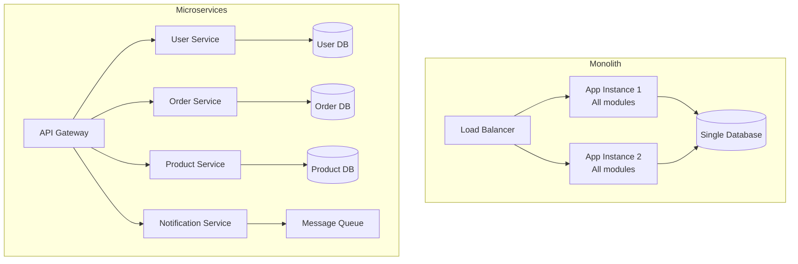
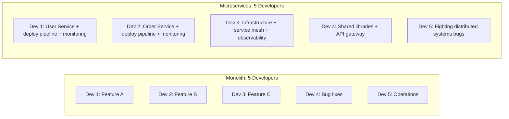
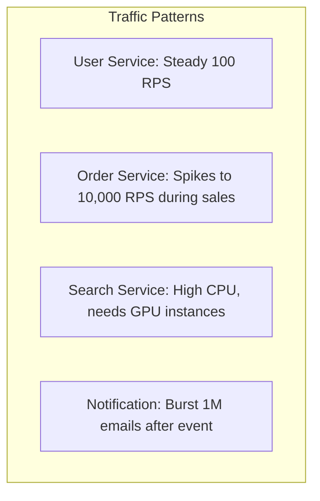
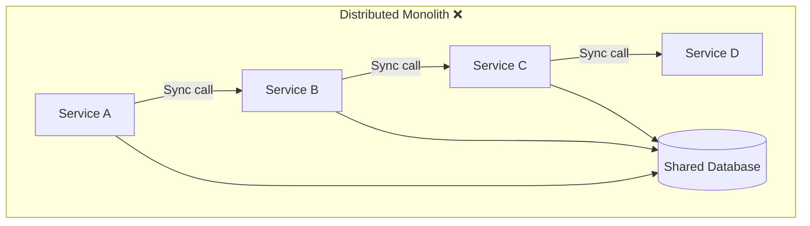
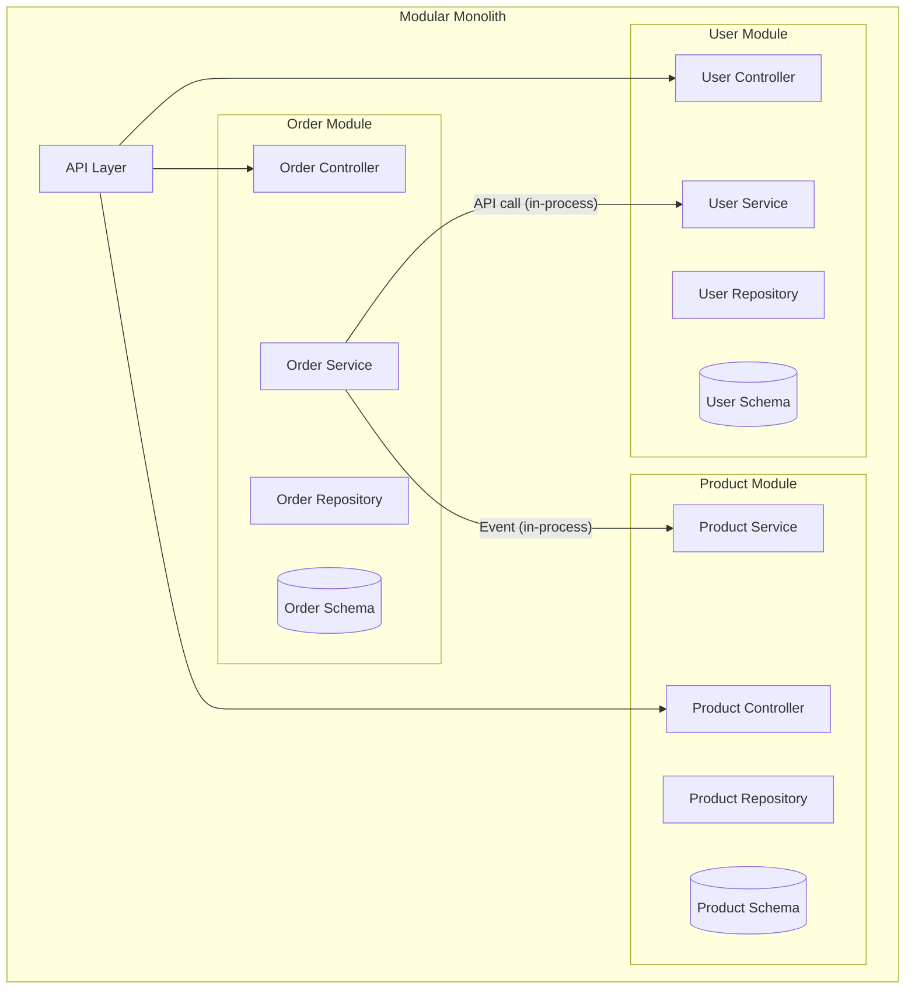
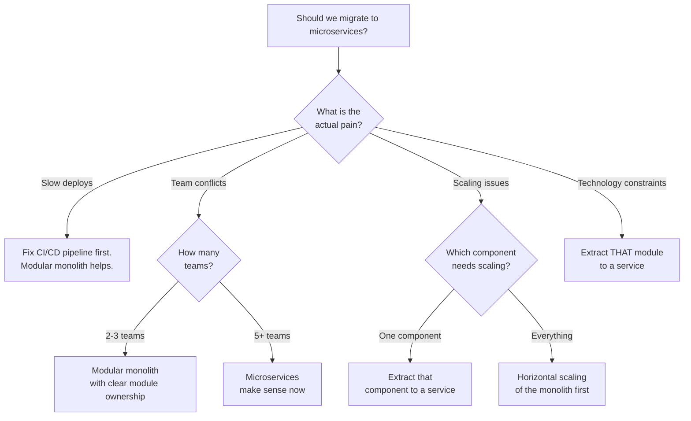
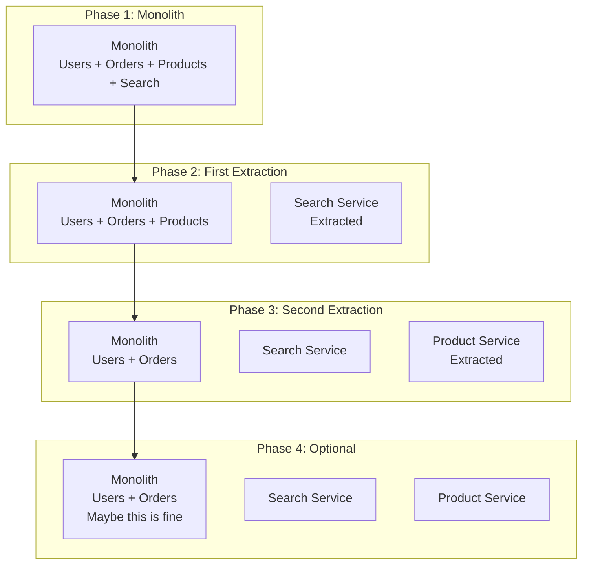
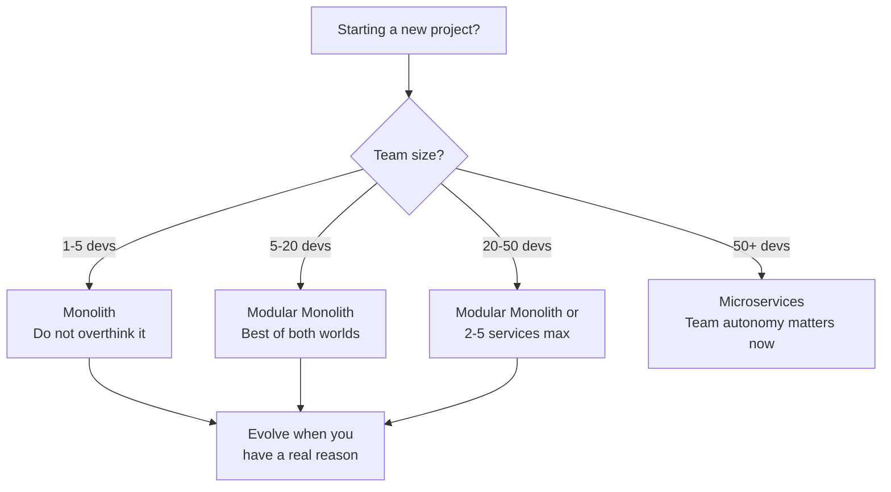

# Microservices vs Monolith

This is the most debated topic in software architecture, and most of the debate misses the point. Microservices are not inherently better than monoliths. Monoliths are not inherently simpler than microservices. The right architecture depends on your team size, organizational structure, domain complexity, and operational maturity. This page gives you an honest framework for deciding.

## Architecture Comparison



| Aspect | Monolith | Microservices |
|--------|----------|--------------|
| Deployment | One artifact, one deploy | Many artifacts, independent deploys |
| Latency | In-process function calls (~ns) | Network calls (~ms) |
| Data consistency | ACID transactions | Eventual consistency + sagas |
| Debugging | One process, step through code | Distributed tracing, correlation IDs |
| Testing | Run one thing | Integration tests need multiple services |
| Scaling | Scale everything together | Scale each service independently |
| Technology diversity | One stack | Different languages/frameworks per service |
| Team autonomy | Everyone in one repo | Teams own their services |
| Operational complexity | Low | High (service mesh, observability, deployment) |
| Development speed (small team) | Fast | Slow (infrastructure overhead) |
| Development speed (large org) | Slow (merge conflicts, coordination) | Fast (team independence) |

## When the Monolith Wins

### 1. Small Team (Under 10 Developers)

Amazon, Netflix, and Uber use microservices because they have thousands of engineers. You probably do not. A small team running microservices spends more time on infrastructure than on features.



### 2. You Do Not Need Independent Scaling

If all parts of your application have similar load characteristics, scaling them independently adds complexity without benefit.

### 3. You Need Strong Consistency

Microservices with separate databases means you cannot use ACID transactions across services. If your domain requires multi-table transactions (financial systems, inventory management), a monolith with a single database is far simpler.

```python
# Monolith: Simple, ACID-compliant
class OrderService:
    def place_order(self, order):
        with db.transaction():
            order = self.order_repo.create(order)
            self.inventory_repo.reserve(order.items)
            self.payment_repo.charge(order.user_id, order.total)
            self.notification_repo.queue(order.user_id, "Order confirmed")
        # All succeed or all fail — trivial

# Microservices: Complex, eventually consistent
class OrderService:
    async def place_order(self, order):
        order = await self.order_repo.create(order, status="PENDING")
        await self.event_bus.emit("OrderPlaced", order)
        # What if payment fails? Need a saga with compensation.
        # What if inventory is reserved but payment times out?
        # What if notification service is down?
        # Each failure mode needs explicit handling.
```

### 4. Early Stage Product

Your product will pivot. Your domain model will change. In a monolith, refactoring is renaming a method and moving a file. In microservices, refactoring is migrating data between databases and updating API contracts across services.

### 5. Operational Maturity is Low

Microservices require: container orchestration, service discovery, distributed tracing, centralized logging, circuit breakers, health checks, deployment pipelines per service, and on-call rotation. If you do not have these, you will have outages.

## When Microservices Win

### 1. Large Organization (50+ Developers)

Conway's Law: system architecture mirrors organizational communication structure. If you have 10 teams, they will naturally create 10 services.

### 2. Independent Deployment is Critical

"We cannot deploy the order feature because the user team is not ready" — microservices eliminate this coupling.

### 3. Different Scaling Requirements



### 4. Technology Diversity Needed

ML team needs Python. Core platform is Java. Real-time features need Go. Microservices let each team use the right tool.

### 5. Fault Isolation Required

Product search going down should not prevent users from logging in. Microservices isolate failures to individual services.

## The Distributed Monolith Anti-Pattern

The worst of both worlds: you pay the operational cost of microservices but get none of the benefits because your services are still tightly coupled.



**Symptoms of a distributed monolith:**
- Services share a database (no schema isolation)
- Deploy order matters ("deploy B before A")
- Cascading failures (A down = B down = C down)
- Cannot deploy services independently
- Shared libraries with business logic
- Chatty synchronous communication between services

```python
# Distributed monolith: Service A directly queries Service B's tables
class OrderServiceBAD:
    def get_order_with_user(self, order_id):
        order = self.db.query("SELECT * FROM orders WHERE id = %s", order_id)
        # BAD: Reaching into user service's database
        user = self.db.query("SELECT * FROM users WHERE id = %s", order.user_id)
        return {**order, "user": user}

# Proper microservice: Service A calls Service B's API
class OrderServiceGOOD:
    def get_order_with_user(self, order_id):
        order = self.order_repo.get(order_id)  # Own database
        user = self.user_client.get_user(order.user_id)  # API call
        return {**order, "user": user}
```

## Modular Monolith: The Middle Ground

A modular monolith gives you the development simplicity of a monolith with the organizational benefits of microservices. Modules are well-defined boundaries within a single deployment unit.



```java
// Spring Modulith example — enforced module boundaries
// Each module has its own package, repository, and events

// Module: orders
@ApplicationModule(
    allowedDependencies = {"users::api", "products::api"}
)
package com.app.orders;

// Order module can only access user and product modules through their APIs
@Service
public class OrderService {

    private final UserApi userApi;     // Interface from user module
    private final ProductApi productApi;  // Interface from product module
    private final OrderRepository orderRepo;
    private final ApplicationEventPublisher events;

    public Order placeOrder(PlaceOrderCommand cmd) {
        // In-process call to user module API (not database!)
        User user = userApi.findById(cmd.userId());

        // In-process call to product module API
        Product product = productApi.findById(cmd.productId());

        Order order = new Order(user.id(), product.id(), cmd.quantity());
        orderRepo.save(order);

        // Publish domain event — other modules react
        events.publishEvent(new OrderPlacedEvent(order.id()));

        return order;
    }
}

// Module: users (exposes API interface)
package com.app.users.api;

public interface UserApi {
    User findById(UserId id);
}

// Spring Modulith enforces these boundaries at test time:
@ModularityTest
class ModularityTests {
    @Test
    void verifyModularity(ApplicationModules modules) {
        modules.verify();
        // Fails if orders module directly imports users.internal classes
    }
}
```

For a deep dive into Spring Modulith, see our [Spring Modulith](/spring-boot/modulith) page.

### Modular Monolith Benefits

| Benefit | How |
|---------|-----|
| Module independence | Enforced API boundaries between modules |
| Easy refactoring | Rename/move within a module without affecting others |
| Simple deployment | One artifact, one process |
| ACID transactions | Single database, cross-module transactions work |
| Path to microservices | Extract a module to a service when needed |
| Low ops overhead | One deployment pipeline, one monitoring setup |

## Migration Decision Tree



### The Strangler Fig Migration Pattern

Never do a big-bang rewrite. Incrementally extract services from the monolith, one at a time.



**Key insight:** You might stop at Phase 2 or 3. You do not need to extract everything. Extract what has a clear reason to be separate.

### Extraction Checklist

Before extracting a module to a service, confirm:

- [ ] The module has clear, stable API boundaries
- [ ] The module has its own data (no shared tables)
- [ ] You have deployment infrastructure (CI/CD, monitoring)
- [ ] The team has experience operating distributed systems
- [ ] There is a real benefit (scaling, team autonomy, tech diversity)
- [ ] You understand the consistency implications (no more ACID across modules)
- [ ] You have distributed tracing and centralized logging

## Real-World Architecture Choices

| Company | Architecture | Why |
|---------|-------------|-----|
| Shopify | Modular monolith (Ruby on Rails) | One repo, 1000+ developers, module boundaries enforced |
| Netflix | Microservices | Thousands of engineers, extreme scaling needs |
| Basecamp | Monolith | Small team (< 20), does not need the complexity |
| Amazon | Microservices | Hundreds of teams, independent deployment critical |
| Etsy | Monolith → modular monolith | Tried microservices, found monolith more productive |
| Segment | Microservices → monolith | Microservices overhead was not worth it at their scale |

## The Honest Recommendation



## Cross-References

- [Scalability Patterns](/system-design/patterns/scalability-patterns) — Y-axis scaling (functional decomposition)
- [Event-Driven vs Request-Driven](/system-design/patterns/event-vs-request) — communication patterns for microservices
- [Distributed Transactions](/system-design/distributed-systems/distributed-transactions) — saga pattern for cross-service transactions
- [Communication Patterns](/system-design/patterns/communication-patterns) — sync vs async service communication
- [Consistency Patterns](/system-design/patterns/consistency-patterns) — eventual consistency in microservices
- [Circuit Breaker](/system-design/distributed-systems/circuit-breaker) — resilience between services

---

*Start with a monolith. Make it modular. Extract services only when you have a specific reason — not because a conference talk told you to. The companies that successfully run microservices at scale did not start with microservices. They earned them.*
