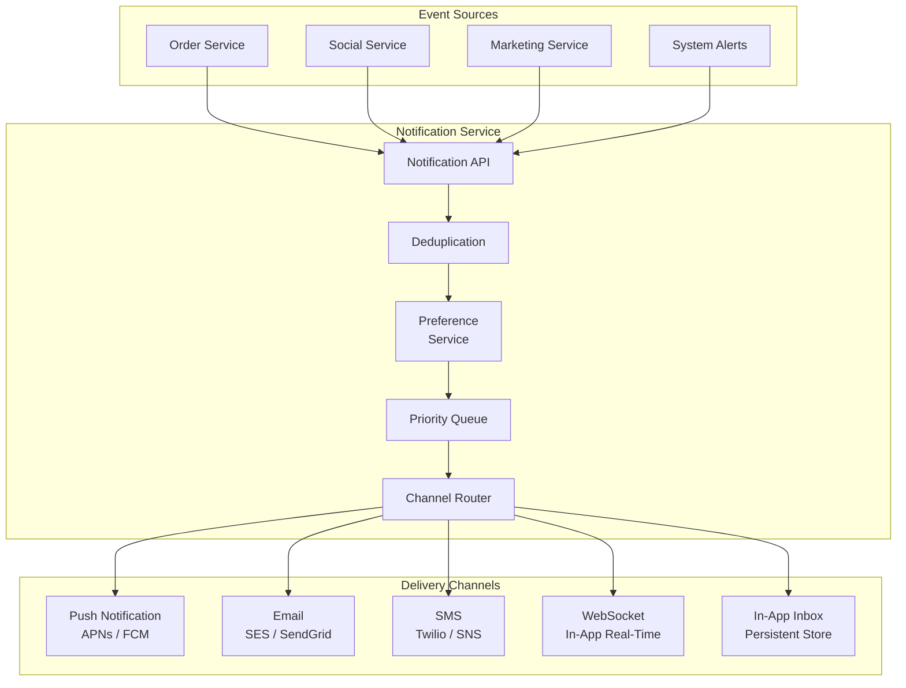
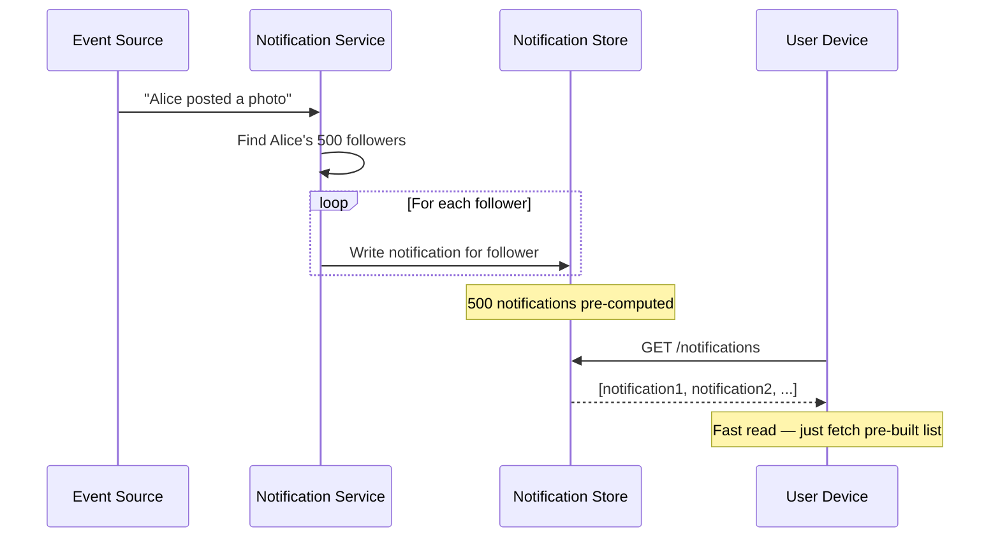
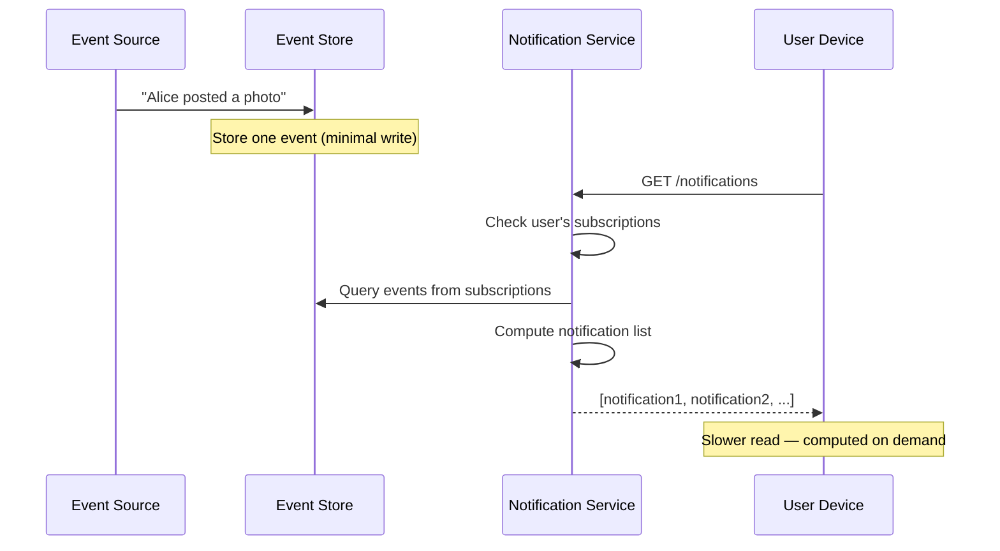
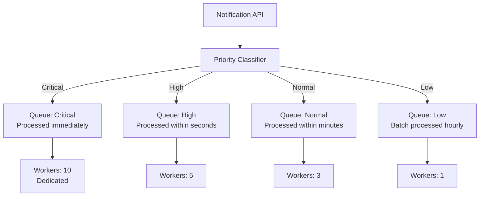
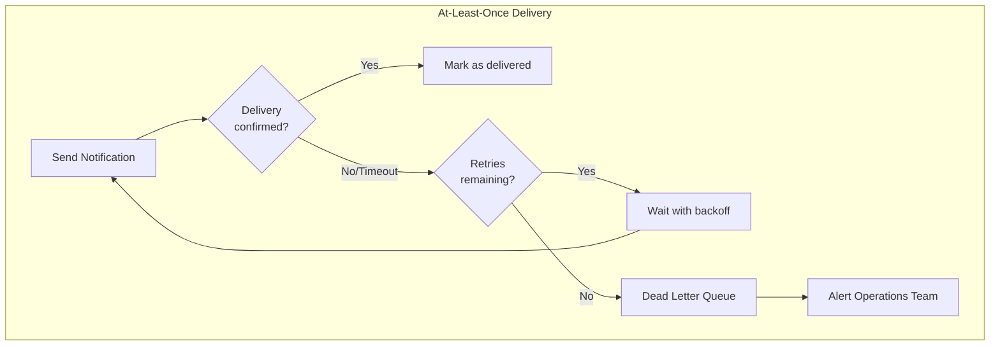

# Notification System Patterns

Notification systems appear simple until you consider the scale: Facebook sends billions of notifications daily. Each notification must be delivered to the right user, through the right channel, at the right time, exactly once, respecting user preferences. This page covers the patterns that make this work.

## High-Level Architecture



## Push vs Pull Notification Delivery

### Fanout-on-Write (Push Model)

When an event occurs, immediately compute and store notifications for all affected users. Reads are fast because notifications are pre-computed.



**Pros:** Fast reads, simple client logic
**Cons:** High write amplification (1 post = N notifications), wasted work if users never check, celebrity problem (1 post = millions of writes)

### Fanout-on-Read (Pull Model)

Store events minimally. When a user requests notifications, compute them on the fly by checking relevant event sources.



**Pros:** No wasted writes, handles celebrities well
**Cons:** Slow reads (computation on request), complex read logic

### Hybrid Approach (What Most Systems Use)

```python
class HybridNotificationService:
    """Push for normal users, pull for high-follower accounts."""

    FANOUT_THRESHOLD = 10_000  # Accounts with >10K followers use pull

    async def handle_event(self, event):
        """Route based on the source account's follower count."""
        source_user = await self.user_service.get(event.source_user_id)
        followers = await self.follower_service.get_followers(event.source_user_id)

        if len(followers) < self.FANOUT_THRESHOLD:
            # Push model: pre-compute for each follower
            await self._fanout_write(event, followers)
        else:
            # Pull model: store event, compute on read
            await self._store_event(event)

    async def get_notifications(self, user_id: str, limit: int = 50):
        """Merge pushed and pulled notifications."""
        # Get pre-computed notifications (push)
        pushed = await self.notification_store.get_for_user(user_id, limit)

        # Check for pull-based notifications from high-follower accounts
        subscriptions = await self.follower_service.get_following(user_id)
        high_follower_subs = [
            s for s in subscriptions
            if await self._is_high_follower(s)
        ]

        pulled = []
        if high_follower_subs:
            pulled = await self.event_store.get_events(
                source_users=high_follower_subs,
                since=self._last_check_time(user_id),
                limit=limit
            )

        # Merge, sort by timestamp, deduplicate
        all_notifications = pushed + pulled
        all_notifications.sort(key=lambda n: n.timestamp, reverse=True)
        return all_notifications[:limit]
```

## Delivery Channels

### Channel Comparison

| Channel | Latency | Reach | Cost | Rich Content | Offline | Rate Limit |
|---------|---------|-------|------|-------------|---------|------------|
| Push (APNs/FCM) | <1s | App installed | Free | Limited | Queued | OS-managed |
| WebSocket | <100ms | App open | Free | Rich | No | Self-managed |
| In-App Inbox | On open | App users | Free | Rich | Persistent | None |
| Email | Seconds-minutes | Any with email | $0.0001-0.001 | Very rich | Persistent | ISP limits |
| SMS | Seconds | Any with phone | $0.01-0.05 | Text only | Queued | Carrier limits |

### Multi-Channel Routing

```python
from dataclasses import dataclass
from enum import Enum
from typing import Optional


class Channel(Enum):
    PUSH = "push"
    EMAIL = "email"
    SMS = "sms"
    WEBSOCKET = "websocket"
    IN_APP = "in_app"


class Priority(Enum):
    LOW = 0       # Marketing, weekly digests
    NORMAL = 1    # Social (likes, comments)
    HIGH = 2      # Direct messages, mentions
    URGENT = 3    # Security alerts, payment issues
    CRITICAL = 4  # Account compromise, service outage


@dataclass
class Notification:
    id: str
    user_id: str
    type: str
    title: str
    body: str
    priority: Priority
    data: dict
    channels: list[Channel]
    idempotency_key: str
    created_at: str


class ChannelRouter:
    """Route notifications to appropriate channels based on priority and preferences."""

    # Priority determines which channels to use
    PRIORITY_CHANNELS = {
        Priority.CRITICAL: [Channel.SMS, Channel.PUSH, Channel.EMAIL, Channel.IN_APP],
        Priority.URGENT: [Channel.PUSH, Channel.EMAIL, Channel.IN_APP],
        Priority.HIGH: [Channel.PUSH, Channel.WEBSOCKET, Channel.IN_APP],
        Priority.NORMAL: [Channel.WEBSOCKET, Channel.IN_APP],
        Priority.LOW: [Channel.IN_APP],
    }

    async def route(self, notification: Notification) -> list[Channel]:
        """Determine which channels to use for this notification."""
        # Get user preferences
        prefs = await self.preference_service.get(notification.user_id)

        # Get channels for this priority level
        candidate_channels = self.PRIORITY_CHANNELS[notification.priority]

        # Filter by user preferences
        enabled_channels = [
            ch for ch in candidate_channels
            if prefs.is_channel_enabled(ch, notification.type)
        ]

        # Check user online status for real-time channels
        if Channel.WEBSOCKET in enabled_channels:
            if not await self.presence_service.is_online(notification.user_id):
                enabled_channels.remove(Channel.WEBSOCKET)
                # Fallback to push if user is offline
                if Channel.PUSH not in enabled_channels:
                    enabled_channels.append(Channel.PUSH)

        # Respect quiet hours (except critical)
        if notification.priority < Priority.CRITICAL:
            if prefs.is_quiet_hours():
                enabled_channels = [
                    ch for ch in enabled_channels
                    if ch in (Channel.IN_APP,)  # Only in-app during quiet hours
                ]

        return enabled_channels
```

## Priority Queues

Not all notifications are equal. A security alert should not wait behind 10,000 marketing emails.



```python
import heapq
import time
from dataclasses import dataclass, field
from typing import Any


@dataclass(order=True)
class PrioritizedNotification:
    priority: int  # Lower number = higher priority
    timestamp: float = field(compare=True)
    notification: Any = field(compare=False)


class NotificationPriorityQueue:
    """Priority queue with starvation prevention."""

    def __init__(self):
        self._queue: list[PrioritizedNotification] = []
        self._age_boost_interval = 60  # Boost priority every 60 seconds

    def enqueue(self, notification: Notification):
        item = PrioritizedNotification(
            priority=notification.priority.value,
            timestamp=time.time(),
            notification=notification
        )
        heapq.heappush(self._queue, item)

    def dequeue(self) -> Notification:
        """Dequeue highest priority, with age-based boosting."""
        if not self._queue:
            return None

        # Boost old items to prevent starvation
        now = time.time()
        for item in self._queue:
            age = now - item.timestamp
            boost = int(age / self._age_boost_interval)
            item.priority = max(0, item.priority - boost)

        heapq.heapify(self._queue)
        return heapq.heappop(self._queue).notification
```

## Deduplication with Idempotency Keys

Network failures cause retries. Retries cause duplicate notifications. Users hate seeing the same notification twice.

```python
import hashlib
import time


class NotificationDeduplicator:
    """Prevent duplicate notifications using idempotency keys."""

    def __init__(self, redis_client, dedup_window: int = 3600):
        self.redis = redis_client
        self.dedup_window = dedup_window  # seconds

    def generate_idempotency_key(self, notification: Notification) -> str:
        """Generate a deterministic key based on notification content."""
        content = f"{notification.user_id}:{notification.type}:{notification.data}"
        return hashlib.sha256(content.encode()).hexdigest()[:16]

    async def is_duplicate(self, idempotency_key: str) -> bool:
        """Check if this notification was already sent."""
        key = f"notif:dedup:{idempotency_key}"
        exists = await self.redis.exists(key)
        return bool(exists)

    async def mark_sent(self, idempotency_key: str):
        """Mark notification as sent (with TTL for cleanup)."""
        key = f"notif:dedup:{idempotency_key}"
        await self.redis.set(key, "1", ex=self.dedup_window)

    async def check_and_mark(self, idempotency_key: str) -> bool:
        """Atomic check-and-mark. Returns True if this is a new notification."""
        key = f"notif:dedup:{idempotency_key}"
        # SET NX returns True only if key did not exist
        is_new = await self.redis.set(key, "1", nx=True, ex=self.dedup_window)
        return bool(is_new)
```

## Delivery Guarantees

| Guarantee | Mechanism | Trade-off |
|-----------|-----------|-----------|
| At-most-once | Fire and forget, no retry | May lose notifications |
| At-least-once | Retry on failure, idempotency check | May send duplicates (mitigated by dedup) |
| Exactly-once | Transactional outbox + idempotency | Complex, higher latency |



## Rate Limiting Per User

Notification fatigue is real. If a user gets 100 notifications in a minute, they disable notifications entirely.

```python
from collections import defaultdict
from time import time


class NotificationRateLimiter:
    """Rate limit notifications per user per channel."""

    # Default limits
    LIMITS = {
        "push": {"per_minute": 5, "per_hour": 20, "per_day": 100},
        "email": {"per_hour": 3, "per_day": 10},
        "sms": {"per_hour": 2, "per_day": 5},
        "in_app": {"per_minute": 30, "per_hour": 200},
    }

    def __init__(self, redis_client):
        self.redis = redis_client

    async def check_rate_limit(
        self, user_id: str, channel: str
    ) -> tuple[bool, dict]:
        """Check if notification is within rate limits. Returns (allowed, info)."""
        limits = self.LIMITS.get(channel, {})
        now = time()

        for window, max_count in limits.items():
            _, duration = window.split("_")
            window_seconds = {"minute": 60, "hour": 3600, "day": 86400}[duration]

            key = f"rate:{user_id}:{channel}:{window}"
            count = await self.redis.get(key)
            current_count = int(count) if count else 0

            if current_count >= max_count:
                return False, {
                    "reason": f"Exceeded {window} limit ({max_count})",
                    "retry_after": window_seconds,
                }

        # All limits passed — increment counters
        for window, max_count in limits.items():
            _, duration = window.split("_")
            window_seconds = {"minute": 60, "hour": 3600, "day": 86400}[duration]
            key = f"rate:{user_id}:{channel}:{window}"

            pipe = self.redis.pipeline()
            pipe.incr(key)
            pipe.expire(key, window_seconds)
            await pipe.execute()

        return True, {"remaining": "within limits"}
```

## Preference Management

Users must control what notifications they receive and through which channels.

```python
from dataclasses import dataclass, field
from datetime import time as Time


@dataclass
class QuietHours:
    enabled: bool = False
    start: Time = Time(22, 0)   # 10 PM
    end: Time = Time(8, 0)      # 8 AM
    timezone: str = "UTC"


@dataclass
class ChannelPreference:
    push_enabled: bool = True
    email_enabled: bool = True
    sms_enabled: bool = False    # Opt-in only
    in_app_enabled: bool = True


@dataclass
class NotificationPreferences:
    user_id: str
    global_enabled: bool = True
    quiet_hours: QuietHours = field(default_factory=QuietHours)

    # Per-category preferences
    categories: dict[str, ChannelPreference] = field(default_factory=lambda: {
        "social": ChannelPreference(push_enabled=True, email_enabled=False),
        "messages": ChannelPreference(push_enabled=True, email_enabled=True),
        "marketing": ChannelPreference(push_enabled=False, email_enabled=True),
        "security": ChannelPreference(push_enabled=True, email_enabled=True, sms_enabled=True),
        "system": ChannelPreference(push_enabled=True, email_enabled=True),
    })

    # Muted entities (specific threads, users, groups)
    muted_entities: list[str] = field(default_factory=list)

    def is_channel_enabled(self, channel: str, category: str) -> bool:
        if not self.global_enabled:
            return False

        cat_prefs = self.categories.get(category, ChannelPreference())
        return getattr(cat_prefs, f"{channel}_enabled", False)

    def is_quiet_hours(self) -> bool:
        if not self.quiet_hours.enabled:
            return False
        from datetime import datetime
        import pytz
        tz = pytz.timezone(self.quiet_hours.timezone)
        now = datetime.now(tz).time()
        if self.quiet_hours.start < self.quiet_hours.end:
            return self.quiet_hours.start <= now <= self.quiet_hours.end
        else:  # Crosses midnight
            return now >= self.quiet_hours.start or now <= self.quiet_hours.end
```

## Notification Aggregation

Instead of sending 50 separate "X liked your photo" notifications, aggregate them into "X, Y, and 48 others liked your photo."

```python
class NotificationAggregator:
    """Aggregate similar notifications to reduce noise."""

    AGGREGATION_WINDOW = 300  # 5 minutes
    AGGREGATION_THRESHOLD = 3  # Aggregate after 3 similar notifications

    async def process(self, notification: Notification):
        """Buffer notifications and aggregate if threshold is met."""
        agg_key = self._aggregation_key(notification)

        # Add to buffer
        await self.redis.rpush(f"agg:{agg_key}", notification.to_json())
        await self.redis.expire(f"agg:{agg_key}", self.AGGREGATION_WINDOW)

        # Check buffer size
        buffer_size = await self.redis.llen(f"agg:{agg_key}")

        if buffer_size >= self.AGGREGATION_THRESHOLD:
            # Aggregate and send
            items = await self.redis.lrange(f"agg:{agg_key}", 0, -1)
            await self.redis.delete(f"agg:{agg_key}")
            aggregated = self._build_aggregated(items)
            await self.deliver(aggregated)
        else:
            # Schedule a flush after the window expires
            await self._schedule_flush(agg_key, delay=self.AGGREGATION_WINDOW)

    def _aggregation_key(self, notif: Notification) -> str:
        # Group by: user + notification type + target entity
        return f"{notif.user_id}:{notif.type}:{notif.data.get('target_id', '')}"

    def _build_aggregated(self, items: list) -> Notification:
        # "Alice, Bob, and 3 others liked your photo"
        actors = [item.data["actor_name"] for item in items]
        if len(actors) <= 2:
            actor_text = " and ".join(actors)
        else:
            actor_text = f"{actors[0]}, {actors[1]}, and {len(actors) - 2} others"

        return Notification(
            title=f"{actor_text} liked your photo",
            body="",
            # ... other fields from the first notification
        )
```

## Cross-References

- [Communication Patterns](/system-design/patterns/communication-patterns) — WebSocket, SSE, long polling for real-time delivery
- [Message Queues](/system-design/message-queues/) — queue infrastructure for notification processing
- [Rate Limiting](/system-design/distributed-systems/rate-limiting) — rate limiting algorithms
- [Event-Driven vs Request-Driven](/system-design/patterns/event-vs-request) — event-driven notification triggering
- [Scalability Patterns](/system-design/patterns/scalability-patterns) — scaling notification fanout

---

*A notification system is a communication contract with your users. Break it — by sending too many, too few, or duplicates — and they will revoke the privilege entirely. Respect preferences, aggregate aggressively, and always provide an easy way to adjust or disable.*

## Real-World Examples

::: tip Facebook/Meta
Facebook uses a **hybrid fanout model** for notifications. For regular users (under 5,000 friends), they use fanout-on-write — precomputing notifications when an event occurs. For celebrities and pages with millions of followers, they use fanout-on-read to avoid writing millions of notification records for a single post. This hybrid approach handles their scale of billions of notifications per day.
:::

::: tip LinkedIn
LinkedIn uses **notification aggregation** aggressively. Instead of sending "Person A viewed your profile," "Person B viewed your profile," "Person C viewed your profile" as three separate notifications, they aggregate into "3 people viewed your profile." Their aggregation engine buffers similar notifications within a 5-minute window and merges them, reducing notification volume by over 80%.
:::

::: tip Uber
Uber uses **priority-based notification routing**. A ride arrival notification is critical (push notification with sound, sent immediately), while a promotional discount is low priority (in-app inbox, batched with other promotions). They route each notification through different channels and priority queues, ensuring that time-sensitive notifications are never delayed by marketing messages.
:::

## Interview Tip

::: tip What to say
"A notification system has three key challenges: delivery, deduplication, and user respect. For delivery, I'd use a priority queue — security alerts should never wait behind marketing emails. For deduplication, I'd use Redis with idempotency keys (SET NX with TTL) to ensure exactly-once delivery despite retries. For user respect, I'd implement per-user rate limiting per channel (max 5 pushes per hour, 3 emails per day) and quiet hours. The architecture is event-driven: services emit events to a message queue, the notification service checks user preferences, deduplicates, and routes to the right channel. Facebook's hybrid fanout approach — push for normal users, pull for celebrities — is the pattern I'd reference for handling extreme fan-out."
:::
